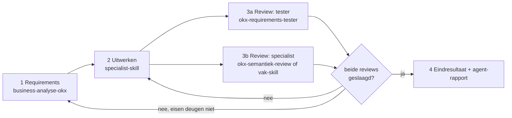

# OKx product-flow

Geketende stappen; geen stap overslaan. De reviews draaien in **verse subagent-contexten**, onafhankelijk van de uitwerkende context.

## De keten



1. **Requirements.** Persona [`business-analyse-okx`](../business-analyse-okx/SKILL.md) stelt samen met de mens het requirements-document op: genummerde, toetsbare eisen met acceptatiecriteria. Zonder vastgestelde eisen geen uitwerking.
2. **Uitwerken.** De stap begint met de skill-check uit [`skill-first`](../../../.cursor/rules/skill-first.mdc): eerst het manifest ([.agents/skills.json](../../skills.json)) controleren op een passende skill; ontbreekt die, dan staat dat expliciet in de PR-beschrijving en wordt het gat als issue overwogen. Daarna wordt het deliverable uitgewerkt met de passende specialist-skill: [`mbo-informatie-modelleur`](../mbo-informatie-modelleur/SKILL.md) voor informatiemodellen en payloads, [`okx-oeapi-scenario-uitwerking`](../okx-oeapi-scenario-uitwerking/SKILL.md) voor scenario's, het command `ontwerp-document` voor ontwerpen, `adr-opstellen` voor ADR's.
3. **Onafhankelijke review, eigen sporen, verse contexten.** Geef elke reviewer alleen het requirements-document, het deliverable en zijn skill; niet de makende conversatie.
   - **Tester**: [`okx-requirements-tester`](../okx-requirements-tester/SKILL.md) toetst eis-voor-eis.
   - **Specialist**: [`okx-semantiek-review`](../okx-semantiek-review/SKILL.md) voor de vakinhoudelijke en semantische toets; bij tooling- of structuurwerk kan [`architecture-review`](../architecture-review/SKILL.md) de specialist zijn.
   - **Schrijfstijl**: [`okx-schrijfstijl-review`](../okx-schrijfstijl-review/SKILL.md) toetst elk tekstueel deliverable op de schrijfstijl-rule en de stijl-lessen; blokkerend op leestekens, kern en aard-niet-stand.
4. **Iteratielus.** Alle reviews moeten slagen. Bevindingen terug naar stap 2; deugen de eisen zelf niet, terug naar stap 1. Maximaal drie iteraties, daarna escaleren naar de mens met de openstaande bevindingen.
5. **Eindresultaat.** (a) Het requirements-document, (b) het uitgewerkte deliverable, (c) het **agent-rapport** in de PR-beschrijving (GitHub is de bron; geen extra bestanden).

## Agent-rapport (format)

Kort, in de PR-beschrijving:

```markdown
### Agent-rapport
- Keten: requirements -> uitwerking -> review (tester, specialist), N iteraties.
- Reviewbevindingen en afhandeling: <per bevinding een regel: bevinding -> opgelost hoe / bewust open>.
- Restpunten: <open vragen voor de reviewer>.
```

## Kaders

- Governance: `.cursor/rules/okx-governance.mdc` (issues, PR's, alleen OKx-team merget).
- Stijl: `.cursor/rules/schrijfstijl.mdc`.
- Reviews niet door de maker: de reviewende subagent krijgt een schone opdracht zonder de maak-context.
