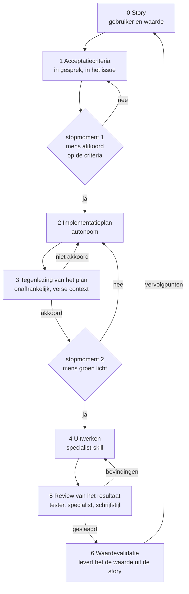

# OKx product-flow

Geketende stappen; geen stap overslaan. Elke iteratie begint bij waarde voor een benoemde gebruiker en eindigt met de controle of die waarde geleverd is. De reviews draaien in **verse subagent-contexten**, onafhankelijk van de uitwerkende context.

Het doel is een eerste iteratie die waarde levert, niet een volmaakt resultaat.

## De keten


```mermaid
flowchart TD
    S["0 Story<br/>gebruiker en waarde"] --> A["1 Acceptatiecriteria<br/>in gesprek, in het issue"]
    A --> G1{"stopmoment 1<br/>mens akkoord<br/>op de criteria"}
    G1 -- "nee" --> A
    G1 -- "ja" --> P["2 Implementatieplan<br/>autonoom"]
    P --> T["3 Tegenlezing van het plan<br/>onafhankelijk, verse context"]
    T -- "niet akkoord" --> P
    T -- "akkoord" --> G2{"stopmoment 2<br/>mens groen licht"}
    G2 -- "nee" --> P
    G2 -- "ja" --> U["4 Uitwerken<br/>specialist-skill"]
    U --> R["5 Review van het resultaat<br/>tester, specialist, schrijfstijl"]
    R -- "bevindingen" --> U
    R -- "geslaagd" --> W["6 Waardevalidatie<br/>levert het de waarde uit de story"]
    W -- "vervolgpunten" --> S
```

### 0. Story: gebruiker en waarde

Elk issue opent met een story in de vorm: **als `<gebruiker>` wil ik `<X>` met als doel dat `<waarde>`**. Zonder benoemde gebruiker en benoemde waarde begint het werk niet, want dan is er bij de oplevering niets om aan af te meten.

De gebruiker is een echte rol, geen systeem en geen "wij". Kies hem uit de [lezerspersona's](../../personas/README.md) waar dat past, en toets of die rol dit werkelijk leest of gebruikt: een document in meta kan niet de programmamanager als gebruiker hebben, want die leest geen repository.

Een werkwijze-issue krijgt wel een story en **geen** plek in de requirementsboom: de boom beschrijft de OKx-keten en niet onze eigen werkplek. De milestone is dan herleidbaar naar het maakvermogen in plaats van naar een doel of epic.

### 1. Acceptatiecriteria, in gesprek en in het issue

De criteria komen tot stand in gesprek met de opdrachtgever: gerichte vragen met opties en een aanbeveling per optie, niet een document ter goedkeuring. Ze landen in het **issue**, niet in een los bestand, want het issue is de werkbrief.

Een criterium is toetsbaar: twee mensen komen er los van elkaar tot hetzelfde oordeel over. Per criterium ten minste een testgeval in de drieslag gegeven, wanneer, dan.

**Stopmoment 1.** Zonder akkoord op de criteria geen plan en geen uitwerking.

**Lichte vorm.** Een kleine taak volstaat met twee regels criteria zonder gespreksronde. Klein betekent: geen deliverable, hoogstens een enkel bestand, en geen keuze in de oplossingsrichting. Een typefout, een dode verwijzing, een losse naamswijziging. Alles daarbuiten volgt de zware vorm.

### 2. Implementatieplan

Autonoom opgesteld, zodra de criteria vaststaan. Het plan noemt per stap wat er gebeurt, welke bestanden het raakt, in welke volgorde, en hoe elk criterium wordt nagerekend. Botst het met openstaand werk, dan staat die afhankelijkheid erin.

### 3. Tegenlezing van het plan

Een onafhankelijke tegenlezer beoordeelt het plan in een **verse context**, op het sterkste beschikbare model met hoge inspanning, en krijgt alleen het issue met de criteria en het plan. Niet de makende conversatie. De tegenlezer kiest zijn eigen skills.

**Afkeuren mag op precies vier gronden:**

1. Een criterium dat niet toetsbaar is, of dat geen waarde voor de benoemde gebruiker beschrijft.
2. Een plan dat de waarde uit de story niet levert.
3. Een oplossingsrichting die de waarde ondergraaft of de volgende iteratie blokkeert.
4. Een increment dat te groot is om in een keer waarde te leveren.

**Afkeuren mag niet op:**

- Volledigheid buiten de criteria, of extra's die de criteria niet vragen.
- Smaakverschil in vorm, waar de schrijfstijl-rule al over gaat.
- Het ontbreken van volmaaktheid. Goed genoeg voor een waardevolle eerste iteratie volstaat.

De tegenlezer geeft een expliciet oordeel, akkoord of niet akkoord, met per bevinding de grond, de plek in het plan en wat er concreet aan moet veranderen.

### 4. Stopmoment 2: groen licht

Na een geslaagde tegenlezing vraagt de agent de opdrachtgever om groen licht. Zonder dat akkoord begint de uitvoering niet. Raakt het plan iets onomkeerbaars of iets buiten de eigen repository, dan wordt dat op dit moment apart benoemd.

### 5. Uitwerken en de review van het resultaat

De maker kiest vooraf de lezerspersona bij het deliverable; afleiden uit de context mag, de keuze wordt ter controle benoemd in de PR-beschrijving of op een stopmoment. De stap begint met de skill-check uit [`skill-first`](../../../.cursor/rules/skill-first.mdc): eerst het manifest ([.agents/skills.json](../../skills.json)) controleren op een passende skill; ontbreekt die, dan staat dat expliciet in de PR-beschrijving en wordt het gat als issue overwogen. Daarna wordt het deliverable uitgewerkt met de passende specialist-skill: [`mbo-informatie-modelleur`](../mbo-informatie-modelleur/SKILL.md) voor informatiemodellen en payloads, [`okx-oeapi-scenario-uitwerking`](../okx-oeapi-scenario-uitwerking/SKILL.md) voor scenario's, het command `ontwerp-document` voor ontwerpen, `adr-opstellen` voor ADR's. Voor scripts en valideerbare definities stelt [`okx-test-persona`](../okx-test-persona/SKILL.md) eerst de testgevallen op en implementeert ze vóór de productiecode.

Daarna de **onafhankelijke review, eigen sporen, verse contexten**. Geef elke reviewer alleen het issue met de criteria, het deliverable en zijn skill; niet de makende conversatie.

- **Tester**: [`okx-requirements-tester`](../okx-requirements-tester/SKILL.md) loopt de testgevallen geval-voor-geval af; bij scripts en valideerbare definities zijn dat de gevallen van [`okx-test-persona`](../okx-test-persona/SKILL.md).
- **Specialist**: [`okx-semantiek-review`](../okx-semantiek-review/SKILL.md) voor de vakinhoudelijke en semantische toets; bij tooling- of structuurwerk kan [`architecture-review`](../architecture-review/SKILL.md) de specialist zijn.
- **Schrijfstijl**: [`okx-schrijfstijl-review`](../okx-schrijfstijl-review/SKILL.md) toetst elk tekstueel deliverable op de schrijfstijl-rule en de stijl-lessen; blokkerend op leestekens, kern en aard-niet-stand.

### 6. Waardevalidatie na oplevering

Na de uitwerking volgt de toets of het geleverde de waarde uit de story werkelijk levert, zoals begroot. In een verse context, met de story en de criteria als maat. De uitkomst is waarneembaar: geleverd zoals begroot, of een lijst vervolgpunten. Die vervolgpunten worden kleine iteraties, elk opnieuw met een story en criteria; dat is geen terugval maar de normale gang.

## De lus is begrensd

Ten hoogste **drie ronden** tussen agent en tegenlezer, en ten hoogste drie iteraties in de review van het resultaat. Daarna escaleren naar de opdrachtgever met de openstaande bevindingen, met per bevinding of het een blokkade is voor een eerste iteratie die waarde levert, of een punt voor de volgende. Deugen de criteria zelf niet, dan terug naar stap 1 in plaats van door te bouwen op een slecht criterium.

## Opleveren: maak het leesbaar voor de reviewer

Een review die niet gelezen wordt telt niet. Twee regels, allebei uit de praktijk.

**Zet de leesbare uitgave bovenaan in de PR-beschrijving.** Bij een visueel deliverable, zoals een deck of een plaat, is de eerste regel een directe link naar de PDF of de afbeelding, niet naar de bron. De lead architect opende de pull request, kwam in de diffweergave terecht en vroeg letterlijk: geef mij gewoon even die PDF. Een PDF in een GitHub-repository opent in de browser; een `.md` of een `.pptx` doet dat niet.

**Een reviewvraag benoemt waar de twijfel zit.** "Willen jullie meelezen" levert instemming op. Stel drie tot vijf genummerde vragen die elk een concreet punt raken, en zeg welke vraag de belangrijkste is. Zet er bij dat er al eerder onjuistheden uit een reviewronde kwamen, met hoeveel: dat nodigt uit om te zoeken in plaats van goed te keuren.

## De titel opent met het gebied

Een titel wordt gelezen in een lijst van tientallen, naast werk van anderen en naast werk van maanden terug. Dus staat het gebied vooraan, dan het onderdeel, dan wat er verandert:

```text
<gebied>[, <onderdeel>]: <wat er verandert>

Informatiemodel voorbeeld, fase 3: de keuze rijpt, en de aanmeldroute benoemd
^^^^^^^^^^^^^^^^^^^^^^^^  ^^^^^^^  ^^^^^^^^^^^^^^^^^^^^^^^^^^^^^^^^^^^^^^^^^
waar het over gaat        welk deel  wat een lezer merkt
```

Het gebied is een naam die een lezer in de repository terugvindt: `Informatiemodel voorbeeld`, `Sectorketen`, `Begrippenlijst`, `Agent-harnas`, `Presentaties`. Het is geen afkorting en geen scriptnaam. Een titel als "Generator: elke vraag komt in het document" noemt wel het onderdeel maar niet het gebied, en wie het werk niet volgt kent die generator niet.

Zelfde vorm voor een issue en voor een pull request, zodat de twee naast elkaar te lezen zijn. Houd de titel onder de tachtig tekens, want GitHub kapt een lijst daar af.

## De pull request-beschrijving (vorm)

Elke pull request opent met een samenvatting van **hoogstens vijftien zinnen**, leesbaar voor iemand die het werk niet heeft gevolgd. Daarin staan drie dingen:

| | |
|---|---|
| Context | Het sluitwoord met het issuenummer: `Closes #123` op een eigen regel, of `See also #456` als de pull request het issue alleen raakt. Dat woord is syntaxis die GitHub leest, dus zonder faalt de controle en blijft het issue openstaan |
| Opgeleverd | Een **genummerde lijst of bullets**, kort, met per regel een link naar het document of de plaat zelf. Geen proza |
| Tegenlezing | Of de product-flow is doorlopen, en waar hij is afgeweken |

**Wat is opgeleverd, is een lijst en geen verhaal.** Een reviewer telt af wat er ligt; daar helpt een alinea niet bij. Heeft de oplevering structuur, bijvoorbeeld meer dan een handvol onderdelen, lagen die op elkaar steunen of onderdelen die naar elkaar verwijzen, dan **hoort er een visuele uitsplitsing bij**: een mermaid-diagram, een ascii-boom of een tabel. Dat is werkafspraak 3 uit `AGENTS.md`, show don't tell, en voor de vorm van zo'n beeld gelden de UX-skills (`ui-ux-pro-max`, en `okx-presentatie-visueel` als adaptatie daarvan). GitHub rendert mermaid rechtstreeks in een pull request.

Daaronder een eigen kopje **Review-instructie**, genummerd, zoals de leeswijzer voor leveranciers in [Npuls-OKx/Public#104](https://github.com/Npuls-OKx/Public/pull/104). Die vertelt **wat van het opgeleverde werk een mens moet beoordelen**: per regel een link naar wat hij opent, met een zin over wat hij daar weegt, in de volgorde waarin hij het leest. Sluit af met wat hij kan overslaan.

Dat laatste is de regel die het vaakst wordt vergeten. Bij een gegenereerd deliverable zijn de bron en het product twee verschillende dingen: een regeltabel, een JSON-bron en de scripts eromheen zijn het materiaal waarmee het eindproduct is gemaakt, en de reviewer hoort het eindproduct te beoordelen.

```markdown
## Samenvatting

Closes #123

<een of twee zinnen: waarom dit er is>

**Opgeleverd**

1. [<het product>](link) <een halve regel>
2. [<het tweede stuk>](link) <idem>

<bij een oplevering met structuur: een mermaid-diagram of ascii-boom>

Product-flow: <doorlopen, of waar afgeweken en waarom>.

## Review-instructie

Wat hiervan een mens moet beoordelen, in leesvolgorde:

1. [<het eindproduct>](link) <wat de reviewer daar weegt>
2. [<het tweede stuk>](link) <idem>

Bronmateriaal dat geen review vraagt: <de bestanden waarmee het product is gemaakt>.

## Acceptatiecriteria

| Criterium | Stand | Hoe te zien |
|---|---|---|
| 1 <kort> | Gehaald | `test_given_X_when_Y_then_Z` |

## Openstaande punten

<vragen, gevonden fouten, impediments; per punt of er een issue van is gemaakt>

## Nieuwe issues

<wat hiervan een eigen issue is geworden, met nummer>

### Agent-rapport

<zie hieronder>
```

De acceptatiecriteria met hun testuitkomst staan er altijd, maar tellen niet mee in de vijftien zinnen; anders verdringt de verantwoording de samenvatting.

## Een issue dat de agent zelf aanmaakt

Een agent mag een issue aanmaken voor wat hij onderweg vindt: een openstaande vraag, een fout, een belemmering. Drie regels daarbij.

1. **Alleen in `Npuls-OKx/meta`.** Public draagt releaseartefacten en krijgt geen issues uit een agentloop.
2. **Altijd het label `gevondenDoorAI`.** Daarmee is in een oogopslag te zien wat uit het werk zelf komt en wat een mens heeft ingebracht.
3. **Dezelfde leesbare vorm als elk ander issue**: een user story met gebruiker en waarde, context met de vindplaats (welk bestand, welke pull request, welke regel), een kort en waar mogelijk visueel doel, en acceptatiecriteria met testgevallen.

De vindplaats is wat zo'n issue bruikbaar maakt. "Gevonden bij het herschrijven van de leeruitkomsten in fase 1, beeld F1-08" laat een lezer het nalopen; "kwam ik tegen" niet.

## Agent-rapport (format)

Kort, in de PR-beschrijving. GitHub is de bron; geen extra bestanden.

```markdown
### Agent-rapport
- Lezerspersona: <rol, en waarom die>.
- Skill-check: <gekozen skill, of het gat met de reden>.
- Criteria: akkoord op <datum of verwijzing naar het issue>.
- Plan: <aantal versies>; tegenlezing <aantal ronden>, uitkomst <akkoord>.
- Review van het resultaat: tester, specialist, schrijfstijl; <N> iteraties.
- Bevindingen en afhandeling: <per bevinding een regel: bevinding -> opgelost hoe / bewust open>.
- Waardevalidatie: <geleverd zoals begroot, of de vervolgpunten>.
- Restpunten: <open vragen voor de reviewer>.
```

## Welke templates welke vorm dragen

De issue-templates in `.github/ISSUE_TEMPLATE/` volgen deze keten:

| Template | Vorm | Waarom |
|---|---|---|
| `feature-uitwerking.md` | zwaar: story, criteria, testgevallen | Werk met een deliverable |
| `okx-specificatie-wijziging.md` | zwaar: story, criteria | Een wijziging met impact op model, ADR of specificatie |
| `correctie-documentatie.md` | licht: wat er mis is en wat er daarna klopt | Een typefout of een dode verwijzing vraagt geen gespreksronde |
| `meeting-follow-up.md` | intake | Legt actiepunten vast; elk actiepunt dat werk wordt krijgt zijn eigen issue met story en criteria |
| `adr-voorstel.md` | besluit | Beschrijft een keuze, geen werk |
| `vraag-verduidelijking.md` | vraag | Beschrijft een vraag, geen werk |

## Kaders

- Governance: `.cursor/rules/okx-governance.mdc` (issues, PR's, alleen OKx-team merget).
- Stijl: `.cursor/rules/schrijfstijl.mdc`.
- Reviews niet door de maker: de reviewende subagent krijgt een schone opdracht zonder de maak-context.
