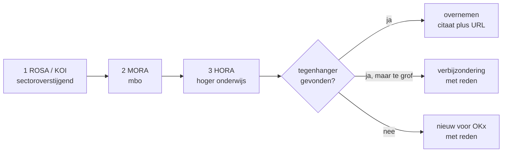

# Referentiearchitectuur eerst

Begrippen luisteren nauw. Een zelfbedachte definitie die naast een bestaande staat kost later meer dan het onderzoek nu. Deze skill legt de volgorde vast: eerst kijken wat er al is, dan pas zelf formuleren. Dat mag meer opzoekwerk kosten.

## De volgorde

1. **ROSA en het [Kernmodel Onderwijsinformatie (KOI)](https://rosa.wikixl.nl/index.php/Kernmodel_Onderwijsinformatie)** zijn sectoroverstijgend en gaan voor. KOI definieert onder meer `onderwijsaanbod`, `onderwijsdeelname`, `onderwijsdeelnemer`, `onderwijseenheid`, `onderwijsmedewerker`, `onderwijsresultaat` en `leerresultaat`.
2. **[MORA](https://mora.mbodigitaal.nl/)** voor wat mbo-specifiek is: het kwalificatiekader, de examenketen, de onderwijscatalogus.
3. **[HORA](https://hora.surf.nl/)** voor het hoger onderwijs, via het lopende initiatief klus 53 (Alignment MORA en HORA, MBO-Digitaal).
4. Pas daarna een eigen OKx-formulering.

## Drie uitkomsten, geen vierde

Per begrip en per kader legt de agent een van deze drie vast. Een lege cel bestaat niet.

| Uitkomst | Wat je vastlegt |
|---|---|
| Tegenhanger gevonden | De definitie **letterlijk**, met de URL van de pagina en de datum waarop je hem ophaalde |
| `geen tegenhanger gevonden` | Dat je hebt gezocht en niets vond, met de zoekterm die je gebruikte |
| `nog niet onderzocht` | Dat je nog niet hebt gekeken |

Het verschil tussen de tweede en de derde is het punt van deze skill. Zonder dat onderscheid kan niemand zien of een gat een bevinding is of luiheid.

## Harde regels

1. **Geen mapping zonder geopende bron.** Een plausibele tegenhanger bedenken is de faalmodus die deze skill uitsluit. Heb je de pagina niet gehaald, dan is de waarde `nog niet onderzocht`.
2. **Citeer letterlijk.** De definitietekst van de bron gaat woordelijk in de lijst, met URL en ophaaldatum, zodat een reviewer de mapping kan controleren zonder de bron te openen.
3. **Overnemen boven herformuleren.** Dekt de bestaande definitie de lading, neem hem dan over en verzin geen eigen variant. Een eigen variant naast een bestaande is een nieuw begrip, geen verduidelijking.
4. **Een verbijzondering is een bevinding, geen gat.** Gaat OKx dieper dan het kader, leg dan vast van welk begrip het een verbijzondering is en waarom OKx daar verder gaat. Dat is materiaal voor de signalering richting het kader.
5. **Nieuw is de laatste optie, met reden.** Een begrip dat in geen enkel kader voorkomt krijgt de herkomst `nieuw voor de solution-laag`, met een zin waarom het niet bestaat.
6. **De mens accepteert of verwerpt.** De agent levert voorstellen met bewijs. Een mapping wordt niet stil vastgelegd.

## Wat OKx wel en niet in de kaders vindt

Ervaring uit de begrippenlijst (#223, #224), als startpunt en niet als vervanging van het zoeken:

| Wel in de kaders | Waar |
|---|---|
| Onderwijsaanbod, onderwijsresultaat, onderwijsdeelname, onderwijseenheid, onderwijsdeelnemer, onderwijsmedewerker, leerresultaat | KOI |
| Kwalificatiedossier, kwalificatie, kerntaak, werkproces | MORA |

| Nog geen tegenhanger gevonden | Waarom OKx het toch nodig heeft |
|---|---|
| De specificatielaag, los van het aanbod | OKx scheidt het herbruikbare ontwerp van het ingeplande aanbod; de kaders kennen die scheiding niet als eigen begrip |
| De resultaatstructuur met wegingen | Nodig om te bepalen of losse resultaten optellen tot een kwalificatie |
| De leeruitkomst als verbindende sleutel | KOI kent leerresultaat als uitkomst achteraf, niet de beoogde leeruitkomst vooraf |

## Werkwijze

1. Verzamel de begrippen die je gaat vastleggen.
2. Haal per begrip de kaderpagina op. Zoek op het Nederlandse begrip en op de voor de hand liggende synoniemen; noteer de zoekterm bij een negatief resultaat.
3. Leg per kader een van de drie uitkomsten vast, met citaat, URL en ophaaldatum.
4. Bepaal de herkomst: `overgenomen`, `verbijzondering van <begrip>`, of `nieuw voor de solution-laag`.
5. Formuleer pas nu een eigen definitie, en alleen waar stap 3 niets opleverde of waar OKx aantoonbaar verbijzondert.
6. Leg de uitkomst ter acceptatie voor.

## Relatie tot andere skills

Deze skill gaat vooraf aan [`mbo-informatie-modelleur`](../mbo-informatie-modelleur/SKILL.md) en aan het opstellen van een begrippenlijst. In de [product-flow](../okx-product-flow/SKILL.md) hoort hij bij stap 2, vóór de uitwerking, en de semantiekreviewer in stap 3 toetst erop.
