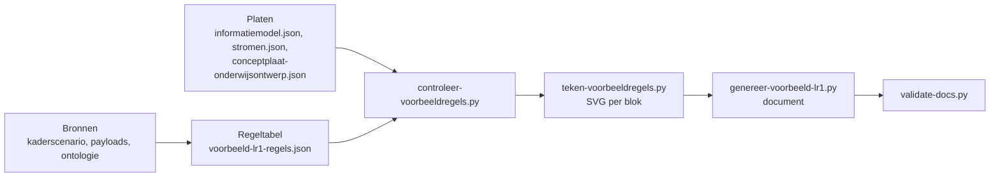

# Een persona in het informatiemodel

Het voorbeeld is een leeshulp die feedback ophaalt op het informatiemodel, geen ontwerp. Het beslist niets over het model; elke regel wijst naar iets dat op een plaat staat, en waar plaat en bron elkaar tegenspreken staat een vraag. Uitgewerkt voor Jochem in `architecture/model/informatiemodel/voorbeeld-leerroute-1-jochem.md` (Public #106, meta #243).

## De keten



Volgorde bij elke wijziging, altijd volledig:

```
python3 scripts/controleer-voorbeeldregels.py            # 0 bevindingen, anders eerst herstellen
rm -f architecture/model/informatiemodel/img/regels/*.svg
python3 scripts/teken-voorbeeldregels.py
python3 scripts/genereer-voorbeeld-lr1.py                # waarschuwt voor vragen buiten de zeven
python3 scripts/validate-docs.py architecture/model/informatiemodel/voorbeeld-leerroute-1-jochem.md
python3 -W error::ResourceWarning -m unittest discover -s tests
```

De platen komen uit het ArchiMate-model en worden alleen gelezen: `genereer-informatiemodel-doc.py` (informatiemodelplaat), `exporteer-archimate-view.py --mapping` (pijlen van hoofdplaat v1.7), `exporteer-conceptplaat.py` (view "Informatiemodel Onderwijsontwerp"). Raak nooit een `.archimate`-bestand aan.

## De regeltabel

Kop: `model` (commits waartegen is gecontroleerd), `fasen` (nummer, naam, MORA-hoofdproces, bron, stappen, verwacht, link naar de fasekop in het kaderscenario), `rollen` (gesloten lijst), `toestanden` (elk met bron), `scope_uitzonderingen` (objecttype buiten scope dat het voorbeeld toch toont, met motivering), `koppelingen` ("Van > Naar" naar koppeling-ID).

Elke regel is een fragment van een plaat bij een processtap:

| Veld | Regel |
|---|---|
| `id` | `R<fase>-<nnn>`, stabiel: eenmaal uitgegeven verandert het niet, ook niet bij invoegen; het staat rechtsboven in het object en in het regelregister |
| `stap` | letterlijk uit de stappenlijst van de fase; stappen komen uit het kaderscenario (instellingsreis en happy flow), niet uit scenario-uitwerkingen |
| `soort` | `ontstaat` (rol, stap, objecttype met instantie), `verandert` (zelfde, met `toestand` uit de lijst), `stroomt` (`van`, `naar`, `pijl` als relatie-id uit stromen.json of "geen pijl op de hoofdplaat", `koppeling`) |
| `objecttype` | plaatnaam letterlijk, witruimte genormaliseerd |
| `instantie` | de waarde voor de persona, leesbaar; één instantie per objecttype toont het type, niet het aantal |
| `relatie` | de relatie van de plaat waarmee dit object aan een ander object in dezelfde stap hangt: `soort`, `van`, `naar`, `label` (alleen als de plaat er een heeft, letterlijk), `nesting` (alleen aggregatie of compositie) |
| `relaties` | verdere relaties van de plaat vanaf dit object, als verwijzing op het object; met `instantie` van het andere eind waar dat helpt (toetsonderdeel naar de leeruitkomst die het aftikt) |
| `verdieping` | zoomt in op een regel erboven binnen dezelfde stap; eigen blok en beeld |
| `plaat` | `informatiemodel` (standaard) of `onderwijsontwerp`: de conceptplaat, alleen in een verdieping of in een stroomt-regel, hooguit een handvol objecten, geen attributen; paars in het beeld |
| `aanname` | waar de bron zwijgt; gestippeld in het beeld |
| `bron` | bestand en regelnummer (`leerroute-1-regulier.md, r1046`), payload-id, ontologie met versie, of "geen bron, keuze van het voorbeeld"; het register maakt er links van |
| `zin` | één zin, uit het kaderscenario waar die er is; laag houden |
| `vraag` | alleen waar plaat en bron elkaar tegenspreken of de plaat iets mist; het document toont er zeven |

Wat de controle weigert, hoort niet in het voorbeeld: een objecttype dat niet op de plaat staat, een relatie die er niet als drietal (soort, van, naar) staat, een label dat afwijkt, nesting op een associatie, een rol of stap buiten de lijst, een pijl die niet op de hoofdplaat staat, een tweede ontstaat-regel voor hetzelfde objecttype, een objecttype in een andere fase dan verwacht. Mist de plaat iets dat de bron wel kent, dan is dat een `vraag` voor de modelronde, geen verzonnen label.

## Beelden

De renderer tekent per blok (fase, stap, rol, verdieping) één SVG in ArchiMate-kleur: geel voor rol, processtap en object, blauw voor component, grijs voor een scope-uitzondering, gestippeld voor een aanname. Nesting is een container; een relatielijn loopt alleen naar het buurobject (ruit bij aggregatie, open pijlpunt bij specialisatie, gelabelde lijn bij associatie), elke andere relatie staat als verwijzing op het object. Bij ontstaat worden brede rijen een kolom; bij stroomt blijven de objecten naast elkaar, verbonden door de stippellijn van de pijl, en loopt de keten door op een volgende rij als hij te breed wordt. Brede kinderrijen worden een stapel. Een objecttype van de conceptplaat is paars; een conceptverdieping heeft bovendien een gestippelde rand en de chip "conceptplaat: Informatiemodel Onderwijsontwerp". Het document zet onder elk beeld de regel-ID's.

Bekijk het beeld zelf voordat je het meldt: `soffice --headless --convert-to png` in de scratchpad, en zet het beeld voor de gebruiker op een branch met een GitHub-link (bestanden sturen werkt niet in de container).

## Inhoudelijke afspraken uit de uitwerking van Jochem

- De leeruitkomst is de sleutel: specificaties, toets- en examenonderdelen en de resultaatstructuur verwijzen ernaar. Zij is de invulling van de instelling (waar en hoe de student het laat zien), niet een kopie van de kerntaak.
- Fase 1 gaat als gelinkt geheel naar de catalogus: leeruitkomsten met hun skills, specificatiestructuur (met keuzedeelruimte en regelset, en het onderwijsontwerp van de conceptplaat) en resultaatstructuur, dat is de opleiding zoals ontworpen.
- Een keuzedeel is een eigen programmaspecificatie, gelijksoortig vormgegeven maar los van de opleiding; in de opleiding zit alleen de keuzedeelruimte met de regelset. Welk keuzedeel de ruimte vult, bepaalt het studentkeuzesysteem later.
- Het examenplan blijft buiten de uitwisseling; de summatieve resultaatstructuur is zijn oorsprong en gaat wel mee. Het cohort hangt aan die structuur.
- Skills: CompetentNL (ontologie 2.1.0) als verdieping van de leeruitkomst, niet als aparte bron; vaardigheden gelaagd, kennisgebieden op ISCED-F; laag 3 vraagt de viewer.
- Het onderwijskundig kader van de instelling (leervormstrategie, leerdoel, onderwijsvorm specificatie, leeromgeving, docentprofiel, studiebelasting in BOT en OOT) staat op de conceptplaat en niet op de informatiemodelplaat: een verdieping en een vraag. Die planbare waarden gaan met het verzoek mee naar planning; planning plot er ruimtes en mensen op (lokaaltypes, medewerkers, schaarste in het aanbodmodel van het jaarplan) en leidt de examenplanning af uit de resultaatstructuur en het examenplan.
- Het aanmeldbare aanbod gaat van de catalogus naar de kernregistratie, die het ontsluit aan de centrale aanmeldvoorziening (CAMBO, straks AII); de intake-uitkomst gaat als geheel terug: persoon, verbintenissen en plaatsingsgroep.
- Een stroom die het kaderscenario noemt maar v1.7 niet kent, staat als "geen pijl op de hoofdplaat" (afname naar SVS, SVS naar KRS). De inschrijving op het keuzedeel loopt op v1.7 via SKS naar KRS.

## Stopmomenten

De kop van de regeltabel (fasen, rollen, toestanden, scope) en de inhoud per fase gaan langs de gebruiker voordat ze definitief zijn; de reviews in verse contexten (tester, informatiearchitect, lid kerngroep techniek, schrijfstijl) komen daarna. Details en beelden per iteratie horen in agent-artifacts, de issue-comment blijft kort met een link.

Schrijfstijl: [`.cursor/rules/schrijfstijl.mdc`](../../../.cursor/rules/schrijfstijl.mdc); modelregels: [`architecture/model/README.md`](../../../architecture/model/README.md).
