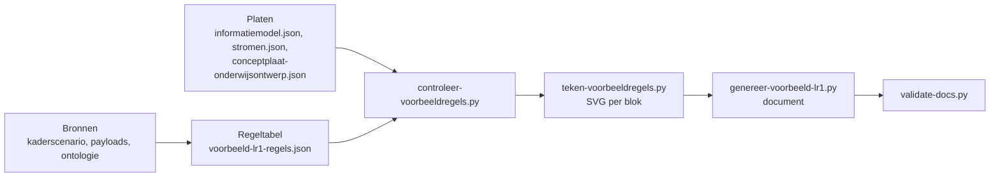

# Een persona in het informatiemodel

Het voorbeeld is een leeshulp die feedback ophaalt op het informatiemodel, geen ontwerp. Het beslist niets over het model; elke regel wijst naar iets dat op een plaat staat, en waar plaat en bron elkaar tegenspreken staat een vraag. Uitgewerkt voor Jochem in `architecture/model/informatiemodel/voorbeeld-leerroute-1-jochem.md` (Public #106, meta #243).

## De keten



Volgorde bij elke wijziging, altijd volledig:

```
python3 scripts/exporteer-componenten.py --extra "Intake systeem" "Aanmeld systeem" \
    "Curriculum ontwerptool" "AII (centraal aanmelden)" "Toets- en examen afname systeem"
python3 scripts/controleer-voorbeeldregels.py            # 0 bevindingen, anders eerst herstellen
rm -f architecture/model/informatiemodel/img/regels/*.svg
python3 scripts/teken-voorbeeldregels.py
python3 scripts/teken-hoofdplaat-highlight.py            # alleen als de plaat of de stromen wijzigen
python3 scripts/genereer-voorbeeld-lr1.py                # waarschuwt voor vragen buiten de zeven
python3 scripts/validate-docs.py architecture/model/informatiemodel/voorbeeld-leerroute-1-jochem.md
python3 -W error::ResourceWarning -m unittest discover -s tests
```

De platen komen uit het ArchiMate-model en worden alleen gelezen: `genereer-informatiemodel-doc.py` (informatiemodelplaat), `exporteer-archimate-view.py --mapping` (pijlen van hoofdplaat v1.7), `exporteer-conceptplaat.py` (view "Informatiemodel Onderwijsontwerp"), `exporteer-componenten.py` (applicatiecomponenten met hun MORA-definitie en de applicatiediensten die zij realiseren). Raak nooit een `.archimate`-bestand aan.

## De regeltabel

Kop: `model` (commits waartegen is gecontroleerd), `fasen` (nummer, naam, MORA-hoofdproces, bron, stappen, verwacht, link naar de fasekop in het kaderscenario), `rollen` (gesloten lijst), `toestanden` (elk met bron), `scope_uitzonderingen` (objecttype buiten scope dat het voorbeeld toch toont, met motivering), `koppelingen` ("Van > Naar" naar koppeling-ID).

Elke regel is een fragment van een plaat bij een processtap:

| Veld | Regel |
|---|---|
| `beeld_id` | het ID van het beeld: `F<fase>-<volgnummer>` (F1-02 is het tweede beeld van fase 1), een ID per beeld, oplopend binnen de fase en stabiel als er later een beeld bij komt. Het staat voor de titel in het beeld en in de kop, en in de kolom Beeld van de bijlage, de vragen en het invulblad |
| `beeld` | de titel van het beeld waarin de regel staat: een beschrijvende zin van wat het beeld toont ("De opleiding zoals ontworpen naar de catalogus"), uniek, aaneengesloten, in een fase, stap en soort; ID en titel samen vormen de kop ("F1-09 - De opleiding zoals ontworpen naar de catalogus") en de bestandsnaam (`f1-09-de-opleiding-zoals-ontworpen-naar-de-catalogus.svg`). Verwijs naar een regel met beeld-ID en objecttype |
| `stap` | letterlijk uit de stappenlijst van de fase; stappen komen uit het kaderscenario (instellingsreis en happy flow), niet uit scenario-uitwerkingen |
| `soort` | `ontstaat` (rol, stap, objecttype met instantie), `verandert` (zelfde, met `toestand` uit de lijst), `stroomt` (`van`, `naar`, `pijl` als relatie-id uit stromen.json of "geen pijl op de hoofdplaat", `koppeling`) |
| `objecttype` | plaatnaam letterlijk, witruimte genormaliseerd |
| `instantie` | de waarde voor de persona, leesbaar; één instantie per objecttype toont het type, niet het aantal |
| `relatie` | de relatie van de plaat waarmee dit object aan een ander object in dezelfde stap hangt: `soort`, `van`, `naar`, `label` (alleen als de plaat er een heeft, letterlijk), `nesting` (alleen aggregatie of compositie) |
| `relaties` | verdere relaties van de plaat vanaf dit object, als verwijzing op het object; met `instantie` van het andere eind waar dat helpt (toetsonderdeel naar de leeruitkomst die het aftikt) |
| `verdieping` | zoomt in op een regel erboven binnen dezelfde stap; eigen blok en beeld |
| `plaat` | `informatiemodel` (standaard) of `onderwijsontwerp`: de conceptplaat, alleen in een verdieping of in een stroomt-regel, hooguit een handvol objecten, geen attributen; paars in het beeld |
| `aanname` | waar de bron zwijgt; gestippeld in het beeld |
| `toestand` | uit de toestandenlijst; verplicht bij `verandert`, en toegestaan bij `ontstaat` als het object al in een bepaalde rijpheid ontstaat (een aanbod dat als intentie begint). Het beeld toont haar onder de instantie |
| `nieuwe_instantie` | een verdere instantie van een objecttype dat al eerder ontstond, omdat het scenario die nodig heeft (de keuzedeelvoorkeur bij de intake als tweede intekening); telt niet als tweede ontstaan |
| `bron` | bestand en regelnummer (`leerroute-1-regulier.md, r1046`), payload-id, ontologie met versie, of "geen bron, keuze van het voorbeeld"; het register maakt er links van |
| `zin` | één zin, uit het kaderscenario waar die er is; laag houden |
| `vraag` | alleen waar plaat en bron elkaar tegenspreken of de plaat iets mist; het document toont er zeven |

Wat de controle weigert, hoort niet in het voorbeeld: een objecttype dat niet op de plaat staat, een relatie die er niet als drietal (soort, van, naar) staat, een label dat afwijkt, nesting op een associatie, een rol of stap buiten de lijst, een pijl die niet op de hoofdplaat staat, een tweede ontstaat-regel voor hetzelfde objecttype, een objecttype in een andere fase dan verwacht, een beeld-ID dat niet de vorm F<fase>-<volgnummer> heeft, bij twee beelden hoort of niet oploopt binnen de fase. Mist de plaat iets dat de bron wel kent, dan is dat een `vraag` voor de modelronde, geen verzonnen label.

## Beelden

De renderer tekent per beeld één SVG in ArchiMate-kleur, met het ID en de beeldtitel bovenaan: geel voor rol, processtap en object, blauw voor component, grijs voor een scope-uitzondering, gestippeld voor een aanname, paars voor een objecttype van de conceptplaat (een conceptverdieping heeft bovendien een gestippelde rand en een chip). Bovenaan staat wie en wat (rol en processtap) of de pijl van component naar component als horizontale stippellijn met koppeling-ID en stap; eronder hangen de objecten aan een stippellijn, onderling gerelateerd. Nesting is een container; een relatielijn loopt alleen naar het buurobject (ruit bij aggregatie, open pijlpunt bij specialisatie, gelabelde lijn bij associatie), elke andere relatie staat als verwijzing op het object. Leesbaarheid gaat voor breedte: een beeld is hooguit ongeveer 1000 px breed (letters 12 en 14 px), brede ketens gaan in een kolom of over meer rijen, brede kinderrijen worden een stapel en de zin loopt door over meer regels. GitHub schaalt een breder beeld terug tot onleesbaar.

Bekijk het beeld zelf voordat je het meldt: `soffice --headless --convert-to png` in de scratchpad, en zet het beeld voor de gebruiker op een branch met een GitHub-link (bestanden sturen werkt niet in de container).

## De hoofdplaat als context bij elke interactie

Een stroombeeld toont twee componenten en wat er tussen hen beweegt, maar niet waar die lijn op de hoofdplaat loopt. Daarom staat onder elke fasekop een render van hoofdplaat v1.7 waarop de stromen van die fase zijn gemarkeerd, met het beeld-ID erbij; de rest van de plaat vervaagt, zodat de lijn eruit springt. Een stroom die de plaat nog niet kent, staat als gestippelde lijn tussen de twee componenten: zo is zichtbaar wat er ontbreekt in plaats van dat het wegvalt.

`teken-hoofdplaat-highlight.py` maakt die platen uit de view-geometrie van het model en de render `img/hoofdplaat/hoofdplaat-v1.7.jpg`. Die render komt uit `exporteer-archimate-platen.py` (Archi headless) en staat in de repository, zodat de platen zonder Archi te maken zijn; vernieuw hem zodra de hoofdplaat wijzigt. Archi rendert met tien pixels marge en het script rekent met dezelfde marge, zodat de vakken kloppen. De markering volgt het pad dat in het model staat: van rand tot rand van de twee vakken, langs de knikpunten van de modelleur (knikpunt i van n weegt (i + 1) / (n + 1) tussen bron en doel, zoals de tekenlaag onder Archi rekent) en door een junction heen tot het vak van de ontvanger. Daarmee ligt de markering op of vlak langs de pijl van de plaat. Let op: Archi kiest bij sommige pijlen zelf een aanhechtpunt dat uit het bestand niet te herleiden is; die markering loopt evenwijdig aan de pijl in plaats van erop. Toetsen doe je door alle berekende lijnen over een verse render te leggen. Een stroom zonder pijl op de plaat krijgt een gestippelde boog tussen de twee vakken: zichtbaar wat er ontbreekt. Een relatie die twee keer op de plaat staat, krijgt de kortste van de twee lijnen. Met `--koppelingen OC-P&R,OC-SIS,OC-LMS` markeert het script niet een fase maar de lijnen van die koppelingen, en met `--uitsnede` blijft alleen het deel van de plaat over waar de markeringen liggen. Het meldt welke stromen het niet kon plaatsen; dat zijn componenten die de plaat niet kent, en die horen in het document als vraag.

Elk stroombeeld draagt daarnaast een regel **Interactie:** met de twee systemen, de koppeling of de aanduiding "geen pijl op de hoofdplaat", en het beeld-ID waarmee de lijn op de faseplaat is gemarkeerd.

## Systemen: wat een component doet, staat in MORA

Een stroom loopt tussen twee applicatiecomponenten, en wat zo'n component doet bepaalt of de stroom klopt. MORA beschrijft dat, en die beschrijvingen staan in het ArchiMate-model bij de componenten en bij de applicatiediensten die zij realiseren. `exporteer-componenten.py` haalt ze eruit naar `componenten.json`; het document toont ze in de sectie "De systemen en wat zij doen".

Wat dat oplevert, en wat de werkwijze daarom is:

1. **Gebruik de naam die het model draagt.** De controle wijst een componentnaam af die niet in `componenten.json` staat. Zo heet het intakesysteem in het model "Intake systeem", en bestaat er daarnaast een "Aanmeld systeem"; het voorbeeld volgt die namen in plaats van eigen varianten.
2. **Leg een stroom langs de diensten van beide kanten.** Het studentkeuzesysteem levert "Keuze op leergelegenheid" en "Accorderen van keuzes", het roostersysteem "Aanmelding rooster activiteit", de kernregistratie "Inschijving op opleidingsprogramma". Wie wat doet volgt daaruit, en waar twee diensten elkaar overlappen hoort een vraag.
3. **Een component zonder beschrijving is een signalering.** Planningssysteem, Student Keuze Systeem (SKS) en AII dragen nog geen documentatie in het model; het document noemt dat onder de tabel, als punt voor het model en niet als keuze van het voorbeeld.

## Rijpheid: hetzelfde object, verderop in de keten

Een objecttype verschijnt in de reis meerdere keren, en wat het draagt groeit mee. Dat maakt het voorbeeld inzichtelijk waar een opsomming van objecten dat niet doet: een lezer ziet wanneer iets erbij komt, en wat er dan pas te weten valt.

Drie regels houden dat leesbaar:

1. **Benoem de trede als toestand, met een bron.** Elke trede staat in de toestandenlijst van de kop, met de regel uit het kaderscenario waar zij vandaan komt. Zonder bron geen trede: wat de bron openlaat, blijft een vraag.
2. **Voeg per trede de informatieobjecten toe die dan pas bestaan.** De specificatie wordt planbaar en krijgt op leeronderdeelniveau studiebelasting, ruimtetype en expertiseprofiel. Het aanbod begint als intentie op instellingsniveau, wordt gepland met perioden en capaciteit, en fijnmazig gepland met groepen en tijdvensters. Het voorbeeld zet die objecten in het beeld van de stap waar ze ontstaan, niet eerder.
3. **Toon de herkomst als verwijzing, geen kopie.** Een aanbodobject draagt de verwijzing naar de specificatie waarvan het is gemaakt en naar het verzoek dat ertoe leidde; de inhoud zelf blijft bij de specificatie.

De tredes die de uitwerking van Jochem nu kent:

| Wat rijpt | Tredes | Waar |
|---|---|---|
| Onderwijsspecificatie | grofmazig, planbaar (per niveau iets anders), fijnmazig | fase 1, 2 en 4 |
| Onderwijsaanbod | intentie (meerjarenplanning), gepland (jaarplanning), fijnmazig gepland (periodeplanning), geroosterd | fase 2 en 4; roosteren valt buiten de uitwisseling |
| Onderwijsverbintenis | aangemeld, ingeschreven | fase 3 |
| Onderwijsresultaat | in uitvoering, afgerond, vastgesteld | fase 5 en 8 |

Waar de bron de tredes openlaat, zoals bij de stadia van aanbod, hoort dat als vraag in het document en niet als stilzwijgende keuze.

## Inhoudelijke afspraken uit de uitwerking van Jochem

- De leeruitkomst is de sleutel: specificaties, toets- en examenonderdelen en de resultaatstructuur verwijzen ernaar. Zij is de invulling van de instelling (waar en hoe de student het laat zien), niet een kopie van de kerntaak.
- Fase 1 gaat als gelinkt geheel naar de catalogus: leeruitkomsten met hun skills, specificatiestructuur (met keuzedeelruimte en regelset, en het onderwijsontwerp van de conceptplaat) en resultaatstructuur, dat is de opleiding zoals ontworpen.
- Een keuzedeel is een eigen programmaspecificatie, gelijksoortig vormgegeven maar los van de opleiding; in de opleiding zit alleen de keuzedeelruimte met de regelset. Welk keuzedeel de ruimte vult, bepaalt het studentkeuzesysteem later.
- Het examenplan blijft buiten de uitwisseling; de summatieve resultaatstructuur is zijn oorsprong en gaat wel mee. Het cohort hangt aan die structuur.
- Skills: CompetentNL (ontologie 2.1.0) als verdieping van de leeruitkomst, niet als aparte bron; vaardigheden gelaagd, kennisgebieden op ISCED-F; laag 3 vraagt de viewer.
- Het onderwijskundig kader van de instelling (leervormstrategie, leerdoel, onderwijsvorm specificatie, leeromgeving, docentprofiel, studiebelasting in BOT en OOT) staat op de conceptplaat en niet op de informatiemodelplaat: een verdieping en een vraag. Die planbare waarden gaan met het verzoek mee naar planning; planning plot er ruimtes en mensen op (lokaaltypes, medewerkers, schaarste in het aanbodmodel van het jaarplan) en leidt de examenplanning af uit de resultaatstructuur en het examenplan.
- Het aanmeldbare aanbod gaat van de catalogus naar de kernregistratie, die het ontsluit aan de centrale aanmeldvoorziening (CAMBO, straks AII); de intake-uitkomst gaat als geheel terug: persoon, verbintenissen en plaatsingsgroep.
- Een stroom die het kaderscenario noemt maar v1.7 niet kent, staat als "geen pijl op de hoofdplaat" (afname naar SVS, SVS naar KRS). De inschrijving op het keuzedeel loopt op v1.7 via SKS naar KRS.

## Stopmomenten

De kop van de regeltabel (fasen, rollen, toestanden, scope) en de inhoud per fase gaan langs de gebruiker voordat ze definitief zijn; de reviews in verse contexten (tester, informatiearchitect, lid kerngroep techniek, schrijfstijl) komen daarna. Details en beelden per iteratie horen in agent-artifacts, de issue-comment blijft kort met een link.

Schrijfstijl: [`.cursor/rules/schrijfstijl.mdc`](../../../.cursor/rules/schrijfstijl.mdc); modelregels: [`architecture/model/README.md`](../../../architecture/model/README.md).
