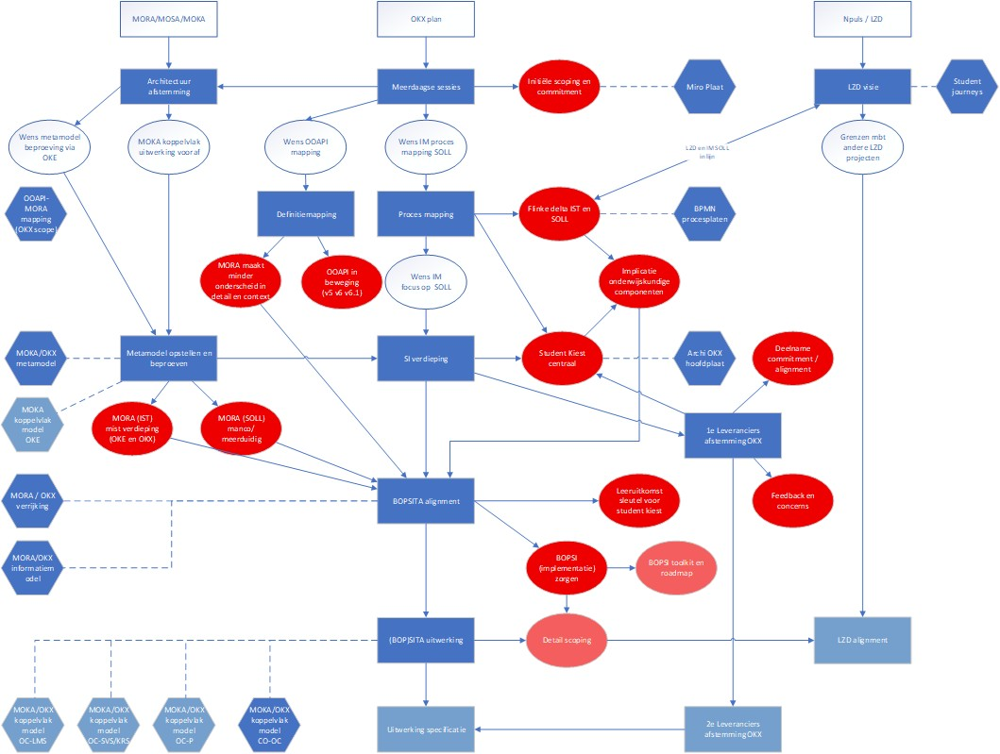

# OKx Besluitboom en Historie

Dit document beschrijft de **conceptuele keuze-momenten** en **startpaden** binnen OKx, gebaseerd op bijlage 3 (besluitboom). Het fungeert tevens als **lijdraad voor de projecthistorie**: keuzes, mijlpalen en context worden hier (of via verwijzingen) vastgelegd zodat architectuur- en besluitvorming traceerbaar blijven.

## Doel van de besluitboom

De besluitboom maakt expliciet welke keuzes er zijn bij het tot stand brengen en beheren van koppelvlakken (bijv. welk startpunt, welke ketenrol, welke informatiestroom). Daarmee kunnen implementatiepaden en verantwoordelijkheden eenduidig worden gecommuniceerd.

## Bijlage 3: figuren

Voor de visuele weergave van de besluitboom wordt verwezen naar:

*Legenda:*
- Hexagon: OKx kernteam initiatief.
- Rechthoek: Actie en product
- Rode cirkel: constatering / besluit moment

*Figuur: Besluitboom – conceptuele keuze-momenten en startpaden (bijlage 3).*

## Conceptuele keuzes (samenvatting)

- **Startpunt**: Vanuit welke rol of welk proces wordt het koppelvlak geïnitieerd (bijv. examen, inschrijving, resultaat)?
- **Ketenrol**: Welke partijen zijn bron respectievelijk afnemer van de gegevens?
- **Informatiestroom**: Welke gegevens worden uitgewisseld en in welke richting?
- **Fasering**: In welke volgorde worden specificaties, pilots en landelijke uitrol doorlopen?

Deze keuzes bepalen welk pad in de besluitboom wordt gevolgd en welke MOKA-koppelvlakspecificaties en eventueel OEAPI-profielen van toepassing zijn. De besluitboom en legenda hieronder vormen de basis voor het vastleggen van de projecthistorie.

## Projecthistorie

- **Q3–Q4 2025:** Architectuurmapping-sessies. MORA is als uitgangspunt genomen; de focus lag op de vraag *wat is het probleem nu eigenlijk* — verkenning van de problematiek in de keten en aansluiting bij bestaande architectuur.
- *Verdere mijlpalen en momenten worden hier aangevuld; waar nog geen inhoud is: in aanbouw.*

Documentversies en belangrijke wijzigingen in de besluitboom worden daarnaast bijgehouden in de Git-geschiedenis van dit bestand en in bijbehorende issues/PRs.
