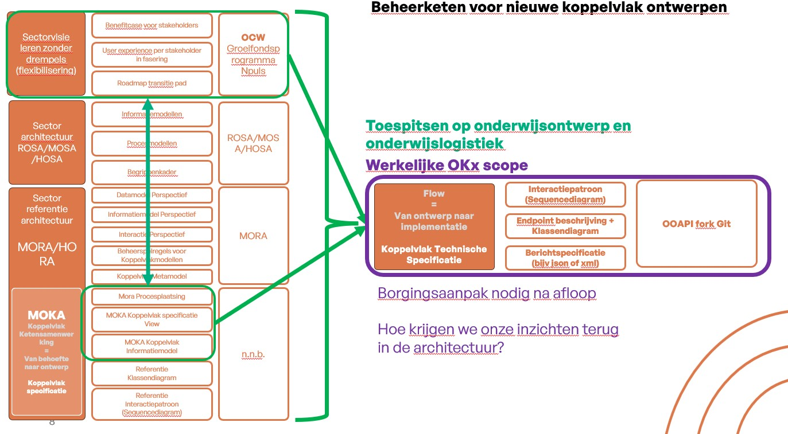

# Wat is OKx?

**OKx** staat voor het realiseren van **uniforme, gestandaardiseerde koppelvlakken** voor onderwijslogistiek. Het BOPSI-implementatiepad is het uitgangspunt; de scope start bij **MBO** en wordt later uitgebreid naar **HO** (hoger onderwijs). Door koppelvlakken eenduidig te specificeren ontstaat interoperabiliteit tussen systemen en partijen in de onderwijsketen.

## Deliverables en inputs

- **Deliverables** (paars in bijlage 1): de concrete producten die OKx oplevert — MOKA-koppelvlakspecificaties, informatiemodellen en waar mogelijk OEAPI-gebaseerde standaarden. Zie [OKx/doc/OKx_Projectoverzicht.md](OKx/doc/OKx_Projectoverzicht.md). Figuur: beheerketen voor tot standkoming koppelvlak specificaties:

  

- **Inputs** (groen in bijlage 1): de bronnen en eisen die als invoer voor de specificaties gelden (ketenafspraken, MORA/MOKA, BOPSI).

## Repo-inhoud

| Onderdeel | Beschrijving |
|-----------|--------------|
| **OKx projectcontext** | [OKx/doc/](OKx/doc/) en [OKx/img/](OKx/img/): visie, besluitboom, historie, ketenplaten, informatiestromen en bijlagen. |
| **Deliverables** | Onder [OKx/OKE/](OKx/OKE/) staat het subdomein *Examen – uitvoering en beoordeling* met de bijbehorende **MOKA-koppelvlakspecificaties** (doc, img, scripts). |
| **Generiek template** | [OKx/moka-koppelvlakspecificaties/Template/](OKx/moka-koppelvlakspecificaties/Template/): MOKA koppelvlak specificatie template en generieke instructies. |
| **Machine-interpreteerbaar** | Informatiemodellen (JSON), ContextRules en gestructureerde documenten onder de genoemde paden. |

## Relatie met OEAPI

De informatiestromen die binnen OKx worden uitgewerkt resulteren in technische specificaties en, waar mogelijk, in **OEAPI-gebaseerde standaarden** en consumers. Zie [OEAPI v6.0](https://openonderwijsapi.nl/v6.0/) voor de Open Onderwijs API.

## Status en samenwerking

Deze repository is **in aanbouw**. Wijzigingen gaan bij voorkeur via **tickets** en **pull requests**. Voor toegang en afstemming: **niek.derksen@surf.nl**.
