# Keuzes rond onderwijsspecificaties: kiesbaarheid, voorwaarden en aanbod

Context: OC naar P&R (onderwijscatalogus naar planning en roostering), intra-instelling eerst. Scenario: LeerRoute 1 (LR1); de eisen gelden generiek voor **alle keuzes rond onderwijsspecificaties**, keuzedelen zijn het eerste geval. Niveau: requirements (semantisch, nog geen OEAPI-attributen). Status: concept. Relateert aan: #84.

## Inhoudsopgave

1. [Waarom dit voorstel](#1-waarom-dit-voorstel)
2. [Doel](#2-doel)
3. [Scope](#3-scope)
4. [Scenario (LR1)](#4-scenario-lr1)
5. [Begrippen](#5-begrippen)
6. [Requirements](#6-requirements)
7. [Visuals](#7-visuals)
8. [Verhouding tot OEAPI](#8-verhouding-tot-oeapi)
9. [Open vragen en suggestieve aanbod-attributen](#9-open-vragen-en-suggestieve-aanbod-attributen)
10. [Vervolg](#10-vervolg)

## 1. Waarom dit voorstel

#84 vraagt: hoe leggen we vast welke keuzedelen een student mag kiezen, binnen welke opleiding en instelling? Dat is het eerste geval van een generieke vraag: hoe leggen we **elke keuze rond onderwijsspecificaties** vast, op elk niveau (keuzedeelprogramma, onderwijseenheid, leeronderdeel). De specificatie beschrijft nu de reguliere opbouw, maar niet het keuzeaanbod, het kiezen, en de groepsindeling.

Zonder afspraak vult elke leverancier dit in met eigen aannames. Die worden de-facto standaard en zijn later niet meer te wijzigen. Daarom eerst de eisen, voordat we attributen en endpoints kiezen.

OKx gaat uit van toenemende flexibilisering: uiteindelijk wordt bijna elk onderdeel keuzedeel en stelt elke student een eigen opleiding samen. Dan is het beperken en relateren van keuzes wat de keten beheersbaar houdt. Binnen LR1-3 is de keuzeruimte nog klein.

## 2. Doel

- Vastleggen wat de standaard moet kunnen rond kiesbaarheid en voorwaarden van **keuzes rond onderwijsspecificaties** (nu keuzedelen), en de doorwerking naar planning en roostering.
- De rol van de **leeruitkomst** in de regels vastleggen: voorwaarden gaan over wat behaald is, niet over welke specificatie doorlopen is.
- Op requirements-niveau blijven. Geen OEAPI-attributen, entiteiten of endpoints.
- Invoer voor de gegevensanalyse en berichtspecificatie (AMIGO-stap 2 en 5) en het OEAPI-profiel.

Buiten scope: definitieve attributen en endpoints. Suggestieve aanbod-attributen staan in §9.

## 3. Scope

- Koppeling: OC naar P&R, intra-instelling eerst (ADR 0008).
- Leerroutes: LR1 uitgewerkt. LR2 en LR3 nog niet af, volgen als verschil (delta) ten opzichte van LR1.
- Diepte: praktisch drie niveaus (opleiding, programma, onderwijseenheid/leeronderdeel). Geen harde grens: onderwijseenheden kunnen geneste onderwijseenheden en leeronderdelen bevatten. Lesniveau valt buiten scope; PMO realiseert dat niet.

## 4. Scenario (LR1)

Jochem volgt regulier Apothekersassistent (LR1) en mag een keuzedeel kiezen. Twee soorten, met een verschillend regelprofiel:

- Algemeen, verbredend keuzedeel: breed aanbod dat elke opleiding mag kiezen.
- Beroepsspecifiek, verdiepend keuzedeel: met een voorwaarde vooraf. Voorbeeld: Ruimtelijk inzicht vereist afgerond Wiskunde 1.

Die voorwaarde bepaalt twee dingen: of Jochem het mag kiezen, en wanneer het aangeboden kan worden. Ruimtelijk inzicht kan pas na Wiskunde 1 in de tijd worden gepland. De voorwaarde is dus ook een constraint voor de planning.

De twee soorten zijn huidige voorbeelden, geen vaste indeling (zie R10 en R12).

## 5. Begrippen

| Begrip | Toelichting (IT-term) |
|---|---|
| Kiesbaarheid | Mag een student een specificatie kiezen? (eligibility) |
| Voorwaarde vooraf | Iets moet eerder afgerond of gevolgd zijn (prerequisite) |
| Volgorde | Verplichte volgorde tussen specificaties (sequencing) |
| Algemeen/verbredend keuzedeel | Breed, universeel kiesbaar |
| Beroepsspecifiek/verdiepend keuzedeel | Kiesbaar onder voorwaarden |
| Groep of lesgroep | Studenten met dezelfde keuze op dezelfde locatie en periode |
| Individuele opleiding | Per student samengesteld programma (personalisering) |
| Specificatie versus aanbod | Ontwerp (catalogus) versus planbaar en geroosterd resultaat |
| Leeruitkomst | Wat je behaalt; zelfstandig object met eigen identiteit en lifecycle, de sleutel tussen specificatie, regel en resultaat |
| Behaald | Er is een onderwijsresultaat op de leeruitkomst vastgesteld |

## 6. Requirements

Elke eis met een concreet voorbeeld uit LR1-3, en elk voorbeeld is als figuur uitgewerkt in §7 (dekkingstabel in §7.5). "MOET" in de zin van RFC 2119 (MUST).

- **R1 Kiesbaarheid bepalen (eligibility).** Bepaalbaar welke onderwijsspecificaties een student mag kiezen, op elk niveau. Voorbeeld: gegeven Jochem in Apothekersassistent, lever de lijst kiesbare keuzedelen. Figuur 7.4.1.
- **R2 Regels los van items.** Een regel staat los van de items waarop hij werkt. Voorbeeld: de lijst kiesbare keuzedelen kan wijzigen zonder dat de regel "Ruimtelijk inzicht vereist Wiskunde 1" verandert. Figuur 7.1.
- **R3 Locatie en periode.** Kiesbaarheid en beschikbaarheid kunnen afhangen van locatie en periode. Voorbeeld: Ruimtelijk inzicht wordt alleen in Utrecht in periode 3 aangeboden. Figuur 7.4.3.
- **R4 Herkenbare groep** (bron: #84, vraag 3). Een groep is herkenbaar te koppelen aan de combinatie keuzedeel, locatie en periode. Voorbeeld: Jochem en 24 anderen kiezen Ruimtelijk inzicht in Utrecht in periode 3; samen zijn zij de groep die hoort bij (Ruimtelijk inzicht, Utrecht, P3). Groepslidmaatschap (group membership) is de stabielste manier om deze keuzes tussen systemen uit te wisselen. Figuur 7.4.3.
- **R5 Ruimte voor vrijere keuzevormen later.** De regels sluiten vrijere vormen niet uit. Voorbeeld: later moet "kies 2 van 5 keuzedelen" mogelijk zijn zonder de LR1-3-afspraken te breken. Figuur 7.4.1.
- **R6 Zelfde uitkomst bij elk systeem.** Een regel is zo eenduidig dat elk systeem dezelfde uitkomst berekent (voorwaarde voor toetsing, conformance). Voorbeeld: systeem A en B bepalen beide dat Jochem Ruimtelijk inzicht nog niet mag kiezen zolang Wiskunde 1 niet af is. Figuur 7.4.5.
- **R7 Voorwaarde vooraf in behaalde leeruitkomsten (prerequisite).** Een voorwaarde vooraf wordt uitgedrukt in **behaalde leeruitkomsten**, niet in doorlopen specificaties. Voorbeeld: deelname aan Ruimtelijk inzicht vereist dat de leeruitkomst van Wiskunde 1 is behaald; hoe die behaald is (welke specificatie, welke route) doet er niet toe. Figuur 7.4.2.
- **R8 Zelfde regel, twee gebruikers.** Dezelfde voorwaarde wordt gebruikt bij het kiezen en door de planning. Voorbeeld: de regel Wiskunde 1 voor Ruimtelijk inzicht stuurt zowel Jochems keuzemoment als de roostering. Figuur 7.4.2.
- **R9 Voorwaarde bepaalt tijdige plaatsing.** Uit de vereiste leeruitkomsten leidt planning de volgorde af. Voorbeeld: planning zet Ruimtelijk inzicht in een periode na Wiskunde 1. Figuur 7.4.2 en 7.3.
- **R10 Open set kiesbaarheidsklassen.** Het onderscheid tussen klassen ligt niet vast; er kunnen klassen bij. Voorbeeld: naast algemeen en beroepsspecifiek moet een instelling een eigen klasse kunnen toevoegen. Figuur 7.4.1.
- **R11 Aanbod is afleidbaar.** Uit de onderwijsspecificatiestructuur plus regels leidt planning geldig, in de tijd gefaseerd aanbod af dat de regels respecteert. Voorbeeld: uit de structuur en de voorwaarde volgt aanbod met Wiskunde 1 in periode 1 en Ruimtelijk inzicht in periode 2. Suggestieve aanbod-attributen: §9. Figuur 7.3.
- **R12 Ontworpen voor flexibilisering.** Het regelmechanisme werkt ook als bijna elke specificatie een keuzedeel is en elke student een eigen opleiding heeft. Voorbeeld: een volledig individueel programma blijft toetsbaar via dezelfde regels. (ADR 0003, 0011, 0012.) Figuur 7.4.1 en 7.4.4.
- **R13 Bottom-up en top-down samenstellen.** Een opleiding is samen te stellen van onderop (losse lessen of leeronderdelen kiezen) en van bovenaf (blokken kiezen die naar lessen vertalen). Voorbeeld: student A kiest losse leeronderdelen, student B kiest een heel keuzedeelprogramma; beide leiden tot dezelfde onderliggende onderdelen. Figuur 7.4.6.
- **R14 Leeruitkomst als sleutel.** Elke onderwijsspecificatie verankert op een leeruitkomst met eigen identiteit en eigen lifecycle. Regels, resultaten en waardepapieren verwijzen naar de leeruitkomst, niet naar de specificatie. Voorbeeld: de voorwaarde voor Ruimtelijk inzicht blijft geldig als de specificatie van Wiskunde 1 een nieuwe versie krijgt, zolang de leeruitkomst dezelfde blijft. Figuur 7.4.2.
- **R15 Evalueerbaar met alleen sleutel en status.** Een regel is te evalueren met uitsluitend leeruitkomst-id's en hun behaald-status. De inhoud van de leeruitkomst is niet nodig. Voorbeeld: planning bepaalt de volgorde Wiskunde 1 voor Ruimtelijk inzicht zonder te weten wat die leeruitkomsten inhouden. Figuur 7.4.2 en 7.4.5.
- **R16 Regels op elk niveau.** Regels kunnen aangrijpen op elk specificatieniveau en op leeruitkomsten van elke orde van grootte. Voorbeeld: dezelfde regelvorm werkt voor het kiezen van een keuzedeelprogramma nu, en voor het kiezen van een los leeronderdeel straks. Figuur 7.4.4.
- **R17 Herleidbare regelversie.** Regelsets kennen eigen versionering, en achteraf is vaststelbaar welke regelversie gold bij een keuze. Voorbeeld: voor Jochems cohort 2026 gold regelset-versie 1.2; dat blijft herleidbaar voor de diplomaverantwoording, ook wanneer latere cohorten versie 2.0 volgen. Figuur 7.4.7.

## 7. Visuals

### 7.1 Specificatie en regel bestaan naast elkaar (R2)

De onderwijsspecificatiestructuur bevat de items. Een regel is een apart object dat naar die items verwijst. Zo kun je items of regels wijzigen zonder de ander te raken.

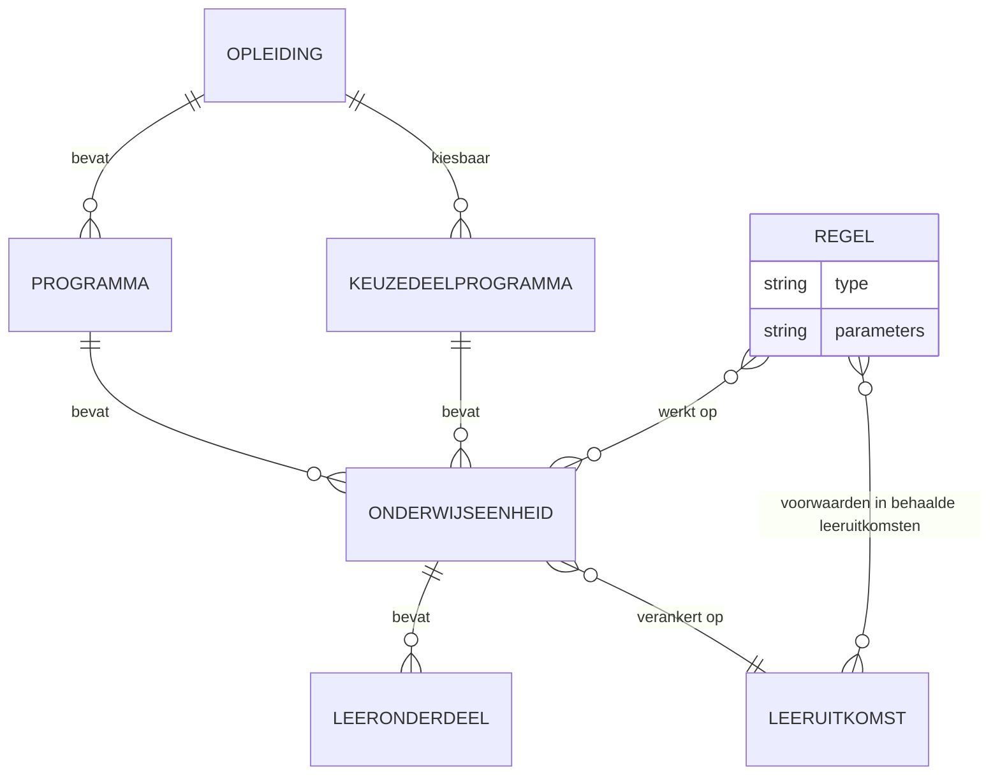

### 7.2 Onderwijsspecificatiestructuur LR1 met keuzedelen en voorwaarde vooraf

De reguliere opbouw is een geneste structuur. Keuzedelen hangen als parallelle programma's onder de opleiding. De voorwaarde vooraf is de extra verbinding die er een gerichte acyclische graaf (DAG) van maakt.

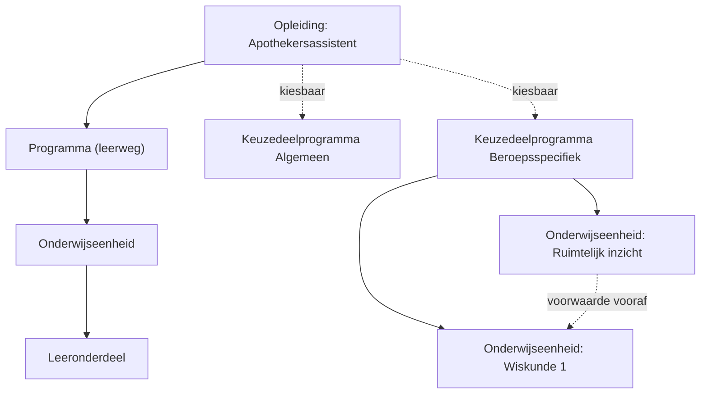

### 7.3 Van specificatie naar aanbod via het plan- en roosterproces

Onderwijsspecificatiestructuur plus regels vormen samen de constraint voor het plan- en roosterproces. Het resultaat is aanbod dat in de tijd staat: Wiskunde 1 vóór Ruimtelijk inzicht.

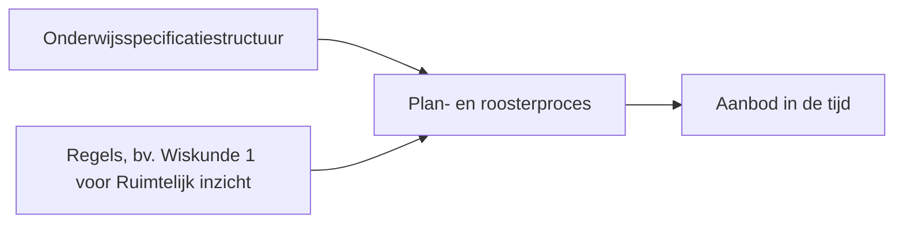

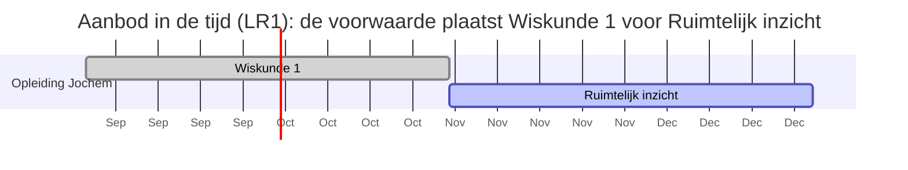

### 7.4 Keuzescenario's, schematisch

Elk scenario is gekoppeld aan de requirements die het dekt. De schema's zijn de leidraad voor de [regelset-payload](20260727_1509_okx-lr1-regelset-payload-json.md).

#### 7.4.1 Keuzecontext met benoemde keuzegroepen

Met deze specificatie en deze keuzedeelruimte (begroot 720 SBU): kies maximaal 2 uit de algemene groep, samen binnen de begrote omvang, en kies precies 1 specialisatie uit 5. Dekt R1, R5, R10, R12.

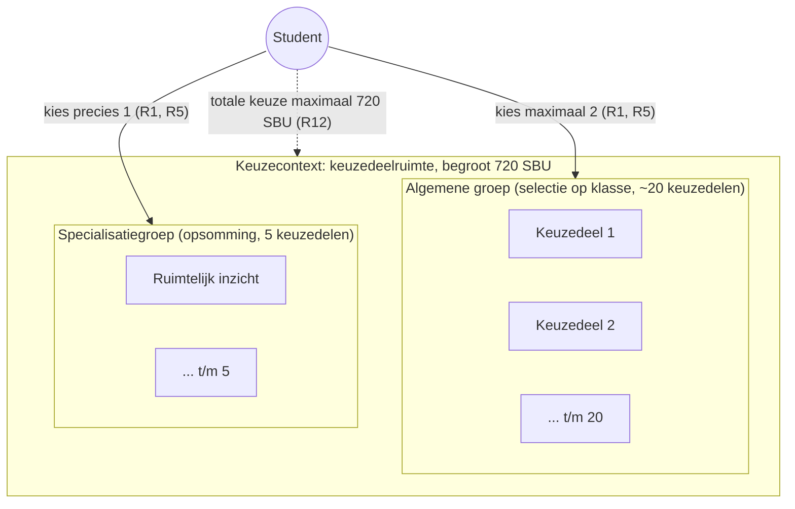

#### 7.4.2 Voorwaarde in behaalde leeruitkomsten

Deelname vereist behaalde leeruitkomsten, niet doorlopen specificaties. Dezelfde voorwaarde stuurt keuzemoment en planvolgorde. Dekt R7, R8, R9, R14, R15.

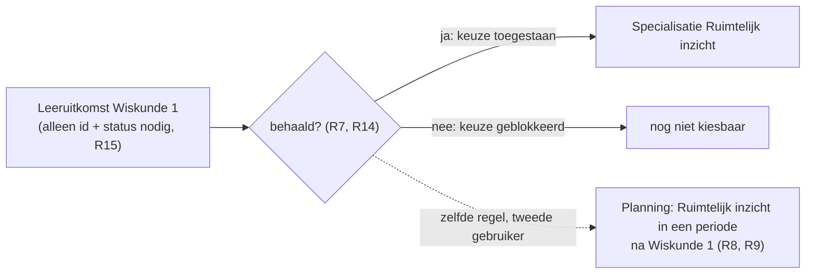

#### 7.4.3 Beschikbaarheid en groepsvorming

Kiesbaarheid kan afhangen van locatie en periode; de keuze leidt tot een herkenbare groep. Dekt R3, R4.

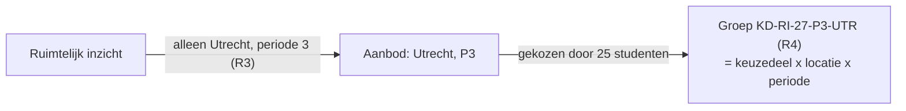

#### 7.4.4 Zelfde regelvorm op elk niveau

Keuzedeel is de mbo-invulling; de regelvorm werkt op elke onderwijsspecificatie als keuzecontext. Dekt R12, R13, R16.

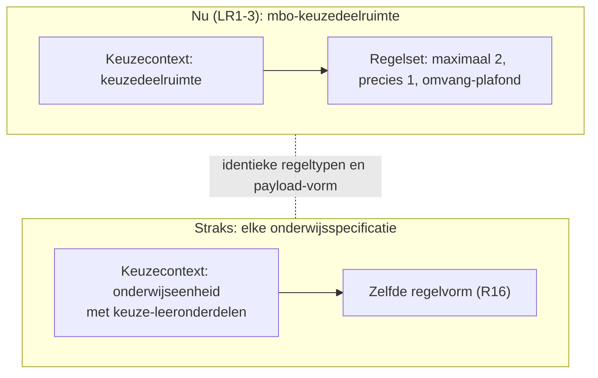

#### 7.4.5 Zelfde regel, zelfde uitkomst bij elk systeem

Een regel is zo eenduidig dat elk systeem dezelfde uitkomst berekent, met alleen sleutels en status. Dekt R6, R15.

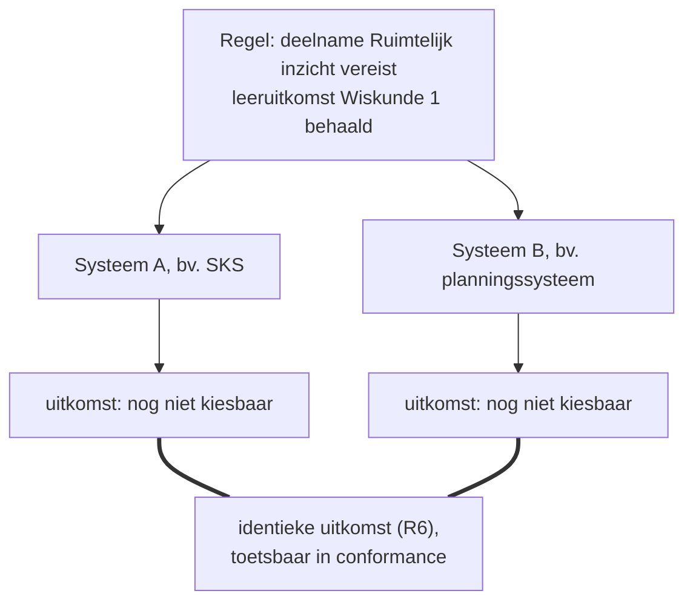

#### 7.4.6 Bottom-up en top-down samenstellen

Twee routes naar dezelfde opleiding. Student A kiest van bovenaf: één keuze op de top van de onderwijsspecificatiestructuur, alles eronder volgt. Student B kiest van onderaf: selecties onderin combineren naar het niveau erboven; is dat niveau compleet, dan combineert het weer verder omhoog, tot de opleiding bereikt is. Dekt R13.

Student A kiest de opleiding van bovenaf; de structuur volgt als nominaal template:

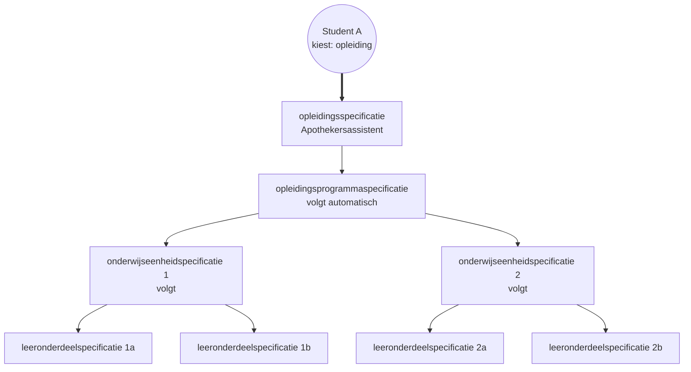

Student B kiest van onderaf; selecties combineren omhoog tot de opleiding:

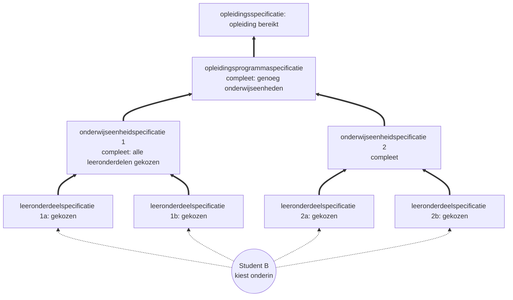

Beide studenten tikken dezelfde leeruitkomsten af en kunnen in theorie exact dezelfde specificaties gekozen hebben; alleen de route verschilt:

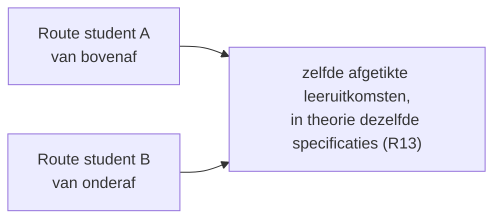

#### 7.4.7 Herleidbare regelversie per cohort

Welke regelversie gold bij de keuze blijft vaststelbaar, ook over cohorten heen. Dekt R17.

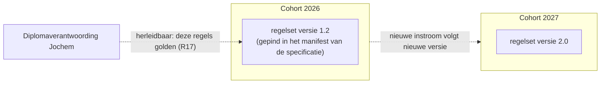

### 7.5 Dekking: requirement naar figuur

| Requirement | Figuur |
|---|---|
| R1 kiesbaarheid | 7.4.1 |
| R2 regels los van items | 7.1 |
| R3 locatie en periode | 7.4.3 |
| R4 herkenbare groep | 7.4.3 |
| R5 vrijere keuzevormen | 7.4.1 |
| R6 zelfde uitkomst | 7.4.5 |
| R7 voorwaarde in behaalde leeruitkomsten | 7.4.2 |
| R8 zelfde regel, twee gebruikers | 7.4.2 |
| R9 tijdige plaatsing | 7.4.2 en 7.3 |
| R10 open kiesbaarheidsklassen | 7.4.1 |
| R11 aanbod afleidbaar | 7.3 |
| R12 flexibilisering | 7.4.1 en 7.4.4 |
| R13 bottom-up en top-down | 7.4.6 |
| R14 leeruitkomst als sleutel | 7.4.2 |
| R15 alleen sleutel en status | 7.4.2 en 7.4.5 |
| R16 regels op elk niveau | 7.4.4 |
| R17 herleidbare regelversie | 7.4.7 |

## 8. Verhouding tot OEAPI

- Uitgangspunt: OEAPI, tenzij (principe 2). Afwijkingen onderbouwen en vastleggen (ADR en signalering).
- Vandaag legt OEAPI toelatingsvoorwaarden vast als vrije tekst (`admissionRequirements`), niet als regels. Dat willen we vervangen door regels die eenduidig te evalueren zijn (R6).
- Neem het principe "regels los van items" over (R2). Dat houdt OKx uitlijnbaar met OEAPI zonder hun volledige model over te nemen.
- Ter kennisgeving: in het HO loopt een initiatief (OEAPI technical working group) voor minor-modellering met knopen en bladeren (nodes en leafs) en een regelset. OKx wil daar waar mogelijk op uitlijnen. We zijn op de hoogte van die ontwikkeling.

## 9. Open vragen en suggestieve aanbod-attributen

Aanbod-attributen (suggestief, nog vast te stellen). Relatie: Specificatie 1..n Aanbod.

| Niveau | Suggestieve attributen |
|---|---|
| Planning | starttijd, periode, eindtijd, gekoppelde personen (via groepen) |
| Roostering | startdatetime, einddatetime, plaats, gekoppelde personen |

Open vragen:

- OC naar planning: welke studentgegevens (eerder afgerond of ingeschreven) heeft planning nodig, en van welk systeem? Raakt ADR 0009.
- Landelijke locatietabel (zoals BRIN in het VO) nodig of niet? (#84, vraag 2.)
- Plek van de regels (bij de specificatie, het aanbod of het programma): later in de gegevensanalyse.
- Afstemming met de koppelingen-lijn (#98/#119): daar zijn R7, R14 en R15 inmiddels vastgelegd als ADR 0022 (resultaatbegrippen conform ROSA KOI) en ADR 0023 (leeruitkomst-ids als opaque sleutels binnen OC-P&R). Na merge verwijzen beide lijnen naar elkaar.

## 10. Vervolg

1. R1-R17 vaststellen en laten accorderen na review op #84.
2. Regelset-payload-voorstel (zie [regelset-payload](20260727_1509_okx-lr1-regelset-payload-json.md)) als eerste concretisering.
3. Gegevensanalyse (AMIGO-stap 2): entiteiten en attributen afleiden, met OEAPI-mapping.
4. Berichtspecificatie en OEAPI-profiel (AMIGO-stap 5 en 6): het toetsbare contract.
5. LR2 en LR3 als delta ten opzichte van LR1.
