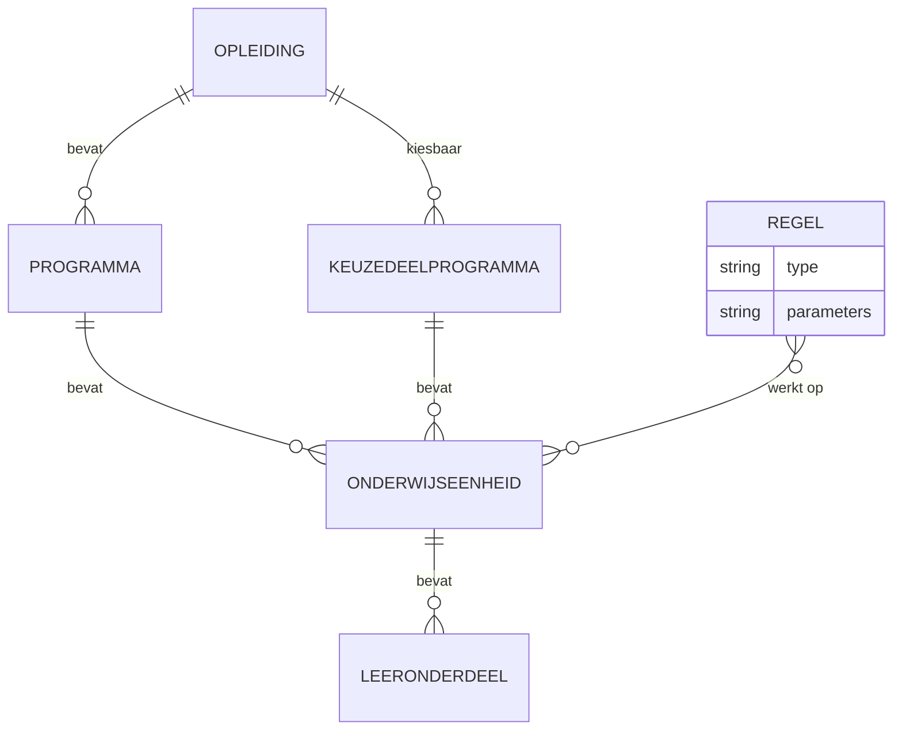
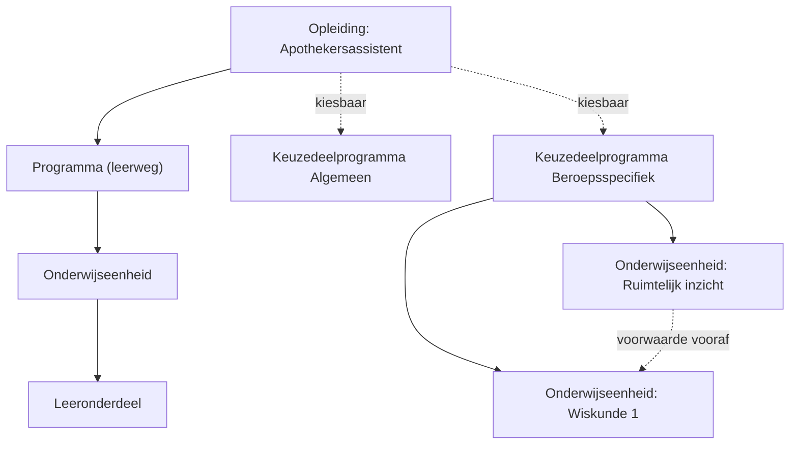
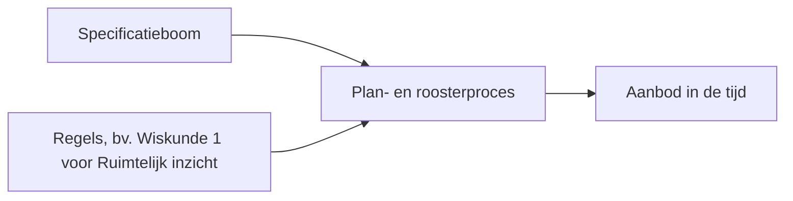
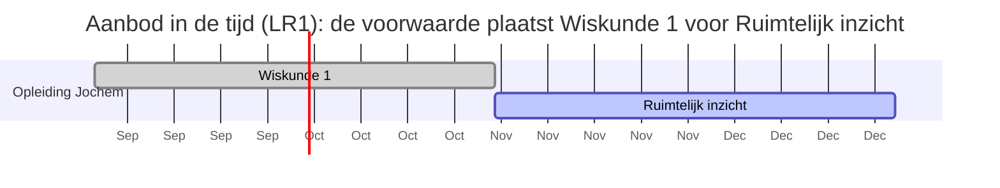

# Keuzedelen: kiesbaarheid, voorwaarden en aanbod

Context: OC naar P&R (onderwijscatalogus naar planning en roostering), intra-instelling eerst. Scenario: LeerRoute 1 (LR1). Niveau: requirements (semantisch, nog geen OEAPI-attributen). Status: concept. Relateert aan: #84.

## Inhoudsopgave

1. [Waarom dit voorstel](#1-waarom-dit-voorstel)
2. [Doel](#2-doel)
3. [Scope](#3-scope)
4. [Scenario (LR1)](#4-scenario-lr1)
5. [Begrippen](#5-begrippen)
6. [Requirements](#6-requirements)
7. [Visuals](#7-visuals)
8. [Verhouding tot OEAPI](#8-verhouding-tot-oeapi)
9. [Open vragen en suggestieve aanbod-attributen](#9-open-vragen-en-suggestieve-aanbod-attributen)
10. [Vervolg](#10-vervolg)

## 1. Waarom dit voorstel

#84 vraagt: hoe leggen we vast welke keuzedelen een student mag kiezen, binnen welke opleiding en instelling? De specificatie beschrijft nu de reguliere opbouw, maar niet het aanbod van keuzedelen, het kiezen, en de groepsindeling.

Zonder afspraak vult elke leverancier dit in met eigen aannames. Die worden de-facto standaard en zijn later niet meer te wijzigen. Daarom eerst de eisen, voordat we attributen en endpoints kiezen.

OKx gaat uit van toenemende flexibilisering: uiteindelijk wordt bijna elk onderdeel keuzedeel en stelt elke student een eigen opleiding samen. Dan is het beperken en relateren van keuzes wat de keten beheersbaar houdt. Binnen LR1-3 is de keuzeruimte nog klein.

## 2. Doel

- Vastleggen wat de standaard moet kunnen rond kiesbaarheid en voorwaarden van keuzedelen, en de doorwerking naar planning en roostering.
- Op requirements-niveau blijven. Geen OEAPI-attributen, entiteiten of endpoints.
- Invoer voor de gegevensanalyse en berichtspecificatie (AMIGO-stap 2 en 5) en het OEAPI-profiel.

Buiten scope: definitieve attributen en endpoints. Suggestieve aanbod-attributen staan in §9.

## 3. Scope

- Koppeling: OC naar P&R, intra-instelling eerst (ADR 0008).
- Leerroutes: LR1 uitgewerkt. LR2 en LR3 nog niet af, volgen als verschil (delta) ten opzichte van LR1.
- Diepte: praktisch drie niveaus (opleiding, programma, onderwijseenheid/leeronderdeel). Geen harde grens: onderwijseenheden kunnen geneste onderwijseenheden en leeronderdelen bevatten. Lesniveau valt buiten scope; PMO realiseert dat niet.

## 4. Scenario (LR1)

Jochem volgt regulier Apothekersassistent (LR1) en mag een keuzedeel kiezen. Twee soorten, met een verschillend regelprofiel:

- Algemeen, verbredend keuzedeel: breed aanbod dat elke opleiding mag kiezen.
- Beroepsspecifiek, verdiepend keuzedeel: met een voorwaarde vooraf. Voorbeeld: Ruimtelijk inzicht vereist afgerond Wiskunde 1.

Die voorwaarde bepaalt twee dingen: of Jochem het mag kiezen, en wanneer het aangeboden kan worden. Ruimtelijk inzicht kan pas na Wiskunde 1 in de tijd worden gepland. De voorwaarde is dus ook een constraint voor de planning.

De twee soorten zijn huidige voorbeelden, geen vaste indeling (zie R10 en R12).

## 5. Begrippen

| Begrip | Toelichting (IT-term) |
|---|---|
| Kiesbaarheid | Mag een student een specificatie kiezen? (eligibility) |
| Voorwaarde vooraf | Iets moet eerder afgerond of gevolgd zijn (prerequisite) |
| Volgorde | Verplichte volgorde tussen specificaties (sequencing) |
| Algemeen/verbredend keuzedeel | Breed, universeel kiesbaar |
| Beroepsspecifiek/verdiepend keuzedeel | Kiesbaar onder voorwaarden |
| Groep of lesgroep | Studenten met dezelfde keuze op dezelfde locatie en periode |
| Individuele opleiding | Per student samengesteld programma (personalisering) |
| Specificatie versus aanbod | Ontwerp (catalogus) versus planbaar en geroosterd resultaat |

## 6. Requirements

Elke eis met een concreet voorbeeld uit LR1-3. "MOET" in de zin van RFC 2119 (MUST).

- **R1 Kiesbaarheid bepalen (eligibility).** Bepaalbaar welke keuzedelen een student mag kiezen. Voorbeeld: gegeven Jochem in Apothekersassistent, lever de lijst kiesbare keuzedelen.
- **R2 Regels los van items.** Een regel staat los van de items waarop hij werkt. Voorbeeld: de lijst kiesbare keuzedelen kan wijzigen zonder dat de regel "Ruimtelijk inzicht vereist Wiskunde 1" verandert.
- **R3 Locatie en periode.** Kiesbaarheid en beschikbaarheid kunnen afhangen van locatie en periode. Voorbeeld: Ruimtelijk inzicht wordt alleen in Utrecht in periode 3 aangeboden.
- **R4 Herkenbare groep** (bron: #84, vraag 3). Een groep is herkenbaar te koppelen aan de combinatie keuzedeel, locatie en periode. Voorbeeld: Jochem en 24 anderen kiezen Ruimtelijk inzicht in Utrecht in periode 3; samen zijn zij de groep die hoort bij (Ruimtelijk inzicht, Utrecht, P3). Groepslidmaatschap (group membership) is de stabielste manier om deze keuzes tussen systemen uit te wisselen.
- **R5 Ruimte voor vrijere keuzevormen later.** De regels sluiten vrijere vormen niet uit. Voorbeeld: later moet "kies 2 van 5 keuzedelen" mogelijk zijn zonder de LR1-3-afspraken te breken.
- **R6 Zelfde uitkomst bij elk systeem.** Een regel is zo eenduidig dat elk systeem dezelfde uitkomst berekent (voorwaarde voor toetsing, conformance). Voorbeeld: systeem A en B bepalen beide dat Jochem Ruimtelijk inzicht nog niet mag kiezen zolang Wiskunde 1 niet af is.
- **R7 Voorwaarde vooraf vastleggen (prerequisite).** Een voorwaarde tussen twee specificaties is vast te leggen. Voorbeeld: Ruimtelijk inzicht vereist afgerond Wiskunde 1.
- **R8 Zelfde regel, twee gebruikers.** Dezelfde voorwaarde wordt gebruikt bij het kiezen en door de planning. Voorbeeld: de regel Wiskunde 1 voor Ruimtelijk inzicht stuurt zowel Jochems keuzemoment als de roostering.
- **R9 Voorwaarde bepaalt tijdige plaatsing.** Uit de voorwaarde leidt planning af wanneer iets kan. Voorbeeld: planning zet Ruimtelijk inzicht in een periode na Wiskunde 1.
- **R10 Open set kiesbaarheidsklassen.** Het onderscheid tussen klassen ligt niet vast; er kunnen klassen bij. Voorbeeld: naast algemeen en beroepsspecifiek moet een instelling een eigen klasse kunnen toevoegen.
- **R11 Aanbod is afleidbaar.** Uit de specificatieboom plus regels leidt planning geldig, in de tijd gefaseerd aanbod af dat de regels respecteert. Voorbeeld: uit de boom en de voorwaarde volgt aanbod met Wiskunde 1 in periode 1 en Ruimtelijk inzicht in periode 2. Suggestieve aanbod-attributen: §9.
- **R12 Ontworpen voor flexibilisering.** Het regelmechanisme werkt ook als bijna elke specificatie een keuzedeel is en elke student een eigen opleiding heeft. Voorbeeld: een volledig individueel programma blijft toetsbaar via dezelfde regels. (ADR 0003, 0011, 0012.)
- **R13 Bottom-up en top-down samenstellen.** Een opleiding is samen te stellen van onderop (losse lessen of leeronderdelen kiezen) en van bovenaf (blokken kiezen die naar lessen vertalen). Voorbeeld: student A kiest losse leeronderdelen, student B kiest een heel keuzedeelprogramma; beide leiden tot dezelfde onderliggende onderdelen.

## 7. Visuals

### 7.1 Specificatie en regel bestaan naast elkaar (R2)

De specificatieboom bevat de items. Een regel is een apart object dat naar die items verwijst. Zo kun je items of regels wijzigen zonder de ander te raken.

### 7.2 Specificatieboom LR1 met keuzedelen en voorwaarde vooraf

De reguliere opbouw is een boom. Keuzedelen hangen als parallelle programma's onder de opleiding. De voorwaarde vooraf is de extra verbinding die er een gerichte acyclische graaf (DAG) van maakt.

### 7.3 Van specificatie naar aanbod via het plan- en roosterproces

Specificatieboom plus regels vormen samen de constraint voor het plan- en roosterproces. Het resultaat is aanbod dat in de tijd staat: Wiskunde 1 vóór Ruimtelijk inzicht.

## 8. Verhouding tot OEAPI

- Uitgangspunt: OEAPI, tenzij (principe 2). Afwijkingen onderbouwen en vastleggen (ADR en signalering).
- Vandaag legt OEAPI toelatingsvoorwaarden vast als vrije tekst (`admissionRequirements`), niet als regels. Dat willen we vervangen door regels die eenduidig te evalueren zijn (R6).
- Neem het principe "regels los van items" over (R2). Dat houdt OKx uitlijnbaar met OEAPI zonder hun volledige model over te nemen.
- Ter kennisgeving: in het HO loopt een initiatief (OEAPI technical working group) voor minor-modellering met knopen en bladeren (nodes en leafs) en een regelset. OKx wil daar waar mogelijk op uitlijnen. We zijn op de hoogte van die ontwikkeling.

## 9. Open vragen en suggestieve aanbod-attributen

Aanbod-attributen (suggestief, nog vast te stellen). Relatie: Specificatie 1..n Aanbod.

| Niveau | Suggestieve attributen |
|---|---|
| Planning | starttijd, periode, eindtijd, gekoppelde personen (via groepen) |
| Roostering | startdatetime, einddatetime, plaats, gekoppelde personen |

Open vragen:

- OC naar planning: welke studentgegevens (eerder afgerond of ingeschreven) heeft planning nodig, en van welk systeem? Raakt ADR 0009.
- Landelijke locatietabel (zoals BRIN in het VO) nodig of niet? (#84, vraag 2.)
- Plek van de regels (bij de specificatie, het aanbod of het programma): later in de gegevensanalyse.

## 10. Vervolg

1. R1-R13 vaststellen en laten accorderen na review op #84.
2. Gegevensanalyse (AMIGO-stap 2): entiteiten en attributen afleiden, met OEAPI-mapping.
3. Berichtspecificatie en OEAPI-profiel (AMIGO-stap 5 en 6): het toetsbare contract.
4. LR2 en LR3 als delta ten opzichte van LR1.
