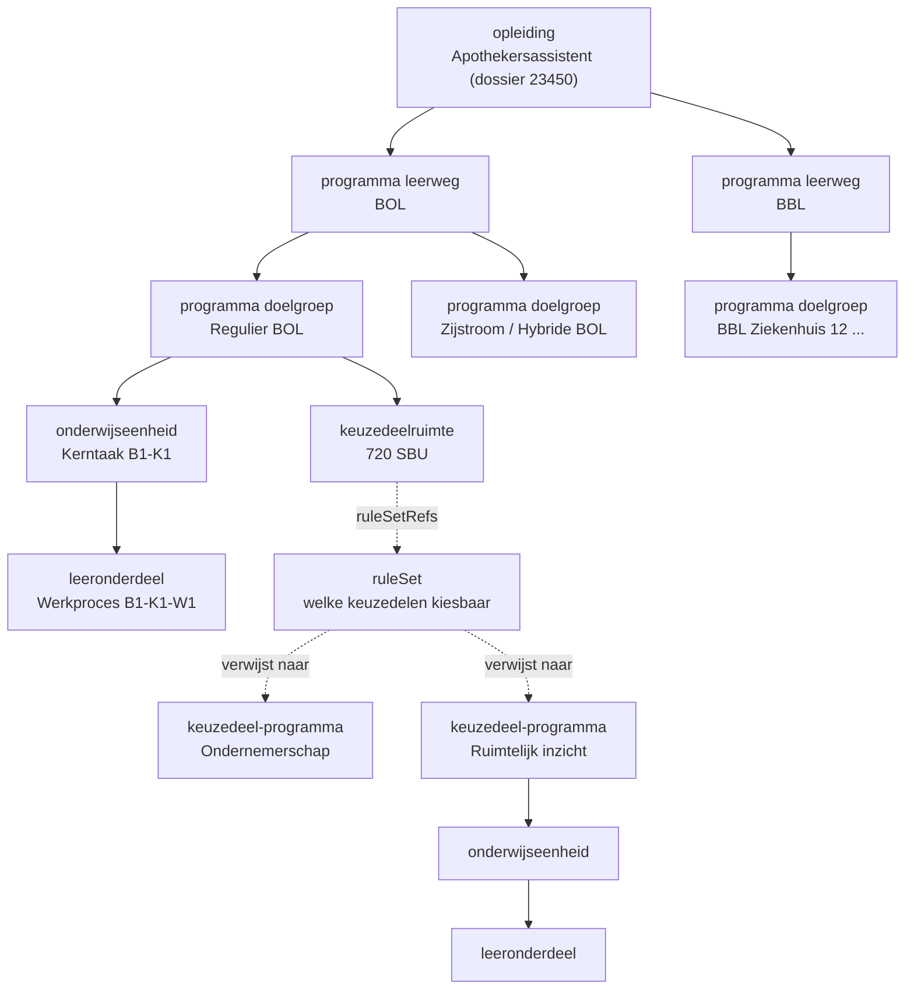

# Onderwijsspecificatie als JSON-payload (OC naar P)

Context: koppeling OC naar P (onderwijscatalogus naar planning), vroege processtap "kwalificatiekader analyseren". Scenario: LR1 (Apothekersassistent, Crebo-dossier 23450, kwalificatie 27141). Niveau: concept-payload, grofmazig (fase 1-2). Status: concept. Relateert aan: #119, #105, #84, #120.

## Inhoudsopgave

1. [Inleiding](#1-inleiding)
2. [Doel](#2-doel)
3. [Scope](#3-scope)
4. [Context](#4-context)
5. [Voorstel: hoe drukken we de gelaagdheid uit in JSON?](#5-voorstel-hoe-drukken-we-de-gelaagdheid-uit-in-json)
6. [Enumeraties (concept)](#6-enumeraties-concept)
7. [Uitwerking van de payload](#7-uitwerking-van-de-payload)
8. [Open vragen en signaleringen](#8-open-vragen-en-signaleringen)

## 1. Inleiding

#119 vraagt een eerste payload-uitwerking in JSON van de onderwijsspecificatie-boom voor LR1-3, zodat we kunnen toetsen of die vorm in latere versies overeind blijft. Dit document geeft die vorm en de ontwerpkeuze eronder: hoe leg je de gelaagdheid (de geneste specificatie) generiek vast in JSON.

De ArchiMate-view "01. Onderwijsvisie vertalen naar onderwijsaanbod - Basis Model" gebruikt nog niet het huidige begrippenkader (opleidingsspecificatie, programmaspecificatie, enzovoort). We gebruiken de ankertabel (§3.2.6) uit het OKx OEAPI consumer-profiel, het kwalificatiedossier Apothekersassistent, en de datamodel-schets uit #119.

## 2. Doel

- Een eerste, toetsbare JSON-vorm van de onderwijsspecificatie-boom voor LR1-3.
- Een generieke en herbruikbare ontwerpkeuze voor gelaagdheid en voor keuzeregels.
- Invoer voor de berichtspecificatie (AMIGO-stap 5) en het OEAPI-profiel.

Buiten scope: definitieve OEAPI-binding, endpoints, het aanbod (planbaar of geroosterd resultaat), en de interne structuur van de ruleset (die staat in #84 en #120).

## 3. Scope

- Koppeling: OC naar P, vroege processtap "kwalificatiekader analyseren".
- Leerroutes: LR1 uitgewerkt. LR2 en LR3 volgen als verschil (delta); boomstructuur gelijk, een handvol attributen wijzigt.
- Diepte: opleiding, programma, onderwijseenheid, leeronderdeel. Geen harde grens. Lesniveau buiten scope; PMO realiseert dat niet.
- Fase: grofmazig ontwerp (fase 1-2). Waarden zijn indicatief. Generieke onderdelen (taal, rekenen, burgerschap, Engels) vallen buiten deze payload.

## 4. Context

Ankertabel (§3.2.6), specificatie-kolom. Conceptniveaus, bron in het kwalificatiekader en OEAPI-mapping:

| Conceptniveau (`educationSpecificationType`) | Bron in kwalificatiekader | OEAPI-mapping (indicatief) |
|---|---|---|
| `opleiding` | Kwalificatiedossier | EducationSpecification (program) |
| `programma` | Kwalificatie | Programme |
| `onderwijseenheid` | Kerntaak | Course |
| `leeronderdeel` | Werkproces | LearningComponent |
| `keuzedeelruimte` | ruimte binnen kwalificatie | (afgeleid, geen 1:1 OEAPI-object) |
| `toetsonderdeel` | toetsing | TestComponent |
| `les` (buiten scope) | beleid instelling | LearningComponent (lesson) |

Belangrijke correctie ten opzichte van de vorige versie: de **kwalificatie ligt niet op root-niveau**. De opleiding draagt het kwalificatiedossier als leeruitkomst (`type: kwalificatiedossier`, code 23450). De kwalificatie (27141) hoort op programma-niveau (`type: kwalificatie`).

Vier eigenschappen die de gelaagdheid bepalen:

- Recursie: elk niveau is hetzelfde type object en verwijst naar zijn ouder (`parent`).
- Twee programma-lagen: programma t.b.v. leerweg (BOL, BBL) en daaronder programma t.b.v. doelgroep (regulier, zijinstromer, hybride, of organisatiespecifiek zoals een ziekenhuis-BBL). De kwalificatie-inhoud (kerntaken, werkprocessen) hangt onder de doelgroep-programma.
- Keuzeruimte is een eigen, herbruikbare specificatie (`keuzedeelruimte`), geen los veld.
- Regels staan los van de specificatie. Een specificatie verwijst via `ruleSetRefs` naar een of meer rulesets. De ruleset bepaalt welke keuzedelen kiesbaar zijn. Zie #84 en #120.



## 5. Voorstel: hoe drukken we de gelaagdheid uit in JSON?

| Optie | Vorm | Voordeel | Nadeel |
|---|---|---|---|
| A. Pure nesting | children-arrays, alles inline | Simpel | Hergebruik wordt gedupliceerd |
| B. Nesting + referenties | genest, hergebruik via uuid | Minder duplicatie | Twee relatievormen door elkaar |
| C. Recursief plat + parent | uniforme lijst, relatie via `parent` | Elk object gelijk, generiek, herbruikbaar, uitlijnbaar met OEAPI `EducationSpecification.parent` | Boom minder direct leesbaar |

Voorstel: optie C.

Ontwerpkeuzes:

- Eén uniform type. Alle specificaties staan in een platte lijst `educationSpecifications`. Elke specificatie heeft een `parent` (uuid; `null` op de root). De boom reconstrueer je door `parent` te volgen; een geneste weergave is daaruit af te leiden.
- Discriminator `educationSpecificationType` bepaalt het niveau.
- Verankering via leeruitkomst (vervangt `primaryCode`). Elke specificatie verwijst naar een leeruitkomst met een `type`. Nu de kwalificatiekader-typen (kwalificatiedossier, kwalificatie, kerntaak, werkproces, keuzedeel); later uitbreidbaar met een leeruitkomst-standaard zoals CompetentNL (ADR 0003, 0004).
- Id's zijn UUID's.
- Versionering per specificatie met semver (`MAJOR.MINOR.PATCH`). MAJOR = wijziging die betekenis of uitkomst raakt (leeruitkomsten, structuur, studielast), MINOR = additief zonder bestaande betekenis te breken, PATCH = correctie. Temporele geldigheid apart via `validFrom`/`validTo` en cohort, niet als versienummer.
- Kwalificatie op programma-niveau, dossier op opleiding-niveau (zie §4).
- `programmaLaag` onderscheidt leerweg- en doelgroep-programma. Beide zijn `programma`.
- `parent` draagt twee betekenissen: onderdeel-van (additief, bv. kerntaak onder programma) en variant-van (alternatief, bv. doelgroep onder leerweg). De aggregatie-invariant geldt alleen voor onderdeel-van.
- Niveau, leeruitkomsten en leerroute zijn afleidbaar uit de boomstructuur, niet als losse specificatie-velden. Het NLQF-niveau hangt aan de leeruitkomst. Wie een bepaalde set kerntaken en werkprocessen heeft afgerond, voldoet aan de kwalificatie. Leerroute-typen zijn indicatief voor wat mogelijk wordt en horen niet in het datamodel. Leeruitkomsten worden naar verwachting later flexibeler (ADR 0003, 0004).
- Keuzeruimte is een eigen specificatie (`keuzedeelruimte`) met studielast, herbruikbaar.
- Regels los van de spec. `ruleSetRefs` op een specificatie verwijst naar losse `ruleSets`. De ruleset draagt de kiesbaarheid (welke keuzedelen) en de voorwaarde vooraf (prerequisite). Interne structuur van de ruleset: #84 en #120.
- Elke specificatie kan `ruleSetRefs` hebben (generiek), niet alleen de keuzeruimte.
- Keuzedelen zijn zelfstandige programma-specificaties (`parent: null`), zelf opgebouwd als programma naar onderwijseenheid naar leeronderdeel. Herbruikbaar over opleidingen (N:M via ruleset-referenties).
- Aggregatie-invariant: `studyLoad` telt bottom-up op binnen onderdeel-van (SOM children = ouder). Niet over varianten (leerweg, doelgroep).

## 6. Enumeraties (concept)

Concept en te bevestigen. Open sets zijn als zodanig gemarkeerd.

| Veld | Toegestane waarden |
|---|---|
| `educationSpecificationType` | `opleiding`, `programma`, `onderwijseenheid`, `leeronderdeel`, `keuzedeelruimte`, `toetsonderdeel` (examinering/toetsing, OEAPI TestComponent) |
| `status` | `concept`, `vastgesteld`, `gepubliceerd`, `vervallen`, `gearchiveerd` |
| `version` | semver `MAJOR.MINOR.PATCH` (bv. `0.1.0`) |
| `curriculumType` | `nominaal`, `hybride`, `flexibel` |
| `programmeType` | `diplomaprogramma`, `keuzedeelprogramma`, `certificaatprogramma` (open) |
| `programmaLaag` | `leerweg`, `doelgroep` |
| `leerweg` | `BOL`, `BBL` |
| `doelgroep` | `regulier`, `zijinstromer`, `hybride`, `organisatiespecifiek` (open) || `timeAllocation` (tijdsverdeling) | `BOT` (begeleide onderwijstijd), `OOT` (onbegeleide onderwijstijd) |
| `studyLoad.unit` | `SBU`, `EC` |
| `leeruitkomst.type` | `kwalificatiedossier`, `kwalificatie`, `kerntaak`, `werkproces`, `keuzedeel` (open, uitbreidbaar met een leeruitkomst-standaard zoals CompetentNL) |
| `keuzedeelKlasse` | `algemeen-verbredend`, `beroepsspecifiek-verdiepend` (open, uitbreidbaar; #84 R10) |
| `leeruitkomst.nlqfNiveau` | `1` t/m `8` (NLQF, geldt voor alle sectoren) |

## 7. Uitwerking van de payload

Grofmazig, LR1, indicatief. `studyLoad` telt bottom-up op binnen onderdeel-van (kerntaken 2000 + 1200 + 880 = 4080; plus keuzeruimte 720 = 4800 onder Regulier BOL). Programma-varianten (leerweg BOL/BBL, doelgroep regulier/zijinstromer/hybride) zijn alternatieven, geen optelling. De inhoud hangt hier onder één doelgroep (Regulier BOL); de andere varianten zijn leeg (illustratief). Keuzedelen zijn illustratief (de prerequisite Wiskunde 1 voor Ruimtelijk inzicht komt uit #84).

### 7.1 Boomstructuur met attributen (ERD)

Alle objecten zijn hetzelfde type (`EducationSpecification`), gespecialiseerd via `educationSpecificationType`. Hieronder per laag getoond met de belangrijkste attributen. `onderdeel_van` = additief (studielast telt op), `variant_van` = alternatief. Elke entiteit draagt daarnaast `version` (semver); voor de leesbaarheid niet in elke box herhaald.

```mermaid
erDiagram
    OPLEIDING ||--o{ PROGRAMMA_LEERWEG : variant_van
    PROGRAMMA_LEERWEG ||--o{ PROGRAMMA_DOELGROEP : variant_van
    PROGRAMMA_DOELGROEP ||--o{ ONDERWIJSEENHEID : onderdeel_van
    PROGRAMMA_DOELGROEP ||--|| KEUZEDEELRUIMTE : bevat
    ONDERWIJSEENHEID ||--o{ LEERONDERDEEL : onderdeel_van
    KEUZEDEELRUIMTE }o--o{ RULESET : ruleSetRefs
    RULESET }o--o{ KEUZEDEELPROGRAMMA : kiesbaar
    KEUZEDEELPROGRAMMA ||--o{ ONDERWIJSEENHEID : onderdeel_van

    OPLEIDING {
        uuid educationSpecificationId PK
        string educationSpecificationType "opleiding"
        uuid parent "null"
        object leeruitkomst "type=kwalificatiedossier, code=23450, nlqfNiveau=4"
        string name
        string curriculumType
        string version
        date validFrom
        object studyLoad "waarde + SBU"
        string status
    }
    PROGRAMMA_LEERWEG {
        uuid educationSpecificationId PK
        string educationSpecificationType "programma"
        uuid parent FK "opleiding"
        object leeruitkomst "type=kwalificatie, code=27141"
        string programmaLaag "leerweg"
        string leerweg "BOL of BBL"
        string programmeType "diplomaprogramma"
        object studyLoad
    }
    PROGRAMMA_DOELGROEP {
        uuid educationSpecificationId PK
        string educationSpecificationType "programma"
        uuid parent FK "leerweg-programma"
        string programmaLaag "doelgroep"
        string doelgroep "regulier, zijinstromer, hybride, organisatiespecifiek"
        string leerweg
        string curriculumType
        object organisatie "optioneel, bv. Ziekenhuis 12"
        string cohort
        date startdatum
        object studyLoad
    }
    ONDERWIJSEENHEID {
        uuid educationSpecificationId PK
        string educationSpecificationType "onderwijseenheid"
        uuid parent FK "programma of keuzedeelprogramma"
        object leeruitkomst "type=kerntaak"
        string name
        object studyLoad
    }
    LEERONDERDEEL {
        uuid educationSpecificationId PK
        string educationSpecificationType "leeronderdeel"
        uuid parent FK "onderwijseenheid"
        object leeruitkomst "type=werkproces"
        string name
        string timeAllocation "BOT of OOT"
        object studyLoad
    }
    KEUZEDEELRUIMTE {
        uuid educationSpecificationId PK
        string educationSpecificationType "keuzedeelruimte"
        uuid parent FK "doelgroep-programma"
        object studyLoad "keuzeruimte in SBU"
        array ruleSetRefs FK "naar RULESET"
    }
    KEUZEDEELPROGRAMMA {
        uuid educationSpecificationId PK
        string educationSpecificationType "programma"
        uuid parent "null, zelfstandig"
        object leeruitkomst "type=keuzedeel"
        string programmeType "keuzedeelprogramma"
        string keuzedeelKlasse "algemeen-verbredend of beroepsspecifiek-verdiepend"
        object studyLoad
    }
    RULESET {
        uuid ruleSetId PK
        string name
        uuid appliesTo FK "keuzedeelruimte"
        array regels "kiesbaar + voorwaardeVooraf (prerequisite)"
    }
```



### 7.2 Payload (JSON)

```json
{
  "educationSpecifications": [
    {
      "educationSpecificationId": "79736830-1c5c-470f-b2c2-005029c96733",
      "educationSpecificationType": "opleiding",
      "version": "0.1.0",
      "parent": null,
      "leeruitkomst": { "type": "kwalificatiedossier", "code": "23450", "nlqfNiveau": 4 },
      "name": "Apothekersassistent",
      "description": "Opleiding tot apothekersassistent. Domein Zorg en welzijn.",
      "curriculumType": "nominaal",
      "status": "concept",
      "validFrom": "2026-08-01",
      "studyLoad": { "value": 4800, "unit": "SBU" }
    },
    {
      "educationSpecificationId": "5ef37812-ae0f-4232-904f-451b9928e45e",
      "educationSpecificationType": "programma",
      "version": "0.1.0",
      "parent": "79736830-1c5c-470f-b2c2-005029c96733",
      "leeruitkomst": { "type": "kwalificatie", "code": "27141" },
      "name": "Apothekersassistent, leerweg BOL",
      "programmeType": "diplomaprogramma",
      "programmaLaag": "leerweg",
      "leerweg": "BOL",
      "status": "concept",
      "studyLoad": { "value": 4800, "unit": "SBU" }
    },
    {
      "educationSpecificationId": "93f3c239-5baa-4d96-a56f-728c09d7fefe",
      "educationSpecificationType": "programma",
      "version": "0.1.0",
      "parent": "79736830-1c5c-470f-b2c2-005029c96733",
      "leeruitkomst": { "type": "kwalificatie", "code": "27141" },
      "name": "Apothekersassistent, leerweg BBL",
      "programmeType": "diplomaprogramma",
      "programmaLaag": "leerweg",
      "leerweg": "BBL",
      "status": "concept",
      "studyLoad": { "value": 4800, "unit": "SBU" }
    },
    {
      "educationSpecificationId": "7ae25c1e-ee27-43a2-a001-761ee39ea5c7",
      "educationSpecificationType": "programma",
      "version": "0.1.0",
      "parent": "5ef37812-ae0f-4232-904f-451b9928e45e",
      "leeruitkomst": { "type": "kwalificatie", "code": "27141" },
      "name": "Regulier BOL",
      "programmeType": "diplomaprogramma",
      "programmaLaag": "doelgroep",
      "doelgroep": "regulier",
      "leerweg": "BOL",
      "curriculumType": "nominaal",
      "cohort": "2026",
      "startdatum": "2026-09-01",
      "status": "concept",
      "studyLoad": { "value": 4800, "unit": "SBU" }
    },
    {
      "educationSpecificationId": "82de8b94-8a43-4ccf-8114-043f8f9bc2f8",
      "educationSpecificationType": "programma",
      "version": "0.1.0",
      "parent": "5ef37812-ae0f-4232-904f-451b9928e45e",
      "leeruitkomst": { "type": "kwalificatie", "code": "27141" },
      "name": "Zijstroom/LLO BOL (illustratief)",
      "programmeType": "diplomaprogramma",
      "programmaLaag": "doelgroep",
      "doelgroep": "zijinstromer",
      "leerweg": "BOL",
      "status": "concept",
      "studyLoad": { "value": 4800, "unit": "SBU" }
    },
    {
      "educationSpecificationId": "685dc983-1597-46d5-9935-001d7e3715ca",
      "educationSpecificationType": "programma",
      "version": "0.1.0",
      "parent": "5ef37812-ae0f-4232-904f-451b9928e45e",
      "leeruitkomst": { "type": "kwalificatie", "code": "27141" },
      "name": "Hybride BOL (illustratief)",
      "programmeType": "diplomaprogramma",
      "programmaLaag": "doelgroep",
      "doelgroep": "hybride",
      "leerweg": "BOL",
      "curriculumType": "hybride",
      "status": "concept",
      "studyLoad": { "value": 4800, "unit": "SBU" }
    },
    {
      "educationSpecificationId": "23d18a33-dafc-47e7-a60e-84cd31d27613",
      "educationSpecificationType": "programma",
      "version": "0.1.0",
      "parent": "93f3c239-5baa-4d96-a56f-728c09d7fefe",
      "leeruitkomst": { "type": "kwalificatie", "code": "27141" },
      "name": "Regulier BBL (illustratief)",
      "programmeType": "diplomaprogramma",
      "programmaLaag": "doelgroep",
      "doelgroep": "regulier",
      "leerweg": "BBL",
      "status": "concept",
      "studyLoad": { "value": 4800, "unit": "SBU" }
    },
    {
      "educationSpecificationId": "c295478c-c1c1-4647-9550-dc728aff1a7c",
      "educationSpecificationType": "programma",
      "version": "0.1.0",
      "parent": "93f3c239-5baa-4d96-a56f-728c09d7fefe",
      "leeruitkomst": { "type": "kwalificatie", "code": "27141" },
      "name": "BBL Ziekenhuis 12 (illustratief)",
      "programmeType": "diplomaprogramma",
      "programmaLaag": "doelgroep",
      "doelgroep": "organisatiespecifiek",
      "organisatie": { "naam": "Ziekenhuis 12" },
      "leerweg": "BBL",
      "toelichting": "BBL-variant, 4 dagen werken en 1 dag school.",
      "status": "concept",
      "studyLoad": { "value": 4800, "unit": "SBU" }
    },
    {
      "educationSpecificationId": "402c2342-d897-4df4-a667-7fc5bd930944",
      "educationSpecificationType": "onderwijseenheid",
      "version": "0.1.0",
      "parent": "7ae25c1e-ee27-43a2-a001-761ee39ea5c7",
      "leeruitkomst": { "type": "kerntaak", "code": "B1-K1" },
      "name": "Biedt farmaceutische patiëntenzorg",
      "studyLoad": { "value": 2000, "unit": "SBU" }
    },
    {
      "educationSpecificationId": "aa0a8af1-d383-4981-8a0f-6ec2ba4e6283",
      "educationSpecificationType": "onderwijseenheid",
      "version": "0.1.0",
      "parent": "7ae25c1e-ee27-43a2-a001-761ee39ea5c7",
      "leeruitkomst": { "type": "kerntaak", "code": "B1-K2" },
      "name": "Voert logistieke taken uit in de apotheek",
      "studyLoad": { "value": 1200, "unit": "SBU" }
    },
    {
      "educationSpecificationId": "f686a286-d555-4eda-bd22-001c5b60e4dc",
      "educationSpecificationType": "onderwijseenheid",
      "version": "0.1.0",
      "parent": "7ae25c1e-ee27-43a2-a001-761ee39ea5c7",
      "leeruitkomst": { "type": "kerntaak", "code": "B1-K3" },
      "name": "Werkt mee aan kwaliteit en deskundigheid",
      "studyLoad": { "value": 880, "unit": "SBU" }
    },
    {
      "educationSpecificationId": "327c8263-3516-4b5a-8d57-c16241ec008d",
      "educationSpecificationType": "leeronderdeel",
      "version": "0.1.0",
      "parent": "402c2342-d897-4df4-a667-7fc5bd930944",
      "leeruitkomst": { "type": "werkproces", "code": "B1-K1-W1" },
      "name": "Neemt de zorg-/adviesvraag in behandeling",
      "timeAllocation": "BOT",
      "studyLoad": { "value": 600, "unit": "SBU" }
    },
    {
      "educationSpecificationId": "29522e42-fb32-46d2-a504-0869831f941f",
      "educationSpecificationType": "leeronderdeel",
      "version": "0.1.0",
      "parent": "402c2342-d897-4df4-a667-7fc5bd930944",
      "leeruitkomst": { "type": "werkproces", "code": "B1-K1-W2" },
      "name": "Voert medicatiebewaking uit",
      "timeAllocation": "BOT",
      "studyLoad": { "value": 500, "unit": "SBU" }
    },
    {
      "educationSpecificationId": "db4ae6c8-7dda-45ef-953e-a4e8bfc557f8",
      "educationSpecificationType": "leeronderdeel",
      "version": "0.1.0",
      "parent": "402c2342-d897-4df4-a667-7fc5bd930944",
      "leeruitkomst": { "type": "werkproces", "code": "B1-K1-W3" },
      "name": "Verstrekt (zelfzorg)medicijnen en/of hulpmiddelen",
      "timeAllocation": "BOT",
      "studyLoad": { "value": 500, "unit": "SBU" }
    },
    {
      "educationSpecificationId": "2a4e31d4-2b27-401f-a28c-f152b0d502db",
      "educationSpecificationType": "leeronderdeel",
      "version": "0.1.0",
      "parent": "402c2342-d897-4df4-a667-7fc5bd930944",
      "leeruitkomst": { "type": "werkproces", "code": "B1-K1-W4" },
      "name": "Geeft informatie en advies over medicijngebruik, gezondheid en leefstijl",
      "timeAllocation": "BOT",
      "studyLoad": { "value": 400, "unit": "SBU" }
    },
    {
      "educationSpecificationId": "c36d635f-7b1c-4459-a035-adfca96768da",
      "educationSpecificationType": "leeronderdeel",
      "version": "0.1.0",
      "parent": "aa0a8af1-d383-4981-8a0f-6ec2ba4e6283",
      "leeruitkomst": { "type": "werkproces", "code": "B1-K2-W1" },
      "name": "Maakt medicijnen klaar voor gebruik en/of aflevering",
      "timeAllocation": "BOT",
      "studyLoad": { "value": 700, "unit": "SBU" }
    },
    {
      "educationSpecificationId": "c5262133-0873-44a7-9b54-d15004c9d940",
      "educationSpecificationType": "leeronderdeel",
      "version": "0.1.0",
      "parent": "aa0a8af1-d383-4981-8a0f-6ec2ba4e6283",
      "leeruitkomst": { "type": "werkproces", "code": "B1-K2-W2" },
      "name": "Houdt de voorraad bij",
      "timeAllocation": "BOT",
      "studyLoad": { "value": 500, "unit": "SBU" }
    },
    {
      "educationSpecificationId": "f956bad0-f49c-4b5c-a040-c084229b23e0",
      "educationSpecificationType": "leeronderdeel",
      "version": "0.1.0",
      "parent": "f686a286-d555-4eda-bd22-001c5b60e4dc",
      "leeruitkomst": { "type": "werkproces", "code": "B1-K3-W1" },
      "name": "Draagt bij aan sociaal veilige werkomgeving",
      "timeAllocation": "BOT",
      "studyLoad": { "value": 280, "unit": "SBU" }
    },
    {
      "educationSpecificationId": "6d5b468e-ceac-47df-b221-d09dce4cce3c",
      "educationSpecificationType": "leeronderdeel",
      "version": "0.1.0",
      "parent": "f686a286-d555-4eda-bd22-001c5b60e4dc",
      "leeruitkomst": { "type": "werkproces", "code": "B1-K3-W2" },
      "name": "Evalueert de werkzaamheden en ontwikkelt zichzelf als professional",
      "timeAllocation": "BOT",
      "studyLoad": { "value": 300, "unit": "SBU" }
    },
    {
      "educationSpecificationId": "90245c2e-2f2d-4d58-b770-24427e717f97",
      "educationSpecificationType": "leeronderdeel",
      "version": "0.1.0",
      "parent": "f686a286-d555-4eda-bd22-001c5b60e4dc",
      "leeruitkomst": { "type": "werkproces", "code": "B1-K3-W3" },
      "name": "Stemt de farmaceutische zorgverlening af",
      "timeAllocation": "BOT",
      "studyLoad": { "value": 300, "unit": "SBU" }
    },
    {
      "educationSpecificationId": "fb5be5ae-faa0-4b4b-8085-474fce9aae08",
      "educationSpecificationType": "keuzedeelruimte",
      "version": "0.1.0",
      "parent": "7ae25c1e-ee27-43a2-a001-761ee39ea5c7",
      "name": "Keuzedeelruimte",
      "description": "Ruimte binnen de kwalificatie die met keuzedelen wordt ingevuld.",
      "studyLoad": { "value": 720, "unit": "SBU" },
      "ruleSetRefs": ["e4037953-17d6-40a4-9e59-92ec1f9c19a8"]
    },
    {
      "educationSpecificationId": "6a5ec549-da21-4034-b0cd-a709731de2eb",
      "educationSpecificationType": "programma",
      "version": "0.1.0",
      "parent": null,
      "leeruitkomst": { "type": "keuzedeel", "code": "K0072" },
      "name": "Keuzedeel Ondernemerschap",
      "programmeType": "keuzedeelprogramma",
      "keuzedeelKlasse": "algemeen-verbredend",
      "studyLoad": { "value": 240, "unit": "SBU" }
    },
    {
      "educationSpecificationId": "7d4d9a10-bb71-4d05-9b30-0b79d7144be1",
      "educationSpecificationType": "onderwijseenheid",
      "version": "0.1.0",
      "parent": "6a5ec549-da21-4034-b0cd-a709731de2eb",
      "leeruitkomst": { "type": "kerntaak", "code": "K0072-K1" },
      "name": "Zet een onderneming op in de zorg (indicatief)",
      "studyLoad": { "value": 240, "unit": "SBU" }
    },
    {
      "educationSpecificationId": "b4ec6046-fae8-442e-91df-163c5e9e72f2",
      "educationSpecificationType": "leeronderdeel",
      "version": "0.1.0",
      "parent": "7d4d9a10-bb71-4d05-9b30-0b79d7144be1",
      "leeruitkomst": { "type": "werkproces", "code": "K0072-K1-W1" },
      "name": "Stelt een ondernemingsplan op (indicatief)",
      "timeAllocation": "BOT",
      "studyLoad": { "value": 240, "unit": "SBU" }
    },
    {
      "educationSpecificationId": "ecf4a1ce-8fe4-4ed2-82d4-6c743862094e",
      "educationSpecificationType": "programma",
      "version": "0.1.0",
      "parent": null,
      "leeruitkomst": { "type": "keuzedeel", "code": "K0000-ri" },
      "name": "Keuzedeel Ruimtelijk inzicht (illustratief)",
      "programmeType": "keuzedeelprogramma",
      "keuzedeelKlasse": "beroepsspecifiek-verdiepend",
      "studyLoad": { "value": 240, "unit": "SBU" }
    },
    {
      "educationSpecificationId": "20f1099a-949f-40b8-b893-1aa5bfea3f4c",
      "educationSpecificationType": "onderwijseenheid",
      "version": "0.1.0",
      "parent": "ecf4a1ce-8fe4-4ed2-82d4-6c743862094e",
      "leeruitkomst": { "type": "kerntaak", "code": "K0000-ri-K1" },
      "name": "Past ruimtelijk inzicht toe (illustratief)",
      "studyLoad": { "value": 240, "unit": "SBU" }
    },
    {
      "educationSpecificationId": "9e74eb44-1155-4882-8eb4-24e58a9146b2",
      "educationSpecificationType": "leeronderdeel",
      "version": "0.1.0",
      "parent": "20f1099a-949f-40b8-b893-1aa5bfea3f4c",
      "leeruitkomst": { "type": "werkproces", "code": "K0000-ri-K1-W1" },
      "name": "Interpreteert ruimtelijke figuren (illustratief)",
      "timeAllocation": "BOT",
      "studyLoad": { "value": 240, "unit": "SBU" }
    },
    {
      "educationSpecificationId": "65342d39-7716-4d33-a5cd-a255cc1a2feb",
      "educationSpecificationType": "programma",
      "version": "0.1.0",
      "parent": null,
      "leeruitkomst": { "type": "keuzedeel", "code": "K0000-w1" },
      "name": "Keuzedeel Wiskunde 1 (illustratief)",
      "programmeType": "keuzedeelprogramma",
      "keuzedeelKlasse": "beroepsspecifiek-verdiepend",
      "studyLoad": { "value": 240, "unit": "SBU" }
    },
    {
      "educationSpecificationId": "729972d9-b83a-418f-91ec-10db1ecb56da",
      "educationSpecificationType": "onderwijseenheid",
      "version": "0.1.0",
      "parent": "65342d39-7716-4d33-a5cd-a255cc1a2feb",
      "leeruitkomst": { "type": "kerntaak", "code": "K0000-w1-K1" },
      "name": "Beheerst basale wiskunde (illustratief)",
      "studyLoad": { "value": 240, "unit": "SBU" }
    },
    {
      "educationSpecificationId": "6952e0af-eca5-422e-aa6a-69cfd38f97c9",
      "educationSpecificationType": "leeronderdeel",
      "version": "0.1.0",
      "parent": "729972d9-b83a-418f-91ec-10db1ecb56da",
      "leeruitkomst": { "type": "werkproces", "code": "K0000-w1-K1-W1" },
      "name": "Rekent met verhoudingen en formules (illustratief)",
      "timeAllocation": "BOT",
      "studyLoad": { "value": 240, "unit": "SBU" }
    }
  ],
  "ruleSets": [
    {
      "ruleSetId": "e4037953-17d6-40a4-9e59-92ec1f9c19a8",
      "version": "0.1.0",
      "name": "Kiesbare keuzedelen voor Apothekersassistent (LR1)",
      "description": "Bepaalt welke keuzedelen in de keuzedeelruimte kiesbaar zijn. Regelstructuur wordt uitgewerkt in #84 en #120; onderstaande regels zijn indicatief.",
      "appliesTo": "fb5be5ae-faa0-4b4b-8085-474fce9aae08",
      "regels": [
        { "type": "kiesbaar", "bereik": "alle keuzedelen met keuzedeelKlasse algemeen-verbredend" },
        { "type": "kiesbaar", "keuzedeel": "ecf4a1ce-8fe4-4ed2-82d4-6c743862094e",
          "voorwaardeVooraf": [ { "vereist": "65342d39-7716-4d33-a5cd-a255cc1a2feb", "status": "afgerond" } ] }
      ]
    }
  ]
}
```

De voorwaarde vooraf (Ruimtelijk inzicht vereist Wiskunde 1) staat nu in de ruleset, niet in de specificatie. Zo blijft de regel los van het item, conform #84 R2 en #120.

## 8. Open vragen en signaleringen

- OEAPI-binding van `educationSpecificationType`. De OEAPI-enum (program, cluster, course) mapt niet 1:1 op onze conceptniveaus. Binding vaststellen in de gegevensanalyse. Signalering; geen OEAPI-kernwijziging.
- Interne structuur van de ruleset (regeltypes, parameters, evaluatie). Wordt uitgewerkt in #84 en #120. Hier alleen de referentie (`ruleSetRefs`) en indicatieve regels.
- Parent versus children. Gekozen: `parent` (recursief, plat). Een geneste weergave is afleidbaar. Te bevestigen.
- Dubbele betekenis van `parent`: onderdeel-van versus variant-van. Overwegen dit expliciet te maken (bv. veld `parentRelatie`).
- Hergebruik van kwalificatie-inhoud over doelgroep-varianten. Nu hangt de inhoud onder één doelgroep (Regulier BOL); de andere varianten zijn leeg. Bepalen: inhoud herhalen of refereren.
- `startdatum` en `cohort` raken het cohort- en planbaar-stadium, niet de pure specificatie. Plaatsing te bevestigen.
- Versionering van de boom als geheel. Nodes versioneren onafhankelijk; hoe pin je een release of snapshot van de hele specificatie-boom waar consumenten tegenaan werken? Zie `doc/OKx_Release-management-en-versionering.md`.
- Identiteit versus versie. `educationSpecificationId` blijft stabiel over versies; een specifieke versie refereren (bv. in `keuzeruimte.invulbaarDoor`) vraagt om een versie-pin. Te bepalen.
- `name` en `description` als string versus meertalig (OEAPI `LanguageTypedString[]`). Nu string, conform de stub in #119.
- Leeruitkomst enkelvoud versus meervoud. Nu één primaire leeruitkomst per specificatie (verving `primaryCode`). Een specificatie kan meerdere leeruitkomsten dekken; een array-vorm is een latere uitbreiding.
- Uitbreiding leeruitkomst-standaard. `leeruitkomst.type` is open; koppeling aan CompetentNL (of vergelijkbaar) vaststellen wanneer die standaard beschikbaar is.
- Enums in §6 zijn concept. Vaststellen welke waarden per veld gelden.
- LR2 en LR3 als delta: welke attributen wijzigen (bv. `spreidingspatroon`, `bereik`, `thuisOrganisatie`, `gastheerOrganisatie`).
