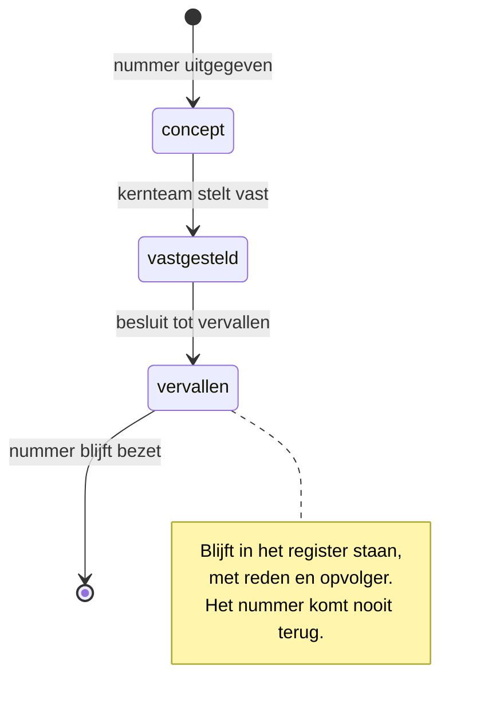

# Voorstel: conventie voor identificatienummers

Relateert aan: #135, bouwt voort op #130. Eisen: [requirements](20260804_1900_requirements-id-conventie.md).

Dit is een voorstel om af te stemmen, geen besluit. Bij akkoord wordt het een regel in `Npuls-OKx/Public`; wat daarvoor moet gebeuren staat in §10.

## 1. De vorm

```text
<soort>-<nummer>
```

Drie voorbeelden:

```text
object-014
stroom-004
eis-001
```

Meer is het niet. **De naam zit niet in het ID.** Die staat ernaast: als linktekst in markdown, als kop in het registerbestand, als `title` in een schema.

### Waarom de naam er niet in zit

Een eerdere versie van dit voorstel gebruikte `object-014-onderwijseenheid-specificatie`, naar het model van een GitHub-branchnaam. Dat bleek twee eigenschappen te beloven die elkaar uitsluiten.

Zit de naam in de bestandsnaam, dan breekt hernoemen elke verwijzing: `check-links.py` toetst het volledige pad, niet het nummer. Dat is nagemeten met het echte script, en het gaf exitcode 1. De belofte dat hernoemen gratis is ([R3](20260804_1900_requirements-id-conventie.md#r3--identiteit-staat-los-van-naam)) haalde je dus niet.

Bovendien werd het ID onvindbaar. Het patroon dat namen toeliet gaf over beide repositories **59 treffers, allemaal vals**: het Nederlands koppelt met streepjes, dus `scenario-uitwerking`, `interactie-analyse` en `eis-voor-eis` matchten allemaal, en er zat zelfs een markdown-anker tussen.

Met alleen cijfers achter de soort verdwijnen beide problemen. Het patroon wordt:

```text
\b(object|stroom|koppeling|interactie|eis|principe|scenario|besluit)-\d{3}\b
```

Nagemeten over beide repositories: **nul valse treffers**.

De les uit GitHub blijft overeind, alleen scherper dan ik hem eerst nam. Een issue is `/issues/130`, zonder naam. De naam verschijnt alleen in branchnamen, en die identificeren niets.

### De soorten

| Prefix | Waarvoor | Waar het register staat |
|---|---|---|
| `object-` | Informatie-objecten uit de ankertabel | `Objecten/` |
| `stroom-` | Informatiestromen: conceptuele gegevensbeweging tussen ketenpartners | `Informatiestromen/` |
| `koppeling-` | Gestandaardiseerde informatiestroom tussen twee referentiecomponenten | de map van de koppelingspecificatie |
| `interactie-` | Interacties binnen één koppeling | idem |
| `eis-` | Uitgangspunten en normatieve eisen | `Eisen/` |
| `principe-` | Architectuurprincipes `OKx-AP01` tot en met `OKx-AP13` | `Referentiemateriaal/principes/` |
| `scenario-` | Kaderscenario's en varianten | `Kaderscenario's/` |
| `besluit-` | Architectuurbesluiten | `Referentiemateriaal/adr/` |

Elke soort heeft één doorlopende reeks van drie cijfers met voorloopnullen: ruimte tot 999 per soort, en op naam sorteerbaar.

**Stroom en koppeling zijn niet hetzelfde**, en dat onderscheid is niet van dit voorstel. De [AMIGO-ladder](../../../.agents/skills/amigo-aanpak/SKILL.md) kent drie lagen: een *informatiestroom* is de conceptuele gegevensbeweging uit de scenario-analyse, een *koppeling* is de gestandaardiseerde vorm daarvan tussen twee referentiecomponenten, en een *koppelvlak* is de verzameling koppelingen die één component raken. Dat laatste is vastgelegd in [ADR 0021](https://github.com/Npuls-OKx/Public/blob/dev/Referentiemateriaal/adr/0021-koppeling-versus-koppelvlak-terminologie.md) en in U2. Eén stroom kan uitmonden in één koppeling, of in geen enkele zolang hij nog niet is gestandaardiseerd.

## 2. Niet alles krijgt een ID

Dit is de regel die het meeste werk bespaart. Ze volgt uit [R7](20260804_1900_requirements-id-conventie.md#r7--een-id-identificeert-over-documentgrenzen-heen):

> **Een artefact krijgt een geregistreerd ID zodra iets buiten zijn eigen document ernaar verwijst. Zolang dat niet zo is, volstaat lokale nummering.**

Waarom dat nodig is: het requirements-document hiernaast nummert zijn eisen R1 tot en met R13, en het requirements-document *keuzes rond onderwijsspecificaties* doet hetzelfde met R1 tot en met R17. `R7` wijst dus naar twee verschillende dingen. Zolang die nummers alleen binnen hun eigen document worden gelezen is dat prima. Zodra een payload eraan refereert, is het dubbelzinnig, en dat gebeurt al: `payload-regelset.md` haalt veertien R-nummers uit het keuzedocument aan.

| Wel een geregistreerd ID | Geen |
|---|---|
| Informatie-objecten, stromen, koppelingen, interacties | Eisen in een analysedocument die nergens buiten worden aangehaald |
| Uitgangspunten, principes, besluiten | Koppelvlakken: die zijn de optelsom per component en worden aangeduid met dat component |
| Kaderscenario's en varianten | Schema's: die hebben al een `$id` als URI, en twee ID's per artefact mag niet ([R1](20260804_1900_requirements-id-conventie.md#r1--eén-id-per-aangehaald-ding)) |
| | Referentiecomponenten: aangeduid met hun afkorting, die al vastligt in de instap-README |
| | Persona's, waardenlijsten, gherkin-scenario's, tussenkoppen, tabelrijen |

Vier daarvan zijn bewuste keuzes en geen omissies. **Schema's** dragen al een `$id`; dat is hun ID en er komt geen tweede naast. **Referentiecomponenten** hebben met OC, P&R, SIS, SKS en LMS een vaste, gepubliceerde afkorting die al als sleutel werkt. **Koppelvlakken** zijn geen artefact maar een verzameling. **Waardenlijsten** krijgen er pas een zodra de vocabulairespecificatie er is; dat is een eigen traject.

Eén nummer per ding. Een artefact met een geregistreerd ID gebruikt dat ID **ook als kop in zijn eigen document**; er komt geen tweede, lokale nummering naast.

## 3. De regels

### Regel 1. Een nummer wordt nooit hergebruikt

Ook niet als het artefact vervalt. Vervalt `object-014`, dan blijft dat nummer voor altijd aan dat object gebonden en krijgt de opvolger een nieuw nummer. Gaten in de reeks zijn normaal en verwacht.

De reden is de lezer van over drie jaar. Die vindt in een gearchiveerde specificatie een verwijzing naar `object-014` en moet kunnen achterhalen wat daarmee is gebeurd. Wijst dat nummer inmiddels naar iets anders, dan leest hij stilzwijgend het verkeerde, en dat merkt niemand.

Geonovum legt dezelfde regel vast voor de API Design Rules: *"Design rules have unique and permanent numbers. In the event of design rules being deprecated or restructured, they are removed from the list. Therefore, gaps in the sequence can occur."* ([APIDesignRuleNumbering.md](https://github.com/Geonovum/KP-APIs/blob/master/API-strategie-governance/APIDesignRuleNumbering.md)). Op één punt wijken we bewust af: bij Geonovum verdwijnt de vervallen regel uit de lijst, bij ons blijft hij staan met zijn status en opvolger. Zie regel 3.

### Regel 2. Een naam mag wijzigen, een nummer niet

Omdat het ID alleen uit soort en nummer bestaat, raakt hernoemen precies één plek: de kop in het registerbestand. Geen enkele verwijzing breekt, want die wijst naar `object-014.md` en die bestandsnaam verandert niet.

Voor OKx is dat geen randgeval. We lopen voor op MORA en de terminologie zet zich nog; de ankertabel is al een keer herzien.

### Regel 3. Vervallen is een status, geen verwijdering



### Regel 4. Wie het artefact toevoegt, geeft het nummer uit

Geen beheerder en geen aanvraag: kijk in het register wat het hoogste nummer is en neem het volgende.

Geven twee mensen in verschillende branches hetzelfde nummer uit, dan lost git dat **niet** op: bij losse bestanden per artefact voegt de merge beide gewoon toe. De uniciteitscontrole uit §7 moet dat vangen. Wat niet mag gebeuren is dat het stil goed lijkt te gaan.

## 4. Waar een ID staat

### De declaratie: één bestand per artefact

Het register is een map met één bestand per artefact, en de bestandsnaam is het ID:

```text
Objecten/
├── README.md            gegenereerd overzicht
├── object-001.md
├── object-014.md
└── object-027.md
```

Zo'n bestand ziet er zo uit:

```markdown
# Onderwijseenheid-specificatie

De specificatie van de fundamentele eenheid waarin onderwijs wordt ontworpen en
aangeboden, in de vorm van een samenhangend stelsel van beoogde leeruitkomsten,
leeronderdelen en toetsonderdelen.

| | |
|---|---|
| Vlak | onderwijsspecificatie |
| Niveau in het kwalificatiekader | kerntaak |
| Status | vastgesteld |
| MORA | nog niet in MORA |
| MORA-HORA-afstemming | Onderwijseenheid |
| OEAPI | `Course` |
```

De bestandsnaam draagt geen naam, dus hernoemen raakt alleen de kop hierboven.

**Waarom losse bestanden en niet één tabel.** Een wijziging aan één object is dan een diff van één bestand, te reviewen zonder de rest te lezen. Bij één grote tabel raakt elke wijziging hetzelfde bestand, en met meerdere mensen tegelijk levert dat merge-conflicten op precies het moment dat het druk is. Het aantal objecten groeit bovendien: examenplanspecificatie, resultaatstructuren en de vormen van resultaten staan al op de rol.

De keerzijde is dat je het overzicht in één oogopslag kwijtraakt. Dat lost een `README.md` op die uit de bestanden wordt gegenereerd, zodat de tabel er wel is maar niemand hem bijhoudt.

*Alternatief om te bespreken:* één tabelbestand per soort. Simpeler om aan te leggen, en voor 33 objecten goed te overzien. De afweging is of we verwachten dat meerdere mensen tegelijk aan objecten werken.

### De verwijzing in een document

```markdown
De onderwijscatalogus publiceert de
[onderwijseenheid-specificatie](../Objecten/object-014.md) voor planning.
```

Voor de lezer is dat een normale link met een leesbare naam. Voor de controle is het een verwijzing naar een bestand dat moet bestaan, en dat toetst `check-links.py` vandaag al.

### De verwijzing vanuit een JSON Schema

```json
{
  "$id": "https://okx.npuls.nl/schema/onderwijsspecificatie/alfa",
  "title": "Onderwijsspecificatie",
  "x-okx-realiseert": ["interactie-001"],
  "x-okx-object": "object-014"
}
```

Onbekende sleutelwoorden worden door de metaschema toegestaan en in de standaardmodus genegeerd. Let op: in strikte modus, bijvoorbeeld `ajv --strict`, melden validators een onbekend sleutelwoord als fout en moet het bekend worden gemaakt. Het `x-`-voorvoegsel is overigens een OpenAPI-conventie; JSON Schema kent daarvoor `$vocabulary`.

### De verwijzing in een scenario

```gherkin
# language: nl
# realiseert: interactie-001
Functionaliteit: Specificatie planbaar melden
```

Een gherkin-bestand krijgt zelf geen ID. Het draagt alleen een verwijzing naar wat het toetst.

## 5. Wat dit betekent voor wat er al ligt

We hernummeren, één keer. De conventie wordt nu voor het eerst vastgesteld, dus er is nog geen afspraak die we breken. Vanaf vaststelling geldt regel 1 onverkort: de vrijheid om te hernummeren bestaat precies één keer, en dat is nu.

Het alternatief, vier bestaande nummervormen naast elkaar toelaten om een eenmalige migratie te vermijden, zou die vormen permanent maken. Dat is de verkeerde ruil.

| Bestaat nu | Wordt | Werk |
|---|---|---|
| `U1` tot en met `U10` | `eis-001` tot en met `eis-010` | 61 verwijzingen, plus 27 ankerverwijzingen naar de U-koppen |
| `R1` tot en met `R17` in het keuzedocument | `eis-011` tot en met `eis-027` | koppen in dat document, 14 verwijzingen uit `payload-regelset.md` |
| `I1`–`I5`, `S1`–`S5`, `L1`–`L6` | `interactie-001` tot en met `interactie-016` | koppen in drie koppelingspecificaties |
| `OKx-AP01` tot en met `OKx-AP13` | `principe-001` tot en met `principe-013` | verwijzingen vanuit de uitgangspunten |
| ADR-bestandsnamen | `besluit-001.md` tot en met `besluit-024.md` | 56 padverwijzingen in Public |

Alles mechanisch: een tabel oud naar nieuw, één zoek-en-vervang, en `check-links.py` bewijst dat er niets is blijven hangen.

**Ook de interactienummers.** Die zijn per koppeling uitgedeeld met een eigen letter, `I` bij planning, `S` bij het studentinformatiesysteem, `L` bij de leeromgeving, en daardoor toevallig uniek. Dat loopt stuk zodra er een vierde koppeling komt en iemand opnieuw bij `I` begint. Welke interactie bij welke koppeling hoort, staat in het register.

**Wat je inlevert.** `U5` leest prettiger dan `eis-005`, en de uitgangspunten zeggen dat zelf: *"genummerd (U1 tot en met U10) zodat je er in een document of een review naar kunt verwijzen: conform U5"*. Dat is een reële prijs. Daar staat tegenover dat `eis-005` klikbaar is, machinaal vindbaar, en niet botst met de R-nummers uit een ander document.

## 6. Het MORA-veld en zijn waarden

Een deel van onze objecten staat nog niet in MORA. Dat is een stand van zaken en geen omissie, en het veld moet dat onderscheid dragen ([R8](20260804_1900_requirements-id-conventie.md#r8--ruimte-voor-voorlopen-op-mora)):

| Waarde | Betekenis |
|---|---|
| een URI | Vastgesteld equivalent in MORA |
| `nog niet in MORA` | Wij lopen voor. Dit is invoer voor de MORA-HORA-afstemming |
| `niet van toepassing` | Komt daar niet, bijvoorbeeld een OKx-eigen constructie |
| veld ontbreekt | Nog niet nagelopen. Dat is een fout en de controle meldt het |

Het overzicht van alles met `nog niet in MORA` is daarmee met één opdracht te maken, en dat lijstje is de agenda richting de afstemming. Het onderhoudt zichzelf.

Stand van zaken vandaag: het conceptueel gegevensoverzicht in leerroute 1 telt **33 datarijen**, waarvan er **vier** een MORA-verwijzing dragen, alle vier in het vlak kwalificatiekader. De overige 29 hebben er geen.

## 7. Wat de controle doet

Vier controles, elk met exitcode 1 bij een probleem, zodat ze in een workflow passen zoals de bestaande scripts.

| Controle | Faalt wanneer | Testgeval |
|---|---|---|
| Uniciteit | Twee bestanden claimen hetzelfde `<soort>-<nummer>` | Twee bestanden `object-014.md` in verschillende mappen |
| Bestaan | Een verwijzing wijst naar een ID dat niet in het register staat | Een document verwijst naar `object-999` |
| Onveranderlijkheid | Een ID verdwijnt uit het register of wisselt van betekenis ten opzichte van de vorige versie | Een `object-014.md` wordt verwijderd |
| Volledigheid | Een object mist het MORA-veld, of een uitgangspunt wordt nergens aangehaald | Een object zonder MORA-regel |

De laatste bepaalt of de businesslaag levend blijft. Het onderzoek bij #130 concludeert dat een businesslaag verdampt zonder eigenaar **én** zonder controle die faalt als de koppeling breekt. Deze conventie levert het tweede. Het eerste, wie eigenaar is en wie vaststelt dat iets vervalt, staat als open punt in §9.

**Wat de bestaande scripts wel en niet kunnen.** `check-links.py` dekt de markdown-verwijzingen, en dat is vandaag al zo. Het ziet echter alleen `*.md` en alleen `](...)`; de verwijzingen in JSON en in gherkin uit §4 zijn voor dat script onzichtbaar. Die vragen een eigen controle, geschat op zo'n honderd regels.

## 8. Wat we hiermee niet oplossen

- **Het gereedschap.** Dit werkt met een eigen script. Of we later OpenFastTrace gebruiken is een losse afweging; ID's zijn tekst, dus die stap blijft open.
- **Welke artefacten een ID krijgen.** §2 geeft de regel, de registers geven de invulling.
- **De koppeling naar HORA en OEAPI.** Zelfde mechaniek als het MORA-veld, maar de invulling is inhoudelijk werk.
- **De vocabulairespecificatie.** Waardenlijsten krijgen pas een ID als die er is.

## 9. Te bespreken met het kernteam

| Vraag | Voorstel | Waarom het uitmaakt |
|---|---|---|
| Hernummeren we `U1`–`U10` naar `eis-001`–`eis-010`? | Ja | 61 verwijzingen plus 27 ankers, mechanisch. Het alternatief maakt vier nummervormen permanent. Kost de leesbaarheid van "conform U5" |
| Eén bestand per artefact, of één tabel per soort? | Eén bestand | Reviewbaarheid en merge-conflicten tegenover overzicht |
| Krijgen de ADR's ook de nieuwe vorm? | Ja | Uniformiteit. Hun nummers zijn al uniek, dus alleen de vorm en de bestandsnaam wijzigen, en dat raakt 56 verwijzingen |
| Wie stelt vast dat iets vervalt, en wie is eigenaar van een register? | *geen voorstel* | Governance. Regel 3 en de vierde controle veronderstellen allebei een besluitmoment dat nergens is belegd |

De zwaarste is de eerste. Wie hernummeren van de uitgangspunten te duur vindt, kan voorstellen ze hun `U`-nummer te laten houden. Dan zijn er twee nummervormen binnen dezelfde soort en is de keuze half. Ik zou hem heel maken, juist omdat dit het enige moment is waarop het mag.

## 10. Van voorstel naar regel in Public

Bij akkoord verhuist de conventie naar `Npuls-OKx/Public`. Dit document kan daar niet ongewijzigd heen:

- de issueverwijzingen bovenaan moeten weg en de aanleiding moet in de inleiding worden uitgeschreven;
- de inleiding moet zelfdragend worden met aanleiding, context, doel en scope (U10);
- de datumprefix in de bestandsnaam vervalt;
- de links naar `Public` worden relatief.

`check-conventies.py` keurt de huidige vorm af, en terecht: dit is een meta-artefact. Het overhevelen is een eigen stap en geen bijproduct van de vaststelling.

Losse punten die hierbij horen maar niet in dit voorstel thuishoren, elk met een eigen issue:

- **U8 en `$comment`.** De volwassenheid van een schema staat nu in `$comment`, en `json-tree.py` regel 227 leest dat veld uit. Overstappen op een eigen sleutel is verdedigbaar zodra een script het uitleest, maar het is een wijziging aan Public met een scriptwijziging eraan vast.
- **De vocabulairespecificatie**, die als AMIGO-product ontbreekt.
