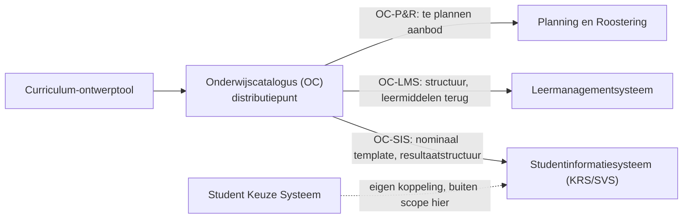
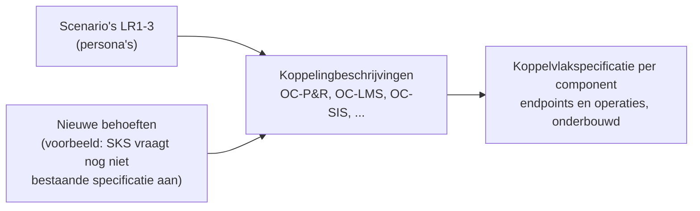

# Koppelingspecificaties

Per **koppeling** (gestandaardiseerde informatiestroom tussen twee referentiecomponenten) een eigen map met de koppelingspecificatie en de payload-specificaties voor de data binnen het afgekaderde informatiemodel van die koppeling. Het **koppelvlak** van een component is de verzameling van alle koppelingspecificaties die dat component raken. Terminologie: [ADR 0021](../../../dr/0021-koppeling-versus-koppelvlak-terminologie.md).

## Context

De keten in het kort: een **curriculum-ontwerptool (CO)** levert onderwijsspecificaties aan de **onderwijscatalogus (OC)**. De OC is het distributiepunt; van daaruit lopen drie koppelingen naar de systemen die het onderwijs klaarzetten voor de start van de student.

Actuele architectuurplaat: [OKx hoofdplaat v1.7](../../../model/informatiestromen%20hoofdplaat%20OKx/1.7/OKx%20hoofdplaat%201.7.jpg) (in het [ArchiMate-model](../../../model/)). De genummerde interpretatie van de stromen (stroom 1 tot en met 17) staat in het [Projectoverzicht](../../../../doc/OKx_Projectoverzicht.md); die tabel is nog gebaseerd op de oudere plaat (v20260317) en wordt met v1.7 verzoend. Het [OEAPI consumer-profiel](../../../docs/specificatie/okx-oeapi-consumer-profiel/README.md) gebruikt eveneens nog die oudere plaat; leidend voor de architectuur is v1.7.

Kernbegrippen die in elk document terugkomen:

- **Koppeling versus koppelvlak** ([ADR 0021](../../../dr/0021-koppeling-versus-koppelvlak-terminologie.md)): een koppeling is de informatiestroom tussen twee componenten; het koppelvlak van een component is de verzameling van al zijn koppelingen.
- **Ankertabel, zes begrippenfamilies**: kader, beoogde leeruitkomst, specificatie, aanbod, verbintenis, resultaat. De leeruitkomst is de sleutel; onderwijsresultaten hangen aan leeruitkomsten. Bron: [consumer-profiel](../../../docs/specificatie/okx-oeapi-consumer-profiel/README.md), §3.2.6.
- **Notify-then-pull** ([ADR 0020](../../../dr/0020-curriculumontwerp-onderwijscatalogus-happy-flow-synchronisatie-en-federatie-adopt-klonen.md)): de bezitter van een resource meldt een dun event met een referentie; de consument haalt de resource op wanneer die hem nodig heeft.
- **Scenario LR1-3 met persona's**: de documenten werken leerroute 1 (regulier) uit aan de hand van persona [Jochem](../../../docs/specificatie/okx-oeapi-consumer-profiel/doc/persona_jochem.md) (opleiding Apothekersassistent); LR2 en LR3 volgen als delta. Volledige leerroutes en persona's: [consumer-profiel](../../../docs/specificatie/okx-oeapi-consumer-profiel/README.md).

### Van koppelingbeschrijving naar koppelvlakspecificatie (doelbinding)

De koppelingspecificaties in deze map zijn **indicatief en onderbouwend, niet voorschrijvend**. We hebben nog beperkt zicht op de werking van het ecosysteem. Daarom bestuderen en beschrijven we het koppeling voor koppeling, scenario voor scenario: welke interacties vinden er plaats, en welke operaties, endpoints en data vragen die. OKx legt de sector niet op hoe een koppeling gerealiseerd moet worden; partijen kunnen koppelingen zelf vormgeven.

De som van de koppelingbeschrijvingen leidt tot de **koppelvlakspecificatie** per referentiecomponent (OC, P&R, LMS, SIS (KRS/SVS), later SKS): de endpoints en operaties die dat component waarschijnlijk moet bieden om het ecosysteem te laten werken, elk gegrond in een beschreven interactie (ADR 0021, consequentie interfacespecificatie).

De beschreven koppelingen zijn **niet uitputtend**. Nieuwe functionaliteit kan operaties vragen die niet uit de LR1-3-interacties naar voren komen. Voorbeeld: een studentkeuzesysteem (SKS) dat namens een student een nog niet bestaand stuk onderwijs wil aanvragen, als verzoek op het specificaties-endpoint van OC. Zo'n behoefte komt binnen als nieuw scenario met een eigen koppelingbeschrijving en onderbouwt zo een nieuwe operatie op het koppelvlak; het koppelvlak houdt die ruimte. Doelbinding vastgelegd naar aanleiding van het reviewgesprek bij PR #121.

Leesvolgorde: eerst deze instap, dan `gedeeld/` (de centrale onderwijsspecificatie-payload en de lifecycle-uitwerking), dan de koppeling van je interesse.

### Afkortingen en mappen

| Afkorting of map | Betekenis |
|---|---|
| OC | Onderwijscatalogus, het distributiepunt voor onderwijsspecificaties |
| P&R | Planning en roostering (planningssysteem en roostersysteem) |
| LMS | Leermanagementsysteem, de online leeromgeving voor de student |
| SIS | Studentinformatiesysteem, hier de combinatie KRS en SVS |
| KRS | Kernregistratiesysteem studenten (inschrijving) |
| SVS | Studentvolgsysteem (individuele structuur, voortgang, resultaten) |
| SKS | Studentkeuzesysteem, waar de student zijn keuzes maakt |
| CO | Curriculum-ontwerptool, waar onderwijsspecificaties ontstaan |
| Leerroute 1-3 | De Npuls-leerroutes: regulier, temporiseren, en versnellen. Leerroute 1 is de basis, 2 en 3 worden als verschil beschreven |
| SBU | Studiebelastingsuren |
| [`gedeeld/`](gedeeld/) | Payload-specificaties die alle koppelingen delen |
| [`oc-p-en-r/`](oc-p-en-r/) | De koppeling onderwijscatalogus naar planning en roostering |
| [`oc-lms/`](oc-lms/) | De koppeling onderwijscatalogus naar leermanagementsysteem |
| [`oc-sis-krs-svs/`](oc-sis-krs-svs/) | De koppeling onderwijscatalogus naar studentinformatiesysteem |
| [`architecture/dr/`](../../../dr/) | Decision records: de vastgelegde architectuurbesluiten (ADR's) |

### Voor schrijvers

De vaste opbouw van een koppelingspecificatie en van een payload-specificatie, plus de conventies voor veldnamen, schema's en bomen, staan in de skill [`okx-koppelingspecificatie`](../../../../.cursor/skills/okx-koppelingspecificatie/SKILL.md). Draai vóór een commit `python3 scripts/json-tree.py --check <document>`.

| Map | Koppeling | Status | Inhoud |
|---|---|---|---|
| [`gedeeld/`](gedeeld/) | (alle koppelingen) | Richtinggevend | Centrale onderwijsspecificatie-payload en lifecycle-uitwerking |
| [`oc-p-en-r/`](oc-p-en-r/) | OC naar Planning en Roostering | Alpha, voor stakeholder-review | Koppelingspecificatie, onderwijsaanbod-payload |
| [`oc-sis-krs-svs/`](oc-sis-krs-svs/) | OC naar SIS (KRS/SVS) | Concept, afgeleid, ter review | Koppelingspecificatie, resultaatstructuur/examenplan |
| [`oc-lms/`](oc-lms/) | OC naar LMS | Concept, afgeleid, ter review | Koppelingspecificatie; leermiddelkoppeling-payload volgt |

Gedeelde payload-specificaties staan **éénmaal centraal** in `gedeeld/` (ADR 0021). Elke koppelingspecificatie definieert een **gebruiksprofiel**: welke objecten en velden van de centrale payload die koppeling gebruikt. Voorbeeld: OC-SIS gebruikt de volledige leeruitkomst-laag, OC-P&R alleen leeruitkomst-ids als opaque sleutels (ADR 0023), OC-LMS de leeruitkomst-inhoudsvelden. Koppeling-specifieke payloads staan in de koppeling-map.

Scenario: LR1 (LR2 en LR3 als delta). Leidende prioriteringsvraag (onderwijsvoorbereiding): wat moeten OC-P&R, OC-LMS en OC-SIS uitgewisseld hebben om klaar te zijn voor de start van de student? Geen frontmatter in de documenten: auteurschap en datums via de git-historie, koppeling via issues en PR's (zie `../../README.md`).
