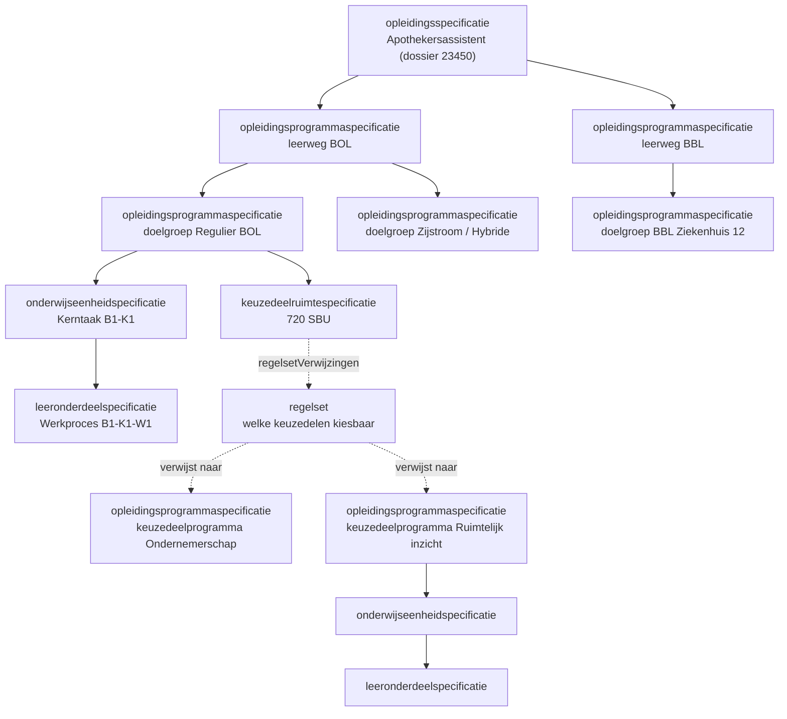

# Onderwijsspecificatie als JSON-payload

Relateert aan: #119, #105, #84, #120. Waarden in het voorbeeld zijn indicatief.

> **Centrale specificatie.** Dit document is de ene bron voor de onderwijsspecificatie-payload. Welke objecten en velden een koppeling gebruikt staat in het **gebruiksprofiel** van de betreffende koppelingspecificatie (OC-P&R, OC-SIS, OC-LMS). Leeruitkomst-inhoudsvelden zijn optioneel en profiel-afhankelijk; binnen OC-P&R zijn leeruitkomst-ids opaque sleutels ([ADR 0023](../../../../dr/0023-leeruitkomsten-als-opaque-sleutels-in-koppeling-oc-p-en-r.md)).


## Inhoudsopgave

1. [Inleiding](#1-inleiding) (context, doel, scope)
2. [Payload](#2-payload)
   - [2.1 De vorm](#21-de-vorm)
   - [2.2 Het voorbeeld](#22-het-voorbeeld)
3. [Toelichting bij de keuzes](#3-toelichting-bij-de-keuzes)
   - [3.1 Waarom plat met verwijzingen](#31-waarom-plat-met-verwijzingen)
   - [3.2 Ontwerpkeuzes](#32-ontwerpkeuzes)
   - [3.3 Lifecycle, versionering en manifest](#33-lifecycle-versionering-en-manifest)
4. [Open punten](#4-open-punten)
5. [Gerelateerde uitwerkingen](#5-gerelateerde-uitwerkingen)


## 1. Inleiding

### 1.1 Context

Een onderwijsontwerper vertaalt een kwalificatiedossier naar een **onderwijsspecificatie**: de beschrijving van wat een instelling gaat organiseren, nog los van wanneer en met wie. Die beschrijving is gelaagd, van opleiding tot leeronderdeel, en de onderwijscatalogus publiceert hem naar planning, het leermanagementsysteem en het studentinformatiesysteem.

Dit is de **centrale payload**: alle koppelingen delen hem, en elke koppelingspecificatie legt in een gebruiksprofiel vast welke objecten en velden zij gebruikt ([ADR 0021](../../../../dr/0021-koppeling-versus-koppelvlak-terminologie.md)). Ketenoverzicht, begrippen en afkortingen: de [instap in de README](../README.md#context).

Scenario is leerroute 1 (regulier), persona [Jochem](../../../../docs/specificatie/okx-oeapi-consumer-profiel/doc/persona_jochem.md), opleiding Apothekersassistent (kwalificatiedossier 23450, kwalificatie 27141). Leerroute 2 en 3 volgen als verschil. Het begrippenkader komt uit de ankertabel van het [OEAPI consumer-profiel](../../../../docs/specificatie/okx-oeapi-consumer-profiel/README.md), specificatie-kolom; de ArchiMate-view "01. Onderwijsvisie vertalen naar onderwijsaanbod" hanteert dat kader nog niet en is hier dus niet leidend.

De conceptniveaus, hun bron in het kwalificatiekader en de indicatieve mapping op de Open Onderwijs API:


| Conceptniveau (`specificatieType`) | Bron in kwalificatiekader          | OEAPI-mapping (indicatief)        |
| ---------------------------------- | ---------------------------------- | --------------------------------- |
| `opleidingsspecificatie`           | Kwalificatiedossier                | EducationSpecification (program)  |
| `opleidingsprogrammaspecificatie`  | Kwalificatie                       | Programme                         |
| `onderwijseenheidspecificatie`     | Kerntaak                           | Course                            |
| `leeronderdeelspecificatie`        | Werkproces                         | LearningComponent                 |
| `keuzedeelruimtespecificatie`      | ruimte binnen kwalificatie         | (afgeleid, geen 1:1 OEAPI-object) |
| `toetsonderdeelspecificatie`       | toetsing                           | TestComponent                     |
| `examenplanspecificatie`           | OER, summatieve resultaatstructuur | (aparte uitwerking)               |
| `lesspecificatie` (buiten scope)   | beleid instelling                  | LearningComponent (lesson)        |


De **kwalificatie ligt niet op root-niveau**: de `opleidingsspecificatie` verankert op de leeruitkomst van het kwalificatiedossier (23450), de `opleidingsprogrammaspecificatie` op die van de kwalificatie (27141). Leeruitkomsten zijn zelfstandige objecten; waarom, staat in [§3.2](#32-ontwerpkeuzes).

De boom voor leerroute 1, met de keuzedelen die via een regelset bereikbaar zijn:




### 1.2 Doel

Dit document beantwoordt drie vragen:

- Hoe leg je de gelaagdheid van een onderwijsspecificatie generiek vast in JSON, zodat de vorm ook bij latere onderwijsvormen overeind blijft?
- Hoe verhouden leeruitkomsten zich tot de specificaties, en waar hangt de kiesbaarheid van keuzedelen?
- Welke velden dragen identiteit, versie en geldigheid, zodat een afnemer weet waarop hij plant of inricht?

Geslaagd wanneer een afnemer de structuur kan reconstrueren en verwerken zonder aanvullende uitleg, en wanneer leerroute 2 en 3 erin passen met alleen een handvol afwijkende attributen.

De payload is indicatief en onderbouwt welke velden het koppelvlak nodig heeft; het is geen voorschrift aan de sector ([toelichting](../README.md#van-koppelingbeschrijving-naar-koppelvlakspecificatie-doelbinding)).

### 1.3 Scope

In scope is de specificatiestructuur van opleiding tot leeronderdeel: `opleidingsspecificatie`, `opleidingsprogrammaspecificatie`, `onderwijseenheidspecificatie` en `leeronderdeelspecificatie`, plus de `keuzedeelruimtespecificatie` en de leeruitkomsten waaraan die verankeren. Uitgewerkt voor leerroute 1 op het niveau van het grofmazige ontwerp; waarden in het voorbeeld zijn indicatief.

Vier afbakeningen die anders verwarring geven:

- De **lesspecificatie** valt erbuiten: het lesniveau leeft in het leermanagementsysteem en wordt binnen dit programma niet gerealiseerd. De diepte is verder geen harde grens.
- De **interne structuur van een regelset** staat hier niet; deze payload verwijst er alleen naar.
- **Generieke onderdelen** (taal, rekenen, burgerschap, Engels) zitten niet in dit voorbeeld.
- Het **aanbod** (wanneer, waar, met wie), de **endpoints** en de **binding met de Open Onderwijs API** zijn eigen uitwerkingen.

Al het overige valt buiten dit document.

## 2. Payload

Twee weergaven met elk een eigen taak. **De vorm** legt vast welke objecten er zijn, welke velden ze dragen en welke waarden zijn toegestaan. **Het voorbeeld** is de letterlijke payload voor leerroute 1.

### 2.1 De vorm

Alle specificaties zijn hetzelfde objecttype, gespecialiseerd via `specificatieType`. In het informatiemodel hieronder betekent `onderdeel_van` additief (de studielast telt op) en `variant_van` alternatief (een keuze tussen varianten, geen optelling). Elke entiteit draagt daarnaast `versie` (semver); dat is voor de leesbaarheid niet in elke box herhaald.

```mermaid
erDiagram
    OPLEIDINGSSPECIFICATIE ||--o{ OPLEIDINGSPROGRAMMASPECIFICATIE_LEERWEG : variant_van
    OPLEIDINGSPROGRAMMASPECIFICATIE_LEERWEG ||--o{ OPLEIDINGSPROGRAMMASPECIFICATIE_DOELGROEP : variant_van
    OPLEIDINGSPROGRAMMASPECIFICATIE_DOELGROEP ||--o{ ONDERWIJSEENHEIDSPECIFICATIE : onderdeel_van
    OPLEIDINGSPROGRAMMASPECIFICATIE_DOELGROEP ||--|| KEUZEDEELRUIMTESPECIFICATIE : bevat
    ONDERWIJSEENHEIDSPECIFICATIE ||--o{ LEERONDERDEELSPECIFICATIE : onderdeel_van
    KEUZEDEELRUIMTESPECIFICATIE }o--o{ RULESET : regelsetVerwijzingen
    RULESET }o--o{ KEUZEDEELPROGRAMMASPECIFICATIE : kiesbaar
    RULESET }o--o{ LEERUITKOMST : "stelt deelname-voorwaarden in behaalde leeruitkomsten"
    KEUZEDEELPROGRAMMASPECIFICATIE ||--o{ ONDERWIJSEENHEIDSPECIFICATIE : onderdeel_van

    OPLEIDINGSSPECIFICATIE }o--|| LEERUITKOMST : "verankert op"
    OPLEIDINGSPROGRAMMASPECIFICATIE_LEERWEG }o--|| LEERUITKOMST : "verankert op"
    OPLEIDINGSPROGRAMMASPECIFICATIE_DOELGROEP }o--|| LEERUITKOMST : "verankert op"
    ONDERWIJSEENHEIDSPECIFICATIE }o--|| LEERUITKOMST : "verankert op"
    LEERONDERDEELSPECIFICATIE }o--|| LEERUITKOMST : "verankert op"
    KEUZEDEELPROGRAMMASPECIFICATIE }o--|| LEERUITKOMST : "verankert op"
    LEERUITKOMST ||--o{ LEERUITKOMST : "aggregeert bottom-up en top-down"
    LEERUITKOMST {
        uuid leeruitkomstId PK
        string versie "eigen lifecycle"
        string naam
        object bron "standaard (nu sbb-kwalificatiekader, later bv. competentnl) + type + code"
        uuid bovenliggendLeeruitkomstId FK "recursief, orde van grootte per niveau"
        string waardedocument "diploma, certificaat, later microcredential"
        array indicatieveOmvang "SBU en/of EC naast elkaar (ADR 0004)"
        string omschrijving "optioneel, per gebruiksprofiel"
        string resultaat "optioneel"
        array gedrag "optioneel"
        int nlqfNiveau
    }
    OPLEIDINGSSPECIFICATIE {
        uuid specificatieId PK
        string specificatieType "opleidingsspecificatie"
        uuid bovenliggendId "null"
        uuid leeruitkomstId FK "sleutel naar leeruitkomst"
        string naam
        string curriculumtype
        string versie
        date geldigVanaf
        date geldigTot
        object studielast "waarde + SBU"
        array manifest "pins: id + version + relatie"
        string status
    }
    OPLEIDINGSPROGRAMMASPECIFICATIE_LEERWEG {
        uuid specificatieId PK
        string specificatieType "opleidingsprogrammaspecificatie"
        uuid bovenliggendId FK "opleiding"
        uuid leeruitkomstId FK "sleutel naar leeruitkomst"
        string programmaLaag "leerweg"
        string leerweg "BOL of BBL"
        string programmatype "diplomaprogramma"
        object studielast
    }
    OPLEIDINGSPROGRAMMASPECIFICATIE_DOELGROEP {
        uuid specificatieId PK
        string specificatieType "opleidingsprogrammaspecificatie"
        uuid bovenliggendId FK "leerweg-programma"
        uuid leeruitkomstId FK "sleutel naar leeruitkomst"
        string programmaLaag "doelgroep"
        string doelgroep "regulier, zijinstromer, hybride, organisatiespecifiek"
        string leerweg
        string curriculumtype
        object organisatie "optioneel, bv. Ziekenhuis 12"
        string cohort
        date startdatum
        date geldigVanaf
        date geldigTot
        object studielast
        array manifest "pins: id + version + relatie"
    }
    ONDERWIJSEENHEIDSPECIFICATIE {
        uuid specificatieId PK
        string specificatieType "onderwijseenheidspecificatie"
        uuid bovenliggendId FK "programma of keuzedeelprogramma"
        uuid leeruitkomstId FK "sleutel naar leeruitkomst"
        string naam
        object studielast
    }
    LEERONDERDEELSPECIFICATIE {
        uuid specificatieId PK
        string specificatieType "leeronderdeelspecificatie"
        uuid bovenliggendId FK "onderwijseenheid"
        uuid leeruitkomstId FK "sleutel naar leeruitkomst"
        string naam
        string tijdsverdeling "BOT of OOT"
        object studielast
    }
    KEUZEDEELRUIMTESPECIFICATIE {
        uuid specificatieId PK
        string specificatieType "keuzedeelruimtespecificatie"
        uuid bovenliggendId FK "doelgroep-programma"
        object studielast "keuzeruimte in SBU"
        array regelsetVerwijzingen FK "naar RULESET"
    }
    KEUZEDEELPROGRAMMASPECIFICATIE {
        uuid specificatieId PK
        string specificatieType "opleidingsprogrammaspecificatie"
        uuid bovenliggendId "null, zelfstandig"
        uuid leeruitkomstId FK "sleutel naar leeruitkomst"
        string programmatype "keuzedeelprogramma"
        string keuzedeelKlasse "algemeen-verbredend of beroepsspecifiek-verdiepend"
        object studielast
    }
    RULESET {
        uuid regelsetId PK
        string naam
        uuid appliesTo FK "keuzedeelruimte"
        array regels "kiesbaar + voorwaardeVooraf in behaalde leeruitkomsten"
    }
```




Toegestane waarden. Open sets zijn als zodanig gemarkeerd.


| Veld                                  | Toegestane waarden                                                                                                                                                                                                                                                                                                                    |
| ------------------------------------- | ------------------------------------------------------------------------------------------------------------------------------------------------------------------------------------------------------------------------------------------------------------------------------------------------------------------------------------- |
| `specificatieType`                    | `opleidingsspecificatie`, `opleidingsprogrammaspecificatie`, `onderwijseenheidspecificatie`, `leeronderdeelspecificatie`, `keuzedeelruimtespecificatie`, `toetsonderdeelspecificatie` (examinering/toetsing, OEAPI TestComponent), `examenplanspecificatie` en `resultaateenheidspecificatie` (resultaatstructuur, aparte uitwerking) |
| `manifest[].relatie`                  | `onderdeel` (additief), `variant` (alternatief), `referentie` (gepinde verwijzing)                                                                                                                                                                                                                                                    |
| `status`                              | `concept`, `vastgesteld`, `gepubliceerd`, `gedeactiveerd`, `vervallen`, `gearchiveerd`                                                                                                                                                                                                                                                |
| `versie`                              | semver `MAJOR.MINOR.PATCH` (bv. `0.1.0`)                                                                                                                                                                                                                                                                                              |
| `geldigVanaf` / `geldigTot`           | datum; geldigheidsperiode. Meerdere versies kunnen gelijktijdig actief zijn                                                                                                                                                                                                                                                           |
| `curriculumtype`                      | `nominaal`, `hybride`, `flexibel`                                                                                                                                                                                                                                                                                                     |
| `programmatype`                       | `diplomaprogramma`, `keuzedeelprogramma`, `certificaatprogramma` (open)                                                                                                                                                                                                                                                               |
| `programmaLaag`                       | `leerweg`, `doelgroep`                                                                                                                                                                                                                                                                                                                |
| `leerweg`                             | `BOL`, `BBL`                                                                                                                                                                                                                                                                                                                          |
| `doelgroep`                           | `regulier`, `zijinstromer`, `hybride`, `organisatiespecifiek` (open)                                                                                                                                                                                                                                                                  |
| `studielast.eenheid`                  | `SBU`, `EC`                                                                                                                                                                                                                                                                                                                           |
| `bron.standaard`                      | `sbb-kwalificatiekader` (open; later bv. `competentnl`)                                                                                                                                                                                                                                                                               |
| `bron.type`                           | `kwalificatiedossier`, `kwalificatie`, `kerntaak`, `werkproces`, `keuzedeel` (geldt bij `sbb-kwalificatiekader`)                                                                                                                                                                                                                      |
| `keuzedeelKlasse`                     | `algemeen-verbredend`, `beroepsspecifiek-verdiepend` (open, uitbreidbaar; #84 R10)                                                                                                                                                                                                                                                    |
| `nlqfNiveau` (op de leeruitkomst)     | `1` t/m `8` (NLQF, geldt voor alle sectoren)                                                                                                                                                                                                                                                                                          |
| `waardedocument` (op de leeruitkomst) | `diploma`, `mbo-certificaat`, `microcredential` (open)                                                                                                                                                                                                                                                                                |
| `indicatieveOmvang[].eenheid`         | `SBU`, `EC` (beide naast elkaar mogelijk, aansluiting HBO/WO; ADR 0004)                                                                                                                                                                                                                                                               |
| `voorwaardeVooraf[].status`           | `behaald` (onderwijsresultaat op de leeruitkomst; [ADR 0022](../../../../dr/0022-resultaatbegrippen-conform-rosa-koi.md))                                                                                                                                                                                                                                                                           |


### 2.2 Het voorbeeld

Leerroute 1, waarden indicatief. De `studielast` telt bottom-up op binnen onderdeel-van: de kerntaken 2000 plus 1200 plus 880 is 4080, plus de keuzeruimte van 720 komt op 4800 onder Regulier BOL. Programma-varianten tellen niet op. De inhoud hangt hier onder één doelgroep (Regulier BOL); de andere varianten zijn leeg gelaten. De voorwaarde vooraf van Wiskunde 1 voor Ruimtelijk inzicht komt uit #84.

```json
{
  "leeruitkomsten": [
    {
      "leeruitkomstId": "c5b64fe5-f7bf-490c-acaf-7af1bd24f980",
      "versie": "0.1.0",
      "naam": "Apothekersassistent (kwalificatiedossier 23450)",
      "bron": {
        "standaard": "sbb-kwalificatiekader",
        "type": "kwalificatiedossier",
        "code": "23450"
      },
      "indicatieveOmvang": [
        {
          "waarde": 4800,
          "eenheid": "SBU"
        },
        {
          "waarde": 171,
          "eenheid": "EC"
        }
      ],
      "bovenliggendLeeruitkomstId": null,
      "waardedocument": "diploma",
      "nlqfNiveau": 4
    },
    {
      "leeruitkomstId": "b84dc98b-6c5f-4ee8-bdfb-40b2639ca5a4",
      "versie": "0.1.0",
      "naam": "Apothekersassistent (kwalificatie 27141)",
      "bron": {
        "standaard": "sbb-kwalificatiekader",
        "type": "kwalificatie",
        "code": "27141"
      },
      "indicatieveOmvang": [
        {
          "waarde": 4800,
          "eenheid": "SBU"
        }
      ],
      "bovenliggendLeeruitkomstId": "c5b64fe5-f7bf-490c-acaf-7af1bd24f980"
    },
    {
      "leeruitkomstId": "12301838-92d4-4040-aea2-050bb131ceb7",
      "versie": "0.1.0",
      "naam": "Biedt farmaceutische patiëntenzorg",
      "bron": {
        "standaard": "sbb-kwalificatiekader",
        "type": "kerntaak",
        "code": "B1-K1"
      },
      "indicatieveOmvang": [
        {
          "waarde": 2000,
          "eenheid": "SBU"
        }
      ],
      "bovenliggendLeeruitkomstId": "b84dc98b-6c5f-4ee8-bdfb-40b2639ca5a4"
    },
    {
      "leeruitkomstId": "bedb4c31-b818-491c-8227-9b32146a3363",
      "versie": "0.1.0",
      "naam": "Voert logistieke taken uit in de apotheek",
      "bron": {
        "standaard": "sbb-kwalificatiekader",
        "type": "kerntaak",
        "code": "B1-K2"
      },
      "indicatieveOmvang": [
        {
          "waarde": 1200,
          "eenheid": "SBU"
        }
      ],
      "bovenliggendLeeruitkomstId": "b84dc98b-6c5f-4ee8-bdfb-40b2639ca5a4"
    },
    {
      "leeruitkomstId": "8b085118-ff81-4639-9152-ed2e447db2db",
      "versie": "0.1.0",
      "naam": "Werkt mee aan kwaliteit en deskundigheid",
      "bron": {
        "standaard": "sbb-kwalificatiekader",
        "type": "kerntaak",
        "code": "B1-K3"
      },
      "indicatieveOmvang": [
        {
          "waarde": 880,
          "eenheid": "SBU"
        }
      ],
      "bovenliggendLeeruitkomstId": "b84dc98b-6c5f-4ee8-bdfb-40b2639ca5a4"
    },
    {
      "leeruitkomstId": "78f25d62-9fd4-45c4-aa04-3d22f59213f5",
      "versie": "0.1.0",
      "naam": "Neemt de zorg-/adviesvraag in behandeling",
      "bron": {
        "standaard": "sbb-kwalificatiekader",
        "type": "werkproces",
        "code": "B1-K1-W1"
      },
      "indicatieveOmvang": [
        {
          "waarde": 600,
          "eenheid": "SBU"
        }
      ],
      "bovenliggendLeeruitkomstId": "12301838-92d4-4040-aea2-050bb131ceb7",
      "omschrijving": "De beginnend beroepsbeoefenaar neemt de zorg-/adviesvraag in behandeling en staat de patiënt en/of naastbetrokkenen te woord, stelt gerichte vragen, verzamelt en controleert patiëntinformatie en brengt de situatie in kaart, en kiest op basis hiervan een vervolgstap.",
      "resultaat": "De zorg-/adviesvraag is in behandeling genomen.",
      "gedrag": [
        "is geduldig en empathisch",
        "maakt een realistische inschatting van de situatie",
        "legt logische verbanden",
        "past de communicatie aan op doel en doelgroep",
        "communiceert duidelijk en begrijpelijk",
        "gaat discreet om met vertrouwelijke informatie",
        "werkt volgens richtlijnen en protocollen"
      ]
    },
    {
      "leeruitkomstId": "0ffa279f-c595-49d7-b033-c91f66d18bb1",
      "versie": "0.1.0",
      "naam": "Voert medicatiebewaking uit",
      "bron": {
        "standaard": "sbb-kwalificatiekader",
        "type": "werkproces",
        "code": "B1-K1-W2"
      },
      "indicatieveOmvang": [
        {
          "waarde": 500,
          "eenheid": "SBU"
        }
      ],
      "bovenliggendLeeruitkomstId": "12301838-92d4-4040-aea2-050bb131ceb7"
    },
    {
      "leeruitkomstId": "9d6a5081-9356-4058-8ac0-a4df8f8c60bd",
      "versie": "0.1.0",
      "naam": "Verstrekt (zelfzorg)medicijnen en/of hulpmiddelen",
      "bron": {
        "standaard": "sbb-kwalificatiekader",
        "type": "werkproces",
        "code": "B1-K1-W3"
      },
      "indicatieveOmvang": [
        {
          "waarde": 500,
          "eenheid": "SBU"
        }
      ],
      "bovenliggendLeeruitkomstId": "12301838-92d4-4040-aea2-050bb131ceb7"
    },
    {
      "leeruitkomstId": "71f42c36-dcfb-42ec-b492-8ed665639eda",
      "versie": "0.1.0",
      "naam": "Geeft informatie en advies over medicijngebruik, gezondheid en leefstijl",
      "bron": {
        "standaard": "sbb-kwalificatiekader",
        "type": "werkproces",
        "code": "B1-K1-W4"
      },
      "indicatieveOmvang": [
        {
          "waarde": 400,
          "eenheid": "SBU"
        }
      ],
      "bovenliggendLeeruitkomstId": "12301838-92d4-4040-aea2-050bb131ceb7"
    },
    {
      "leeruitkomstId": "1d5f3f8e-76d1-4bf1-bcf2-986a4a2fe7fd",
      "versie": "0.1.0",
      "naam": "Maakt medicijnen klaar voor gebruik en/of aflevering",
      "bron": {
        "standaard": "sbb-kwalificatiekader",
        "type": "werkproces",
        "code": "B1-K2-W1"
      },
      "indicatieveOmvang": [
        {
          "waarde": 700,
          "eenheid": "SBU"
        }
      ],
      "bovenliggendLeeruitkomstId": "bedb4c31-b818-491c-8227-9b32146a3363"
    },
    {
      "leeruitkomstId": "772c792b-f5ec-425f-9dd7-87d8fad4d2db",
      "versie": "0.1.0",
      "naam": "Houdt de voorraad bij",
      "bron": {
        "standaard": "sbb-kwalificatiekader",
        "type": "werkproces",
        "code": "B1-K2-W2"
      },
      "indicatieveOmvang": [
        {
          "waarde": 500,
          "eenheid": "SBU"
        }
      ],
      "bovenliggendLeeruitkomstId": "bedb4c31-b818-491c-8227-9b32146a3363"
    },
    {
      "leeruitkomstId": "d929b0df-9119-4b89-ada3-342ab6b9f937",
      "versie": "0.1.0",
      "naam": "Draagt bij aan sociaal veilige werkomgeving",
      "bron": {
        "standaard": "sbb-kwalificatiekader",
        "type": "werkproces",
        "code": "B1-K3-W1"
      },
      "indicatieveOmvang": [
        {
          "waarde": 280,
          "eenheid": "SBU"
        }
      ],
      "bovenliggendLeeruitkomstId": "8b085118-ff81-4639-9152-ed2e447db2db"
    },
    {
      "leeruitkomstId": "5cb6ce9c-82cc-4143-86bd-9f375b2901bc",
      "versie": "0.1.0",
      "naam": "Evalueert de werkzaamheden en ontwikkelt zichzelf als professional",
      "bron": {
        "standaard": "sbb-kwalificatiekader",
        "type": "werkproces",
        "code": "B1-K3-W2"
      },
      "indicatieveOmvang": [
        {
          "waarde": 300,
          "eenheid": "SBU"
        }
      ],
      "bovenliggendLeeruitkomstId": "8b085118-ff81-4639-9152-ed2e447db2db"
    },
    {
      "leeruitkomstId": "ac69e604-6192-4eaf-b786-ed2668dc0faf",
      "versie": "0.1.0",
      "naam": "Stemt de farmaceutische zorgverlening af",
      "bron": {
        "standaard": "sbb-kwalificatiekader",
        "type": "werkproces",
        "code": "B1-K3-W3"
      },
      "indicatieveOmvang": [
        {
          "waarde": 300,
          "eenheid": "SBU"
        }
      ],
      "bovenliggendLeeruitkomstId": "8b085118-ff81-4639-9152-ed2e447db2db"
    },
    {
      "leeruitkomstId": "4dca5ee6-ea76-4cc2-ac34-bbd466d7b6d3",
      "versie": "0.1.0",
      "naam": "Keuzedeel Ondernemerschap",
      "bron": {
        "standaard": "sbb-kwalificatiekader",
        "type": "keuzedeel",
        "code": "K0072"
      },
      "indicatieveOmvang": [
        {
          "waarde": 240,
          "eenheid": "SBU"
        },
        {
          "waarde": 8.6,
          "eenheid": "EC"
        }
      ],
      "bovenliggendLeeruitkomstId": null,
      "waardedocument": "mbo-certificaat"
    },
    {
      "leeruitkomstId": "235745ac-bf0f-4a94-b966-aa4ebbfcdabb",
      "versie": "0.1.0",
      "naam": "Zet een onderneming op in de zorg (indicatief)",
      "bron": {
        "standaard": "sbb-kwalificatiekader",
        "type": "kerntaak",
        "code": "K0072-K1"
      },
      "indicatieveOmvang": [
        {
          "waarde": 240,
          "eenheid": "SBU"
        }
      ],
      "bovenliggendLeeruitkomstId": "4dca5ee6-ea76-4cc2-ac34-bbd466d7b6d3"
    },
    {
      "leeruitkomstId": "bfcef8b4-49e6-4ba4-87a5-36389838969b",
      "versie": "0.1.0",
      "naam": "Stelt een ondernemingsplan op (indicatief)",
      "bron": {
        "standaard": "sbb-kwalificatiekader",
        "type": "werkproces",
        "code": "K0072-K1-W1"
      },
      "indicatieveOmvang": [
        {
          "waarde": 240,
          "eenheid": "SBU"
        }
      ],
      "bovenliggendLeeruitkomstId": "235745ac-bf0f-4a94-b966-aa4ebbfcdabb"
    },
    {
      "leeruitkomstId": "a12bbc9c-ce75-41df-837b-489f46df500d",
      "versie": "0.1.0",
      "naam": "Keuzedeel Ruimtelijk inzicht (illustratief)",
      "bron": {
        "standaard": "sbb-kwalificatiekader",
        "type": "keuzedeel",
        "code": "K0000-ri"
      },
      "indicatieveOmvang": [
        {
          "waarde": 240,
          "eenheid": "SBU"
        },
        {
          "waarde": 8.6,
          "eenheid": "EC"
        }
      ],
      "bovenliggendLeeruitkomstId": null,
      "waardedocument": "mbo-certificaat"
    },
    {
      "leeruitkomstId": "3f9dea35-395d-4a4b-8474-64f0d45d19dd",
      "versie": "0.1.0",
      "naam": "Past ruimtelijk inzicht toe (illustratief)",
      "bron": {
        "standaard": "sbb-kwalificatiekader",
        "type": "kerntaak",
        "code": "K0000-ri-K1"
      },
      "indicatieveOmvang": [
        {
          "waarde": 240,
          "eenheid": "SBU"
        }
      ],
      "bovenliggendLeeruitkomstId": "a12bbc9c-ce75-41df-837b-489f46df500d"
    },
    {
      "leeruitkomstId": "92476363-cd8e-4b3c-aeea-b70add98786f",
      "versie": "0.1.0",
      "naam": "Interpreteert ruimtelijke figuren (illustratief)",
      "bron": {
        "standaard": "sbb-kwalificatiekader",
        "type": "werkproces",
        "code": "K0000-ri-K1-W1"
      },
      "indicatieveOmvang": [
        {
          "waarde": 240,
          "eenheid": "SBU"
        }
      ],
      "bovenliggendLeeruitkomstId": "3f9dea35-395d-4a4b-8474-64f0d45d19dd"
    },
    {
      "leeruitkomstId": "0d83e73a-e0d8-47de-8b83-983d2b8226e8",
      "versie": "0.1.0",
      "naam": "Keuzedeel Wiskunde 1 (illustratief)",
      "bron": {
        "standaard": "sbb-kwalificatiekader",
        "type": "keuzedeel",
        "code": "K0000-w1"
      },
      "indicatieveOmvang": [
        {
          "waarde": 240,
          "eenheid": "SBU"
        },
        {
          "waarde": 8.6,
          "eenheid": "EC"
        }
      ],
      "bovenliggendLeeruitkomstId": null,
      "waardedocument": "mbo-certificaat"
    },
    {
      "leeruitkomstId": "c980007d-93db-40c9-bd8e-405293f1b20f",
      "versie": "0.1.0",
      "naam": "Beheerst basale wiskunde (illustratief)",
      "bron": {
        "standaard": "sbb-kwalificatiekader",
        "type": "kerntaak",
        "code": "K0000-w1-K1"
      },
      "indicatieveOmvang": [
        {
          "waarde": 240,
          "eenheid": "SBU"
        }
      ],
      "bovenliggendLeeruitkomstId": "0d83e73a-e0d8-47de-8b83-983d2b8226e8"
    },
    {
      "leeruitkomstId": "d44a185e-1348-4ed7-92a4-f0cb898dd85b",
      "versie": "0.1.0",
      "naam": "Rekent met verhoudingen en formules (illustratief)",
      "bron": {
        "standaard": "sbb-kwalificatiekader",
        "type": "werkproces",
        "code": "K0000-w1-K1-W1"
      },
      "indicatieveOmvang": [
        {
          "waarde": 240,
          "eenheid": "SBU"
        }
      ],
      "bovenliggendLeeruitkomstId": "c980007d-93db-40c9-bd8e-405293f1b20f"
    }
  ],
  "onderwijsspecificaties": [
    {
      "specificatieId": "79736830-1c5c-470f-b2c2-005029c96733",
      "specificatieType": "opleidingsspecificatie",
      "versie": "0.1.0",
      "bovenliggendId": null,
      "leeruitkomstId": "c5b64fe5-f7bf-490c-acaf-7af1bd24f980",
      "naam": "Apothekersassistent",
      "omschrijving": "Opleiding tot apothekersassistent. Domein Zorg en welzijn.",
      "curriculumtype": "nominaal",
      "status": "concept",
      "geldigVanaf": "2026-08-01",
      "geldigTot": null,
      "studielast": {
        "waarde": 4800,
        "eenheid": "SBU"
      },
      "manifest": [
        {
          "specificatieId": "5ef37812-ae0f-4232-904f-451b9928e45e",
          "versie": "0.1.0",
          "relatie": "variant"
        },
        {
          "specificatieId": "93f3c239-5baa-4d96-a56f-728c09d7fefe",
          "versie": "0.1.0",
          "relatie": "variant"
        }
      ]
    },
    {
      "specificatieId": "5ef37812-ae0f-4232-904f-451b9928e45e",
      "specificatieType": "opleidingsprogrammaspecificatie",
      "versie": "0.1.0",
      "bovenliggendId": "79736830-1c5c-470f-b2c2-005029c96733",
      "leeruitkomstId": "b84dc98b-6c5f-4ee8-bdfb-40b2639ca5a4",
      "naam": "Apothekersassistent, leerweg BOL",
      "programmatype": "diplomaprogramma",
      "programmaLaag": "leerweg",
      "leerweg": "BOL",
      "status": "concept",
      "studielast": {
        "waarde": 4800,
        "eenheid": "SBU"
      }
    },
    {
      "specificatieId": "93f3c239-5baa-4d96-a56f-728c09d7fefe",
      "specificatieType": "opleidingsprogrammaspecificatie",
      "versie": "0.1.0",
      "bovenliggendId": "79736830-1c5c-470f-b2c2-005029c96733",
      "leeruitkomstId": "b84dc98b-6c5f-4ee8-bdfb-40b2639ca5a4",
      "naam": "Apothekersassistent, leerweg BBL",
      "programmatype": "diplomaprogramma",
      "programmaLaag": "leerweg",
      "leerweg": "BBL",
      "status": "concept",
      "studielast": {
        "waarde": 4800,
        "eenheid": "SBU"
      }
    },
    {
      "specificatieId": "7ae25c1e-ee27-43a2-a001-761ee39ea5c7",
      "specificatieType": "opleidingsprogrammaspecificatie",
      "versie": "0.1.0",
      "bovenliggendId": "5ef37812-ae0f-4232-904f-451b9928e45e",
      "leeruitkomstId": "b84dc98b-6c5f-4ee8-bdfb-40b2639ca5a4",
      "naam": "Regulier BOL",
      "programmatype": "diplomaprogramma",
      "programmaLaag": "doelgroep",
      "doelgroep": "regulier",
      "leerweg": "BOL",
      "curriculumtype": "nominaal",
      "cohort": "2026",
      "startdatum": "2026-09-01",
      "geldigVanaf": "2026-09-01",
      "geldigTot": null,
      "status": "concept",
      "studielast": {
        "waarde": 4800,
        "eenheid": "SBU"
      },
      "manifest": [
        {
          "specificatieId": "402c2342-d897-4df4-a667-7fc5bd930944",
          "versie": "0.1.0",
          "relatie": "onderdeel"
        },
        {
          "specificatieId": "aa0a8af1-d383-4981-8a0f-6ec2ba4e6283",
          "versie": "0.1.0",
          "relatie": "onderdeel"
        },
        {
          "specificatieId": "f686a286-d555-4eda-bd22-001c5b60e4dc",
          "versie": "0.1.0",
          "relatie": "onderdeel"
        },
        {
          "specificatieId": "fb5be5ae-faa0-4b4b-8085-474fce9aae08",
          "versie": "0.1.0",
          "relatie": "onderdeel"
        }
      ]
    },
    {
      "specificatieId": "82de8b94-8a43-4ccf-8114-043f8f9bc2f8",
      "specificatieType": "opleidingsprogrammaspecificatie",
      "versie": "0.1.0",
      "bovenliggendId": "5ef37812-ae0f-4232-904f-451b9928e45e",
      "leeruitkomstId": "b84dc98b-6c5f-4ee8-bdfb-40b2639ca5a4",
      "naam": "Zijstroom/LLO BOL (illustratief)",
      "programmatype": "diplomaprogramma",
      "programmaLaag": "doelgroep",
      "doelgroep": "zijinstromer",
      "leerweg": "BOL",
      "status": "concept",
      "studielast": {
        "waarde": 4800,
        "eenheid": "SBU"
      }
    },
    {
      "specificatieId": "685dc983-1597-46d5-9935-001d7e3715ca",
      "specificatieType": "opleidingsprogrammaspecificatie",
      "versie": "0.1.0",
      "bovenliggendId": "5ef37812-ae0f-4232-904f-451b9928e45e",
      "leeruitkomstId": "b84dc98b-6c5f-4ee8-bdfb-40b2639ca5a4",
      "naam": "Hybride BOL (illustratief)",
      "programmatype": "diplomaprogramma",
      "programmaLaag": "doelgroep",
      "doelgroep": "hybride",
      "leerweg": "BOL",
      "curriculumtype": "hybride",
      "status": "concept",
      "studielast": {
        "waarde": 4800,
        "eenheid": "SBU"
      }
    },
    {
      "specificatieId": "23d18a33-dafc-47e7-a60e-84cd31d27613",
      "specificatieType": "opleidingsprogrammaspecificatie",
      "versie": "0.1.0",
      "bovenliggendId": "93f3c239-5baa-4d96-a56f-728c09d7fefe",
      "leeruitkomstId": "b84dc98b-6c5f-4ee8-bdfb-40b2639ca5a4",
      "naam": "Regulier BBL (illustratief)",
      "programmatype": "diplomaprogramma",
      "programmaLaag": "doelgroep",
      "doelgroep": "regulier",
      "leerweg": "BBL",
      "status": "concept",
      "studielast": {
        "waarde": 4800,
        "eenheid": "SBU"
      }
    },
    {
      "specificatieId": "c295478c-c1c1-4647-9550-dc728aff1a7c",
      "specificatieType": "opleidingsprogrammaspecificatie",
      "versie": "0.1.0",
      "bovenliggendId": "93f3c239-5baa-4d96-a56f-728c09d7fefe",
      "leeruitkomstId": "b84dc98b-6c5f-4ee8-bdfb-40b2639ca5a4",
      "naam": "BBL Ziekenhuis 12 (illustratief)",
      "programmatype": "diplomaprogramma",
      "programmaLaag": "doelgroep",
      "doelgroep": "organisatiespecifiek",
      "organisatie": {
        "naam": "Ziekenhuis 12"
      },
      "leerweg": "BBL",
      "toelichting": "BBL-variant, 4 dagen werken en 1 dag school.",
      "status": "concept",
      "studielast": {
        "waarde": 4800,
        "eenheid": "SBU"
      }
    },
    {
      "specificatieId": "402c2342-d897-4df4-a667-7fc5bd930944",
      "specificatieType": "onderwijseenheidspecificatie",
      "versie": "0.1.0",
      "bovenliggendId": "7ae25c1e-ee27-43a2-a001-761ee39ea5c7",
      "leeruitkomstId": "12301838-92d4-4040-aea2-050bb131ceb7",
      "naam": "Biedt farmaceutische patiëntenzorg",
      "studielast": {
        "waarde": 2000,
        "eenheid": "SBU"
      }
    },
    {
      "specificatieId": "aa0a8af1-d383-4981-8a0f-6ec2ba4e6283",
      "specificatieType": "onderwijseenheidspecificatie",
      "versie": "0.1.0",
      "bovenliggendId": "7ae25c1e-ee27-43a2-a001-761ee39ea5c7",
      "leeruitkomstId": "bedb4c31-b818-491c-8227-9b32146a3363",
      "naam": "Voert logistieke taken uit in de apotheek",
      "studielast": {
        "waarde": 1200,
        "eenheid": "SBU"
      }
    },
    {
      "specificatieId": "f686a286-d555-4eda-bd22-001c5b60e4dc",
      "specificatieType": "onderwijseenheidspecificatie",
      "versie": "0.1.0",
      "bovenliggendId": "7ae25c1e-ee27-43a2-a001-761ee39ea5c7",
      "leeruitkomstId": "8b085118-ff81-4639-9152-ed2e447db2db",
      "naam": "Werkt mee aan kwaliteit en deskundigheid",
      "studielast": {
        "waarde": 880,
        "eenheid": "SBU"
      }
    },
    {
      "specificatieId": "327c8263-3516-4b5a-8d57-c16241ec008d",
      "specificatieType": "leeronderdeelspecificatie",
      "versie": "0.1.0",
      "bovenliggendId": "402c2342-d897-4df4-a667-7fc5bd930944",
      "leeruitkomstId": "78f25d62-9fd4-45c4-aa04-3d22f59213f5",
      "naam": "Neemt de zorg-/adviesvraag in behandeling",
      "tijdsverdeling": "BOT",
      "studielast": {
        "waarde": 600,
        "eenheid": "SBU"
      }
    },
    {
      "specificatieId": "29522e42-fb32-46d2-a504-0869831f941f",
      "specificatieType": "leeronderdeelspecificatie",
      "versie": "0.1.0",
      "bovenliggendId": "402c2342-d897-4df4-a667-7fc5bd930944",
      "leeruitkomstId": "0ffa279f-c595-49d7-b033-c91f66d18bb1",
      "naam": "Voert medicatiebewaking uit",
      "tijdsverdeling": "BOT",
      "studielast": {
        "waarde": 500,
        "eenheid": "SBU"
      }
    },
    {
      "specificatieId": "db4ae6c8-7dda-45ef-953e-a4e8bfc557f8",
      "specificatieType": "leeronderdeelspecificatie",
      "versie": "0.1.0",
      "bovenliggendId": "402c2342-d897-4df4-a667-7fc5bd930944",
      "leeruitkomstId": "9d6a5081-9356-4058-8ac0-a4df8f8c60bd",
      "naam": "Verstrekt (zelfzorg)medicijnen en/of hulpmiddelen",
      "tijdsverdeling": "BOT",
      "studielast": {
        "waarde": 500,
        "eenheid": "SBU"
      }
    },
    {
      "specificatieId": "2a4e31d4-2b27-401f-a28c-f152b0d502db",
      "specificatieType": "leeronderdeelspecificatie",
      "versie": "0.1.0",
      "bovenliggendId": "402c2342-d897-4df4-a667-7fc5bd930944",
      "leeruitkomstId": "71f42c36-dcfb-42ec-b492-8ed665639eda",
      "naam": "Geeft informatie en advies over medicijngebruik, gezondheid en leefstijl",
      "tijdsverdeling": "BOT",
      "studielast": {
        "waarde": 400,
        "eenheid": "SBU"
      }
    },
    {
      "specificatieId": "c36d635f-7b1c-4459-a035-adfca96768da",
      "specificatieType": "leeronderdeelspecificatie",
      "versie": "0.1.0",
      "bovenliggendId": "aa0a8af1-d383-4981-8a0f-6ec2ba4e6283",
      "leeruitkomstId": "1d5f3f8e-76d1-4bf1-bcf2-986a4a2fe7fd",
      "naam": "Maakt medicijnen klaar voor gebruik en/of aflevering",
      "tijdsverdeling": "BOT",
      "studielast": {
        "waarde": 700,
        "eenheid": "SBU"
      }
    },
    {
      "specificatieId": "c5262133-0873-44a7-9b54-d15004c9d940",
      "specificatieType": "leeronderdeelspecificatie",
      "versie": "0.1.0",
      "bovenliggendId": "aa0a8af1-d383-4981-8a0f-6ec2ba4e6283",
      "leeruitkomstId": "772c792b-f5ec-425f-9dd7-87d8fad4d2db",
      "naam": "Houdt de voorraad bij",
      "tijdsverdeling": "BOT",
      "studielast": {
        "waarde": 500,
        "eenheid": "SBU"
      }
    },
    {
      "specificatieId": "f956bad0-f49c-4b5c-a040-c084229b23e0",
      "specificatieType": "leeronderdeelspecificatie",
      "versie": "0.1.0",
      "bovenliggendId": "f686a286-d555-4eda-bd22-001c5b60e4dc",
      "leeruitkomstId": "d929b0df-9119-4b89-ada3-342ab6b9f937",
      "naam": "Draagt bij aan sociaal veilige werkomgeving",
      "tijdsverdeling": "BOT",
      "studielast": {
        "waarde": 280,
        "eenheid": "SBU"
      }
    },
    {
      "specificatieId": "6d5b468e-ceac-47df-b221-d09dce4cce3c",
      "specificatieType": "leeronderdeelspecificatie",
      "versie": "0.1.0",
      "bovenliggendId": "f686a286-d555-4eda-bd22-001c5b60e4dc",
      "leeruitkomstId": "5cb6ce9c-82cc-4143-86bd-9f375b2901bc",
      "naam": "Evalueert de werkzaamheden en ontwikkelt zichzelf als professional",
      "tijdsverdeling": "BOT",
      "studielast": {
        "waarde": 300,
        "eenheid": "SBU"
      }
    },
    {
      "specificatieId": "90245c2e-2f2d-4d58-b770-24427e717f97",
      "specificatieType": "leeronderdeelspecificatie",
      "versie": "0.1.0",
      "bovenliggendId": "f686a286-d555-4eda-bd22-001c5b60e4dc",
      "leeruitkomstId": "ac69e604-6192-4eaf-b786-ed2668dc0faf",
      "naam": "Stemt de farmaceutische zorgverlening af",
      "tijdsverdeling": "BOT",
      "studielast": {
        "waarde": 300,
        "eenheid": "SBU"
      }
    },
    {
      "specificatieId": "fb5be5ae-faa0-4b4b-8085-474fce9aae08",
      "specificatieType": "keuzedeelruimtespecificatie",
      "versie": "0.1.0",
      "bovenliggendId": "7ae25c1e-ee27-43a2-a001-761ee39ea5c7",
      "naam": "Keuzedeelruimte",
      "omschrijving": "Ruimte binnen de kwalificatie die met keuzedelen wordt ingevuld.",
      "studielast": {
        "waarde": 720,
        "eenheid": "SBU"
      },
      "regelsetVerwijzingen": [
        "e4037953-17d6-40a4-9e59-92ec1f9c19a8"
      ],
      "manifest": [
        {
          "specificatieId": "6a5ec549-da21-4034-b0cd-a709731de2eb",
          "versie": "0.1.0",
          "relatie": "referentie"
        },
        {
          "specificatieId": "ecf4a1ce-8fe4-4ed2-82d4-6c743862094e",
          "versie": "0.1.0",
          "relatie": "referentie"
        },
        {
          "specificatieId": "65342d39-7716-4d33-a5cd-a255cc1a2feb",
          "versie": "0.1.0",
          "relatie": "referentie"
        }
      ]
    },
    {
      "specificatieId": "6a5ec549-da21-4034-b0cd-a709731de2eb",
      "specificatieType": "opleidingsprogrammaspecificatie",
      "versie": "0.1.0",
      "bovenliggendId": null,
      "leeruitkomstId": "4dca5ee6-ea76-4cc2-ac34-bbd466d7b6d3",
      "naam": "Keuzedeel Ondernemerschap",
      "programmatype": "keuzedeelprogramma",
      "keuzedeelKlasse": "algemeen-verbredend",
      "studielast": {
        "waarde": 240,
        "eenheid": "SBU"
      }
    },
    {
      "specificatieId": "7d4d9a10-bb71-4d05-9b30-0b79d7144be1",
      "specificatieType": "onderwijseenheidspecificatie",
      "versie": "0.1.0",
      "bovenliggendId": "6a5ec549-da21-4034-b0cd-a709731de2eb",
      "leeruitkomstId": "235745ac-bf0f-4a94-b966-aa4ebbfcdabb",
      "naam": "Zet een onderneming op in de zorg (indicatief)",
      "studielast": {
        "waarde": 240,
        "eenheid": "SBU"
      }
    },
    {
      "specificatieId": "b4ec6046-fae8-442e-91df-163c5e9e72f2",
      "specificatieType": "leeronderdeelspecificatie",
      "versie": "0.1.0",
      "bovenliggendId": "7d4d9a10-bb71-4d05-9b30-0b79d7144be1",
      "leeruitkomstId": "bfcef8b4-49e6-4ba4-87a5-36389838969b",
      "naam": "Stelt een ondernemingsplan op (indicatief)",
      "tijdsverdeling": "BOT",
      "studielast": {
        "waarde": 240,
        "eenheid": "SBU"
      }
    },
    {
      "specificatieId": "ecf4a1ce-8fe4-4ed2-82d4-6c743862094e",
      "specificatieType": "opleidingsprogrammaspecificatie",
      "versie": "0.1.0",
      "bovenliggendId": null,
      "leeruitkomstId": "a12bbc9c-ce75-41df-837b-489f46df500d",
      "naam": "Keuzedeel Ruimtelijk inzicht (illustratief)",
      "programmatype": "keuzedeelprogramma",
      "keuzedeelKlasse": "beroepsspecifiek-verdiepend",
      "studielast": {
        "waarde": 240,
        "eenheid": "SBU"
      }
    },
    {
      "specificatieId": "20f1099a-949f-40b8-b893-1aa5bfea3f4c",
      "specificatieType": "onderwijseenheidspecificatie",
      "versie": "0.1.0",
      "bovenliggendId": "ecf4a1ce-8fe4-4ed2-82d4-6c743862094e",
      "leeruitkomstId": "3f9dea35-395d-4a4b-8474-64f0d45d19dd",
      "naam": "Past ruimtelijk inzicht toe (illustratief)",
      "studielast": {
        "waarde": 240,
        "eenheid": "SBU"
      }
    },
    {
      "specificatieId": "9e74eb44-1155-4882-8eb4-24e58a9146b2",
      "specificatieType": "leeronderdeelspecificatie",
      "versie": "0.1.0",
      "bovenliggendId": "20f1099a-949f-40b8-b893-1aa5bfea3f4c",
      "leeruitkomstId": "92476363-cd8e-4b3c-aeea-b70add98786f",
      "naam": "Interpreteert ruimtelijke figuren (illustratief)",
      "tijdsverdeling": "BOT",
      "studielast": {
        "waarde": 240,
        "eenheid": "SBU"
      }
    },
    {
      "specificatieId": "65342d39-7716-4d33-a5cd-a255cc1a2feb",
      "specificatieType": "opleidingsprogrammaspecificatie",
      "versie": "0.1.0",
      "bovenliggendId": null,
      "leeruitkomstId": "0d83e73a-e0d8-47de-8b83-983d2b8226e8",
      "naam": "Keuzedeel Wiskunde 1 (illustratief)",
      "programmatype": "keuzedeelprogramma",
      "keuzedeelKlasse": "beroepsspecifiek-verdiepend",
      "studielast": {
        "waarde": 240,
        "eenheid": "SBU"
      }
    },
    {
      "specificatieId": "729972d9-b83a-418f-91ec-10db1ecb56da",
      "specificatieType": "onderwijseenheidspecificatie",
      "versie": "0.1.0",
      "bovenliggendId": "65342d39-7716-4d33-a5cd-a255cc1a2feb",
      "leeruitkomstId": "c980007d-93db-40c9-bd8e-405293f1b20f",
      "naam": "Beheerst basale wiskunde (illustratief)",
      "studielast": {
        "waarde": 240,
        "eenheid": "SBU"
      }
    },
    {
      "specificatieId": "6952e0af-eca5-422e-aa6a-69cfd38f97c9",
      "specificatieType": "leeronderdeelspecificatie",
      "versie": "0.1.0",
      "bovenliggendId": "729972d9-b83a-418f-91ec-10db1ecb56da",
      "leeruitkomstId": "d44a185e-1348-4ed7-92a4-f0cb898dd85b",
      "naam": "Rekent met verhoudingen en formules (illustratief)",
      "tijdsverdeling": "BOT",
      "studielast": {
        "waarde": 240,
        "eenheid": "SBU"
      }
    }
  ],
  "regelsets": [
    {
      "regelsetId": "e4037953-17d6-40a4-9e59-92ec1f9c19a8",
      "versie": "0.1.0",
      "naam": "Kiesbare keuzedelen voor Apothekersassistent (LR1)",
      "omschrijving": "Bepaalt welke keuzedelen in de keuzedeelruimte kiesbaar zijn. Deelname-voorwaarden zijn uitgedrukt in behaalde leeruitkomsten ([ADR 0022](../../../../dr/0022-resultaatbegrippen-conform-rosa-koi.md)). Regelstructuur wordt uitgewerkt in #84 en #120; onderstaande regels zijn indicatief.",
      "vanToepassingOp": "fb5be5ae-faa0-4b4b-8085-474fce9aae08",
      "regels": [
        {
          "type": "kiesbaar",
          "bereik": "alle keuzedelen met keuzedeelKlasse algemeen-verbredend"
        },
        {
          "type": "kiesbaar",
          "keuzedeel": "ecf4a1ce-8fe4-4ed2-82d4-6c743862094e",
          "voorwaardeVooraf": [
            {
              "vereisteLeeruitkomstId": "0d83e73a-e0d8-47de-8b83-983d2b8226e8",
              "status": "behaald"
            }
          ]
        }
      ]
    }
  ]
}
```


De voorwaarde vooraf (Ruimtelijk inzicht vereist Wiskunde 1) staat in de regelset, niet in de specificatie, en is uitgedrukt in de **behaalde leeruitkomst** (`vereisteLeeruitkomstId`), niet in een afgeronde specificatie. Zo blijft de regel los van het item (#84 R2, #120) en toetst hij op wat er werkelijk behaald is ([ADR 0022](../../../../dr/0022-resultaatbegrippen-conform-rosa-koi.md)).

## 3. Toelichting bij de keuzes

### 3.1 Waarom plat met verwijzingen


| Optie                                | Vorm                                         | Voordeel                                                                                         | Nadeel                           |
| ------------------------------------ | -------------------------------------------- | ------------------------------------------------------------------------------------------------ | -------------------------------- |
| A. Pure nesting                      | children-arrays, alles inline                | Simpel                                                                                           | Hergebruik wordt gedupliceerd    |
| B. Nesting + referenties             | genest, hergebruik via uuid                  | Minder duplicatie                                                                                | Twee relatievormen door elkaar   |
| C. Recursief plat met bovenliggendId | uniforme lijst, relatie via `bovenliggendId` | Elk object gelijk, generiek, herbruikbaar, uitlijnbaar met OEAPI `EducationSpecification.parent` | Structuur minder direct leesbaar |


Voorstel: optie C.

### 3.2 Ontwerpkeuzes

- Eén uniform type. Alle specificaties staan in een platte lijst `onderwijsspecificaties`. Elke specificatie heeft een `bovenliggendId` (uuid; `null` op de root). De structuur reconstrueer je door `bovenliggendId` te volgen; een geneste weergave is daaruit af te leiden.
- Discriminator `specificatieType` bepaalt het niveau.
- **Leeruitkomst als zelfstandig object met eigen lifecycle.** Leeruitkomsten staan in een eigen platte lijst `leeruitkomsten`, elk met een eigen `leeruitkomstId` (uuid) en `versie`. Elke specificatie verwijst met `leeruitkomstId`: de leeruitkomst is de **sleutel** die aangeeft wat je precies afrondt en hoe dat zich verhoudt tot diploma, certificaat of ander waardedocument ([ADR 0022](../../../../dr/0022-resultaatbegrippen-conform-rosa-koi.md)). De huidige onderwijsvorm hangt eraan via `bron` (standaard `sbb-kwalificatiekader`, met type en code); later hangt hier de nationale standaard aan, bijvoorbeeld CompetentNL, zonder dat de sleutel of de specificaties wijzigen (ADR 0003, 0004).
- **Leeruitkomsten op elk niveau, met een eigen orde van grootte.** Een leeruitkomst bestaat op elk specificatieniveau: op opleidingsniveau is hij van grote orde (jaren werk, een NLQF-kwalificatie, leidend tot een diploma), op onderwijseenheid- en leeronderdeelniveau van kleinere orde (een deelverzameling kan tot een certificaat leiden), en straks op lessenreeks- of lesniveau (aangetoonde kennis, inzichten of vaardigheden). Leeruitkomsten aggregeren onderling via `bovenliggendLeeruitkomstId`: bottom-up telt klein op naar groot, top-down is een grote leeruitkomst te ontleden. Zo is van de grond af zichtbaar welke volgende onderwijsspecificaties je verder brengen richting een waardepapier of microcredential (`waardedocument`). Elke leeruitkomst draagt een `indicatieveOmvang` (kwantificatie in SBU en/of EC naast elkaar, voor aansluiting met HBO en WO; ADR 0004): de logistieke containergrootte van wat je behaalt. Daarnaast kent de leeruitkomst **optionele inhoudsvelden** (`omschrijving`, `resultaat`, `gedrag`, uit het kwalificatiedossier): meegeleverd waar het gebruiksprofiel dat vraagt (OC-LMS wel, OC-P&R niet). Voorbeeld: werkproces B1-K1-W1 in de payload.
- Id's zijn UUID's.
- Versionering per specificatie met semver (`MAJOR.MINOR.PATCH`). MAJOR = wijziging die betekenis of uitkomst raakt (leeruitkomsten, structuur, studielast), MINOR = additief zonder bestaande betekenis te breken, PATCH = correctie. Temporele geldigheid apart via `geldigVanaf`/`geldigTot` en cohort, niet als versienummer.
- Identiteit los van versie (uitgangspunt, memo PR #110). `specificatieId` is stabiel; `versie` verandert bij een wijziging binnen dezelfde identiteit. Een fundamentele wijziging (nieuw kwalificatiedossier, nieuwe wettelijke eisen) is een nieuwe specificatie met een nieuw id, niet alleen een MAJOR-bump.
- Kwalificatie op programma-niveau, dossier op opleiding-niveau (zie de conceptniveaus in §1.1).
- `programmaLaag` onderscheidt leerweg- en doelgroep-programma. Beide zijn `programma`.
- `bovenliggendId` draagt twee betekenissen: onderdeel-van (additief, bv. kerntaak onder programma) en variant-van (alternatief, bv. doelgroep onder leerweg). De aggregatie-invariant geldt alleen voor onderdeel-van.
- Niveau, leeruitkomsten en leerroute zijn afleidbaar uit de structuur, niet als losse specificatie-velden. Het NLQF-niveau hangt aan de leeruitkomst. Wie een bepaalde set kerntaken en werkprocessen heeft afgerond, voldoet aan de kwalificatie. Leerroute-typen zijn indicatief voor wat mogelijk wordt en horen niet in het datamodel. Leeruitkomsten worden naar verwachting later flexibeler (ADR 0003, 0004).
- Keuzeruimte is een eigen specificatie (`keuzedeelruimte`) met studielast, herbruikbaar.
- Regels los van de onderwijsspecificatie. `regelsetVerwijzingen` op een specificatie verwijst naar losse `regelsets`. De regelset draagt de kiesbaarheid (welke keuzedelen) en de voorwaarde vooraf (prerequisite), uitgedrukt in **behaalde leeruitkomsten** in plaats van afgeronde specificaties: je moet bepaalde leeruitkomsten behaald hebben om deel te nemen ([ADR 0022](../../../../dr/0022-resultaatbegrippen-conform-rosa-koi.md)). Interne structuur van de regelset: #84 en #120.
- Elke specificatie kan `regelsetVerwijzingen` hebben (generiek), niet alleen de keuzeruimte.
- Keuzedelen zijn zelfstandige programma-specificaties (`parent: null`), zelf opgebouwd als programma naar onderwijseenheid naar leeronderdeel. Herbruikbaar over opleidingen (N:M via ruleset-referenties).
- Aggregatie-invariant: `studielast` telt bottom-up op binnen onderdeel-van (SOM children = ouder). Niet over varianten (leerweg, doelgroep).


### 3.3 Lifecycle, versionering en manifest

De volledige lifecycle (classificatie van wijzigingen, acceptatie, deactiveren, migratie) staat in de aparte uitwerking [lifecycle en versionering](20260720_0832_okx-lr1-lifecycle-versionering.md). Hier alleen de mechaniek die de payload zelf raakt.

**Momentopname (snapshot) als manifest.** De payload zoals geleverd is een momentopname (snapshot): elke specificatie staat erin met haar `versie`. De versie van de `opleidingsspecificatie` is de manifest- of release-versie; de versies van de onderdelen staan inline. Een geleverde payload pint zo precies één samenhangende set (id, version).

**Manifest op elk niveau.** Niet alleen de `opleidingsspecificatie`. Elk niveau met onderdelen is een manifest voor die onderdelen; dezelfde logica geldt recursief: een `opleidingsprogrammaspecificatie` pint haar `onderwijseenheidspecificatie`s, een `onderwijseenheidspecificatie` pint haar `leeronderdeelspecificatie`s.

**Afgeleide versie, impact-gedreven propagatie.** Een niveau versioneert wanneer zijn samenstelling wijzigt of een onderliggende wijziging zijn afhankelijkheid breekt (leeruitkomsten, weging, diploma-eligibility). Een child-bump propageert dus niet automatisch omhoog.

**Voorbeeld.** Uitgangspunt: de `opleidingsprogrammaspecificatie` (doelgroep Regulier BOL) `2.1` pint `onderwijseenheidspecificatie` A `1.1` en B `1.2`. A wijzigt naar `2.0` (MAJOR op A):


| Breekt A de `opleidingsprogrammaspecificatie`?   | `opleidingsprogrammaspecificatie` | Manifest pint    |
| ------------------------------------------------ | --------------------------------- | ---------------- |
| Ja (leeruitkomst, weging of diploma-eligibility) | `2.1` naar `3.0` (MAJOR)          | A `2.0`, B `1.2` |
| Nee (interne herstructurering van A)             | `2.1` naar `2.2` (MINOR)          | A `2.0`, B `1.2` |


B blijft in beide gevallen `1.2`. Dezelfde afweging geldt een niveau hoger richting de `opleidingsspecificatie`.

**Manifest payload.** Elke specificatie met onderdelen, varianten of gepinde verwijzingen draagt een `manifest`: een lijst van (id, versie, relatie). Daarmee is de pin expliciet in plaats van impliciet.


| Veld             | Betekenis                                                                                                                                      |
| ---------------- | ---------------------------------------------------------------------------------------------------------------------------------------------- |
| `specificatieId` | de gepinde specificatie                                                                                                                        |
| `versie`         | de exacte versie die deze release vastlegt                                                                                                     |
| `relatie`        | `onderdeel` (additief, telt mee in de studielast), `variant` (alternatief), `referentie` (gepinde verwijzing, bv. naar een keuzedeelprogramma) |


```json
{
  "specificatieId": "7ae25c1e-ee27-43a2-a001-761ee39ea5c7",
  "specificatieType": "opleidingsprogrammaspecificatie",
  "versie": "0.1.0",
  "manifest": [
    { "specificatieId": "402c2342-d897-4df4-a667-7fc5bd930944", "versie": "0.1.0", "relatie": "onderdeel" },
    { "specificatieId": "fb5be5ae-faa0-4b4b-8085-474fce9aae08", "versie": "0.1.0", "relatie": "onderdeel" }
  ]
}
```

In §2.2 staat het manifest uitgewerkt op drie niveaus: de `opleidingsspecificatie` (pint de leerweg-varianten), de `opleidingsprogrammaspecificatie` Regulier BOL (pint haar `onderwijseenheidspecificatie`s en de `keuzedeelruimtespecificatie`), en de `keuzedeelruimtespecificatie` (pint de keuzedeelprogramma's als referentie). Voor de leesbaarheid niet op elk niveau herhaald; in een volledige payload draagt elke specificatie met onderdelen een manifest.

## 4. Open punten

- OEAPI-binding van `specificatieType`. De OEAPI-enum (program, cluster, course) mapt niet 1:1 op onze conceptniveaus. Binding vaststellen in de gegevensanalyse. Signalering; geen OEAPI-kernwijziging.
- Interne structuur van de ruleset (regeltypes, parameters, evaluatie). Wordt uitgewerkt in #84 en #120. Hier alleen de referentie (`regelsetVerwijzingen`) en indicatieve regels.
- Parent versus children. Gekozen: `bovenliggendId` (recursief, plat). Een geneste weergave is afleidbaar. Te bevestigen.
- Dubbele betekenis van `bovenliggendId`: onderdeel-van versus variant-van. Overwegen dit expliciet te maken (bv. veld `parentRelatie`).
- Hergebruik van kwalificatie-inhoud over doelgroep-varianten. Nu hangt de inhoud onder één doelgroep (Regulier BOL); de andere varianten zijn leeg. Bepalen: inhoud herhalen of refereren.
- `startdatum` en `cohort` raken het cohort- en planbaar-stadium, niet de pure specificatie. Plaatsing te bevestigen.
- Lifecycle en versionering (apart voorstel, zie Gerelateerde uitwerkingen). De `opleidingsspecificatie` heeft een eigen versie die tevens als manifest de versies van onderliggende onderdelen vastpint (bv. opleiding 2.1 pint onderwijseenheid A 1.1 en B 1.2). Een MAJOR-bump van een onderdeel propageert niet automatisch naar de opleiding; alleen als de afhankelijkheid breekt (leeruitkomsten, weging, diploma-eligibility).
- Examenplan en resultaatstructuur (aparte uitwerking, zie Gerelateerde uitwerkingen). Het examenplan (OER) is een parallelle structuur die via leeruitkomsten aan de onderwijsspecificatie hangt en de weging en indeling van toets- en examenspecificaties richting het diploma draagt (summatief en formatief). Hier alleen als specificatietype opgenomen.
- Deactiveren, niet verwijderen. Specificaties met aanbod worden gedeactiveerd (`status: gedeactiveerd`); meerdere versies kunnen gelijktijdig actief zijn (`geldigVanaf`/`geldigTot`). Memo PR #110.
- Versie-pins bij verwijzingen zijn nu belegd in het `manifest` (`relatie: referentie`). Open blijft of `regelsetVerwijzingen` daarnaast een eigen pin krijgt, of altijd via het manifest loopt.


## 5. Gerelateerde uitwerkingen

Achterliggende uitwerkingen die de keuzes in deze payload toelichten:

- [Resultaatstructuur en examenplan](../oc-sis-krs-svs/20260720_0831_okx-lr1-resultaatstructuur-examenplan.md): het examenplan (OER) en de summatieve/formatieve resultaatstructuur.
- [Lifecycle en versionering](20260720_0832_okx-lr1-lifecycle-versionering.md): semver, identiteit versus versie, manifest en propagatie.
- Memo "Onderwijs PDCA-cyclus" van Niels: `doc/OKx_PDCA cyclus onderwijsontwerp.md` (PR #110).
- `naam` en `omschrijving` als string versus meertalig (OEAPI `LanguageTypedString[]`). Nu string, conform de stub in #119.
- Leeruitkomst enkelvoud versus meervoud. Nu één `leeruitkomstId` per specificatie. Een specificatie kan meerdere leeruitkomsten dekken; een array-vorm is een latere uitbreiding.
- Leeruitkomst-aggregatie is nu een boom (`bovenliggendLeeruitkomstId`, conform de SBB-hiërarchie). Dwarsdoorsnedes (een certificaat of microcredential dat leeruitkomsten uit meerdere takken bundelt) vragen om een N:M-vorm; latere uitbreiding, zie ook ADR 0022 (korrelgrootte) en #84 R12.
- Gebruiksprofielen: welke objecten en velden per koppeling worden meegeleverd staat in de koppelingspecificaties. Binnen OC-P&R zijn leeruitkomst-ids opaque sleutels ([ADR 0023](../../../../dr/0023-leeruitkomsten-als-opaque-sleutels-in-koppeling-oc-p-en-r.md)); OC-SIS gebruikt de volledige leeruitkomst-laag; OC-LMS de inhoudsvelden.
- Wat de `indicatieveOmvang` precies kwantificeert (studielast, leerinspanning; SBU, EC of beide) en de verhouding tot de `studielast` op de specificatie: nog te bepalen, met het oog op de aansluiting HBO/WO (ADR 0004).
- Uitbreiding leeruitkomst-standaard. De `bron` op het leeruitkomst-object is de aanhaakplek; koppeling aan CompetentNL (of vergelijkbaar) vaststellen wanneer die standaard beschikbaar is. De `leeruitkomstId` en de specificaties blijven daarbij ongewijzigd.
- De toegestane waarden in §2.1 zijn concept. Vaststellen welke waarden per veld gelden.
- LR2 en LR3 als delta: welke attributen wijzigen (bv. `spreidingspatroon`, `bereik`, `thuisOrganisatie`, `gastheerOrganisatie`).

