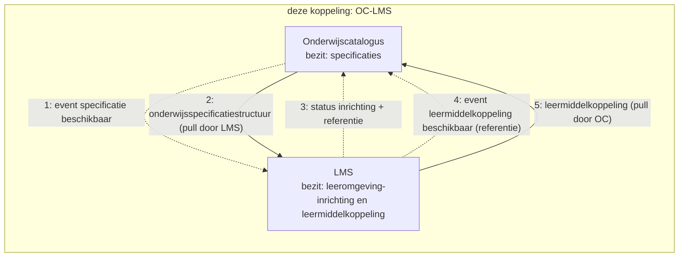
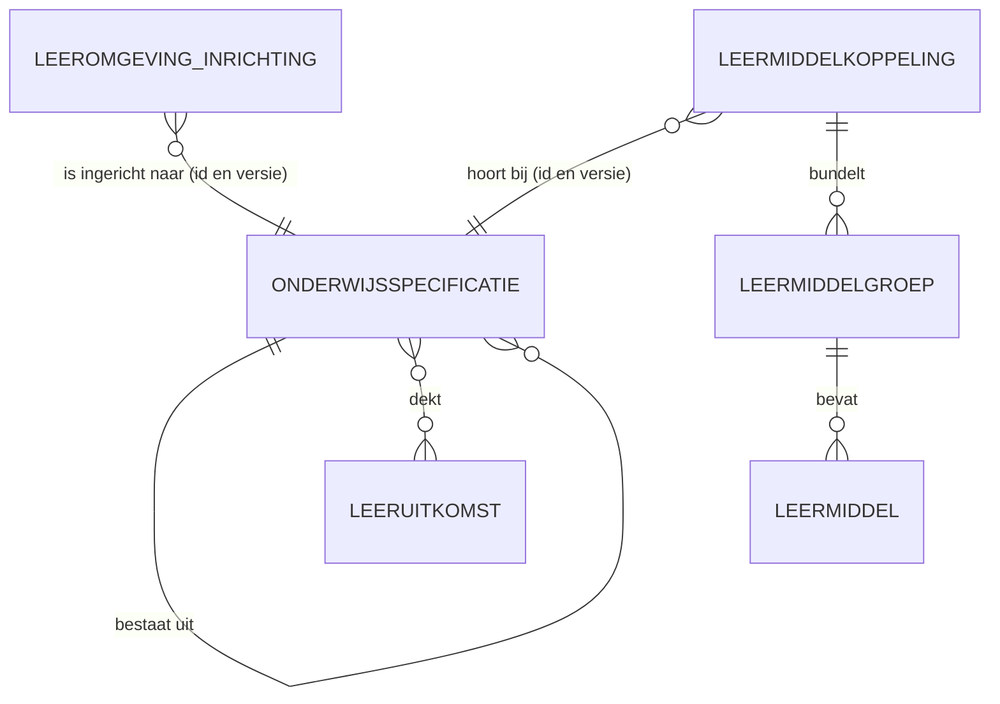
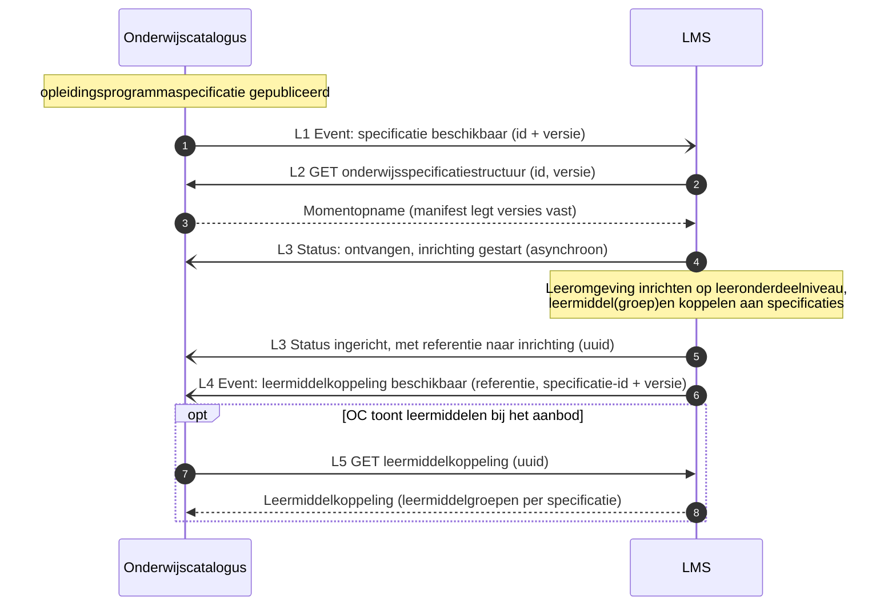
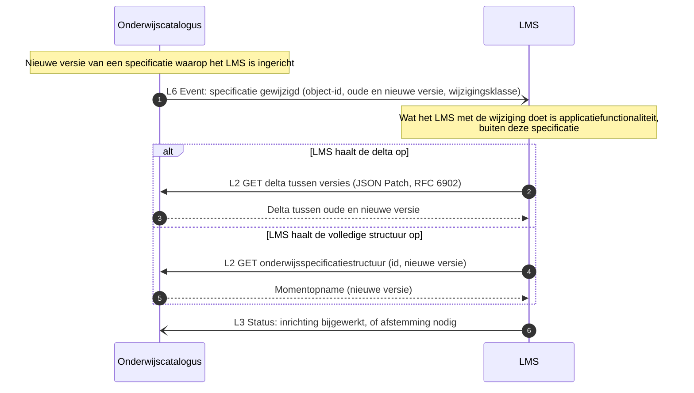

# Koppelingspecificatie OC-LMS: interactiepatronen (concept)

Context: koppeling onderwijscatalogus (OC) naar leermanagementsysteem (LMS), intra-instelling. Scenario: LR1-3. Niveau: concept, afgeleid zonder werksessie; ter review. Relateert aan: #98, #119, #105. Terminologie: ADR 0021.

> **Status.** Deze koppelingspecificatie is afgeleid uit de hoofdplaat (stroom 4) en het patroon van de [koppeling OC-P&R](../oc-p-en-r/20260723_1156_okx-lr1-koppelingspecificatie-oc-p-en-r.md). Er is nog geen werksessie of schets aan gewijd; alles hieronder is voorstel.

## Inhoudsopgave

1. [Inleiding](#1-inleiding)
2. [Doel](#2-doel)
3. [Scope](#3-scope)
4. [Kort procesbeeld](#4-kort-procesbeeld)
5. [Interactieoverzicht](#5-interactieoverzicht)
6. [Conceptueel informatiemodel](#6-conceptueel-informatiemodel)
7. [Sequentiediagrammen](#7-sequentiediagrammen)
8. [Payload-specificaties (verwijzing)](#8-payload-specificaties-verwijzing)
9. [Reviewvragen](#9-reviewvragen)
10. [Open vragen en signaleringen](#10-open-vragen-en-signaleringen)
11. [Gerelateerde uitwerkingen](#11-gerelateerde-uitwerkingen)

## 1. Inleiding

De hoofdplaat benoemt de stroom LMS naar OC: van leermiddel te voorzien aanbod (stroom 4, prioriteit 3). Daarnaast gebruikt het LMS de gepubliceerde onderwijsspecificatiestructuur om de leeromgeving in te richten. Deze koppeling is dus tweerichtingsverkeer: OC levert de structuur, het LMS levert de leermiddelkoppeling terug.

Beeld van het LMS in deze koppeling: een online leeromgeving die alles aan de student exposet (vergelijk een Coursera-achtig platform), inclusief e-learning. Het **ontwerp** gebeurt er niet in; wel de **gedetailleerde uitwerking** door onderwijsontwikkelaars, op lesniveau (lesplannen, werkinstructies). Van dat lesniveau hoeft OC niets te weten: de koppeling blijft op het niveau van de `leeronderdeelspecificatie`.

Zelfde patroon als OC-P&R: resource-eigenaarschap, referenties en dunne events. OC bezit de onderwijsspecificaties; het LMS bezit de leeromgeving-inrichting (inclusief het lesniveau) en de leermiddelkoppeling.

## 2. Doel

- De interacties tussen OC en LMS vastleggen als expliciete patronen met sequentiediagrammen.
- De payload-specificaties voor deze koppeling aanwijzen: de onderwijsspecificatiestructuur en (nog uit te werken) de leermiddelkoppeling.
- Concept ter review; werksessie volgt.

## 3. Scope

- Koppeling: OC naar LMS en LMS naar OC, intra-instelling eerst (ADR 0008). Leerroutes LR1-3.
- In scope: de onderwijsvoorbereiding (leidende vraag: wat moeten OC-P&R, OC-LMS en OC-SIS uitgewisseld hebben om klaar te zijn voor de start van de student?). Concreet: inrichting van de leeromgeving op basis van de gepubliceerde structuur, tot en met `leeronderdeelspecificatie`, en de terugmelding van leermiddelkoppelingen.
- Buiten scope: het lesniveau (lesplannen, werkinstructies; leeft in het LMS, de `lesspecificatie` valt buiten OKx-scope per PMO), leermiddelenlogistiek en licenties, toewijzing van leermiddelen aan studenten (hoofdplaat stroom 12, SVS naar LMS), cross-instelling.

## 4. Kort procesbeeld

Procesbeschrijving, kort:

1. OC publiceert een `opleidingsprogrammaspecificatie` en meldt het LMS: beschikbaar.
2. Het LMS haalt de onderwijsspecificatiestructuur op (pull) en richt de leeromgeving in op leeronderdeelniveau.
3. Het LMS meldt de inrichtingsstatus aan OC, met de referentie (uuid) naar de inrichting.
4. Het LMS koppelt leermiddelen(groepen) aan specificaties en meldt OC: leermiddelkoppeling beschikbaar (referentie). OC haalt de koppeling op wanneer OC die wil tonen bij het aanbod (stroom 4).
5. Wijzigt een specificatie, dan notificeert OC (dun event); het LMS haalt de delta of de volledige structuur op en werkt de inrichting bij.

## 5. Interactieoverzicht

Zelfde patroontaal als OC-P&R ([Enterprise Integration Patterns, Messaging](https://www.enterpriseintegrationpatterns.com/patterns/messaging/)); notify-then-pull met dunne events.

| # | Interactie | Initiator | Patroon | Synchroniciteit | Gedrag bij dubbele ontvangst | Foutafhandeling |
|---|---|---|---|---|---|---|
| L1 | Specificatie beschikbaar melden | OC | [Event Message](https://www.enterpriseintegrationpatterns.com/patterns/messaging/EventMessage.html) (id + versie) | Asynchroon | Geen effect: event-id ([Idempotent Receiver](https://www.enterpriseintegrationpatterns.com/patterns/messaging/IdempotentReceiver.html)) | [Guaranteed Delivery](https://www.enterpriseintegrationpatterns.com/patterns/messaging/GuaranteedDelivery.html); [Dead Letter Channel](https://www.enterpriseintegrationpatterns.com/patterns/messaging/DeadLetterChannel.html) |
| L2 | Onderwijsspecificatiestructuur of delta ophalen | LMS | [Request-Reply](https://www.enterpriseintegrationpatterns.com/patterns/messaging/RequestReply.html) (GET, alleen-lezen) | Synchroon | Geen effect (alleen-lezen) | HTTP-foutcodes, client bepaalt retry |
| L3 | Inrichtingsstatus melden, met referentie | LMS | [Event Message](https://www.enterpriseintegrationpatterns.com/patterns/messaging/EventMessage.html) (status: ontvangen/gestart, afgekeurd, ingericht, niet ingericht) | Asynchroon | Geen effect: status-id | Retry met backoff, daarna [Dead Letter Channel](https://www.enterpriseintegrationpatterns.com/patterns/messaging/DeadLetterChannel.html) |
| L4 | Leermiddelkoppeling beschikbaar melden | LMS | [Event Message](https://www.enterpriseintegrationpatterns.com/patterns/messaging/EventMessage.html) (referentie + specificatie-id en versie) | Asynchroon | Geen effect: event-id | [Guaranteed Delivery](https://www.enterpriseintegrationpatterns.com/patterns/messaging/GuaranteedDelivery.html); [Dead Letter Channel](https://www.enterpriseintegrationpatterns.com/patterns/messaging/DeadLetterChannel.html) |
| L5 | Leermiddelkoppeling ophalen | OC | [Request-Reply](https://www.enterpriseintegrationpatterns.com/patterns/messaging/RequestReply.html) op referentie (GET uuid, alleen-lezen) | Synchroon | Geen effect (alleen-lezen) | HTTP-foutcodes |
| L6 | Specificatiewijziging melden | OC | [Event Message](https://www.enterpriseintegrationpatterns.com/patterns/messaging/EventMessage.html) (object-id, oude en nieuwe versie, wijzigingsklasse) | Asynchroon | Geen effect: event-id | [Guaranteed Delivery](https://www.enterpriseintegrationpatterns.com/patterns/messaging/GuaranteedDelivery.html); [Dead Letter Channel](https://www.enterpriseintegrationpatterns.com/patterns/messaging/DeadLetterChannel.html) |

## 6. Conceptueel informatiemodel

Leeswijzer: OC beheert de `onderwijsspecificatie`s. Het LMS richt de leeromgeving in naar een specificatieversie en beheert de leermiddelkoppeling: welke leermiddel(groep)en horen bij welke specificatie. OC toont die koppeling bij het aanbod (stroom 4).

## 7. Sequentiediagrammen

### 7.1 Happy flow: inrichting en leermiddelkoppeling

### 7.2 Wijzigingsnotificatie: specificatie gewijzigd

## 8. Payload-specificaties (verwijzing) en gebruiksprofiel

Gebruiksprofiel van deze koppeling op de centrale [onderwijsspecificatie-payload](../gedeeld/20260717_1120_okx-lr1-onderwijsspecificatie-payload-json.md) (ADR 0021):

| Onderdeel | Gebruik in OC-LMS |
|---|---|
| `onderwijsspecificaties` | Volledig tot en met `leeronderdeelspecificatie` |
| `leeruitkomsten` | **Met inhoudsvelden** (`omschrijving`, `resultaat`, `gedrag`): dat is precies wat het LMS uitwerkt en aan de student exposet |
| `regelsets` | Niet meegeleverd (kiesbaarheid is het domein van SKS en SIS) |

- Basis voor L2: de centrale payload.
- Leermiddelkoppeling-payload: **nog uit te werken** (signalering). Verwachte kern: `leermiddelkoppelingId`, `versie`, per specificatie (id en versie) de leermiddelgroepen, plat met verwijzingen.
- [Lifecycle en versionering](../gedeeld/20260720_0832_okx-lr1-lifecycle-versionering.md): kopie voor deze koppeling.

## 9. Reviewvragen

1. Klopt de tweerichtingsopzet: structuur heen (L1-L3), leermiddelkoppeling terug (L4-L5)?
2. Op welk niveau koppelt het LMS leermiddelen in de praktijk: leeronderdeel, onderwijseenheid, of beide?
3. Is de leermiddelkoppeling een eigen resource bij het LMS (huidige keuze) of hoort die inhoud in OC thuis?
4. Welke wijzigingen in de specificatie moeten het LMS actief bereiken (wijzigingsklasse-drempel)?
5. Moet het LMS zijn inrichting (inclusief het lesniveau) als opvraagbare resource exposen voor andere componenten die er straks iets mee willen? Zo ja, dan volgt dat hetzelfde patroon (referentie plus ophalen), als aparte koppeling.

## 10. Open vragen en signaleringen

- Leermiddelkoppeling-payload uitwerken (§8), inclusief de relatie met `leermiddelengroepen` uit de specificatie-catalogus van het profiel.
- De leeruitkomst-inhoudsvelden (`omschrijving`, `resultaat`, `gedrag`) staan als optionele velden in de centrale payload; dit gebruiksprofiel levert ze mee.
- Exposen van de LMS-inrichting (inclusief lesniveau) voor andere componenten: optie, zelfde patroon, aparte koppeling (reviewvraag 5).
- Toewijzing van leermiddelen aan studenten (stroom 12, SVS naar LMS) is een aparte koppeling.
- Endpoints en operaties volgen na review van dit concept (zelfde vorm als OC-P&R §9).

## 11. Gerelateerde uitwerkingen

- [Koppelingspecificatie OC-P&R](../oc-p-en-r/20260723_1156_okx-lr1-koppelingspecificatie-oc-p-en-r.md) (het patroon waarop deze koppeling voortbouwt).
- [Koppelingspecificatie OC-SIS](../oc-sis-krs-svs/20260723_1402_okx-lr1-koppelingspecificatie-oc-sis.md).
- OKx OEAPI consumer-profiel (fase 4, inrichting leeromgeving; specificatie-catalogus met `leermiddelengroepen`).
- ADR 0021 (koppeling versus koppelvlak).
