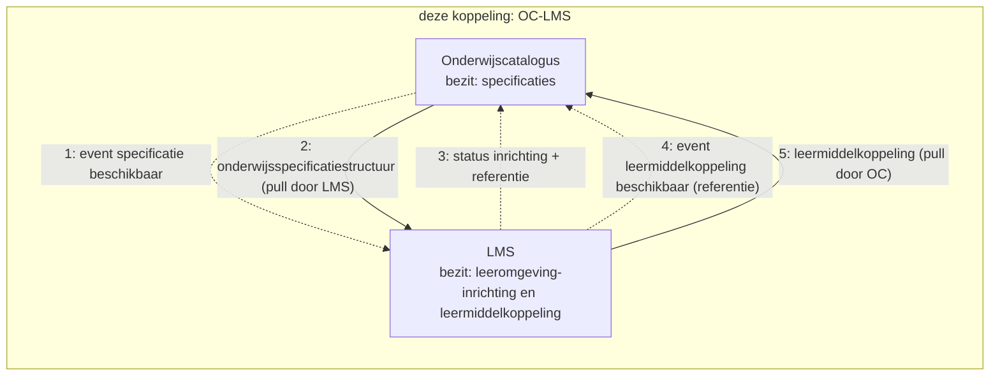
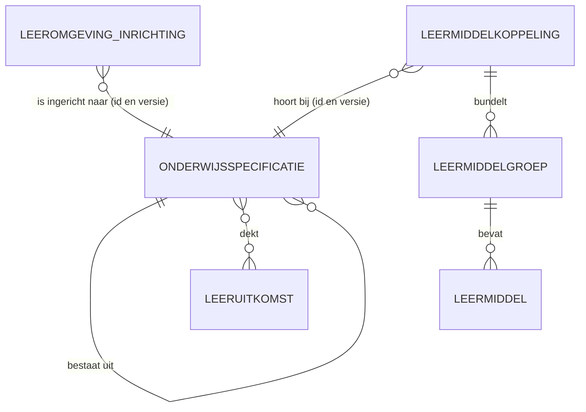
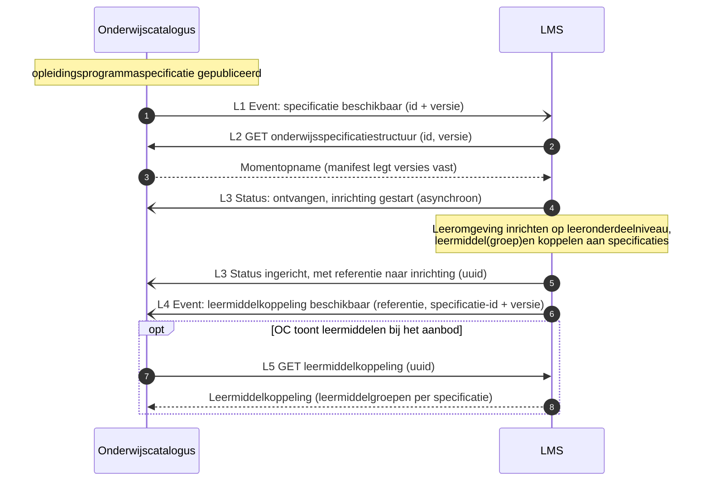
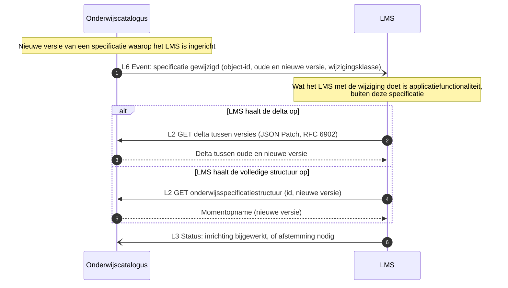

# Koppelingspecificatie onderwijscatalogus naar leermanagementsysteem

Relateert aan: #98, #119, #105. Terminologie: [ADR 0021](../../../../dr/0021-koppeling-versus-koppelvlak-terminologie.md).

## Inhoudsopgave

1. [Inleiding](#1-inleiding) (context, doel, scope)
2. [Procesbeeld](#2-procesbeeld)
3. [Interactieoverzicht](#3-interactieoverzicht)
4. [Informatiemodel](#4-informatiemodel)
5. [Sequentiediagrammen](#5-sequentiediagrammen)
6. [Payload-specificaties (verwijzing) en gebruiksprofiel](#6-payload-specificaties-verwijzing-en-gebruiksprofiel)
7. [Reviewvragen](#7-reviewvragen)
8. [Open vragen en signaleringen](#8-open-vragen-en-signaleringen)
9. [Gerelateerde uitwerkingen](#9-gerelateerde-uitwerkingen)

## 1. Inleiding

### 1.1 Context

Waar deze koppeling in de keten zit: de onderwijscatalogus (OC) levert de gepubliceerde onderwijsspecificatiestructuur aan het leermanagementsysteem (LMS), dat daarmee de leeromgeving inricht; het LMS levert een leermiddelkoppeling terug (stroom 4, "van leermiddel te voorziene aanbod"). Deze koppeling is dus tweerichtingsverkeer. Stroomnummers volgen de interpretatietabel in het [Projectoverzicht](../../../../../doc/OKx_Projectoverzicht.md); het ketenoverzicht en de actuele [hoofdplaat v1.7](../README.md#context) staan in de instap van de README.

Scenario is leerroute 1 (regulier), persona [Jochem](../../../../docs/specificatie/okx-oeapi-consumer-profiel/doc/persona_jochem.md), opleiding Apothekersassistent: de student vindt zijn lesstof en leermiddelen in de leeromgeving die op de gepubliceerde structuur is ingericht. Leerroute 2 en 3 volgen als verschil. Begrippenkader (ankertabel, zes families; het LMS werkt de inhoudsvelden van de leeruitkomst uit) en de volledige leerroutes: het [OEAPI consumer-profiel](../../../../docs/specificatie/okx-oeapi-consumer-profiel/README.md). Dat profiel gebruikt nog een oudere hoofdplaat; leidend is v1.7.

Beeld van het LMS in deze koppeling: een online leeromgeving die alles aan de student exposet (vergelijk een Coursera-achtig platform), inclusief e-learning. Het **ontwerp** gebeurt er niet in; wel de **gedetailleerde uitwerking** door onderwijsontwikkelaars, op lesniveau (lesplannen, werkinstructies). Van dat lesniveau hoeft OC niets te weten: de koppeling blijft op het niveau van de `leeronderdeelspecificatie`. Zelfde patroon als de [koppeling OC-P&R](../oc-p-en-r/20260723_1156_okx-lr1-koppelingspecificatie-oc-p-en-r.md): resource-eigenaarschap, referenties en dunne events. OC bezit de onderwijsspecificaties; het LMS bezit de leeromgeving-inrichting (inclusief het lesniveau) en de leermiddelkoppeling. Deze koppelingspecificatie is afgeleid; er is nog geen werksessie aan gewijd.

### 1.2 Doel

Deze koppelingbeschrijving is **indicatief, geen voorschrift aan de sector**. Ze onderbouwt welke operaties en endpoints het koppelvlak van de onderwijscatalogus en dat van het leermanagementsysteem nodig hebben; de som van alle koppelingbeschrijvingen leidt tot de koppelvlakspecificatie per component ([toelichting](../README.md#van-koppelingbeschrijving-naar-koppelvlakspecificatie-doelbinding)).

Het document beantwoordt drie vragen:

- Welke interacties lopen er heen (structuur) en terug (leermiddelkoppeling) tussen beide systemen?
- Tot welk niveau moet de catalogus de structuur leveren, en waar houdt zijn bemoeienis op?
- Welke payload draagt elk bericht?

Geslaagd wanneer een leverancier van een leeromgeving kan bepalen welke gegevens hij ophaalt, wat hij terugmeldt, en wat hij zelf mag invullen.

### 1.3 Scope

In scope is de tweerichtingskoppeling tussen de onderwijscatalogus en het leermanagementsysteem binnen één instelling ([ADR 0008](../../../../dr/0008-scope-planning-eerst-intra-instelling.md)), voor leerroute 1 tot en met 3: het inrichten van de leeromgeving op basis van de gepubliceerde structuur tot en met de `leeronderdeelspecificatie`, en het terugmelden van leermiddelkoppelingen. Leidende vraag voor de prioritering is wat er uitgewisseld moet zijn voordat de student begint.

Twee afbakeningen die anders verwarring geven:

- Het **lesniveau** (lesplannen, werkinstructies) leeft in de leeromgeving zelf. De catalogus hoeft daar niets van te weten, en de `lesspecificatie` wordt binnen dit programma niet gerealiseerd.
- Het **toewijzen van leermiddelen aan individuele studenten** loopt via het studentvolgsysteem (stroom 12) en is een eigen koppeling.

Al het overige valt buiten dit document, waaronder leermiddelenlogistiek, licenties en cross-instelling.

## 2. Procesbeeld

Zelfde twee principes als bij de koppeling met planning. **Resource-eigenaarschap**: de onderwijscatalogus bezit de specificaties, de leeromgeving bezit haar inrichting en de leermiddelkoppeling. **Notify-then-pull**: de bezitter publiceert een dun event met een referentie ([ADR 0020](../../../../dr/0020-curriculumontwerp-onderwijscatalogus-happy-flow-synchronisatie-en-federatie-adopt-klonen.md)), de consument haalt de resource op wanneer het hem uitkomt. Beide richtingen volgen dat patroon.

Wat het diagram niet toont: de leeromgeving richt zich in tot op **leeronderdeelniveau** en vult daaronder haar eigen lesniveau in, waar de catalogus buiten staat. De leermiddelkoppeling gaat de andere kant op zodra de leeromgeving die heeft gelegd; de catalogus haalt hem op wanneer die de leermiddelen bij het aanbod wil tonen. Wijzigt een specificatie, dan volgt een nieuw event en haalt de leeromgeving het verschil of de volledige structuur opnieuw op.

## 3. Interactieoverzicht

De interacties op deze koppeling, met per interactie het messaging-patroon, in dezelfde patroontaal als de koppeling met planning ([Enterprise Integration Patterns, Messaging](https://www.enterpriseintegrationpatterns.com/patterns/messaging/)).

| # | Interactie | Initiator | Patroon | Synchroniciteit | Gedrag bij dubbele ontvangst | Foutafhandeling |
|---|---|---|---|---|---|---|
| L1 | Specificatie beschikbaar melden | OC | [Event Message](https://www.enterpriseintegrationpatterns.com/patterns/messaging/EventMessage.html) (id + versie) | Asynchroon | Geen effect: event-id ([Idempotent Receiver](https://www.enterpriseintegrationpatterns.com/patterns/messaging/IdempotentReceiver.html)) | [Guaranteed Delivery](https://www.enterpriseintegrationpatterns.com/patterns/messaging/GuaranteedDelivery.html); [Dead Letter Channel](https://www.enterpriseintegrationpatterns.com/patterns/messaging/DeadLetterChannel.html) |
| L2 | Onderwijsspecificatiestructuur of delta ophalen | LMS | [Request-Reply](https://www.enterpriseintegrationpatterns.com/patterns/messaging/RequestReply.html) (GET, alleen-lezen) | Synchroon | Geen effect (alleen-lezen) | HTTP-foutcodes, client bepaalt retry |
| L3 | Inrichtingsstatus melden, met referentie | LMS | [Event Message](https://www.enterpriseintegrationpatterns.com/patterns/messaging/EventMessage.html) (status: ontvangen/gestart, afgekeurd, ingericht, niet ingericht) | Asynchroon | Geen effect: status-id | Retry met backoff, daarna [Dead Letter Channel](https://www.enterpriseintegrationpatterns.com/patterns/messaging/DeadLetterChannel.html) |
| L4 | Leermiddelkoppeling beschikbaar melden | LMS | [Event Message](https://www.enterpriseintegrationpatterns.com/patterns/messaging/EventMessage.html) (referentie + specificatie-id en versie) | Asynchroon | Geen effect: event-id | [Guaranteed Delivery](https://www.enterpriseintegrationpatterns.com/patterns/messaging/GuaranteedDelivery.html); [Dead Letter Channel](https://www.enterpriseintegrationpatterns.com/patterns/messaging/DeadLetterChannel.html) |
| L5 | Leermiddelkoppeling ophalen | OC | [Request-Reply](https://www.enterpriseintegrationpatterns.com/patterns/messaging/RequestReply.html) op referentie (GET uuid, alleen-lezen) | Synchroon | Geen effect (alleen-lezen) | HTTP-foutcodes |
| L6 | Specificatiewijziging melden | OC | [Event Message](https://www.enterpriseintegrationpatterns.com/patterns/messaging/EventMessage.html) (object-id, oude en nieuwe versie, wijzigingsklasse) | Asynchroon | Geen effect: event-id | [Guaranteed Delivery](https://www.enterpriseintegrationpatterns.com/patterns/messaging/GuaranteedDelivery.html); [Dead Letter Channel](https://www.enterpriseintegrationpatterns.com/patterns/messaging/DeadLetterChannel.html) |

## 4. Informatiemodel

Leeswijzer: OC beheert de `onderwijsspecificatie`s. Het LMS richt de leeromgeving in naar een specificatieversie en beheert de leermiddelkoppeling: welke leermiddel(groep)en horen bij welke specificatie. OC toont die koppeling bij het aanbod (stroom 4).

## 5. Sequentiediagrammen

### 5.1 Happy flow: inrichting en leermiddelkoppeling

### 5.2 Wijzigingsnotificatie: specificatie gewijzigd

## 6. Payload-specificaties (verwijzing) en gebruiksprofiel

Gebruiksprofiel van deze koppeling op de centrale [onderwijsspecificatie-payload](../gedeeld/20260717_1120_okx-lr1-onderwijsspecificatie-payload-json.md) ([ADR 0021](../../../../dr/0021-koppeling-versus-koppelvlak-terminologie.md)):

| Onderdeel | Gebruik in OC-LMS |
|---|---|
| `onderwijsspecificaties` | Volledig tot en met `leeronderdeelspecificatie` |
| `leeruitkomsten` | **Met inhoudsvelden** (`omschrijving`, `resultaat`, `gedrag`): dat is precies wat het LMS uitwerkt en aan de student exposet |
| `regelsets` | Niet meegeleverd (kiesbaarheid is het domein van SKS en SIS) |

- Basis voor L2: de centrale payload.
- Leermiddelkoppeling-payload: **nog uit te werken** (signalering). Verwachte kern: `leermiddelkoppelingId`, `versie`, per specificatie (id en versie) de leermiddelgroepen, plat met verwijzingen.
- [Lifecycle en versionering](../gedeeld/20260720_0832_okx-lr1-lifecycle-versionering.md): kopie voor deze koppeling.

## 7. Reviewvragen

1. Klopt de tweerichtingsopzet: structuur heen (L1-L3), leermiddelkoppeling terug (L4-L5)?
2. Op welk niveau koppelt het LMS leermiddelen in de praktijk: leeronderdeel, onderwijseenheid, of beide?
3. Is de leermiddelkoppeling een eigen resource bij het LMS (huidige keuze) of hoort die inhoud in OC thuis?
4. Welke wijzigingen in de specificatie moeten het LMS actief bereiken (wijzigingsklasse-drempel)?
5. Moet het LMS zijn inrichting (inclusief het lesniveau) als opvraagbare resource exposen voor andere componenten die er straks iets mee willen? Zo ja, dan volgt dat hetzelfde patroon (referentie plus ophalen), als aparte koppeling.

## 8. Open vragen en signaleringen

- Leermiddelkoppeling-payload uitwerken (§6), inclusief de relatie met `leermiddelengroepen` uit de specificatie-catalogus van het profiel.
- De leeruitkomst-inhoudsvelden (`omschrijving`, `resultaat`, `gedrag`) staan als optionele velden in de centrale payload; dit gebruiksprofiel levert ze mee.
- Exposen van de LMS-inrichting (inclusief lesniveau) voor andere componenten: optie, zelfde patroon, aparte koppeling (reviewvraag 5).
- Toewijzing van leermiddelen aan studenten (stroom 12, SVS naar LMS) is een aparte koppeling.
- Endpoints en operaties volgen na review van dit concept (zelfde vorm als OC-P&R §7).

## 9. Gerelateerde uitwerkingen

- [Koppelingspecificatie OC-P&R](../oc-p-en-r/20260723_1156_okx-lr1-koppelingspecificatie-oc-p-en-r.md) (het patroon waarop deze koppeling voortbouwt).
- [Koppelingspecificatie OC-SIS](../oc-sis-krs-svs/20260723_1402_okx-lr1-koppelingspecificatie-oc-sis.md).
- OKx OEAPI consumer-profiel (fase 4, inrichting leeromgeving; specificatie-catalogus met `leermiddelengroepen`).
- ADR 0021 (koppeling versus koppelvlak).
