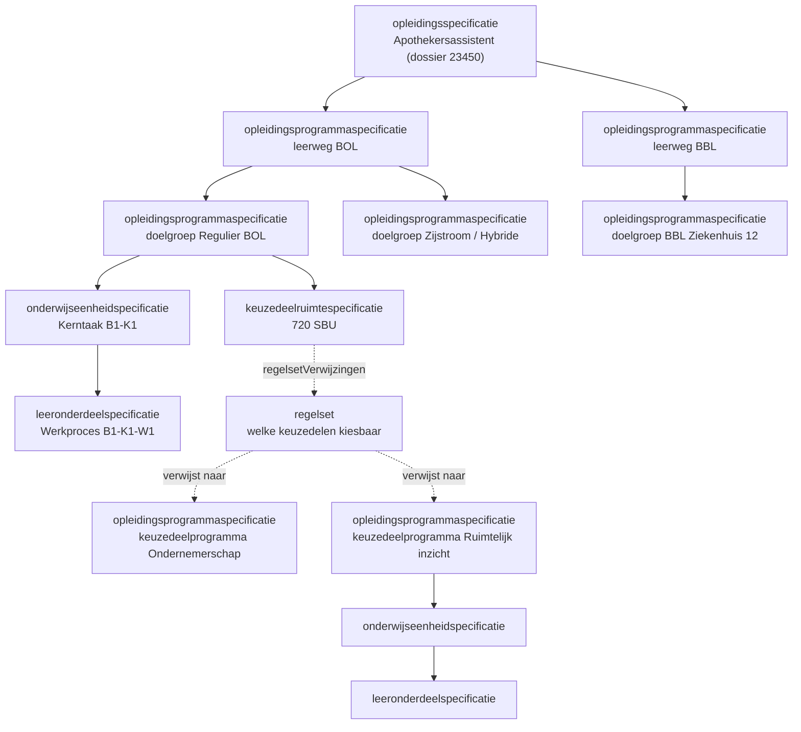

# Onderwijsspecificatie als JSON-payload (OC naar P)

Context: koppeling OC naar P (onderwijscatalogus naar planning), vroege processtap "kwalificatiekader analyseren". Scenario: LR1 (Apothekersassistent, Crebo-dossier 23450, kwalificatie 27141). Niveau: concept-payload, grofmazig (fase 1-2). Status: concept. Relateert aan: #119, #105, #84, #120.

## Inhoudsopgave

1. [Inleiding](#1-inleiding)
2. [Doel](#2-doel)
3. [Scope](#3-scope)
4. [Context](#4-context)
5. [Voorstel: hoe drukken we de gelaagdheid uit in JSON?](#5-voorstel-hoe-drukken-we-de-gelaagdheid-uit-in-json)
6. [Enumeraties (concept)](#6-enumeraties-concept)
7. [Uitwerking van de payload](#7-uitwerking-van-de-payload)
8. [Onderwijsspecificatie lifecycle (versionering en manifest)](#8-onderwijsspecificatie-lifecycle-versionering-en-manifest)
9. [Open vragen en signaleringen](#9-open-vragen-en-signaleringen)

## 1. Inleiding

Issue #119 vraagt een eerste payload-uitwerking in JSON van de onderwijsspecificatiestructuur voor LR1-3, zodat we kunnen toetsen of die vorm in latere versies overeind blijft. Dit document geeft die vorm en de ontwerpkeuze eronder: hoe leg je de gelaagdheid (de geneste specificatie) generiek vast in JSON.

De ArchiMate-view "01. Onderwijsvisie vertalen naar onderwijsaanbod - Basis Model" gebruikt nog niet het huidige begrippenkader (opleidingsspecificatie, programmaspecificatie, enzovoort). We gebruiken de ankertabel (§3.2.6) uit het OKx OEAPI consumer-profiel, het kwalificatiedossier Apothekersassistent, en de datamodel-schets uit #119.

## 2. Doel

- Een eerste, toetsbare JSON-vorm van de onderwijsspecificatiestructuur voor LR1-3.
- Een generieke en herbruikbare ontwerpkeuze voor gelaagdheid en voor keuzeregels.
- Invoer voor de berichtspecificatie (AMIGO-stap 5) en het OEAPI-profiel.

Buiten scope: definitieve OEAPI-binding, endpoints, het aanbod (planbaar of geroosterd resultaat), en de interne structuur van de regelset (die staat in #84 en #120).

## 3. Scope

- Koppeling: OC naar P, vroege processtap "kwalificatiekader analyseren".
- Leerroutes: LR1 uitgewerkt. LR2 en LR3 volgen als verschil (delta); structuur gelijk, een handvol attributen wijzigt.
- Diepte: `opleidingsspecificatie`, `opleidingsprogrammaspecificatie`, `onderwijseenheidspecificatie`, `leeronderdeelspecificatie`. Geen harde grens. De `lesspecificatie` valt buiten scope; PMO realiseert dat niet.
- Fase: grofmazig ontwerp (fase 1-2). Waarden zijn indicatief. Generieke onderdelen (taal, rekenen, burgerschap, Engels) vallen buiten deze payload.

## 4. Context

Ankertabel (§3.2.6), specificatie-kolom. Conceptniveaus, bron in het kwalificatiekader en OEAPI-mapping:

| Conceptniveau (`specificatieType`) | Bron in kwalificatiekader | OEAPI-mapping (indicatief) |
|---|---|---|
| `opleidingsspecificatie` | Kwalificatiedossier | EducationSpecification (program) |
| `opleidingsprogrammaspecificatie` | Kwalificatie | Programme |
| `onderwijseenheidspecificatie` | Kerntaak | Course |
| `leeronderdeelspecificatie` | Werkproces | LearningComponent |
| `keuzedeelruimtespecificatie` | ruimte binnen kwalificatie | (afgeleid, geen 1:1 OEAPI-object) |
| `toetsonderdeelspecificatie` | toetsing | TestComponent |
| `examenplanspecificatie` | OER, summatieve resultaatstructuur | (aparte uitwerking) |
| `lesspecificatie` (buiten scope) | beleid instelling | LearningComponent (lesson) |

Belangrijke correctie ten opzichte van de vorige versie: de **kwalificatie ligt niet op root-niveau**. De opleiding draagt het kwalificatiedossier als leeruitkomst (`type: kwalificatiedossier`, code 23450). De kwalificatie (27141) hoort op programma-niveau (`type: kwalificatie`).

Vier eigenschappen die de gelaagdheid bepalen:

- Recursie: elk niveau is hetzelfde type object en verwijst naar zijn ouder (`bovenliggendId`).
- Twee programma-lagen, beide een `opleidingsprogrammaspecificatie`: t.b.v. leerweg (BOL, BBL) en daaronder t.b.v. doelgroep (regulier, zijinstromer, hybride, of organisatiespecifiek zoals een ziekenhuis-BBL). De kwalificatie-inhoud (kerntaken, werkprocessen) hangt onder de doelgroep-laag.
- Keuzeruimte is een eigen, herbruikbare `keuzedeelruimtespecificatie`, geen los veld.
- Regels staan los van de specificatie. Een specificatie verwijst via `regelsetVerwijzingen` naar een of meer regelsets. De regelset bepaalt welke keuzedelen kiesbaar zijn. Zie #84 en #120.



## 5. Voorstel: hoe drukken we de gelaagdheid uit in JSON?

| Optie | Vorm | Voordeel | Nadeel |
|---|---|---|---|
| A. Pure nesting | children-arrays, alles inline | Simpel | Hergebruik wordt gedupliceerd |
| B. Nesting + referenties | genest, hergebruik via uuid | Minder duplicatie | Twee relatievormen door elkaar |
| C. Recursief plat met bovenliggendId | uniforme lijst, relatie via `bovenliggendId` | Elk object gelijk, generiek, herbruikbaar, uitlijnbaar met OEAPI `EducationSpecification.parent` | Structuur minder direct leesbaar |

Voorstel: optie C.

Ontwerpkeuzes:

- Eén uniform type. Alle specificaties staan in een platte lijst `onderwijsspecificaties`. Elke specificatie heeft een `bovenliggendId` (uuid; `null` op de root). De structuur reconstrueer je door `bovenliggendId` te volgen; een geneste weergave is daaruit af te leiden.
- Discriminator `specificatieType` bepaalt het niveau.
- Verankering via leeruitkomst (vervangt `primaryCode`). Elke specificatie verwijst naar een leeruitkomst met een `type`. Nu de kwalificatiekader-typen (kwalificatiedossier, kwalificatie, kerntaak, werkproces, keuzedeel); later uitbreidbaar met een leeruitkomst-standaard zoals CompetentNL (ADR 0003, 0004).
- Id's zijn UUID's.
- Versionering per specificatie met semver (`MAJOR.MINOR.PATCH`). MAJOR = wijziging die betekenis of uitkomst raakt (leeruitkomsten, structuur, studielast), MINOR = additief zonder bestaande betekenis te breken, PATCH = correctie. Temporele geldigheid apart via `geldigVanaf`/`geldigTot` en cohort, niet als versienummer.
- Identiteit los van versie (uitgangspunt, memo PR #110). `specificatieId` is stabiel; `versie` verandert bij een wijziging binnen dezelfde identiteit. Een fundamentele wijziging (nieuw kwalificatiedossier, nieuwe wettelijke eisen) is een nieuwe specificatie met een nieuw id, niet alleen een MAJOR-bump.
- Kwalificatie op programma-niveau, dossier op opleiding-niveau (zie §4).
- `programmaLaag` onderscheidt leerweg- en doelgroep-programma. Beide zijn `programma`.
- `bovenliggendId` draagt twee betekenissen: onderdeel-van (additief, bv. kerntaak onder programma) en variant-van (alternatief, bv. doelgroep onder leerweg). De aggregatie-invariant geldt alleen voor onderdeel-van.
- Niveau, leeruitkomsten en leerroute zijn afleidbaar uit de structuur, niet als losse specificatie-velden. Het NLQF-niveau hangt aan de leeruitkomst. Wie een bepaalde set kerntaken en werkprocessen heeft afgerond, voldoet aan de kwalificatie. Leerroute-typen zijn indicatief voor wat mogelijk wordt en horen niet in het datamodel. Leeruitkomsten worden naar verwachting later flexibeler (ADR 0003, 0004).
- Keuzeruimte is een eigen specificatie (`keuzedeelruimte`) met studielast, herbruikbaar.
- Regels los van de onderwijsspecificatie. `regelsetVerwijzingen` op een specificatie verwijst naar losse `regelsets`. De ruleset draagt de kiesbaarheid (welke keuzedelen) en de voorwaarde vooraf (prerequisite). Interne structuur van de ruleset: #84 en #120.
- Elke specificatie kan `regelsetVerwijzingen` hebben (generiek), niet alleen de keuzeruimte.
- Keuzedelen zijn zelfstandige programma-specificaties (`parent: null`), zelf opgebouwd als programma naar onderwijseenheid naar leeronderdeel. Herbruikbaar over opleidingen (N:M via ruleset-referenties).
- Aggregatie-invariant: `studielast` telt bottom-up op binnen onderdeel-van (SOM children = ouder). Niet over varianten (leerweg, doelgroep).

## 6. Enumeraties (concept)

Concept en te bevestigen. Open sets zijn als zodanig gemarkeerd.

| Veld | Toegestane waarden |
|---|---|
| `specificatieType` | `opleidingsspecificatie`, `opleidingsprogrammaspecificatie`, `onderwijseenheidspecificatie`, `leeronderdeelspecificatie`, `keuzedeelruimtespecificatie`, `toetsonderdeelspecificatie` (examinering/toetsing, OEAPI TestComponent), `examenplanspecificatie` en `resultaateenheidspecificatie` (resultaatstructuur, aparte uitwerking) |
| `manifest[].relatie` | `onderdeel` (additief), `variant` (alternatief), `referentie` (gepinde verwijzing) |
| `status` | `concept`, `vastgesteld`, `gepubliceerd`, `gedeactiveerd`, `vervallen`, `gearchiveerd` |
| `versie` | semver `MAJOR.MINOR.PATCH` (bv. `0.1.0`) |
| `geldigVanaf` / `geldigTot` | datum; geldigheidsperiode. Meerdere versies kunnen gelijktijdig actief zijn |
| `curriculumtype` | `nominaal`, `hybride`, `flexibel` |
| `programmatype` | `diplomaprogramma`, `keuzedeelprogramma`, `certificaatprogramma` (open) |
| `programmaLaag` | `leerweg`, `doelgroep` |
| `leerweg` | `BOL`, `BBL` |
| `doelgroep` | `regulier`, `zijinstromer`, `hybride`, `organisatiespecifiek` (open) || `tijdsverdeling` | `BOT` (begeleide onderwijstijd), `OOT` (onbegeleide onderwijstijd) |
| `studielast.eenheid` | `SBU`, `EC` |
| `leeruitkomst.type` | `kwalificatiedossier`, `kwalificatie`, `kerntaak`, `werkproces`, `keuzedeel` (open, uitbreidbaar met een leeruitkomst-standaard zoals CompetentNL) |
| `keuzedeelKlasse` | `algemeen-verbredend`, `beroepsspecifiek-verdiepend` (open, uitbreidbaar; #84 R10) |
| `leeruitkomst.nlqfNiveau` | `1` t/m `8` (NLQF, geldt voor alle sectoren) |

## 7. Uitwerking van de payload

Grofmazig, LR1, indicatief. `studielast` telt bottom-up op binnen onderdeel-van (kerntaken 2000 + 1200 + 880 = 4080; plus keuzeruimte 720 = 4800 onder Regulier BOL). Programma-varianten (leerweg BOL/BBL, doelgroep regulier/zijinstromer/hybride) zijn alternatieven, geen optelling. De inhoud hangt hier onder één doelgroep (Regulier BOL); de andere varianten zijn leeg (illustratief). Keuzedelen zijn illustratief (de prerequisite Wiskunde 1 voor Ruimtelijk inzicht komt uit #84).

### 7.1 Boomstructuur met attributen (ERD)

Alle objecten zijn hetzelfde type (`EducationSpecification`), gespecialiseerd via `specificatieType`. Hieronder per laag getoond met de belangrijkste attributen. `onderdeel_van` = additief (studielast telt op), `variant_van` = alternatief. Elke entiteit draagt daarnaast `versie` (semver); voor de leesbaarheid niet in elke box herhaald.

```mermaid
erDiagram
    OPLEIDINGSSPECIFICATIE ||--o{ OPLEIDINGSPROGRAMMASPECIFICATIE_LEERWEG : variant_van
    OPLEIDINGSPROGRAMMASPECIFICATIE_LEERWEG ||--o{ OPLEIDINGSPROGRAMMASPECIFICATIE_DOELGROEP : variant_van
    OPLEIDINGSPROGRAMMASPECIFICATIE_DOELGROEP ||--o{ ONDERWIJSEENHEIDSPECIFICATIE : onderdeel_van
    OPLEIDINGSPROGRAMMASPECIFICATIE_DOELGROEP ||--|| KEUZEDEELRUIMTESPECIFICATIE : bevat
    ONDERWIJSEENHEIDSPECIFICATIE ||--o{ LEERONDERDEELSPECIFICATIE : onderdeel_van
    KEUZEDEELRUIMTESPECIFICATIE }o--o{ RULESET : regelsetVerwijzingen
    RULESET }o--o{ KEUZEDEELPROGRAMMASPECIFICATIE : kiesbaar
    KEUZEDEELPROGRAMMASPECIFICATIE ||--o{ ONDERWIJSEENHEIDSPECIFICATIE : onderdeel_van

    OPLEIDINGSSPECIFICATIE {
        uuid specificatieId PK
        string specificatieType "opleidingsspecificatie"
        uuid bovenliggendId "null"
        object leeruitkomst "type=kwalificatiedossier, code=23450, nlqfNiveau=4"
        string naam
        string curriculumtype
        string versie
        date geldigVanaf
        date geldigTot
        object studielast "waarde + SBU"
        array manifest "pins: id + version + relatie"
        string status
    }
    OPLEIDINGSPROGRAMMASPECIFICATIE_LEERWEG {
        uuid specificatieId PK
        string specificatieType "opleidingsprogrammaspecificatie"
        uuid bovenliggendId FK "opleiding"
        object leeruitkomst "type=kwalificatie, code=27141"
        string programmaLaag "leerweg"
        string leerweg "BOL of BBL"
        string programmatype "diplomaprogramma"
        object studielast
    }
    OPLEIDINGSPROGRAMMASPECIFICATIE_DOELGROEP {
        uuid specificatieId PK
        string specificatieType "opleidingsprogrammaspecificatie"
        uuid bovenliggendId FK "leerweg-programma"
        string programmaLaag "doelgroep"
        string doelgroep "regulier, zijinstromer, hybride, organisatiespecifiek"
        string leerweg
        string curriculumtype
        object organisatie "optioneel, bv. Ziekenhuis 12"
        string cohort
        date startdatum
        date geldigVanaf
        date geldigTot
        object studielast
        array manifest "pins: id + version + relatie"
    }
    ONDERWIJSEENHEIDSPECIFICATIE {
        uuid specificatieId PK
        string specificatieType "onderwijseenheidspecificatie"
        uuid bovenliggendId FK "programma of keuzedeelprogramma"
        object leeruitkomst "type=kerntaak"
        string naam
        object studielast
    }
    LEERONDERDEELSPECIFICATIE {
        uuid specificatieId PK
        string specificatieType "leeronderdeelspecificatie"
        uuid bovenliggendId FK "onderwijseenheid"
        object leeruitkomst "type=werkproces"
        string naam
        string tijdsverdeling "BOT of OOT"
        object studielast
    }
    KEUZEDEELRUIMTESPECIFICATIE {
        uuid specificatieId PK
        string specificatieType "keuzedeelruimtespecificatie"
        uuid bovenliggendId FK "doelgroep-programma"
        object studielast "keuzeruimte in SBU"
        array regelsetVerwijzingen FK "naar RULESET"
    }
    KEUZEDEELPROGRAMMASPECIFICATIE {
        uuid specificatieId PK
        string specificatieType "opleidingsprogrammaspecificatie"
        uuid bovenliggendId "null, zelfstandig"
        object leeruitkomst "type=keuzedeel"
        string programmatype "keuzedeelprogramma"
        string keuzedeelKlasse "algemeen-verbredend of beroepsspecifiek-verdiepend"
        object studielast
    }
    RULESET {
        uuid regelsetId PK
        string naam
        uuid appliesTo FK "keuzedeelruimte"
        array regels "kiesbaar + voorwaardeVooraf (prerequisite)"
    }
```



### 7.2 Payload (JSON)

```json
{
  "onderwijsspecificaties": [
    {
      "specificatieId": "79736830-1c5c-470f-b2c2-005029c96733",
      "specificatieType": "opleidingsspecificatie",
      "versie": "0.1.0",
      "bovenliggendId": null,
      "leeruitkomst": { "type": "kwalificatiedossier", "code": "23450", "nlqfNiveau": 4 },
      "naam": "Apothekersassistent",
      "omschrijving": "Opleiding tot apothekersassistent. Domein Zorg en welzijn.",
      "curriculumtype": "nominaal",
      "status": "concept",
      "geldigVanaf": "2026-08-01",
      "geldigTot": null,
      "studielast": { "waarde": 4800, "eenheid": "SBU" },
      "manifest": [
        { "specificatieId": "5ef37812-ae0f-4232-904f-451b9928e45e", "versie": "0.1.0", "relatie": "variant" },
        { "specificatieId": "93f3c239-5baa-4d96-a56f-728c09d7fefe", "versie": "0.1.0", "relatie": "variant" }
      ]
    },
    {
      "specificatieId": "5ef37812-ae0f-4232-904f-451b9928e45e",
      "specificatieType": "opleidingsprogrammaspecificatie",
      "versie": "0.1.0",
      "bovenliggendId": "79736830-1c5c-470f-b2c2-005029c96733",
      "leeruitkomst": { "type": "kwalificatie", "code": "27141" },
      "naam": "Apothekersassistent, leerweg BOL",
      "programmatype": "diplomaprogramma",
      "programmaLaag": "leerweg",
      "leerweg": "BOL",
      "status": "concept",
      "studielast": { "waarde": 4800, "eenheid": "SBU" }
    },
    {
      "specificatieId": "93f3c239-5baa-4d96-a56f-728c09d7fefe",
      "specificatieType": "opleidingsprogrammaspecificatie",
      "versie": "0.1.0",
      "bovenliggendId": "79736830-1c5c-470f-b2c2-005029c96733",
      "leeruitkomst": { "type": "kwalificatie", "code": "27141" },
      "naam": "Apothekersassistent, leerweg BBL",
      "programmatype": "diplomaprogramma",
      "programmaLaag": "leerweg",
      "leerweg": "BBL",
      "status": "concept",
      "studielast": { "waarde": 4800, "eenheid": "SBU" }
    },
    {
      "specificatieId": "7ae25c1e-ee27-43a2-a001-761ee39ea5c7",
      "specificatieType": "opleidingsprogrammaspecificatie",
      "versie": "0.1.0",
      "bovenliggendId": "5ef37812-ae0f-4232-904f-451b9928e45e",
      "leeruitkomst": { "type": "kwalificatie", "code": "27141" },
      "naam": "Regulier BOL",
      "programmatype": "diplomaprogramma",
      "programmaLaag": "doelgroep",
      "doelgroep": "regulier",
      "leerweg": "BOL",
      "curriculumtype": "nominaal",
      "cohort": "2026",
      "startdatum": "2026-09-01",
      "geldigVanaf": "2026-09-01",
      "geldigTot": null,
      "status": "concept",
      "studielast": { "waarde": 4800, "eenheid": "SBU" },
      "manifest": [
        { "specificatieId": "402c2342-d897-4df4-a667-7fc5bd930944", "versie": "0.1.0", "relatie": "onderdeel" },
        { "specificatieId": "aa0a8af1-d383-4981-8a0f-6ec2ba4e6283", "versie": "0.1.0", "relatie": "onderdeel" },
        { "specificatieId": "f686a286-d555-4eda-bd22-001c5b60e4dc", "versie": "0.1.0", "relatie": "onderdeel" },
        { "specificatieId": "fb5be5ae-faa0-4b4b-8085-474fce9aae08", "versie": "0.1.0", "relatie": "onderdeel" }
      ]
    },
    {
      "specificatieId": "82de8b94-8a43-4ccf-8114-043f8f9bc2f8",
      "specificatieType": "opleidingsprogrammaspecificatie",
      "versie": "0.1.0",
      "bovenliggendId": "5ef37812-ae0f-4232-904f-451b9928e45e",
      "leeruitkomst": { "type": "kwalificatie", "code": "27141" },
      "naam": "Zijstroom/LLO BOL (illustratief)",
      "programmatype": "diplomaprogramma",
      "programmaLaag": "doelgroep",
      "doelgroep": "zijinstromer",
      "leerweg": "BOL",
      "status": "concept",
      "studielast": { "waarde": 4800, "eenheid": "SBU" }
    },
    {
      "specificatieId": "685dc983-1597-46d5-9935-001d7e3715ca",
      "specificatieType": "opleidingsprogrammaspecificatie",
      "versie": "0.1.0",
      "bovenliggendId": "5ef37812-ae0f-4232-904f-451b9928e45e",
      "leeruitkomst": { "type": "kwalificatie", "code": "27141" },
      "naam": "Hybride BOL (illustratief)",
      "programmatype": "diplomaprogramma",
      "programmaLaag": "doelgroep",
      "doelgroep": "hybride",
      "leerweg": "BOL",
      "curriculumtype": "hybride",
      "status": "concept",
      "studielast": { "waarde": 4800, "eenheid": "SBU" }
    },
    {
      "specificatieId": "23d18a33-dafc-47e7-a60e-84cd31d27613",
      "specificatieType": "opleidingsprogrammaspecificatie",
      "versie": "0.1.0",
      "bovenliggendId": "93f3c239-5baa-4d96-a56f-728c09d7fefe",
      "leeruitkomst": { "type": "kwalificatie", "code": "27141" },
      "naam": "Regulier BBL (illustratief)",
      "programmatype": "diplomaprogramma",
      "programmaLaag": "doelgroep",
      "doelgroep": "regulier",
      "leerweg": "BBL",
      "status": "concept",
      "studielast": { "waarde": 4800, "eenheid": "SBU" }
    },
    {
      "specificatieId": "c295478c-c1c1-4647-9550-dc728aff1a7c",
      "specificatieType": "opleidingsprogrammaspecificatie",
      "versie": "0.1.0",
      "bovenliggendId": "93f3c239-5baa-4d96-a56f-728c09d7fefe",
      "leeruitkomst": { "type": "kwalificatie", "code": "27141" },
      "naam": "BBL Ziekenhuis 12 (illustratief)",
      "programmatype": "diplomaprogramma",
      "programmaLaag": "doelgroep",
      "doelgroep": "organisatiespecifiek",
      "organisatie": { "naam": "Ziekenhuis 12" },
      "leerweg": "BBL",
      "toelichting": "BBL-variant, 4 dagen werken en 1 dag school.",
      "status": "concept",
      "studielast": { "waarde": 4800, "eenheid": "SBU" }
    },
    {
      "specificatieId": "402c2342-d897-4df4-a667-7fc5bd930944",
      "specificatieType": "onderwijseenheidspecificatie",
      "versie": "0.1.0",
      "bovenliggendId": "7ae25c1e-ee27-43a2-a001-761ee39ea5c7",
      "leeruitkomst": { "type": "kerntaak", "code": "B1-K1" },
      "naam": "Biedt farmaceutische patiëntenzorg",
      "studielast": { "waarde": 2000, "eenheid": "SBU" }
    },
    {
      "specificatieId": "aa0a8af1-d383-4981-8a0f-6ec2ba4e6283",
      "specificatieType": "onderwijseenheidspecificatie",
      "versie": "0.1.0",
      "bovenliggendId": "7ae25c1e-ee27-43a2-a001-761ee39ea5c7",
      "leeruitkomst": { "type": "kerntaak", "code": "B1-K2" },
      "naam": "Voert logistieke taken uit in de apotheek",
      "studielast": { "waarde": 1200, "eenheid": "SBU" }
    },
    {
      "specificatieId": "f686a286-d555-4eda-bd22-001c5b60e4dc",
      "specificatieType": "onderwijseenheidspecificatie",
      "versie": "0.1.0",
      "bovenliggendId": "7ae25c1e-ee27-43a2-a001-761ee39ea5c7",
      "leeruitkomst": { "type": "kerntaak", "code": "B1-K3" },
      "naam": "Werkt mee aan kwaliteit en deskundigheid",
      "studielast": { "waarde": 880, "eenheid": "SBU" }
    },
    {
      "specificatieId": "327c8263-3516-4b5a-8d57-c16241ec008d",
      "specificatieType": "leeronderdeelspecificatie",
      "versie": "0.1.0",
      "bovenliggendId": "402c2342-d897-4df4-a667-7fc5bd930944",
      "leeruitkomst": { "type": "werkproces", "code": "B1-K1-W1" },
      "naam": "Neemt de zorg-/adviesvraag in behandeling",
      "tijdsverdeling": "BOT",
      "studielast": { "waarde": 600, "eenheid": "SBU" }
    },
    {
      "specificatieId": "29522e42-fb32-46d2-a504-0869831f941f",
      "specificatieType": "leeronderdeelspecificatie",
      "versie": "0.1.0",
      "bovenliggendId": "402c2342-d897-4df4-a667-7fc5bd930944",
      "leeruitkomst": { "type": "werkproces", "code": "B1-K1-W2" },
      "naam": "Voert medicatiebewaking uit",
      "tijdsverdeling": "BOT",
      "studielast": { "waarde": 500, "eenheid": "SBU" }
    },
    {
      "specificatieId": "db4ae6c8-7dda-45ef-953e-a4e8bfc557f8",
      "specificatieType": "leeronderdeelspecificatie",
      "versie": "0.1.0",
      "bovenliggendId": "402c2342-d897-4df4-a667-7fc5bd930944",
      "leeruitkomst": { "type": "werkproces", "code": "B1-K1-W3" },
      "naam": "Verstrekt (zelfzorg)medicijnen en/of hulpmiddelen",
      "tijdsverdeling": "BOT",
      "studielast": { "waarde": 500, "eenheid": "SBU" }
    },
    {
      "specificatieId": "2a4e31d4-2b27-401f-a28c-f152b0d502db",
      "specificatieType": "leeronderdeelspecificatie",
      "versie": "0.1.0",
      "bovenliggendId": "402c2342-d897-4df4-a667-7fc5bd930944",
      "leeruitkomst": { "type": "werkproces", "code": "B1-K1-W4" },
      "naam": "Geeft informatie en advies over medicijngebruik, gezondheid en leefstijl",
      "tijdsverdeling": "BOT",
      "studielast": { "waarde": 400, "eenheid": "SBU" }
    },
    {
      "specificatieId": "c36d635f-7b1c-4459-a035-adfca96768da",
      "specificatieType": "leeronderdeelspecificatie",
      "versie": "0.1.0",
      "bovenliggendId": "aa0a8af1-d383-4981-8a0f-6ec2ba4e6283",
      "leeruitkomst": { "type": "werkproces", "code": "B1-K2-W1" },
      "naam": "Maakt medicijnen klaar voor gebruik en/of aflevering",
      "tijdsverdeling": "BOT",
      "studielast": { "waarde": 700, "eenheid": "SBU" }
    },
    {
      "specificatieId": "c5262133-0873-44a7-9b54-d15004c9d940",
      "specificatieType": "leeronderdeelspecificatie",
      "versie": "0.1.0",
      "bovenliggendId": "aa0a8af1-d383-4981-8a0f-6ec2ba4e6283",
      "leeruitkomst": { "type": "werkproces", "code": "B1-K2-W2" },
      "naam": "Houdt de voorraad bij",
      "tijdsverdeling": "BOT",
      "studielast": { "waarde": 500, "eenheid": "SBU" }
    },
    {
      "specificatieId": "f956bad0-f49c-4b5c-a040-c084229b23e0",
      "specificatieType": "leeronderdeelspecificatie",
      "versie": "0.1.0",
      "bovenliggendId": "f686a286-d555-4eda-bd22-001c5b60e4dc",
      "leeruitkomst": { "type": "werkproces", "code": "B1-K3-W1" },
      "naam": "Draagt bij aan sociaal veilige werkomgeving",
      "tijdsverdeling": "BOT",
      "studielast": { "waarde": 280, "eenheid": "SBU" }
    },
    {
      "specificatieId": "6d5b468e-ceac-47df-b221-d09dce4cce3c",
      "specificatieType": "leeronderdeelspecificatie",
      "versie": "0.1.0",
      "bovenliggendId": "f686a286-d555-4eda-bd22-001c5b60e4dc",
      "leeruitkomst": { "type": "werkproces", "code": "B1-K3-W2" },
      "naam": "Evalueert de werkzaamheden en ontwikkelt zichzelf als professional",
      "tijdsverdeling": "BOT",
      "studielast": { "waarde": 300, "eenheid": "SBU" }
    },
    {
      "specificatieId": "90245c2e-2f2d-4d58-b770-24427e717f97",
      "specificatieType": "leeronderdeelspecificatie",
      "versie": "0.1.0",
      "bovenliggendId": "f686a286-d555-4eda-bd22-001c5b60e4dc",
      "leeruitkomst": { "type": "werkproces", "code": "B1-K3-W3" },
      "naam": "Stemt de farmaceutische zorgverlening af",
      "tijdsverdeling": "BOT",
      "studielast": { "waarde": 300, "eenheid": "SBU" }
    },
    {
      "specificatieId": "fb5be5ae-faa0-4b4b-8085-474fce9aae08",
      "specificatieType": "keuzedeelruimtespecificatie",
      "versie": "0.1.0",
      "bovenliggendId": "7ae25c1e-ee27-43a2-a001-761ee39ea5c7",
      "naam": "Keuzedeelruimte",
      "omschrijving": "Ruimte binnen de kwalificatie die met keuzedelen wordt ingevuld.",
      "studielast": { "waarde": 720, "eenheid": "SBU" },
      "regelsetVerwijzingen": ["e4037953-17d6-40a4-9e59-92ec1f9c19a8"],
      "manifest": [
        { "specificatieId": "6a5ec549-da21-4034-b0cd-a709731de2eb", "versie": "0.1.0", "relatie": "referentie" },
        { "specificatieId": "ecf4a1ce-8fe4-4ed2-82d4-6c743862094e", "versie": "0.1.0", "relatie": "referentie" },
        { "specificatieId": "65342d39-7716-4d33-a5cd-a255cc1a2feb", "versie": "0.1.0", "relatie": "referentie" }
      ]
    },
    {
      "specificatieId": "6a5ec549-da21-4034-b0cd-a709731de2eb",
      "specificatieType": "opleidingsprogrammaspecificatie",
      "versie": "0.1.0",
      "bovenliggendId": null,
      "leeruitkomst": { "type": "keuzedeel", "code": "K0072" },
      "naam": "Keuzedeel Ondernemerschap",
      "programmatype": "keuzedeelprogramma",
      "keuzedeelKlasse": "algemeen-verbredend",
      "studielast": { "waarde": 240, "eenheid": "SBU" }
    },
    {
      "specificatieId": "7d4d9a10-bb71-4d05-9b30-0b79d7144be1",
      "specificatieType": "onderwijseenheidspecificatie",
      "versie": "0.1.0",
      "bovenliggendId": "6a5ec549-da21-4034-b0cd-a709731de2eb",
      "leeruitkomst": { "type": "kerntaak", "code": "K0072-K1" },
      "naam": "Zet een onderneming op in de zorg (indicatief)",
      "studielast": { "waarde": 240, "eenheid": "SBU" }
    },
    {
      "specificatieId": "b4ec6046-fae8-442e-91df-163c5e9e72f2",
      "specificatieType": "leeronderdeelspecificatie",
      "versie": "0.1.0",
      "bovenliggendId": "7d4d9a10-bb71-4d05-9b30-0b79d7144be1",
      "leeruitkomst": { "type": "werkproces", "code": "K0072-K1-W1" },
      "naam": "Stelt een ondernemingsplan op (indicatief)",
      "tijdsverdeling": "BOT",
      "studielast": { "waarde": 240, "eenheid": "SBU" }
    },
    {
      "specificatieId": "ecf4a1ce-8fe4-4ed2-82d4-6c743862094e",
      "specificatieType": "opleidingsprogrammaspecificatie",
      "versie": "0.1.0",
      "bovenliggendId": null,
      "leeruitkomst": { "type": "keuzedeel", "code": "K0000-ri" },
      "naam": "Keuzedeel Ruimtelijk inzicht (illustratief)",
      "programmatype": "keuzedeelprogramma",
      "keuzedeelKlasse": "beroepsspecifiek-verdiepend",
      "studielast": { "waarde": 240, "eenheid": "SBU" }
    },
    {
      "specificatieId": "20f1099a-949f-40b8-b893-1aa5bfea3f4c",
      "specificatieType": "onderwijseenheidspecificatie",
      "versie": "0.1.0",
      "bovenliggendId": "ecf4a1ce-8fe4-4ed2-82d4-6c743862094e",
      "leeruitkomst": { "type": "kerntaak", "code": "K0000-ri-K1" },
      "naam": "Past ruimtelijk inzicht toe (illustratief)",
      "studielast": { "waarde": 240, "eenheid": "SBU" }
    },
    {
      "specificatieId": "9e74eb44-1155-4882-8eb4-24e58a9146b2",
      "specificatieType": "leeronderdeelspecificatie",
      "versie": "0.1.0",
      "bovenliggendId": "20f1099a-949f-40b8-b893-1aa5bfea3f4c",
      "leeruitkomst": { "type": "werkproces", "code": "K0000-ri-K1-W1" },
      "naam": "Interpreteert ruimtelijke figuren (illustratief)",
      "tijdsverdeling": "BOT",
      "studielast": { "waarde": 240, "eenheid": "SBU" }
    },
    {
      "specificatieId": "65342d39-7716-4d33-a5cd-a255cc1a2feb",
      "specificatieType": "opleidingsprogrammaspecificatie",
      "versie": "0.1.0",
      "bovenliggendId": null,
      "leeruitkomst": { "type": "keuzedeel", "code": "K0000-w1" },
      "naam": "Keuzedeel Wiskunde 1 (illustratief)",
      "programmatype": "keuzedeelprogramma",
      "keuzedeelKlasse": "beroepsspecifiek-verdiepend",
      "studielast": { "waarde": 240, "eenheid": "SBU" }
    },
    {
      "specificatieId": "729972d9-b83a-418f-91ec-10db1ecb56da",
      "specificatieType": "onderwijseenheidspecificatie",
      "versie": "0.1.0",
      "bovenliggendId": "65342d39-7716-4d33-a5cd-a255cc1a2feb",
      "leeruitkomst": { "type": "kerntaak", "code": "K0000-w1-K1" },
      "naam": "Beheerst basale wiskunde (illustratief)",
      "studielast": { "waarde": 240, "eenheid": "SBU" }
    },
    {
      "specificatieId": "6952e0af-eca5-422e-aa6a-69cfd38f97c9",
      "specificatieType": "leeronderdeelspecificatie",
      "versie": "0.1.0",
      "bovenliggendId": "729972d9-b83a-418f-91ec-10db1ecb56da",
      "leeruitkomst": { "type": "werkproces", "code": "K0000-w1-K1-W1" },
      "naam": "Rekent met verhoudingen en formules (illustratief)",
      "tijdsverdeling": "BOT",
      "studielast": { "waarde": 240, "eenheid": "SBU" }
    }
  ],
  "regelsets": [
    {
      "regelsetId": "e4037953-17d6-40a4-9e59-92ec1f9c19a8",
      "versie": "0.1.0",
      "naam": "Kiesbare keuzedelen voor Apothekersassistent (LR1)",
      "omschrijving": "Bepaalt welke keuzedelen in de keuzedeelruimte kiesbaar zijn. Regelstructuur wordt uitgewerkt in #84 en #120; onderstaande regels zijn indicatief.",
      "vanToepassingOp": "fb5be5ae-faa0-4b4b-8085-474fce9aae08",
      "regels": [
        { "type": "kiesbaar", "bereik": "alle keuzedelen met keuzedeelKlasse algemeen-verbredend" },
        { "type": "kiesbaar", "keuzedeel": "ecf4a1ce-8fe4-4ed2-82d4-6c743862094e",
          "voorwaardeVooraf": [ { "vereist": "65342d39-7716-4d33-a5cd-a255cc1a2feb", "status": "afgerond" } ] }
      ]
    }
  ]
}
```

De voorwaarde vooraf (Ruimtelijk inzicht vereist Wiskunde 1) staat nu in de ruleset, niet in de specificatie. Zo blijft de regel los van het item, conform #84 R2 en #120.

## 8. Onderwijsspecificatie lifecycle (versionering en manifest)

De volledige lifecycle (classificatie van wijzigingen, acceptatie, deactiveren, migratie) staat in de aparte uitwerking [lifecycle en versionering](20260720_0832_okx-lr1-lifecycle-versionering.md). Hier alleen de mechaniek die de payload zelf raakt.

**Momentopname (snapshot) als manifest.** De payload zoals geleverd is een momentopname (snapshot): elke specificatie staat erin met haar `versie`. De versie van de `opleidingsspecificatie` is de manifest- of release-versie; de versies van de onderdelen staan inline. Een geleverde payload pint zo precies één samenhangende set (id, version).

**Manifest op elk niveau.** Niet alleen de `opleidingsspecificatie`. Elk niveau met onderdelen is een manifest voor die onderdelen; dezelfde logica geldt recursief: een `opleidingsprogrammaspecificatie` pint haar `onderwijseenheidspecificatie`s, een `onderwijseenheidspecificatie` pint haar `leeronderdeelspecificatie`s.

**Afgeleide versie, impact-gedreven propagatie.** Een niveau versioneert wanneer zijn samenstelling wijzigt of een onderliggende wijziging zijn afhankelijkheid breekt (leeruitkomsten, weging, diploma-eligibility). Een child-bump propageert dus niet automatisch omhoog.

**Voorbeeld.** Uitgangspunt: de `opleidingsprogrammaspecificatie` (doelgroep Regulier BOL) `2.1` pint `onderwijseenheidspecificatie` A `1.1` en B `1.2`. A wijzigt naar `2.0` (MAJOR op A):

| Breekt A de `opleidingsprogrammaspecificatie`? | `opleidingsprogrammaspecificatie` | Manifest pint |
|---|---|---|
| Ja (leeruitkomst, weging of diploma-eligibility) | `2.1` naar `3.0` (MAJOR) | A `2.0`, B `1.2` |
| Nee (interne herstructurering van A) | `2.1` naar `2.2` (MINOR) | A `2.0`, B `1.2` |

B blijft in beide gevallen `1.2`. Dezelfde afweging geldt een niveau hoger richting de `opleidingsspecificatie`.

**Manifest payload.** Elke specificatie met onderdelen, varianten of gepinde verwijzingen draagt een `manifest`: een lijst van (id, versie, relatie). Daarmee is de pin expliciet in plaats van impliciet.

| Veld | Betekenis |
|---|---|
| `specificatieId` | de gepinde specificatie |
| `versie` | de exacte versie die deze release vastlegt |
| `relatie` | `onderdeel` (additief, telt mee in de studielast), `variant` (alternatief), `referentie` (gepinde verwijzing, bv. naar een keuzedeelprogramma) |

```json
{
  "specificatieId": "7ae25c1e-ee27-43a2-a001-761ee39ea5c7",
  "specificatieType": "opleidingsprogrammaspecificatie",
  "versie": "0.1.0",
  "manifest": [
    { "specificatieId": "402c2342-d897-4df4-a667-7fc5bd930944", "versie": "0.1.0", "relatie": "onderdeel" },
    { "specificatieId": "fb5be5ae-faa0-4b4b-8085-474fce9aae08", "versie": "0.1.0", "relatie": "onderdeel" }
  ]
}
```

In §7.2 staat het manifest uitgewerkt op drie niveaus: de `opleidingsspecificatie` (pint de leerweg-varianten), de `opleidingsprogrammaspecificatie` Regulier BOL (pint haar `onderwijseenheidspecificatie`s en de `keuzedeelruimtespecificatie`), en de `keuzedeelruimtespecificatie` (pint de keuzedeelprogramma's als referentie). Voor de leesbaarheid niet op elk niveau herhaald; in een volledige payload draagt elke specificatie met onderdelen een manifest.

## 9. Open vragen en signaleringen

- OEAPI-binding van `specificatieType`. De OEAPI-enum (program, cluster, course) mapt niet 1:1 op onze conceptniveaus. Binding vaststellen in de gegevensanalyse. Signalering; geen OEAPI-kernwijziging.
- Interne structuur van de ruleset (regeltypes, parameters, evaluatie). Wordt uitgewerkt in #84 en #120. Hier alleen de referentie (`regelsetVerwijzingen`) en indicatieve regels.
- Parent versus children. Gekozen: `bovenliggendId` (recursief, plat). Een geneste weergave is afleidbaar. Te bevestigen.
- Dubbele betekenis van `bovenliggendId`: onderdeel-van versus variant-van. Overwegen dit expliciet te maken (bv. veld `parentRelatie`).
- Hergebruik van kwalificatie-inhoud over doelgroep-varianten. Nu hangt de inhoud onder één doelgroep (Regulier BOL); de andere varianten zijn leeg. Bepalen: inhoud herhalen of refereren.
- `startdatum` en `cohort` raken het cohort- en planbaar-stadium, niet de pure specificatie. Plaatsing te bevestigen.
- Lifecycle en versionering (apart voorstel, zie Gerelateerde uitwerkingen). De `opleidingsspecificatie` heeft een eigen versie die tevens als manifest de versies van onderliggende onderdelen vastpint (bv. opleiding 2.1 pint onderwijseenheid A 1.1 en B 1.2). Een MAJOR-bump van een onderdeel propageert niet automatisch naar de opleiding; alleen als de afhankelijkheid breekt (leeruitkomsten, weging, diploma-eligibility).
- Examenplan en resultaatstructuur (aparte uitwerking, zie Gerelateerde uitwerkingen). Het examenplan (OER) is een parallelle structuur die via leeruitkomsten aan de onderwijsspecificatie hangt en de weging en indeling van toets- en examenspecificaties richting het diploma draagt (summatief en formatief). Hier alleen als specificatietype opgenomen.
- Deactiveren, niet verwijderen. Specificaties met aanbod worden gedeactiveerd (`status: gedeactiveerd`); meerdere versies kunnen gelijktijdig actief zijn (`geldigVanaf`/`geldigTot`). Memo PR #110.
- Versie-pins bij verwijzingen zijn nu belegd in het `manifest` (`relatie: referentie`). Open blijft of `regelsetVerwijzingen` daarnaast een eigen pin krijgt, of altijd via het manifest loopt.

## Gerelateerde uitwerkingen

Achterliggende uitwerkingen die de keuzes in deze payload toelichten:

- [Resultaatstructuur en examenplan](../oc-sis-krs-svs/20260720_0831_okx-lr1-resultaatstructuur-examenplan.md): het examenplan (OER) en de summatieve/formatieve resultaatstructuur.
- [Lifecycle en versionering](20260720_0832_okx-lr1-lifecycle-versionering.md): semver, identiteit versus versie, manifest en propagatie.
- Memo "Onderwijs PDCA-cyclus" van Niels: `doc/OKx_PDCA cyclus onderwijsontwerp.md` (PR #110).
- `naam` en `omschrijving` als string versus meertalig (OEAPI `LanguageTypedString[]`). Nu string, conform de stub in #119.
- Leeruitkomst enkelvoud versus meervoud. Nu één primaire leeruitkomst per specificatie (verving `primaryCode`). Een specificatie kan meerdere leeruitkomsten dekken; een array-vorm is een latere uitbreiding.
- Uitbreiding leeruitkomst-standaard. `leeruitkomst.type` is open; koppeling aan CompetentNL (of vergelijkbaar) vaststellen wanneer die standaard beschikbaar is.
- Enums in §6 zijn concept. Vaststellen welke waarden per veld gelden.
- LR2 en LR3 als delta: welke attributen wijzigen (bv. `spreidingspatroon`, `bereik`, `thuisOrganisatie`, `gastheerOrganisatie`).
