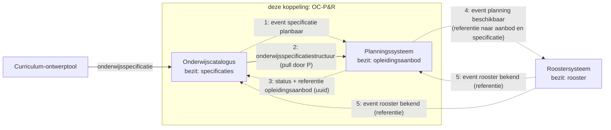
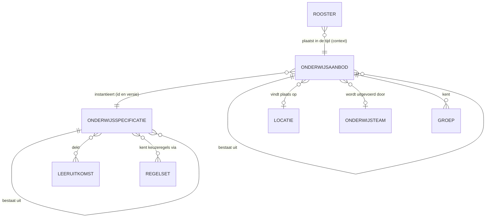
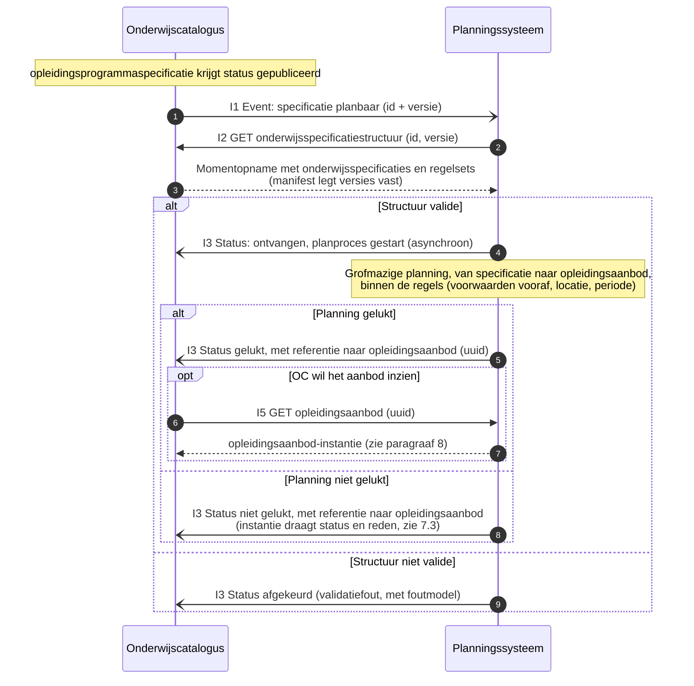
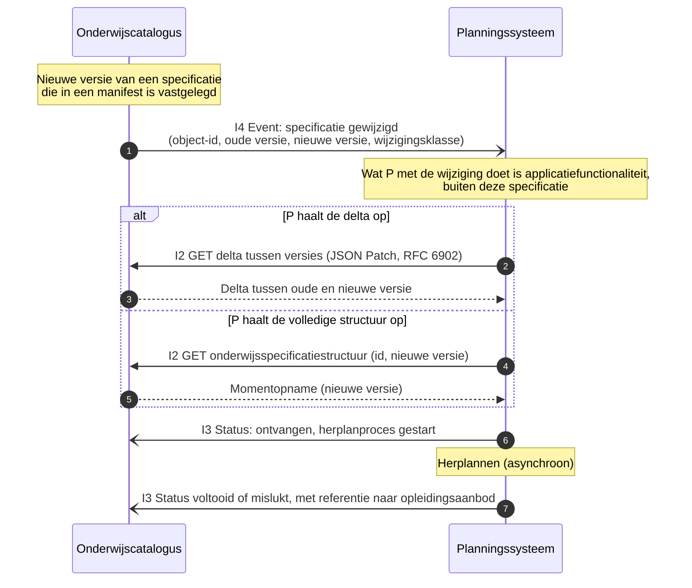
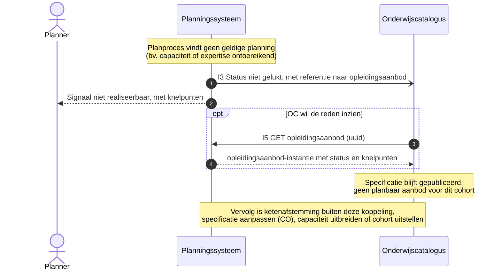
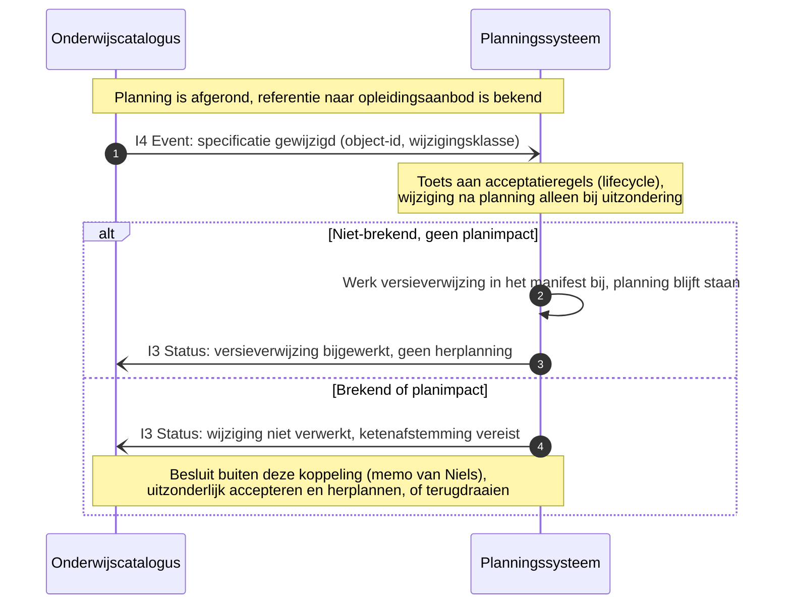
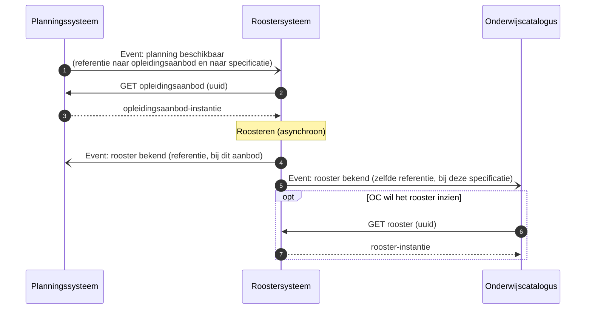

# Koppelingspecificatie OC-P&R: interactiepatronen (alpha)

Context: koppeling onderwijscatalogus (OC) naar planning en roostering (P&R), intra-instelling. Scenario: LR1-3. Niveau: alpha, voor stakeholder-review. Status: concept. Relateert aan: #98, #119, #105.

## Inhoudsopgave

1. [Inleiding](#1-inleiding)
2. [Doel](#2-doel)
3. [Scope](#3-scope)
4. [Kort procesbeeld](#4-kort-procesbeeld)
5. [Interactieoverzicht](#5-interactieoverzicht)
6. [Kort informatiemodel en datamodel](#6-kort-informatiemodel-en-datamodel)
7. [Sequentiediagrammen](#7-sequentiediagrammen)
8. [Onderwijsaanbod-payload (verwijzing)](#8-onderwijsaanbod-payload-verwijzing)
9. [Endpointbeschrijvingen (REST, alpha)](#9-endpointbeschrijvingen-rest-alpha)
10. [Reviewvragen voor stakeholders](#10-reviewvragen-voor-stakeholders)
11. [Open vragen en signaleringen](#11-open-vragen-en-signaleringen)
12. [Gerelateerde uitwerkingen](#12-gerelateerde-uitwerkingen)

## 1. Inleiding

Issue #98 vraagt sequentiediagrammen voor de koppeling OC naar P&R, als AMIGO-stap interactie-analyse. Deze memo is die uitwerking: een koppelingspecificatie op alpha-niveau (terminologie: ADR 0021, koppeling versus koppelvlak), met procesbeeld, interactieoverzicht, sequentiediagrammen, een concept-payload voor het `opleidingsaanbod` en eenvoudige endpointbeschrijvingen.

De memo bouwt voort op de [onderwijsspecificatie-payload](20260717_1120_okx-lr1-onderwijsspecificatie-payload-json.md): de berichten over deze koppeling dragen die payload (onderwijsspecificatiestructuur, manifest, semver). De lifecycle-regels komen uit de [lifecycle-uitwerking](20260720_0832_okx-lr1-lifecycle-versionering.md) en de memo van Niels (PR #110).

De hoofdstukken 15 tot en met 18 van het OKx OEAPI consumer-profiel (interactiepatronen en sequentiediagrammen) zijn een eerdere oefening op een beperkt referentiekader en gelden als **verouderd**. Deze memo vervangt die lijn; het profiel zelf wordt in deze branch niet aangepast (signalering in §11).

## 2. Doel

- De interacties tussen OC en P vastleggen als expliciete patronen met sequentiediagrammen (AMIGO-stap 3, richting stap 6).
- Per bericht de payload benoemen, gebaseerd op de onderwijsspecificatie-payload.
- Een eerste, eenvoudige endpointset (REST) als opstap naar de interfacespecificatie.
- Alpha: stakeholders laten schieten op richting en inhoud (§10).

## 3. Scope

- Koppeling: OC naar P, intra-instelling eerst (ADR 0008). Leerroutes LR1-3.
- Flows in deze alpha: happy flow (onderwijsspecificatiestructuur ophalen, referentie naar het `opleidingsaanbod` terugmelden), wijzigingsnotificatie bij een nieuwe versie van een in het manifest vastgelegde specificatie, en twee faalpaden (planning niet realiseerbaar; wijziging na afgeronde planning).
- Buiten scope: capaciteitsterugkoppeling (periodieke bezettingsupdates), cross-instelling en Edubroker, OpenAPI-yaml, de resultaatstructuur (eigen spoor). De doorwerking naar het roostersysteem (P naar R) staat alleen als contextdiagram (§7.5), niet als onderdeel van deze koppeling.

## 4. Kort procesbeeld

**Kernprincipe: resource-eigenaarschap.** Elk systeem bezit zijn eigen resource: OC de onderwijsspecificaties, P het `opleidingsaanbod`, R het rooster. Over de koppeling gaan **referenties** (uuid/URI) en **events**; de consument haalt de resource op wanneer die hem nodig heeft (notify-then-pull; sluit aan bij ADR 0020).

Procesbeschrijving, kort:

1. OC publiceert een `opleidingsprogrammaspecificatie` (status `gepubliceerd`, manifest legt versies vast) en meldt P: specificatie is planbaar.
2. P haalt de onderwijsspecificatiestructuur op (pull) en bouwt asynchroon de grofmazige planning, binnen de regels (voorwaarden vooraf, locatie, periode; #84).
3. P meldt het resultaat aan OC: gelukt of niet gelukt, met de **referentie** (uuid) naar het `opleidingsaanbod`. De aanbodinstantie zelf blijft bij P; OC haalt hem op als OC hem wil inzien.
4. Wijzigt een vastgelegde specificatie, dan notificeert OC (dun event); P haalt de delta of de volledige structuur op en herplant.
5. Doorwerking (context, buiten deze koppeling): P meldt R "planning beschikbaar" met referenties; R roostert en meldt "rooster bekend" aan OC en P, opnieuw via referentie.

## 5. Interactieoverzicht

Interacties op deze koppeling (AMIGO-stap 3). Betrouwbaarheidseisen conform ADR 0018; events volgen het pub/sub-patroon uit ADR 0020. Het samengestelde patroon is **notify-then-pull**: de bezitter meldt met een referentie, de consument haalt op. De events zijn dunne notificaties ([Event Message](https://www.enterpriseintegrationpatterns.com/patterns/messaging/EventMessage.html)): ze dragen de aanleiding (id, versie), niet de inhoud.

| # | Interactie | Initiator | Patroon | Synchroniciteit | Gedrag bij dubbele ontvangst | Foutafhandeling |
|---|---|---|---|---|---|---|
| I1 | Specificatie planbaar melden | OC | [Event Message](https://www.enterpriseintegrationpatterns.com/patterns/messaging/EventMessage.html) (id + versie) | Asynchroon | Geen effect: ontvanger herkent event-id ([Idempotent Receiver](https://www.enterpriseintegrationpatterns.com/patterns/messaging/IdempotentReceiver.html)) | [Guaranteed Delivery](https://www.enterpriseintegrationpatterns.com/patterns/messaging/GuaranteedDelivery.html); [Dead Letter Channel](https://www.enterpriseintegrationpatterns.com/patterns/messaging/DeadLetterChannel.html) |
| I2 | Onderwijsspecificatiestructuur of delta ophalen | P | [Request-Reply](https://www.enterpriseintegrationpatterns.com/patterns/messaging/RequestReply.html) (GET, alleen-lezen) | Synchroon | Geen effect (alleen-lezen) | HTTP-foutcodes, client bepaalt retry |
| I3 | Verwerkingsstatus melden, met referentie naar het `opleidingsaanbod` | P | [Event Message](https://www.enterpriseintegrationpatterns.com/patterns/messaging/EventMessage.html) (status: ontvangen/gestart, afgekeurd, gelukt, niet gelukt) | Asynchroon | Geen effect: status-id | Retry met backoff, daarna [Dead Letter Channel](https://www.enterpriseintegrationpatterns.com/patterns/messaging/DeadLetterChannel.html) |
| I4 | Specificatiewijziging melden | OC | [Event Message](https://www.enterpriseintegrationpatterns.com/patterns/messaging/EventMessage.html) (object-id, oude en nieuwe versie, wijzigingsklasse) | Asynchroon | Geen effect: event-id | [Guaranteed Delivery](https://www.enterpriseintegrationpatterns.com/patterns/messaging/GuaranteedDelivery.html); [Dead Letter Channel](https://www.enterpriseintegrationpatterns.com/patterns/messaging/DeadLetterChannel.html) |
| I5 | `opleidingsaanbod` ophalen | OC (of R) | [Request-Reply](https://www.enterpriseintegrationpatterns.com/patterns/messaging/RequestReply.html) op referentie (GET uuid, alleen-lezen) | Synchroon | Geen effect (alleen-lezen) | HTTP-foutcodes |

Referentie voor de patroontaal: [Enterprise Integration Patterns, Messaging](https://www.enterpriseintegrationpatterns.com/patterns/messaging/). De koppelingspecificatie legt de patronen op dit niveau vast; implementatiekeuzes (bus, broker, polling) schrijft ze niet voor.

Context, buiten deze koppeling maar zelfde patroon: P meldt R "planning beschikbaar" (referenties), R meldt OC en P "rooster bekend" (referentie). Zie §7.5.

Ordening: per `specificatieId` blijft de berichtvolgorde behouden (zelfde sleutel, zelfde volgorde, ADR 0018).

## 6. Kort informatiemodel en datamodel

### 6.1 Conceptueel informatiemodel

De begrippen uit het semantisch kader en hun relaties, in de context van dit proces. Links de wereld van OC (specificeren), rechts die van P (instantiëren); de koppeling verbindt ze via de verwijzing "instantieert".

Leeswijzer bij het proces: OC beheert de `onderwijsspecificatie`s (met versie en manifest) en de bijbehorende `regelset`s; beide verankeren op leeruitkomsten. P creëert per specificatieversie het `onderwijsaanbod` (de instantie), plaatst dat op een locatie, belegt het bij een onderwijsteam en deelt het in groepen in. Het rooster (R) plaatst het aanbod daarna in de tijd; dat is context buiten deze koppeling (§7.5).

### 6.2 Datamodellen (verwijzing)

Geen herhaling van de modellen; de bron is de payload-serie.

- Informatiemodel en ERD: [onderwijsspecificatie-payload §7.1](20260717_1120_okx-lr1-onderwijsspecificatie-payload-json.md).
- Datamodel en JSON: [onderwijsspecificatie-payload §7.2](20260717_1120_okx-lr1-onderwijsspecificatie-payload-json.md).
- Lifecycle en manifest: [onderwijsspecificatie-payload §8](20260717_1120_okx-lr1-onderwijsspecificatie-payload-json.md) en de [lifecycle-uitwerking](20260720_0832_okx-lr1-lifecycle-versionering.md).

Berichten op deze koppeling:

| Bericht | Interactie | Richting | Inhoud | Versieverwijzing |
|---|---|---|---|---|
| Specificatie planbaar (event) | I1 | OC naar P | Id en versie van de gepubliceerde `opleidingsprogrammaspecificatie` | De gepubliceerde versie (semver) |
| Onderwijsspecificatiestructuur (momentopname) | I2 | OC naar P | Volledige structuur: `onderwijsspecificaties` + `regelsets` (payload-uitwerking); het manifest legt per niveau de versies van de onderdelen vast | Manifest per niveau |
| Delta tussen twee versies | I2 | OC naar P | Wijzigingen tussen oude en nieuwe versie, als JSON Patch (RFC 6902) | Oude en nieuwe versie |
| Verwerkingsstatus (event) | I3 | P naar OC | Status (ontvangen/gestart, afgekeurd, gelukt, niet gelukt) plus de referentie (uuid) naar het `opleidingsaanbod` | De specificatieversie waarop de planning is gebaseerd |
| Specificatie gewijzigd (event) | I4 | OC naar P | Object-id, oude en nieuwe versie, wijzigingsklasse (lifecycle-classificatie) | Oude en nieuwe versie |
| `opleidingsaanbod` (instantie) | I5 | P naar opvrager | De instantie van het nieuw gecreëerde onderwijsaanbod, eigen document (§8) | Per aanbod-instantie `specificatieVerwijzing` (specificatieId + versie) |

## 7. Sequentiediagrammen

Geformaliseerd uit de schets bij #98. Notatie: `-)` is een asynchroon event, `->>` een synchrone aanroep, `-->>` een respons.

### 7.1 Happy flow: specificatie is planbaar

Van publicatie tot referentie naar het `opleidingsaanbod`. De validatie-uitkomst (afgekeurd) zit als alternatief pad in dezelfde flow, conform de schets.

### 7.2 Wijzigingsnotificatie: specificatie gewijzigd

Uit de schets, tweede flow. Het event is een dunne notificatie ([Event Message](https://www.enterpriseintegrationpatterns.com/patterns/messaging/EventMessage.html)): het draagt de aanleiding (object-id, versies, wijzigingsklasse), niet de inhoud. De standaard biedt vervolgens **twee ontsluitingen**: de volledige `onderwijsspecificatiestructuur`, of de delta tussen twee versies als JSON Patch (RFC 6902). Welke van de twee de consument gebruikt, en wat die ermee doet, is applicatiefunctionaliteit en valt buiten deze specificatie.

### 7.3 Faalpad: planning niet realiseerbaar

Wat er gebeurt na "niet gelukt". De `opleidingsaanbod`-instantie blijft bestaan en draagt status en reden. Het vervolg is ketenafstemming.

### 7.4 Faalpad: wijziging na afgeronde planning

Acceptatieregels uit de lifecycle-uitwerking en de memo van Niels: wijzigen na planning alleen bij uitzondering en na ketenafstemming.

### 7.5 Context: doorwerking naar het roostersysteem

Buiten de koppeling OC-P&R, maar hetzelfde patroon (referentie + event). Ter illustratie van de consistente lijn.

## 8. Onderwijsaanbod-payload (verwijzing)

De payload van de aanbod-instantie is een eigen document: [onderwijsaanbod-payload](20260723_1304_okx-lr1-onderwijsaanbod-payload-json.md). Kern:

- Volledig Nederlands, plat met verwijzingen (foreign keys): `aanbodInstanties`, `locaties`, `organisatieEenheden`.
- Elke aanbod-instantie verwijst via `specificatieVerwijzing` (specificatieId + versie) naar de onderliggende onderwijsspecificatie.
- Locatiemodel geïnspireerd op OEAPI-issue [Better Location support (#635)](https://github.com/open-education-api/specification/issues/635); organisatie-inrichting (onderwijsteams, professionals als uuid-verwijzing) op basis van het organogram uit het profiel.
- `status` en `knelpunten` dragen de planuitkomst; de knelpuntcodes zijn uitgewerkt als constraint-categorieën (plannen als constraint satisfaction problem).

## 9. Endpointbeschrijvingen (REST, alpha)

Eenvoudige endpointset als opstap naar de interfacespecificatie (AMIGO-stap 6). Alpha: paden en parameters zijn indicatief, geen OpenAPI-yaml. De events (I1, I3, I4) zijn hier als webhook-aflevering (HTTP POST naar de abonnee) beschreven; een bus of broker mag dat vervangen, de payload blijft gelijk.

Endpoints die **OC** serveert:

| Endpoint | Methode | Operatie | Parameters | Response | Statuscodes |
|---|---|---|---|---|---|
| `/onderwijsspecificatiestructuren/{id}` | GET | I2: volledige structuur ophalen | `versie` (optioneel, standaard laatst gepubliceerd) | Momentopname: `onderwijsspecificaties` + `regelsets` (payload-uitwerking) | 200, 400, 404 |
| `/onderwijsspecificatiestructuren/{id}/delta` | GET | I2: delta tussen twee versies | `van` (versie, verplicht), `naar` (versie, verplicht) | JSON Patch (RFC 6902) | 200, 400, 404 |

Endpoints die **P** serveert:

| Endpoint | Methode | Operatie | Parameters | Response | Statuscodes |
|---|---|---|---|---|---|
| `/opleidingsaanbod/{id}` | GET | I5: aanbod-instantie ophalen | `status` (optioneel filter op onderliggende instanties) | `aanbodInstanties` (onderwijsaanbod-payload, §8) | 200, 400, 404 |

Event-aflevering (webhook-vorm, alpha):

| Event | Interactie | Richting | Payload |
|---|---|---|---|
| `specificatie-planbaar` | I1 | OC naar P | specificatie-id + versie |
| `specificatie-gewijzigd` | I4 | OC naar P | object-id, oude en nieuwe versie, wijzigingsklasse |
| `verwerkingsstatus` | I3 | P naar OC | status + referentie naar `opleidingsaanbod` (uuid), specificatie-id + versie |

Gedrag:

- Alle GET's zijn alleen-lezen en zonder neveneffect; herhaald aanroepen geeft hetzelfde resultaat.
- Event-aflevering: ontvanger bevestigt met 200; bij uitblijven daarvan herhaalt de verzender met backoff en daarna [Dead Letter Channel](https://www.enterpriseintegrationpatterns.com/patterns/messaging/DeadLetterChannel.html). Dubbele aflevering is onschadelijk door het event-id ([Idempotent Receiver](https://www.enterpriseintegrationpatterns.com/patterns/messaging/IdempotentReceiver.html)).
- Mogelijke uitbreidingen (v-next): filter op `specificatieType` of deelstructuur-selectie bij het ophalen van de structuur, paginering bij grote structuren, abonnementenbeheer (wie ontvangt welke events).

## 10. Reviewvragen voor stakeholders

> Wordt aangevuld tijdens de uitwerking. Geagendeerd:

1. Dekken de vijf interacties (I1-I5) de koppeling, of missen er flows voor jullie praktijk?
2. **Trigger-granulariteit (uit de schets):** bij welke veld- of objectwijziging stuurt OC de wijzigingsnotificatie (I4)? Voorstel: koppelen aan de wijzigingsklasse uit de lifecycle-uitwerking (semver: PATCH stil, MINOR/MAJOR notificeren). Klopt dat voor de planpraktijk?
3. **Delta versus volledige structuur (uit de schets):** wat moet het I4-event minimaal dragen zodat de consument kan kiezen tussen de delta (JSON Patch, RFC 6902) en de volledige structuur?
4. **Referentie in plaats van instantie (uitgangspunt):** P levert alleen de referentie (uuid) naar het `opleidingsaanbod`, niet de instantie zelf. Werkt dat voor alle consumenten (OC, R), of zijn er gevallen waarin de resource mee moet?
5. **Validatie-uitkomst:** afgekeurd als status-event (huidige keuze, past bij pull) of als synchrone HTTP-fout?
6. Volstaat de vastlegging van exacte versies in het manifest voor planning, of is een "laatst-compatibele" verwijzing nodig?
7. **Event-aflevering:** webhook (huidige alpha-beschrijving, §9) of een bus/broker? De payload blijft gelijk, de infrastructuurkeuze niet.
8. **Onderwijsaanbod-payload (apart document, §8):** dekken de vier aanbod-typen en de velden (status, knelpunten, periode, locatie, organisatie, groepen) wat planning teruggeeft, of missen er velden voor jullie praktijk?

## 11. Open vragen en signaleringen

- Profiel-hoofdstukken 15-18 zijn verouderd; deze memo is de vervangende lijn. Het profiel bijwerken is een aparte actie buiten deze branch.
- Capaciteitsterugkoppeling (bezetting, parallelle groepen) bewust buiten de alpha; volgt in een volgende iteratie.
- De [onderwijsaanbod-payload](20260723_1304_okx-lr1-onderwijsaanbod-payload-json.md) concretiseert de eerdere signalering "suggestieve aanbod-attributen" uit de onderwijsspecificatie-payload.
- Knelpuntcodes (planfouten als constraint-categorieën): eerste aanzet in de onderwijsaanbod-payload §11; genormeerde codelijst en foutmodel zijn een eigen issue waard.

## 12. Gerelateerde uitwerkingen

- [Onderwijsspecificatie-payload](20260717_1120_okx-lr1-onderwijsspecificatie-payload-json.md) (de berichtinhoud van deze koppeling).
- [Onderwijsaanbod-payload](20260723_1304_okx-lr1-onderwijsaanbod-payload-json.md) (de opvraagbare aanbod-instantie, I5).
- [Lifecycle en versionering](20260720_0832_okx-lr1-lifecycle-versionering.md) (wijzigingsklassen, acceptatie).
- [Resultaatstructuur en examenplan](../oc-sis-krs-svs/20260720_0831_okx-lr1-resultaatstructuur-examenplan.md) (hoort bij de koppeling OC-SIS, daar verder uit te werken).
- Memo van Niels: `doc/OKx_PDCA cyclus onderwijsontwerp.md` (PR #110).
- [Koppelingspecificatie OC-SIS (KRS/SVS)](../oc-sis-krs-svs/20260723_1402_okx-lr1-koppelingspecificatie-oc-sis.md) en [OC-LMS](../oc-lms/20260723_1403_okx-lr1-koppelingspecificatie-oc-lms.md) (zelfde patroon, concept).
- ADR 0018 (messaging-patronen), ADR 0020 (pub/sub bij mutaties), ADR 0008 (intra-instelling eerst), ADR 0021 (koppeling versus koppelvlak).
