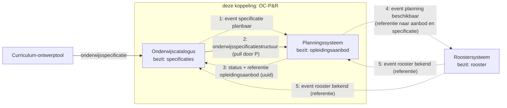
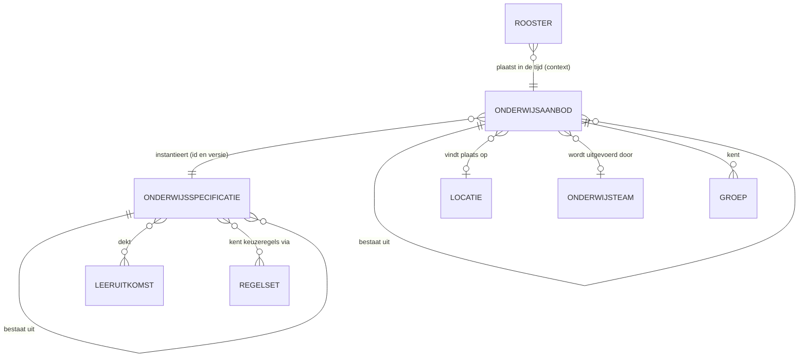
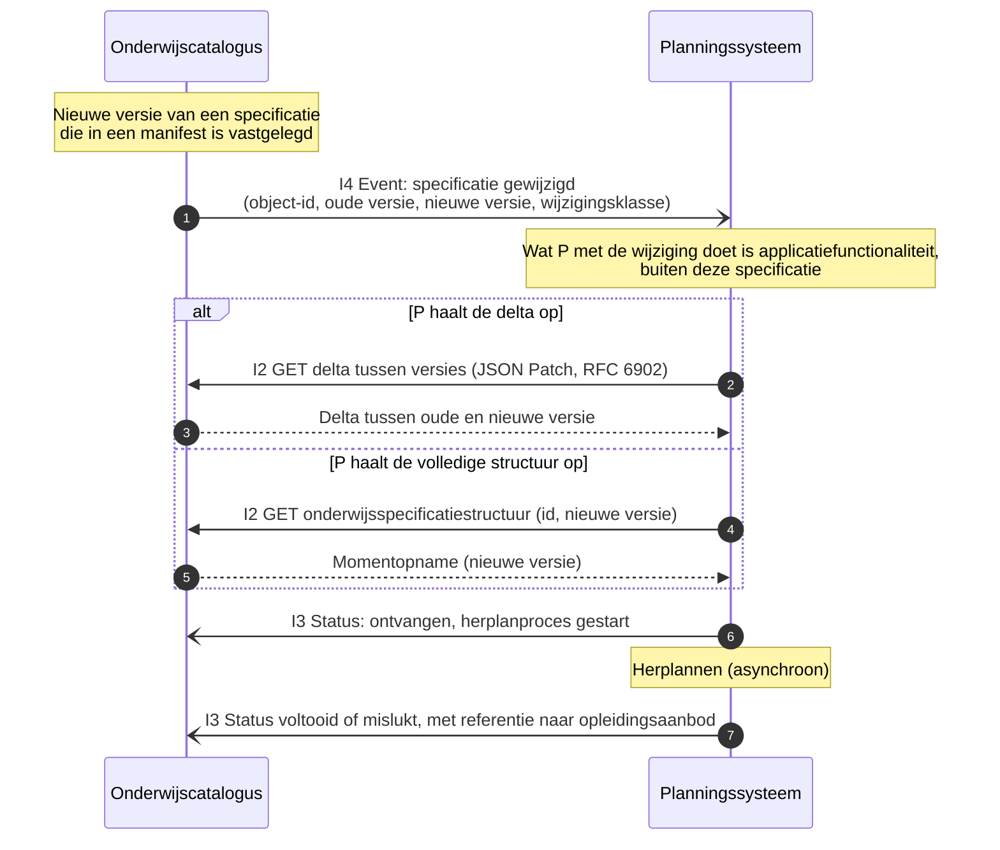
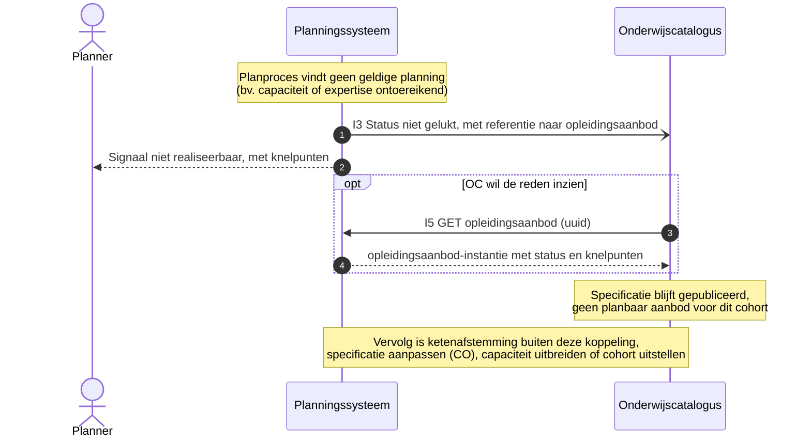
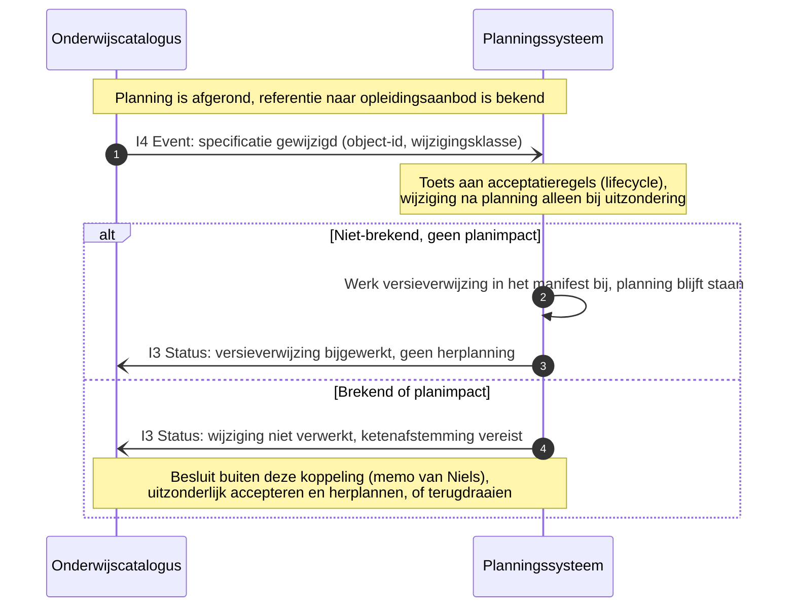
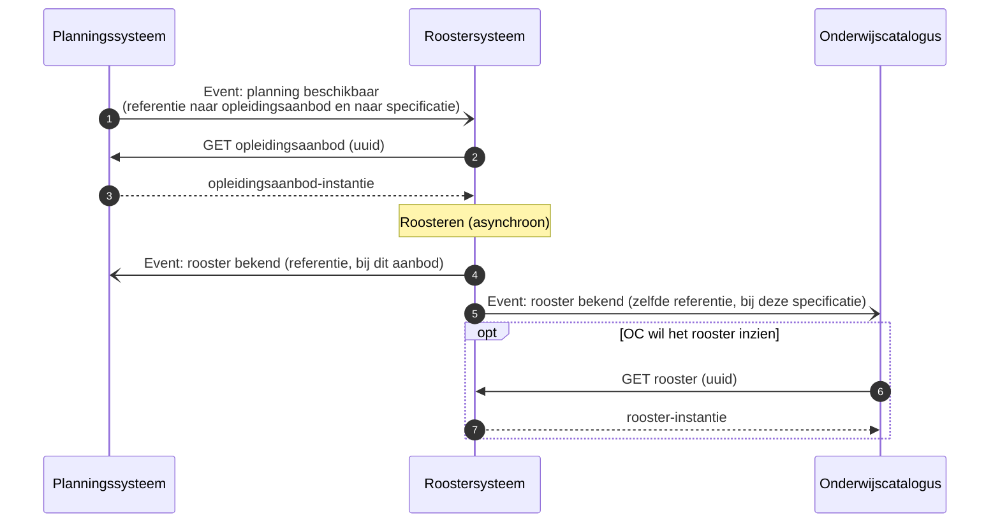

# Koppelingspecificatie onderwijscatalogus naar planning en roostering

Relateert aan: #98, #119, #105. Terminologie: [ADR 0021](../../../../dr/0021-koppeling-versus-koppelvlak-terminologie.md).

## Inhoudsopgave

1. [Inleiding](#1-inleiding) (context, doel, scope)
2. [Procesbeeld](#2-procesbeeld)
3. [Interactieoverzicht](#3-interactieoverzicht)
4. [Informatiemodel en datamodel](#4-informatiemodel-en-datamodel)
5. [Sequentiediagrammen](#5-sequentiediagrammen)
6. [Onderwijsaanbod-payload (verwijzing)](#6-onderwijsaanbod-payload-verwijzing)
7. [Endpointbeschrijvingen (REST)](#7-endpointbeschrijvingen-rest)
8. [Reviewvragen voor stakeholders](#8-reviewvragen-voor-stakeholders)
9. [Open vragen en signaleringen](#9-open-vragen-en-signaleringen)
10. [Gerelateerde uitwerkingen](#10-gerelateerde-uitwerkingen)

## 1. Inleiding

### 1.1 Context

Waar deze koppeling in de keten zit: een curriculum-ontwerptool (CO) levert onderwijsspecificaties aan de onderwijscatalogus (OC); de OC publiceert die en het planningssysteem (P) maakt er planbaar `opleidingsaanbod` van. Dit document beschrijft die stap, de koppeling OC naar P&R (stroom 2 in het [Projectoverzicht](../../../../../doc/OKx_Projectoverzicht.md), "te plannen aanbod"). Het ketenoverzicht en de actuele [hoofdplaat v1.7](../README.md#context) staan in de instap van de README.

Scenario is leerroute 1 (regulier), uitgewerkt aan de hand van persona [Jochem](../../../../docs/specificatie/okx-oeapi-consumer-profiel/doc/persona_jochem.md): hij volgt de voltijd mbo-4-opleiding Apothekersassistent (Crebo-dossier 23450, kwalificatie 27141) in een aanbod-gestuurd traject en kiest uit wat de instelling aanbiedt. Leerroute 2 en 3 volgen later als verschil. Volledige leerroutes, persona's en het begrippenkader (ankertabel, zes families): het [OEAPI consumer-profiel](../../../../docs/specificatie/okx-oeapi-consumer-profiel/README.md). Let op: dat profiel gebruikt nog een oudere hoofdplaat; leidend is v1.7.

Dit document is ontstaan als interactie-analyse, de derde stap van de [AMIGO-aanpak](../../../../../.cursor/skills/amigo-aanpak/SKILL.md) van Edustandaard, en werkt toe naar de interfacespecificatie in stap 6. Het bouwt voort op de centrale [onderwijsspecificatie-payload](../gedeeld/20260717_1120_okx-lr1-onderwijsspecificatie-payload-json.md), waarvan de berichten de structuur, het manifest en de versienummers dragen, op de [lifecycle-uitwerking](../gedeeld/20260720_0832_okx-lr1-lifecycle-versionering.md) en op de memo van Niels over de onderwijs-PDCA-cyclus.

De hoofdstukken 15 tot en met 18 van het consumer-profiel beschrijven interactiepatronen en sequentiediagrammen op een beperkter referentiekader en gelden als **verouderd**; dit document vervangt die lijn (zie de signalering in §9).

### 1.2 Doel

Deze koppelingbeschrijving is **indicatief, geen voorschrift aan de sector**. Ze onderbouwt welke operaties en endpoints het koppelvlak van de onderwijscatalogus en dat van het planningssysteem nodig hebben; de som van alle koppelingbeschrijvingen leidt tot de koppelvlakspecificatie per component, en nieuwe behoeften onderbouwen later nieuwe operaties ([toelichting](../README.md#van-koppelingbeschrijving-naar-koppelvlakspecificatie-doelbinding)).

Het document beantwoordt vier vragen:

- Welke interacties lopen er tussen de onderwijscatalogus en het planningssysteem, en in welke volgorde?
- Welke payload draagt elk bericht?
- Wat gebeurt er als een specificatie wijzigt nadat er al gepland is?
- Welke endpoints en operaties volgen daaruit voor beide koppelvlakken?

Geslaagd wanneer een planningsleverancier en een catalogusleverancier op basis van dit document dezelfde interactie bouwen, en wanneer stakeholders kunnen aanwijzen welke interactie zij missen (§8).

### 1.3 Scope

In scope is de koppeling van de onderwijscatalogus naar het planningssysteem binnen één instelling ([ADR 0008](../../../../dr/0008-scope-planning-eerst-intra-instelling.md)), voor leerroute 1 tot en met 3. Uitgewerkt zijn vier stromen: de happy flow (structuur ophalen en de referentie naar het `opleidingsaanbod` terugmelden), de wijzigingsnotificatie bij een nieuwe versie van een vastgelegde specificatie, en twee faalpaden (planning niet realiseerbaar, en een wijziging na afgeronde planning).

Twee afbakeningen die anders verwarring geven:

- De doorwerking naar het **roostersysteem** staat alleen als contextdiagram (§5.5); die koppeling wordt hier niet gespecificeerd.
- **Capaciteitsterugkoppeling** (periodieke bezettingsupdates) en de **resultaatstructuur** volgen elk een eigen spoor.

Al het overige valt buiten dit document, waaronder cross-instelling, de uitwisseling via Edubroker en een uitgewerkte OpenAPI-beschrijving.

## 2. Procesbeeld

Twee principes bepalen het verkeer over deze koppeling.

**Resource-eigenaarschap.** Elk systeem bezit zijn eigen resource: de onderwijscatalogus de onderwijsspecificaties, het planningssysteem het `opleidingsaanbod`, het roostersysteem het rooster. Niemand kopieert de resource van een ander.

**Notify-then-pull.** Er gaan twee soorten verkeer over de koppeling. De bezitter **publiceert een event** zodra er iets te melden valt, volgens het pub/sub-patroon uit [ADR 0020](../../../../dr/0020-curriculumontwerp-onderwijscatalogus-happy-flow-synchronisatie-en-federatie-adopt-klonen.md); dat event is dun en draagt alleen de aanleiding plus een referentie (uuid). De consument **haalt de resource vervolgens zelf op**, wanneer het hem uitkomt. Het is dus geen pull-only model: het event is de trigger, de pull is het ophalen. De combinatie voorkomt dat systemen elkaar bevragen zonder aanleiding, en voorkomt tegelijk dat een grote payload wordt meegestuurd naar een ontvanger die er nog niets mee doet. Deze keuze is repo-breed vastgelegd en geen keuze per koppeling.

Wat het diagram niet toont: het planningssysteem bouwt de planning **asynchroon** op, binnen de regels uit de specificatie (voorwaarden vooraf, locatie, periode). De uitkomst, gelukt of niet gelukt, komt terug als status met een referentie naar het `opleidingsaanbod`; de aanbod-instantie zelf blijft bij planning en wordt alleen opgehaald als de catalogus die wil inzien. Stap 4 en 5 liggen buiten deze koppeling en staan er ter illustratie van hetzelfde patroon (§5.5).

## 3. Interactieoverzicht

De interacties op deze koppeling, met per interactie het messaging-patroon. Betrouwbaarheidseisen volgen [ADR 0018](../../../../dr/0018-enterprise-messaging-patronen-voor-betrouwbare-koppelvlakken.md). De events zijn dunne notificaties ([Event Message](https://www.enterpriseintegrationpatterns.com/patterns/messaging/EventMessage.html)): ze dragen de aanleiding (id en versie), niet de inhoud.

| # | Interactie | Initiator | Patroon | Synchroniciteit | Gedrag bij dubbele ontvangst | Foutafhandeling |
|---|---|---|---|---|---|---|
| I1 | Specificatie planbaar melden | OC | [Event Message](https://www.enterpriseintegrationpatterns.com/patterns/messaging/EventMessage.html) (id + versie) | Asynchroon | Geen effect: ontvanger herkent event-id ([Idempotent Receiver](https://www.enterpriseintegrationpatterns.com/patterns/messaging/IdempotentReceiver.html)) | [Guaranteed Delivery](https://www.enterpriseintegrationpatterns.com/patterns/messaging/GuaranteedDelivery.html); [Dead Letter Channel](https://www.enterpriseintegrationpatterns.com/patterns/messaging/DeadLetterChannel.html) |
| I2 | Onderwijsspecificatiestructuur of delta ophalen | P | [Request-Reply](https://www.enterpriseintegrationpatterns.com/patterns/messaging/RequestReply.html) (GET, alleen-lezen) | Synchroon | Geen effect (alleen-lezen) | HTTP-foutcodes, client bepaalt retry |
| I3 | Verwerkingsstatus melden, met referentie naar het `opleidingsaanbod` | P | [Event Message](https://www.enterpriseintegrationpatterns.com/patterns/messaging/EventMessage.html) (status: ontvangen/gestart, afgekeurd, gelukt, niet gelukt) | Asynchroon | Geen effect: status-id | Retry met backoff, daarna [Dead Letter Channel](https://www.enterpriseintegrationpatterns.com/patterns/messaging/DeadLetterChannel.html) |
| I4 | Specificatiewijziging melden | OC | [Event Message](https://www.enterpriseintegrationpatterns.com/patterns/messaging/EventMessage.html) (object-id, oude en nieuwe versie, wijzigingsklasse) | Asynchroon | Geen effect: event-id | [Guaranteed Delivery](https://www.enterpriseintegrationpatterns.com/patterns/messaging/GuaranteedDelivery.html); [Dead Letter Channel](https://www.enterpriseintegrationpatterns.com/patterns/messaging/DeadLetterChannel.html) |
| I5 | `opleidingsaanbod` ophalen | OC (of R) | [Request-Reply](https://www.enterpriseintegrationpatterns.com/patterns/messaging/RequestReply.html) op referentie (GET uuid, alleen-lezen) | Synchroon | Geen effect (alleen-lezen) | HTTP-foutcodes |

Referentie voor de patroontaal: [Enterprise Integration Patterns, Messaging](https://www.enterpriseintegrationpatterns.com/patterns/messaging/). De koppelingspecificatie legt de patronen op dit niveau vast; implementatiekeuzes (bus, broker, polling) schrijft ze niet voor.

Context, buiten deze koppeling maar zelfde patroon: P meldt R "planning beschikbaar" (referenties), R meldt OC en P "rooster bekend" (referentie). Zie §5.5.

Ordening: per `specificatieId` blijft de berichtvolgorde behouden (zelfde sleutel, zelfde volgorde, [ADR 0018](../../../../dr/0018-enterprise-messaging-patronen-voor-betrouwbare-koppelvlakken.md)).

## 4. Informatiemodel en datamodel

### 4.1 Informatiemodel

De begrippen uit het semantisch kader en hun relaties, in de context van dit proces. Links de wereld van OC (specificeren), rechts die van P (instantiëren); de koppeling verbindt ze via de verwijzing "instantieert".

Wat het model niet toont: de scheiding loopt precies langs het eigenaarschap. Links de wereld van de catalogus (specificeren), rechts die van planning (instantiëren), verbonden door de verwijzing `instantieert`. Het rooster plaatst het aanbod daarna in de tijd; dat valt buiten deze koppeling (§5.5).

### 4.2 Datamodellen (verwijzing) en gebruiksprofiel

Geen herhaling van de modellen; de bron is de centrale [onderwijsspecificatie-payload](../gedeeld/20260717_1120_okx-lr1-onderwijsspecificatie-payload-json.md) ([ADR 0021](../../../../dr/0021-koppeling-versus-koppelvlak-terminologie.md)).

Gebruiksprofiel van deze koppeling (welke onderdelen van de centrale payload OC aan P levert):

| Onderdeel | Gebruik in OC-P&R |
|---|---|
| `onderwijsspecificaties` | Volledig, inclusief manifest |
| `regelsets` | Volledig; `voorwaardeVooraf` bevat leeruitkomst-ids uitsluitend als **opaque sleutels** voor volgordebepaling ([ADR 0023](../../../../dr/0023-leeruitkomsten-als-opaque-sleutels-in-koppeling-oc-p-en-r.md)) |
| `leeruitkomsten` | **Niet meegeleverd.** Planning heeft de betekenis, aggregatie en inhoud van leeruitkomsten niet nodig ([ADR 0023](../../../../dr/0023-leeruitkomsten-als-opaque-sleutels-in-koppeling-oc-p-en-r.md)) |

- Informatiemodel en ERD: [onderwijsspecificatie-payload §2.1](../gedeeld/20260717_1120_okx-lr1-onderwijsspecificatie-payload-json.md).
- Datamodel en JSON: [onderwijsspecificatie-payload §2.2](../gedeeld/20260717_1120_okx-lr1-onderwijsspecificatie-payload-json.md).
- Lifecycle en manifest: [onderwijsspecificatie-payload §3.3](../gedeeld/20260717_1120_okx-lr1-onderwijsspecificatie-payload-json.md) en de [lifecycle-uitwerking](../gedeeld/20260720_0832_okx-lr1-lifecycle-versionering.md).

Berichten op deze koppeling:

| Bericht | Interactie | Richting | Inhoud | Versieverwijzing |
|---|---|---|---|---|
| Specificatie planbaar (event) | I1 | OC naar P | Id en versie van de gepubliceerde `opleidingsprogrammaspecificatie` | De gepubliceerde versie (semver) |
| Onderwijsspecificatiestructuur (momentopname) | I2 | OC naar P | Volledige structuur: `onderwijsspecificaties` + `regelsets` (payload-uitwerking); het manifest legt per niveau de versies van de onderdelen vast | Manifest per niveau |
| Delta tussen twee versies | I2 | OC naar P | Wijzigingen tussen oude en nieuwe versie, als JSON Patch (RFC 6902) | Oude en nieuwe versie |
| Verwerkingsstatus (event) | I3 | P naar OC | Status (ontvangen/gestart, afgekeurd, gelukt, niet gelukt) plus de referentie (uuid) naar het `opleidingsaanbod` | De specificatieversie waarop de planning is gebaseerd |
| Specificatie gewijzigd (event) | I4 | OC naar P | Object-id, oude en nieuwe versie, wijzigingsklasse (lifecycle-classificatie) | Oude en nieuwe versie |
| `opleidingsaanbod` (instantie) | I5 | P naar opvrager | De instantie van het nieuw gecreëerde onderwijsaanbod, eigen document (§6) | Per aanbod-instantie `specificatieVerwijzing` (specificatieId + versie) |

## 5. Sequentiediagrammen

Geformaliseerd uit de schets bij #98. Notatie: `-)` is een asynchroon event, `->>` een synchrone aanroep, `-->>` een respons.

### 5.1 Happy flow: specificatie is planbaar

Van publicatie tot referentie naar het `opleidingsaanbod`. De validatie-uitkomst (afgekeurd) zit als alternatief pad in dezelfde flow, conform de schets.

### 5.2 Wijzigingsnotificatie: specificatie gewijzigd

Uit de schets, tweede flow. Het event is een dunne notificatie ([Event Message](https://www.enterpriseintegrationpatterns.com/patterns/messaging/EventMessage.html)): het draagt de aanleiding (object-id, versies, wijzigingsklasse), niet de inhoud. De standaard biedt vervolgens **twee ontsluitingen**: de volledige `onderwijsspecificatiestructuur`, of de delta tussen twee versies als JSON Patch (RFC 6902). Welke van de twee de consument gebruikt, en wat die ermee doet, is applicatiefunctionaliteit en valt buiten deze specificatie.

### 5.3 Faalpad: planning niet realiseerbaar

Wat er gebeurt na "niet gelukt". De `opleidingsaanbod`-instantie blijft bestaan en draagt status en reden. Het vervolg is ketenafstemming.

### 5.4 Faalpad: wijziging na afgeronde planning

Acceptatieregels uit de lifecycle-uitwerking en de memo van Niels: wijzigen na planning alleen bij uitzondering en na ketenafstemming.

### 5.5 Context: doorwerking naar het roostersysteem

Buiten de koppeling OC-P&R, maar hetzelfde patroon (referentie + event). Ter illustratie van de consistente lijn.

## 6. Onderwijsaanbod-payload (verwijzing)

De payload van de aanbod-instantie is een eigen document: [onderwijsaanbod-payload](20260723_1304_okx-lr1-onderwijsaanbod-payload-json.md). Kern:

- Volledig Nederlands, plat met verwijzingen (foreign keys): `aanbodInstanties`, `locaties`, `organisatieEenheden`.
- Elke aanbod-instantie verwijst via `specificatieVerwijzing` (specificatieId + versie) naar de onderliggende onderwijsspecificatie.
- Locatiemodel geïnspireerd op OEAPI-issue [Better Location support (#635)](https://github.com/open-education-api/specification/issues/635); organisatie-inrichting (onderwijsteams, professionals als uuid-verwijzing) op basis van het organogram uit het profiel.
- `status` en `knelpunten` dragen de planuitkomst; de knelpuntcodes zijn uitgewerkt als constraint-categorieën (plannen als constraint satisfaction problem).

## 7. Endpointbeschrijvingen (REST)

Endpointset als opstap naar de interfacespecificatie, de zesde AMIGO-stap. Paden en parameters zijn indicatief; een uitgewerkte OpenAPI-beschrijving volgt later. De events (I1, I3, I4) staan hier beschreven als webhook-aflevering, dus een HTTP POST naar de abonnee. Een bus of broker mag dat vervangen; de payload blijft gelijk.

Endpoints die **OC** serveert:

| Endpoint | Methode | Operatie | Parameters | Response | Statuscodes |
|---|---|---|---|---|---|
| `/onderwijsspecificaties/{id}` | GET | I2: volledige structuur ophalen | `versie` (optioneel, standaard laatst gepubliceerd) | Momentopname: `onderwijsspecificaties` + `regelsets` (payload-uitwerking) | 200, 400, 404 |
| `/onderwijsspecificaties/{id}/delta` | GET | I2: delta tussen twee versies | `van` (versie, verplicht), `naar` (versie, verplicht) | JSON Patch (RFC 6902) | 200, 400, 404 |

Endpoints die **P** serveert:

| Endpoint | Methode | Operatie | Parameters | Response | Statuscodes |
|---|---|---|---|---|---|
| `/opleidingsaanbod/{id}` | GET | I5: aanbod-instantie ophalen | `status` (optioneel filter op onderliggende instanties) | `aanbodInstanties` (onderwijsaanbod-payload, §6) | 200, 400, 404 |

Event-aflevering, in webhook-vorm:

| Event | Interactie | Richting | Payload |
|---|---|---|---|
| `specificatie-planbaar` | I1 | OC naar P | specificatie-id + versie |
| `specificatie-gewijzigd` | I4 | OC naar P | object-id, oude en nieuwe versie, wijzigingsklasse |
| `verwerkingsstatus` | I3 | P naar OC | status + referentie naar `opleidingsaanbod` (uuid), specificatie-id + versie |

Gedrag:

- Alle GET's zijn alleen-lezen en zonder neveneffect; herhaald aanroepen geeft hetzelfde resultaat.
- Event-aflevering: ontvanger bevestigt met 200; bij uitblijven daarvan herhaalt de verzender met backoff en daarna [Dead Letter Channel](https://www.enterpriseintegrationpatterns.com/patterns/messaging/DeadLetterChannel.html). Dubbele aflevering is onschadelijk door het event-id ([Idempotent Receiver](https://www.enterpriseintegrationpatterns.com/patterns/messaging/IdempotentReceiver.html)).
- Mogelijke uitbreidingen (v-next): filter op `specificatieType` of deelstructuur-selectie bij het ophalen van de structuur, paginering bij grote structuren, abonnementenbeheer (wie ontvangt welke events).

## 8. Reviewvragen voor stakeholders

> Wordt aangevuld tijdens de uitwerking. Geagendeerd:

1. Dekken de vijf interacties (I1-I5) de koppeling, of missen er flows voor jullie praktijk?
2. **Trigger-granulariteit (uit de schets):** bij welke veld- of objectwijziging stuurt OC de wijzigingsnotificatie (I4)? Voorstel: koppelen aan de wijzigingsklasse uit de lifecycle-uitwerking (semver: PATCH stil, MINOR/MAJOR notificeren). Klopt dat voor de planpraktijk?
3. **Delta versus volledige structuur (uit de schets):** wat moet het I4-event minimaal dragen zodat de consument kan kiezen tussen de delta (JSON Patch, RFC 6902) en de volledige structuur?
4. **Referentie in plaats van instantie (uitgangspunt):** P levert alleen de referentie (uuid) naar het `opleidingsaanbod`, niet de instantie zelf. Werkt dat voor alle consumenten (OC, R), of zijn er gevallen waarin de resource mee moet?
5. **Validatie-uitkomst:** afgekeurd als status-event (huidige keuze, past bij pull) of als synchrone HTTP-fout?
6. Volstaat de vastlegging van exacte versies in het manifest voor planning, of is een "laatst-compatibele" verwijzing nodig?
7. **Event-aflevering:** webhook (zoals beschreven in §7) of een bus of broker? De payload blijft gelijk, de infrastructuurkeuze niet.
8. **Onderwijsaanbod-payload (apart document, §6):** dekken de vier aanbod-typen en de velden (status, knelpunten, periode, locatie, organisatie, groepen) wat planning teruggeeft, of missen er velden voor jullie praktijk?

## 9. Open vragen en signaleringen

- Profiel-hoofdstukken 15-18 zijn verouderd; deze memo is de vervangende lijn. Het profiel bijwerken is een aparte actie buiten deze branch.
- Capaciteitsterugkoppeling (bezetting, parallelle groepen) valt bewust buiten deze uitwerking en volgt in een volgende iteratie.
- De [onderwijsaanbod-payload](20260723_1304_okx-lr1-onderwijsaanbod-payload-json.md) concretiseert de eerdere signalering "suggestieve aanbod-attributen" uit de onderwijsspecificatie-payload.
- Knelpuntcodes (planfouten als constraint-categorieën): aanzet in de onderwijsaanbod-payload §3.4; genormeerde codelijst en foutmodel zijn een eigen issue waard.

## 10. Gerelateerde uitwerkingen

- [Onderwijsspecificatie-payload](../gedeeld/20260717_1120_okx-lr1-onderwijsspecificatie-payload-json.md) (de berichtinhoud van deze koppeling).
- [Onderwijsaanbod-payload](20260723_1304_okx-lr1-onderwijsaanbod-payload-json.md) (de opvraagbare aanbod-instantie, I5).
- [Lifecycle en versionering](../gedeeld/20260720_0832_okx-lr1-lifecycle-versionering.md) (wijzigingsklassen, acceptatie).
- [Resultaatstructuur en examenplan](../oc-sis-krs-svs/20260720_0831_okx-lr1-resultaatstructuur-examenplan.md) (hoort bij de koppeling OC-SIS, daar verder uit te werken).
- Memo van Niels: `doc/OKx_PDCA cyclus onderwijsontwerp.md` (PR #110).
- [Koppelingspecificatie OC-SIS (KRS/SVS)](../oc-sis-krs-svs/20260723_1402_okx-lr1-koppelingspecificatie-oc-sis.md) en [OC-LMS](../oc-lms/20260723_1403_okx-lr1-koppelingspecificatie-oc-lms.md): dezelfde patronen, afgeleid van deze koppeling.
- [ADR 0018](../../../../dr/0018-enterprise-messaging-patronen-voor-betrouwbare-koppelvlakken.md) (messaging-patronen), [ADR 0020](../../../../dr/0020-curriculumontwerp-onderwijscatalogus-happy-flow-synchronisatie-en-federatie-adopt-klonen.md) (pub/sub bij mutaties), [ADR 0008](../../../../dr/0008-scope-planning-eerst-intra-instelling.md) (intra-instelling eerst), [ADR 0021](../../../../dr/0021-koppeling-versus-koppelvlak-terminologie.md) (koppeling versus koppelvlak).
