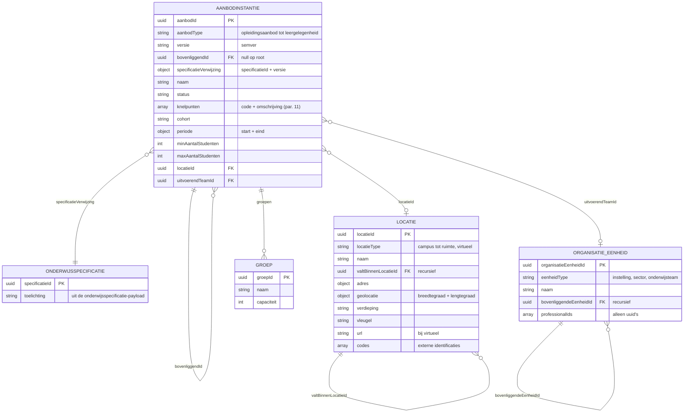

# Onderwijsaanbod als JSON-payload

Context: de instantie van het nieuw gecreëerde onderwijsaanbod, die het planningssysteem (P) serveert en waarnaar het per referentie (uuid) verwijst richting de onderwijscatalogus (OC). Scenario: LR1. Niveau: alpha, waarden indicatief. Status: concept. Relateert aan: #98, #119, #105, #84.

## Inhoudsopgave

1. [Inleiding](#1-inleiding)
2. [Doel](#2-doel)
3. [Scope](#3-scope)
4. [Context](#4-context)
5. [Ontwerpkeuzes](#5-ontwerpkeuzes)
6. [Locatiemodel](#6-locatiemodel)
7. [Organisatie-inrichting](#7-organisatie-inrichting)
8. [Structuur met attributen (ERD)](#8-structuur-met-attributen-erd)
9. [Enumeraties (concept)](#9-enumeraties-concept)
10. [Uitwerking van de payload](#10-uitwerking-van-de-payload)
11. [Knelpunten: plannen als constraint satisfaction problem](#11-knelpunten-plannen-als-constraint-satisfaction-problem)
12. [Open vragen en signaleringen](#12-open-vragen-en-signaleringen)
13. [Gerelateerde uitwerkingen](#13-gerelateerde-uitwerkingen)

## 1. Inleiding

De [koppelingspecificatie OC-P&R](20260723_1156_okx-lr1-koppelingspecificatie-oc-p-en-r.md) legt vast dat het planningssysteem het onderwijsaanbod bezit en alleen de referentie (uuid) over het koppelvlak meldt. Dit document beschrijft de payload van die instantie: wat een opvrager (OC, of later R) terugkrijgt bij het ophalen van het aanbod.

De payload is volledig Nederlands en sluit zo sterk mogelijk aan op het semantisch kader (ankertabel, aanbod-kolom). De OEAPI-binding volgt later in het profiel; hier bewust geen OEAPI-termen.

## 2. Doel

- Een eerste, toetsbare JSON-vorm van het onderwijsaanbod voor LR1.
- Locatie en organisatie-inrichting als expliciete, platte structuren met verwijzingen.
- De knelpuntcodes van het planproces een eerste vorm geven (signalering).

## 3. Scope

- Aanbod op planniveau: periodes, locaties, groepen, uitvoerend team. Roosterniveau (dag en tijdstip, lokaaltoewijzing per les) is van het roostersysteem en valt buiten dit document.
- LR1 uitgewerkt; LR2 en LR3 als delta.
- Personen: alleen verwijzingen (uuid), geen persoonsgegevens (dataminimalisatie).

## 4. Context

Ankertabel, aanbod-kolom. Elke aanbod-instantie instantieert precies één onderwijsspecificatie:

| Aanbodniveau (`aanbodType`) | Instantieert (specificatie) |
|---|---|
| `opleidingsaanbod` | `opleidingsspecificatie` |
| `opleidingsprogramma-aanbod` | `opleidingsprogrammaspecificatie` |
| `onderwijseenheid-aanbod` | `onderwijseenheidspecificatie` |
| `leergelegenheid` | `leeronderdeelspecificatie` |

De verwijzing gebeurt per instantie via `specificatieVerwijzing` (specificatieId + versie). Zo is altijd herleidbaar op welke versie van de specificatie de planning is gebaseerd.

## 5. Ontwerpkeuzes

- **Volledig Nederlands.** Veldnamen volgen het semantisch kader (`aanbodId`, `versie`, `studielast`-conventies uit de specificatie-payload). De OEAPI-binding is een aparte stap.
- **Plat met verwijzingen.** Alles wordt modulair en moet veel scenario's passen. Daarom platte lijsten (`aanbodInstanties`, `locaties`, `organisatieEenheden`) en relaties via id-verwijzingen (foreign keys): `bovenliggendId`, `locatieId`, `uitvoerendTeamId`, `valtBinnenLocatieId`, `bovenliggendeEenheidId`. Geen geneste subbomen.
- **Zelfde mechaniek als de specificatie-payload.** Uuid's, `versie` (semver), identiteit los van versie, recursie via `bovenliggendId`.
- **Status en knelpunten op de instantie.** De uitkomst van het planproces (gelukt, niet realiseerbaar) leeft op de aanbod-instantie zelf, met knelpuntcodes (§11).
- **Groepen als koppeling.** Een groep hangt aan een `leergelegenheid` of `onderwijseenheid-aanbod` en maakt de combinatie specificatie, locatie en periode herkenbaar (#84 R4).

## 6. Locatiemodel

Geïnspireerd op het OEAPI-voorstel voor betere locatie-ondersteuning (issue [open-education-api/specification#635](https://github.com/open-education-api/specification/issues/635)), hier uitgedrukt in het eigen semantisch kader:

- **Eén locatietype voor elke korrelgrootte.** Eén object `locatie` met een `locatieType`: van campus tot ruimte, en ook virtueel. Geen aparte modellen per niveau.
- **Recursieve plaatsing via verwijzing.** `valtBinnenLocatieId` drukt de ruimtelijke hiërarchie uit (ruimte valt binnen gebouw, gebouw binnen vestiging, vestiging binnen campus), plat vastgelegd, net als de rest van de payload.
- **Adres en geopunt naast elkaar.** Een locatie kan een adres dragen (straat, plaats) en onafhankelijk daarvan een geografisch punt (breedtegraad, lengtegraad).
- **Virtuele locaties zijn volwaardig.** Een online leeromgeving of videoles krijgt `locatieType: virtueel` met een `url`.
- **Codes voor herkenbaarheid.** `codes` draagt externe identificaties (bv. een vestigingscode). Of hier een landelijke locatietabel voor nodig is, is de open vraag uit #84 (vraag 2).

## 7. Organisatie-inrichting

Het aanbod wordt uitgevoerd door de organisatie. Het organogram uit het OKx OEAPI consumer-profiel dient als indicatie: instelling, daarbinnen sectoren of colleges, daarbinnen onderwijsteams met professionals.

- `organisatieEenheden` is een platte lijst met `eenheidType` en `bovenliggendeEenheidId` (zelfde recursiepatroon).
- Een aanbod-instantie verwijst via `uitvoerendTeamId` naar het onderwijsteam dat het aanbod draagt.
- Professionals hangen aan het team als `professionalIds` (alleen uuid's). Inzet, beschikbaarheid en competenties leven in het plan-van-inzet-systeem (HRM), buiten deze koppeling. Persoonsgegevens horen niet in deze payload.

## 8. Structuur met attributen (ERD)



## 9. Enumeraties (concept)

| Veld | Toegestane waarden |
|---|---|
| `aanbodType` | `opleidingsaanbod`, `opleidingsprogramma-aanbod`, `onderwijseenheid-aanbod`, `leergelegenheid` |
| `status` | `inPlanning`, `gepland`, `nietRealiseerbaar`, `geannuleerd` |
| `locatieType` | `campus`, `vestiging`, `gebouw`, `ruimte`, `balie`, `adres`, `geopunt`, `virtueel` |
| `eenheidType` | `instelling`, `sector`, `college`, `afdeling`, `onderwijsteam` (open) |
| `knelpunten[].code` | zie §11 |
| `versie` | semver `MAJOR.MINOR.PATCH` |

## 10. Uitwerking van de payload

LR1, indicatief. De `specificatieVerwijzing`-uuid's komen uit de [onderwijsspecificatie-payload](../gedeeld/20260717_1120_okx-lr1-onderwijsspecificatie-payload-json.md).

```json
{
  "aanbodInstanties": [
    {
      "aanbodId": "7aa6609f-1d1b-471a-a0f8-beae490d31b5",
      "aanbodType": "opleidingsaanbod",
      "versie": "0.1.0",
      "bovenliggendId": null,
      "specificatieVerwijzing": { "specificatieId": "79736830-1c5c-470f-b2c2-005029c96733", "versie": "0.1.0" },
      "naam": "Apothekersassistent, cohort 2026",
      "status": "gepland",
      "knelpunten": [],
      "cohort": "2026",
      "periode": { "start": "2026-09-01", "eind": "2029-07-15" },
      "uitvoerendTeamId": "d9561371-5ece-482d-a675-a076e63f980f"
    },
    {
      "aanbodId": "8c494250-b67a-4666-a762-6f9ec1e70aff",
      "aanbodType": "opleidingsprogramma-aanbod",
      "versie": "0.1.0",
      "bovenliggendId": "7aa6609f-1d1b-471a-a0f8-beae490d31b5",
      "specificatieVerwijzing": { "specificatieId": "7ae25c1e-ee27-43a2-a001-761ee39ea5c7", "versie": "0.1.0" },
      "naam": "Regulier BOL, cohort 2026",
      "status": "gepland",
      "minAantalStudenten": 18,
      "maxAantalStudenten": 120,
      "periode": { "start": "2026-09-01", "eind": "2029-07-15" },
      "uitvoerendTeamId": "d9561371-5ece-482d-a675-a076e63f980f"
    },
    {
      "aanbodId": "04af26e6-96be-480a-8413-87a128164681",
      "aanbodType": "onderwijseenheid-aanbod",
      "versie": "0.1.0",
      "bovenliggendId": "8c494250-b67a-4666-a762-6f9ec1e70aff",
      "specificatieVerwijzing": { "specificatieId": "402c2342-d897-4df4-a667-7fc5bd930944", "versie": "0.1.0" },
      "naam": "Biedt farmaceutische patiëntenzorg, leerjaar 1-2",
      "status": "gepland",
      "periode": { "start": "2026-09-01", "eind": "2028-07-15" },
      "locatieId": "59807057-a6f1-473b-9084-114644557a68"
    },
    {
      "aanbodId": "04070a96-01e0-4958-9f7e-69b429c72eec",
      "aanbodType": "leergelegenheid",
      "versie": "0.1.0",
      "bovenliggendId": "04af26e6-96be-480a-8413-87a128164681",
      "specificatieVerwijzing": { "specificatieId": "327c8263-3516-4b5a-8d57-c16241ec008d", "versie": "0.1.0" },
      "naam": "Neemt de zorg-/adviesvraag in behandeling, periode 1",
      "status": "gepland",
      "periode": { "start": "2026-09-01", "eind": "2026-11-13" },
      "locatieId": "cfe4ae31-d8d1-40f8-9d62-eda917fefbd3",
      "uitvoerendTeamId": "d9561371-5ece-482d-a675-a076e63f980f",
      "groepen": [
        { "groepId": "13cc9125-6f0d-4faf-b483-9f0e4102790e", "naam": "APO26-1A", "capaciteit": 30 },
        { "groepId": "93937bfe-4e4a-4f6a-9d5b-2754613aa2df", "naam": "APO26-1B", "capaciteit": 30 }
      ]
    },
    {
      "aanbodId": "d18dd9d1-24f2-43c0-b6aa-0090953ac965",
      "aanbodType": "onderwijseenheid-aanbod",
      "versie": "0.1.0",
      "bovenliggendId": "8c494250-b67a-4666-a762-6f9ec1e70aff",
      "specificatieVerwijzing": { "specificatieId": "ecf4a1ce-8fe4-4ed2-82d4-6c743862094e", "versie": "0.1.0" },
      "naam": "Keuzedeel Ruimtelijk inzicht, periode 3, Utrecht",
      "status": "gepland",
      "periode": { "start": "2027-02-01", "eind": "2027-04-16" },
      "locatieId": "59807057-a6f1-473b-9084-114644557a68",
      "uitvoerendTeamId": "d9561371-5ece-482d-a675-a076e63f980f",
      "groepen": [
        { "groepId": "9c6dac69-845a-49d8-b3a5-f7a07cfbee5a", "naam": "KD-RI-27-P3-UTR", "capaciteit": 25 }
      ]
    }
  ],
  "locaties": [
    {
      "locatieId": "6293d6a9-51b4-4983-b652-11d784a32aa9",
      "locatieType": "campus",
      "naam": "Campus Utrecht Zorg",
      "valtBinnenLocatieId": null,
      "adres": { "straat": "Zorglaan", "huisnummer": "1", "postcode": "3500 AA", "plaats": "Utrecht", "land": "NL" },
      "geolocatie": { "breedtegraad": 52.0907, "lengtegraad": 5.1214 }
    },
    {
      "locatieId": "59807057-a6f1-473b-9084-114644557a68",
      "locatieType": "vestiging",
      "naam": "Hoofdlocatie Utrecht",
      "valtBinnenLocatieId": "6293d6a9-51b4-4983-b652-11d784a32aa9",
      "codes": [ { "codeType": "vestigingscode", "code": "UTR-01" } ]
    },
    {
      "locatieId": "cfe4ae31-d8d1-40f8-9d62-eda917fefbd3",
      "locatieType": "ruimte",
      "naam": "Praktijklokaal farmacie 2.14",
      "valtBinnenLocatieId": "59807057-a6f1-473b-9084-114644557a68",
      "verdieping": "2",
      "vleugel": "B"
    },
    {
      "locatieId": "7ea1af8f-fbac-4fac-891b-8cb7d85af376",
      "locatieType": "virtueel",
      "naam": "Online leeromgeving",
      "valtBinnenLocatieId": null,
      "url": "https://leren.instelling.nl"
    }
  ],
  "organisatieEenheden": [
    {
      "organisatieEenheidId": "2f1bd932-e862-4b27-9dec-cc1245c1c1c2",
      "eenheidType": "instelling",
      "naam": "ROC Voorbeeld",
      "bovenliggendeEenheidId": null
    },
    {
      "organisatieEenheidId": "2b76d57f-ab53-4e37-b40a-80d15bc77bc5",
      "eenheidType": "sector",
      "naam": "Sector Zorg en Welzijn",
      "bovenliggendeEenheidId": "2f1bd932-e862-4b27-9dec-cc1245c1c1c2"
    },
    {
      "organisatieEenheidId": "d9561371-5ece-482d-a675-a076e63f980f",
      "eenheidType": "onderwijsteam",
      "naam": "Onderwijsteam Farmacie",
      "bovenliggendeEenheidId": "2b76d57f-ab53-4e37-b40a-80d15bc77bc5",
      "professionalIds": ["a821c012-0ed7-4a40-9866-bfac43749342", "51842a28-426b-4edb-b028-1ef7298c4fa2"]
    }
  ]
}
```

Faalvorm (koppelingspecificatie 7.3): bij "niet gelukt" bestaat de instantie wel, met status en knelpunten:

```json
{
  "aanbodId": "7aa6609f-1d1b-471a-a0f8-beae490d31b5",
  "aanbodType": "opleidingsaanbod",
  "versie": "0.1.0",
  "bovenliggendId": null,
  "specificatieVerwijzing": { "specificatieId": "79736830-1c5c-470f-b2c2-005029c96733", "versie": "0.1.0" },
  "status": "nietRealiseerbaar",
  "knelpunten": [
    { "code": "expertiseTekort", "omschrijving": "Geen docent beschikbaar met expertiseprofiel farmaceutische zorg voor 4 parallelle groepen.", "betrokkenSpecificatieIds": ["402c2342-d897-4df4-a667-7fc5bd930944"] }
  ]
}
```

## 11. Knelpunten: plannen als constraint satisfaction problem

Plannen is op te vatten als een constraint satisfaction problem (CSP): variabelen (leergelegenheden maal periodes maal middelen) krijgen een waarde binnen randvoorwaarden (constraints) uit de specificatie (studielast, tijdsverdeling, voorwaarden vooraf, keuzeregels), de organisatie (teamcapaciteit, expertise), de infrastructuur (ruimtetypen, locaties) en de kalender (lesweken, urennorm). "Niet realiseerbaar" betekent: een of meer constraints zijn onvervulbaar. De knelpuntcode benoemt de geschonden constraint-categorie, met de betrokken specificaties erbij.

Eerste aanzet voor de codes (concept):

| Code | Geschonden constraint | Voorbeeld |
|---|---|---|
| `capaciteitTekort` | Inzetbare uren van team of professionals | 4 groepen vragen 960 contacturen, 666 beschikbaar |
| `expertiseTekort` | Vereist expertiseprofiel ontbreekt | Geen docent met profiel farmaceutische zorg |
| `ruimteTekort` | Ruimtetype of ruimtecapaciteit ontoereikend | Geen praktijklokaal beschikbaar in de periode |
| `locatieConflict` | Zelfde ruimte gelijktijdig dubbel nodig | Twee opleidingen claimen lokaal 2.14 in dezelfde weken |
| `volgordeConflict` | Voorwaarde vooraf past niet in de periodes | Wiskunde 1 en Ruimtelijk inzicht passen niet na elkaar binnen het jaar |
| `regelConflict` | Keuzeregels (regelset) onvervulbaar | De regelset sluit alle kiesbare keuzedelen uit |
| `groepsgrootteConflict` | Minimum of maximum aantal studenten | Prognose blijft onder het minimum |
| `kalenderConflict` | Urennorm of lesweken passen niet | Vereiste begeleide uren passen niet in de beschikbare weken |

**Signalering:** een volledige, genormeerde codelijst met foutmodel (structuur, ernst, herstelacties) verdient een eigen issue en uitwerking. Deze tabel is de aanzet.

## 12. Open vragen en signaleringen

- Landelijke locatietabel: is een gedeelde locatie-identificatie nodig zodat ook andere instellingen weten waar aanbod plaatsvindt (#84, vraag 2)? De `codes` op de locatie zijn de aanhaakplek.
- Organisatie-inrichting: het organogram is indicatief. Welke eenheidstypen zijn normatief, en wie is bron van de organisatiestructuur (HRM, OC, P)?
- Professionals: hier alleen uuid-verwijzingen. De koppeling met inzet en beschikbaarheid (plan-van-inzet, HRM) is een eigen koppeling.
- Knelpuntcodes: eigen issue voor de genormeerde codelijst en het foutmodel (§11).
- Roosterniveau (`lesgelegenheid`, dag en tijdstip): bij het roostersysteem, volgt in de doorwerking (koppelingspecificatie §7.5).
- OEAPI-binding van dit model (waaronder het locatiemodel op issue 635): aparte stap in het profiel.

## 13. Gerelateerde uitwerkingen

- [Koppelingspecificatie OC-P&R](20260723_1156_okx-lr1-koppelingspecificatie-oc-p-en-r.md) (interacties waarin deze payload de opvraagbare instantie is).
- [Onderwijsspecificatie-payload](../gedeeld/20260717_1120_okx-lr1-onderwijsspecificatie-payload-json.md) (de specificaties waarnaar `specificatieVerwijzing` wijst).
- [Lifecycle en versionering](../gedeeld/20260720_0832_okx-lr1-lifecycle-versionering.md) (semver, identiteit los van versie).
- OEAPI-issue [Better Location support (#635)](https://github.com/open-education-api/specification/issues/635) (inspiratie locatiemodel).
- OKx OEAPI consumer-profiel (organogram ter indicatie).
