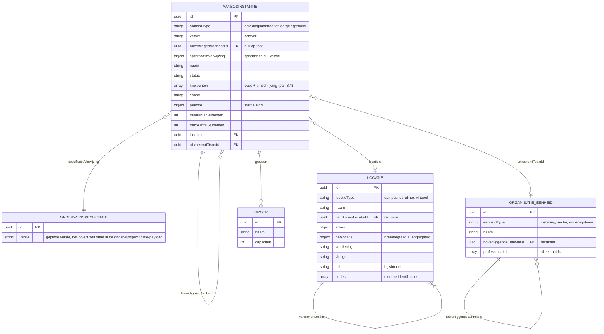

# Onderwijsaanbod als JSON-payload

Relateert aan: #98, #119, #105, #84. Waarden in het voorbeeld zijn indicatief.

## Inhoudsopgave

1. [Inleiding](#1-inleiding) (context, doel, scope)
2. [Payload](#2-payload)
   - [2.1 De vorm](#21-de-vorm)
   - [2.2 Het voorbeeld](#22-het-voorbeeld)
3. [Toelichting bij de keuzes](#3-toelichting-bij-de-keuzes)
4. [Open punten](#4-open-punten)
5. [Gerelateerde uitwerkingen](#5-gerelateerde-uitwerkingen)

## 1. Inleiding

### 1.1 Context

Het planningssysteem vertaalt een gepubliceerde onderwijsspecificatie naar **onderwijsaanbod**: wanneer wordt het onderwijs gegeven, waar, met welke groepen en door welk team. De [koppelingspecificatie onderwijscatalogus naar planning en roostering](20260723_1156_okx-lr1-koppelingspecificatie-oc-p-en-r.md) legt vast dat het planningssysteem dat aanbod bezit en alleen een referentie (uuid) over de koppeling meldt. Dit document beschrijft wat een opvrager terugkrijgt wanneer die het aanbod vervolgens ophaalt.

Het aanbod is de vierde begrippenfamilie uit de ankertabel: de specificatie zegt wat we organiseren, het aanbod zegt wanneer en met wie. Elke aanbod-instantie instantieert precies één onderwijsspecificatie en verwijst via `specificatieVerwijzing` (specificatieId plus versie) naar de exacte versie waarop de planning is gebaseerd.

| Aanbodniveau (`aanbodType`) | Instantieert (specificatie) |
|---|---|
| `opleidingsaanbod` | `opleidingsspecificatie` |
| `opleidingsprogramma-aanbod` | `opleidingsprogrammaspecificatie` |
| `onderwijseenheid-aanbod` | `onderwijseenheidspecificatie` |
| `leergelegenheid` | `leeronderdeelspecificatie` |

Scenario is leerroute 1 (regulier), persona [Jochem](../../../../docs/specificatie/okx-oeapi-consumer-profiel/doc/persona_jochem.md). Ketenoverzicht en begrippen: de [instap in de README](../README.md#context).

### 1.2 Doel

Dit document beantwoordt drie vragen:

- Welke velden draagt een aanbod-instantie, en hoe verwijst die naar de onderliggende specificatie?
- Hoe leggen we locatie en organisatie vast zonder per organisatievorm een eigen model te maken?
- Hoe meldt het planningssysteem dat een planning niet realiseerbaar is, en waarom?

Geslaagd wanneer een leverancier de payload kan bouwen en lezen zonder aanvullende uitleg, en wanneer de knelpuntcodes een planner voldoende houvast geven om te weten wat er misgaat.

De payload is indicatief en onderbouwt welke velden en operaties het koppelvlak nodig heeft; het is geen voorschrift aan de sector ([toelichting](../README.md#van-koppelingbeschrijving-naar-koppelvlakspecificatie-doelbinding)).

### 1.3 Scope

In scope is het aanbod op **planniveau**: periodes, locaties, groepen, uitvoerend team, en de uitkomst van het planproces. Uitgewerkt voor leerroute 1; leerroute 2 en 3 volgen als verschil ten opzichte daarvan.

Twee afbakeningen die anders verwarring geven:

- **Roosterniveau** (dag, tijdstip, lokaaltoewijzing per les) hoort bij het roostersysteem, niet bij dit document.
- **Personen** komen alleen als verwijzing (uuid) voor. Namen, inzet en beschikbaarheid horen in de personeelssystemen; dataminimalisatie is hier dus een ontwerpeis en geen open kwestie.

Al het overige valt buiten dit document.

## 2. Payload

Het **informatiemodel**, het **JSON Schema** en de **schemaboom** leggen samen de vorm vast: welke dingen er zijn, hoe ze samenhangen en welke velden ze dragen. De **payload** en de **instantiebomen** geven het voorbeeld, waarbij de bomen de hiërarchie zichtbaar maken die in de platte JSON verborgen blijft. De knelpuntcodes staan toegelicht in [§3.4](#34-knelpunten-plannen-als-constraint-satisfaction-problem).

### 2.1 De vorm



Het schema legt de exacte vorm vast: welke velden er zijn, welke verplicht zijn en welke waarden een veld mag dragen. Het is **alfa en indicatief** en verandert mee zolang de payload nog niet vaststaat.

```json
{
  "$schema": "https://json-schema.org/draft/2020-12/schema",
  "$id": "https://okx.npuls.nl/schema/onderwijsaanbod/alfa",
  "title": "Onderwijsaanbod",
  "$comment": "Alfa en indicatief. Deze vorm onderbouwt welke velden het koppelvlak nodig heeft en kan wijzigen zolang de payload niet is vastgesteld.",
  "type": "object",
  "required": ["aanbodInstanties"],
  "properties": {
    "aanbodInstanties": {
      "type": "array",
      "items": {
        "type": "object",
        "required": ["id", "aanbodType", "versie", "bovenliggendAanbodId", "specificatieVerwijzing", "naam", "status"],
        "properties": {
          "id": { "type": "string", "format": "uuid" },
          "aanbodType": { "enum": ["opleidingsaanbod", "opleidingsprogramma-aanbod", "onderwijseenheid-aanbod", "leergelegenheid"] },
          "versie": { "type": "string", "pattern": "^\\d+\\.\\d+\\.\\d+$" },
          "bovenliggendAanbodId": { "type": ["string", "null"], "format": "uuid" },
          "specificatieVerwijzing": {
            "type": "object",
            "required": ["specificatieId", "versie"],
            "properties": {
              "specificatieId": { "type": "string", "format": "uuid" },
              "versie": { "type": "string" }
            }
          },
          "naam": { "type": "string" },
          "status": { "enum": ["inPlanning", "gepland", "nietRealiseerbaar", "geannuleerd"] },
          "knelpunten": {
            "type": "array",
            "items": {
              "type": "object",
              "required": ["code", "omschrijving"],
              "properties": {
                "code": { "type": "string" },
                "omschrijving": { "type": "string" },
                "betrokkenSpecificatieIds": { "type": "array", "items": { "type": "string" } }
              }
            }
          },
          "cohort": { "type": "string" },
          "periode": {
            "type": "object",
            "properties": {
              "start": { "type": "string", "format": "date" },
              "eind": { "type": "string", "format": "date" }
            }
          },
          "minAantalStudenten": { "type": "integer" },
          "maxAantalStudenten": { "type": "integer" },
          "locatieId": { "type": "string", "format": "uuid" },
          "uitvoerendTeamId": { "type": "string", "format": "uuid" },
          "groepen": {
            "type": "array",
            "items": {
              "type": "object",
              "required": ["id", "naam"],
              "properties": {
                "id": { "type": "string", "format": "uuid" },
                "naam": { "type": "string" },
                "capaciteit": { "type": "integer" }
              }
            }
          }
        }
      }
    },
    "locaties": {
      "type": "array",
      "items": {
        "type": "object",
        "required": ["id", "locatieType", "naam"],
        "properties": {
          "id": { "type": "string", "format": "uuid" },
          "locatieType": { "enum": ["campus", "vestiging", "gebouw", "ruimte", "balie", "adres", "geopunt", "virtueel"] },
          "naam": { "type": "string" },
          "valtBinnenLocatieId": { "type": ["string", "null"], "format": "uuid" },
          "adres": { "type": "object" },
          "geolocatie": { "type": "object" },
          "verdieping": { "type": "string" },
          "vleugel": { "type": "string" },
          "url": { "type": "string" },
          "codes": { "type": "array", "items": { "type": "object" } }
        }
      }
    },
    "organisatieEenheden": {
      "type": "array",
      "items": {
        "type": "object",
        "required": ["id", "eenheidType", "naam"],
        "properties": {
          "id": { "type": "string", "format": "uuid" },
          "eenheidType": { "type": "string", "$comment": "open lijst: instelling, sector, college, afdeling, onderwijsteam" },
          "naam": { "type": "string" },
          "bovenliggendeEenheidId": { "type": ["string", "null"], "format": "uuid" },
          "professionalIds": { "type": "array", "items": { "type": "string", "format": "uuid" } }
        }
      }
    }
  }
}
```

Dezelfde vorm, leesbaar:

<!-- json-tree:begin kind=schema -->
```text
Onderwijsaanbod  (Alfa en indicatief. Deze vorm onderbouwt welke velden het koppelvlak nodig heeft en kan wijzigen zolang de payload niet is vastgesteld.)

{root}
+-- aanbodInstanties[]                verplicht
|   +-- id                                uuid
|   +-- aanbodType                        opleidingsaanbod | opleidingsprogramma-aanbod | onderwijseenheid-aanbod
|   |                                     leergelegenheid
|   +-- versie                            string
|   +-- bovenliggendAanbodId              string of null
|   +-- specificatieVerwijzing            verplicht, object
|   |   +-- specificatieId                    uuid
|   |   `-- versie                            string
|   +-- naam                              string
|   +-- status                            inPlanning | gepland | nietRealiseerbaar | geannuleerd
|   +-- knelpunten[]                      optioneel
|   |   +-- code                              string
|   |   +-- omschrijving                      string
|   |   `-- betrokkenSpecificatieIds[]        optioneel
|   |         (string)
|   +-- cohort                            string, optioneel
|   +-- periode                           optioneel, object
|   |   +-- start                             string, optioneel
|   |   `-- eind                              string, optioneel
|   +-- minAantalStudenten                integer, optioneel
|   +-- maxAantalStudenten                integer, optioneel
|   +-- locatieId                         uuid, optioneel
|   +-- uitvoerendTeamId                  uuid, optioneel
|   `-- groepen[]                         optioneel
|       +-- id                                uuid
|       +-- naam                              string
|       `-- capaciteit                        integer, optioneel
+-- locaties[]                        optioneel
|   +-- id                                uuid
|   +-- locatieType                       campus | vestiging | gebouw | ruimte | balie | adres | geopunt | virtueel
|   +-- naam                              string
|   +-- valtBinnenLocatieId               string of null, optioneel
|   +-- adres                             object, optioneel
|   +-- geolocatie                        object, optioneel
|   +-- verdieping                        string, optioneel
|   +-- vleugel                           string, optioneel
|   +-- url                               string, optioneel
|   `-- codes[]                           optioneel
|         (object)
`-- organisatieEenheden[]             optioneel
    +-- id                                uuid
    +-- eenheidType                       string
    +-- naam                              string
    +-- bovenliggendeEenheidId            string of null, optioneel
    `-- professionalIds[]                 optioneel
          (uuid)
```
<!-- json-tree:end -->

De knelpuntcodes staan toegelicht in [§3.4](#34-knelpunten-plannen-als-constraint-satisfaction-problem).

### 2.2 Het voorbeeld

Leerroute 1. De `specificatieVerwijzing`-uuid's komen uit de [onderwijsspecificatie-payload](../gedeeld/20260717_1120_okx-lr1-onderwijsspecificatie-payload-json.md).

```json
{
  "aanbodInstanties": [
    {
      "id": "7aa6609f-1d1b-471a-a0f8-beae490d31b5",
      "aanbodType": "opleidingsaanbod",
      "versie": "0.1.0",
      "bovenliggendAanbodId": null,
      "specificatieVerwijzing": { "specificatieId": "79736830-1c5c-470f-b2c2-005029c96733", "versie": "0.1.0" },
      "naam": "Apothekersassistent, cohort 2026",
      "status": "gepland",
      "knelpunten": [],
      "cohort": "2026",
      "periode": { "start": "2026-09-01", "eind": "2029-07-15" },
      "uitvoerendTeamId": "d9561371-5ece-482d-a675-a076e63f980f"
    },
    {
      "id": "8c494250-b67a-4666-a762-6f9ec1e70aff",
      "aanbodType": "opleidingsprogramma-aanbod",
      "versie": "0.1.0",
      "bovenliggendAanbodId": "7aa6609f-1d1b-471a-a0f8-beae490d31b5",
      "specificatieVerwijzing": { "specificatieId": "7ae25c1e-ee27-43a2-a001-761ee39ea5c7", "versie": "0.1.0" },
      "naam": "Regulier BOL, cohort 2026",
      "status": "gepland",
      "minAantalStudenten": 18,
      "maxAantalStudenten": 120,
      "periode": { "start": "2026-09-01", "eind": "2029-07-15" },
      "uitvoerendTeamId": "d9561371-5ece-482d-a675-a076e63f980f"
    },
    {
      "id": "04af26e6-96be-480a-8413-87a128164681",
      "aanbodType": "onderwijseenheid-aanbod",
      "versie": "0.1.0",
      "bovenliggendAanbodId": "8c494250-b67a-4666-a762-6f9ec1e70aff",
      "specificatieVerwijzing": { "specificatieId": "402c2342-d897-4df4-a667-7fc5bd930944", "versie": "0.1.0" },
      "naam": "Biedt farmaceutische patiëntenzorg, leerjaar 1-2",
      "status": "gepland",
      "periode": { "start": "2026-09-01", "eind": "2028-07-15" },
      "locatieId": "59807057-a6f1-473b-9084-114644557a68"
    },
    {
      "id": "04070a96-01e0-4958-9f7e-69b429c72eec",
      "aanbodType": "leergelegenheid",
      "versie": "0.1.0",
      "bovenliggendAanbodId": "04af26e6-96be-480a-8413-87a128164681",
      "specificatieVerwijzing": { "specificatieId": "327c8263-3516-4b5a-8d57-c16241ec008d", "versie": "0.1.0" },
      "naam": "Neemt de zorg-/adviesvraag in behandeling, periode 1",
      "status": "gepland",
      "periode": { "start": "2026-09-01", "eind": "2026-11-13" },
      "locatieId": "cfe4ae31-d8d1-40f8-9d62-eda917fefbd3",
      "uitvoerendTeamId": "d9561371-5ece-482d-a675-a076e63f980f",
      "groepen": [
        { "id": "13cc9125-6f0d-4faf-b483-9f0e4102790e", "naam": "APO26-1A", "capaciteit": 30 },
        { "id": "93937bfe-4e4a-4f6a-9d5b-2754613aa2df", "naam": "APO26-1B", "capaciteit": 30 }
      ]
    },
    {
      "id": "d18dd9d1-24f2-43c0-b6aa-0090953ac965",
      "aanbodType": "onderwijseenheid-aanbod",
      "versie": "0.1.0",
      "bovenliggendAanbodId": "8c494250-b67a-4666-a762-6f9ec1e70aff",
      "specificatieVerwijzing": { "specificatieId": "20f1099a-949f-40b8-b893-1aa5bfea3f4c", "versie": "0.1.0" },
      "naam": "Keuzedeel Ruimtelijk inzicht, periode 3, Utrecht",
      "status": "gepland",
      "periode": { "start": "2027-02-01", "eind": "2027-04-16" },
      "locatieId": "59807057-a6f1-473b-9084-114644557a68",
      "uitvoerendTeamId": "d9561371-5ece-482d-a675-a076e63f980f",
      "groepen": [
        { "id": "9c6dac69-845a-49d8-b3a5-f7a07cfbee5a", "naam": "KD-RI-27-P3-UTR", "capaciteit": 25 }
      ]
    }
  ],
  "locaties": [
    {
      "id": "6293d6a9-51b4-4983-b652-11d784a32aa9",
      "locatieType": "campus",
      "naam": "Campus Utrecht Zorg",
      "valtBinnenLocatieId": null,
      "adres": { "straat": "Zorglaan", "huisnummer": "1", "postcode": "3500 AA", "plaats": "Utrecht", "land": "NL" },
      "geolocatie": { "breedtegraad": 52.0907, "lengtegraad": 5.1214 }
    },
    {
      "id": "59807057-a6f1-473b-9084-114644557a68",
      "locatieType": "vestiging",
      "naam": "Hoofdlocatie Utrecht",
      "valtBinnenLocatieId": "6293d6a9-51b4-4983-b652-11d784a32aa9",
      "codes": [ { "codeType": "vestigingscode", "code": "UTR-01" } ]
    },
    {
      "id": "cfe4ae31-d8d1-40f8-9d62-eda917fefbd3",
      "locatieType": "ruimte",
      "naam": "Praktijklokaal farmacie 2.14",
      "valtBinnenLocatieId": "59807057-a6f1-473b-9084-114644557a68",
      "verdieping": "2",
      "vleugel": "B"
    },
    {
      "id": "7ea1af8f-fbac-4fac-891b-8cb7d85af376",
      "locatieType": "virtueel",
      "naam": "Online leeromgeving",
      "valtBinnenLocatieId": null,
      "url": "https://leren.instelling.nl"
    }
  ],
  "organisatieEenheden": [
    {
      "id": "2f1bd932-e862-4b27-9dec-cc1245c1c1c2",
      "eenheidType": "instelling",
      "naam": "ROC Voorbeeld",
      "bovenliggendeEenheidId": null
    },
    {
      "id": "2b76d57f-ab53-4e37-b40a-80d15bc77bc5",
      "eenheidType": "sector",
      "naam": "Sector Zorg en Welzijn",
      "bovenliggendeEenheidId": "2f1bd932-e862-4b27-9dec-cc1245c1c1c2"
    },
    {
      "id": "d9561371-5ece-482d-a675-a076e63f980f",
      "eenheidType": "onderwijsteam",
      "naam": "Onderwijsteam Farmacie",
      "bovenliggendeEenheidId": "2b76d57f-ab53-4e37-b40a-80d15bc77bc5",
      "professionalIds": ["a821c012-0ed7-4a40-9866-bfac43749342", "51842a28-426b-4edb-b028-1ef7298c4fa2"]
    }
  ]
}
```

De boom die in deze platte lijsten verborgen zit, met de verwijzingen opgelost:

<!-- json-tree:begin kind=instance array=aanbodInstanties id=id parent=bovenliggendAanbodId label=naam type=aanbodType attrs=periode,status -->
```text
aanbodInstanties  (5 objecten, 1 root, boom via bovenliggendAanbodId)

OPLEIDINGSAANBOD                                              7aa6609f
= Apothekersassistent, cohort 2026
  periode: {start: 2026-09-01, eind: 2029-07-15} | status: gepland
|
`-- OPLEIDINGSPROGRAMMA-AANBOD                                8c494250
    = Regulier BOL, cohort 2026
      periode: {start: 2026-09-01, eind: 2029-07-15} | status: gepland
    |
    +-- ONDERWIJSEENHEID-AANBOD                               04af26e6
    |   = Biedt farmaceutische patiëntenzorg, leerjaar 1-2
    |     periode: {start: 2026-09-01, eind: 2028-07-15} | status: gepland
    |   |
    |   `-- LEERGELEGENHEID                                   04070a96
    |       = Neemt de zorg-/adviesvraag in behandeling, periode 1
    |         periode: {start: 2026-09-01, eind: 2026-11-13} | status: gepland
    `-- ONDERWIJSEENHEID-AANBOD                               d18dd9d1
        = Keuzedeel Ruimtelijk inzicht, periode 3, Utrecht
          periode: {start: 2027-02-01, eind: 2027-04-16} | status: gepland
```
<!-- json-tree:end -->

<!-- json-tree:begin kind=instance array=locaties id=id parent=valtBinnenLocatieId label=naam type=locatieType -->
```text
locaties  (4 objecten, 2 roots, boom via valtBinnenLocatieId)

CAMPUS                                                        6293d6a9
= Campus Utrecht Zorg
|
`-- VESTIGING                                                 59807057
    = Hoofdlocatie Utrecht
    |
    `-- RUIMTE                                                cfe4ae31
        = Praktijklokaal farmacie 2.14

VIRTUEEL                                                      7ea1af8f
= Online leeromgeving
```
<!-- json-tree:end -->

<!-- json-tree:begin kind=instance array=organisatieEenheden id=id parent=bovenliggendeEenheidId label=naam type=eenheidType -->
```text
organisatieEenheden  (3 objecten, 1 root, boom via bovenliggendeEenheidId)

INSTELLING                                                    2f1bd932
= ROC Voorbeeld
|
`-- SECTOR                                                    2b76d57f
    = Sector Zorg en Welzijn
    |
    `-- ONDERWIJSTEAM                                         d9561371
        = Onderwijsteam Farmacie
```
<!-- json-tree:end -->

Loopt de planning vast, dan bestaat de instantie wel maar draagt die status en knelpunten. Zie het faalpad in de [koppelingspecificatie §5.3](20260723_1156_okx-lr1-koppelingspecificatie-oc-p-en-r.md):

```json
{
  "aanbodInstanties": [
    {
      "id": "7aa6609f-1d1b-471a-a0f8-beae490d31b5",
      "aanbodType": "opleidingsaanbod",
      "versie": "0.1.0",
      "bovenliggendAanbodId": null,
      "specificatieVerwijzing": { "specificatieId": "79736830-1c5c-470f-b2c2-005029c96733", "versie": "0.1.0" },
      "naam": "Apothekersassistent, cohort 2026",
      "status": "nietRealiseerbaar",
      "knelpunten": [
        { "code": "expertiseTekort", "omschrijving": "Geen docent beschikbaar met expertiseprofiel farmaceutische zorg voor 4 parallelle groepen.", "betrokkenSpecificatieIds": ["402c2342-d897-4df4-a667-7fc5bd930944"] }
      ]
    }
  ]
}
```

## 3. Toelichting bij de keuzes

### 3.1 Ontwerpkeuzes

- **Volledig Nederlands.** Veldnamen volgen het semantisch kader. De binding met de Open Onderwijs API is een aparte stap.
- **Plat met verwijzingen.** De objecten staan in platte lijsten (`aanbodInstanties`, `locaties`, `organisatieEenheden`) en de samenhang loopt via id-verwijzingen (`bovenliggendAanbodId`, `locatieId`, `uitvoerendTeamId`, `valtBinnenLocatieId`, `bovenliggendeEenheidId`) in plaats van via fysieke nesting. Dat maakt elk object los adresseerbaar en los te versioneren, en voorkomt dat je een halve boom moet meesturen om één les te wijzigen. De prijs is dat de hiërarchie niet meer uit de JSON zelf blijkt; daarom staat er een instantieboom bij.
- **Zelfde mechaniek als de specificatie-payload.** Uuid's, `versie` (semver), identiteit los van versie, en dezelfde recursie via een ouder-verwijzing.
- **Status en knelpunten op de instantie.** De uitkomst van het planproces leeft op de aanbod-instantie zelf, met knelpuntcodes (§3.4).
- **Groepen als koppeling.** Een groep hangt aan een `leergelegenheid` of `onderwijseenheid-aanbod` en maakt de combinatie specificatie, locatie en periode herkenbaar (#84 R4).

### 3.2 Locatiemodel

Geïnspireerd op het voorstel voor betere locatie-ondersteuning in de Open Onderwijs API ([issue 635](https://github.com/open-education-api/specification/issues/635)), hier uitgedrukt in het eigen semantisch kader:

- **Eén locatietype voor elke korrelgrootte.** Eén object `locatie` met een `locatieType`: van campus tot ruimte, en ook virtueel. Geen apart model per niveau.
- **Recursieve plaatsing via verwijzing.** `valtBinnenLocatieId` drukt de ruimtelijke hiërarchie uit: ruimte binnen gebouw, gebouw binnen vestiging, vestiging binnen campus.
- **Adres en geopunt naast elkaar.** Een locatie kan een adres dragen en daarnaast, onafhankelijk, een geografisch punt.
- **Virtuele locaties zijn volwaardig.** Een online leeromgeving of videoles krijgt `locatieType: virtueel` met een `url`.
- **Codes voor herkenbaarheid.** `codes` draagt externe identificaties, bijvoorbeeld een vestigingscode.

### 3.3 Organisatie-inrichting

Een aanbod wordt uitgevoerd door een team, en planning heeft dat team nodig om te weten of het aanbod haalbaar is. Daarom draagt de payload een minimale organisatiestructuur, met het organogram uit het OEAPI consumer-profiel als indicatie: instelling, daarbinnen sectoren of colleges, daarbinnen onderwijsteams.

- `organisatieEenheden` is een platte lijst met `eenheidType` en `bovenliggendeEenheidId`, hetzelfde recursiepatroon als de rest.
- Een aanbod-instantie verwijst via `uitvoerendTeamId` naar het team dat het aanbod draagt.
- Professionals hangen aan het team als `professionalIds`, alleen uuid's. Inzet, beschikbaarheid en competenties leven in het plan-van-inzetsysteem, buiten deze koppeling.

### 3.4 Knelpunten: plannen als constraint satisfaction problem

Plannen is op te vatten als een constraint satisfaction problem (CSP): variabelen (leergelegenheden maal periodes maal middelen) krijgen een waarde binnen randvoorwaarden (constraints) uit de specificatie (studielast, tijdsverdeling, voorwaarden vooraf, keuzeregels), de organisatie (teamcapaciteit, expertise), de infrastructuur (ruimtetypen, locaties) en de kalender (lesweken, urennorm). "Niet realiseerbaar" betekent: een of meer constraints zijn onvervulbaar. De knelpuntcode benoemt de geschonden constraint-categorie, met de betrokken specificaties erbij.

Eerste aanzet voor de codes (concept):

| Code | Geschonden constraint | Voorbeeld |
|---|---|---|
| `capaciteitTekort` | Inzetbare uren van team of professionals | 4 groepen vragen 960 contacturen, 666 beschikbaar |
| `expertiseTekort` | Vereist expertiseprofiel ontbreekt | Geen docent met profiel farmaceutische zorg |
| `ruimteTekort` | Ruimtetype of ruimtecapaciteit ontoereikend | Geen praktijklokaal beschikbaar in de periode |
| `locatieConflict` | Zelfde ruimte gelijktijdig dubbel nodig | Twee opleidingen claimen lokaal 2.14 in dezelfde weken |
| `volgordeConflict` | Voorwaarde vooraf past niet in de periodes | Wiskunde 1 en Ruimtelijk inzicht passen niet na elkaar binnen het jaar |
| `regelConflict` | Keuzeregels (regelset) onvervulbaar | De regelset sluit alle kiesbare keuzedelen uit |
| `groepsgrootteConflict` | Minimum of maximum aantal studenten | Prognose blijft onder het minimum |
| `kalenderConflict` | Urennorm of lesweken passen niet | Vereiste begeleide uren passen niet in de beschikbare weken |

Deze tabel is een aanzet; de genormeerde codelijst met foutmodel (structuur, ernst, herstelacties) staat als open punt in §4.

## 4. Open punten

| Vraag | Vervolgstap |
|---|---|
| Is een landelijke locatie-identificatie nodig, zodat instellingen onderling weten waar aanbod plaatsvindt? | Uitzoeken bij de vervolgvraag uit #84; `codes` op de locatie is de aanhaakplek. |
| Welke `eenheidType`-waarden zijn normatief, en wie is bron van de organisatiestructuur? | Voorleggen aan de instellingen bij de stakeholderreview van de koppelingspecificatie. |
| Hoe koppelen inzet en beschikbaarheid van professionals aan dit aanbod? | Eigen koppeling met het plan-van-inzetsysteem; buiten deze payload. |
| Welke knelpuntcodes zijn genormeerd, en welk foutmodel hoort erbij? | Eigen issue aanmaken met codelijst, ernstniveaus en herstelacties. |
| Hoe ziet het roosterniveau (`lesgelegenheid`, dag en tijdstip) eruit? | Volgt bij de uitwerking van de koppeling met het roostersysteem. |
| Hoe bindt dit model aan de Open Onderwijs API, inclusief het locatiemodel? | Aparte stap in het consumer-profiel. |

## 5. Gerelateerde uitwerkingen

- [Koppelingspecificatie onderwijscatalogus naar planning en roostering](20260723_1156_okx-lr1-koppelingspecificatie-oc-p-en-r.md): de interacties waarin deze payload de opvraagbare instantie is.
- [Onderwijsspecificatie-payload](../gedeeld/20260717_1120_okx-lr1-onderwijsspecificatie-payload-json.md): de specificaties waarnaar `specificatieVerwijzing` wijst.
- [Lifecycle en versionering](../gedeeld/20260720_0832_okx-lr1-lifecycle-versionering.md): semver en identiteit los van versie.
- [Open Onderwijs API, issue 635](https://github.com/open-education-api/specification/issues/635): inspiratie voor het locatiemodel.
- [OKx OEAPI consumer-profiel](../../../../docs/specificatie/okx-oeapi-consumer-profiel/README.md): organogram ter indicatie.
