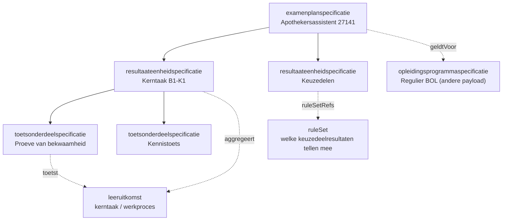
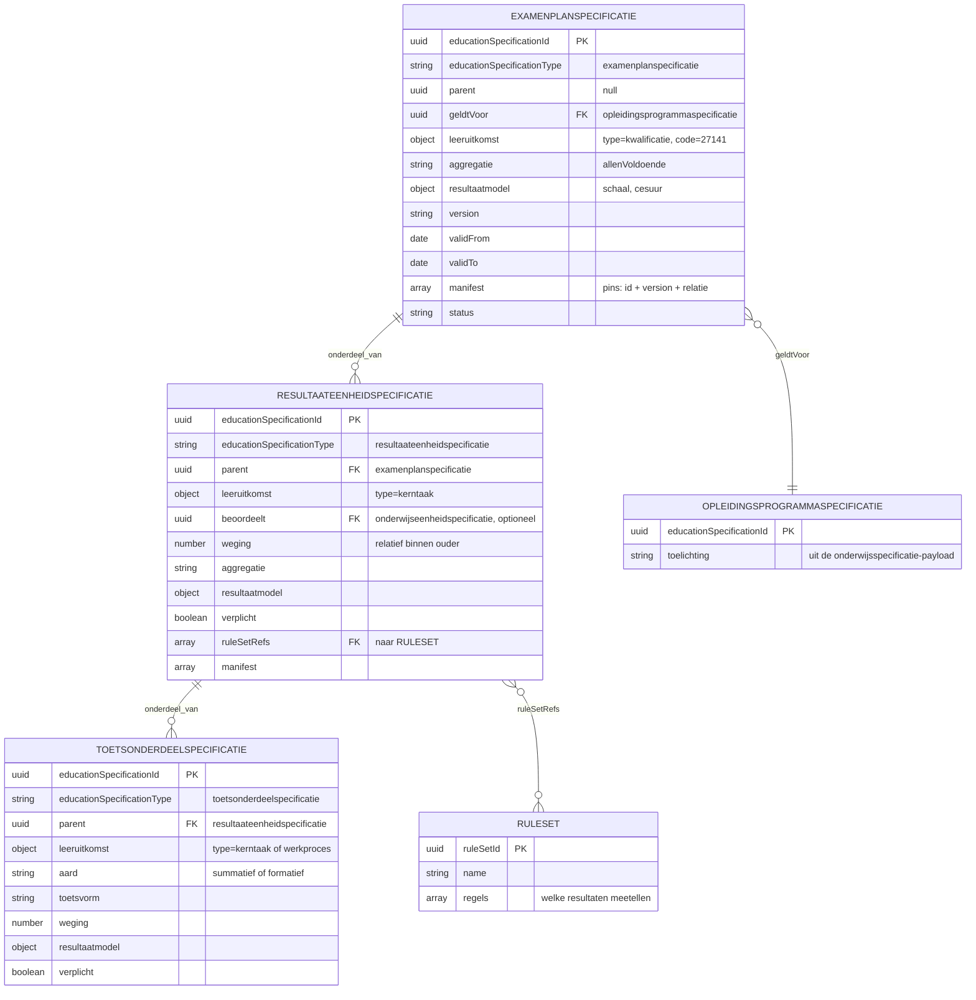

# Resultaatstructuur en examenplan als JSON-payload

Context: parallelle uitwerking bij de [onderwijsspecificatie-payload](20260717_1120_okx-lr1-onderwijsspecificatie-payload-json.md). Scenario: LR1 (Apothekersassistent, kwalificatie 27141). Niveau: concept-payload. Status: concept. Relateert aan: #119, #110, #105, #84.

## Inhoudsopgave

1. [Inleiding](#1-inleiding)
2. [Doel](#2-doel)
3. [Scope](#3-scope)
4. [Context](#4-context)
5. [Voorstel: hoe drukken we de resultaatstructuur uit in JSON?](#5-voorstel-hoe-drukken-we-de-resultaatstructuur-uit-in-json)
6. [Enumeraties (concept)](#6-enumeraties-concept)
7. [Uitwerking van de payload](#7-uitwerking-van-de-payload)
8. [Lifecycle](#8-lifecycle)
9. [Open vragen en signaleringen](#9-open-vragen-en-signaleringen)
10. [Gerelateerde uitwerkingen](#10-gerelateerde-uitwerkingen)

## 1. Inleiding

De onderwijsspecificatie beschrijft wat een student leert. De resultaatstructuur beschrijft hoe dat wordt getoetst en gewogen richting het diploma. Beide zijn aparte bomen die via **leeruitkomsten** aan elkaar hangen.

De `examenplanspecificatie` (OER) is de wortel van die tweede boom. Aanleiding is de memo **"Onderwijs PDCA-cyclus" van Niels** (PR #110): het examenplan heeft het zwaarste uitgangspunt omdat het een contractuele afspraak met de student is, en beschrijft de summatieve resultaatstructuur met scope, relatie tot kerntaken, wegingen en formules.

## 2. Doel

- Een eerste, toetsbare JSON-vorm van de resultaatstructuur voor LR1.
- Dezelfde mechaniek als de onderwijsspecificatie-payload, zodat beide bomen één familie vormen.
- Invoer voor de berichtspecificatie (AMIGO-stap 5) en het OEAPI-profiel.

Buiten scope: uitvoering en beoordeling (afname, behaalde resultaten, examendossier). Dat is het OKE-domein.

## 3. Scope

- LR1 uitgewerkt, gekoppeld aan de `opleidingsprogrammaspecificatie` Regulier BOL uit de onderwijsspecificatie-payload. LR2 en LR3 volgen als delta.
- Beroepsgerichte kerntaken. Generieke onderdelen (taal, rekenen, burgerschap, Engels) vallen buiten deze payload.
- Waarden zijn indicatief; het echte examenplan wordt door de instelling vastgesteld.

## 4. Context

De resultaatstructuur gebruikt dezelfde specificatiefamilie als de onderwijsspecificatie. Drie typen:

| Conceptniveau (`educationSpecificationType`) | Rol | OEAPI-mapping (indicatief) |
|---|---|---|
| `examenplanspecificatie` | Wortel (OER). Scope, aggregatie richting diploma | (geen 1:1 OEAPI-object) |
| `resultaateenheidspecificatie` | Groepering, meestal per kerntaak. Draagt weging en aggregatie | (geen 1:1 OEAPI-object) |
| `toetsonderdeelspecificatie` | Blad. Het concrete toets- of examenonderdeel | TestComponent |

Koppeling met de onderwijsspecificatie:

- Semantisch via `leeruitkomst` (`kerntaak`, `werkproces`), dezelfde verankering als in de onderwijsspecificatie-payload.
- Administratief via `geldtVoor` (de `opleidingsprogrammaspecificatie` waarvoor het examenplan geldt) en optioneel `beoordeelt` (directe verwijzing naar de beoordeelde specificatie).



## 5. Voorstel: hoe drukken we de resultaatstructuur uit in JSON?

Zelfde ontwerpkeuze als de onderwijsspecificatie-payload (optie C: recursief plat met `parent`). Concreet:

- **Eén familie.** De resultaatstructuur gebruikt dezelfde envelope (`educationSpecifications`, `ruleSets`), dezelfde velden (`educationSpecificationId`, `educationSpecificationType`, `parent`, `version`, `status`, `validFrom`/`validTo`, `manifest`, `leeruitkomst`) en dezelfde discriminator. Alleen de typewaarden verschillen.
- **Weging bovenin, niet in het blad.** Een `resultaateenheidspecificatie` draagt `aggregatie` (hoe onderliggende resultaten samenkomen) en haar eigen `weging` binnen de ouder. Zo staat de rekenregel op het niveau waar hij geldt.
- **Aard expliciet.** `aard` onderscheidt `summatief` (telt mee voor het diploma) van `formatief` (ontwikkelingsgericht, weging 0).
- **Resultaatmodel per niveau.** `resultaatmodel` legt schaal, cesuur en afronding vast, zodat elk systeem dezelfde uitkomst berekent.
- **Regels los van de specificatie.** Dynamische delen (bijvoorbeeld welke keuzedeelresultaten meetellen) staan in een `ruleSet`, niet in de specificatie. Zelfde principe als #84 en #120. Dit maakt de modulaire resultaatstructuur mogelijk die de memo van Niels vraagt: keuzes kunnen worden ingevuld met onderdelen die nog niet bestonden toen het examenplan werd vastgesteld.
- **Manifest.** Elke specificatie met onderdelen pint de versies daarvan, inclusief de kruisverwijzing naar de `opleidingsprogrammaspecificatie` (`relatie: referentie`).

## 6. Enumeraties (concept)

Concept en te bevestigen. Velden die identiek zijn aan de onderwijsspecificatie-payload (`status`, `version`, `validFrom`/`validTo`, `manifest[].relatie`, `leeruitkomst.type`) staan daar en worden hier niet herhaald.

| Veld | Toegestane waarden |
|---|---|
| `educationSpecificationType` | `examenplanspecificatie`, `resultaateenheidspecificatie`, `toetsonderdeelspecificatie` |
| `aard` | `summatief`, `formatief` |
| `aggregatie` | `gewogenGemiddelde`, `som`, `allenVoldoende`, `minimaalAantal` |
| `resultaatmodel.schaal` | `cijfer-1-10`, `voldoende-onvoldoende`, `punten` (open) |
| `toetsvorm` | `proeveVanBekwaamheid`, `kennistoets`, `praktijkopdracht`, `portfolio`, `criteriumgesprek` (open) |
| `weging` | getal, relatief binnen de ouder. `0` bij formatief |
| `verplicht` | `true`, `false` |

## 7. Uitwerking van de payload

LR1, indicatief. Uuid's van de onderwijsspecificatie-payload worden hergebruikt waar naar die boom wordt verwezen.

### 7.1 Structuur met attributen (ERD)



### 7.2 Payload (JSON)

```json
{
  "educationSpecifications": [
    {
      "educationSpecificationId": "08b4656d-27ec-4175-8c1b-1f1d51780785",
      "educationSpecificationType": "examenplanspecificatie",
      "version": "0.1.0",
      "parent": null,
      "geldtVoor": "7ae25c1e-ee27-43a2-a001-761ee39ea5c7",
      "leeruitkomst": { "type": "kwalificatie", "code": "27141" },
      "name": "Examenplan Apothekersassistent",
      "description": "Summatieve resultaatstructuur voor de kwalificatie 27141, leerweg BOL, doelgroep regulier.",
      "aggregatie": "allenVoldoende",
      "resultaatmodel": { "schaal": "voldoende-onvoldoende" },
      "status": "concept",
      "validFrom": "2026-09-01",
      "validTo": null,
      "manifest": [
        { "educationSpecificationId": "7ae25c1e-ee27-43a2-a001-761ee39ea5c7", "version": "0.1.0", "relatie": "referentie" },
        { "educationSpecificationId": "0512c773-9c1b-42c4-ae0d-9af8554f2462", "version": "0.1.0", "relatie": "onderdeel" },
        { "educationSpecificationId": "aa15c5d9-133e-4976-9154-d2f6f9e7ad7c", "version": "0.1.0", "relatie": "onderdeel" },
        { "educationSpecificationId": "3c248e38-504c-4505-b0b8-d860d7b14919", "version": "0.1.0", "relatie": "onderdeel" },
        { "educationSpecificationId": "df0d3e50-c7c3-416e-b694-12fe5791eb7c", "version": "0.1.0", "relatie": "onderdeel" }
      ]
    },
    {
      "educationSpecificationId": "0512c773-9c1b-42c4-ae0d-9af8554f2462",
      "educationSpecificationType": "resultaateenheidspecificatie",
      "version": "0.1.0",
      "parent": "08b4656d-27ec-4175-8c1b-1f1d51780785",
      "leeruitkomst": { "type": "kerntaak", "code": "B1-K1" },
      "beoordeelt": "402c2342-d897-4df4-a667-7fc5bd930944",
      "name": "Resultaat kerntaak B1-K1, biedt farmaceutische patientenzorg",
      "weging": 1,
      "aggregatie": "gewogenGemiddelde",
      "resultaatmodel": { "schaal": "cijfer-1-10", "cesuur": 5.5, "decimalen": 1 },
      "verplicht": true,
      "status": "concept",
      "manifest": [
        { "educationSpecificationId": "941f180d-b0af-4933-a580-6ab654dfadda", "version": "0.1.0", "relatie": "onderdeel" },
        { "educationSpecificationId": "b5dcc33e-681f-4c7e-ab9a-f65c745c855c", "version": "0.1.0", "relatie": "onderdeel" },
        { "educationSpecificationId": "f004ba43-1e0b-4b8f-a677-0644ce29f4ea", "version": "0.1.0", "relatie": "onderdeel" }
      ]
    },
    {
      "educationSpecificationId": "aa15c5d9-133e-4976-9154-d2f6f9e7ad7c",
      "educationSpecificationType": "resultaateenheidspecificatie",
      "version": "0.1.0",
      "parent": "08b4656d-27ec-4175-8c1b-1f1d51780785",
      "leeruitkomst": { "type": "kerntaak", "code": "B1-K2" },
      "beoordeelt": "aa0a8af1-d383-4981-8a0f-6ec2ba4e6283",
      "name": "Resultaat kerntaak B1-K2, voert logistieke taken uit in de apotheek",
      "weging": 1,
      "aggregatie": "gewogenGemiddelde",
      "resultaatmodel": { "schaal": "cijfer-1-10", "cesuur": 5.5, "decimalen": 1 },
      "verplicht": true,
      "status": "concept",
      "manifest": [
        { "educationSpecificationId": "a1215600-e8c2-4fda-b3a5-be6adb433b71", "version": "0.1.0", "relatie": "onderdeel" }
      ]
    },
    {
      "educationSpecificationId": "3c248e38-504c-4505-b0b8-d860d7b14919",
      "educationSpecificationType": "resultaateenheidspecificatie",
      "version": "0.1.0",
      "parent": "08b4656d-27ec-4175-8c1b-1f1d51780785",
      "leeruitkomst": { "type": "kerntaak", "code": "B1-K3" },
      "beoordeelt": "f686a286-d555-4eda-bd22-001c5b60e4dc",
      "name": "Resultaat kerntaak B1-K3, werkt mee aan kwaliteit en deskundigheid",
      "weging": 1,
      "aggregatie": "gewogenGemiddelde",
      "resultaatmodel": { "schaal": "cijfer-1-10", "cesuur": 5.5, "decimalen": 1 },
      "verplicht": true,
      "status": "concept",
      "manifest": [
        { "educationSpecificationId": "7fb3ffd3-621f-4d21-aec2-a1a2e58b7449", "version": "0.1.0", "relatie": "onderdeel" }
      ]
    },
    {
      "educationSpecificationId": "df0d3e50-c7c3-416e-b694-12fe5791eb7c",
      "educationSpecificationType": "resultaateenheidspecificatie",
      "version": "0.1.0",
      "parent": "08b4656d-27ec-4175-8c1b-1f1d51780785",
      "beoordeelt": "fb5be5ae-faa0-4b4b-8085-474fce9aae08",
      "name": "Resultaat keuzedelen",
      "description": "Welke keuzedeelresultaten meetellen staat in de ruleset, niet in deze specificatie.",
      "weging": 1,
      "aggregatie": "minimaalAantal",
      "resultaatmodel": { "schaal": "voldoende-onvoldoende" },
      "verplicht": true,
      "status": "concept",
      "ruleSetRefs": ["132f165a-973c-41c2-98df-e58d4ca6d7eb"]
    },
    {
      "educationSpecificationId": "941f180d-b0af-4933-a580-6ab654dfadda",
      "educationSpecificationType": "toetsonderdeelspecificatie",
      "version": "0.1.0",
      "parent": "0512c773-9c1b-42c4-ae0d-9af8554f2462",
      "leeruitkomst": { "type": "kerntaak", "code": "B1-K1" },
      "name": "Proeve van bekwaamheid farmaceutische patientenzorg",
      "aard": "summatief",
      "toetsvorm": "proeveVanBekwaamheid",
      "weging": 2,
      "resultaatmodel": { "schaal": "cijfer-1-10", "cesuur": 5.5, "decimalen": 1 },
      "verplicht": true,
      "status": "concept"
    },
    {
      "educationSpecificationId": "b5dcc33e-681f-4c7e-ab9a-f65c745c855c",
      "educationSpecificationType": "toetsonderdeelspecificatie",
      "version": "0.1.0",
      "parent": "0512c773-9c1b-42c4-ae0d-9af8554f2462",
      "leeruitkomst": { "type": "werkproces", "code": "B1-K1-W2" },
      "name": "Kennistoets medicatiebewaking",
      "aard": "summatief",
      "toetsvorm": "kennistoets",
      "weging": 1,
      "resultaatmodel": { "schaal": "cijfer-1-10", "cesuur": 5.5, "decimalen": 1 },
      "verplicht": true,
      "status": "concept"
    },
    {
      "educationSpecificationId": "f004ba43-1e0b-4b8f-a677-0644ce29f4ea",
      "educationSpecificationType": "toetsonderdeelspecificatie",
      "version": "0.1.0",
      "parent": "0512c773-9c1b-42c4-ae0d-9af8554f2462",
      "leeruitkomst": { "type": "werkproces", "code": "B1-K1-W1" },
      "name": "Formatieve voortgangstoets zorg- en adviesvraag",
      "aard": "formatief",
      "toetsvorm": "criteriumgesprek",
      "weging": 0,
      "resultaatmodel": { "schaal": "voldoende-onvoldoende" },
      "verplicht": false,
      "status": "concept"
    },
    {
      "educationSpecificationId": "a1215600-e8c2-4fda-b3a5-be6adb433b71",
      "educationSpecificationType": "toetsonderdeelspecificatie",
      "version": "0.1.0",
      "parent": "aa15c5d9-133e-4976-9154-d2f6f9e7ad7c",
      "leeruitkomst": { "type": "kerntaak", "code": "B1-K2" },
      "name": "Praktijkopdracht logistiek in de apotheek",
      "aard": "summatief",
      "toetsvorm": "praktijkopdracht",
      "weging": 1,
      "resultaatmodel": { "schaal": "cijfer-1-10", "cesuur": 5.5, "decimalen": 1 },
      "verplicht": true,
      "status": "concept"
    },
    {
      "educationSpecificationId": "7fb3ffd3-621f-4d21-aec2-a1a2e58b7449",
      "educationSpecificationType": "toetsonderdeelspecificatie",
      "version": "0.1.0",
      "parent": "3c248e38-504c-4505-b0b8-d860d7b14919",
      "leeruitkomst": { "type": "kerntaak", "code": "B1-K3" },
      "name": "Portfolio professioneel handelen en samenwerken",
      "aard": "summatief",
      "toetsvorm": "portfolio",
      "weging": 1,
      "resultaatmodel": { "schaal": "cijfer-1-10", "cesuur": 5.5, "decimalen": 1 },
      "verplicht": true,
      "status": "concept"
    }
  ],
  "ruleSets": [
    {
      "ruleSetId": "132f165a-973c-41c2-98df-e58d4ca6d7eb",
      "version": "0.1.0",
      "name": "Meetellende keuzedeelresultaten Apothekersassistent",
      "description": "Bepaalt welke keuzedeelresultaten meetellen voor het diploma. Regelstructuur wordt uitgewerkt in #84 en #120; onderstaande regels zijn indicatief.",
      "appliesTo": "df0d3e50-c7c3-416e-b694-12fe5791eb7c",
      "regels": [
        { "type": "minimaleStudielast", "waarde": 720, "eenheid": "SBU", "bron": "fb5be5ae-faa0-4b4b-8085-474fce9aae08" },
        { "type": "resultaatEis", "bereik": "elk gekozen keuzedeel", "eis": "voldoende" }
      ]
    }
  ]
}
```

**Hoe de weging doorwerkt.** Binnen kerntaak B1-K1 telt de proeve twee keer zo zwaar als de kennistoets (weging 2 tegen 1); de formatieve toets telt niet mee (weging 0). Het gewogen gemiddelde levert een cijfer met cesuur 5.5. Op examenplanniveau geldt `allenVoldoende`: alle vier de resultaateenheden moeten voldoende zijn voor het diploma.

## 8. Lifecycle

Zelfde mechaniek als de onderwijsspecificatie: semver per specificatie, identiteit los van versie, manifest dat onderliggende versies pint, en `validFrom`/`validTo` voor gelijktijdig actieve versies. Zie het hoofdstuk *Onderwijsspecificatie lifecycle* in de payload en de [lifecycle-uitwerking](20260720_0832_okx-lr1-lifecycle-versionering.md).

Eén verschil: de `examenplanspecificatie` heeft de **strengste acceptatieregels**. Het is een contractuele afspraak met de student, dus een wijziging vraagt altijd expliciete impactanalyse en besluitvorming, ook wanneer die technisch niet-brekend lijkt (memo van Niels, PR #110).

## 9. Open vragen en signaleringen

- Nominaal versus individueel examenplan (ADR 0022): een keuzedeel kent een eigen examenplandeel met eigen toetsonderdelen en een eigen onderwijsresultaat; het individuele examenplan is de samenstelling van nominaal plus gekozen keuzedeel-delen. Meenemen in de ombouw naar het `examenspecificatie`-model.

- Hangt de `examenplanspecificatie` op de `opleidingsprogrammaspecificatie` (zoals hier, per kwalificatie en doelgroep) of hoger op de `opleidingsspecificatie`? Nu gekozen voor programma-niveau via `geldtVoor`.
- Is `beoordeelt` (directe uuid-verwijzing) nodig naast de semantische koppeling via `leeruitkomst`, of is één van beide voldoende?
- Verhouding tussen `weging` in de resultaatstructuur en `studyLoad` (SBU) in de onderwijsspecificatie. Nu los van elkaar.
- Generieke onderdelen (taal, rekenen, burgerschap, Engels) hebben een eigen wettelijk regime. Toevoegen als aparte resultaateenheden of buiten deze structuur houden.
- De drie typen zijn opgenomen in de gedeelde enum van de onderwijsspecificatie-payload. Bij elke uitbreiding moeten beide documenten gelijk blijven.
- OEAPI-binding: alleen `toetsonderdeelspecificatie` mapt op TestComponent. Voor examenplan en resultaateenheid is er geen OEAPI-object. Signalering, geen OEAPI-kernwijziging.
- Dynamische resultaatstructuren: de ruleset dekt keuzes die nog niet bestaan bij vaststelling van het examenplan. Verhouding tot wetgeving (VABA) en de werking van SIS'en nog te bepalen.

## 10. Gerelateerde uitwerkingen

- Onderwijsspecificatie: [onderwijsspecificatie-payload](20260717_1120_okx-lr1-onderwijsspecificatie-payload-json.md).
- Lifecycle: [lifecycle en versionering](20260720_0832_okx-lr1-lifecycle-versionering.md).
- Memo van Niels: `doc/OKx_PDCA cyclus onderwijsontwerp.md` (PR #110).
- OKE koppelvlak (uitvoering en beoordeling): `OKE/moka-koppelvlakspecificaties/Examen Uitvoering en beoordeling/doc/KoppelvlakSpecificatieDocument.md`.
- ADR 0009 (SKS/SVS: keuze versus resultaat en voortgang).
