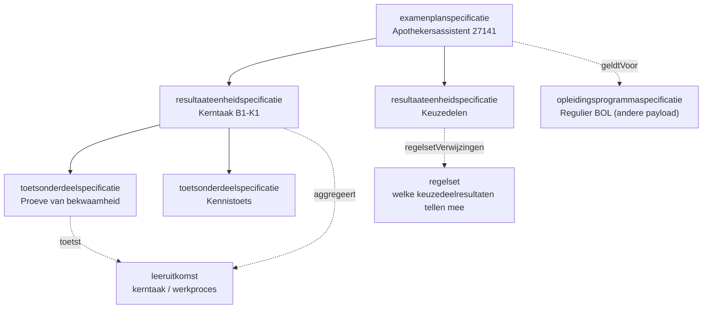
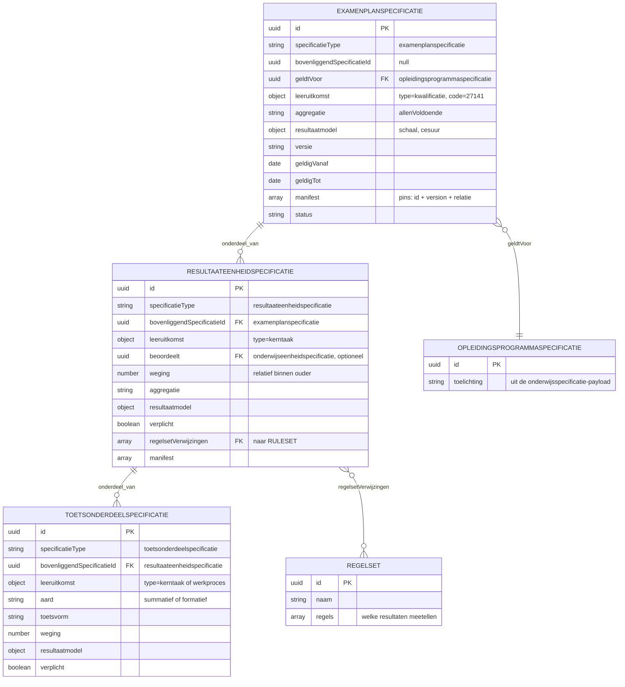

# Resultaatstructuur en examenplan als JSON-payload

Relateert aan: #119, #110, #105, #84. Waarden in het voorbeeld zijn indicatief.

## Inhoudsopgave

1. [Inleiding](#1-inleiding) (context, doel, scope)
2. [Payload](#2-payload)
   - [2.1 De vorm](#21-de-vorm)
   - [2.2 Het voorbeeld](#22-het-voorbeeld)
3. [Toelichting bij de keuzes](#3-toelichting-bij-de-keuzes)
4. [Open punten](#4-open-punten)
5. [Gerelateerde uitwerkingen](#5-gerelateerde-uitwerkingen)

## 1. Inleiding

### 1.1 Context

De onderwijsspecificatie beschrijft wat een student leert. De **resultaatstructuur** beschrijft hoe dat wordt getoetst en gewogen richting het diploma. Het zijn twee aparte bomen die via **leeruitkomsten** aan elkaar hangen: de leeruitkomst is de sleutel waarop een onderwijsresultaat wordt behaald ([ADR 0022](../../../../dr/0022-resultaatbegrippen-conform-rosa-koi.md)).

De `examenplanspecificatie`, in de praktijk de onderwijs- en examenregeling, is de wortel van die tweede boom. Aanleiding is de memo "Onderwijs PDCA-cyclus" van Niels (PR #110): het examenplan kent de zwaarste eisen omdat het een contractuele afspraak met de student is, en beschrijft de summatieve resultaatstructuur met scope, relatie tot kerntaken, wegingen en formules.

Scenario is leerroute 1, persona [Jochem](../../../../docs/specificatie/okx-oeapi-consumer-profiel/doc/persona_jochem.md), opleiding Apothekersassistent (kwalificatie 27141). Ketenoverzicht, begrippen en afkortingen: de [instap in de README](../README.md#context).

De resultaatstructuur gebruikt dezelfde specificatiefamilie als de onderwijsspecificatie. Drie typen:

| Conceptniveau (`specificatieType`) | Rol | OEAPI-mapping (indicatief) |
|---|---|---|
| `examenplanspecificatie` | Wortel (OER). Scope, aggregatie richting diploma | (geen 1:1 OEAPI-object) |
| `resultaateenheidspecificatie` | Groepering, meestal per kerntaak. Draagt weging en aggregatie | (geen 1:1 OEAPI-object) |
| `toetsonderdeelspecificatie` | Blad. Het concrete toets- of examenonderdeel | TestComponent |

Koppeling met de onderwijsspecificatie:

- Semantisch via `leeruitkomst` (`kerntaak`, `werkproces`), dezelfde verankering als in de onderwijsspecificatie-payload.
- Administratief via `geldtVoor` (de `opleidingsprogrammaspecificatie` waarvoor het examenplan geldt) en optioneel `beoordeelt` (directe verwijzing naar de beoordeelde specificatie).



### 1.2 Doel

Dit document beantwoordt drie vragen:

- Hoe leg je een examenplan vast als structuur die een systeem kan uitrekenen, in plaats van als tekstdocument?
- Hoe hangt die structuur aan de onderwijsspecificatie, zodat duidelijk is welke toets welke leeruitkomst afdicht?
- Hoe blijven keuzedelen mogelijk die nog niet bestonden toen het examenplan werd vastgesteld?

Geslaagd wanneer een studentinformatiesysteem de resultaatstructuur kan inrichten en de aggregatie richting diploma kan berekenen zonder aanvullende uitleg.

De payload is indicatief en onderbouwt welke velden het koppelvlak nodig heeft; het is geen voorschrift aan de sector ([toelichting](../README.md#van-koppelingbeschrijving-naar-koppelvlakspecificatie-doelbinding)).

### 1.3 Scope

In scope is de **summatieve** resultaatstructuur voor leerroute 1, gekoppeld aan de `opleidingsprogrammaspecificatie` Regulier BOL uit de onderwijsspecificatie-payload: examenplan, resultaateenheden, toetsonderdelen, wegingen en aggregatie.

Drie afbakeningen die anders verwarring geven:

- **Uitvoering en beoordeling** (afname, behaalde resultaten, examendossier) horen bij het examendomein OKE, niet hier.
- **Generieke onderdelen** (taal, rekenen, burgerschap, Engels) kennen een eigen wettelijk regime en zitten niet in deze payload.
- De **waarden zijn indicatief**; het echte examenplan stelt de instelling vast.

Al het overige valt buiten dit document.

## 2. Payload

Twee weergaven met elk een eigen taak. **De vorm** legt vast welke objecten er zijn, welke velden ze dragen en welke waarden zijn toegestaan. **Het voorbeeld** is de letterlijke payload voor leerroute 1; uuid's van de onderwijsspecificatie-payload worden hergebruikt waar naar die boom wordt verwezen.

### 2.1 De vorm



Het schema legt de exacte vorm vast. Het is **alfa en indicatief** en verandert mee zolang de payload nog niet vaststaat. Velden die identiek zijn aan de onderwijsspecificatie-payload dragen daar dezelfde betekenis.

```json
{
  "$schema": "https://json-schema.org/draft/2020-12/schema",
  "$id": "https://okx.npuls.nl/schema/resultaatstructuur/alfa",
  "title": "Resultaatstructuur en examenplan",
  "$comment": "Alfa en indicatief. Deze vorm onderbouwt welke velden het koppelvlak nodig heeft en kan wijzigen zolang de payload niet is vastgesteld.",
  "type": "object",
  "required": ["onderwijsspecificaties"],
  "properties": {
    "onderwijsspecificaties": {
      "type": "array",
      "items": {
        "type": "object",
        "required": ["id", "specificatieType", "versie", "bovenliggendSpecificatieId", "naam", "status", "resultaatmodel"],
        "properties": {
          "id": { "type": "string", "format": "uuid" },
          "specificatieType": { "enum": ["examenplanspecificatie", "resultaateenheidspecificatie", "toetsonderdeelspecificatie"] },
          "versie": { "type": "string", "pattern": "^\\d+\\.\\d+\\.\\d+$" },
          "bovenliggendSpecificatieId": { "type": ["string", "null"], "format": "uuid" },
          "naam": { "type": "string" },
          "omschrijving": { "type": "string" },
          "status": { "type": "string" },
          "geldigVanaf": { "type": "string", "format": "date" },
          "geldigTot": { "type": ["string", "null"], "format": "date" },
          "geldtVoor": { "type": "string", "format": "uuid", "$comment": "de opleidingsprogrammaspecificatie waarvoor dit examenplan geldt" },
          "beoordeelt": { "type": "string", "format": "uuid", "$comment": "de specificatie die deze resultaateenheid beoordeelt" },
          "leeruitkomst": {
            "type": "object",
            "required": ["type", "code"],
            "properties": {
              "type": { "type": "string" },
              "code": { "type": "string" }
            }
          },
          "aard": { "enum": ["summatief", "formatief"] },
          "toetsvorm": { "type": "string", "$comment": "open lijst: proeveVanBekwaamheid, kennistoets, praktijkopdracht, portfolio, criteriumgesprek" },
          "aggregatie": { "enum": ["gewogenGemiddelde", "som", "allenVoldoende", "minimaalAantal"] },
          "weging": { "type": "number", "$comment": "relatief binnen de ouder; 0 bij formatief" },
          "verplicht": { "type": "boolean" },
          "resultaatmodel": {
            "type": "object",
            "properties": {
              "schaal": { "type": "string", "$comment": "open lijst: cijfer-1-10, voldoende-onvoldoende, punten" },
              "cesuur": { "type": "number" },
              "decimalen": { "type": "integer" }
            }
          },
          "regelsetVerwijzingen": { "type": "array", "items": { "type": "string", "format": "uuid" } },
          "manifest": {
            "type": "array",
            "items": {
              "type": "object",
              "required": ["specificatieId", "versie", "relatie"],
              "properties": {
                "specificatieId": { "type": "string", "format": "uuid" },
                "versie": { "type": "string" },
                "relatie": { "enum": ["onderdeel", "variant", "referentie"] }
              }
            }
          }
        }
      }
    },
    "regelsets": {
      "type": "array",
      "items": {
        "type": "object",
        "required": ["id", "versie", "naam", "vanToepassingOp", "regels"],
        "properties": {
          "id": { "type": "string", "format": "uuid" },
          "versie": { "type": "string" },
          "naam": { "type": "string" },
          "omschrijving": { "type": "string" },
          "vanToepassingOp": { "type": "string", "format": "uuid" },
          "regels": { "type": "array", "items": { "type": "object" } }
        }
      }
    }
  }
}
```

Dezelfde vorm, leesbaar:

<!-- json-tree:begin kind=schema -->
```text
Resultaatstructuur en examenplan  (Alfa en indicatief. Deze vorm onderbouwt welke velden het koppelvlak nodig heeft en kan wijzigen zolang de payload niet is vastgesteld.)

{root}
+-- onderwijsspecificaties[]          verplicht
|   +-- id                                uuid
|   +-- specificatieType                  enum (3 waarden)
|   +-- versie                            string
|   +-- bovenliggendSpecificatieId        string of null
|   +-- naam                              string
|   +-- omschrijving                      string, optioneel
|   +-- status                            string
|   +-- geldigVanaf                       string, optioneel
|   +-- geldigTot                         string of null, optioneel
|   +-- geldtVoor                         uuid, optioneel
|   +-- beoordeelt                        uuid, optioneel
|   +-- leeruitkomst                      optioneel, object
|   |   +-- type                              string
|   |   `-- code                              string
|   +-- aard                              summatief | formatief, optioneel
|   +-- toetsvorm                         string, optioneel
|   +-- aggregatie                        gewogenGemiddelde | som | allenVoldoende | minimaalAantal, optioneel
|   +-- weging                            number, optioneel
|   +-- verplicht                         boolean, optioneel
|   +-- resultaatmodel                    verplicht, object
|   |   +-- schaal                            string, optioneel
|   |   +-- cesuur                            number, optioneel
|   |   `-- decimalen                         integer, optioneel
|   +-- regelsetVerwijzingen[]            optioneel
|   |     (uuid)
|   `-- manifest[]                        optioneel
|       +-- specificatieId                    uuid
|       +-- versie                            string
|       `-- relatie                           onderdeel | variant | referentie
`-- regelsets[]                       optioneel
    +-- id                                uuid
    +-- versie                            string
    +-- naam                              string
    +-- omschrijving                      string, optioneel
    +-- vanToepassingOp                   uuid
    `-- regels[]                          verplicht
          (object)
```
<!-- json-tree:end -->

### 2.2 Het voorbeeld

```json
{
  "onderwijsspecificaties": [
    {
      "id": "08b4656d-27ec-4175-8c1b-1f1d51780785",
      "specificatieType": "examenplanspecificatie",
      "versie": "0.1.0",
      "bovenliggendSpecificatieId": null,
      "geldtVoor": "7ae25c1e-ee27-43a2-a001-761ee39ea5c7",
      "leeruitkomst": { "type": "kwalificatie", "code": "27141" },
      "naam": "Examenplan Apothekersassistent",
      "omschrijving": "Summatieve resultaatstructuur voor de kwalificatie 27141, leerweg BOL, doelgroep regulier.",
      "aggregatie": "allenVoldoende",
      "resultaatmodel": { "schaal": "voldoende-onvoldoende" },
      "status": "concept",
      "geldigVanaf": "2026-09-01",
      "geldigTot": null,
      "manifest": [
        { "specificatieId": "7ae25c1e-ee27-43a2-a001-761ee39ea5c7", "versie": "0.1.0", "relatie": "referentie" },
        { "specificatieId": "0512c773-9c1b-42c4-ae0d-9af8554f2462", "versie": "0.1.0", "relatie": "onderdeel" },
        { "specificatieId": "aa15c5d9-133e-4976-9154-d2f6f9e7ad7c", "versie": "0.1.0", "relatie": "onderdeel" },
        { "specificatieId": "3c248e38-504c-4505-b0b8-d860d7b14919", "versie": "0.1.0", "relatie": "onderdeel" },
        { "specificatieId": "df0d3e50-c7c3-416e-b694-12fe5791eb7c", "versie": "0.1.0", "relatie": "onderdeel" }
      ]
    },
    {
      "id": "0512c773-9c1b-42c4-ae0d-9af8554f2462",
      "specificatieType": "resultaateenheidspecificatie",
      "versie": "0.1.0",
      "bovenliggendSpecificatieId": "08b4656d-27ec-4175-8c1b-1f1d51780785",
      "leeruitkomst": { "type": "kerntaak", "code": "B1-K1" },
      "beoordeelt": "402c2342-d897-4df4-a667-7fc5bd930944",
      "naam": "Resultaat kerntaak B1-K1, biedt farmaceutische patientenzorg",
      "weging": 1,
      "aggregatie": "gewogenGemiddelde",
      "resultaatmodel": { "schaal": "cijfer-1-10", "cesuur": 5.5, "decimalen": 1 },
      "verplicht": true,
      "status": "concept",
      "manifest": [
        { "specificatieId": "941f180d-b0af-4933-a580-6ab654dfadda", "versie": "0.1.0", "relatie": "onderdeel" },
        { "specificatieId": "b5dcc33e-681f-4c7e-ab9a-f65c745c855c", "versie": "0.1.0", "relatie": "onderdeel" },
        { "specificatieId": "f004ba43-1e0b-4b8f-a677-0644ce29f4ea", "versie": "0.1.0", "relatie": "onderdeel" }
      ]
    },
    {
      "id": "aa15c5d9-133e-4976-9154-d2f6f9e7ad7c",
      "specificatieType": "resultaateenheidspecificatie",
      "versie": "0.1.0",
      "bovenliggendSpecificatieId": "08b4656d-27ec-4175-8c1b-1f1d51780785",
      "leeruitkomst": { "type": "kerntaak", "code": "B1-K2" },
      "beoordeelt": "aa0a8af1-d383-4981-8a0f-6ec2ba4e6283",
      "naam": "Resultaat kerntaak B1-K2, voert logistieke taken uit in de apotheek",
      "weging": 1,
      "aggregatie": "gewogenGemiddelde",
      "resultaatmodel": { "schaal": "cijfer-1-10", "cesuur": 5.5, "decimalen": 1 },
      "verplicht": true,
      "status": "concept",
      "manifest": [
        { "specificatieId": "a1215600-e8c2-4fda-b3a5-be6adb433b71", "versie": "0.1.0", "relatie": "onderdeel" }
      ]
    },
    {
      "id": "3c248e38-504c-4505-b0b8-d860d7b14919",
      "specificatieType": "resultaateenheidspecificatie",
      "versie": "0.1.0",
      "bovenliggendSpecificatieId": "08b4656d-27ec-4175-8c1b-1f1d51780785",
      "leeruitkomst": { "type": "kerntaak", "code": "B1-K3" },
      "beoordeelt": "f686a286-d555-4eda-bd22-001c5b60e4dc",
      "naam": "Resultaat kerntaak B1-K3, werkt mee aan kwaliteit en deskundigheid",
      "weging": 1,
      "aggregatie": "gewogenGemiddelde",
      "resultaatmodel": { "schaal": "cijfer-1-10", "cesuur": 5.5, "decimalen": 1 },
      "verplicht": true,
      "status": "concept",
      "manifest": [
        { "specificatieId": "7fb3ffd3-621f-4d21-aec2-a1a2e58b7449", "versie": "0.1.0", "relatie": "onderdeel" }
      ]
    },
    {
      "id": "df0d3e50-c7c3-416e-b694-12fe5791eb7c",
      "specificatieType": "resultaateenheidspecificatie",
      "versie": "0.1.0",
      "bovenliggendSpecificatieId": "08b4656d-27ec-4175-8c1b-1f1d51780785",
      "beoordeelt": "fb5be5ae-faa0-4b4b-8085-474fce9aae08",
      "naam": "Resultaat keuzedelen",
      "omschrijving": "Welke keuzedeelresultaten meetellen staat in de ruleset, niet in deze specificatie.",
      "weging": 1,
      "aggregatie": "minimaalAantal",
      "resultaatmodel": { "schaal": "voldoende-onvoldoende" },
      "verplicht": true,
      "status": "concept",
      "regelsetVerwijzingen": ["132f165a-973c-41c2-98df-e58d4ca6d7eb"]
    },
    {
      "id": "941f180d-b0af-4933-a580-6ab654dfadda",
      "specificatieType": "toetsonderdeelspecificatie",
      "versie": "0.1.0",
      "bovenliggendSpecificatieId": "0512c773-9c1b-42c4-ae0d-9af8554f2462",
      "leeruitkomst": { "type": "kerntaak", "code": "B1-K1" },
      "naam": "Proeve van bekwaamheid farmaceutische patientenzorg",
      "aard": "summatief",
      "toetsvorm": "proeveVanBekwaamheid",
      "weging": 2,
      "resultaatmodel": { "schaal": "cijfer-1-10", "cesuur": 5.5, "decimalen": 1 },
      "verplicht": true,
      "status": "concept"
    },
    {
      "id": "b5dcc33e-681f-4c7e-ab9a-f65c745c855c",
      "specificatieType": "toetsonderdeelspecificatie",
      "versie": "0.1.0",
      "bovenliggendSpecificatieId": "0512c773-9c1b-42c4-ae0d-9af8554f2462",
      "leeruitkomst": { "type": "werkproces", "code": "B1-K1-W2" },
      "naam": "Kennistoets medicatiebewaking",
      "aard": "summatief",
      "toetsvorm": "kennistoets",
      "weging": 1,
      "resultaatmodel": { "schaal": "cijfer-1-10", "cesuur": 5.5, "decimalen": 1 },
      "verplicht": true,
      "status": "concept"
    },
    {
      "id": "f004ba43-1e0b-4b8f-a677-0644ce29f4ea",
      "specificatieType": "toetsonderdeelspecificatie",
      "versie": "0.1.0",
      "bovenliggendSpecificatieId": "0512c773-9c1b-42c4-ae0d-9af8554f2462",
      "leeruitkomst": { "type": "werkproces", "code": "B1-K1-W1" },
      "naam": "Formatieve voortgangstoets zorg- en adviesvraag",
      "aard": "formatief",
      "toetsvorm": "criteriumgesprek",
      "weging": 0,
      "resultaatmodel": { "schaal": "voldoende-onvoldoende" },
      "verplicht": false,
      "status": "concept"
    },
    {
      "id": "a1215600-e8c2-4fda-b3a5-be6adb433b71",
      "specificatieType": "toetsonderdeelspecificatie",
      "versie": "0.1.0",
      "bovenliggendSpecificatieId": "aa15c5d9-133e-4976-9154-d2f6f9e7ad7c",
      "leeruitkomst": { "type": "kerntaak", "code": "B1-K2" },
      "naam": "Praktijkopdracht logistiek in de apotheek",
      "aard": "summatief",
      "toetsvorm": "praktijkopdracht",
      "weging": 1,
      "resultaatmodel": { "schaal": "cijfer-1-10", "cesuur": 5.5, "decimalen": 1 },
      "verplicht": true,
      "status": "concept"
    },
    {
      "id": "7fb3ffd3-621f-4d21-aec2-a1a2e58b7449",
      "specificatieType": "toetsonderdeelspecificatie",
      "versie": "0.1.0",
      "bovenliggendSpecificatieId": "3c248e38-504c-4505-b0b8-d860d7b14919",
      "leeruitkomst": { "type": "kerntaak", "code": "B1-K3" },
      "naam": "Portfolio professioneel handelen en samenwerken",
      "aard": "summatief",
      "toetsvorm": "portfolio",
      "weging": 1,
      "resultaatmodel": { "schaal": "cijfer-1-10", "cesuur": 5.5, "decimalen": 1 },
      "verplicht": true,
      "status": "concept"
    }
  ],
  "regelsets": [
    {
      "id": "132f165a-973c-41c2-98df-e58d4ca6d7eb",
      "versie": "0.1.0",
      "naam": "Meetellende keuzedeelresultaten Apothekersassistent",
      "omschrijving": "Bepaalt welke keuzedeelresultaten meetellen voor het diploma. Regelstructuur wordt uitgewerkt in #84 en #120; onderstaande regels zijn indicatief.",
      "vanToepassingOp": "df0d3e50-c7c3-416e-b694-12fe5791eb7c",
      "regels": [
        { "type": "minimaleStudielast", "waarde": 720, "eenheid": "SBU", "bron": "fb5be5ae-faa0-4b4b-8085-474fce9aae08" },
        { "type": "resultaatEis", "bereik": "elk gekozen keuzedeel", "eis": "voldoende" }
      ]
    }
  ]
}
```

**Hoe de weging doorwerkt.** Binnen kerntaak B1-K1 telt de proeve twee keer zo zwaar als de kennistoets (weging 2 tegen 1); de formatieve toets telt niet mee (weging 0). Het gewogen gemiddelde levert een cijfer met cesuur 5.5. Op examenplanniveau geldt `allenVoldoende`: alle vier de resultaateenheden moeten voldoende zijn voor het diploma.

De boom die in deze platte lijst verborgen zit, met de verwijzingen opgelost:

<!-- json-tree:begin kind=instance array=onderwijsspecificaties id=id parent=bovenliggendSpecificatieId label=naam type=specificatieType attrs=weging,aard -->
```text
onderwijsspecificaties  (10 objecten, 1 root, boom via bovenliggendSpecificatieId)

EXAMENPLANSPECIFICATIE                                        08b4656d
= Examenplan Apothekersassistent
|
+-- RESULTAATEENHEIDSPECIFICATIE                              0512c773
|   = Resultaat kerntaak B1-K1, biedt farmaceutische patientenzorg
|     weging: 1
|   |
|   +-- TOETSONDERDEELSPECIFICATIE                            941f180d
|   |   = Proeve van bekwaamheid farmaceutische patientenzorg
|   |     weging: 2 | aard: summatief
|   +-- TOETSONDERDEELSPECIFICATIE                            b5dcc33e
|   |   = Kennistoets medicatiebewaking
|   |     weging: 1 | aard: summatief
|   `-- TOETSONDERDEELSPECIFICATIE                            f004ba43
|       = Formatieve voortgangstoets zorg- en adviesvraag
|         weging: 0 | aard: formatief
+-- RESULTAATEENHEIDSPECIFICATIE                              aa15c5d9
|   = Resultaat kerntaak B1-K2, voert logistieke taken uit in de apotheek
|     weging: 1
|   |
|   `-- TOETSONDERDEELSPECIFICATIE                            a1215600
|       = Praktijkopdracht logistiek in de apotheek
|         weging: 1 | aard: summatief
+-- RESULTAATEENHEIDSPECIFICATIE                              3c248e38
|   = Resultaat kerntaak B1-K3, werkt mee aan kwaliteit en deskundigheid
|     weging: 1
|   |
|   `-- TOETSONDERDEELSPECIFICATIE                            7fb3ffd3
|       = Portfolio professioneel handelen en samenwerken
|         weging: 1 | aard: summatief
`-- RESULTAATEENHEIDSPECIFICATIE                              df0d3e50
    = Resultaat keuzedelen
      weging: 1
```
<!-- json-tree:end -->

De resultaateenheid Keuzedelen heeft geen toetsonderdelen onder zich: welke keuzedeelresultaten meetellen bepaalt de regelset, niet de boom. Dat is het mechanisme waarmee een examenplan keuzes kan verwerken die nog niet bestonden toen het werd vastgesteld.

## 3. Toelichting bij de keuzes

### 3.1 Waarom dezelfde vorm als de onderwijsspecificatie

Zelfde ontwerpkeuze als de onderwijsspecificatie-payload (optie C: recursief plat met een ouder-verwijzing). Concreet:

- **Eén familie.** De resultaatstructuur gebruikt dezelfde envelope (`onderwijsspecificaties`, `regelsets`), dezelfde velden (`id`, `specificatieType`, `bovenliggendSpecificatieId`, `versie`, `status`, `geldigVanaf`/`geldigTot`, `manifest`, `leeruitkomst`) en dezelfde discriminator. Alleen de typewaarden verschillen.
- **Weging bovenin, niet in het blad.** Een `resultaateenheidspecificatie` draagt `aggregatie` (hoe onderliggende resultaten samenkomen) en haar eigen `weging` binnen de ouder. Zo staat de rekenregel op het niveau waar hij geldt.
- **Aard expliciet.** `aard` onderscheidt `summatief` (telt mee voor het diploma) van `formatief` (ontwikkelingsgericht, weging 0).
- **Resultaatmodel per niveau.** `resultaatmodel` legt schaal, cesuur en afronding vast, zodat elk systeem dezelfde uitkomst berekent.
- **Regels los van de specificatie.** Dynamische delen (bijvoorbeeld welke keuzedeelresultaten meetellen) staan in een `regelset`, niet in de specificatie. Zelfde principe als #84 en #120. Dit maakt de modulaire resultaatstructuur mogelijk die de memo van Niels vraagt: keuzes kunnen worden ingevuld met onderdelen die nog niet bestonden toen het examenplan werd vastgesteld.
- **Manifest.** Elke specificatie met onderdelen pint de versies daarvan, inclusief de kruisverwijzing naar de `opleidingsprogrammaspecificatie` (`relatie: referentie`).


### 3.2 Lifecycle

Zelfde mechaniek als de onderwijsspecificatie: semver per specificatie, identiteit los van versie, manifest dat onderliggende versies pint, en `geldigVanaf`/`geldigTot` voor gelijktijdig actieve versies. Zie het hoofdstuk *Onderwijsspecificatie lifecycle* in de payload en de [lifecycle-uitwerking](../gedeeld/20260720_0832_okx-lr1-lifecycle-versionering.md).

Eén verschil: de `examenplanspecificatie` heeft de **strengste acceptatieregels**. Het is een contractuele afspraak met de student, dus een wijziging vraagt altijd expliciete impactanalyse en besluitvorming, ook wanneer die technisch niet-brekend lijkt (memo van Niels, PR #110).

## 4. Open punten

- Nominaal versus individueel examenplan ([ADR 0022](../../../../dr/0022-resultaatbegrippen-conform-rosa-koi.md)): een keuzedeel kent een eigen examenplandeel met eigen toetsonderdelen en een eigen onderwijsresultaat; het individuele examenplan is de samenstelling van nominaal plus gekozen keuzedeel-delen. Meenemen in de ombouw naar het `examenspecificatie`-model.

- Hangt de `examenplanspecificatie` op de `opleidingsprogrammaspecificatie` (zoals hier, per kwalificatie en doelgroep) of hoger op de `opleidingsspecificatie`? Nu gekozen voor programma-niveau via `geldtVoor`.
- Is `beoordeelt` (directe uuid-verwijzing) nodig naast de semantische koppeling via `leeruitkomst`, of is één van beide voldoende?
- Verhouding tussen `weging` in de resultaatstructuur en `studielast` (SBU) in de onderwijsspecificatie. Nu los van elkaar.
- Generieke onderdelen (taal, rekenen, burgerschap, Engels) hebben een eigen wettelijk regime. Toevoegen als aparte resultaateenheden of buiten deze structuur houden.
- De drie typen zijn opgenomen in de gedeelde enum van de onderwijsspecificatie-payload. Bij elke uitbreiding moeten beide documenten gelijk blijven.
- OEAPI-binding: alleen `toetsonderdeelspecificatie` mapt op TestComponent. Voor examenplan en resultaateenheid is er geen OEAPI-object. Signalering, geen OEAPI-kernwijziging.
- Dynamische resultaatstructuren: de ruleset dekt keuzes die nog niet bestaan bij vaststelling van het examenplan. Verhouding tot wetgeving (VABA) en de werking van SIS'en nog te bepalen.

## 5. Gerelateerde uitwerkingen

- Onderwijsspecificatie: [onderwijsspecificatie-payload](../gedeeld/20260717_1120_okx-lr1-onderwijsspecificatie-payload-json.md).
- Lifecycle: [lifecycle en versionering](../gedeeld/20260720_0832_okx-lr1-lifecycle-versionering.md).
- Memo van Niels: `doc/OKx_PDCA cyclus onderwijsontwerp.md` (PR #110).
- OKE koppelvlak (uitvoering en beoordeling): `OKE/moka-koppelvlakspecificaties/Examen Uitvoering en beoordeling/doc/KoppelvlakSpecificatieDocument.md`.
- [ADR 0009](../../../../dr/0009-sks-svs-rollenverdeling-keuze-vs-resultaat-voortgang.md) (SKS/SVS: keuze versus resultaat en voortgang).
