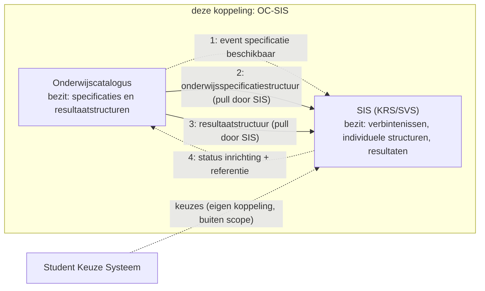
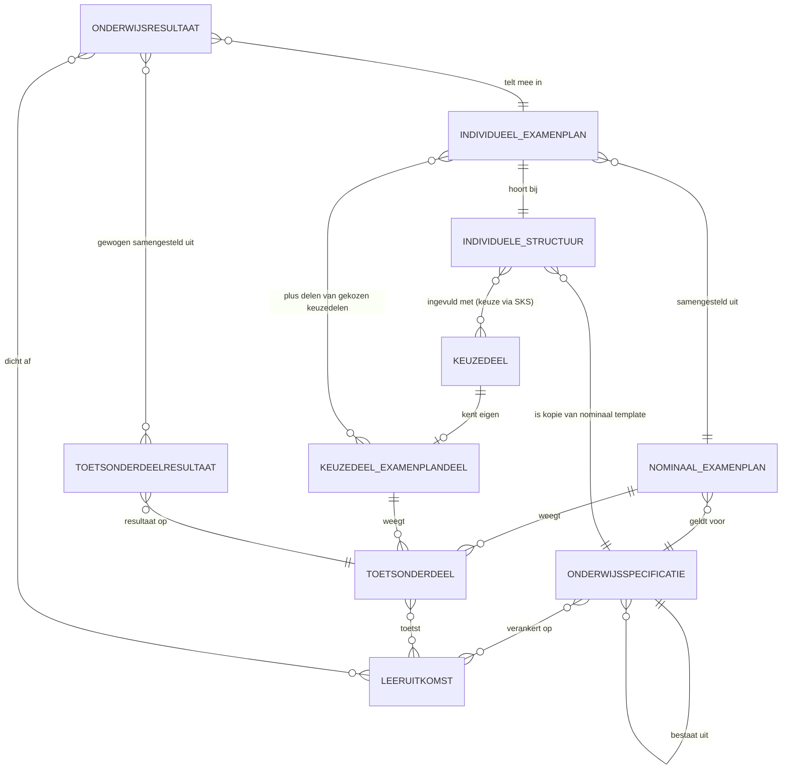
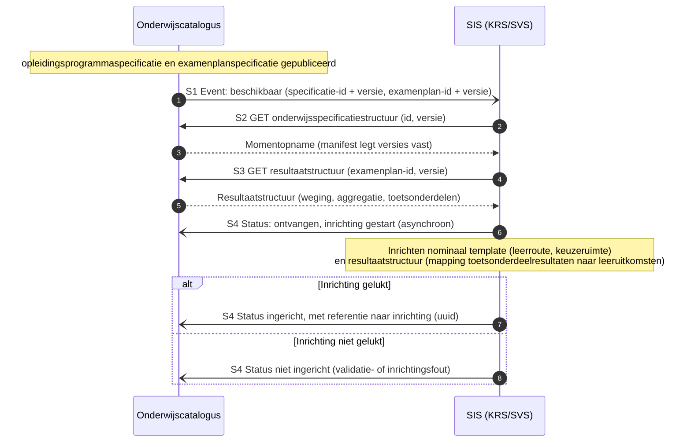
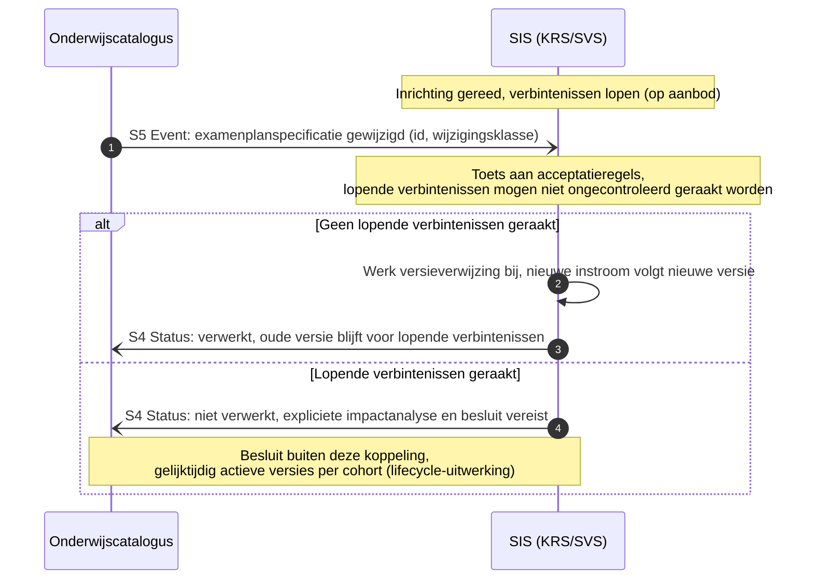

# Koppelingspecificatie onderwijscatalogus naar studentinformatiesysteem

Relateert aan: #98, #119, #105, #110. Terminologie: [ADR 0021](../../../../dr/0021-koppeling-versus-koppelvlak-terminologie.md).

## Inhoudsopgave

1. [Inleiding](#1-inleiding) (context, doel, scope)
2. [Procesbeeld](#2-procesbeeld)
3. [Interactieoverzicht](#3-interactieoverzicht)
4. [Informatiemodel](#4-informatiemodel)
5. [Sequentiediagrammen](#5-sequentiediagrammen)
6. [Payload-specificaties (verwijzing) en gebruiksprofiel](#6-payload-specificaties-verwijzing-en-gebruiksprofiel)
7. [Endpointbeschrijvingen (REST)](#7-endpointbeschrijvingen-rest)
8. [Reviewvragen](#8-reviewvragen)
9. [Open punten](#9-open-punten)
10. [Gerelateerde uitwerkingen](#10-gerelateerde-uitwerkingen)

## 1. Inleiding

### 1.1 Context

Waar deze koppeling in de keten zit: de onderwijscatalogus (OC) levert de gepubliceerde structuur aan het studentinformatiesysteem (SIS, de combinatie kernregistratie KRS en studentvolgsysteem SVS). Het gaat om de stroom OC naar SVS: nominale leerroute (detail), keuzeaanbod (detail) en resultaatstructuren (stroom 3, prioriteit 2). Stroomnummers volgen de interpretatietabel in het [Projectoverzicht](../../../../../doc/OKx_Projectoverzicht.md); het ketenoverzicht en de actuele [hoofdplaat v1.7](../README.md#context) staan in de instap van de README.

Scenario is leerroute 1 (regulier), persona [Jochem](../../../../docs/specificatie/okx-oeapi-consumer-profiel/doc/persona_jochem.md), opleiding Apothekersassistent (SBB-kwalificatiedossier 23450, kwalificatie 27141): de student volgt het nominale programma en het SIS registreert zijn verbintenis, voortgang en resultaten. Leerroute 2 en 3 volgen als verschil. Begrippenkader (ankertabel, zes families; de leeruitkomst is de sleutel voor de resultaatstructuur) en de volledige leerroutes: het [OEAPI consumer-profiel](../../../../docs/specificatie/okx-oeapi-consumer-profiel/README.md). Dat profiel gebruikt nog een oudere hoofdplaat; leidend is v1.7.

Rolverdeling ([ADR 0009](../../../../dr/0009-sks-svs-rollenverdeling-keuze-vs-resultaat-voortgang.md), [ADR 0014](../../../../dr/0014-splitsing-inschrijving-rodkrs-en-studentkeuze-sks.md)): het SIS registreert de verbintenis (op aanbod), de individuele structuur, voortgang en onderwijsresultaten. De onderwijskundige keuze leeft bij het studentkeuzesysteem (SKS, aparte koppeling, buiten scope). OC bezit de onderwijsspecificaties en de resultaatstructuren (`examenplanspecificatie`). Deze koppelingspecificatie is afgeleid (geen werksessie) en volgt het patroon van de [koppeling OC-P&R](../oc-p-en-r/20260723_1156_okx-lr1-koppelingspecificatie-oc-p-en-r.md): resource-eigenaarschap, referenties en dunne events.

### 1.2 Doel

Deze koppelingbeschrijving is **indicatief en onderbouwend, geen voorschrift aan de sector**; zij levert bouwstenen voor het koppelvlak van de onderwijscatalogus en dat van het studentinformatiesysteem ([uitgangspunt U1](../uitgangspunten.md#u1-indicatief-en-onderbouwend-niet-voorschrijvend)).

Het document beantwoordt drie vragen:

- Welke interacties zijn nodig om het nominale template en de resultaatstructuur in te richten voordat de student begint?
- Welke payload draagt elk bericht, en welk deel van de centrale payload heeft dit systeem nodig?
- Wat gebeurt er als een examenplan wijzigt terwijl er al verbintenissen lopen?

Geslaagd wanneer een leverancier van een studentinformatiesysteem de inrichting kan bouwen, en wanneer duidelijk is welke wijzigingen wel en niet zonder tussenkomst verwerkt mogen worden.

### 1.3 Scope

In scope is de koppeling van de onderwijscatalogus naar het studentinformatiesysteem binnen één instelling ([ADR 0008](../../../../dr/0008-scope-planning-eerst-intra-instelling.md)), voor leerroute 1 tot en met 3: de eerste inrichting van het nominale template en de resultaatstructuur op basis van gepubliceerde specificaties, en de wijzigingen daarop. Leidende vraag voor de prioritering is wat er uitgewisseld moet zijn voordat de student begint.

Drie afbakeningen die anders verwarring geven:

- De **studentkeuze zelf** leeft in het studentkeuzesysteem en is een eigen koppeling, net als het actualiseren van de resultaatstructuur op basis van individuele keuzes (stroom 9).
- **Diplomering en waardedocumenten** horen bij het examendomein OKE.
- De **dynamiek van versnellen en vertragen** uit leerroute 2 en 3 raakt drie systemen tegelijk en volgt later, vanwege de prioriteit op de onderwijsvoorbereiding.

Al het overige valt buiten dit document, waaronder cross-instelling.

## 2. Procesbeeld

**Resource-eigenaarschap** ([U3](../uitgangspunten.md#u3-resource-eigenaarschap)): de onderwijscatalogus bezit de specificaties en de resultaatstructuren, het studentinformatiesysteem de verbintenissen, individuele structuren, voortgang en resultaten. **Notify-then-pull** ([U4](../uitgangspunten.md#u4-notify-then-pull)): de catalogus meldt, het studentinformatiesysteem haalt op.

Wat het diagram niet toont: het studentinformatiesysteem haalt twee dingen op, de specificatiestructuur en de resultaatstructuur, en richt daarmee het **nominale template** in plus de mapping van welke toetsonderdeelresultaten welke leeruitkomsten afdichten ([ADR 0022](../../../../dr/0022-resultaatbegrippen-conform-rosa-koi.md)). Bij een wijziging draagt het event een wijzigingsklasse mee. Voor het examenplan gelden daarbij de strengste acceptatieregels: lopende verbintenissen mogen niet ongecontroleerd geraakt worden.

## 3. Interactieoverzicht

De interacties op deze koppeling, met per interactie het messaging-patroon, in dezelfde patroontaal als de koppeling met planning ([Enterprise Integration Patterns, Messaging](https://www.enterpriseintegrationpatterns.com/patterns/messaging/)).
Wat hier wordt vastgelegd is het **bericht**, niet het **kanaal**: hoe het bericht bij de ontvanger komt is een inrichtingskeuze van instelling en leverancier, binnen de vier eigenschappen die [ADR 0018](../../../../dr/0018-enterprise-messaging-patronen-voor-betrouwbare-koppelvlakken.md) eist. Zie [uitgangspunt U5](../uitgangspunten.md#u5-bericht-versus-kanaal).

| # | Interactie | Initiator | Patroon | Synchroniciteit | Gedrag bij dubbele ontvangst | Foutafhandeling |
|---|---|---|---|---|---|---|
| S1 | Specificatie en resultaatstructuur beschikbaar melden | OC | [Event Message](https://www.enterpriseintegrationpatterns.com/patterns/messaging/EventMessage.html) (id + versie) | Asynchroon | Geen effect: event-id ([Idempotent Receiver](https://www.enterpriseintegrationpatterns.com/patterns/messaging/IdempotentReceiver.html)) | [Guaranteed Delivery](https://www.enterpriseintegrationpatterns.com/patterns/messaging/GuaranteedDelivery.html); [Dead Letter Channel](https://www.enterpriseintegrationpatterns.com/patterns/messaging/DeadLetterChannel.html) |
| S2 | Onderwijsspecificatiestructuur of delta ophalen | SIS | [Request-Reply](https://www.enterpriseintegrationpatterns.com/patterns/messaging/RequestReply.html) (GET, alleen-lezen) | Synchroon | Geen effect (alleen-lezen) | HTTP-foutcodes, client bepaalt retry |
| S3 | Resultaatstructuur ophalen | SIS | [Request-Reply](https://www.enterpriseintegrationpatterns.com/patterns/messaging/RequestReply.html) (GET, alleen-lezen) | Synchroon | Geen effect (alleen-lezen) | HTTP-foutcodes |
| S4 | Inrichtingsstatus melden, met referentie naar de inrichting | SIS | [Event Message](https://www.enterpriseintegrationpatterns.com/patterns/messaging/EventMessage.html) (status: ontvangen/gestart, afgekeurd, ingericht, niet ingericht) | Asynchroon | Geen effect: status-id | Retry met backoff, daarna [Dead Letter Channel](https://www.enterpriseintegrationpatterns.com/patterns/messaging/DeadLetterChannel.html) |
| S5 | Wijziging specificatie of resultaatstructuur melden | OC | [Event Message](https://www.enterpriseintegrationpatterns.com/patterns/messaging/EventMessage.html) (object-id, oude en nieuwe versie, wijzigingsklasse) | Asynchroon | Geen effect: event-id | [Guaranteed Delivery](https://www.enterpriseintegrationpatterns.com/patterns/messaging/GuaranteedDelivery.html); [Dead Letter Channel](https://www.enterpriseintegrationpatterns.com/patterns/messaging/DeadLetterChannel.html) |

## 4. Informatiemodel

Conform het ROSA Kernmodel Onderwijsinformatie (KOI) en [ADR 0022](../../../../dr/0022-resultaatbegrippen-conform-rosa-koi.md): een onderwijsresultaat wordt behaald op leeruitkomsten, en meerdere toetsonderdeelresultaten leiden gewogen tot dat onderwijsresultaat. De verbintenis hoort bij het aanbod (ankertabel), niet bij de specificatie, en staat daarom niet in dit kernmodel.

Het model toont de relatie tussen specificatie en leeruitkomst als veel-op-veel. De payload implementeert dat voorlopig als één `leeruitkomstId` per specificatie; een array-vorm staat als open punt in de [onderwijsspecificatie-payload](../gedeeld/20260717_1120_okx-lr1-onderwijsspecificatie-payload-json.md#4-open-punten).

Wat het model niet toont: het studentinformatiesysteem hanteert de gepubliceerde structuur als **nominaal template** en houdt daarnaast per student een **individuele structuur** bij, namelijk dat template plus de gekozen keuzedelen. In leerroute 1 tot en met 3 wijken nominaal en gevolgd uitsluitend daarin af; ook bij versnellen of vertragen blijft het programma gelijk en verandert alleen het tempo.

Dezelfde symmetrie geldt voor het examenplan. Naast het **nominale examenplan** bij het diplomaprogramma heeft elk keuzedeel een eigen examenplandeel met eigen toetsonderdelen en een eigen onderwijsresultaat. Het **individuele examenplan** is de samenstelling van beide, en hoort bij de individuele structuur.

## 5. Sequentiediagrammen

### 5.1 Happy flow: inrichting nominaal template en resultaatstructuur

### 5.2 Faalpad: wijziging examenplan bij lopende verbintenissen

Strengste acceptatieregels (memo van Niels): het examenplan is een contractuele afspraak met de student.

## 6. Payload-specificaties (verwijzing) en gebruiksprofiel

Gebruiksprofiel van deze koppeling op de centrale [onderwijsspecificatie-payload](../gedeeld/20260717_1120_okx-lr1-onderwijsspecificatie-payload-json.md) ([ADR 0021](../../../../dr/0021-koppeling-versus-koppelvlak-terminologie.md)):

| Onderdeel | Gebruik in OC-SIS |
|---|---|
| `onderwijsspecificaties` | Volledig, inclusief manifest (nominaal template) |
| `leeruitkomsten` | **Volledig**, inclusief aggregatie (`bovenliggendLeeruitkomstId`), `waardedocument` en `indicatieveOmvang`: de sleutel tussen specificatie, resultaatstructuur en onderwijsresultaat ([ADR 0022](../../../../dr/0022-resultaatbegrippen-conform-rosa-koi.md)) |
| `regelsets` | Volledig (kiesbaarheid keuzedeelruimte, voorwaarden in behaalde leeruitkomsten) |

- Basis voor S2: de centrale payload.
- [Resultaatstructuur en examenplan](20260720_0831_okx-lr1-resultaatstructuur-examenplan.md): de payload voor S3. De verankering op leeruitkomsten en het onderscheid tussen het nominale en het individuele examenplan worden nog aangescherpt; dat gebeurt in de context van deze koppeling.
- [Lifecycle en versionering](../gedeeld/20260720_0832_okx-lr1-lifecycle-versionering.md): staat eenmaal centraal en geldt ook voor deze koppeling; de acceptatieregels van §5.2 komen hieruit.

## 7. Endpointbeschrijvingen (REST)

Nog niet uitgewerkt. De endpoints volgen zodra de interacties in §3 zijn bevestigd, in dezelfde vorm als bij de [koppeling met planning](../oc-p-en-r/20260723_1156_okx-lr1-koppelingspecificatie-oc-p-en-r.md#7-endpointbeschrijvingen-rest): per endpoint de methode, de operatie, de parameters en de statuscodes, met de events als webhook-aflevering.

## 8. Reviewvragen

1. Klopt de rolverdeling: SIS als één aanspreekpunt (KRS en SVS samen), of moeten KRS en SVS als aparte deelnemers in de diagrammen?
2. Is de inrichtingsstatus (S4) met inrichting-referentie de juiste terugmelding, en wat wil OC daarmee?
3. Dekt het faalpad §5.2 de praktijk van wijzigingen bij lopende verbintenissen?
4. Wat is de juiste plek voor de actualisering op basis van keuzes (stroom 9): deze koppeling of de SKS-koppeling?

## 9. Open punten

- De resultaatstructuur-payload moet omgebouwd (naar `examenspecificatie`-model, Nederlandse veldnamen) voordat deze koppeling verder uitgewerkt wordt.
- Stroom 9 (actualiseren resultaatstructuren op basis van keuzes) raakt het SKS; afbakening volgt bij de SKS-koppeling.

## 10. Gerelateerde uitwerkingen

- [Koppelingspecificatie OC-P&R](../oc-p-en-r/20260723_1156_okx-lr1-koppelingspecificatie-oc-p-en-r.md) (het patroon waarop deze koppeling voortbouwt).
- Memo "Onderwijs PDCA-cyclus" van Niels: `doc/OKx_PDCA cyclus onderwijsontwerp.md`.
- [ADR 0009](../../../../dr/0009-sks-svs-rollenverdeling-keuze-vs-resultaat-voortgang.md) (SKS/SVS-rollen), [ADR 0014](../../../../dr/0014-splitsing-inschrijving-rodkrs-en-studentkeuze-sks.md) (splitsing inschrijving en keuze), [ADR 0021](../../../../dr/0021-koppeling-versus-koppelvlak-terminologie.md) (koppeling versus koppelvlak), [ADR 0022](../../../../dr/0022-resultaatbegrippen-conform-rosa-koi.md) (resultaatbegrippen conform ROSA KOI).
- [ROSA Kernmodel Onderwijsinformatie](https://rosa.wikixl.nl/index.php/Kernmodel_Onderwijsinformatie).
