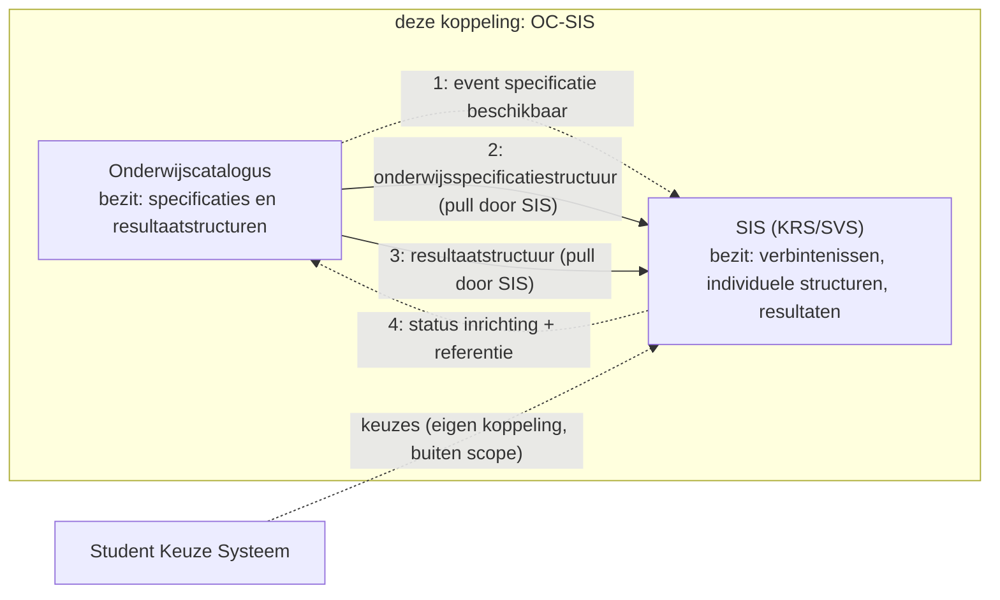
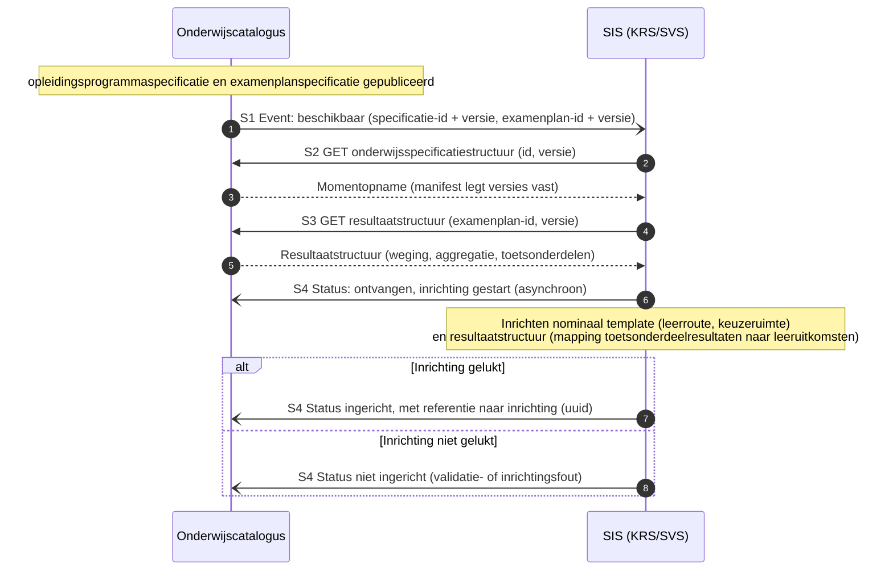
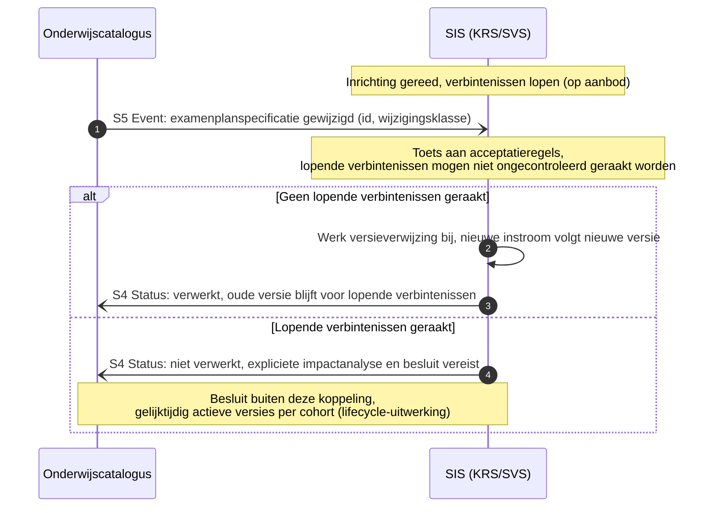

# Koppelingspecificatie OC-SIS (KRS/SVS): interactiepatronen (concept)

Context: koppeling onderwijscatalogus (OC) naar studentinformatiesysteem (SIS, de combinatie KRS en SVS), intra-instelling. Scenario: LR1-3. Niveau: concept, afgeleid zonder werksessie; ter review. Relateert aan: #98, #119, #105, #110. Terminologie: ADR 0021.

> **Status.** Deze koppelingspecificatie is afgeleid uit de hoofdplaat (stromen 3 en 9), ADR 0009 en 0014, de memo van Niels (PR #110) en het patroon van de [koppeling OC-P&R](../oc-p-en-r/20260723_1156_okx-lr1-koppelingspecificatie-oc-p-en-r.md). Er is nog geen werksessie of schets aan gewijd; alles hieronder is voorstel.

## Inhoudsopgave

1. [Inleiding](#1-inleiding)
2. [Doel](#2-doel)
3. [Scope](#3-scope)
4. [Kort procesbeeld](#4-kort-procesbeeld)
5. [Interactieoverzicht](#5-interactieoverzicht)
6. [Conceptueel informatiemodel](#6-conceptueel-informatiemodel)
7. [Sequentiediagrammen](#7-sequentiediagrammen)
8. [Payload-specificaties (verwijzing)](#8-payload-specificaties-verwijzing)
9. [Reviewvragen](#9-reviewvragen)
10. [Open vragen en signaleringen](#10-open-vragen-en-signaleringen)
11. [Gerelateerde uitwerkingen](#11-gerelateerde-uitwerkingen)

## 1. Inleiding

De hoofdplaat benoemt de stroom OC naar SVS: nominale leerroute (detail), keuzeaanbod (detail) en resultaatstructuren (stroom 3, prioriteit 2), en het actualiseren van resultaatstructuren op basis van keuzes (stroom 9). Deze koppelingspecificatie werkt die stroom uit volgens hetzelfde patroon als de koppeling OC-P&R: resource-eigenaarschap, referenties en dunne events.

Rolverdeling (ADR 0009, ADR 0014): het SIS registreert de verbintenis (op aanbod), de individuele structuur, voortgang en onderwijsresultaten. De onderwijskundige keuze leeft bij het SKS (aparte koppeling, buiten scope). OC bezit de onderwijsspecificaties en de resultaatstructuren (`examenplanspecificatie`).

## 2. Doel

- De interacties tussen OC en SIS vastleggen als expliciete patronen met sequentiediagrammen.
- De payload-specificaties voor deze koppeling aanwijzen: de onderwijsspecificatiestructuur en de resultaatstructuur.
- Concept ter review; werksessie volgt.

## 3. Scope

- Koppeling: OC naar SIS (KRS en SVS), intra-instelling eerst (ADR 0008). Leerroutes LR1-3.
- In scope: de onderwijsvoorbereiding. Leidende vraag voor de prioritering: wat moeten OC-P&R, OC-LMS en OC-SIS uitgewisseld hebben om klaar te zijn voor de start van de student? Concreet: eerste inrichting van nominaal template en resultaatstructuur op basis van gepubliceerde specificaties, en wijzigingen daarop.
- Buiten scope: de studentkeuze zelf (SKS, eigen koppeling), actualisering op basis van individuele keuzes (stroom 9; raakt de SKS-koppeling, volgt), diplomering en waardedocumenten (OKE-domein), cross-instelling, en de LR2/LR3-dynamiek rond versnellen en vertragen (raakt SKS, SIS en P&R; bewust later wegens de prioritering op onderwijsvoorbereiding).

## 4. Kort procesbeeld

Zelfde kernprincipe als OC-P&R: elk systeem bezit zijn eigen resource. OC bezit specificaties en resultaatstructuren; het SIS bezit de studentregistratie: verbintenissen (op aanbod), individuele structuren, voortgang en resultaten.

Procesbeschrijving, kort:

1. OC publiceert een `opleidingsprogrammaspecificatie` met bijbehorende `examenplanspecificatie` en meldt het SIS: beschikbaar.
2. Het SIS haalt de onderwijsspecificatiestructuur en de resultaatstructuur op (pull) en richt in: het nominale template en de resultaatstructuur (welke toetsonderdeelresultaten dichten welke leeruitkomsten af, ADR 0022).
3. Het SIS meldt de inrichtingsstatus aan OC, met de referentie (uuid) naar de inrichting.
4. Wijzigt een specificatie of resultaatstructuur, dan notificeert OC (dun event met wijzigingsklasse). Voor de `examenplanspecificatie` gelden de strengste acceptatieregels: lopende verbintenissen mogen niet ongecontroleerd geraakt worden (memo van Niels).

## 5. Interactieoverzicht

Zelfde patroontaal als OC-P&R ([Enterprise Integration Patterns, Messaging](https://www.enterpriseintegrationpatterns.com/patterns/messaging/)); notify-then-pull met dunne events.

| # | Interactie | Initiator | Patroon | Synchroniciteit | Gedrag bij dubbele ontvangst | Foutafhandeling |
|---|---|---|---|---|---|---|
| S1 | Specificatie en resultaatstructuur beschikbaar melden | OC | [Event Message](https://www.enterpriseintegrationpatterns.com/patterns/messaging/EventMessage.html) (id + versie) | Asynchroon | Geen effect: event-id ([Idempotent Receiver](https://www.enterpriseintegrationpatterns.com/patterns/messaging/IdempotentReceiver.html)) | [Guaranteed Delivery](https://www.enterpriseintegrationpatterns.com/patterns/messaging/GuaranteedDelivery.html); [Dead Letter Channel](https://www.enterpriseintegrationpatterns.com/patterns/messaging/DeadLetterChannel.html) |
| S2 | Onderwijsspecificatiestructuur of delta ophalen | SIS | [Request-Reply](https://www.enterpriseintegrationpatterns.com/patterns/messaging/RequestReply.html) (GET, alleen-lezen) | Synchroon | Geen effect (alleen-lezen) | HTTP-foutcodes, client bepaalt retry |
| S3 | Resultaatstructuur ophalen | SIS | [Request-Reply](https://www.enterpriseintegrationpatterns.com/patterns/messaging/RequestReply.html) (GET, alleen-lezen) | Synchroon | Geen effect (alleen-lezen) | HTTP-foutcodes |
| S4 | Inrichtingsstatus melden, met referentie naar de inrichting | SIS | [Event Message](https://www.enterpriseintegrationpatterns.com/patterns/messaging/EventMessage.html) (status: ontvangen/gestart, afgekeurd, ingericht, niet ingericht) | Asynchroon | Geen effect: status-id | Retry met backoff, daarna [Dead Letter Channel](https://www.enterpriseintegrationpatterns.com/patterns/messaging/DeadLetterChannel.html) |
| S5 | Wijziging specificatie of resultaatstructuur melden | OC | [Event Message](https://www.enterpriseintegrationpatterns.com/patterns/messaging/EventMessage.html) (object-id, oude en nieuwe versie, wijzigingsklasse) | Asynchroon | Geen effect: event-id | [Guaranteed Delivery](https://www.enterpriseintegrationpatterns.com/patterns/messaging/GuaranteedDelivery.html); [Dead Letter Channel](https://www.enterpriseintegrationpatterns.com/patterns/messaging/DeadLetterChannel.html) |

## 6. Conceptueel informatiemodel

Conform het ROSA Kernmodel Onderwijsinformatie (KOI) en ADR 0022: een onderwijsresultaat wordt behaald op leeruitkomsten, en meerdere toetsonderdeelresultaten leiden gewogen tot dat onderwijsresultaat. De verbintenis hoort bij het aanbod (ankertabel), niet bij de specificatie, en staat daarom niet in dit kernmodel.

Leeswijzer: OC beheert de `onderwijsspecificatie`s en het `examenplan` (weging en indeling van `toetsonderdeel`en op leeruitkomsten). Het SIS hanteert de gepubliceerde structuur als **nominaal template** en houdt per student een **individuele structuur** bij: het template plus de via het SKS ingevulde keuzedelen. In LR1-3 wijken nominaal en feitelijk gevolgd uitsluitend daarin af; ook bij versnellen of vertragen (LR2, LR3) blijft het programma en de wijze van afdichten gelijk. Dezelfde symmetrie geldt voor het examenplan: naast het **nominale examenplan** (bij het diplomaprogramma) heeft elk keuzedeel een eigen **examenplandeel** met eigen toetsonderdelen die naar een eigen onderwijsresultaat mappen. Het **individuele examenplan** van de student is de samenstelling van het nominale examenplan plus de examenplandelen van de gekozen keuzedelen, en hoort bij de individuele structuur. Toetsonderdeelresultaten leiden gewogen tot onderwijsresultaten op leeruitkomsten; de mapping welke toetsonderdeelresultaten welke leeruitkomst afdichten is expliciet onderdeel van de resultaatstructuur.

## 7. Sequentiediagrammen

### 7.1 Happy flow: inrichting nominaal template en resultaatstructuur

### 7.2 Faalpad: wijziging examenplan bij lopende verbintenissen

Strengste acceptatieregels (memo van Niels): het examenplan is een contractuele afspraak met de student.

## 8. Payload-specificaties (verwijzing)

- [Onderwijsspecificatie-payload](20260717_1120_okx-lr1-onderwijsspecificatie-payload-json.md): kopie voor deze koppeling (ADR 0021), basis voor S2.
- [Resultaatstructuur en examenplan](20260720_0831_okx-lr1-resultaatstructuur-examenplan.md): de payload voor S3. Wordt nog omgebouwd naar het `examenspecificatie`-model en naar Nederlandse veldnamen; dat gebeurt in de context van deze koppeling.
- [Lifecycle en versionering](20260720_0832_okx-lr1-lifecycle-versionering.md): kopie voor deze koppeling; de acceptatieregels van 7.2 komen hieruit.

## 9. Reviewvragen

1. Klopt de rolverdeling: SIS als één aanspreekpunt (KRS en SVS samen), of moeten KRS en SVS als aparte deelnemers in de diagrammen?
2. Is de inrichtingsstatus (S4) met inrichting-referentie de juiste terugmelding, en wat wil OC daarmee?
3. Dekt het faalpad 7.2 de praktijk van wijzigingen bij lopende verbintenissen?
4. Wat is de juiste plek voor de actualisering op basis van keuzes (stroom 9): deze koppeling of de SKS-koppeling?

## 10. Open vragen en signaleringen

- De resultaatstructuur-payload moet omgebouwd (naar `examenspecificatie`-model, Nederlandse veldnamen) voordat deze koppeling verder uitgewerkt wordt.
- Stroom 9 (actualiseren resultaatstructuren op basis van keuzes) raakt het SKS; afbakening volgt bij de SKS-koppeling.
- Endpoints en operaties volgen na review van dit concept (zelfde vorm als OC-P&R §9).

## 11. Gerelateerde uitwerkingen

- [Koppelingspecificatie OC-P&R](../oc-p-en-r/20260723_1156_okx-lr1-koppelingspecificatie-oc-p-en-r.md) (het patroon waarop deze koppeling voortbouwt).
- Memo van Niels: `doc/OKx_PDCA cyclus onderwijsontwerp.md` (PR #110).
- ADR 0009 (SKS/SVS-rollen), ADR 0014 (splitsing inschrijving en keuze), ADR 0021 (koppeling versus koppelvlak), ADR 0022 (resultaatbegrippen conform ROSA KOI).
- [ROSA Kernmodel Onderwijsinformatie](https://rosa.wikixl.nl/index.php/Kernmodel_Onderwijsinformatie).
