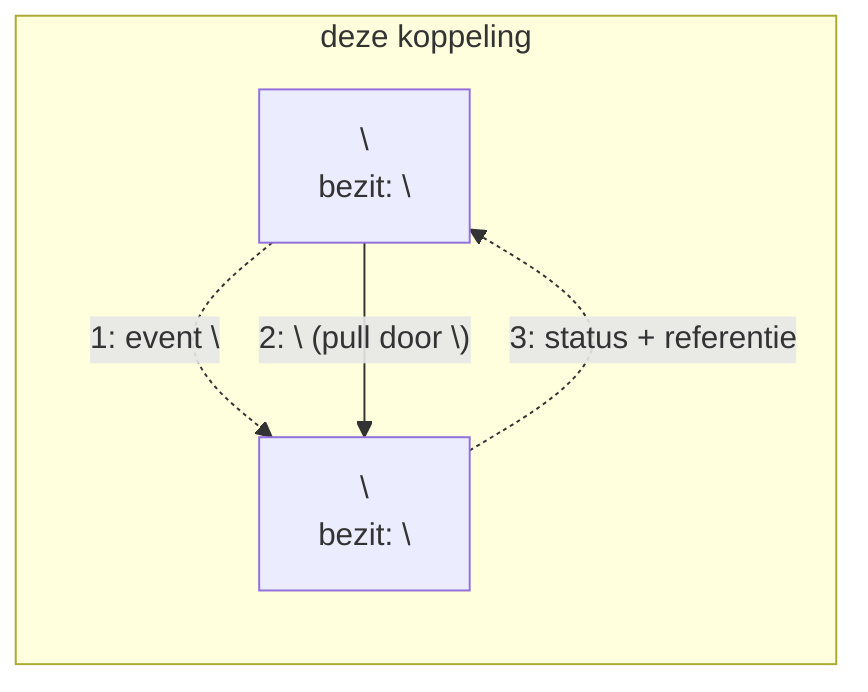
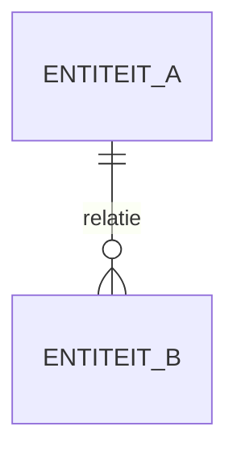
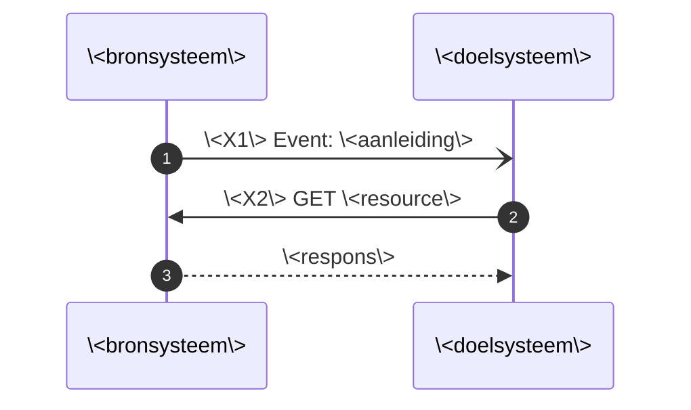

# Sjabloon koppelingspecificatie

Kopieer dit bestand naar `<koppeling>/<datum>_<naam>.md` en vul het in. De vaste opbouw houdt de documenten onderling vergelijkbaar, zodat een verwijzing als "§7" over alle koppelingspecificaties heen klopt.

Lees eerst de [uitgangspunten](uitgangspunten.md). Herhaal die niet: noem het uitgangspunt in één regel en link erheen. Dat scheelt herstructureerwerk zodra een uitgangspunt wijzigt.

**Instructies staan tussen `<!-- -->` en verdwijnen in de weergave.** Verwijder ze als het onderdeel af is.

---

<!-- Titel: noem de koppeling voluit, zonder afkortingen en zonder statusaanduiding.
     Goed:  Koppelingspecificatie onderwijscatalogus naar planning en roostering
     Fout:  Koppelingspecificatie OC-P&R: interactiepatronen (alpha) -->
# Koppelingspecificatie \<bronsysteem voluit\> naar \<doelsysteem voluit\>

<!-- Alleen herkomst. Geen niveau, geen status, geen datum: die staan in de git-historie (U10). -->
Relateert aan: #\<issue\>. Terminologie: [ADR 0021](../../../dr/0021-koppeling-versus-koppelvlak-terminologie.md).

## Inhoudsopgave

1. [Inleiding](#1-inleiding) (context, doel, scope)
2. [Procesbeeld](#2-procesbeeld)
3. [Interactieoverzicht](#3-interactieoverzicht)
4. [Informatiemodel](#4-informatiemodel)
5. [Sequentiediagrammen](#5-sequentiediagrammen)
6. [Payload-specificaties (verwijzing) en gebruiksprofiel](#6-payload-specificaties-verwijzing-en-gebruiksprofiel)
7. [Endpointbeschrijvingen (REST)](#7-endpointbeschrijvingen-rest)
8. [Reviewvragen](#8-reviewvragen)
9. [Open punten](#9-open-punten)
10. [Gerelateerde uitwerkingen](#10-gerelateerde-uitwerkingen)

## 1. Inleiding

### 1.1 Context

<!-- Waar zit deze koppeling in de keten? Begin bij het probleem, niet bij het issue.
     Noem: het stroomnummer uit het Projectoverzicht, voor wie het document is, en
     hoe het is ontstaan (werksessie, afgeleid van een ander patroon, voortbouwend op).
     Verwijs naar de instap in de README voor ketenoverzicht en afkortingen.
     Geen opsomming van losse bronnen: een bron is invoer, geen context. -->

Waar deze koppeling in de keten zit: \<in twee of drie zinnen\>. Dit is stroom \<n\> in het [Projectoverzicht](../../../../doc/OKx_Projectoverzicht.md). Ketenoverzicht, begrippen en afkortingen: de [instap in de README](README.md#context).

Scenario en persona conform [U9](uitgangspunten.md#u9-scenarios-en-personas): leerroute 1, persona Jochem. \<Wat betekent dat concreet voor deze koppeling?\>

\<Hoe is dit document ontstaan, en waar bouwt het op voort?\>

### 1.2 Doel

<!-- Twee dingen: welke vragen beantwoordt dit document, en wanneer is het geslaagd.
     Geen doelen die buiten het document liggen. -->

Deze koppelingbeschrijving is indicatief en onderbouwend, geen voorschrift aan de sector ([U1](uitgangspunten.md#u1-indicatief-en-onderbouwend-niet-voorschrijvend)).

Het document beantwoordt \<aantal\> vragen:

- \<vraag 1\>
- \<vraag 2\>
- \<vraag 3\>

Geslaagd wanneer \<toetsbaar criterium, bijvoorbeeld: beide leveranciers bouwen op basis hiervan dezelfde interactie\>.

### 1.3 Scope

<!-- Eerst positief: wat zit erin. Dan alleen de afbakeningen die anders verwarring
     geven. Sluit af met de sluitregel, zodat niemand hoeft te raden (U10). -->

In scope is \<positieve afbakening\> binnen één instelling ([ADR 0008](../../../dr/0008-scope-planning-eerst-intra-instelling.md)), voor leerroute 1 tot en met 3.

\<Aantal\> afbakeningen die anders verwarring geven:

- **\<onderwerp\>** \<waarom het er niet in zit en waar het wel hoort\>.
- **\<onderwerp\>** \<idem\>.

Al het overige valt buiten dit document, waaronder \<voorbeelden\>.

## 2. Procesbeeld

<!-- Noem de twee principes in één regel met een link; herhaal de motivering niet. -->

Resource-eigenaarschap ([U3](uitgangspunten.md#u3-resource-eigenaarschap)): \<wie bezit wat in deze koppeling\>. Notify-then-pull ([U4](uitgangspunten.md#u4-notify-then-pull)): de bezitter publiceert een dun event met een referentie, de consument haalt de resource op wanneer het hem uitkomt.

<!-- Geen genummerde opsomming die de pijlen herhaalt; dat is redundantie.
     Schrijf op wat het diagram juist NIET toont. -->

Wat het diagram niet toont: \<het asynchrone karakter, wat er inhoudelijk gebeurt, wat buiten de koppeling valt\>.

## 3. Interactieoverzicht

De interacties op deze koppeling, met per interactie het messaging-patroon. Betrouwbaarheidseisen volgen [ADR 0018](../../../dr/0018-enterprise-messaging-patronen-voor-betrouwbare-koppelvlakken.md); wat wij vastleggen is het bericht en niet het kanaal ([U5](uitgangspunten.md#u5-bericht-versus-kanaal)).

| # | Interactie | Initiator | Patroon | Synchroniciteit | Gedrag bij dubbele ontvangst | Foutafhandeling |
|---|---|---|---|---|---|---|
| \<X1\> | \<wat gebeurt er\> | \<systeem\> | [Event Message](https://www.enterpriseintegrationpatterns.com/patterns/messaging/EventMessage.html) | Asynchroon | Geen effect: event-id ([Idempotent Receiver](https://www.enterpriseintegrationpatterns.com/patterns/messaging/IdempotentReceiver.html)) | [Guaranteed Delivery](https://www.enterpriseintegrationpatterns.com/patterns/messaging/GuaranteedDelivery.html); [Dead Letter Channel](https://www.enterpriseintegrationpatterns.com/patterns/messaging/DeadLetterChannel.html) |
| \<X2\> | \<ophalen\> | \<systeem\> | [Request-Reply](https://www.enterpriseintegrationpatterns.com/patterns/messaging/RequestReply.html) (GET, alleen-lezen) | Synchroon | Geen effect (alleen-lezen) | HTTP-foutcodes |

Ordening: per \<entiteitsleutel\> blijft de berichtvolgorde behouden.

## 4. Informatiemodel

<!-- Eén erDiagram. Zeg in de eerste zin wat het toevoegt, en zet eronder alleen
     wat het model NIET kan dragen. Niet de relaties in proza herhalen. -->

\<Wat maakt dit model duidelijk dat de tekst niet doet?\>

Wat het model niet toont: \<semantiek die een diagram niet kan dragen\>.

## 5. Sequentiediagrammen

<!-- Notatie: `-)` asynchroon event, `->>` synchrone aanroep, `-->>` respons.
     Mermaid zonder puntkomma's, ook binnen aanhalingstekens: die breken de parser. -->

### 5.1 Happy flow: \<naam\>

### 5.2 Faalpad: \<naam\>

<!-- Minimaal één faalpad. Wat gebeurt er als het misgaat, en wie doet dan wat? -->

## 6. Payload-specificaties (verwijzing) en gebruiksprofiel

Gedeelde payloads staan éénmaal centraal in [`gedeeld/`](gedeeld/); dit document herhaalt ze niet maar benoemt welk deel het gebruikt.

| Onderdeel | Gebruik in deze koppeling |
|---|---|
| `\<object\>` | \<volledig, deels, of niet meegeleverd, met de reden\> |

## 7. Endpointbeschrijvingen (REST)

<!-- Nog niet uitgewerkt? Laat de sectie staan en zet erin waarom niet en wanneer
     wel. Zo blijft de nummering over alle documenten heen gelijk. -->

Endpoints die **\<systeem\>** serveert:

| Endpoint | Methode | Operatie | Parameters | Response | Statuscodes |
|---|---|---|---|---|---|
| `/\<pad\>/{id}` | GET | \<interactie\> | \<parameters\> | \<respons\> | 200, 400, 404 |

De events staan hier uitgewerkt als webhook-aflevering. Dat is een voorbeeld van een kanaal, geen voorschrift ([U5](uitgangspunten.md#u5-bericht-versus-kanaal)).

## 8. Reviewvragen

<!-- Vragen aan stakeholders, niet aan jezelf. Concreet genoeg om ja of nee op te zeggen. -->

1. \<vraag\>

## 9. Open punten

<!-- Elk open punt krijgt een concrete vraag en een vervolgstap, anders vervalt het. -->

| Vraag | Vervolgstap |
|---|---|
| \<vraag\> | \<wie doet wat, en wanneer\> |

## 10. Gerelateerde uitwerkingen

- [Uitgangspunten voor koppelingspecificaties](uitgangspunten.md): de gedeelde aannames waarop dit document steunt.
- \<andere documenten, als echte links\>
