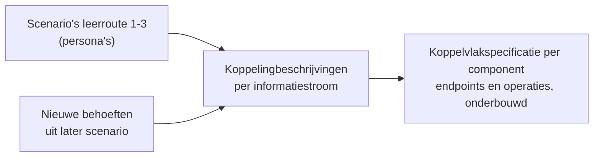

# Uitgangspunten voor koppelingspecificaties

Relateert aan: #98, #105, #119.

Deze uitgangspunten gelden voor **elke** koppelingspecificatie en payload-specificatie in deze map. Een individueel document noemt het uitgangspunt in één regel en verwijst hierheen; het herhaalt de motivering niet. Zo hoeft een wijziging in de redenering maar op één plek te gebeuren.

De uitgangspunten zijn genummerd (U1 tot en met U10) zodat je er in een document, een review of een issue naar kunt verwijzen: "conform U5".

Herkomst: de [OKx-ontwerpprincipes](../../../docs/principes.md) en de architectuurbesluiten in [`architecture/dr/`](../../../dr/). Waar een uitgangspunt op een besluit steunt, staat dat erbij. Alle aangehaalde besluiten hebben op dit moment de status voorstel.

## U1. Indicatief en onderbouwend, niet voorschrijvend

Een koppelingspecificatie beschrijft hoe een informatiestroom er in een scenario uit **kan** zien. OKx legt de sector niet op hoe een koppeling gerealiseerd moet worden; instellingen en leveranciers geven hun koppelingen zelf vorm.

Waarom we ze dan beschrijven: we hebben nog beperkt zicht op de werking van het ecosysteem. Door koppeling voor koppeling en scenario voor scenario de interacties te bestuderen, ontdekken we welke operaties, endpoints en data nodig zijn. De **som** van de koppelingbeschrijvingen levert de koppelvlakspecificatie per referentiecomponent op: de endpoints en operaties die dat component waarschijnlijk moet bieden, elk gegrond in een beschreven interactie.

De beschreven koppelingen zijn **niet uitputtend**. Nieuwe functionaliteit kan operaties vragen die niet uit de huidige scenario's naar voren komen. Voorbeeld: een studentkeuzesysteem dat namens een student onderwijs aanvraagt dat nog niet bestaat. Zo'n behoefte komt binnen als nieuw scenario met een eigen koppelingbeschrijving, en onderbouwt daarmee een nieuwe operatie op het koppelvlak. Het koppelvlak houdt die ruimte.

Sluit aan op principe 1 (design first) en principe 5 (uitbreidbaarheid).

## U2. Koppeling versus koppelvlak

Een **koppeling** is de gestandaardiseerde informatiestroom tussen twee referentiecomponenten. Een **koppelvlak** is de verzameling van alle koppelingen die één component raken. Een koppelingspecificatie beschrijft dus één stroom; de koppelvlakspecificatie is de optelsom per component.

Vastgelegd in [ADR 0021](../../../dr/0021-koppeling-versus-koppelvlak-terminologie.md).

## U3. Resource-eigenaarschap

Elk systeem bezit zijn eigen resource en is er de enige bron van. De onderwijscatalogus bezit de onderwijsspecificaties, planning bezit het onderwijsaanbod, roostering bezit het rooster, het studentinformatiesysteem bezit de verbintenissen en resultaten. Niemand kopieert de resource van een ander.

Over de koppeling gaan daarom **referenties** (uuid) en niet de resource zelf, tenzij die expliciet wordt opgevraagd. Dat voorkomt dat dezelfde gegevens op meerdere plekken een eigen leven gaan leiden.

## U4. Notify-then-pull

De bezitter van een resource **publiceert een event** zodra er iets te melden valt. Dat event is dun: het draagt de aanleiding (id en versie) plus een referentie, niet de inhoud. De consument **haalt de resource daarna zelf op**, wanneer het hem uitkomt.

Het is dus geen pull-only model: het event is de trigger, de pull is het ophalen. De combinatie voorkomt dat systemen elkaar bevragen zonder aanleiding, en voorkomt tegelijk dat een grote payload wordt gestuurd naar een ontvanger die er nog niets mee doet.

Vastgelegd in [ADR 0020](../../../dr/0020-curriculumontwerp-onderwijscatalogus-happy-flow-synchronisatie-en-federatie-adopt-klonen.md). Dit is een repo-brede keuze, geen keuze per koppeling.

## U5. Bericht versus kanaal

Een koppelingspecificatie legt het **bericht** vast: wat erin staat, wanneer het wordt verstuurd, hoe een ontvanger een herhaling herkent, en in welke volgorde berichten over dezelfde sleutel aankomen.

Hoe dat bericht bij de ontvanger komt, het **kanaal**, is een inrichtingskeuze van instelling en leverancier: een webhook, een bus, een broker of een cloud-pubsubdienst. OKx schrijft dat product niet voor.

Het kanaal is daarmee niet volledig vrij. [ADR 0018](../../../dr/0018-enterprise-messaging-patronen-voor-betrouwbare-koppelvlakken.md) is technologie-agnostisch maar niet vrijblijvend: welk kanaal je ook kiest, het moet aantoonbaar vier eigenschappen leveren.

| Eigenschap | Wat het betekent | Waarom het niet vrij is |
|---|---|---|
| Gegarandeerde aflevering | Een bericht raakt niet stil zoek | Zonder deze eigenschap merkt de keten een gemiste mutatie pas veel later |
| Idempotente verwerking | Een herhaald bericht heeft geen extra effect | Vereist een stabiel event-id in het bericht; dat is dus wel onze zorg |
| Dead-letterpad | Onverwerkbare berichten komen ergens zichtbaar terecht | Anders verdwijnt een fout zonder spoor |
| Volgorde per sleutel | Berichten over dezelfde entiteit komen in volgorde aan | Veel cloud-pubsubdiensten garanderen dit niet standaard en vragen expliciete configuratie |

De laatste is de scherpste. Twee implementaties die allebei "een bericht sturen" maar de volgorde per entiteitsleutel niet bewaken, leveren verschillende uitkomsten op bij statusovergangen.

**Open punt.** Welk afleveringsmechanisme partijen onderling kiezen is nog niet belegd. Twee systemen die beide aan het bericht voldoen maar waarvan het ene een webhook aanbiedt en het andere op een eigen broker publiceert, kunnen zonder afspraak of adapter alsnog niet koppelen. Dat is een vraag voor het koppelvlak, niet voor een afzonderlijke koppeling.

## U6. Semantiek uit de ankertabel

Begrippen komen uit de ankertabel van het [OEAPI consumer-profiel](../../../docs/specificatie/okx-oeapi-consumer-profiel/README.md) (§3.2.6): kader, beoogde leeruitkomst, specificatie, aanbod, verbintenis, resultaat. Geen verzonnen termen; subtypen voluit met backquotes.

De **leeruitkomst is de sleutel**. Specificaties verankeren erop, en onderwijsresultaten worden erop behaald ([ADR 0022](../../../dr/0022-resultaatbegrippen-conform-rosa-koi.md), conform het ROSA Kernmodel Onderwijsinformatie). Verankering gebeurt op de uuid van de leeruitkomst, niet op een tekstcode; een leesbare aanduiding mag ernaast staan.

## U7. Payload plat met verwijzingen, en de sleutelconventie

Objecten staan in **platte arrays** met een zelfverwijzende ouder-pointer, niet fysiek genest. Daardoor is elk object los adresseerbaar en los te versioneren, en hoef je geen halve boom mee te sturen om één onderdeel te wijzigen. De prijs is dat de hiërarchie niet meer uit de JSON zelf blijkt; daarom hoort er een instantieboom bij (U8).

**Sleutelconventie.** Het eigen sleutelveld van een object binnen zijn array heet `id`. Zodra een veld naar een ander object wijst, draagt het een expliciete naam die zegt waarheen: `bovenliggendSpecificatieId`, `bovenliggendAanbodId`, `leeruitkomstId`, `locatieId`, `specificatieVerwijzing.specificatieId`. Een kaal `bovenliggendId` is context-gevoelig en dus niet toegestaan.

Dit wijkt bewust af van de Open Onderwijs API, die getypeerde sleutels hanteert zoals `educationSpecificationId`. De payloads zijn Nederlandstalig en indicatief, dus die afwijking bestond al; te betrekken bij de latere binding (principe 2, OEAPI als voorkeur tenzij).

**Taal.** Veldnamen en waarden in het Nederlands, met de Engelse of OEAPI-term tussen haakjes waar dat helpt.

## U8. Machine-interpreteerbaar, met leesbare weergaven

Elke payload-specificatie draagt een **JSON Schema** (draft 2020-12) dat de vorm vastlegt: types, verplicht of optioneel, enums en patronen. Enumeraties horen daar, niet in een aparte tabel. De volwassenheid wordt op het schema zelf gemarkeerd (`$comment`), niet in de documenttitel of de doelstelling (zie U10).

Daarnaast twee gegenereerde ASCII-bomen, met `scripts/json-tree.py` tussen HTML-comment-markers:

- een **schemaboom**, die de vorm leesbaar weergeeft;
- per platte array een **instantieboom**, die de verwijzingen oplost en de hiërarchie zichtbaar maakt die in de JSON verborgen blijft.

Waarom ASCII en geen interactieve viewer: de documentatie moet GitHub-renderbaar blijven en naar PDF kunnen. Inklapbare `
`-blokken vallen daar om, want pandoc laat raw HTML vallen en print-to-PDF drukt dichtgeklapt af; de payload zou dan stil uit de PDF verdwijnen. ASCII heeft bovendien een voordeel dat een plaatje niet heeft: het is regel-voor-regel diffbaar in een review.

Draai `python3 scripts/json-tree.py --check <document>` vóór een commit. Het script faalt bij drift, dode ouder-verwijzingen, cykels en schemafouten.

Sluit aan op principe 3 (machine-interpreteerbare formaten) en principe 4 (show don't tell).

## U9. Scenario's en persona's

Documenten werken **leerroute 1** (regulier) uit aan de hand van persona [Jochem](../../../docs/specificatie/okx-oeapi-consumer-profiel/doc/persona_jochem.md), opleiding Apothekersassistent (SBB-kwalificatiedossier 23450, kwalificatie 27141). Leerroute 2 (temporiseren) en 3 (versnellen) volgen als **verschil** ten opzichte daarvan: de structuur blijft gelijk, een handvol attributen wijzigt.

Volledige leerroutes en persona's staan in het [OEAPI consumer-profiel](../../../docs/specificatie/okx-oeapi-consumer-profiel/README.md).

## U10. Scope- en documentdiscipline

- **Intra-instelling eerst.** Koppelingen worden eerst binnen één instelling uitgewerkt; federatie en cross-instelling volgen gefaseerd ([ADR 0008](../../../dr/0008-scope-planning-eerst-intra-instelling.md)).
- **Scope sluit af.** Een document benoemt positief wat in scope is, noemt de afbakeningen die anders verwarring geven, en sluit af met de regel dat al het overige buiten het document valt. Een lezer hoeft dan niet te raden of iets vergeten of bewust weggelaten is.
- **Doel is toetsbaar.** Een document benoemt welke vragen het beantwoordt en wanneer het geslaagd is.
- **Geen statusaanduiding in de inhoud.** Woorden als "alpha" of "een eerste versie" horen niet in een titel, doel of scope. De volwassenheid van een artefact noteer je op dat artefact (bijvoorbeeld op het schema); de status van het werk staat in de pull request en de git-historie.
- **Geen metadatakop.** Auteurschap en datums komen uit de git-historie. Bovenaan staat alleen een regel met de herkomst ("Relateert aan: #12").
- **Verwijzingen zijn links**, ook naar besluiten en naar andere documenten in deze map.

De bredere schrijfstijl staat in [`.cursor/rules/docs-style.mdc`](../../../../.cursor/rules/docs-style.mdc).

## Gerelateerde documenten

- [Sjabloon koppelingspecificatie](sjabloon-koppelingspecificatie.md) en [sjabloon payload-specificatie](sjabloon-payload-specificatie.md): de lege opzet om mee te beginnen.
- [Instap voor nieuwkomers](README.md): ketenoverzicht, hoofdplaat, afkortingenlegenda en leesvolgorde.
- [OKx-ontwerpprincipes](../../../docs/principes.md): de principes waarop deze uitgangspunten steunen.
