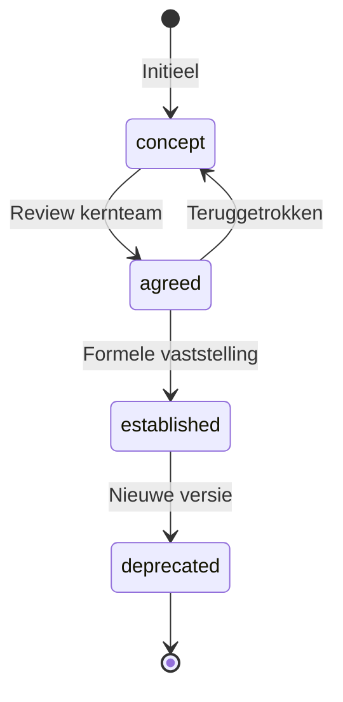

# Student kiest op het OEAPI-datamodel

Paragraaf 4 en 5 uit het specificatiedocument van 1 mei 2026, hier losgetrokken omdat dit het bruikbaarste deel van die ronde is.

Relateert aan: #265, #266.

## Herkomst en status

| | |
|---|---|
| Komt uit | [`20260501_Specificatie_document_OKx_OEAPI_profiel.md`](20260501_Specificatie_document_OKx_OEAPI_profiel.md), paragraaf 4 en 5 |
| Datum | 1 mei 2026 |
| Hoe het is gemaakt | Een eerste vertaalpoging van de OKx-specificatie naar OEAPI, met AI als hulpmiddel |
| Status | Werkmateriaal, geen vastgesteld kader |

De bredere leeswijzer staat in de [README](../README.md) van deze map. Kort: deze ronde liep top-down vanaf de OEAPI-objecten, terwijl het huidige werk bottom-up vanuit de eisen vertrekt. Wie hieruit citeert, noemt de datum erbij.

## Waarom juist dit deel

Twee dingen overleven de verschuiving in aanpak, en ze staan allebei hier.

- **De keten van student kiest.** Paragraaf 4 zet de onderwijscatalogus neer als centraal distributiepunt en beschrijft de kernstroom van het kiezen.
- **De leeruitkomsthierarchie.** Paragraaf 5 legt de OKx-structuur op het recursieve datamodel van OEAPI, met bottom-up aggregatie, een uitgewerkt voorbeeld voor de apothekersassistent, de gerichte acyclische graaf met hergebruik over meerdere ouders, en CompetentNL-referenties als matchingsleutel.

Dat sluit aan op het werk van vandaag: de leeruitkomst als verbindende sleutel ([ADR 0026](https://github.com/Npuls-OKx/Public/blob/dev/Referentiemateriaal/adr/0026-leeruitkomst-als-verbindende-sleutel.md)), het informatiemodel en de keuze-requirements.

## De tekst

Hieronder staat de tekst ongewijzigd, met de oorspronkelijke paragraafnummering.

## 4. De "Student Kiest"-keten

### 4.1 De Onderwijscatalogus als centraal distributiepunt

In dit stuk schetsen we het proces nader. Dit breiden we later uit.

Het ArchiMate-model positioneert de **OC** als centraal distributiepunt. Alle informatiestromen in scope lopen **door** of **naar** de OC:

```
                          ┌───────────────────┐
  Curriculum ontwerptool ─┤                   ├─▶ SKS (passend aanbod)
  ("Grofmazig ontwerp")   │                   │
                          │  Onderwijs-       ├─▶ SVS (resultaat structuren)
  Planningssysteem ───────┤  catalogus (OC)   │
  ("onderwijsspecificatie-│                   ├─▶ Roostersysteem (Fijnmazig aanbod)
   specifieke planning")  │                   │
                          │                   ├─▶ LMS (onderwijsspecificatie + leermiddelen)
  SKS ────────────────────┤                   │
  ("Leervraag in LO,      │                   ├─▶ Planningssysteem
   domein, leervorm")     │                   │
                          │                   ├─▶ Sector Edubroker
                          │                   │   ("Alle sector onderwijsspecificaties
                          │                   │    i.r.t. leeruitkomsten")
                          │                   │
                          │                   ├─▶ Curriculum ontwerptool
                          └───────────────────┘   ("Herbruikbare onderwijsspecificaties
                                                    aanbod")
```

**Het OKx-profiel is primair het profiel waarmee de OC via OEAPI communiceert.** Elke afnemer (SKS, planner, LMS, andere instelling) ontvangt dezelfde verrijkte structuur en haalt eruit wat relevant is.

### 4.2 De "Student Kiest"-keten (kernstroom)

Het ArchiMate-model nummert de kernstroom expliciet:

| Stap | Stroom                                                                          | Van → Naar   | OEAPI-entiteiten                                        |
| ---- | ------------------------------------------------------------------------------- | ------------ | ------------------------------------------------------- |
| 1    | Intake resultaat (studentidentiteit, leervraag in gewenste LO's, leercontext)   | Intake → SVS | `Person`, `LearningOutcome` (referenties)               |
| 2    | Keuzeproces starten (administratieve aanmelding)                                | SVS → SKS    | `Association`-referentie                                |
| 3    | Aanbod passend op leervraag (uitgedrukt in LO's, domein, leervorm)              | SKS → **OC** | Query op `LearningOutcome`, `modesOfDelivery`, leervorm |
| 4    | Passend aanbod: **programmes, courses, learning components <> test components** | **OC** → SKS | Volledige OEAPI-hiërarchie + OKx-extensies              |
| 5    | Concept-leerroute als keuze → intekening                                        | SKS → SVS    | Genest `Programme` als track                            |

Stap 4 noemt de OEAPI-entiteiten letterlijk. Het OKx-profiel verrijkt die entiteiten met alles wat de keten nodig heeft.

## 5. OKx-hiërarchie op het OEAPI recursieve datamodel

### 5.1 OEAPI ondersteunt recursie

```
Programme ──parentId/childIds──▶ Programme (recursief, onbeperkte diepte)
  │
  └──programmeIds──▶ Course (N:M — course kan bij meerdere programmes horen)
                       │
                       ├──courseId──▶ LearningComponent ──parentId/childIds──▶ LearningComponent (recursief)
                       │
                       └──courseId──▶ TestComponent ──parentId/childIds──▶ TestComponent (recursief)

LearningOutcome ──parentIds/childIds──▶ LearningOutcome (DAG, meerdere ouders mogelijk)
  ▲ gerefereerd via learningOutcomeIds vanuit Programme, Course, LearningComponent, TestComponent
```

### 5.2 Mapping OKx → OEAPI

| OKx concept                                | OEAPI entiteit                        | Hoe                                                                   | Credential bij afronding               |
| ------------------------------------------ | ------------------------------------- | --------------------------------------------------------------------- | -------------------------------------- |
| **Kwalificatie / opleiding**               | `Programme` (root)                    | `programmeType: "programme"`                                          | **Diploma**                            |
| **Leerroute** (globaal, vóór inschrijving) | `Programme` (kind)                    | `programmeType: "track"` of `"specialisation"`                        | (onderdeel van diploma)                |
| **Keuzedeel**                              | `Programme` (kind) of `Course`        | `programmeType: "minor"` of als losse `Course`                        | **MBO-certificaat** / Keuzedeel-bewijs |
| **Opleidingsonderdeel / leertaak**         | `Course`                              | Eigen `studyLoad`, `learningOutcomeIds`. Kan bij meerdere programmes. | **Certificaat** / **Microcredential**  |
| **Leeractiviteit** (keuzeniveau student)   | `LearningComponent` (niveau 1)        | Collectie lesopdrachten + lesuitkomsten                               | **Microcredential** / badge            |
| **Lesopdracht / les**                      | `LearningComponent` (kind, recursief) | Genest via `parentId`/`childIds`                                      | **Badge**                              |
| **Toets / examen**                         | `TestComponent`                       | Onder dezelfde `Course`. Gedeelde `learningOutcomeIds`                | (beoordeelt bovenliggende LO's)        |
| **Leeruitkomst** (summatief)               | `LearningOutcome` (root)              | Gerefereerd vanuit Programme, Course, LearningComponent               | —                                      |
| **Lesuitkomst** (formatief)                | `LearningOutcome` (kind)              | Genest via `parentIds`/`childIds`. DAG-structuur.                     | —                                      |

### 5.3 Bottom-up aggregatie: de som klopt

Een **fundamenteel ontwerpprincipe**: de onderwijsspecificatie aggregeert bottom-up. De som van alle lessen onder een course moet kloppen met de course-specificatie, en de som van alle courses onder een programme moet kloppen met het programme — en idealiter uitlijnen met het top-down kwalificatiedossier van SBB.

```
Programme "Apothekersassistent" (level: mbo-4, studyLoad: 4800 SBU)
│  ▸ learningOutcomes: [alle kerntaak-afgeleide LO's]
│  ▸ OKx: credentialDocument: { type: diploma, register: "DUO" }
│  ▸ OKx: qualificationReference: { scheme: "crebo", dossier: "23450", qualification: "27141" }
│  ▸ SOM studyLoad children = 4800 SBU ✓
│
├── Programme "Track: Regulier voltijd" (programmeType: track)
│   │  ▸ OKx: leerrouteType: regulier
│   │  ▸ SOM studyLoad courses = 4800 SBU ✓
│   │
│   ├── Course "Baliegesprekken en cliëntcommunicatie" (studyLoad: 240 SBU)
│   │   │  ▸ learningOutcomes: ["Voert professionele baliegesprekken",
│   │   │  │                     "Cliëntgericht handelen"]
│   │   │  ▸ OKx: credentialDocument: { type: microcredential, register: "edubadges.nl" }
│   │   │  ▸ OKx: educationSpecification:
│   │   │  │    deliveryForm: simulation
│   │   │  │    timeAllocation: { bot: 160, oot: 80, unit: sbu }
│   │   │  │    roomType: simulation_practice_room
│   │   │  │    expertiseProfiles: ["roleplay_training", "pharmaceutical"]
│   │   │  │    learningResourceGroups: ["simulation_material", "digital_workstation"]
│   │   │  ▸ SOM componentStudyLoad children = 240 SBU ✓
│   │   │
│   │   ├── LearningComponent "Leeractiviteit: Gespreksvoering simulatie"
│   │   │   │  ▸ learningComponentType: practical
│   │   │   │  ▸ OKx: hierarchyLevel: learning_activity
│   │   │   │  ▸ OKx: educationSpecification:
│   │   │   │  │    deliveryForm: simulation
│   │   │   │  │    timeAllocation: { bot: 80, oot: 40, unit: sbu }
│   │   │   │  │    roomType: simulation_practice_room
│   │   │   │  │    roomRequirements: "balie, wachtruimte, kassasysteem"
│   │   │   │  │    expertiseProfiles: ["roleplay_training"]
│   │   │   │  │    learningResourceGroups: ["simulation_material"]
│   │   │   │  │    spreadPattern: "2x per week, 8 weken"
│   │   │   │  ▸ OKx: credentialDocument: { type: microcredential, register: "edubadges.nl" }
│   │   │   │  ▸ OKx: participationRequirements: []
│   │   │   │  ▸ learningOutcomes: ["Voert professionele baliegesprekken"]
│   │   │   │
│   │   │   ├── LearningComponent "Les: Gesprek bij emotionele cliënt"
│   │   │   │     ▸ OKx: hierarchyLevel: lesson_assignment
│   │   │   │     ▸ OKx: educationSpecification:
│   │   │   │     │    deliveryForm: simulation
│   │   │   │     │    timeAllocation: { bot: 20, oot: 10, unit: sbu }
│   │   │   │     │    roomType: simulation_practice_room
│   │   │   │     │    expertiseProfiles: ["roleplay_training"]
│   │   │   │     ▸ OKx: credentialDocument: { type: badge, register: "edubadges.nl" }
│   │   │   │     ▸ learningOutcomes: [lesuitkomst: "Herkent en hanteert
│   │   │   │     │                     emoties in baliegesprek"]
│   │   │   │
│   │   │   ├── LearningComponent "Les: Medicatie-informatie verstrekken"
│   │   │   │     ▸ (zelfde structuur, andere lesuitkomsten)
│   │   │   │
│   │   │   └── LearningComponent "Les: Culturele sensitiviteit"
│   │   │         ▸ (zelfde structuur)
│   │   │
│   │   ├── LearningComponent "Leeractiviteit: Farmaceutische theorie"
│   │   │   │  ▸ learningComponentType: lecture
│   │   │   │  ▸ OKx: educationSpecification:
│   │   │   │  │    deliveryForm: classroom
│   │   │   │  │    timeAllocation: { bot: 40, oot: 40, unit: sbu }
│   │   │   │  │    roomType: lecture_hall
│   │   │   │  │    expertiseProfiles: ["pharmaceutical"]
│   │   │   │  │    learningResourceGroups: ["digital_workstation", "professional_literature"]
│   │   │   │  ▸ OKx: participationRequirements: []
│   │   │   │  (... geneste lesopdrachten ...)
│   │   │
│   │   └── TestComponent "Praktijkexamen baliegesprekken"
│   │         ▸ testComponentType: life_skills_test
│   │         ▸ learningOutcomes: [zelfde LO's als bovenliggende course]
│   │         ▸ OKx: assessmentLevel: summative
│   │         ▸ OKx: assessmentScope: { workProcessCodes: ["B1-K1-W1"], learningOutcomeIds: ["<LO-ids>"] }
│   │         ▸ OKx: educationSpecification:
│   │         │    roomType: simulation_practice_room
│   │         │    expertiseProfiles: ["assessor_pharmaceutical"]
│   │         │    timeAllocation: { bot: 4, unit: sbu }
│   │
│   ├── Course "Farmaceutische kennis en medicatieveiligheid" (studyLoad: 360 SBU)
│   │   └── (... zelfde structuur, andere leervormen/LO's ...)
│   │
│   ├── Course "Beroepspraktijkvorming" (studyLoad: 1200 SBU)
│   │   │  ▸ OKx: educationSpecification:
│   │   │  │    deliveryForm: work_based_learning
│   │   │  │    roomType: external_workplace
│   │   │  │    expertiseProfiles: ["practice_supervisor"]
│   │   │  (gedeeld via programmeIds — hoort ook bij track "Versneld")
│   │   └── (... stage-activiteiten als LearningComponents ...)
│   │
│   └── (... overige courses tot SOM = 4800 SBU ...)
│
├── Programme "Track: Versneld" (programmeType: track)
│   │  ▸ OKx: learningRouteType: versneld
│   │  ▸ SOM studyLoad = 3600 SBU (minder SBU door EVC/vrijstellingen)
│   │  ▸ Deelt courses via programmeIds (N:M)
│   └── (... subset van courses, evt. gecomprimeerd ...)
│
└── Course "Keuzedeel: Digitale vaardigheden" (studyLoad: 240 SBU)
    ▸ programmeIds: [root + beide tracks] (beschikbaar in alle routes)
    ▸ OKx: credentialDocument: { type: mbo_certificaat, register: "DUO" }
```

**De aggregatie-invariant:** `SOM(children.studyLoad) = parent.studyLoad` op elk niveau. Dit maakt het mogelijk om vanuit een willekeurig niveau omhoog te aggregeren naar het kwalificatiedossier.

**Kwalificatiedossier-alignment:** De root `Programme` verwijst via `qualificationReference` naar het kwalificatiedossier (Crebo/SBB-scheme expliciet). De `learningOutcomes` op programmaniveau dekken alle kerntaken/werkprocessen. Per `Course` en `LearningComponent` is traceerbaar welke LO's (en dus welke kerntaken) worden afgedekt.

### 5.4 Voorbeeld: LearningOutcome-hiërarchie met CompetentNL-taxonomieën

[CompetentNL](https://competentnl.nl/page/view/b1741ead-e4e8-4974-8aea-1399ae22284a/data-taxonomieen-van-competentnl) is de nationale standaard voor het beschrijven van skills, ontwikkeld door SBB, UWV, TNO en CBS. De taxonomie is beschikbaar als Linked Open Data (RDF/OWL/SKOS) via een SPARQL-endpoint en API. CompetentNL onderscheidt twee hiërarchieën:

| Taxonomie                   | Lagen                                                                     | Omvang                                                   | Basis                                    |
| --------------------------- | ------------------------------------------------------------------------- | -------------------------------------------------------- | ---------------------------------------- |
| **Vaardighedentaxonomie**   | 3 lagen: 6 algemene → 19 generieke → 112 specifieke vaardigheidsconcepten | Hard skills (leerbaar) + soft skills (ontwikkelbaar)     | ESCO, ONet, wetenschappelijke literatuur |
| **Kennisgebiedentaxonomie** | 4 lagen, gebaseerd op ISCED-F 2013                                        | Vakspecifieke feiten, principes, theorieën en praktijken | ISCED-F 2013, CBS-rubrieken              |

CompetentNL koppelt skills aan **alle mbo-kwalificaties** (kwalificaties, keuzedelen, certificaten) en is bezig met uitbreiding naar hbo en non-formeel onderwijs. De relatie `cnl:requires` verbindt beroepen met skills.

#### Waarom CompetentNL als referentie voor LearningOutcome?

1. **Gedeelde taal**: Leeruitkomsten in OEAPI beschrijven *wat* een student na afronding kan. CompetentNL beschrijft *welke vaardigheden en kennisgebieden* nodig zijn op de arbeidsmarkt. De koppeling maakt leeruitkomsten matchbaar met beroepen en vacatures.
2. **Cross-instelling vergelijkbaarheid**: Als instelling A en B dezelfde CompetentNL-referenties gebruiken voor hun leeruitkomsten, is automatisch zichtbaar welke overlap en complementariteit er is.
3. **Modulair studeren**: Bij bottom-up samenstellen van een leerroute (scenario E) kan het SKS leeruitkomsten matchen op CompetentNL-skills om te bepalen welke kwalificatie-eisen al zijn afgedekt.
4. **Arbeidsmarktaansluiting**: SBB koppelt CompetentNL aan de complete mbo-kwalificatiestructuur; OEAPI LearningOutcomes met CompetentNL-referenties sluiten dus direct aan op het kwalificatiedossier.

#### OEAPI-kernvelden die CompetentNL faciliteren

Het bestaande `LearningOutcome`-schema biedt al aanknopingspunten:

| OEAPI-veld                                             | CompetentNL-mapping                                                                 |
| ------------------------------------------------------ | ----------------------------------------------------------------------------------- |
| `fieldsOfStudy` (ISCED-F, 2-6 digits)                  | Direct bruikbaar voor CompetentNL kennisgebiedentaxonomie (laag 1-3 = ISCED-F 2013) |
| `complexityLevel` (extensible enum: bloom1-6, solo0-4) | Aanvulbaar met CompetentNL vaardigheidsniveaus (als die beschikbaar komen)          |
| `otherCodes` (array IdentifierEntry)                   | Ideaal voor CompetentNL skill-URI's als secundaire code                             |
| `parentIds` / `childIds`                               | DAG-structuur voor leeruitkomst → lesuitkomst hiërarchie                            |

#### OKx-extensie op LearningOutcome voor CompetentNL

Naast de bestaande OKx-attributen (`hierarchyLevel`, `standardisationStatus`, `qualificationReference`, `sectorReference`) voegen we toe:

| Attribuut                | Type                             | Beschrijving                                                                                                                                                                                                                                                                         |
| ------------------------ | -------------------------------- | ------------------------------------------------------------------------------------------------------------------------------------------------------------------------------------------------------------------------------------------------------------------------------------ |
| `competentNlRefs`        | array of object                  | Referenties naar CompetentNL-concepten. Per referentie: `{ uri: string, type: enum, label: string }`. `type`: `vaardigheid_algemeen`, `vaardigheid_generiek`, `vaardigheid_specifiek`, `kennisgebied`. `uri`: de CompetentNL Linked Data URI. `label`: leesbare naam (voor display). |
| `competentNlRelatieType` | enum: `primair`, `ondersteunend` | Geeft aan of deze LO primair of ondersteunend is voor het gekoppelde CompetentNL-concept. Volgt het CompetentNL-patroon van kernrelaties vs. contextuele relaties.                                                                                                                   |

#### Uitgewerkt voorbeeld: Apothekersassistent (mbo-4)

Hieronder de LearningOutcome-boom voor het voorbeeld uit §5.3. Leeruitkomsten zijn afgeleid van het kwalificatiedossier (Crebo 23450 / kwalificatie 27141) en gekoppeld aan CompetentNL vaardigheden en kennisgebieden.

```
LearningOutcome "LO-APOTH-001" (root — summatieve leeruitkomst)
│  name: "Voert professionele baliegesprekken"
│  description: "De beginnend beroepsbeoefenaar voert zelfstandig baliegesprekken
│  │              met cliënten over medicatiegebruik, bijwerkingen en
│  │              gezondheidsadvies, rekening houdend met de cliënt-context."
│  fieldsOfStudy: "0916"  (ISCED-F: Pharmacy)
│  complexityLevel: bloom_3  (Apply)
│  ▸ OKx: hierarchyLevel: learning_outcome
│  ▸ OKx: standardisationStatus: aligned
│  ▸ OKx: qualificationReference:
│  │    scheme: "crebo"
│  │    dossier: "23450"
│  │    qualification: "27141"
│  │    kerntaak: "B1-K1"
│  │    werkproces: "B1-K1-W1"
│  ▸ OKx: competentNlRefs:
│  │    - uri: "cnl:skill/specifiek/mondelinge-communicatie"
│  │      type: vaardigheid_specifiek
│  │      label: "Mondelinge communicatie"
│  │      relatieType: primair
│  │    - uri: "cnl:skill/specifiek/klantgericht-handelen"
│  │      type: vaardigheid_specifiek
│  │      label: "Klantgericht handelen"
│  │      relatieType: primair
│  │    - uri: "cnl:knowledge/0916"
│  │      type: kennisgebied
│  │      label: "Farmacie"
│  │      relatieType: primair
│  │    - uri: "cnl:skill/generiek/communiceren"
│  │      type: vaardigheid_generiek
│  │      label: "Communiceren"
│  │      relatieType: primair
│  │    - uri: "cnl:skill/specifiek/empathie-tonen"
│  │      type: vaardigheid_specifiek
│  │      label: "Empathie tonen"
│  │      relatieType: ondersteunend
│  ▸ otherCodes:
│  │    - codeType: "competentnl-skill"
│  │      code: "cnl:skill/specifiek/mondelinge-communicatie"
│  │    - codeType: "competentnl-skill"
│  │      code: "cnl:skill/specifiek/klantgericht-handelen"
│  │    - codeType: "sbb-werkproces"
│  │      code: "B1-K1-W1"
│  │
│  ├── LearningOutcome "LO-APOTH-001a" (kind — formatieve lesuitkomst)
│  │     name: "Herkent en hanteert emoties in baliegesprek"
│  │     description: "De student herkent emotionele reacties bij cliënten
│  │     │              (angst, boosheid, verdriet) en past de gespreksvoering
│  │     │              aan met actief luisteren en empathische bevestiging."
│  │     fieldsOfStudy: "0916"
│  │     complexityLevel: bloom_4  (Analyse)
│  │     ▸ OKx: hierarchyLevel: lesson_outcome
│  │     ▸ OKx: standardisationStatus: concept
│  │     ▸ OKx: qualificationReference:
│  │     │    scheme: "crebo"
│  │     │    dossier: "23450"
│  │     │    qualification: "27141"
│  │     │    kerntaak: "B1-K1"
│  │     │    werkproces: "B1-K1-W1"
│  │     ▸ OKx: competentNlRefs:
│  │     │    - uri: "cnl:skill/specifiek/empathie-tonen"
│  │     │      type: vaardigheid_specifiek
│  │     │      label: "Empathie tonen"
│  │     │      relatieType: primair
│  │     │    - uri: "cnl:skill/specifiek/conflicthantering"
│  │     │      type: vaardigheid_specifiek
│  │     │      label: "Conflicthantering"
│  │     │      relatieType: ondersteunend
│  │     │    - uri: "cnl:skill/generiek/sociaal-communicatief"
│  │     │      type: vaardigheid_generiek
│  │     │      label: "Sociaal-communicatief handelen"
│  │     │      relatieType: primair
│  │
│  ├── LearningOutcome "LO-APOTH-001b" (kind — formatieve lesuitkomst)
│  │     name: "Verstrekt correcte medicatie-informatie aan cliënt"
│  │     description: "De student geeft gestructureerde en begrijpelijke
│  │     │              mondelinge uitleg over dosering, bijwerkingen,
│  │     │              interacties en bewaarcondities van gangbare medicijnen."
│  │     fieldsOfStudy: "0916"
│  │     complexityLevel: bloom_3  (Apply)
│  │     ▸ OKx: hierarchyLevel: lesson_outcome
│  │     ▸ OKx: standardisationStatus: concept
│  │     ▸ OKx: qualificationReference:
│  │     │    scheme: "crebo"
│  │     │    dossier: "23450"
│  │     │    qualification: "27141"
│  │     │    kerntaak: "B1-K1"
│  │     │    werkproces: "B1-K1-W2"
│  │     ▸ OKx: competentNlRefs:
│  │     │    - uri: "cnl:knowledge/0916"
│  │     │      type: kennisgebied
│  │     │      label: "Farmacie"
│  │     │      relatieType: primair
│  │     │    - uri: "cnl:skill/specifiek/mondelinge-communicatie"
│  │     │      type: vaardigheid_specifiek
│  │     │      label: "Mondelinge communicatie"
│  │     │      relatieType: primair
│  │     │    - uri: "cnl:skill/specifiek/informatieverstrekking"
│  │     │      type: vaardigheid_specifiek
│  │     │      label: "Informatieverstrekking"
│  │     │      relatieType: primair
│  │     │    - uri: "cnl:knowledge/091601"
│  │     │      type: kennisgebied
│  │     │      label: "Farmacologie"
│  │     │      relatieType: primair
│  │
│  └── LearningOutcome "LO-APOTH-001c" (kind — formatieve lesuitkomst)
│        name: "Past communicatie aan bij culturele achtergrond cliënt"
│        description: "De student herkent culturele invloeden op
│        │              gezondheidsbeleving en past taalgebruik, non-verbale
│        │              communicatie en adviesstijl hierop aan."
│        fieldsOfStudy: "0916"
│        complexityLevel: bloom_5  (Evaluate)
│        ▸ OKx: hierarchyLevel: lesson_outcome
│        ▸ OKx: standardisationStatus: concept
│        ▸ OKx: competentNlRefs:
│        │    - uri: "cnl:skill/specifiek/interculturele-communicatie"
│        │      type: vaardigheid_specifiek
│        │      label: "Interculturele communicatie"
│        │      relatieType: primair
│        │    - uri: "cnl:skill/generiek/communiceren"
│        │      type: vaardigheid_generiek
│        │      label: "Communiceren"
│        │      relatieType: primair
│        │    - uri: "cnl:skill/specifiek/diversiteitsbewustzijn"
│        │      type: vaardigheid_specifiek
│        │      label: "Diversiteitsbewustzijn"
│        │      relatieType: ondersteunend

LearningOutcome "LO-APOTH-002" (root — summatieve leeruitkomst)
│  name: "Bereidt farmaceutische producten"
│  description: "De beginnend beroepsbeoefenaar bereidt zelfstandig magistrale
│  │              en generieke farmaceutische producten volgens GMP-richtlijnen,
│  │              voert kwaliteitscontroles uit en documenteert het bereidingsproces."
│  fieldsOfStudy: "0916"
│  complexityLevel: bloom_3  (Apply)
│  ▸ OKx: hierarchyLevel: learning_outcome
│  ▸ OKx: standardisationStatus: aligned
│  ▸ OKx: qualificationReference:
│  │    scheme: "crebo"
│  │    dossier: "23450"
│  │    qualification: "27141"
│  │    kerntaak: "B1-K2"
│  │    werkproces: "B1-K2-W1"
│  ▸ OKx: competentNlRefs:
│  │    - uri: "cnl:skill/specifiek/prepareren"
│  │      type: vaardigheid_specifiek
│  │      label: "Prepareren en bereiden"
│  │      relatieType: primair
│  │    - uri: "cnl:skill/specifiek/kwaliteitscontrole"
│  │      type: vaardigheid_specifiek
│  │      label: "Kwaliteitscontrole uitvoeren"
│  │      relatieType: primair
│  │    - uri: "cnl:knowledge/0916"
│  │      type: kennisgebied
│  │      label: "Farmacie"
│  │      relatieType: primair
│  │    - uri: "cnl:skill/specifiek/nauwkeurig-werken"
│  │      type: vaardigheid_specifiek
│  │      label: "Nauwkeurig werken"
│  │      relatieType: primair
│  │    - uri: "cnl:skill/generiek/procedures-volgen"
│  │      type: vaardigheid_generiek
│  │      label: "Procedures en protocollen volgen"
│  │      relatieType: primair
│  │    - uri: "cnl:skill/specifiek/documenteren"
│  │      type: vaardigheid_specifiek
│  │      label: "Documenteren en registreren"
│  │      relatieType: ondersteunend
│  │
│  ├── LearningOutcome "LO-APOTH-002a" (kind — formatieve lesuitkomst)
│  │     name: "Weegt en meet grondstoffen conform voorschrift"
│  │     complexityLevel: bloom_3
│  │     ▸ OKx: hierarchyLevel: lesson_outcome
│  │     ▸ OKx: competentNlRefs:
│  │     │    - uri: "cnl:skill/specifiek/nauwkeurig-werken"
│  │     │      type: vaardigheid_specifiek
│  │     │      label: "Nauwkeurig werken"
│  │     │      relatieType: primair
│  │     │    - uri: "cnl:skill/specifiek/meten-en-wegen"
│  │     │      type: vaardigheid_specifiek
│  │     │      label: "Meten en wegen"
│  │     │      relatieType: primair
│  │
│  ├── LearningOutcome "LO-APOTH-002b" (kind — formatieve lesuitkomst)
│  │     name: "Voert eindcontrole uit op bereid product"
│  │     complexityLevel: bloom_5  (Evaluate)
│  │     ▸ OKx: hierarchyLevel: lesson_outcome
│  │     ▸ OKx: competentNlRefs:
│  │     │    - uri: "cnl:skill/specifiek/kwaliteitscontrole"
│  │     │      type: vaardigheid_specifiek
│  │     │      label: "Kwaliteitscontrole uitvoeren"
│  │     │      relatieType: primair
│  │     │    - uri: "cnl:skill/specifiek/kritisch-denken"
│  │     │      type: vaardigheid_specifiek
│  │     │      label: "Kritisch denken"
│  │     │      relatieType: ondersteunend
│  │
│  └── LearningOutcome "LO-APOTH-002c" (kind — formatieve lesuitkomst)
│        name: "Documenteert bereidingsproces in apotheekinformatiesysteem"
│        complexityLevel: bloom_3
│        ▸ OKx: hierarchyLevel: lesson_outcome
│        ▸ OKx: competentNlRefs:
│        │    - uri: "cnl:skill/specifiek/documenteren"
│        │      type: vaardigheid_specifiek
│        │      label: "Documenteren en registreren"
│        │      relatieType: primair
│        │    - uri: "cnl:skill/specifiek/digitale-vaardigheden"
│        │      type: vaardigheid_specifiek
│        │      label: "Digitale vaardigheden"
│        │      relatieType: ondersteunend

LearningOutcome "LO-APOTH-003" (root — summatieve leeruitkomst)
│  name: "Handelt medicatieveilig"
│  description: "De beginnend beroepsbeoefenaar signaleert, voorkomt en
│  │              rapporteert medicatiefouten en -risico's conform de geldende
│  │              veiligheidsprotocollen en wet- en regelgeving."
│  fieldsOfStudy: "0913"  (ISCED-F: Nursing and caring)
│  complexityLevel: bloom_5  (Evaluate)
│  ▸ OKx: hierarchyLevel: learning_outcome
│  ▸ OKx: standardisationStatus: aligned
│  ▸ OKx: qualificationReference:
│  │    scheme: "crebo"
│  │    dossier: "23450"
│  │    qualification: "27141"
│  │    kerntaak: "B1-K3"
│  │    werkproces: "B1-K3-W1"
│  ▸ OKx: competentNlRefs:
│       - uri: "cnl:skill/specifiek/veiligheidsprotocollen-toepassen"
│         type: vaardigheid_specifiek
│         label: "Veiligheidsprotocollen toepassen"
│         relatieType: primair
│       - uri: "cnl:skill/specifiek/risicosignalering"
│         type: vaardigheid_specifiek
│         label: "Risico's signaleren"
│         relatieType: primair
│       - uri: "cnl:skill/generiek/kwaliteitsbewust-handelen"
│         type: vaardigheid_generiek
│         label: "Kwaliteitsbewust handelen"
│         relatieType: primair
│       - uri: "cnl:knowledge/0916"
│         type: kennisgebied
│         label: "Farmacie"
│         relatieType: primair
│       - uri: "cnl:knowledge/0413"
│         type: kennisgebied
│         label: "Management en administratie"
│         relatieType: ondersteunend
```

#### DAG-structuur: meerdere ouders, hergebruik

Het OEAPI `LearningOutcome`-model ondersteunt meerdere ouders (`parentIds` is een array). Dit maakt hergebruik van lesuitkomsten over courses heen mogelijk:

```
LO-APOTH-001  "Voert professionele baliegesprekken"
  ├── LO-APOTH-001a  "Herkent en hanteert emoties"
  ├── LO-APOTH-001b  "Verstrekt correcte medicatie-informatie"
  └── LO-APOTH-001c  "Past communicatie aan bij culturele achtergrond"

LO-APOTH-003  "Handelt medicatieveilig"
  ├── LO-APOTH-001b  "Verstrekt correcte medicatie-informatie"  ← GEDEELD
  │     parentIds: [LO-APOTH-001, LO-APOTH-003]
  └── ...
```

Lesuitkomst `LO-APOTH-001b` hoort bij twee summatieve leeruitkomsten: "Baliegesprekken" en "Medicatieveiligheid". Bij het correct verstrekken van medicatie-informatie draag je aan beide bij. Dit is essentieel voor:

- **Modulair studeren**: een student die course "Baliegesprekken" afrond, heeft ook deels aan "Medicatieveiligheid" voldaan.
- **Cross-instelling erkenning**: instelling B ziet dat de student deze lesuitkomst al heeft behaald en hoeft dat deel niet opnieuw te toetsen.

#### CompetentNL-referenties als matchingsleutel

```
Student kiest in SKS: "Ik wil werken aan klantgericht handelen in de farmacie"

SKS query naar OC:
  → filter LearningOutcomes waar competentNlRefs bevat:
      uri LIKE "cnl:skill/specifiek/klantgericht-handelen"
      AND fieldsOfStudy = "0916"

OC retourneert:
  → LO-APOTH-001 "Voert professionele baliegesprekken"
    → gekoppeld aan Course "Baliegesprekken en cliëntcommunicatie" (240 SBU)
    → gekoppeld aan LearningComponent "Gespreksvoering simulatie"
  → Student ziet: leervorm = simulatie, 80 BOT, praktijkruimte, 8 weken

Planner berekent:
  → CompetentNL expertiseProfiel "rollenspel_training" + "farmaceutisch"
    → match met beschikbare docenten
```

---

## Bijlage: regels bij de leeruitkomsthierarchie

De attributen hierboven staan in paragraaf 5 beschreven. Hun formele regels stonden in het ontwerpdocument `feature-6-learningoutcome-extensie`, dat verder is ingehaald; die twee stukken staan hier, zodat de structuur compleet blijft.

### Validatie-invarianten

1. `hierarchyLevel = learning_outcome` geeft `parentIds` null of leeg: de wortel in de hiërarchie.
2. `hierarchyLevel = lesson_outcome` geeft `parentIds` met minstens één leeruitkomst-id.
3. `standardisationStatus = established` vraagt een gevulde `qualificationReference`.
4. `competentNlRefs[].uri` heeft `format: uri`.
5. `competentNlRefs[].type` komt overeen met het niveau in de CompetentNL-taxonomie.

### Toestanden van standardisationStatus


