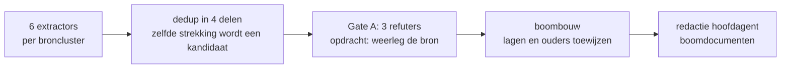

# Requirementsextractie voor de requirementsboom

Relateert aan: #130. Eisen aan het eindproduct: [requirements-document](../design-docs/20260805_1600_requirementsboom-requirements.md). Vormconventies: [skill okx-requirements-boom](../../../.agents/skills/okx-requirements-boom/SKILL.md).

## Vraag

Welke herleidbare, geverifieerde kandidaat-requirements dragen de eerste versie van de requirementsboom onder `architecture/docs/requirements/`, en wat is er bewust buiten gehouden?

## Werkwijze

Een geautomatiseerde pijplijn met veertien subagents, gevolgd door redactie door de hoofdagent:

| Stap | Agents (model) | Invoer | Uitvoer |
|---|---|---|---|
| Extractie | 6 (Fable) | meta-kaderdocumenten; consumer-profiel §1, §3.2, §3.4, §19; meetingverslagen mrt-apr en mei-jul; Jamie-meetings 15 jul t/m 5 aug; Npuls-OKx/Public plus PR 9; keuze-requirements uit PR 120 | 180 kandidaten met bron en letterlijk citaat |
| Dedup | 4 (Fable) | de 180, thematisch verdeeld (keuze 65, aanbod 63, planning 6, rest 46) | 71 kandidaten, 84 geparkeerd; cap van 90 in script afgedwongen |
| Gate A | 3 (Sonnet) | de 71, opdracht omgekeerd: toon aan dat de bron de eis NIET dekt; bij twijfel verwerpen | 64 gedekt, 7 verworpen |
| Boombouw | 1 (Fable) | de 64 plus de skill-conventies | 3 doelen, 7 epics, 30 features, 11 stories, 3 niet geplaatst |

Kanttekening: bij drie extractors (meetings mei-jul, Jamie, Public) draaide de automatische controlelaag van het agent-harnas niet mee. Dat is ondervangen doordat elke kandidaat daarna door Gate A is geverifieerd tegen de bron.

## Gate A: verworpen kandidaten

De zeven verworpen kandidaten, met de reden van de refuter. Dit is wat de omgekeerde opdracht oplevert: citaten die het tegendeel beweren, bronnen waarin het citaat niet voorkomt, en claims die zwaarder zijn dan de bron draagt.

| Verworpen kandidaat | Reden van de refuter |
|---|---|
| De keten moet incidentele vertraging en versnelling verwerken via de verbintenis-state (onderbreken, hervatten, extra verbintenissen op latere of eerdere gelegenheden), zonder wijziging van onderwijsspecificatie of aanbod. | §3.4.3 (versnelling) beschrijft juist wel een wijziging in het aanbod-stadium ('Planner moet eerder dan ontworpen leergelegenheden uit P3 ophogen voor P2'), wat de gestelde 'zonder wijziging van... aanbod' tegenspreekt voor het versnelscenario. |
| Als student wil ik na de keuzegate op elk moment kunnen wisselen tussen een nominale route en maatwerk, zodat mijn keuze niet onomkeerbaar is. | ADR 0012 punt 3 dekt de eis wel, maar persona_jochem.md 'Kiezen keuzedelen' bevat geen enkele vermelding van onomkeerbaarheid of wisselen tussen nominaal/maatwerk; het woord 'maatwerk' daar slaat op een uitzonderingskeuze, niet op de ADR-keuzegate. |
| Het SIS moet per student een individuele structuur bijhouden: het nominale template uit de gepubliceerde onderwijsspecificatiestructuur plus de via het SKS gekozen keuzedelen, met dezelfde symmetrie voor het examenplan. | Punt 5 dekt alleen het nominale template plus keuzedelen; de gestelde 'dezelfde symmetrie voor het examenplan' staat in punt 6, niet in het aangehaalde punt 5. |
| De onderwijscatalogus biedt bij een wijziging de volledige geactualiseerde specificatieboom opnieuw aan, waarna P&R zelf de impact op de actieve planning bepaalt en het asynchrone proces herstart. | Meeting-citaat klopt letterlijk, maar de vervolgdeliverable uit dezelfde meeting (koppelingspecificatie oc-p-en-r §5.2) koos alsnog voor twee ontsluitingen (volledig óf delta), niet uitsluitend de volledige boom. |
| De standaard ondersteunt een vraag-om-ongepland-aanbod (request-for-offering), waarmee de student op basis van zijn leerroute aanbod aanvraagt en de planner de haalbaarheid toetst op schaarse middelen. | Het geciteerde fragment zegt expliciet dat 'vraag-om-ongepland-aanbod' NIET naar OEAPI te mappen is en een tekortkoming vormt, terwijl de eis beweert dat de standaard dit al ondersteunt. |
| De keten moet uniforme en gestandaardiseerde koppelvlakken voor onderwijslogistiek bieden, zodat interoperabiliteit ontstaat tussen systemen en partijen in mbo, hbo en wo. | Citaat staat alleen letterlijk in Projectoverzicht.md (dat MBO nu/HO later faseert, geen 'mbo, hbo en wo'); in de aangehaalde Jamie-meeting komt het citaat helemaal niet voor. |
| De standaard moet koppelingen op basis van OEAPI modelleren via een OKx-consumer-profiel (een profiel, meerdere consumers) en elke afwijking bewust onderbouwen in een ADR. | Bron zegt 'bij voorkeur als ADR' (geen plicht) terwijl de eis een plicht stelt; 'OKx-consumer-profiel' staat alleen los in een meeting over een ander onderwerp (OC-Planning-payload), niet aan de ADR-plicht gekoppeld. |
## Redactionele ingrepen na de pijplijn

Dit is afgeleid werk van de hoofdagent, geen pijplijnuitvoer. Twee ingrepen:

1. **Vijf stories teruggehaald van de parkeerlijst.** De dedup-cap parkeerde ze met reden "boven de cap"; dat is een volumebesluit, geen kwaliteitsoordeel. De hoofdagent heeft elke bron opnieuw direct gelezen en geverifieerd voordat de story in `stories.md` is opgenomen.

| Teruggehaald | Bron (direct geverifieerd) | Bestemming |
|---|---|---|
| Kiesbaarheid en beschikbaarheid afhankelijk van locatie en periode | [PR 120](https://github.com/Npuls-OKx/meta/pull/120), keuze-requirements.md R3, in review | story onder "Kiesbaarheid bepalen" |
| Groep herkenbaar koppelen aan keuzedeel, locatie en periode | [PR 120](https://github.com/Npuls-OKx/meta/pull/120), keuze-requirements.md R4, in review | story onder "Geldig, gefaseerd aanbod afleiden" |
| Dezelfde voorwaarde-regel voor keuzemoment en planning | [PR 120](https://github.com/Npuls-OKx/meta/pull/120), keuze-requirements.md R8, in review | story onder "Regelsets los van items, met min/max-keuzeregels" |
| Open set kiesbaarheidsklassen met eigen klassen per instelling | [PR 120](https://github.com/Npuls-OKx/meta/pull/120), keuze-requirements.md R10, in review | story onder "Regelsets los van items, met min/max-keuzeregels" |
| Student ziet eerst voorgesorteerd keuzedeelaanbod | [persona_jochem.md](../../docs/specificatie/okx-oeapi-consumer-profiel/doc/persona_jochem.md), instellingsjourney, kiezen keuzedelen | story onder "Kiesbaarheid bepalen" |

2. **De epic "Voortgang en resultaat op leeruitkomsten" is een eerste opzet.** Besluit bij de vaststelling van de eisen (R4): features volledig, stories alleen waar de bron een vastgesteld document is.

## Meetingbronnen die alleen extern zijn vastgelegd

Jamie-meetings van na 14 juli 2026 hebben geen verslag in `architecture/meetings/`. Boomrijen met zo'n bron verwijzen naar dit artifact; dit is de sleutel:

| Jamie-id | Meeting | Datum |
|---|---|---|
| `1d9dj5d9szlj` | Koppeling business requirements (sparsessie Niek en Garik over de boomvorm) | 2026-08-05 |
| `1cnino5pzw3y` | Review koppelingspecificatie OC en P&R | 2026-07-30 |
| `1cctd3mdc08t` | Afstemming payload-specificaties en OEAPI-mapping | 2026-07-27 |
| `1b9kanv0h0dp` | Implementatie flexibilisering (Flex en OKx) | 2026-07-16 |

## Beperkingen en niet geverifieerd

- Jamie bevat geen meetings van voor 18 maart 2026 (gecontroleerd met een query vanaf augustus 2025). De periode augustus 2025 tot maart 2026 is uitsluitend gedekt via documenten en ADR's.
- De parkeerlijst hieronder is, op de zeven Gate A-gevallen na, niet tegen de bron geverifieerd. Wie een item terughaalt naar de boom, verifieert de bron opnieuw; zie de ingreep hierboven voor het patroon.
- De extractie is een momentopname van 5 en 6 augustus 2026; PR 9 (Public) en PR 120 waren op dat moment in review.

## Parkeerlijst

Kandidaten die de boom niet haalden, met reden. "Boven de cap" betekent: sneuvelde op het volumeplafond, niet op kwaliteit; dit is de eerste voorraad voor een volgende uitbreidingsronde van de boom.

| Kandidaat | Reden |
|---|---|
| OC levert nominale leerroute, keuzeaanbod en resultaatstructuren aan het SVS | duplicaat (OC-distributiepunt) |
| Roostersysteem levert aanbod met beschikbare capaciteit aan het SKS | boven de cap |
| Kiesbaarheid en beschikbaarheid afhankelijk van locatie en periode (R3) | boven de cap |
| Groep herkenbaar koppelen aan keuzedeel, locatie en periode (R4) | boven de cap |
| Dezelfde voorwaarde-regel voor keuzemoment en planning (R8) | boven de cap |
| Open set kiesbaarheidsklassen met eigen klassen per instelling (R10) | boven de cap |
| Regelmechanisme werkt bij volledig individuele programma's (R12) | duplicaat |
| Opleiding samenstellen van onderop en van bovenaf (R13) | boven de cap |
| Regels grijpen aan op elk specificatieniveau en elke orde leeruitkomst (R16) | boven de cap |
| Student ziet eerst voorgesorteerd keuzedeelaanbod (Jochem) | boven de cap |
| Student kiest met onderbouwing keuzedeel buiten de voorsortering (Jochem) | duplicaat (maatwerk-story) |
| Vroegtijdig inzicht in animo voor keuzes voor de planning | boven de cap |
| Student schrijft zich via SKS uit voor lesgelegenheden en krijgt alternatieven (Larissa) | boven de cap |
| Student vindt en kiest aanbod van andere opleidingen met goedkeuring slb'er (Larissa) | boven de cap |
| Aanbod en verbintenis per niveau in verschillende stadia tegelijk administreren | boven de cap |
| Verbintenis- en aanbod-stadia per werkproces afzonderlijk administreren (scenario 1.4) | duplicaat (tempo-varianten) |
| Overgang tussen tempo-routes zonder dubbele inschrijving (scenario 3.2) | duplicaat (tempo-varianten) |
| Student centraal met leeruitkomst als sleutel (meeting 2026-03-24) | duplicaat (ADR 0003) |
| Studentoriëntatie vóór de administratieve intake positioneren (B2) | boven de cap |
| Vage leervraag vertalen naar concrete filterparameters (meeting 2026-03-31) | duplicaat (ADR 0007) |
| Student haalt na inschrijving voortdurend passend aanbod op (recursief keuzeproces) | boven de cap |
| SKS filtert op studiebelastingsuren (SBU) wat in de planning past | boven de cap |
| Student ziet of een combinatie van leeractiviteiten binnen zijn belastbaarheid past | duplicaat (SBU-filter) |
| Student kiest op het niveau van de leeractiviteit, niet fijnmaziger | boven de cap |
| Leerroute als losse entiteit vóór inschrijving (meeting 2026-04-13) | duplicaat (ADR 0012) |
| Behaalde credentials controleren bij intake als toelatingsvoorwaarde | boven de cap |
| Leervormen als kenmerken van het aanbod, geen apart keuzemoment | boven de cap |
| Mechanisme voor vraag naar onderwijs waarvoor nog geen aanbod bestaat | boven de cap |
| Per leerroute uitdrukken of een module verplicht of kiesbaar is | boven de cap |
| Keuzetaal met minimaal/maximaal aantal te kiezen modules (transcript 2026-05-04) | duplicaat (R5-merge) |
| SKS valideert met leerroutelogica of een keuze uitvoerbaar en toegestaan is | duplicaat (R6-merge) |
| Verbintenis, examenplanning en OER bewegen mee met studentkeuzes | te vaag |
| SKS als eigen referentiecomponent losgekoppeld van het SVS | duplicaat (ADR 0009) |
| Eerste keuze of belangstellingsregistratie op minimale specificatie (5-6 datapunten) | boven de cap |
| Student herbevestigt keuze naarmate locatie en tijdstip bekend worden | boven de cap |
| Onderwijs vroeg in de OC opnemen zodat het kiesbaar is vóór leverbaar | boven de cap |
| Keuzedelen structureren: generiek schoolbreed versus beroepsgericht voorwaardelijk | boven de cap |
| OC en SKS wisselen de keuzeruimte van een opleiding uit | duplicaat (keuzeregels) |
| P&R meldt planningsconflicten terug met gestandaardiseerde foutcodes | boven de cap |
| Onderwijsspecificatie beschrijft keuzedelen met regelsets (uitsluiting, toelating) | duplicaat (R2-merge) |
| OEAPI als technologiekeuze voor koppelvlakken, tenzij onderbouwd afgeweken | governance |
| OC levert te plannen aanbod aan het planningssysteem (hoofdplaat rij 2) | duplicaat |
| OC biedt planbare specificatieboom via POST aan P&R met synchrone respons (meeting 2026-07-10) | duplicaat |
| Pub/sub-synchronisatie van specificatiewijzigingen (meeting 2026-04-30) | duplicaat |
| Studiebelasting telt op naar macro-ontwerp (meeting 2026-04-17) | duplicaat |
| LMS levert leerpad met resources terug (meeting 2026-04-28) | duplicaat |
| Student kan intekenen op nog niet gepland aanbod (persona Larissa) | duplicaat |
| P&R eigenaar aanbodobject / aanbodobject alleen planningsdata (tweede item meeting 2026-07-10) | duplicaat |
| Ketenvraag: hoe vindt een student passend onderwijsaanbod | te vaag |
| Ketenvraag: zichtbaar maken wat het onderwijs is en hoe het georganiseerd wordt | te vaag |
| Ketenvraag: planning bepaalt uitvoerbaarheid qua capaciteit, mensen en middelen | te vaag |
| OC maakt volgordelijkheid en afhankelijkheden inzichtelijk (persona Larissa) | boven de cap |
| Profiel op termijn sector-overstijgend en nationaal | boven de cap |
| Tempo-variant als track op de programma-specificatie | boven de cap |
| Weigeren van summatieve leeruitkomst zonder qualificationReference (F2) | boven de cap |
| Annuleren en herplaatsen bij niet gehaalde minNumberStudents (F7) | boven de cap |
| LMS ondersteunt subset en signaleert ontbrekende velden (F9) | boven de cap |
| CO-tool bevraagt OC op leeruitkomsten en dient request-for-specification in | boven de cap |
| Leeruitkomsten los van kwalificatiekader modelleren (werkproces/kerntaak) | boven de cap |
| Verankering in mbo-kwalificatiedossiers en hbo-kwalificatiekaders | boven de cap |
| REST API's met OpenAPI-specificaties voor machine-to-machine communicatie | boven de cap |
| Payload-specificaties eenduidig mappen op OEAPI | boven de cap |
| JSON Schema (draft 2020-12) per payload-specificatie | boven de cap |
| Vavo-ondersteuning binnen een koppeling | boven de cap |
| Manifest houdt wijzigingsmoment per boomonderdeel bij | boven de cap |
| Technische specificaties herleidbaar naar functionele eisen in de requirementsboom | governance |
| Koppelvlakspecificatie als som van indicatieve koppelingbeschrijvingen (U1) | governance |
| Data-ownership-tabel per attribuut, geen doorgeefluik voor persoonsdata (AP13) | governance |
| De keten moet een begeleider startcondities gemotiveerd laten overschrijven en de verantwoording vastleggen. | boven de cap |
| De keten moet per student de genoten begeleide onderwijstijd registreren voor de urennorm bij diplomering. | boven de cap |
| Het datamodel moet geneste lessen en diepere sublagen recursief kunnen modelleren met doorwerking in aggregatie. | boven de cap |
| Als zij-instromer wil ik de opleiding by design versneld kunnen volgen (2 in plaats van 3 jaar). | boven de cap |
| De standaard moet elke onderwijslaag koppelen aan gestructureerde databeschrijvingen van leeruitkomsten (bijv. CompetentNL). | boven de cap |
| De standaard moet wegingen van leeruitkomsten standaardiseren op basis van studiebelasting en omvang. | boven de cap |
| De standaard moet per functioneel proces vastleggen welk referentiecomponent eigenaar is van welke endpoints. | boven de cap |
| De standaard moet endpoint-namen en JSON-schemavelden in het Engels definieren met mapping naar het Nederlandse kader. | boven de cap |
| De OC moet onderwijseenheden onafhankelijk van een opleiding kunnen aanbieden via n-op-n-relaties. | boven de cap |
| Payloads moeten objecten in platte arrays met expliciete verwijssleutels dragen. | boven de cap |
| De standaard moet leerroute 2 en 3 als delta op leerroute 1 kunnen dragen. | boven de cap |
| De OC en P&R moeten een abonnement-endpoint bieden voor registratie op events. | boven de cap |
| Voor gevoelige stromen moeten PKI-overheidscertificaten worden gebruikt. | duplicaat (auth-eis) |
| Een ontvangend systeem moet berichten volgordelijk en idempotent verwerken. | duplicaat (kanaal-eisen) |
| Elke koppeling moet foutafhandeling en opslag van onverwerkbare berichten bieden. | duplicaat (kanaal-eisen) |
| De standaard stelt functionele voorwaarden aan berichtenverkeer zonder transporttechnologie voor te schrijven. | duplicaat (kanaal-eisen) |
| De keten moet de negen Npuls-leerroutes ondersteunen: de standaard route, personaliseren van de diplomaroute en modulair studeren (K4). | niet geplaatst: Ketenbreed kader dat over meerdere epics heen ligt; epic- en featurelimiet bieden geen eigen plek |
| Fijnmazige roostering en het gedetailleerde leertraject blijven buiten de koppeling en worden binnen de instelling opgelost (K48). | niet geplaatst: Scope-afbakening, geen bekwaamheid van de keten; hoort in de scopeparagraaf, niet in de boom |
| De instelling is issuer van microcredentials; de inhoudelijke definitie van een microcredential valt buiten de OKx-scope (K63). | niet geplaatst: Grotendeels scope-afbakening; geen dragende feature binnen epic 5 |
