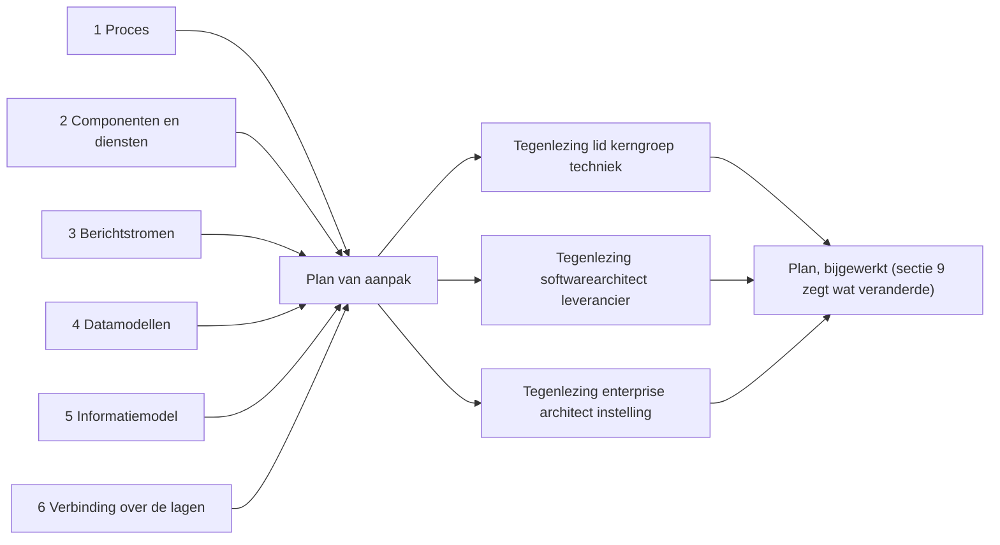
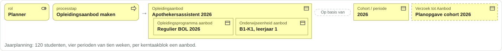
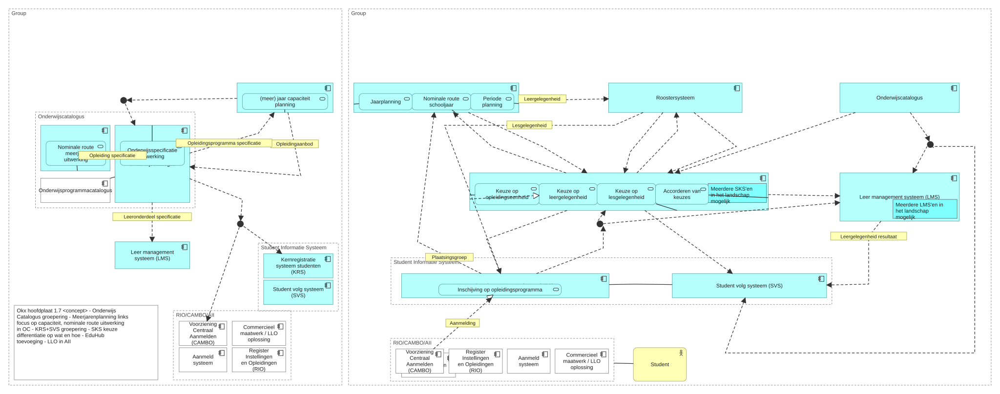

# Voorbeelduitwerking leerroute 1 (Jochem): analyse, plan en tegenlezingen

Relateert aan: Npuls-OKx/Public#106 (het deliverable), #237 (dit artifact), #234 en #235 (open modelvragen). Stand 16 september 2026; concept ter bespreking, niets hiervan is besloten.

De kerngroep techniek vroeg op 15 september om één opleiding helemaal uit te drukken in het informatiemodel, van abstract naar implementatie. Vóór het bouwen is per laag geanalyseerd wat de bronnen dragen, is daaruit een plan gemaakt, en is dat plan door drie lezerspersona's tegengelezen. De korte, visuele samenvatting staat onder Public#106; hier staat de onderbouwing.

| Bestand | Vraag die het beantwoordt |
|---|---|
| [plan.md](plan.md) | Wat is nodig om het informatiemodel aan de leerroute te koppelen, welke uitsnede, welke volgorde tot 30 september, welke besluiten en vragen |
| [laag-1-proces.md](laag-1-proces.md) | Wat dragen kaderscenario, persona en scenario 1.1 voor de casus Jochem, en waar zitten de leemtes |
| [laag-2-componenten-en-diensten.md](laag-2-componenten-en-diensten.md) | Welke referentiecomponenten en diensten raken Jochems traject, en wat vroegen de leveranciers op 15 september |
| [laag-3-berichtstromen.md](laag-3-berichtstromen.md) | Welke van de elf berichtstromen vuren in Jochems traject, met welk patroon, en wat blijft zonder stroom |
| [laag-4-datamodellen.md](laag-4-datamodellen.md) | Welke entiteiten en schema's dragen de casus, valideren de voorbeeldpayloads, en waar spreken plaat en schema elkaar tegen |
| [laag-5-informatiemodel.md](laag-5-informatiemodel.md) | Welke van de 66 objecttypen zijn direct, afleidbaar of niet te instantiëren, en welke ontwerpkeuzes forceren een besluit |
| [laag-6-verbinding.md](laag-6-verbinding.md) | Waar zitten de naden tussen de lagen, wat eist de kerngroep aan de vorm, en hoe ziet het deliverable eruit |
| [tegenlezing-lid-kerngroep-techniek.md](tegenlezing-lid-kerngroep-techniek.md) | Herkent een leverancier in de kerngroep zijn eigen koppeling en zijn vraag van 15 september |
| [tegenlezing-softwarearchitect-leverancier.md](tegenlezing-softwarearchitect-leverancier.md) | Kan een bouwteam hiermee bouwen: bericht, endpoint, foutpad, versie, schemavalidatie |
| [tegenlezing-enterprise-architect-instelling.md](tegenlezing-enterprise-architect-instelling.md) | Is het voorbeeld te verdedigen in een architectuurraad: MORA-koppeling, begrippen, generaliseerbaarheid, onderhoud |

Bronvoorbehoud: de laaganalyses citeren de sessie van de kerngroep techniek van 15 september; deelnemers van leveranciers zijn geanonimiseerd als leverancier A tot D. Regelverwijzingen naar bestanden gelden voor de stand van de worktrees op 16 september (meta na PR #233, Public op de branch van PR Npuls-OKx/Public#104).

## Vorm van het eindproduct: mock-up en PoC

De vorm is in vier ronden gekozen (zie de comment onder #237). Uitkomst: per fase van de instellingsreis een stapel regels in ArchiMate-vormtaal, van twee soorten. Een **ontstaat**-regel: wie, processtap, informatieobjecten van de plaat met één instantie voor Jochem ("bestaat uit" als nesting, aannames gestippeld). Een **stroomt**-regel: bezitter, informatieobject, afnemer, met het pijlnummer van de hoofdplaat en de koppeling-ID. Scope: MIM 1 en 2, leslaag binnen scope, geen payloads of diensten.

| Bestand | Wat |
|---|---|
| [mockup-eindproduct.html](mockup-eindproduct.html) | De mock-up (versie 4), met de gegenereerde regels en de hoofdplaat uit Archi erin. Lokaal openen in een browser |
| [poc/blok.py](poc/blok.py) | Tekent een regel uit JSON ([ontstaat.json](poc/ontstaat.json), [stroomt.json](poc/stroomt.json)) als SVG zonder externe fonts |
| [poc/hoofdplaat.py](poc/hoofdplaat.py) | Rendert een view uit `model.archimate` (alleen lezen) als SVG: posities en knikpunten uit Archi, kleur en icoon per ArchiMate-type, labels op de pijlen uit [labels-v17.json](poc/labels-v17.json) |

Zo renderen de regels op GitHub:

En de hoofdplaat v1.7 (zonder context applicaties) uit het model, met negen informatieobjecten als label:

## Tegenlezingen op het featureplan

Het featureplan staat in [feature-plans/20260917_1500_jochem-in-het-informatiemodel.md](../../feature-plans/20260917_1500_jochem-in-het-informatiemodel.md). Versie 1 is tegengelezen in verse contexten; versie 2 verwerkt de bevindingen.

| Bestand | Persona of skill | Oordeel op versie 1 |
|---|---|---|
| [tegenlezing-plan-tester.md](tegenlezing-plan-tester.md) | okx-requirements-tester en okx-test-persona | Gefaald: basisbranch niet benoemd; tien moet-punten; testgevallen per script bijgeleverd |
| [tegenlezing-plan-projectmanager.md](tegenlezing-plan-projectmanager.md) | projectmanager en testcoördinator | Niet uitvoerbaar in de huidige vorm; wel na afslanken op werkdagen met drie aanpassingen |
| [tegenlezing-plan-informatiearchitect-kerngroep.md](tegenlezing-plan-informatiearchitect-kerngroep.md) | informatiearchitect en lid kerngroep techniek, okx-semantiek-review | Gefaald op relatiecontrole en vragenpagina; vorm en doel haalbaar |

Tweede ronde op versie 2: [tester](tegenlezing-plan-tester-ronde-2.md) GESLAAGD met twee moet-punten (pijlidentiteit uniek, één view), [projectmanager en testcoördinator](tegenlezing-plan-projectmanager-ronde-2.md) uitvoerbaar met drie moet-punten (pijlidentiteit, testgevallen op versie 2, akkoord op 18 september), [informatiearchitect en lid kerngroep techniek](tegenlezing-plan-informatiearchitect-kerngroep-ronde-2.md) dialectvrij na drie moet-punten (term koppeling, anonimisering, toestandslijst). Alle moet-punten zijn in versie 3 van het plan verwerkt.

