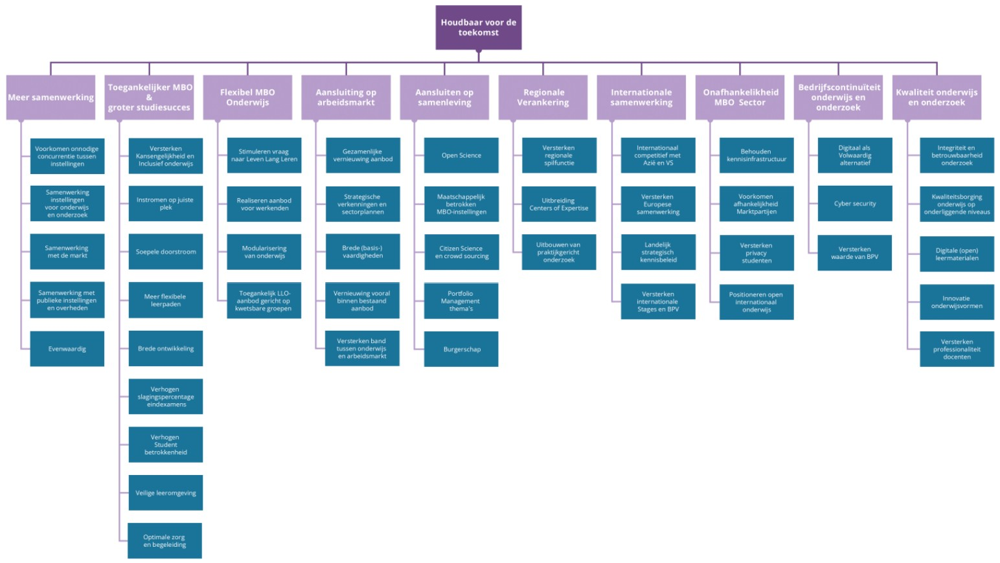
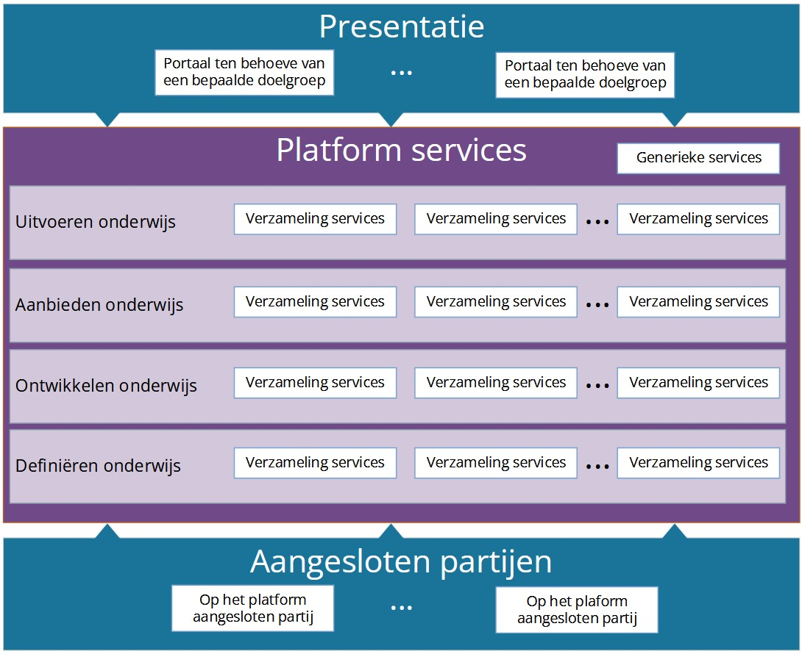
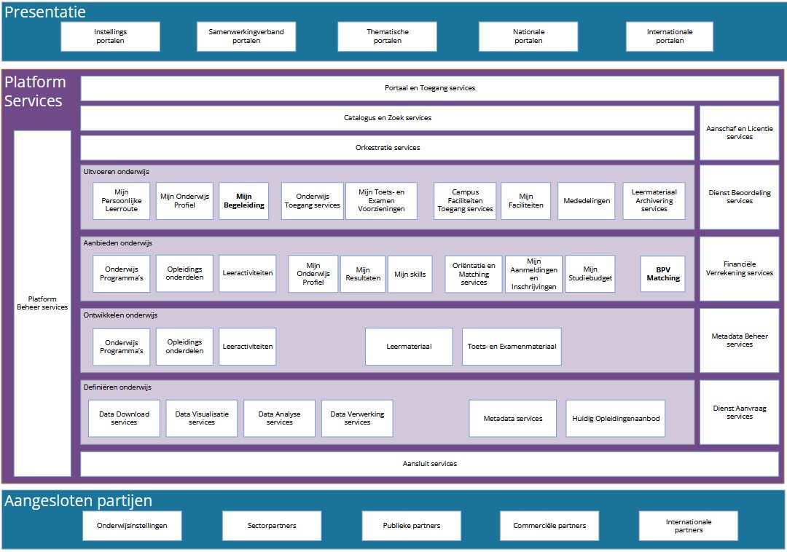
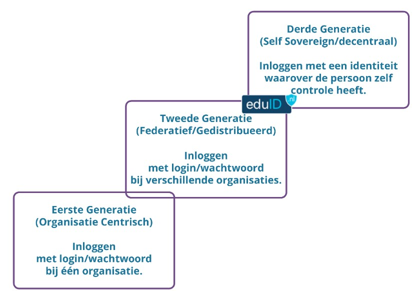
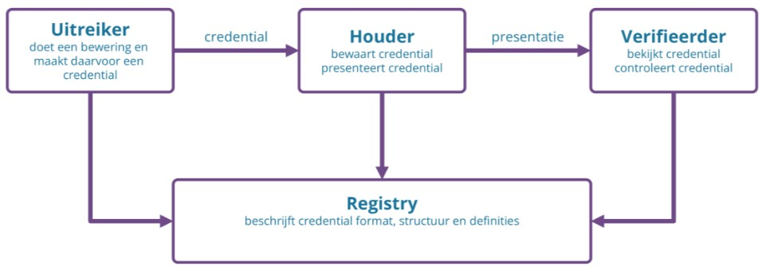
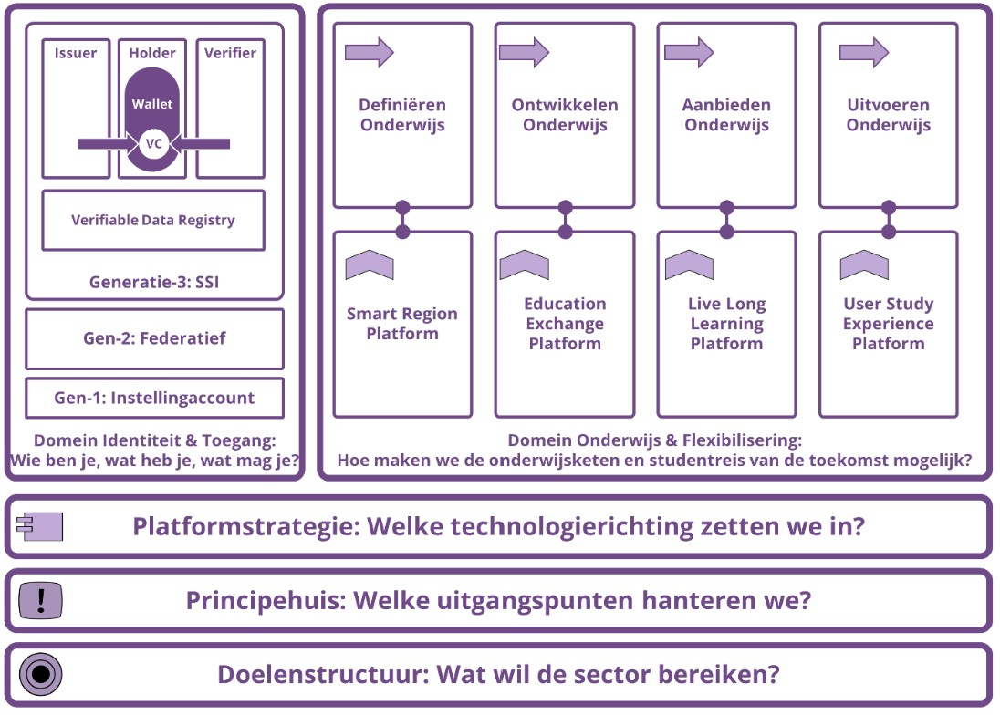
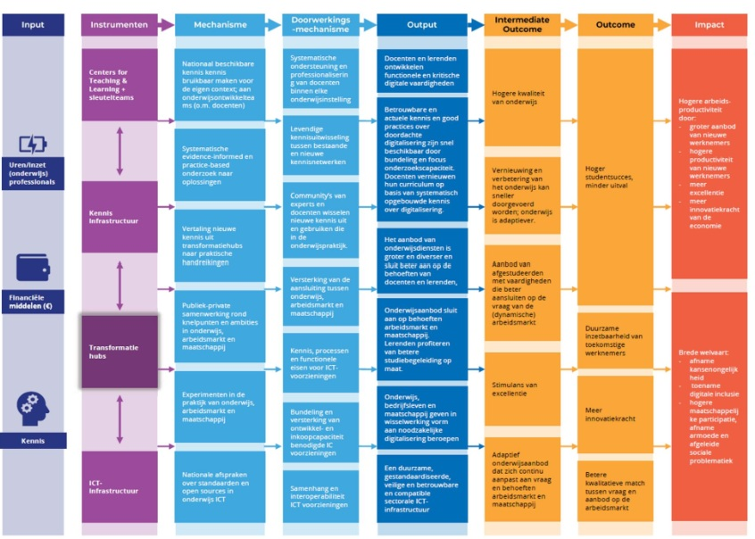

# MOSA — Visie op sectorvoorzieningen in het mbo

**Versie:** 1.0
**Datum:** 16 januari 2025
**Auteur:** MOSA werkgroep, MBO Digitaal — in opdracht van de CIO Raad
**Trefwoorden:** MOSA, Visiedocument

---

## Inhoudsopgave

1. [Inleiding](#1-inleiding)
   1.1 [Wat is de MOSA?](#11-wat-is-de-mosa)
   1.2 [Opdracht](#12-opdracht)
   1.3 [Relatie met andere architecturen](#13-relatie-met-andere-architecturen)
   1.4 [Relatie met AI](#14-relatie-met-ai)
   1.5 [Leeswijzer](#15-leeswijzer)
2. [Doelenstructuur MOSA](#2-doelenstructuur-mosa)
3. [Principehuis](#3-principehuis)
4. [Platformstrategie](#4-platformstrategie)
   4.1 [Business platform als concept](#41-business-platform-als-concept)
   4.2 [Platform](#42-platform)
   4.3 [Waarom streven naar een platform?](#43-waarom-streven-naar-een-platform)
   4.4 [Autonomie, interoperabiliteit en standaarden](#44-autonomie-interoperabiliteit-en-standaarden)
5. [Domeinarchitectuur Onderwijs en Flexibilisering](#5-domeinarchitectuur-onderwijs-en-flexibilisering)
   5.1 [Hoofdlijn domeinarchitectuur](#51-hoofdlijn-domeinarchitectuur)
   5.2 [Toelichting op de services](#52-toelichting-op-de-services)
   5.3 [Wat is er mbo-specifiek?](#53-wat-is-er-mbo-specifiek)
6. [Domeinarchitectuur Identity and Access Management](#6-domeinarchitectuur-identity-and-access-management)
   6.1 [Hoofdlijn domeinarchitectuur](#61-hoofdlijn-domeinarchitectuur)
   6.2 [Wat is er mbo-specifiek?](#62-wat-is-er-mbo-specifiek)
7. [Domeinarchitectuur Onderzoek](#7-domeinarchitectuur-onderzoek)
8. [Realisatie](#8-realisatie)
   8.1 [Concretisering](#81-concretisering)
   8.2 [Realisatie](#82-realisatie)
   8.3 [Governance](#83-governance)
- [Bijlagen](#bijlagen)

---

## 1. Inleiding

### 1.1 Wat is de MOSA?

De MOSA is de **mbo sectorarchitectuur**. Dit is een doelarchitectuur, wat betekent dat het de gewenste situatie schetst voor een periode van vijf tot tien jaar vooruit. De MOSA richt zich op de sectorvoorzieningen in het mbo, met als doel om samenwerking tussen alle partijen (instellingen, studenten en docenten, sectororganisaties, bedrijven en overheden) zo goed mogelijk te ondersteunen met IT-voorzieningen. Doelstelling is om zo de kwaliteit en wendbaarheid van het onderwijs te versterken.

Je kunt de MOSA dus zien als een **bestemmingsplan** voor een samenhangend geheel aan sectorvoorzieningen voor het mbo. Daar waar de MORA (de referentiearchitectuur voor het mbo) gaat over de processen *binnen* de instelling, is de MOSA het afsprakenstelsel[^1] *tussen* de instellingen met de daarbij behorende sectorvoorzieningen. De MOSA is er niet alleen voor de instellingen, maar voor alle partijen en leveranciers in de sector.

[^1]: De precieze aard van de afspraken en governance van de gezamenlijke sectorvoorzieningen is onderdeel van Npuls. Ook de samenhang met het Edu-V afsprakenstelsel (met de focus op gegevensuitwisseling binnen instellingen) wordt dan onderzocht.

Sectorvoorzieningen zijn niet nieuw, maar kennen we al in de vorm van caMBO, het mbo-koppelpunt en voorzieningen voor samenwerking op het gebied van lesmateriaal. Met zo'n bestemmingsplan willen we onder andere het volgende mogelijk maken:

- **Flexibilisering over instellingen heen** — Instellingen kunnen hun onderwijs flexibiliseren door (o.a.) het onderwijsaanbod te modulariseren in kleinere opleidingsonderdelen en studenten vervolgens keuzemogelijkheden te bieden. De uitdaging is om dat ook instellingsoverstijgend te maken, zodat studenten ook opleidingsonderdelen bij een andere instelling kunnen volgen en het resultaat weer kunnen meeleveren en verzilveren bij de thuisinstelling. De uitdaging is om vooral de gegevensuitwisseling die hiervoor nodig is te standaardiseren.

- **Leven Lang Ontwikkelen** — Studenten kunnen zich blijven ontwikkelen gedurende hun hele loopbaan, vaak door op verschillende momenten bij verschillende onderwijsaanbieders voor korte of langere tijd onderwijs te volgen. Nu is dat vaak een aaneenschakeling van losse in- en uitschrijvingen, waarbij een student alleen tijdens de periode van inschrijving toegang heeft tot zijn gegevens, versnipperd over verschillende instellingen. De uitdaging is om studenten gedurende hun hele loopbaan laagdrempelige toegang te bieden tot beschikbaar onderwijs, en voorzieningen te bieden die een student ook een leven lang kan gebruiken.

- **Samenwerking in de hele keten** — In de hele keten zijn ontzettend veel partijen betrokken: onderwijsinstellingen, sectorpartners zoals SBB en DUO, bedrijfsleven, brancheorganisaties en kennisinstituten. De uitdaging is om versnippering te voorkomen, ook omdat alle partijen onderdeel zijn van dezelfde keten en in wisselende combinaties met elkaar (willen) samenwerken.

- **De vorming van een marktplaats** — Er ontstaan steeds meer voorzieningen die het karakter van een markplaats hebben. De uitdaging is om een zekere mate van (publieke) regie te voeren op dit soort voorzieningen.

### 1.2 Opdracht

Dit MOSA visiedocument is opgesteld door de MOSA werkgroep van MBO Digitaal, in opdracht van de CIO Raad. De deelnemers aan de MOSA werkgroep zijn te vinden in [bijlage 1](#bijlage-1-de-mosa-community). De CIO Raad is een overlegorgaan binnen MBO Digitaal waarin CIO's van de mbo-instellingen vertegenwoordigd zijn. Zij hebben de opdracht voor de ontwikkeling van de MOSA geformuleerd en alle producten worden ook aan hen opgeleverd.

### 1.3 Relatie met andere architecturen

In het onderwijs bestaan er verschillende architecturen. In de eerste plaats per sector (hoger onderwijs, middelbaar beroepsonderwijs en funderend onderwijs). Daarnaast onderscheiden we twee typen architecturen: een sectorarchitectuur en een referentiearchitectuur.

**Sectorarchitectuur** — Er zijn drie sectorarchitecturen: de HOSA voor het hoger onderwijs, de MOSA voor het mbo en de FOSA voor het funderend onderwijs. Een sectorarchitectuur is een kaderstellende doelarchitectuur voor de gemeenschappelijke sectorvoorzieningen met de volgende kenmerken:

- Bevat kaders die samenwerking tussen alle sectorpartijen bevordert
- Vertrekt vanuit publieke waarden
- Is gericht op de doelstellingen van de onderwijssector voor vijf tot tien jaar vooruit
- Biedt het kader voor nieuw in te richten landelijke sectorvoorzieningen
- Vergelijkbaar met een bestemmingsplan

Hoewel er drie sectorarchitecturen zijn, worden deze wel in samenhang uitgewerkt. Het doel is dat er uiteindelijk een samenhangend geheel aan sectorvoorzieningen ontstaat voor de gehele onderwijssector, met eventueel sectorspecifieke elementen daarin.

**Referentiearchitectuur** — Er zijn ook drie referentiearchitecturen: de HORA voor het hoger onderwijs, de MORA voor het mbo en de FORA voor het funderend onderwijs. Een referentiearchitectuur is een referentiemodel voor de processen, applicaties en informatie binnen één instelling:

- Een referentiemodel dat als voorbeeld (referentiekader) kan dienen voor de inrichting van de processen, informatiehuishouding en het applicatielandschap *binnen één instelling*.
- Vertrekpunt voor de inrichting van je eigen organisatie, op basis van een gemeenschappelijke structuur en definities.
- Vergelijkbaar met de architectuur van één individueel gebouw.

**Ketenreferentiearchitectuur** — De ROSA is de ketenreferentiearchitectuur voor de hele onderwijssector. ROSA richt zich op het bevorderen van samenwerking tussen ketenpartijen op het vlak van informatievoorziening in alle onderwijsdomeinen.

> *Figuur 1: Samenhang architecturen (zie: <https://rosa.wikixl.nl/index.php/Samenhang_met_andere_architecturen>)*

**Standaarden** — In het mbo kennen we nog de **MOKA**, de mbo Koppelingen Architectuur. Dat is een specifieke architectuur die zich richt op de uitwerking en specificatie van koppelvlakken. Onder een koppelvlak verstaan we de gegevensinteractie tussen applicatie(componenten). Het doel is om tot standaardisatie van koppelvlakken te komen en die onderwijsbreed toe te gaan passen.

### 1.4 Relatie met AI

De MOSA kijkt 5 tot 10 jaar vooruit. Terwijl we bezig zijn met de implementatie, vindt op het gebied van AI een revolutie plaats, die zeer grote impact gaat hebben op economie, maatschappij en onderwijs[^2].

[^2]: Zie [bijlage 4](#bijlage-4-mosa-en-maatschappelijke-impact-van-ai) voor een beknopt overzicht van verwachte veranderingen en verwijzingen naar relevante bronnen.

- De arbeidsmarkt zal ingrijpend veranderen door AI en robotisering; het mbo zal studenten moeten voorbereiden op deze veranderingen (ook LLO).
- Het onderwijs zelf zal ook ingrijpend veranderen. Eerste verkenningen geven aan dat er veel kansen gaan ontstaan om het onderwijs te verbeteren, en dat goed beleid en voorzichtigheid nodig is om de risico's te beperken.

Ontwikkelen van de sectorvoorzieningen kan niet zonder oog te hebben voor de AI-ontwikkelingen; maar kan ook niet wachten totdat alle ontwikkelingen en impact duidelijk zijn. Daarom zal de ontwikkeling van de sectorvoorzieningen/MOSA plaatsvinden met de volgende aandachtspunten:

- Opbouwen van kennis over AI; zowel kennis van de technische mogelijkheden als van de impact.
- Ruimte om bij te stellen: leren en experimenteren, pilothubs, labs om samen met de arbeidsmarkt waarde te ontsluiten (Centra voor Innovatief Vakmanschap).
- Toepassen van AI bij de realisatie van (enkele) onderdelen van de MOSA; waar de toepassing direct voordelen oplevert met beperkte risico's.
- Regelmatig bijstellen van uitwerkingen van de MOSA (streef- en solutionarchitecturen) om in te spelen op nieuwe inzichten en beleid.

### 1.5 Leeswijzer

- **Hoofdstuk 2** — Doelenstructuur: op welke doelen de MOSA zich richt.
- **Hoofdstuk 3** — Principehuis: basisprincipes waarop de MOSA is gebaseerd.
- **Hoofdstuk 4** — Platformstrategie: het concept van een sectorbreed platform.
- **Hoofdstukken 5, 6 en 7** — Domeinarchitecturen: Onderwijs en Flexibilisering, Identity and Access Management, Onderzoek.
- **Hoofdstuk 8** — Realisatie van de MOSA.

---

## 2. Doelenstructuur MOSA

De doelenstructuur MOSA is afgeleid van de doelen uit het "Strategisch meerjarenperspectief MBO Raad 2022–2030"; alle doelen uit het meerjarenperspectief komen terug in deze doelenstructuur MOSA. Daarnaast is de doelenstructuur vergeleken met de doelenstructuur HOSA.

MOSA richt zich op een samenhangend geheel aan sectorvoorzieningen voor het mbo. De doelenstructuur borgt dat deze sectorvoorzieningen bijdragen aan de doelen die we ons gesteld hebben. Prioritering van deze doelen is nog nader uit te werken, bijvoorbeeld door de CIO-raad.

*Doelenstructuur MOSA (voor grotere versie zie bijlage-document)*

**Strategisch Meerjarenperspectief 2022–2030** — Het strategisch meerjarenperspectief van de MBO Raad beschrijft de belangrijkste doelen die de mbo-sector zich stelt. De hoofdthema's zijn: *Mbo & arbeidsmarkt*, *Mbo & samenleving* en *Mbo & kwaliteit* met subthema's: onderzoek, innovatie & digitalisering, relevante data, LLO, eigentijds mbo.

**Digitaliseringsstrategie in het mbo** — Drie niveaus van digitalisering:

1. **Digitalisering van de onderwijsorganisatie (school)** — Transitie naar flexibeler georganiseerd onderwijs.
2. **Digitalisering van het onderwijs (docent)** — Investeren in digitale professionaliteit, leermiddelenbeleid, data gebruiken voor verbetering.
3. **Digitalisering in het onderwijs (student)** — Digitaal burgerschap, regie over eigen data, eenvoudig leermiddelen bestellen.

**Meerjarenplan MBO Digitaal** — Alle mbo-scholen werken samen om de digitaliseringsstrategie te verwezenlijken, met als doelen: onderwijskwaliteit bevorderen, flexibilisering en gelijke kansen voor studenten. Vier werksporen: Visie & Strategie, Governance, Inhoudelijke thema's, Evaluatie.

---

## 3. Principehuis

In dit hoofdstuk zijn de MOSA architectuurprincipes uitgewerkt.

De onderstaande MOSA architectuurprincipes hebben betrekking op de sectorvoorzieningen voor het mbo en zijn afgeleid van de architectuurprincipes van de HOSA. Voor het mbo staan deze principes naast die van de MORA[^3], waarbij de MORA-principes gaan over de informatiehuishouding van de instelling zelf en die van de MOSA over die van de gezamenlijke sectorvoorzieningen.

[^3]: Zie <https://mora.mbodigitaal.nl/index.php/Architectuurprincipes>

### Principe 1 — De sectorvoorzieningen vormen een doelmatig ecosysteem

| | |
|---|---|
| **Principe** | De sectorvoorzieningen zijn zodanig ingericht dat ze een doelmatig ecosysteem vormen waarin de student (de lerende) centraal staat, studenten/docenten/medewerkers optimaal worden ondersteund, rollen en verantwoordelijkheden duidelijk belegd zijn, en onafhankelijkheid van leveranciers is geborgd. |
| **Rationale** | Om 'leven lang ontwikkelen' mogelijk te maken stellen we de student als lerende centraal. De student maakt gedurende zijn/haar hele loopbaan, mogelijk bij verschillende instellingen, gebruik van de sectorvoorzieningen. Om dat mogelijk te maken is het belangrijk dat instellingen en andere partners met elkaar kunnen samenwerken, dat er heldere rollen en verantwoordelijkheden zijn en geen verstorende afhankelijkheden van leveranciers. |
| **Implicaties** | Voor het ontwerp van de sectorvoorzieningen worden kaders gehanteerd, zodat de sectorvoorzieningen passen in het doelmatige ecosysteem. |

### Principe 2 — Ethiek is geborgd

We volgen hier het ROSA-principe 'Ethics by Design'[^4]:

[^4]: <https://rosa.wikixl.nl/index.php/Id-2cbc74d467b147baab89959e07ed70f0>

| | |
|---|---|
| **Principe** | Gebruik waarden als input bij het ontwerp van digitale technologie. |
| **Rationale** | Bij ontwerpbeslissingen vindt steeds een belangenafweging plaats. De onderwijswaarden uit de WaardenWijzer zijn voorbeelden van concerns die in een dergelijke belangenafweging een rol spelen. |
| **Implicaties** | Maak gebruik van de WaardenWijzer om in het ontwerpproces expliciet te maken op welke wijze de onderwijswaarden betrokken zijn. |

### Principe 3 — De sectorvoorzieningen zijn wendbaar

| | |
|---|---|
| **Principe** | De componenten van de sectorvoorzieningen functioneren onafhankelijk van elkaar, zijn schaalbaar en kunnen eenvoudig worden gekoppeld of ontkoppeld. |
| **Rationale** | In een sterk veranderende omgeving is flexibiliteit belangrijk. Dit vraagt om sectorvoorzieningen die kunnen meebewegen met de veranderende omgeving. |
| **Implicaties** | Helder afgebakende componenten die eenvoudig kunnen worden toegevoegd of verwijderd. Concreet: cloud-concepten, een API-strategie voor gestandaardiseerde koppeling, en exit-plannen in contracten. |

### Principe 4 — De sectorvoorzieningen zijn open

| | |
|---|---|
| **Principe** | De sectorvoorzieningen maken deel uit van een breed en open ecosysteem, waarin delen en beschikbaar stellen de norm is en er geen onnodige grenzen voor het gebruik worden opgeworpen. |
| **Rationale** | Gefinancierd met publieke middelen → beschikbaar voor alle partijen. Toegevoegde waarde groeit naarmate meer partijen bijdragen en gebruiken. Stimuleert innovatie. |
| **Implicaties** | Kaders voor samenwerking en hergebruik. Zoveel mogelijk (internationale) open standaarden. Inzet op meertaligheid. |

### Principe 5 — De sectorvoorzieningen zijn toegankelijk voor iedereen

| | |
|---|---|
| **Principe** | Toegankelijke user-interface die aansluit op de fysieke leer- en werkomgeving en toegankelijk is met beperkte middelen en voor mensen met een functiebeperking. |
| **Rationale** | De sectorvoorzieningen moeten breed gebruikt kunnen worden in het leer- en werkproces en bijdragen aan gelijkheid. |
| **Implicaties** | Omnichannel-dienstverlening. Internationale standaarden en WCAG-richtlijnen. |

### Principe 6 — De sectorvoorzieningen zijn duurzaam

| | |
|---|---|
| **Principe** | Milieu en omgeving worden zo min mogelijk belast en hergebruik wordt zo veel mogelijk bevorderd. |
| **Rationale** | Maatschappelijke verantwoordelijkheid en voorbeeldfunctie. |
| **Implicaties** | Duurzaamheid expliciet meenemen in ontwerp, periodieke KPI-rapportage, MVO-richtlijnen voor leveranciers. |

### Principe 7 — De sectorvoorzieningen zijn robuust

| | |
|---|---|
| **Principe** | De sectorvoorzieningen zijn zodanig robuust dat de continuïteit van onderwijs en bedrijfsvoering is geborgd. |
| **Rationale** | Instellingen en andere partijen zijn voor hun onderwijs en bedrijfsvoering afhankelijk van de sectorvoorzieningen. |
| **Implicaties** | Passende classificatie voor beschikbaarheid, continuïteitsplan, periodiek testen en rapporteren. |

### Principe 8 — De sectorvoorzieningen zijn beveiligd

| | |
|---|---|
| **Principe** | Vertrouwelijkheid en integriteit van gegevens is geborgd. |
| **Rationale** | Voldoen aan AVG. Zorgvuldig omgaan met persoonsgegevens (begeleidingsgegevens, leerresultaten). Aantoonbare integriteit van diploma's en cijfers. |
| **Implicaties** | Passende classificatie voor integriteit conform het Certificeringsschema informatiebeveiliging en privacy[^5]. Periodieke rapportage en onafhankelijke audits. |

[^5]: <https://www.edustandaard.nl/standaard_afspraken/certificeringsschema-informatiebeveiliging-en-privacy-rosa/certificeringsschema-informatiebeveiliging-en-privacy-rosa-v3-0/>

### Principe 9 — De sectorvoorzieningen zijn transparant

| | |
|---|---|
| **Principe** | De sectorvoorzieningen zijn transparant in hun werking: inzichtelijk en begrijpelijk voor partijen en gebruikers. |
| **Rationale** | Door complexiteit (o.a. door AI) is transparantie belangrijk voor vertrouwen en daarmee voor adoptie. |
| **Implicaties** | Governance-afspraken over transparantie. Voorkomen dat AI een black box is. |

### Principe 10 — De kosten van de sectorvoorzieningen zijn verrekenbaar

| | |
|---|---|
| **Principe** | De kosten van sectorvoorzieningen en het gebruik daarvan zijn inzichtelijk, zodat deze verrekenbaar zijn. |
| **Rationale** | Gemeenschappelijke voorzieningen vereisen eerlijke kostenverrekening. |
| **Implicaties** | Structuur voor flexibele kostentoerekening op basis van transparant inzicht in werkelijke kosten en gebruik. |

---

## 4. Platformstrategie

We zien de MOSA als een architectuur voor een **sectorbreed platform**.

### 4.1 Business platform als concept

De MOSA is een doelarchitectuur gebaseerd op het concept van een *business platform* zoals ook in de HOSA wordt toegepast. Zo'n business platform is een open, op samenwerking gerichte infrastructuur waarop aangesloten partijen met elkaar kunnen samenwerken, en informatie en diensten kunnen uitwisselen.

De essentie van het platform is:

- Het platform faciliteert de samenwerking en uitwisseling tussen alle betrokken partijen in de sector.
- Het platform is een online marktplaats die partijen met elkaar verbindt en hen in staat stelt data en voorzieningen te delen.
- Middels een gezamenlijk platform kan worden gestuurd op gezamenlijke normen en waarden.

Het platform is dus het geheel aan IT-voorzieningen dat partijen in de sector, en over sectorgrenzen heen, met elkaar verbindt en transacties ondersteunt. Het is **niet** één technisch systeem, maar een verzameling voorzieningen met bijbehorende afspraken en governance.

### 4.2 Platform

*Figuur 2: Kern van het MOSA platform*

De plaat kan van onder naar boven als volgt worden gelezen:

- **Aangesloten partijen** — Alle relevante partijen in de mbo-onderwijsketen (scholen, kennisorganisaties, publieke en private partijen). Zij kunnen beschikbare services afnemen, voor zover dat bij hun rol past en ze daartoe geautoriseerd zijn.
- **Platform services** — Een verzameling services, geclusterd in deelgebieden. Aangesloten partijen kunnen services gebruiken, integreren én leveren.
- **Presentatielaag** — Portalen voor bepaalde doelgroepen die platformservices ontsluiten, onafhankelijk van de aangesloten partijen.

### 4.3 Waarom streven naar een platform?

Concreet:

- **Regie** — We voeren als sector regie op het gemeenschappelijke platform. We bepalen als sector de functionaliteit, technologie en standaarden.
- **Normen en waarden** — We bewaken de spelregels, gericht op gezamenlijke normen en (publieke) waarden.
- **Innovatiekracht** — Dezelfde afspraken en spelregels gelden voor het hele platform; nieuwe oplossingen en partijen kunnen relatief snel aansluiten.

Dit betekent **niet** dat we alles zelf gaan bouwen. Marktpartijen leveren voor een groot deel de oplossingen. We voeren als sector alleen regie.

### 4.4 Autonomie, interoperabiliteit en standaarden

Onderwijsinstellingen en branchepartners zijn (tot op zekere hoogte) **autonoom** en de MOSA dingt daar niet op af. Keuzes voor het interne applicatielandschap, de eigen aanbestedingskalender, het tempo van aansluiten op voorzieningen zijn eigen keuzes.

De MOSA is ook **geen opmaat naar één groot centraal systeem**. We stimuleren daarom **interoperabiliteit**: producten, systemen of organisaties die zonder beperkingen samen kunnen werken. Interoperabiliteit is noodzakelijk als:
1. De samenwerking van entiteiten gewenst is, **EN**
2. De entiteiten autonoom of heterogeen zijn en blijven.

> Met afspraken en standaarden bevorder je interoperabiliteit; met interoperabiliteit bevorder je autonomie.

Werken aan interoperabiliteit kan op verschillende manieren:

- **Technische interoperabiliteit** — Systemen op elkaar aansluiten en gegevens uitwisselen. Standaarden voor verbindingen.
- **Semantische interoperabiliteit** — Gegevens beschreven in dezelfde taal: termen, definities, onderlinge relatie en applicatie-interface beschrijvingen.
- **Proces-interoperabiliteit** — Allen doen hun eigen deel in een totaal (keten)proces.

Het conformeren aan standaarden lijkt op het verlies van autonomie, maar dient gelijk op te gaan met de behoefte aan samenwerking en regie binnen de sector.

---

## 5. Domeinarchitectuur Onderwijs en Flexibilisering

### 5.1 Hoofdlijn domeinarchitectuur

De opbouw:

- **Presentatielaag ("vraagkant")** — Portalen en afnemende diensten voor allerlei doelgroepen.
- **Platform services (kern)** — Groepen samenhangende services.
- **Aanbodkant** — Partijen die op het platform zijn aangesloten en zelf diensten of gegevens leveren.

*Figuur 3: Domeinarchitectuur Onderwijs en Flexibilisering*

### 5.2 Toelichting op de services

De services zijn verdeeld in vier deelgebieden:

| Deelgebied | Toelichting |
|---|---|
| **Uitvoeren onderwijs** | Het daadwerkelijk geven van onderwijs aan studenten |
| **Aanbieden onderwijs** | Het beschikbaar stellen van onderwijs, zodat studenten kunnen uitzoeken en zich aanmelden |
| **Ontwikkelen onderwijs** | Het ontwikkelen van opleidingen, onderwijsprogramma's en leermateriaal |
| **Definiëren onderwijs** | Het in kaart brengen en definiëren van onderwijsthema's op basis van maatschappelijke behoeften en competenties |

**Services op het platform** (samenvatting):

| Verzameling services | Toelichting |
|---|---|
| Mijn persoonlijke leerroute | Overzicht van alle opleidingsonderdelen die een student volgt, geordend in een persoonlijke leerroute |
| Mijn onderwijsprofiel | Centraal onderwijsprofiel, zoals EduMij of een portfolio |
| Mijn begeleiding | Begeleidingsdossier met formatieve voortgang, houding en gedrag |
| Onderwijs toegang services | Toegang tot de leeromgeving |
| Mijn toets- en examenvoorzieningen | Voorzieningen voor het afnemen van toetsen en examens |
| Campus faciliteiten toegang services | Toegang tot faciliteiten bij verschillende instellingen |
| Mijn faciliteiten | Overzicht van (fysieke) faciliteiten |
| Mededelingen | Voorziening voor het plaatsen van mededelingen |
| Lesmateriaal archivering | Archivering van lesmateriaal van gevolgde opleidingsonderdelen |
| Onderwijsprogramma's | Overzicht met zoek- en matchingsfuncties |
| Opleidingsonderdelen | Overzicht met zoek- en matchingsfuncties |
| Leeractiviteiten | Overzicht van roosterbare eenheden |
| Mijn resultaten | Persoonlijk overzicht van behaalde resultaten (bijv. microcredentials) |
| Mijn skills | Persoonlijk overzicht van opgebouwde skills (bijv. CompetentNL) |
| Oriëntatie en matching | Ondersteuning bij studieloopbaankeuzes en samenstellen persoonlijke leerroute |
| Mijn aanmeldingen en inschrijvingen | Aanmelden en inschrijven op programma's, onderdelen of activiteiten |
| Mijn studiebudget | Overzicht van kosten en beschikbare opleidingsbudgetten |
| BPV Matching | Matchen van vraag en aanbod van BPV- en stageplaatsen |
| Leermateriaal | Uitwisselen en delen van leermateriaal, contentanalyse |
| Toets- en examenmateriaal | Uitwisselen en delen van toets- en examenmateriaal |
| Data download/visualisatie/analyse/verwerking | Gegevenssets ophalen, visualiseren, analyseren en verwerken |
| Metadata services | Ondersteuning bij metadateren van gegevenssets |
| Huidig opleidingenaanbod | Inzicht in het huidige aanbod (koppeling met SIS) |
| Platformbeheer | Kwaliteitsborging van op het platform aangeboden voorzieningen |
| Portaal en toegang | Generiek portaal en aansluitmogelijkheden voor portalen van afnemers |
| Catalogus en zoek | Catalogi en zoekfuncties voor informatie en diensten |
| Orkestratie | Combineren van diensten tot samengestelde diensten |
| Aanschaf en licentie | Managen van toegangsrechten tot diensten |
| Dienstbeoordeling | Beoordelen van diensten en delen van die beoordeling |
| Financiële verrekening | Kostentoerekening voor gebruik van services |
| Metadatabeheer | Metadata uit andere bronnen beschikbaar stellen |
| Dienst aanvragen | Afhandelen van verzoeken en routeren naar behandelaar |
| Aansluiting | Partijen aansluiten op het platform |

### 5.3 Wat is er mbo-specifiek?

- **Mijn persoonlijke leerroute** — In het mbo is dit meer dan een verzameling modules: het is een route gerelateerd aan het onderwijsprogramma, toegesneden op de specifieke leerbehoefte, een samenhangend geheel uitgezet in de tijd.
- **Oriëntatie en matching** — Het resultaat is de persoonlijke leerroute.
- **Onderwijsprogramma's, Opleidingsonderdelen, Leeractiviteiten** — Conform de MORA:
  - *Onderwijsprogramma*: elke opleiding heeft een onderwijsprogramma met opleidingsonderdelen, een planbaar geheel.
  - *Opleidingsonderdeel*: afgerond geheel binnen een onderwijsprogramma.
  - *Leeractiviteit*: roosterbare eenheid.
- **Mijn onderwijsprofiel, resultaten, skills** — In het mbo vaak samen aangeduid als "Mijn Portfolio". Voorkeur voor de term *Skills* i.p.v. *Competencies* (conform CompetentNL).
- **BPV matching** — Belangrijk mbo-specifiek proces voor samenwerking tussen instellingen, bedrijfsleven en SBB.
- **Mijn begeleiding** — Studieloopbaanbegeleider blijft verantwoordelijk over instellingen heen.
- **Doorstroomdossier** — Instellingsoverstijgend karakter; kansen voor sectorvoorzieningen gebaseerd op standaarden.

---

## 6. Domeinarchitectuur Identity and Access Management

### 6.1 Hoofdlijn domeinarchitectuur

De hoofdlijn: een ontwikkeling in drie generaties:

*Identiteitsgeneraties: van organisatiecentrisch naar self-sovereign*

1. **Eerste Generatie (Organisatie Centrisch)** — Inloggen met login/wachtwoord bij één organisatie.
2. **Tweede Generatie (Federatief/Gedistribueerd)** — Inloggen met één identiteit bij verschillende organisaties (SURF Conext, Kennisnet Federatie).
3. **Derde Generatie (Self Sovereign/decentraal)** — Inloggen met een identiteit waarover de persoon zelf controle heeft.

De situatie van de tweede generatie is grotendeels de huidige praktijk. Er worden voorzichtige stappen gezet naar de derde generatie (self-sovereign identity).

De introductie van **eduID** is de meest concrete stap. Deze voorziening zal worden uitgebreid met een **Wallet** waarin de student digitale bewijsstukken (*verifiable credentials*) veilig kan opslaan, meenemen en verstrekken.

*Verifiable Credentials: Uitreiker, Houder, Verifieerder en Registry*

De wallet en services zijn in staat om digitale bewijsstukken:

- **Te produceren en uit te reiken** door een *issuer* (bijv. onderwijsinstelling)
- **Te ontvangen, bewaren en tonen** door een *holder* (student, via wallet)
- **Te ontvangen en verifiëren** door een *verifier* (bijv. werkgever)
- **Te duiden met schema's en metadata** door een *registry*

### 6.2 Wat is er mbo-specifiek?

- **Kennisnet Federatie** — MBO gebruikt zowel Kennisnet Federatie als SURF Conext. Beide zijn interoperabel, maar eduID wordt uitsluitend door SURF Conext ondersteund.
- **ECK iD** — Ketenpseudoniem voor privacybescherming in de leermiddelenketen, onafhankelijk van de instelling.

**Oplossingsrichtingen:**
- EduID en schoolidentiteit naast elkaar gebruiken.
- Bij inschrijving altijd zowel het schoolaccount als het eduID bekend.
- Interoperabiliteit Kennisnet Federatie met eduID.

---

## 7. Domeinarchitectuur Onderzoek

In de uitwerking van het MOSA-platform is, in navolging van de HOSA, ook onderzoek als domeinarchitectuur onderkend. Vanuit doelstellingen als 'Versterken band tussen onderwijs en arbeidsmarkt' en 'Uitbouwen van praktijkgericht onderzoek' kan gedacht worden aan sectorvoorzieningen die *valorisatie* ondersteunen.

> In de toekomst zal een domeinarchitectuur Onderzoek worden uitgewerkt.

---

## 8. Realisatie

### 8.1 Concretisering

De werkwijze voor nadere concretisering:

1. **Uitwerken praktijksituaties of scenario's** — Herkenbare procesbeschrijvingen met stappen die tot een resultaat leiden.
2. **Identificeren use cases** — Concrete, afgebakende stukjes eindgebruikersfunctionaliteit.
3. **Identificeren services** — Bij elke use case: welke services moet het platform leveren?

Voor de processen baseren we ons op ROSA-ketenprocessen en MORA-processen.

### 8.2 Realisatie

De realisatie is geen verantwoordelijkheid van de MOSA-werkgroep. De MOSA is een kaderstellende sectorarchitectuur voor de projecten en programma's waarin de realisatie ter hand wordt genomen.

Op dit moment is het Groeifondsprogramma **Npuls** het belangrijkste uitvoeringsprogramma voor de MOSA en de HOSA samen. Daarin worden de MOSA en HOSA nader uitgewerkt in **streefarchitecturen** en **solution-architecturen**.

### 8.3 Governance

Vanwege het organisatie- en sectoroverstijgende karakter is governance niet 'op één plek' geregeld. Het visiedocument doet geen uitspraken over de wenselijkheid, maar signaleert governance-uitdagingen:

- **Regie over de architectuurproducten** — Samenhang MORA/MOSA, uitlijning HORA/MORA, betrokkenheid van 100+ instellingen.
- **Governance over het platform** — Doorontwikkeling van bestaande governance (caMBO, Studielink, SURF).
- **Governance over samenwerking aangesloten op het platform** — Veel voorbeelden van regionale/thematische samenwerking die nu allemaal dezelfde basis-infra aanleggen.

---

## Bijlagen

### Bijlage 1 — de MOSA Community

De MOSA werkgroep: Joël de Bruijn (MBO Raad), Carla Bloeme (Graafschap College), Allin Peter Britstra (Deltion College), Paul Buchter (Albeda), Alexander Dortland (mboRijnland), Henk van Geest (ROC Midden Nederland), Gerard Griffioen (ROC van Amsterdam-Flevoland), Monique Koopman (ROC van Amsterdam-Flevoland), Jef van den Hurk (KW1C), Henry Jennen (VISTA college), Bas Kruiswijk (MBO Digitaal), Aladin Mhamdi (Zadkine), Reinier Vaneker (MBO Amersfoort), Rob Vos (MBO Digitaal), Patrick de Klein (MBO Utrecht), Han Tillemans (Albeda College), Marie van Zanten (Alfa-college), Elmar Zwankhuizen (ROC Twente).

Met dank aan de HOSA en SURF-architecten: Menno Scheers, Tom van Veen, Mark de Jong (Hogeschool Inholland), Peter Leijnse, Jeroen de Jong.

### Bijlage 2 — Mapping MOSA platform op HOSA, ROSA en MORA

| Deelgebied MOSA | Platform HOSA | Ketendomein ROSA | Procesketen MORA |
|---|---|---|---|
| Uitvoeren onderwijs | User Study Experience Platform | Uitvoering van het onderwijs | Onderwijsuitvoering en begeleiding, BPV, Onderwijslogistiek |
| Aanbieden onderwijs | Life Long Learning Platform | Deelname aan het onderwijs | Werving en administratie, Examineren |
| Ontwikkelen onderwijs | Education Exchange Platform | Inhoud van het onderwijs | Onderwijsontwikkeling |
| Definiëren onderwijs | Smart Region Platform | Organisatie van het onderwijs | Onderwijslogistiek, Onderwijsontwikkeling |

### Bijlage 3 — MOSA Architectuurproducten

*Overzicht van MOSA-architectuurproducten: doelenstructuur, principehuis, platformstrategie en domeinarchitecturen*

Na dit visiedocument volgen nog verdere uitwerkingen:

- **Streefarchitecturen**: uitwerkingen per proces-platform perceel (binnen Npuls, voor zowel MOSA als HOSA).
- **Solutionarchitecturen**: architecturen voor specifieke diensten.

### Bijlage 4 — MOSA en maatschappelijke impact van AI

Verwachte maatschappelijke impact van AI-ontwikkelingen (beknopt):

1. **Economische verschuivingen** — Productiviteit, bedrijfsmodellen
2. **Arbeidsmarkttransformatie** — Automatisering, nieuwe beroepen, levenslang leren
3. **Sociale en culturele veranderingen** — Interacties, informatieverspreiding, ongelijkheid
4. **Ethische en juridische uitdagingen** — Privacy, aansprakelijkheid, regelgeving
5. **Onderwijs en vaardigheden** — Hervorming, creativiteit, AI-integratie
6. **Gezondheidszorg en welzijn** — Diagnoses, personalisatie
7. **Duurzaamheid en milieu** — Klimaatoplossingen, hulpbronnenoptimalisatie
8. **Mondiale machtsverhoudingen** — Geopolitiek, technologische kloof
9. **Wetenschappelijke vooruitgang** — Versnelling onderzoek
10. **Filosofische en existentiële vragen** — Menselijke uniciteit, AI-rechten

### Bijlage 5 — Theory of Change Digitaliseringsimpuls Onderwijs

*Theory of Change: van input (kennis, middelen, infrastructuur) via instrumenten en doorwerkingsmechanismen naar output, outcome en impact*
