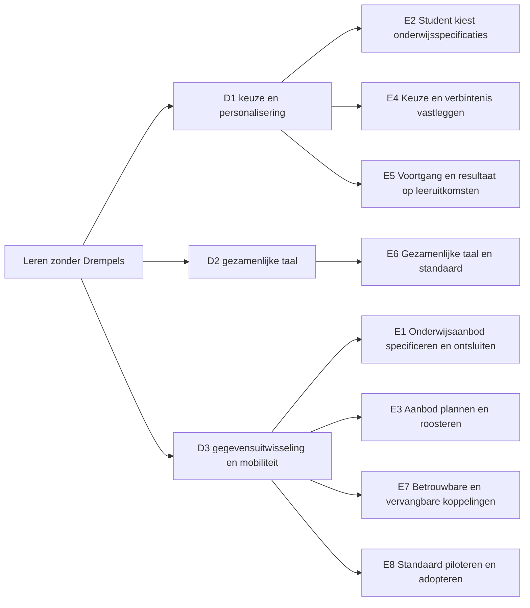

# Requirementsboom

De gelaagde breakdown van de OKx-requirements: van de opdracht (Leren zonder Drempels) via epics en features naar stories, met onderaan de aansluiting op de koppelingspecificaties. De boom is de getoonde koppeling tussen business en techniek; elke rij draagt een bron. Relateert aan: #130.

## De boom in één plaat

De plaat toont de opdracht, de drie doelen en de acht epics. Features en stories staan alleen in de tabellen; elke rij draagt een id (E, F, S) om naar te verwijzen.

## Navigatie

| Laag | Bestand | Stand | Voor wie vooral |
|---|---|---|---|
| Opdracht | [opdracht.md](opdracht.md) | drie doelen | product owner en kernteam |
| Epics | [epics.md](epics.md) | acht epics, zes tot stories uitgewerkt | product owner en kernteam |
| Features | [features.md](features.md) | vijfendertig features | kernteam en technische werkgroep |
| Stories | [stories.md](stories.md) | tweeëntwintig stories, negen met interactiekoppeling | technische werkgroep en leveranciers |
| Leeswijzer | [leeswijzer.md](leeswijzer.md) | leesroutes naar de bestaande documentatie | iedereen |

## Conventies

- Vorm en spelregels: [skill okx-requirements-boom](../../../.agents/skills/okx-requirements-boom/SKILL.md). Kern: één document per laag, elke rij één ouder, één bron en een id, overzicht boven volledigheid.
- Id's (E1, F2.1, S2.3) zijn verwijzings-id's voor issues, reviews en gesprekken; planningsstatus leeft in milestones en issues, niet in deze tabellen.
- Systeemafkortingen in de tabellen: OC (onderwijscatalogus), SKS (studentkeuzesysteem), P&R (planning en roostering), SIS (studentinformatiesysteem), LMS (leermanagementsysteem), SVS (studievoortgangsysteem).
- Bronafkortingen in de tabellen: ADR (architecture decision record, in Npuls-OKx/Public), U (uitgangspunt bij de koppelvlakspecificaties), OKx-AP (architectuurprincipe).
- Herkomst en verificatie van elke rij: [extractieverantwoording](../../agent-artifacts/research/20260806_0837_requirementsboom-extractie.md), inclusief de parkeerlijst met kandidaten voor een volgende ronde.
- Eis-id's en uitvoerbare scenario's staan bewust niet in de boom. Die achtergrondmechaniek volgt gefaseerd; zie de [synthese van het onderzoek](../../agent-artifacts/research/20260804_1700_oplossingsrichtingen-business-techniek.md) en issue #135.

## Scope

Deze map bevat de requirementsboom: de vier laagdocumenten, de leeswijzer en deze index. De boom verwijst naar bestaande documenten en herhaalt ze niet. Al het overige valt buiten scope.
