# Requirementsboom

De gelaagde breakdown van de OKx-requirements: van de opdracht (Leren zonder Drempels) via epics en features naar stories, met onderaan de aansluiting op de koppelingspecificaties. De boom is de getoonde koppeling tussen business en techniek; elke rij draagt een bron. Relateert aan: #130.

## De boom in één plaat

Groen is uitgewerkt, grijs wacht op uitwerking. Features staan in de plaat voor de uitgewerkte epics; elke epic toont zijn stories als één verzamelknoop.

```mermaid
flowchart TD
  LZD["Leren zonder Drempels"] --> D1["D1 keuze en personalisering"] & D2["D2 gezamenlijke taal"] & D3["D3 gegevensuitwisseling en mobiliteit"]
  D3 --> E1["Onderwijsaanbod specificeren en ontsluiten"]
  D1 --> E2["Student kiest onderwijsspecificaties"]
  D3 --> E3["Aanbod plannen en roosteren"]
  D1 --> E4["Keuze en verbintenis vastleggen"]
  D1 --> E5["Voortgang en resultaat op leeruitkomsten"]
  D2 --> E6["Gezamenlijke taal en standaard"]
  D3 --> E7["Betrouwbare en vervangbare koppelingen"]
  D3 --> E8["Standaard piloteren en adopteren"]
  E1 --> F11["Catalogus vullen vanuit curriculumontwerp"]
  E1 --> F12["Hiërarchische, refereerbare specificatiestructuur"]
  E1 --> F13["Stabiele identiteit en versionering van specificaties"]
  E1 --> F14["Leeromgeving inrichten op de specificatie"]
  E1 --> S1["3 stories"]
  E2 --> F21["Kiesbaarheid bepalen"]
  E2 --> F22["Keuzecriteria als queryparameters op de aanbodquery"]
  E2 --> F23["Regelsets los van items, met min/max-keuzeregels"]
  E2 --> F24["Leeruitkomst-id's als opaque sleutels in keuzeregels"]
  E2 --> F25["Regelsets versioneren voor verantwoording"]
  E2 --> S2["5 stories"]
  E3 --> F31["Drie stadia van onderwijsaanbod"]
  E3 --> F32["Planbaarheid als rijpheidskenmerk"]
  E3 --> F33["Geldig, gefaseerd aanbod afleiden"]
  E3 --> F34["Eigenaarschap van het aanbodobject"]
  E3 --> F35["Haalbaarheid van keuze en ontwerp toetsen"]
  E3 --> S3["6 stories"]
  E5 --> F51["Resultaatstructuur inrichten en resultaten registreren"]
  E5 --> F52["Voorwaarden vooraf in behaalde leeruitkomsten"]
  E5 --> F53["Aanvullend resultaat-koppelvlak voor bewijsvoering"]
  E5 --> F54["Toetsing zodra leeruitkomsten gedekt zijn"]
  E5 --> S5["2 stories"]
  classDef uitgewerkt fill:#e8f5e9,stroke:#2e7d32
  classDef wacht fill:#f0f0f0,stroke:#9e9e9e
  class E1,E2,E3,E5,F11,F12,F13,F14,F21,F22,F23,F24,F25,F31,F32,F33,F34,F35,F51,F52,F53,F54,S1,S2,S3,S5 uitgewerkt
  class E4,E6,E7,E8 wacht
```

## Navigatie

| Laag | Bestand | Stand | Voor wie vooral |
|---|---|---|---|
| Opdracht | [opdracht.md](opdracht.md) | drie doelen | product owner en kernteam |
| Epics | [epics.md](epics.md) | acht epics, vier uitgewerkt | product owner en kernteam |
| Features | [features.md](features.md) | dertig features | kernteam en technische werkgroep |
| Stories | [stories.md](stories.md) | zestien stories met koppelvlakverwijzing | technische werkgroep en leveranciers |
| Leeswijzer | [leeswijzer.md](leeswijzer.md) | leesroutes naar de bestaande documentatie | iedereen |

## Conventies

- Vorm en spelregels: [skill okx-requirements-boom](../../../.agents/skills/okx-requirements-boom/SKILL.md). Kern: één document per laag, elke rij één ouder en één bron, overzicht boven volledigheid.
- Herkomst en verificatie van elke rij: [extractieverantwoording](../../agent-artifacts/research/20260806_0837_requirementsboom-extractie.md), inclusief de parkeerlijst met kandidaten voor een volgende ronde.
- Eis-id's en uitvoerbare scenario's staan bewust niet in de boom. Die achtergrondmechaniek volgt gefaseerd; zie de [synthese van het onderzoek](../../agent-artifacts/research/20260804_1700_oplossingsrichtingen-business-techniek.md) en issue #135.

## Scope

Deze map bevat de requirementsboom: de vier laagdocumenten en deze index. De boom verwijst naar bestaande documenten en herhaalt ze niet. Al het overige valt buiten scope.
