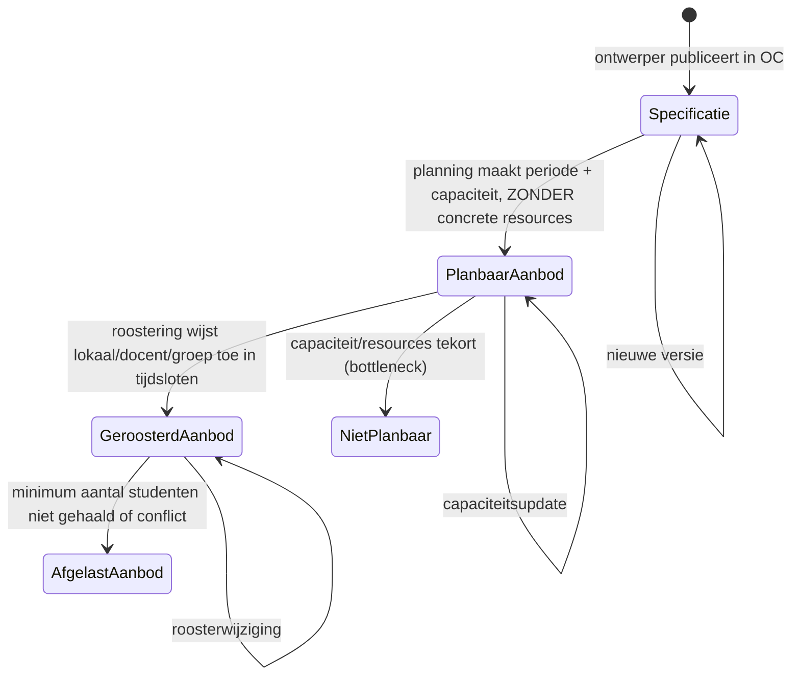
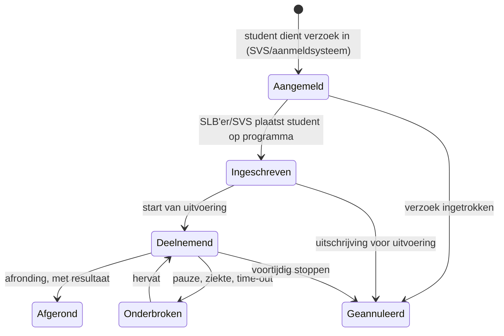

# Begrippenkader en ankertabel

**Doel.** Het semantisch kader van OKx vastleggen: de zes begrippenfamilies (kwalificatiekader, beoogde leeruitkomst, onderwijsspecificatie, onderwijsaanbod, onderwijsverbintenis, onderwijsresultaat), de zes niveaus, de stadia van aanbod en verbintenis, en de ankertabel die niveaus en families kruist. Dit kader is vastgesteld en is de toetssteen voor naamgeving in de requirementsboom, de koppelingspecificaties en de reviews. Relateert aan: #137.

**Scope.** Alleen de begrippen, zonder techniekkeuze. Dit bestand is bij de herstructurering van augustus 2026 losgemaakt uit de [leerroute-uitwerking](leerroute-uitwerking-lr1.md); de eerdere OEAPI-vertaling staat als bronmateriaal in het [archief](archief-conceptmodellen.md), en de definitieve vertaling volgt bottom-up uit de endpoint-gedreven datamodellen in [Npuls-OKx/Public](https://github.com/Npuls-OKx/Public/tree/dev/Koppelvlakspecificaties).

**Positionering in de informatiegelaagdheid (MIM).** In termen van het [Metamodel Informatie Modellering (MIM)](https://docs.geostandaarden.nl/mim/mim/) van Geonovum is dit bestand het model van begrippen (niveau 1). De families en subtypen zijn kandidaat-objecttypen voor het conceptuele informatiemodel (niveau 2), waarvan het concept-informatiemodel in de leerroute-uitwerking de aanzet is; de payload-specificaties en endpoint-sets in Public vormen het logische niveau (niveau 3). Gegevenstypen in MIM-zin, de datatypes van attributen, horen bij die lagere niveaus en niet in dit begrippenkader.

**Aansluiting op MORA en HORA.** De begrippen sluiten aan op de mbo-referentiearchitectuur (MORA) en, via het lopende initiatief Klus 53 (Alignment MORA-HORA) van MBO-Digitaal, op de referentiearchitectuur van het hoger onderwijs (HORA). De uitwerking met de Klus 53-visual staat in de [leerroute-uitwerking](leerroute-uitwerking-lr1.md#betrokken-informatie-bij-proces); de oude MORA-cross-walk staat in het [archief](archief-conceptmodellen.md).

## Zes informatie-objectfamilies

De leerroutes zijn pas vergelijkbaar, en uitwisselbaar tussen instellingen, als alle ketenpartijen (ontwerper, ontwikkelaar, planner, roosteraar, studieloopbaanbegeleider (SLB'er), student, docent en hun systemen) dezelfde begrippen op dezelfde manier hanteren. Onderwijs is van *idee* tot *resultaat* een keten van zes informatie-objectfamilies. Lees ze als opvolgende vragen die in de keten beantwoord worden:

| Familie (kolom)              | Stelt de vraag                                       | Wie levert dit                          | Voorbeeld (Apothekersassistent)                                |
| ---------------------------- | ---------------------------------------------------- | --------------------------------------- | -------------------------------------------------------------- |
| **1. Kwalificatiekader**     | Wat is *normatief* geldig?                           | SBB, CROHO, examencommissie             | Crebo-dossier 23450, kwalificatie 27141, werkproces B1-K1-W1   |
| **2. Beoogde leeruitkomst**  | Wat moet de student *kennen en kunnen*?              | Onderwijsontwerper                      | "Neemt de zorg-/adviesvraag in behandeling"                    |
| **3. Onderwijsspecificatie** | Wat gaan we *organiseren* (sjabloon, herbruikbaar)?  | Onderwijsontwerper + onderwijsontwikkelaar | `Onderwijseenheid-specificatie` "Balie: zorg-/adviesvraag" met een simulatie als leeronderdeel |
| **4. Onderwijsaanbod**       | *Wanneer / met hoeveel / met wie* gaan we het doen?  | Planner (planbaar) + roosteraar (geroosterd) | "Periode 1, max. 24 studenten, lokaal X, docent Y"             |
| **5. Onderwijsverbintenis**  | *Welke student* heeft welke relatie met dit aanbod?  | SLB'er + aanmeldsysteem + SVS           | Jochem is aangemeld of ingeschreven op het `Onderwijseenheid-aanbod` "Balie 2026-P1" |
| **6. Onderwijsresultaat**    | Wat heeft die student *behaald* (status en bewijs)?  | Docent + examencommissie                | Afgerond, met aanwezigheid, microcredential en bewijs per leeruitkomst |

> **Mentaal model.** *Kolom 1 en 2: wat moet? Kolom 3: wat gaan we doen? Kolom 4: wanneer doen we het? Kolom 5: wie doet mee? Kolom 6: wat is de uitkomst?*

Afkortingen: SBB is de Samenwerkingsorganisatie Beroepsonderwijs Bedrijfsleven, CROHO het Centraal Register Opleidingen Hoger Onderwijs en SVS het studievoortgangsysteem.

## Zes niveaus: van diploma tot lesuitkomst

Dezelfde zes families komen op meerdere **niveaus** terug. Het kwalificatiekader van SBB bepaalt de niveaus; OKx volgt diezelfde rij-discipline:

| Niveau (rij) | Wat het betekent |
| ---------------------------------- | ---------------------------------------------------------------------- |
| **Kwalificatiedossier**            | Geheel van een mbo-beroepsdomein                                       |
| **Kwalificatie**                   | Diplomeerbare opleiding binnen het dossier                             |
| **Kerntaak**                       | Samenhangend cluster van werkprocessen                                 |
| **Werkproces**                     | Concreet uitvoerbaar onderdeel van het beroep                          |
| **Lesuitkomst**               | Wat een student in één les leert (formatief)                           |
| **Toets** (cross-cutting)       | Welk cluster van leeruitkomsten of lesuitkomsten summatief wordt beoordeeld |

De hiërarchie groeit mee: een kerntaak heeft meerdere werkprocessen, een werkproces meerdere leeruitkomsten, en een leeruitkomst kan over meerdere lessen worden gespreid (gerichte acyclische graaf, DAG).

## Stadia van onderwijsaanbod: specificatie, planbaar, geroosterd

Aanbod ontstaat in stappen. Dit onderscheid is **cruciaal** voor de scenario's, omdat een student aan het begin van het schooljaar typisch *niet* voor alle drie de jaren tegelijk geroosterd is: sommige eenheden zijn al geroosterd, andere alleen planbaar, en weer andere staan nog alleen als specificatie.

- **Specificatie** = ontwerp/sjabloon. Stabiel, herbruikbaar, versieerbaar. Bevat *wat* geleerd wordt en *hoe organiseerbaar* (onder meer leervorm, onderwijstijd, ruimtetype en expertiseprofiel).
- **Planbaar aanbod (stadium 2a)** = specificatie ingepast in **perioden** + **capaciteit** (maximum aantal studenten). **Geen** concrete resource-instanties. Hoort bij de planner.
- **Geroosterd aanbod (stadium 2b)** = planbaar aanbod met **concrete tijdsloten** + **resource-instanties** (lokaal-instantie, personeelsnummer). Hoort bij de roosteraar.

## Stadia van onderwijsverbintenis: aangemeld, ingeschreven, deelnemend, afgerond

Een student loopt parallel een eigen state-machine: van eerste belangstelling tot afronding. Verbintenissen bestaan op elk niveau (programma, eenheid, leergelegenheid, toets) en ze hebben elk hun eigen state:

Het minimumresultaat is de status van de verbintenis per niveau (deelnemend, afgerond). Rijkere bewijsvoering op leeruitkomstniveau vraagt een aanvullend resultaat-koppelvlak; die signalering staat met het oudere conceptmateriaal in het [archief](archief-conceptmodellen.md).

## De ankertabel: zes niveaus maal zes families

De volgende tabel is de **canonieke verankering** van de zes begrippenfamilies (kolommen) op de zes niveaus (rijen). Lees als: "*per niveau (rij) hebben we een kwalificatiekader, beoogde uitkomsten, een specificatie, een aanbod, een verbintenis en een resultaat*". De tabel is in eerdere versies §12.0.2 geweest; dit is nu de definitieve plek.

| Niveau (rij) ↓ \ Familie (kolom) →                                                           | **1. Kwalificatiekader**                                                                  | **2. Beoogde leeruitkomst**                                                                   | **3. Onderwijsspecificatie**       | **4. Onderwijsaanbod**                                                                                                         | **5. Onderwijsverbintenis**                  | **6. Onderwijsresultaat**                            |
| -------------------------------------------------------------------------------------------- | ----------------------------------------------------------------------------- | --------------------------------------------------------------------------------------------- | ---------------------------------- | ------------------------------------------------------------------------------------------------------------------------------ | -------------------------------------------- | ---------------------------------------------------- |
| `Kwalificatiedossier`                                                                        | SBB-dossier                                                                   | *n.v.t. op dit niveau*                                                                        | `Opleidingsspecificatie`           | `Opleidingsaanbod`                                                                                                             | `Opleidingsverbintenis`                      | `Opleidingsresultaat`                                |
| `Kwalificatie`                                                                               | SBB-kwalificatie                                                              | *n.v.t. op dit niveau*                                                                        | `Opleidingsprogramma-specificatie` | `Opleidingsprogramma-aanbod`                                                                                                   | `Opleidingsprogramma-verbintenis`            | `Opleidingsprogramma-resultaat`                      |
| `Kerntaak`                                                                                   | SBB-kerntaak                                                                  | **Collectie van leeruitkomst-collecties (LO-collecties)** (kerntaak heeft meerdere werkprocessen, elk met een eigen LO-set) | `Onderwijseenheid-specificatie`    | `Onderwijseenheid-aanbod`                                                                                                      | `Onderwijseenheid-verbintenis`               | `Onderwijseenheid-resultaat`                         |
| `Werkproces`                                                                                 | SBB-werkproces                                                                | **Collectie leeruitkomsten** (summatief)                                                      | `Leeronderdeel-specificatie`       | `Leergelegenheid` (groep van lessen)     | `Leergelegenheid-verbintenis` | `Leergelegenheid-resultaat` (behaald-status) |
| *n.v.t. kwalificatiekader*                                                                   | (instelling-eigen)                                                            | `Lesdoel / Lesuitkomst`                                                                       | `Lesspecificatie`                  | `Lesgelegenheid`      | `Lesgelegenheid-verbintenis` | `Lesgelegenheid-resultaat` (eventueel aanwezigheid) |
| Summatief: vaststelling Examencommissie t.o.v. leeruitkomsten / formatief: instellingsbeleid | Examencommissie-besluit (summatief) of instellingsbeleid (formatief)                | `Lesuitkomst`/set, `Leeruitkomst`/set, `Werkproces`/set, … (scope van toetsing)               | `Toetsonderdeel-specificatie`      | `Toetsgelegenheid`                                                                                                             | `Toetsgelegenheid-verbintenis`               | `Toetsresultaat / Aanwezigheid`                      |

**Cardinaliteit (normatief voor dit begrippenkader):**

- `Kerntaak (1..*) Werkproces`
- `Werkproces (1..*) Leeruitkomst` (summatief)
- `Leeruitkomst (0..*) Onderwijseenheid` / `Leeronderdeel` / `Toetsonderdeel` (dezelfde LO kan over meerdere onderdelen verdeeld zijn; onderdelen kunnen meerdere LO's dekken)
- `Leeruitkomst (0..*) Lesuitkomst` (formatief; DAG/boom-structuur)

**Voetnoot.** OKx richt zich in deze uitwerking primair op het beschrijven van de **werkproceslaag**. De entiteit *leergelegenheid* (groep van lessen) leidt uiteindelijk tot individueel geroosterde lessen; een `lesgelegenheid` is zo'n individueel geroosterde les. Binnen geroosterde lessen kunnen op hun beurt geneste lessen voorkomen; in toekomstige iteraties moeten ook deze recursief volgens dit datamodel gemodelleerd kunnen worden. Dit geldt eveneens voor diepere sublagen zoals een *lessenreeks* of specifieke leeractiviteiten binnen een les. Dit erkent expliciet dat onder een *leergelegenheid* of *lessenreeks* nog een hiërarchie van leeronderdelen kan bestaan, met directe impact op bottom-up en top-down aggregatie.

> **Verdiepende verwijzingen:** de uitwerking op attribuutniveau staat in de [payload-onderwijsspecificatie](https://github.com/Npuls-OKx/Public/blob/dev/Koppelvlakspecificaties/Koppelingspecificaties/gedeeld/payload-onderwijsspecificatie.md); het oudere conceptmateriaal en de OEAPI-vertaling staan in het [archief](archief-conceptmodellen.md).
