# Leerroute-uitwerking: leerroute 1 als basis, 2 en 3 als delta

## Inleiding

Dit document is de leerroute-uitwerking van OKx volgens de [AMIGO-aanpak](https://www.edustandaard.nl/amigo/aanpak/), stap 1 tot en met 3: scenario-analyse, gegevensanalyse en interactie-analyse. Het beschrijft per Npuls-leerroute de begrippen, actoren, scenario's, betrokken systemen en informatiestromen waarmee de keten flexibel onderwijs organiseert. Het document heette eerder "OKx OEAPI consumer-profiel"; die naam dekte de lading niet en zette de techniekkeuze voorop (#137).

Leerroute 1 (regulier) is volledig uitgewerkt en vormt de basis; leerroute 2 (temporiseren by design) en leerroute 3 (versnellen by design) zijn beschreven als delta ten opzichte van die basis. Dat de uitwerking op leerroute 1 is gebaseerd betekent niet dat er buiten die route geen eisen bestaan: latere leerroutes stellen eigen eisen en volgen als delta zodra ze aan de beurt zijn.

Eisen komen vóór de techniekkeuze. De vertaling naar OEAPI of een andere technische standaard ontstaat bottom-up en endpoint-gedreven in de koppelingspecificaties en payload-specificaties in [Npuls-OKx/Public](https://github.com/Npuls-OKx/Public/tree/dev/Koppelvlakspecificaties); de eerdere top-down conceptmodellen en OEAPI-mappings staan als bronmateriaal in het [archief](archief-conceptmodellen.md).

**Leeswijzer.** Het [begrippenkader met de ankertabel](begrippenkader.md) definieert de zes begrippenfamilies, de niveaus en de stadia; de [scenario-uitwerkingen](scenario-uitwerkingen.md) geven de concrete gebruikersscenario's per leerroute; de persona's ([Jochem](persona_jochem.md), [Larissa](persona_larissa.md), [Linda](persona_linda.md)) zijn de rode draad per leerroute.

**Voor wie.** Kernteam OKx, kerngroep techniek, architecten, leveranciers en professionals van instellingen.

## 1. Wat is OKx en wat wil het bereiken?

### 1.1 Wat is OKx?

OKx is een afspraakstelsel, leunend op een gegevensstandaard om onderwijs op de lange termijn **flexibeler** te maken, zonder dat iedere instelling en leverancier opnieuw dezelfde vertaalslag hoeft te doen. De kern is dat studenten onderwijs op verschillende manieren moeten kunnen volgen en combineren, terwijl instellingen het onderwijs nog steeds **organiseerbaar** moeten houden.

De Npuls-leerroutes (zie [§3.5](#35-scenario-analyse--start) en [§3.2.1](#321-de-npuls-leerroutes)) maken dit concreet. Ze beschrijven varianten zoals regulier, versneld (bijv. met vrijstellingen/EVC), personaliseren binnen de instelling, personaliseren over de instellingsgrens (binnen sector) en modulair studeren (vrije keuze, bundelen, stapelen).

### 1.2 Wat wil OKx bereiken?

In alle leerroutes komt dezelfde ketenvraag terug:

- Hoe vindt een student passend onderwijsaanbod?
- Hoe maken we zichtbaar *wat* het onderwijs is én *hoe* het georganiseerd wordt (tijd, leervorm, ruimte, expertise, middelen)?
- Hoe kunnen planning en roostering bepalen of het uitvoerbaar is (capaciteit, mensen en middelen)?
- Hoe leggen we keuze/intekening/inschrijving en voortgang vast, zodat het herleidbaar en overdraagbaar blijft?

OKx werkt toe naar de volgende resultaten (bron: projectplan OKx v202506):

1. Komen tot **gezamenlijke taal** en **standaarden** voor gegevensuitwisseling die een **scala aan flexibilisering** mogelijk maken.
2. Komen tot **functionele** en **technische gegevensuitwisseling** voor het mbo, hbo en wo die **studentmobiliteit** ondersteunen.
3. Pilot studentmobiliteit starten bij mbo: **implementatie en realisatie van de digitale koppelingen**, eventueel met gebruik van bestaande SURF-diensten.

### 1.3 Scope

Dit profiel is in eerste instantie gericht op het **mbo**, omdat het direct aansluit op het werk van OKx in de mbo-keten en omdat de use-cases rond keuze, planning, roostering en modulair aanbod daar het meest urgent en concreet zijn. Tegelijk moet het profiel op termijn **sector-overstijgend** en **nationaal** kunnen werken, zodat onderwijsaanbod en leerresultaten uitwisselbaar worden over instellingen en (waar passend) over sectoren heen.

OKx sluit aan op het lopende initiatief **Klus 53** (MBO-Digitaal): alignment van **MORA** en **HORA** als basis voor het informatiemodel in dit profiel (zie ook §3.3.1.2.5).

### 1.4 Koppelvlakken als doel én als middel

Koppelvlakken maken het mogelijk dat systemen in de keten dezelfde kerninformatie **op dezelfde manier** uitwisselen. Daarmee kan een onderwijscatalogus aanbod vindbaar en vergelijkbaar maken, kan een planningssysteem haalbaarheid berekenen en capaciteit terugkoppelen, kan een roostersysteem het onderwijs in tijdsloten, en worden studenten o.b.v. inschrijvingen en keuzes geroosterd en aan de bijbehorende cursussen in het leermanagement systeem gekoppeld.

Zonder deze afspraken blijft flexibilisering beperkt tot losse pilots en lokale interpretaties. Vanuit OKx wordt geïnventariseerd welke interactiepatronen en scenario's er mogelijk dienen te zijn; de specificatie toetst daaraan. Dit kan resulteren in ketenscenario's die een school samen met leveranciers kan implementeren. **Hoe** scholen en leveranciers koppelvlakken inzetten (met of zonder integratielaag) wordt niet voorgeschreven. OKx neemt daarin een **adviserende** rol. De route van kader naar implementatie loopt via de [projectdeliverables](#2-hoe-okx-dat-bereikt-projectdeliverables) in §2.

## 2. Hoe OKx dat bereikt: projectdeliverables

### 2.1 Deliverable-keten

OKx levert een samenhangende keten van **projectdeliverables** — van kaderstelling tot borging in de sector. Het volgende diagram geeft deze deliverables en de volgordelijkheid hiervan weer:

**Leeswijzer.** De [deliverable-keten en versionering](../../../../../../doc/
OKx_Release-management-en-versionering.md#1-doel-en-scope) staan in het release-document; 
[ketenplaat, BOPSI en projectfase](../../../../../doc/OKx_Projectoverzicht.md) in het 
projectoverzicht.

Het diagram leest **van boven naar beneden**: **meta** (kaderstelling) bovenaan, **spec**, adoptie 
en borging onderaan. Onder het diagram: terugkoppeling van **wijzigingsverzoeken**.

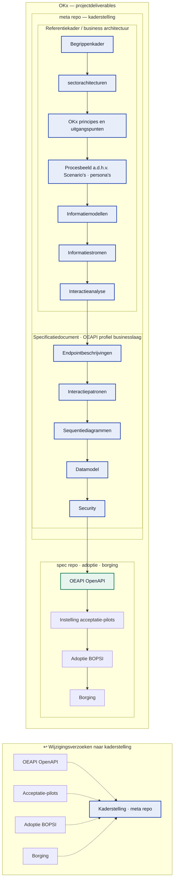
```mermaid
flowchart TB
  subgraph okx [OKx — projectdeliverables]
    direction TB

    subgraph metaRepo ["meta repo — kaderstelling"]
      direction TB
      subgraph refKader [Referentiekader / business architectuur]
        direction TB
        k1["Begrippenkader"] --> k2["Sectorarchitecturen"]
        k2["sectorachitecturen"] --> k7["OKx principes en uitgangspunten"]
        k7 --> k3["Procesbeeld a.d.h.v. Scenario's · persona's"]
        k3 --> k4["Informatiemodellen"]
        k4 --> k5["Informatiestromen"]
        k5 --> k6["Interactieanalyse"]
      end
      subgraph refSpec [Specificatiedocument · OEAPI profiel businesslaag]
        direction TB
        s1["Endpointbeschrijvingen"] --> s2["Interactiepatronen"]
        s2 --> s3["Sequentiediagrammen"]
        s3 --> s4["Datamodel"]
        s4 --> s5["Security"]
      end
      k6 --> s1
    end

    subgraph uitrol ["spec repo · adoptie · borging"]
      direction TB
      openapi["OEAPI OpenAPI"] --> pilot["Instelling acceptatie-pilots"]
      pilot --> bopsi["Adoptie BOPSI"]
      bopsi --> borging["Borging"]
    end

    s5 --> openapi
  end

  subgraph terug ["↩ Wijzigingsverzoeken naar kaderstelling"]
    direction LR
    tr_openapi["OEAPI OpenAPI"] -.-> tr_meta["Kaderstelling · meta repo"]
    tr_pilot["Acceptatie-pilots"] -.-> tr_meta
    tr_bopsi["Adoptie BOPSI"] -.-> tr_meta
    tr_borging["Borging"] -.-> tr_meta
  end

  okx ~~~ terug

  classDef metaFill fill:#e8eef9,stroke:#1e40af,stroke-width:2px,color:#0f172a
  classDef specFill fill:#e8f5ef,stroke:#047857,stroke-width:2px,color:#0f172a
  class k1,k2,k3,k4,k5,k6,k7,s1,s2,s3,s4,s5,tr_meta metaFill
  class openapi specFill
```

*Nummering vanaf §3.2.1 (scenario-uitwerkingen) volgt nog een oudere indeling en wordt in een 
volgende pass opgeschoond.*

| Stap | Deliverable | Korte omschrijving |
|------|-------------|-------------------|
| 1 | **Referentiekader / business architectuur** | Begrippenkader, sectorarchitecturen, procesbeeld (scenario's, persona's), informatiemodellen, informatiestromen, interactieanalyse |
| 2 | **Specificatiedocument** (dit document) | Data-uitwisselingstandaard op businesslaag: endpoints, interactiepatronen, sequentiediagrammen, datamodel, security |
| 3 | **OEAPI OpenAPI** (spec-repo) | Technische implementatie — bouwbaar en testbaar koppelvlak |
| 4 | **Instelling acceptatie-pilots** | Instellingen en leveranciers toetsen de standaard in de praktijk |
| 5 | **Adoptie via BOPSI** | Business architectuur en datamodel mappen; koppelingen met instellingssystemen activeren |
| 6 | **Borging** | Overdracht naar lijnorganisaties na afloop Npuls |

### 2.2 Repositories meta en spec

| Repository | Scope | Rol |
|------------|-------|-----|
| [**meta**](https://github.com/Npuls-OKx/meta) | **Kaderstelling** t/m **specificatiedocument** (businesslaag) | *Wat* de standaard betekent en *hoe* uitwisseling conceptueel is afgesproken |
| [**spec**](https://github.com/Npuls-OKx/specification) | **OEAPI OpenAPI** | Technische implementatie van het profiel |

Versiebeheer en releases: [OKx Release management en versionering](../../../../../doc/OKx_Release-management-en-versionering.md).

### 2.3 Terugkoppeling

Vanaf **OEAPI OpenAPI**, **instelling acceptatie-pilots**, **adoptie via BOPSI** en **borging** kunnen **wijzigingsverzoeken** terug naar **kaderstelling** in meta (zie diagram onder de inleiding). Daar worden ze verwerkt in nieuwe meta-/spec-releases. De eerste reviewbare kaderrelease (`v0.1.0`) wordt ter beoordeling aan de **kerngroep techniek** voorgelegd voordat de spec-implementatie start.

### 2.4 Werkwijze: AMIGO

Om van kaderstelling naar een bouwbare afsprakenset te komen hanteren we de **AMIGO-aanpak**, zoals beschreven door Edustandaard. Zie [AMIGO aanpak](https://www.edustandaard.nl/amigo/aanpak/).

AMIGO leidt stapsgewijs tot een **afsprakenset** (bouwbare uitwisselspecificatie), door scenario's te verhelderen en die te vertalen naar gegevens, interacties en uiteindelijk bericht- en interfacespecificaties. De stappen worden soms iteratief doorlopen: keuzes in bericht of interface kunnen aanleiding zijn om scenario, gegevens of interacties aan te scherpen. De referentiekader-deliverables (§2.1 stap 1) voeden de scenario- en analysefase; dit specificatiedocument (stap 2) en de OpenAPI-spec (stap 3) zijn het resultaat op business- respectievelijk technische laag.

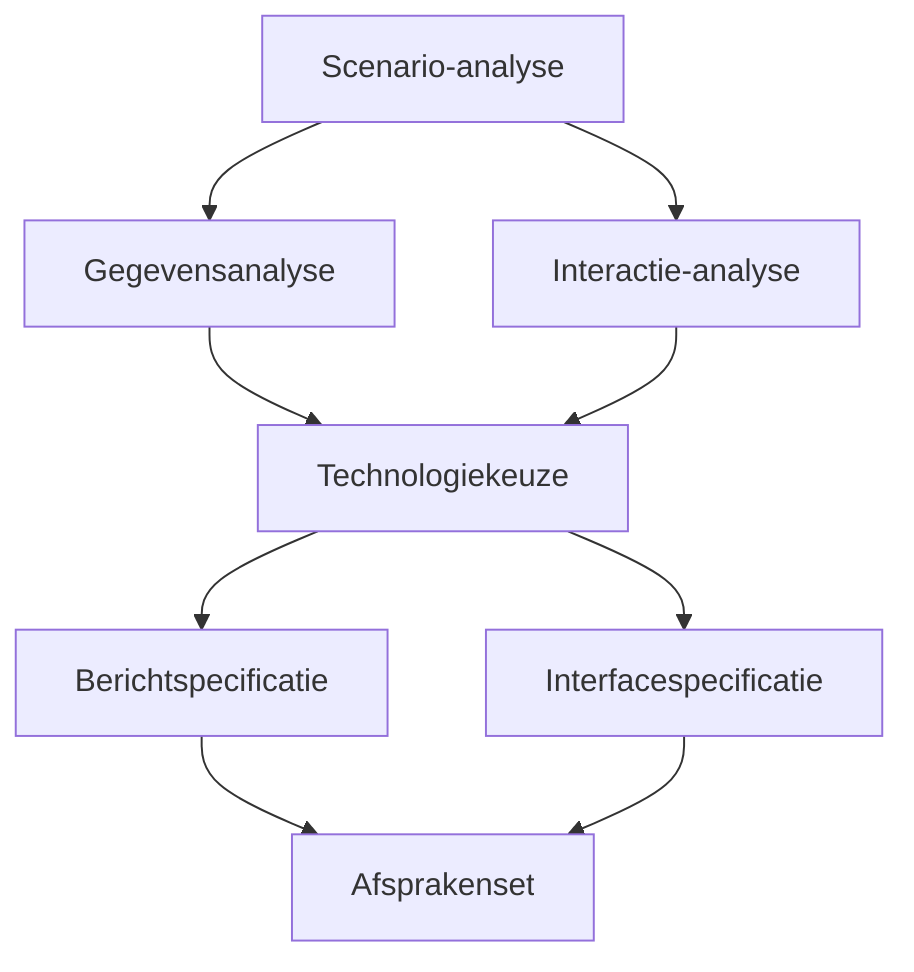
```mermaid
flowchart TD
  scenarioAnalyse[Scenario-analyse] --> gegevensAnalyse[Gegevensanalyse]
  scenarioAnalyse[Scenario-analyse] --> interactieAnalyse[Interactie-analyse]
  gegevensAnalyse --> technologieKeuze[Technologiekeuze]
  interactieAnalyse --> technologieKeuze
  technologieKeuze --> berichtSpecificatie[Berichtspecificatie]
  technologieKeuze --> interfaceSpecificatie[Interfacespecificatie]
  berichtSpecificatie --> afsprakenSet[Afsprakenset]
  interfaceSpecificatie --> afsprakenSet
```

### 2.5 Werken onder architectuur

De projectdoelstellingen (§1.2) brengen twee implicaties met zich mee:

1. **Werken onder architectuur**: we sluiten aan op (sectorale en nationale) architectuurkaders, zodat afspraken herbruikbaar en uitlegbaar blijven.
2. **Werken met en streven naar sectorstandaarden**: we gebruiken waar mogelijk bestaande standaarden en brengen gaps terug als change requests (in plaats van lokale varianten te "verharden").

Dit sluit aan op de deliverable **sectorarchitecturen** (MOSA, HOSA, ROSA, MORA, HORA). Onderstaande schets toont ROSA als knooppunt van architectuurkennis, met sectorale referentiearchitecturen (waaronder MORA voor het mbo).


## 3. Dit document in de keten

### 3.1 Wat is dit document?

Een OEAPI **consumer profiel** (`consumerKey: "okx"`) waarmee de **Onderwijscatalogus (OC)** — als centrale referentiecomponent — haar informatiestromen verrijkt met een **complete onderwijsspecificatie**. Niet alleen *wat* er geleerd wordt, maar ook *hoe*, *waarmee*, *door wie*, *waar* en *hoe lang* — op elk niveau van de hiërarchie.

Dit profiel maakt maximaal gebruik van het **recursieve OEAPI-datamodel** en voegt een gestructureerd specificatie-object toe waar de kern onvoldoende is. Het resultaat is bruikbaar voor:

- **Studenten** die top-down (nominaal programma) of bottom-up (zelf samenstellen) kiezen
- **Planners** die moeten bepalen of de instelling een onderwijswens kan realiseren
- **Onderwijs ontwerpers** die opleidingen en gerelateerde onderwijsprogramma's als curriculum ontwerpen en verdieping vragen binnen de Onderwijscatalogus
- **Onderwijsontwikkelaars** die grofmazige onderwijsspecificaties binnen een curriculum specificeren tot planbare en uitvoerbare onderwijsspecificaties voor onderwijsprofessionals
- **Andere instellingen** die aanbod willen ontvangen en verwerken (interoperabiliteit)

### 3.2 Wat levert dit document op?

Onderstaande tabel koppelt deliverables uit de keten (§2) aan de plek waar ze nu leven: dit document, de bestanden ernaast, de koppelingspecificaties in [Npuls-OKx/Public](https://github.com/Npuls-OKx/Public/tree/dev/Koppelvlakspecificaties) of het [archief](archief-conceptmodellen.md) (oudere top-down concepten, niet normatief).

| Deliverable | Waar |
|-------------|----------------------|
| Begrippenkader | [begrippenkader.md](begrippenkader.md) met de ankertabel en de stadia |
| OKx principes en uitgangspunten | [architectuurprincipes](https://github.com/Npuls-OKx/Public/blob/dev/Referentiemateriaal/principes/principes.md) en [uitgangspunten](https://github.com/Npuls-OKx/Public/blob/dev/Koppelvlakspecificaties/uitgangspunten.md) in Public |
| Sectorarchitecturen | §2.5, MORA/HORA in §3.3.1.2.5 |
| Procesbeeld · scenario's · persona's | §3.5, §3.2.1 en verder, [scenario-uitwerkingen.md](scenario-uitwerkingen.md) |
| Informatiemodellen | conceptmodellen in het [archief](archief-conceptmodellen.md); terugkoppeling volgt uit de payload-specificaties (Public) |
| Informatiestromen | de informatiestromenplaat en het blok "Betrokken systemen bij gegevensuitwisseling" in de leerroute-1-uitwerking; [hoofdplaat](../../../../../doc/OKx_Projectoverzicht.md) |
| Interactieanalyse | het blok "Applicatiecomponenten op de plaat" in de leerroute-1-uitwerking; oudere interactiepatronen in het [archief](archief-conceptmodellen.md) |
| Endpointbeschrijvingen | koppelingspecificaties en endpoint-sets in Public |
| Interactiepatronen | patroonsecties van de koppelingspecificaties in Public |
| Sequentiediagrammen | koppelingspecificaties in Public; oudere versies in het [archief](archief-conceptmodellen.md) |
| Datamodel | payload-specificaties in Public, bottom-up en endpoint-gedreven |
| Security | uitwerking volgt; oudere ontwerpkeuzes in het [archief](archief-conceptmodellen.md) |
| OEAPI OpenAPI (spec-repo) | *Buiten dit document* — [Npuls-OKx/specification](https://github.com/Npuls-OKx/specification) |
| Pilots · BOPSI · borging | [Projectoverzicht](../../../../../doc/OKx_Projectoverzicht.md), [release-doc §1](../../../../../doc/OKx_Release-management-en-versionering.md#1-doel-en-scope) |

### 3.3 OEAPI-broncode en signaleringen

**OEAPI-broncode wordt niet aangepast.** Signaleringen uit deze uitwerking leiden tot OEAPI change requests (zie het [archief](archief-conceptmodellen.md), §9).

### 3.4 Npuls-programmacontext

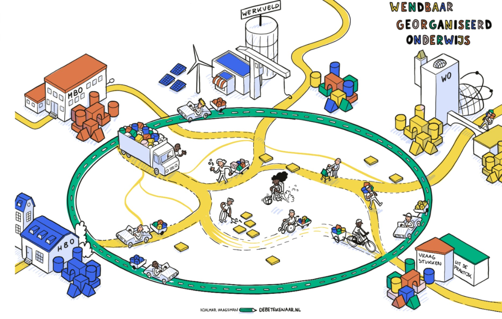

We kennen nu al de gangbare groene route. Hiermee kun je als student van het mbo naar het hbo, en van het hbo naar het wo bewegen, of direct vanuit het mbo, hbo of wo naar het werkveld.

Maar naast de bestaande groene route maken we in het vervolgonderwijs meer mogelijk: leerroutes die dwars door het mbo, hbo en wo gaan, waarbij de lerende — zowel de initiële student als de leven lang lerende — regie heeft op haar eigen leerroute.

Die leerroutes zijn divers en kwalitatief van aard, waarbij de lerende een drempelvrij traject heeft. Dat kan op eigen tempo, gepersonaliseerd (binnen de instelling, buiten de instelling of over de sectoren heen) en modulair — een leven lang.

### 3.5 Scenario-analyse — start

In deze paragraaf werken we de 9 leerroutes uit als **kaderstellende scenario's**: ze vormen de basis voor de concrete scenario's en procesbeschrijvingen die we later verder detailleren. Dit is de deliverable **procesbeeld a.d.h.v. scenario's en persona's** uit de keten (§2.1).

Npuls beschrijft de leerroutes primair vanuit het (eerste) studentenperspectief. Voor implementatie binnen het onderwijskundige en onderwijslogistieke domein is dat niet voldoende: om een leerroute te realiseren zijn ook onderwijskundige beschrijvingen, toetsing en onderwijslogistiek nodig. Daarom koppelen we per leerroute expliciet:

- **Wat** wordt geleerd (kwalificatiekader / beoogde leeruitkomsten)
- **Hoe** het wordt aangeleerd: (leervorm, begeleiding, studielast i.d.v. Studie Belastingsuren (SBU) Begeleidde onderwijstijd (BOT), Onbegeleidde onderwijstijd (OOT) en Flexibele uren, onderwijsspecificaties op werkproces- en lesniveau)
- **Hoe** toetsing en bewijsvoering werken (toets-/examenvorm en scope)

Deze zaken refereren aan **Onderwijsspecificatie**.

- **Hoe** de onderwijsspecificatie organiseerbaar is (planning/roostering binnen beperkte tijd en **mensen en middelen**)

Dit concept refereert aan **Onderwijsaanbod**.

- **Hoe** het geplande aanbod door studenten en instellingsmedewerkers daadwerkelijk gevolgd, beoordeeld en geadministreerd wordt.

Dit concept refereert aan **Onderwijsaanbod verbintenis**.

De uitwerking per leerroute volgt in [§3.2.1](#321-de-npuls-leerroutes) en verderop in dit hoofdstuk.

## Kaderstellende specificatie (vervolg)

### 3.2.1 De Npuls Leerroutes

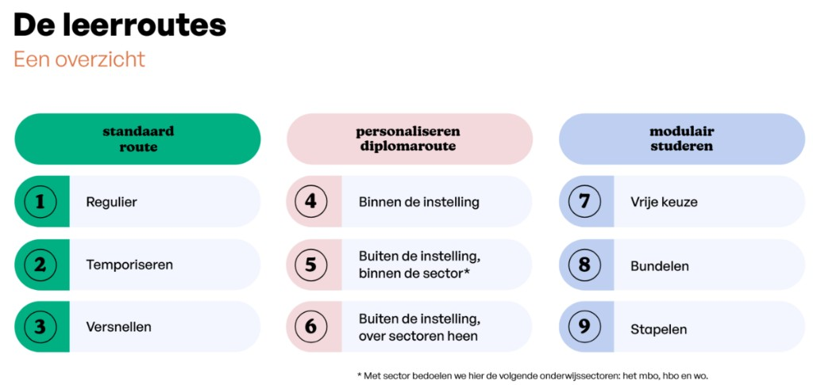

De 9 leerroutes zijn:

- **Standaard route**: [(1) Regulier](persona_jochem.md), [(2) Temporiseren](persona_larissa.md), [(3) Versnellen](persona_linda.md)
- **Personaliseren diplomaroute**: (4) Binnen de instelling, (5) Buiten de instelling, binnen de sector, (6) Buiten de instelling, over sectoren heen
- **Modulair studeren**: (7) Vrije keuze, (8) Bundelen, (9) Stapelen

*Met sector bedoelen we hier de volgende onderwijssectoren: het mbo, hbo en wo.*

#### 3.2.1.1 Leerroute 1 — Regulier

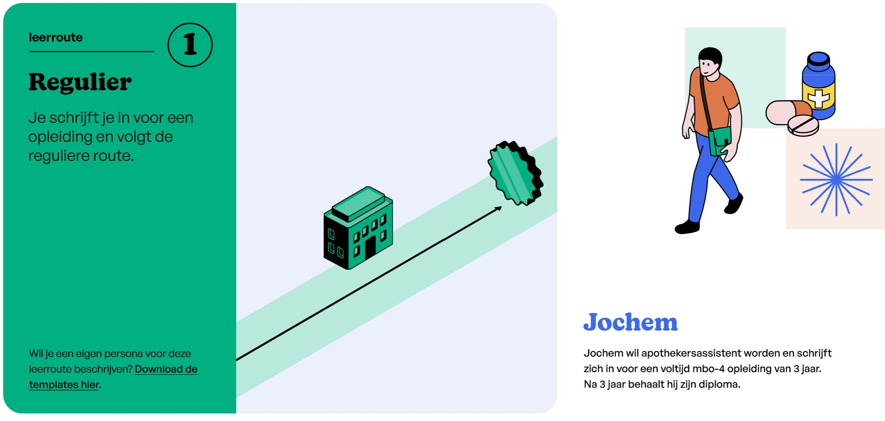

**Persona — Jochem (rode draad voor leerroute 1).** In de uitwerkingen hieronder volgen we **Jochem** (17, na het vmbo): hij wil **apothekersassistent** worden en later in een openbare apotheek werken. Zijn traject sluit aan op het kwalificatiedossier *Apothekersassistent* (CREBO-dossier 23450, kwalificatie 27141; zie [Apothekersassistent-2.md](../../../kwalificatiedossier/Apothekersassistent-2.md)). Het basisdeel omvat kerntaken **B1-K1** (farmaceutische patiëntenzorg), **B1-K2** (logistieke taken in de apotheek) en **B1-K3** (kwaliteit en deskundigheid), elk met onderliggende werkprocessen. Voor een niveau 4 opleiding zijn 720 SBU aan af te nemen keuzedelen verpicht. Jochem dient dus minimaal 1 **keuzedeel** en af te sluiten met een examen. Jochem is geen aparte casus in de keten: hij illustreert waarom dezelfde informatie-objecten, processen en systemen voor élke reguliere student nodig zijn.

#### 3.2.1.1 Wat betekent “regulier studeren”?

##### 3.2.1.1 De student beleving - De Student Journey

> **Vignet — Jochem (oriëntatie en aanmelding).** Op de website van de mbo-instelling ziet Jochem de opleiding *Apothekersassistent — regulier* met start in september, BPV in een openbare apotheek en het gepubliceerde keuzedeelaanbod. Hij herkent in de beschrijving kerntaken als patiëntenzorg en medicatiebewaking. Dat voelt passend; hij meldt zich aan voor de opleiding. Na aanmelden wordt hij **ingeschreven** op het opleidingsprogramma — pas dan wordt zijn route contractueel en administratief vast.

Vanuit studentperspectief lijkt regulier studeren eenvoudig: een student orienteerd zich op basis van gepubliceerd onderwijsaanbod van instellingen. Ziet hij of zij iets wat passend voelt? Dan meldt de student zich aan voor een door de instelling voorgeschreven en aangeboden opleiding. Dan wordt de student ingeschreven op de aangeboden opleiding. Waarna het de intentie voor de student is om de route die de instelling vooraf ontworpen heeft in zijn totaliteit te volgen. Op keuzedelen na, wordt de route niet individueel samengesteld, maar institutioneel voorbereid.

##### Keuzedelen

> **Vignet — Jochem (keuzedeel-voorkeuren).** Jochem stelt een geprioriteerde voorkeurslijst samen met *Ondernemerschap in de zorg* op plaats 1 (semester 2, locatie A), gevolgd door alternatieven op lagere prioriteit — zoals in de tabel hieronder. Per keuzedeel legt hij ook de voorgeprogrammeerde **onderwijsperiode** vast en optinioneel de **onderwijslocatie** vast. Als zijn eerste voorkeur niet haalbaar is op die combinatie, moet hij kunnen heroriënteren; anders blijft zijn **keuzedeelruimte** leeg met studievertraging tot gevolg.

De keuzedelen worden van te voren als beschikbaar aanbod gepubliceerd en getoond aan de student tijdens zijn/haar aanbod oriëntatie. Hierbij zal de onderwijsinstelling vanuit organiseerbaarheid in het individuele aanbod voorsorteren op geschikte beroepsspecifieke keuzedelen in het assortiment en het bredere aanbod van generieke keuzedelen.

Naarmate de student zijn route aflegt, wordt de voortgang van de student gemonitord en de keuze van keuzedelen gefaciliteerd. Zodra de geplande **keuzedeelruimte** dichterbij komt, mag een student zijn/haar geprioriteerde keuzedeel-voorkeurslijst samenstellen. Hierin staat op nummer 1 het keuzedeel met de hoogste voorkeur van de student, en op een hoger volgnummer $x$ (waarbij $x>1$), de keuzedelen met lagere prioriteit.

De student **meldt** zich vervolgens aan op een keuzedeel. Bij deze aanmelding legt de student *per keuzedeelprioriteit* de voorkeur(s) voor de periode in zijn of haar **onderwijsprogramma** vast.

**Voorbeeld keuzedeel prioriteitenlijst:**

| Voorkeur  | Keuzedeel                            | Onderwijsperiode   | Onderwijslocatie         |
|-----------|--------------------------------------|--------------------|--------------------------|
| 1         | Ondernemerschap in de zorg           | Periode 7          | Locatie A                |
| 2         | Duurzame technologie                 | Periode 5          | Locatie B                |
| 3         | Digitale vaardigheden                | Periode 5 of 7     | Locatie A of Locatie C   |

In deze lijst geeft de student aan dat 'Ondernemerschap in de zorg' het meest gewenste keuzedeel is, gevolgd door 'Duurzame technologie', enzovoorts. Per keuzedeel kan optioneel ook de gewenste volgorde van periodes aangegeven worden, zodat de planning hiermee rekening kan houden. De **onderwijslocatie** kan ook een praktijklocatie, *hub* of private- of publieke instelling zijn.

Wanneer de student **niet** het gewenste keuzedeel op de voorkeurs **onderwijslocatie** en/of voorkeurs **onderwijsperiode**, dan **moet** de student op een andere onderwijslocatie kunnen oriënteren op meer passende keuzedelen.

Als er geen passend aanbod (combinatie keuzedeel en/of onderwijsperiode en/of onderwijslocatie) is voor de student, dan blijft de geplande keuzedeelruimte mogelijk oningevuld. Hier wordt actief op gesignaleerd om Jochem een nieuwe keuze te laten maken. 
Jochem heeft in zijn opleiding geplande keuzedeelruimtes, uitgedrukt in SBU's. Jochem dient in deze keuzedeelruimtes ook het minimale SBU's voor zijn kwalificatie te bereiken. Ook hier wordt actief op gesignaleerd.   

Wanneer een passende combinatie van keuzedeel en/of onderwijsperiode en/of onderwijslocatie, voor de student gevonden kan worden, wordt de keuzedeel aanmelding een intekening.

##### Wanneer kiest een student keuzedelen?

De **aanmelding** voor keuzedelen wordt vast gelegd naarmate de in het **onderwijsprogramma** geplande *keuzdeelruimte* dichterbij komt. De keuze van de student wordt uiterlijk een vast gestelde periode $t$ van te voren vastgelegd.

> **Vignet — Jochem** Jochems instelling legt de keuzedeel-aanmelding **1 periode voorafgaande aan de keuzedeelruimte** vast. Staat de prioritering nog goed? Zo niet, past hij zijn **aanmelding keuzedeel** aan voordat het definitief wordt verwerkt. 


**Leeswijzer diagram.** Rechthoeken zijn **processtappen**; ruiten zijn **beslismomenten**; **gele ronde bollen** zijn vastgelegde **informatie-objecten** op het moment dat een **aanmelding** formeel is vastgelegd of is omgezet naar een **inschrijving** (contractuele plaatsing). Voor keuzedelen geldt: maximaal **één actieve inschrijving** per geplande **keuzedeelruimte** in het **onderwijsprogramma**. Bij instellingsbeleid *voorlopige keuze bij intake* (stap 8e) volgt gate **8f**: zolang de prioritering niet meer past, heroriënteert de student en past hij de **keuzedeel-aanmelding** aan (gele bol wordt bijgewerkt) voordat het proces via gate 9 verdergaat.
De student ervaart het volgende proces:

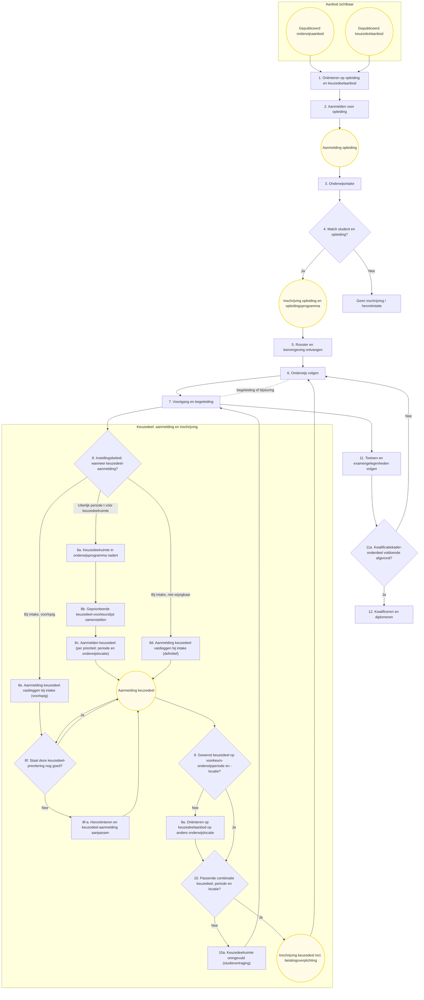
```mermaid
flowchart TB
  subgraph publicatie["Aanbod zichtbaar"]
    gepubliceerdAanbod(("Gepubliceerd onderwijsaanbod"))
    gepubliceerdKeuzedeelAanbod(("Gepubliceerd keuzedeelaanbod"))
  end

  orienteren["1. Oriënteren op opleiding en keuzedeelaanbod"]
  aanmeldenOpleiding["2. Aanmelden voor opleiding"]
  aanmeldingOpleiding(("Aanmelding opleiding"))
  intake["3. Onderwijsintake"]
  matchOpleiding{"4. Match student en opleiding?"}
  inschrijvingOpleiding(("Inschrijving opleiding en opleidingsprogramma"))
  geenMatch["Geen inschrijving / heroriëntatie"]

  roosterOntvangen["5. Rooster en leeromgeving ontvangen"]
  onderwijsVolgen["6. Onderwijs volgen"]
  voortgang["7. Voortgang en begeleiding"]

  subgraph keuzedeelProces["Keuzedeel: aanmelding en inschrijving"]
    momentKeuzedeel{"8. Instellingsbeleid: wanneer keuzedeel-aanmelding?"}
    keuzedeelruimteNadert["8a. Keuzedeelruimte in onderwijsprogramma nadert"]
    samenstellenVoorkeurslijst["8b. Geprioriteerde keuzedeel-voorkeurslijst samenstellen"]
    aanmeldenKeuzedeel["8c. Aanmelden keuzedeel (per prioriteit: periode en onderwijslocatie)"]
    aanmeldingKeuzedeelIntakeVast["8d. Aanmelding keuzedeel vastleggen bij intake (definitief)"]
    aanmeldingKeuzedeelIntakeVoorlopig["8e. Aanmelding keuzedeel vastleggen bij intake (voorlopig)"]
    prioriteringNogGoed{"8f. Staat deze keuzedeel-prioritering nog goed?"}
    herprioriterenKeuzedeel["8f-a. Heroriënteren en keuzedeel-aanmelding aanpassen"]
    aanmeldingKeuzedeel(("Aanmelding keuzedeel"))
    voorkeurHaalbaar{"9. Gewenst keuzedeel op voorkeurs-onderwijsperiode en -locatie?"}
    herorienterenLocatie["9a. Oriënteren op keuzedeelaanbod op andere onderwijslocatie"]
    passendAanbod{"10. Passende combinatie keuzedeel, periode en locatie?"}
    keuzedeelruimteLeeg["10a. Keuzedeelruimte oningevuld (studievertraging)"]
    inschrijvingKeuzedeel(("Inschrijving keuzedeel incl. betalingsverplichting"))
  end

  toetsen["11. Toetsen en examengelegenheden volgen"]
  kwalificatieAfgerond{"11a. Kwalificatiekader-onderdeel voldoende afgerond?"}
  kwalificeren["12. Kwalificeren en diplomeren"]

  gepubliceerdAanbod --> orienteren
  gepubliceerdKeuzedeelAanbod --> orienteren
  orienteren --> aanmeldenOpleiding --> aanmeldingOpleiding --> intake --> matchOpleiding
  matchOpleiding -->|Ja| inschrijvingOpleiding
  matchOpleiding -->|Nee| geenMatch
  inschrijvingOpleiding --> roosterOntvangen --> onderwijsVolgen

  voortgang --> momentKeuzedeel
  momentKeuzedeel -->|Uiterlijk periode t vóór keuzedeelruimte| keuzedeelruimteNadert
  keuzedeelruimteNadert --> samenstellenVoorkeurslijst --> aanmeldenKeuzedeel --> aanmeldingKeuzedeel
  momentKeuzedeel -->|Bij intake, niet wijzigbaar| aanmeldingKeuzedeelIntakeVast --> aanmeldingKeuzedeel
  momentKeuzedeel -->|Bij intake, voorlopig| aanmeldingKeuzedeelIntakeVoorlopig --> prioriteringNogGoed
  prioriteringNogGoed -->|Ja| aanmeldingKeuzedeel
  prioriteringNogGoed -->|Nee| herprioriterenKeuzedeel --> aanmeldingKeuzedeel --> prioriteringNogGoed

  aanmeldingKeuzedeel --> voorkeurHaalbaar
  voorkeurHaalbaar -->|Nee| herorienterenLocatie --> passendAanbod
  voorkeurHaalbaar -->|Ja| passendAanbod
  passendAanbod -->|Nee| keuzedeelruimteLeeg
  passendAanbod -->|Ja| inschrijvingKeuzedeel
  keuzedeelruimteLeeg --> voortgang

  voortgang --> toetsen --> kwalificatieAfgerond
  kwalificatieAfgerond -->|Ja| kwalificeren
  kwalificatieAfgerond -->|Nee| onderwijsVolgen
  onderwijsVolgen --> voortgang
  voortgang -.begeleiding of bijsturing.- onderwijsVolgen
  inschrijvingKeuzedeel --> onderwijsVolgen

  classDef infoObject fill:#fffbe6,stroke:#efd600,stroke-width:2px,color:#333
  class aanmeldingOpleiding,inschrijvingOpleiding,aanmeldingKeuzedeel,inschrijvingKeuzedeel,gepubliceerdAanbod,gepubliceerdKeuzedeelAanbod infoObject
```
*Figuur - Student Journey Regulier - Proces studentbeleving regulier studeren*


**Wanneer wordt aanmelding een inschrijving?**

| Moment | Van (aanmelding) | Naar (inschrijving) | Voorwaarde |
| --- | --- | --- | --- |
| **Opleiding** | `Aanmelding opleiding` (geel) na stap 2 | `Inschrijving opleiding en opleidingsprogramma` (geel) na positieve plaatsing | Match tussen student en instelling op opleiding/programma |
| **Keuzedeel** | `Aanmelding keuzedeel` (geel) na vastlegging voorkeuren | `Inschrijving keuzedeel` (geel) na gate 10 | Passende combinatie van keuzedeel, **onderwijsperiode** en **onderwijslocatie**. Bij geen passend aanbod blijft de **keuzedeelruimte** leeg (mogelijke studievertraging); geannuleerd aanbod kan leiden tot **inactieve** inschrijving. |

> **Vignet — Jochem (twee stappen naar inschrijving).** Eerst wordt Jochems **aanmelding opleiding** na positieve plaatsing een **inschrijving opleiding en opleidingsprogramma**. Later, wanneer zijn keuzedeel op voorkeursperiode en -locatie past, wordt **aanmelding keuzedeel** **inschrijving keuzedeel**. Zonder passend keuzedeelaanbod blijft zijn programma regulier, maar de keuzedeelruimte oningevuld.

##### Jochem's onderwijsperiode start
Jochem het bericht dat zijn 1e keuze voor **Ondernemerschap in de zorg** is geaccepteerd. Hij ontvangt direct de leermiddelenlijst en is in een lesgroep geplaatst. 
De periode is gestart en Jochem ziet naast zijn regulier geplande lessen ook het keuzedeel op het rooster staan. In het student volgsysteem zijn ook de toetsen en het examen zichtbaar die hij voor het keuzedeel zal gaan maken. Daarnaast ziet hij in het LMS de leer- en samenwerk omgeving van zijn keuzedeel lesgroep.


##### 3.3.1.2 De Instellingsbeleving - De Instellingsjourney

Vanuit organisatieperspectief is regulier studeren juist een gecoordineerde ketenprestatie van meerdere actoren. Onderwijsontwerpers vertalen het kwalificatiekader naar opleidings- en onderwijsspecificaties. Onderwijsontwikkelaars detailleren die tot leergelegenheden, lessen en toetsing. Planners en roosteraars maken het uitvoerbaar binnen mensen en middelen. Coaches en SLB'ers begeleiden instroom en plaatsing. Docenten, examinatoren en examenbeoordelaars voeren onderwijs en toetsing uit. "Regulier" betekent dus niet dat er weinig hoeft te gebeuren, maar dat de student een stabiele route ziet omdat de instelling vooraf veel afstemming heeft georganiseerd. 
Parallel aan deze gecoordineerde ketenprestatie vindt er vanuit het onderwijs zelf continue verbeteringen plaats. In specificatie, aanbod of organisatie kan ten alle tijde de wens ontstaan veranderingen door te voeren. Afhankelijk van de impact op de planning, flexibiliteit van het applicatielandschap en algehele wendbaarheid van de onderwijsinstelling, kunnen deze adhoc of enkel op geijkte momenten doorgevoerd worden. De student verdiend immers **doorlopend het beste onderwijs** zonder drempels in zijn/haar journey.     

##### De onderwijsinstelling

Daarom staan we stil bij de organisatie inrichting achter deze leerroute en haar actoren.

*Figuur - Organogram en actoren van een onderwijsinstelling binnen de context van 'regulier' studeren*

> **Vignet — Jochem (actoren).** In de praktijk ontmoet Jochem zijn **SLB'er** (instroom en route), **vakdocenten** (o.a. farmacotherapie en medicatiebewaking), een **BPV-begeleider** in de apotheek en later **examinatoren** rond zijn (keuzedeel-)examen(s). Het organogram hieronder laat zien hoe die rollen in teams en domeinen hangen — niet als losse contactpersonen, maar als onderdeel van één keten.


```mermaid
flowchart TB
  instelling["Instelling"]

  subgraph onderwijsdomeinen["Onderwijsdomeinen"]
    subgraph domeinVerzorging["Domein Verzorging"]
      teamVerzorgingA["Onderwijsteam Verzorging A"]
      teamVerzorgingB["Onderwijsteam Verzorging B"]
    end

    subgraph domeinTechniek["Domein Techniek"]
      teamTechniekA["Onderwijsteam Techniek A"]
      teamTechniekB["Onderwijsteam Techniek B"]
    end

    subgraph domeinEconomie["Domein Economie"]
      teamEconomieA["Onderwijsteam Economie A"]
    end
  end

  subgraph representatieveTeamstructuur["Opbouw van een onderwijsteam"]
    teamleider["Teamleider"]
    docenten["Docenten"]
    onderwijsontwerpers["Onderwijsontwerpers"]
    onderwijsontwikkelaars["Onderwijsontwikkelaars"]
    onderwijslogistiekExpertTeam["Onderwijslogistiek expert (per onderwijsteam)"]
  end

  subgraph strategischOnderwijsLogistiekTeam["Strategische bedrijfsvoering"]
    onderwijslogistiekExpertCentraal["Onderwijslogistiek expert (centraal)"]
    planners["Planners"]
    roosteraars["Roosteraars"]
  end

  subgraph teamOnderwijsbegeleiding["Team Onderwijsbegeleiding"]
    coaches["Coaches"]
    slbers["SLB'ers"]
  end

  subgraph teamOnderwijsondersteuning["Team Onderwijsondersteuning"]
    bpvBegeleiders["BPV- / Praktijkbegeleiders"]
    examinatoren["Examinatoren"]
    surveillanten["Surveillanten"]
  end

  subgraph examencommissie["Examencommissie"]
    voorzitterExamencommissie["Voorzitter"]
    secretarisExamencommissie["Secretaris"]
    ledenUitOpleidingsteams["Leden uit verschillende opleidingsteams"]
  end

  instelling --> onderwijsdomeinen
  instelling --> strategischOnderwijsLogistiekTeam
  instelling --> teamOnderwijsbegeleiding
  instelling --> teamOnderwijsondersteuning
  instelling --> examencommissie
  instelling --> Student

  teamVerzorgingA -.zelfde teamopbouw.-> representatieveTeamstructuur
  teamVerzorgingB -.zelfde teamopbouw.-> representatieveTeamstructuur
  teamTechniekA -.zelfde teamopbouw.-> representatieveTeamstructuur
  teamTechniekB -.zelfde teamopbouw.-> representatieveTeamstructuur
  teamEconomieA -.zelfde teamopbouw.-> representatieveTeamstructuur
  teamVerzorgingA -.leden leveren.-> ledenUitOpleidingsteams
  teamVerzorgingB -.leden leveren.-> ledenUitOpleidingsteams
  teamTechniekA -.leden leveren.-> ledenUitOpleidingsteams
  teamTechniekB -.leden leveren.-> ledenUitOpleidingsteams
  teamEconomieA -.leden leveren.-> ledenUitOpleidingsteams

  teamleider --> docenten
  teamleider --> onderwijsontwerpers
  teamleider --> onderwijsontwikkelaars
  teamleider --> onderwijslogistiekExpertTeam

  onderwijslogistiekExpertCentraal --> planners
  onderwijslogistiekExpertCentraal --> roosteraars
  planners --- roosteraars
  onderwijslogistiekExpertTeam -.afstemming met centrale logistiek.-> onderwijslogistiekExpertCentraal
  coaches --- slbers
  bpvBegeleiders --- examinatoren
  examinatoren --- surveillanten
  voorzitterExamencommissie --> secretarisExamencommissie
  voorzitterExamencommissie --> ledenUitOpleidingsteams
```

> **Eén vorm, vele varianten.** Dit organogram toont **één veelvoorkomende vorm**: één rechtspersoon, impliciet één locatie. In de praktijk bestaan instellingen in sterk uiteenlopende **organisatorische en geografische** vormen — van kleine één-locatie-instellingen tot grote fusie-instellingen met meerdere campussen, samenwerkende (aparte) rechtspersonen en landelijk gespreide netwerken. Welke gevolgen die varianten hebben voor publicatie, planning, plaatsing en erkenning — en hoe de koppeling over al die dimensies werkend blijft — is uitgewerkt in [§3.3.2.4 Organisatorische en geografische complexiteit van instellingen](#3324-organisatorische-en-geografische-complexiteit-van-instellingen), aan de hand van leerroute 2 (persona Larissa).

##### De procesbeleving achter 'regulier' onderwijs van een Instelling

Zoals de [MORA - de referentiearchitectuur voor het mbo](https://mora.mbodigitaal.nl/index.php/Hoofdpagina) laat zien, is "regulier onderwijs verzorgen" niet één los proces maar een samenhang van hoofdprocessen die samen een school laten werken. Om regulier onderwijs mogelijk te maken moet een instelling niet alleen onderwijs **ontwikkelen**, maar ook studenten **informeren, aanmelden, intake en plaatsen**, onderwijs **plannen en roosteren**, onderwijs **verzorgen en begeleiden**, examinering **uitvoeren en vaststellen**, en uiteindelijk **diplomeren**. Wat voor de student voelt als een voorspelbare route, is voor de instelling dus het resultaat van een veel bredere procesketen. Daarvoor heeft de MORA een aantal procesketens beschreven, zie:

*Figuur - Hoofdprocesmodel MORA 2.6 - 12-05-26*


Hier sluit **§2.5 implicatie 1 - werken onder architectuur** direct op aan. Door aan te sluiten op MORA beschrijven we deze keten niet als een lokale werkwijze van één school of team, maar als een herbruikbaar en uitlegbaar architectuurkader voor het mbo. Dat helpt om duidelijk te maken **welke processen, rollen, informatieobjecten en applicaties samenhangen**, en voorkomt dat OKx een eigen parallelle werkelijkheid beschrijft naast de sectorarchitectuur. Voor deze specificatie is MORA daarmee het referentiekader om uit te leggen wat een instelling organisatorisch en procesmatig moet doen voordat "regulier studeren" voor een student überhaupt mogelijk wordt.

**Welke processen moet een onderwijsinstelling faciliteren om 'regulier' studeren te realiseren?**
Procesketen 3, Onderwijsuitvoering en begeleiding:

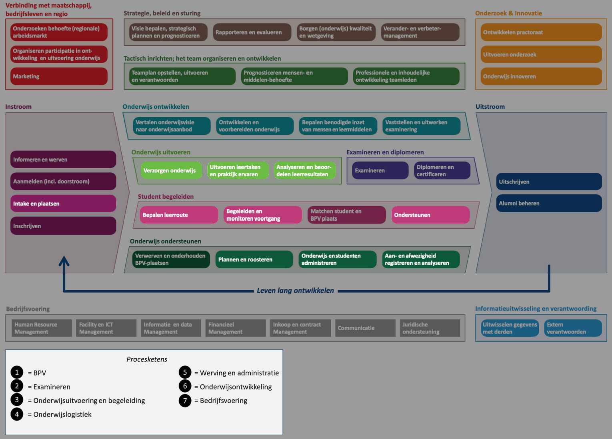

Procesketen 4, Onderwijslogistiek:

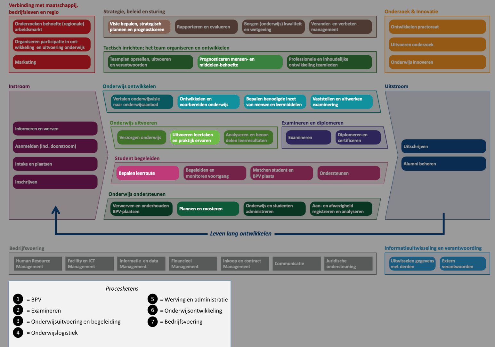

Procesketen 6, onderwijsontwikkeling:


**De Instellingsjourney**
De MORA beschrijft dus betrokken procesketens, maar het complete proces vergt integratie van de losse ketens. De integratie van deze procesketens in de context van verschillende  **Student Journeys**, heet  binnen deze specificatie de **"Instellings Journey"**.

In verhalende vorm ziet die instellingsjourney er als volgt uit. Wanneer een instelling besloten heeft vanuit strategische kaders om een opleiding te geven, gaat de instelling over tot onderwijsontwerp. Een instelling maakt het volgen van een reguliere opleiding mogelijk door het kwalificatiekader te analyseren en te vertalen naar een grofmazig onderwijs- en examenontwerp. Dat ontwerp wordt gepubliceerd en door planning omgezet naar planbaar aanbod: er wordt bepaald of het onderwijs met beschikbare mensen en middelen uitvoerbaar is, in welke perioden het kan plaatsvinden, voor hoeveel studenten, en onder welke condities. Pas daarna kan de student zich op dat aanbod oriënteren, zich aanmelden, intake doorlopen en op een opleiding en opleidingsprogramma geplaatst worden.

Vanaf dat moment verschuift de aandacht van ontwerp naar uitvoering. De instelling werkt leergelegenheden, lessen en toetsspecificaties verder uit, zet planbaar aanbod om in geroosterd aanbod en schrijft student en docent in op concrete onderwijs- en examengelegenheden. Tijdens de uitvoering wordt onderwijs verzorgd, wordt voortgang begeleid en worden toetsmomenten georganiseerd. Aan het eind van de keten volgt de formele examenafname, beoordeling, vaststelling door de examencommissie en uiteindelijk kwalificering en diplomering. Wat voor de student voelt als een reguliere leerroute, is voor de instelling dus een samenhangende keten van ontwerp, logistiek, begeleiding, uitvoering en examinering.

**Instellings Journey in fasen**
1. **Kwalificatiekader analyseren en grofmazig ontwerpen**: de instelling vertaalt kwalificatiedossier, kerntaken, werkprocessen en keuzedeelruimte naar opleidingsspecificatie, onderwijsspecificaties, toetsvormen en een eerste examenplan.
2. **Publiceren en planbaar maken**: de grofmazige onderwijs- en examenspecificaties worden gepubliceerd, waarna de planner haalbaarheid bepaalt en deze omzet naar planbaar aanbod met perioden, capaciteit, inzet en groepen.
3. **Instroom, afstemming en plaatsing**: de student oriënteert zich op het gepubliceerde en planbare aanbod, meldt zich aan, doorloopt afstemming, kiest opleiding en programma, en legt waar nodig keuzedelen vast in het persoonlijke programma.   
4. **Detailleren, roosteren en inschrijven**: de instelling werkt leergelegenheden en toetsspecificaties fijnmazig uit, zet planbaar aanbod om in geroosterd aanbod, en schrijft student en docent in op de concrete onderwijs- en examengelegenheden.
5. **Onderwijs uitvoeren en voortgang begeleiden**: de student volgt het geroosterde onderwijs, de docent verzorgt het onderwijs, plant toetsmomenten in de uitvoering en houdt de formatieve voortgang bij.
6. **Organiseren van keuzemomenten**: Periodiek vinden er keuzemomenten plaats waarin studenten hun definitieve keuzen vastleggen. De instelling heeft dan tot de start van de keuze(delen) de tijd om het haalbaar en betaalbaar te organiseren.  
7. **Bijsturen planning en aanbod**: Naarmate het schooljaar vordert wijkt de planning verder af van het initiële jaarplan. Studenten temporiseren of versnellen, er is uitval,  er zijn wijzigingen in specificatie en/of organisatie. De planner anticipeert en biedt de wijzigingen aan de roostermaker.  
8. **Examineren, vaststellen en diplomeren**: examengelegenheden worden gepland, voorbereid en uitgevoerd, examens beoordeeld, resultaten vastgesteld door de examencommissie en uiteindelijk vertaald naar kwalificering en diplomering.

> **Vignet — Jochem door de 8 fasen.** (1) De onderwijsontwerper vertaalt Jochems kwalificatiedossier naar een grofmazig programma met keuzedeelruimte. (2) Dezelfde onderwijsontwerper geeft genoeg informatie mee in de onderwijsspecificatie, zodat deze specificatie planbaar wordt. Wanneer het programma gepland is, wordt het programma gepubliceert. (3) Jochem oriënteert, meldt zich aan en wordt ingeschreven; (4) Leergelegenheden worden uitgewerkt door de onderwijsontwikkelaar en geroosterd; Jochem en zijn docenten worden op leergelegenheden aangemeld en ingeschreven. (5) Hij volgt lessen en BPV; zijn SLB'er begeleidt de voortgang. (6) Jochem zijn keuzes worden verwerkt en geroosterd (7) Jochem ontvangt roosters voor de volgende periode. (8) Examens worden afgenomen, vastgesteld en vertaald naar kwalificering — het eindpunt van dezelfde keten die hij als student als één route ervaart.

Onderstaand figuur is een *conceptuele* model weergave van de door OKx geobserveerde IST situatie van dit proces. **Gele ronde bollen** zijn informatie-objecten (o.a. **aanmelding** en **inschrijving**); keuzedeel-aanmelding wordt **inschrijving keuzedeel** zodra een passende combinatie van keuzedeel, onderwijsperiode en onderwijslocatie is gevonden (zie §3.2.1.1).

**Leeswijzer diagram.** Fasen 1–5 vormen de lineaire keten van ontwerp tot start uitvoering; **fase 6** (keuzemomenten) en **fase 7** (bijsturen jaarplan) zijn cyclische lussen bovenop die keten — zie terugkoppellijnen naar planner en roosteraar.


```mermaid
flowchart TB
  subgraph onderwijsontwerperVooraf["Onderwijsontwerper (vooraf)"]
    analyseerKwalificatiekader["Analyseren Kwalificatie kader (Kwalificatiedossier/CROHO/CREBO/Keuzedelen)"]
    kwalificatieKader(("Kwalificatie, Kerntaken, Werkprocessen"))
    beschrijfOpleidingsspecificatie["Opleidingsspecificatie beschrijven (Grofmazig ontwerp) op basis van kerntaken (nominaal programma + keuzedeelruimte)"]
    instantieerOnderwijsspecificaties["Onderwijsspecificaties instantiëren op basis van kerntaken en koppelen aan opleidingspecificatie"]
    publiceerOpleidingsspecificatie["Opleidingsspecificatie met onderliggende onderwijsspecificaties publiceren"]
    beschrijfToetsvormen["Toetsvorm(en) beschrijven"]
  end

  subgraph onderwijsontwikkelaar["Onderwijsontwikkelaar"]
    detailleerOnderwijsspecificaties["Onderwijsspecificaties beschrijven en detailleren (fijnmazige onderwijsontwikkeling) op basis van werkprocessen en leertaken"]
    detailleerLeergelegenheid["Leergelegenheid instantiëren,  beschrijven en detailleren op basis van leertaken"]
    beschrijfToetsspecificatie["Toetsspecificatie op basis van toetsvorm beschrijven"]
  end

  subgraph plannerInstelling["Planner (instelling)"]
    bepaalHaalbaarheid["Haalbaarheid bepalen (mensen en middelen, alle opleidingen)"]
    maakPlanbaarAanbod["Planbare onderwijsspecificaties tot onderwijsaanbod maken (periodes, capaciteit, groepen) (incl. examengelegenheid)"]
    organiseerKeuzemoment["Keuzemoment organiseren (periodiek, definitieve keuzes verwerken)"]
    verwerkDefinitieveKeuzes["Definitieve keuzes verwerken naar groepen en capaciteit"]
    bijstuurMomentJaarplan["Bijsturen jaarplan op afwijkingen (uitval, temporiseren, versnellen, switch)"]
    signaleerTrendlijn["Signaleren cumulatieve afwijking t.o.v. initieel jaarplan"]
  end

  subgraph studentOrientatie["Student"]
    orienteerOpGeplandAanbod["Orienteren (op opleidingsspecificatie + gepland aanbod + keuzedeelaanbod)"]
    meldAanOpGeplandAanbod["Aanmelden op gepland aanbod"]
  end

  subgraph slbEnStudent["StudieLoopbaanBegeleider + Student"]
    voerIntakeUit["Intake"]
    kiesOpleidingEnProgramma["Opleiding en opleidingsprogramma kiezen"]
    momentKeuzedeelBeleid{"Instellingsbeleid: moment keuzedeel-aanmelding?"}
    legKeuzedeelVoorkeurslijst["Geprioriteerde keuzedeel-voorkeurslijst samenstellen"]
    meldAanKeuzedeel["Aanmelden keuzedeel (periode en onderwijslocatie per prioriteit)"]
    legKeuzedeelAanmeldingIntake["Keuzedeel-aanmelding bij intake vastleggen (definitief)"]
    legKeuzedeelAanmeldingVoorlopig["Keuzedeel-aanmelding bij intake vastleggen (voorlopig)"]
    aanmeldingKeuzedeel(("Aanmelding keuzedeel"))
    passendKeuzedeelAanbod{"Passende combinatie keuzedeel, periode en locatie?"}
    inschrijvingKeuzedeel(("Inschrijving keuzedeel"))
  end

  subgraph roosteraar["Roosteraar"]
    roosterAanbod["Roosteren"]
    geroosterdAanbod(("Geroosterd aanbod - leergelegenheid (reeks aan lessen)"))
    schrijfInOpGeroosterdAanbod["Inschrijven student en docent op geroosterd aanbod"]
    inschrijvingGeroosterdAanbod(("Inschrijving student en docent op geroosterd onderwijsaanbod (waaronder examengelegenheid)"))
  end

  subgraph docent["Docent"]
    voerOnderwijsUit["Onderwijs Uitvoeren"]
    planToetsgelegenheidTijdensLes["Toetsgelegenheid plannen tijdens geroosterde lessen"]
    toetsStudent["Toetsen"]
    houdFormatieveVoortgangBij["Formatieve voortgang student bijhouden"]
  end

  subgraph studentUitvoering["Student"]
    volgOnderwijs["Onderwijs volgen"]
    volgToetsgelegenheid["Toetsgelegenheid volgen"]
    volgExamengelegenheid["Examengelegenheid volgen"]
  end

  subgraph examinator["Examinator"]
    bereidExamengelegenheidVoor["Geplande examengelegenheid voorbereiden"]
    voerExamengelegenheidUit["Examengelegenheid uitvoeren/begeleiden"]
  end

  subgraph examenbeoordelaar["Examenbeoordelaar"]
    beoordeelGemaaktExamen["Door student gemaakt examen beoordelen"]
  end

  subgraph examencommissieVaststelling["Examencomissie"]
    stelExamenbeoordelingVast["Examen beoordeling vaststellen"]
    kwalificeerEnDiplomeer["Kwalificeren en diplomeren"]
    kwalificeringEnDiplomering(("Kwalificering en diplomering"))
  end

  subgraph examencommissieOntwerp["Examencommissie"]
    examenplan(("Examenplan"))
    examenspecificaties(("Examenspecificatie(s)"))
    examenInstrumenten(("Examen instrument(en) en examen materiaal"))
    stelExamenplanEnSpecificatiesOp["Opstellen examenplan en examen specificaties op basis van werkprocessen"]
    bepaalBenodigdeExamenInstrumenten["Bepalen benodigde examen instrumenten"]
    bepaalBenodigdExamenMateriaal["Bepalen benodigd examen materiaal"]
    besluitInkopenOfConstrueren["Besluiten inkopen of construeren"]
    koopExamenInstrumentenIn["Inkopen examen instrumenten"]
    construeerExamenInstrumenten["Construeren examen instrumenten"]
    stelExamenspecificatieEnInstrumentenVast["Vaststellen examen specificatie, examen materiaal en instrumenten"]
  end

  grofmazigeSpecificaties(("Grofmazige opleidings- / onderwijs- en examenspecificaties"))
  planbaarOnderwijsaanbod(("Gepland Onderwijsaanbod (incl. examengelegenheid)"))
  aanmeldingGeplandAanbod(("Aanmelding voor opleiding en gepland aanbod"))
  inschrijvingGeplandAanbod(("Inschrijving op geplande opleidings- en opleidingsprogramma aanbod"))
  onderwijsresultaat(("Onderwijsresultaat"))


  kwalificatieKader --> stelExamenplanEnSpecificatiesOp
  stelExamenplanEnSpecificatiesOp --> examenplan
  stelExamenplanEnSpecificatiesOp --> examenspecificaties
  examenspecificaties --> bepaalBenodigdeExamenInstrumenten
  bepaalBenodigdeExamenInstrumenten --> bepaalBenodigdExamenMateriaal --> besluitInkopenOfConstrueren
  besluitInkopenOfConstrueren --> koopExamenInstrumentenIn
  besluitInkopenOfConstrueren --> construeerExamenInstrumenten
  koopExamenInstrumentenIn --> examenInstrumenten
  construeerExamenInstrumenten --> examenInstrumenten
  examenInstrumenten --> stelExamenspecificatieEnInstrumentenVast
  stelExamenspecificatieEnInstrumentenVast --> grofmazigeSpecificaties

  examenplan --> bepaalHaalbaarheid
  analyseerKwalificatiekader --> kwalificatieKader --> beschrijfOpleidingsspecificatie --> instantieerOnderwijsspecificaties --> beschrijfToetsvormen --> publiceerOpleidingsspecificatie --> grofmazigeSpecificaties
  grofmazigeSpecificaties --> bepaalHaalbaarheid --> maakPlanbaarAanbod --> planbaarOnderwijsaanbod
  planbaarOnderwijsaanbod --> detailleerOnderwijsspecificaties --> detailleerLeergelegenheid --> beschrijfToetsspecificatie --> inschrijvingGeplandAanbod
  planbaarOnderwijsaanbod --> orienteerOpGeplandAanbod --> meldAanOpGeplandAanbod --> aanmeldingGeplandAanbod
  aanmeldingGeplandAanbod --> voerIntakeUit --> kiesOpleidingEnProgramma --> momentKeuzedeelBeleid
  momentKeuzedeelBeleid -->|Keuzedeelruimte nadert| legKeuzedeelVoorkeurslijst --> meldAanKeuzedeel --> aanmeldingKeuzedeel
  momentKeuzedeelBeleid -->|Bij intake, definitief| legKeuzedeelAanmeldingIntake --> aanmeldingKeuzedeel
  momentKeuzedeelBeleid -->|Bij intake, voorlopig| legKeuzedeelAanmeldingVoorlopig --> aanmeldingKeuzedeel
  aanmeldingKeuzedeel --> passendKeuzedeelAanbod
  passendKeuzedeelAanbod -->|Ja| inschrijvingKeuzedeel --> inschrijvingGeplandAanbod
  passendKeuzedeelAanbod -->|Nee: keuzedeelruimte oningevuld| inschrijvingGeplandAanbod
  kiesOpleidingEnProgramma --> inschrijvingGeplandAanbod
  inschrijvingGeplandAanbod --> roosterAanbod --> geroosterdAanbod --> schrijfInOpGeroosterdAanbod --> inschrijvingGeroosterdAanbod
  inschrijvingGeroosterdAanbod --> voerOnderwijsUit
  voerOnderwijsUit --> planToetsgelegenheidTijdensLes --> toetsStudent --> houdFormatieveVoortgangBij --> voerOnderwijsUit
  inschrijvingGeroosterdAanbod --> volgOnderwijs --> volgToetsgelegenheid --> volgExamengelegenheid --> volgOnderwijs
  volgToetsgelegenheid --> onderwijsresultaat
  toetsStudent --> onderwijsresultaat
  maakPlanbaarAanbod --> volgExamengelegenheid --> voerExamengelegenheidUit
  maakPlanbaarAanbod --> bereidExamengelegenheidVoor --> voerExamengelegenheidUit
  voerExamengelegenheidUit --> beoordeelGemaaktExamen --> stelExamenbeoordelingVast --> onderwijsresultaat --> kwalificeerEnDiplomeer --> kwalificeringEnDiplomering

  inschrijvingKeuzedeel --> organiseerKeuzemoment --> verwerkDefinitieveKeuzes --> roosterAanbod
  houdFormatieveVoortgangBij --> bijstuurMomentJaarplan
  bijstuurMomentJaarplan --> maakPlanbaarAanbod
  bijstuurMomentJaarplan --> roosterAanbod
  bijstuurMomentJaarplan --> signaleerTrendlijn
  signaleerTrendlijn -.heroverweeg.-> bepaalHaalbaarheid

  %% Class definitions volgens opdracht
  %% Plannen en roosteren stappen (groen)
  class bepaalHaalbaarheid,maakPlanbaarAanbod,planbaarOnderwijsaanbod,roosterAanbod,geroosterdAanbod,schrijfInOpGeroosterdAanbod,inschrijvingGeroosterdAanbod,organiseerKeuzemoment,verwerkDefinitieveKeuzes,bijstuurMomentJaarplan,signaleerTrendlijn greenStep

  %% Toets- en examenstappen (paars)
  class beschrijfToetsvormen,beschrijfToetsspecificatie,planToetsgelegenheidTijdensLes,toetsStudent,volgToetsgelegenheid,volgExamengelegenheid,bereidExamengelegenheidVoor,voerExamengelegenheidUit,beoordeelGemaaktExamen,stelExamenbeoordelingVast,examenplan,examenspecificaties,examenInstrumenten,stelExamenplanEnSpecificatiesOp,bepaalBenodigdeExamenInstrumenten,bepaalBenodigdExamenMateriaal,besluitInkopenOfConstrueren,koopExamenInstrumentenIn,construeerExamenInstrumenten,stelExamenspecificatieEnInstrumentenVast,kwalificeerEnDiplomeer,kwalificeringEnDiplomering purpleStep

  %% Alle bollen geel
  class kwalificatieKader,geroosterdAanbod,inschrijvingGeroosterdAanbod,grofmazigeSpecificaties,planbaarOnderwijsaanbod,aanmeldingGeplandAanbod,inschrijvingGeplandAanbod,aanmeldingKeuzedeel,inschrijvingKeuzedeel,onderwijsresultaat,examenplan,examenspecificaties,examenInstrumenten,kwalificeringEnDiplomering yellowNode

  %% Ook stappen die instantiëren als bol worden getekend zoals geroosterdAanbod
  %% Mogelijk andere bollen buiten de subgraphs
  
  classDef greenStep fill:#cbf7d7,stroke:#258b45,stroke-width:2px,color:#222
  classDef purpleStep fill:#e0dcfa,stroke:#7a3ff7,stroke-width:2px,color:#332
  classDef yellowNode fill:#fffbe6,stroke:#efd600,stroke-width:2px,color:#333

  class kiesOpleidingEnProgramma freeze
```

Voetnoot: Het plan en rooster proces is hier bewust conceptueel (vereenvoudigd) weergegeven. Dit proces is complex en wordt in een volgende paragraaf behandeld.


##### Scenario's binnen deze leerroute
Binnen deze leerroute speelt zich niet maar één scenario af. De beschrijving hierboven laat de **nominale beleving** van regulier studeren zien: de student volgt de route zoals de instelling die heeft ontworpen, gepland en geroosterd. In de praktijk kan diezelfde student binnen precies zo'n regulier traject alsnog met verschillende incidenten te maken krijgen. De leerroute blijft dan **regulier**, maar de feitelijke voortgang van de student wijkt tijdelijk af van het bedoelde pad.

De belangrijkste scenario's binnen deze leerroute zijn:

- **Happy flow / nominaal verloop**: alles gaat goed. De student volgt het programma zoals ontworpen en gepland. Er treden geen noemenswaardige verstoringen op, toetsen worden volgens verwachting afgelegd, en de student doorloopt de route in het bedoelde tempo.

- **Incidenteel temporiseren**: de student loopt tijdelijk achter door een gebeurtenis in de uitvoering. Denk aan ziekte, persoonlijke omstandigheden, gemiste lessen, onvoldoende voortgang of een toetsmoment dat niet in een keer wordt behaald. De route blijft regulier, maar de student moet onderdelen later volgen, herkansen of opnieuw laten inplannen.
- **Incidenteel versnellen**: de student blijkt sneller door bepaalde onderdelen heen te gaan dan vooraf verwacht. Dat kan komen doordat een student eerder vaardigheden oppakt, sneller formatieve doelen behaalt of ruimte krijgt om eerder aan een toetsmoment deel te nemen. Ook dan blijft de route regulier, kan de student aanvragen om op onderdelen sneller door dezelfde keten te bewegen.
- **Incidenteel versnellen en temporiseren**: de student loopt op het ene onderdeel voor en op het andere onderdeel achter. Bijvoorbeeld: theorie gaat sneller dan gepland, maar praktijk, BPV of een specifiek werkproces vraagt juist meer tijd. In dat geval ontstaat een gemengd beeld waarin de student nog steeds binnen de reguliere leerroute valt, maar de voortgang per onderdeel niet meer overal gelijk oploopt.

De `happy flow` en de incidentele varianten van temporiseren, versnellen en hybride voortgang zijn niet uniek voor leerroute 1. Ze zijn in feite van toepassing op **elke leerroute** in dit document. Ook binnen temporiseren, versnellen, personaliseren of modulair studeren kunnen studenten onderweg in nominaal tempo doorlopen, incidenteel vertragen, incidenteel versnellen of beide tegelijk ervaren. Daarnaast kent iedere leerroute ook eigen, route-specifieke scenario's. Voor leerroute 1 is \"wisselen van opleiding en behaalde resultaten meenemen\" daarvan een belangrijk voorbeeld.

##### Overige scenario's specifiek voor leerroute 1

- **Wisselen van opleiding en behaalde resultaten meenemen**: een student volgt eerst een deel van de reguliere route, besluit daarna over te stappen naar een andere opleiding of een ander regulier programma, en wil eerder behaalde resultaten meenemen. Dit scenario raakt niet alleen de studentbeleving, maar vooral de vraag hoe resultaten, vrijstellingen, voortgang en passende herplaatsing overgedragen en opnieuw erkend worden binnen (en buiten) de instelling. Hierbij geldt ook dat de student niet maanden zou moeten wachten tot het eerst volgende instroom moment. Indien de geplande capaciteit het toelaat zou de student flexibel moeten kunnen instromen in het nieuwe programma.

##### Switch regulier onderwijs ↔ set certificaten

**Trigger.** Een student wil tussentijds het **opleidingsprogramma** loslaten en alleen nog **certificaten** halen (of omgekeerd: van een set certificaten terug naar regulier onderwijs). Dit is met koplopers besproken als **frequent scenario** met hoge prioriteit — een concrete kickstarter voor onderwijsflexibiliteit in ketensystemen.

**Actorflow (hoofdlijnen).** SLB signaleert de wens → onderwijsontwikkelaar/team beoordeelt haalbaarheid en herontwerp → planner en roosteraar hergroeperen aanbod en capaciteit → **KRS/SVS** (en aanverwante registratie) moeten verbintenissen, rechtmatigheid en bekostiging actualiseren. Daar zit nu de grootste pijn: veel **handmatige, foutgevoelige procedures**.

**Informatiestromen-delta t.o.v. reguliere baseline.**

| Aspect | Regulier | Switch naar certificaten (of terug) |
| --- | --- | --- |
| Verbintenis | `Opleidingsverbintenis` op programma | Lossen of opdelen in losse **certificaat-verbintenissen** |
| Resultaten | Voortgang binnen programma | Behaalde resultaten/vrijstellingen **meenemen** en herinterpreteren |
| Rechtmatigheid / bekostiging | Programma- en cohortlogica | Andere regels per certificaat of traject — vaak niet modelmatig ondersteund |

**KRS/SVS-knelpunten.** Systemen zijn ingericht op één doorlopende opleidingsverbintenis; switch vereist nu ad-hoc mutaties, dubbele controles en papieren workarounds. Behoefte: **modelmatige steun** in OEAPI/profiel voor opdelen/samenvoegen van verbintenissen, koppeling aan certificaat-aanbod en traceerbare overgang van rechtmatigheidsstatus.

**Randvoorwaarden (kern).**

| Dimensie | Wat moet vastliggen |
| --- | --- |
| **Beleid** | Wanneer switch is toegestaan; examencommissie en diplomaregels per certificaat |
| **Proces** | Vaste keten SLB → team → planner → registratie; geen parallelle Excel-routes |
| **Informatie** | Welke objecten wijzigen (`Opleidingsverbintenis`, certificaat-aanbod, resultaten) |
| **Data** | Eenduidige identificatie van certificaten, vrijstellingen en resterende SBU/keuzedeelruimte |

Vervolguitwerking (volledige scenario, negenvlak, interfaces): *See also #TBD*.

Deze leerroute volgt een **sterk aanbod-gestuurd model met hybride kenmerken**: het onderwijsaanbod wordt grotendeels vooraf ontwikkeld en gepland. Studenten schrijven zich in op vaste programma’s. Alleen bij uitzonderingen (zoals incidenteel temporiseren of incidenteel versnellen) wijkt men af van de hoofdroute en worden afwijkingen reactief beantwoord. Naast de **statische** kant van onderwijsontwerp speelt de **vraag uit de studentenpopulatie**: die fluctueert per periode, dagdeel, locatie en **BOL/BBL**-verdeling. Het is niet reëel dat niet-generiek aanbod elke periode kan worden ingepland; **afwijkingen cumuleren** wel tot **voorspelbare trendlijnen** waar periodeplanningen afwijken van het initiële jaarplan (§ *Het plan en rooster proces*).

**Alle mbo-instellingen** hanteren in de praktijk dit aanbod-gestuurde grondmodel; **verschillen zitten in de complexiteit** van ontwikkelen en plannen (aantal opleidingen, locaties, keuzedelen, hybride tempo).

| Leerroute | Happy / nominaal | Incidenteel Temporiseren | Incidenteel Versnellen | Incidenteel Hybride | Route-specifiek (voorbeeld) |
| --- | --- | --- | --- | --- | --- |
| **1 — Regulier** | ✓ | ✓ | ✓ | ✓ | Overstap met resultaten; switch regulier ↔ certificaten |
| **2 — Temporiseren** | ✓ | ✓ | ✓ | ✓ | (eigen lijst in hoofdstuk X) |
| **3 — Versnellen** | ✓ | ✓ | ✓ | ✓ | (eigen lijst in hoofdstuk X) |
| **4–8 — Personaliseren / modulair** | ✓ | ✓ | ✓ | ✓ | Per route in hoofdstuk X |
| **9 — Vrije keuze** | ✓ | ✓ | ✓ | ✓ | Modulair samenstellen |

De uitwerking en specificatie van de scenario's volgt in `HOOFDSTUK X`.

##### Betrokken informatie bij proces

De begrippen in onderstaande tabel vullen het begrippenkader uit paragraaf 2.1 aan. Eerder is beschreven dat een leerroute niet alleen over het studentperspectief gaat, maar ook over drie samenhangende vragen: **wat** geleerd wordt, **hoe** dat onderwijs als specificatie wordt ontworpen, **hoe** dat ontwerp organiseerbaar wordt gemaakt als aanbod, en **hoe** dat aanbod uiteindelijk door studenten en medewerkers daadwerkelijk gevolgd en geadministreerd wordt. De tabel hieronder zet die begrippen om in een vaste set informatie-objecten, zodat scenario's, informatiestromen en koppelvlakken steeds over dezelfde bouwstenen spreken.

Samengevat:

| Vraag                                        | Concept                | Doel/toelichting                                                                                                   |
|----------------------------------------------|------------------------|--------------------------------------------------------------------------------------------------------------------|
| Wat wordt geleerd?                           | Onderwijsspecificatie  | Kwalificatiekader / beoogde leeruitkomsten, kerntaken, werkprocessen, leeruitkomsten                              |
| Hoe wordt het aangeleerd?                    | Onderwijsspecificatie  | Leervorm, begeleiding, studielast (BOT/OOT), uitwerking op werkproces- en leergelegenheid niveau                               |
| Hoe werken toetsing en bewijsvoering?        | Onderwijsspecificatie  | Toets-/examenvorm en scope                                                                                         |
| Hoe is het organiseerbaar?                   | Onderwijsaanbod        | Planning/roostering binnen tijd en beschikbare mensen & middelen; daadwerkelijke uitvoerbaarheid van het ontwerp   |
| Hoe wordt het gevolgd/beoordeeld/geadmineerd?| Onderwijsverbintenis   | Werkelijke deelname door student/medewerker, beoordeling, administratie van deelname/resultaten                   |

De volgende tabel is daarmee de brug tussen het **begrippenkader** en het **gegevensmodel**. Het begrippenkader zegt *welke concepten we moeten onderscheiden*; de informatie-objecten maken zichtbaar *welke objecten daarbij horen, op welk niveau van het kwalificatiekader ze bestaan, en hoe ze zich tot elkaar verhouden*. Zo wordt bijvoorbeeld duidelijk dat `Onderwijsspecificatie` niet hetzelfde is als `Onderwijsaanbod`, en dat `Onderwijsverbintenis` weer iets anders is dan het aanbod zelf: het is de relatie tussen student of medewerker en een concreet aanbod.

| **1. Kwalificatiekader** | **2. Onderwijsspecificatie** | **3. Onderwijsaanbod** | **4. Onderwijsverbintenis** | **5. Onderwijsresultaat** |
| --- | --- | --- | --- | --- |
| `Kwalificatiedossier` | `Opleidingsspecificatie` | `Opleidingsaanbod` | `Opleidingsverbintenis` | `Opleidingsverbintenis resultaat` |
| `Kwalificatie` | `Opleidingsprogramma-specificatie` | `Opleidingsprogramma-aanbod` | `Opleidingsprogramma-verbintenis` | `Opleidingsprogramma-verbintenis resultaat` |
| `Kerntaak` | `Onderwijseenheid-specificatie` | `Onderwijseenheid-aanbod` | `Onderwijseenheid-verbintenis` | `Onderwijseenheid-verbintenis resultaat` |
| `Werkproces` | `Leeronderdeel-specificatie` | `Leergelegenheid` | `Leergelegenheid-verbintenis` | `Leergelegenheid-verbintenis resultaat` |
| *n.v.t. binnen kwalificatiekader — eigen beleid instelling* | `Lesspecificatie` | `Lesgelegenheid` | `Lesgelegenheid-verbintenis` | `Lesgelegenheid-verbintenis resultaat` |
| *n.v.t. binnen kwalificatiekader — toetsing* | `Toetsonderdeel-specificatie` | `Toetsgelegenheid` | `Toetsgelegenheid-verbintenis` | `Toetsgelegenheid-verbintenis resultaat` |
| Doorgaands `Werkproces` | `Examenonderdeel-specificatie` | `Examengelegenheid` | `Examengelegenheid-verbintenis` | `Examengelegenheid-verbintenis resultaat` |

**Voetnoot**: Examenonderdelen zijn `speciale` instanties van toetsonderdelen. Examinering vormt echter een gescheiden keten binnen de instelling (zie ook de instelling journey): deze keten kent eigen examenspecificaties, examen-aanbod (gelegenheden), verbintenissen en resultaten. Hoewel de onderliggende informatie in grote lijnen gelijksoortig is aan die van toetsonderdelen, is het doel fundamenteel verschillend: toetsen zijn primair formatief van aard (gericht op leerproces en ontwikkeling), terwijl examens in het kader van kwalificatie, diplomering en/of certificering juist summatief zijn. Voor examens speelt bovendien het verantwoordings- en toezichtaspect richting bijvoorbeeld federale overheidsorganen zoals DUO. Dit verantwoordt de gescheiden keten — onder andere om te borgen dat de beoordelaar (‘de slager’) niet zijn eigen werk beoordeelt (‘eigen vlees keurt’) en scheidt de custody chain en governance van exameninformatie dus bewust af van die van toetsinformatie. Examen-gerelateerde gegevens krijgen doorgaans een striktere (en mogelijk geheel aparte) route van vastleggen, toegang en governance dan toets-gerelateerde gegevens.

**Conceptdefinities per object in het vlakkenmodel** (normatieve kern; uitwerking zie ook §3.3.1.2.5 *Conceptueel gegevensoverzicht*):

| Informatie-object | Conceptdefinitie |
| --- | --- |
| `Leeruitkomst` | Een concreet en observeerbaar resultaat van leren, dat beschrijft wat een student na het doorlopen van één of meer leertaken weet, begrijpt of kan toepassen, en dat als voorwaarde geldt om een opleidingsonderdeel succesvol af te ronden — de vertaling van leertaken in een breakdown door onderwijskundigen. Bij voorkeur uitgedrukt in een sectoroverstijgende, gestandaardiseerde skillstaxonomie (zoals CompetentNL), in dimensies kennis, inzicht en vaardigheden; zie hoofdstuk 4. |
| `Opleidingsprogramma-specificatie` | Een samenhangende verzameling van één of meer (deel)programma's, onderwijseenheden, of leeruitkomsten die kunnen leiden tot een kwalificatie. |
| `Onderwijseenheid-specificatie` | De specificatie van de fundamentele eenheid waarin onderwijs wordt ontworpen en aangeboden, in de vorm van een samenhangend stelsel van één of meer (beoogde) leeruitkomsten, leeronderdelen en/of toetsonderdelen. (NB: Leeruitkomsten omvat o.a. kennis, inzicht en vaardigheden.) |
| `Leeronderdeel-specificatie` | De specificatie van het deel van de onderwijseenheid (onder meer bestaande uit lesstof en opdrachten) waarin de student competenties kan verwerven. |
| `Toetsonderdeel-specificatie` | De specificatie van het deel van de onderwijseenheid (bestaand uit een onderzoek naar kennis, inzicht, houding en vaardigheden van de student), waarmee wordt vastgesteld over welke competenties de student beschikt, leidend tot een formatieve of summatieve beoordeling. |
| `Lesspecificatie` | De specificatie van het kleinste geplande leermoment binnen een leeronderdeel: welke lesinhoud, leeractiviteit of toetsactiviteit in dat moment wordt aangeboden. |
| `Toetsgelegenheid` | Het georganiseerde aanbod van een toetsmoment: wanneer, waar en onder welke condities een toetsonderdeel wordt afgenomen, gekoppeld aan precies één `Toetsonderdeel-specificatie`. |
| `Toetsgelegenheid-verbintenis` | De relatie tussen een persoon en een `Toetsgelegenheid`: de feitelijke (voorbereide of lopende) deelname aan dat toetsmoment. |
| `Toetsgelegenheid-verbintenis resultaat` | Het vastgelegde uitkomstbeeld van die deelname: beoordeling, status en eventueel bewijs, formatief of summatief naar instellingsbeleid. |
| `Examenspecificatie` | De specificatie van een summatief examen (opstelling, instrumenten, beoordelingskader) zoals vastgesteld door de examencommissie, gekoppeld aan te behalen leeruitkomsten of werkprocessen. |
| `Examengelegenheid` | Het georganiseerde aanbod van een examenmoment: planning, locatie, surveillant-capaciteit en kandidaten, gekoppeld aan precies één `Examenspecificatie`. |
| `Examengelegenheid-verbintenis` | De relatie tussen kandidaat en `Examengelegenheid`: inschrijving op en deelname aan de examenafname. |
| `Examengelegenheid-verbintenis resultaat` | Het examenuitkomstbeeld na afname en beoordeling, voorlopig of vastgesteld door de examencommissie. |

**Cardinaliteit (normatief voor dit profiel):**

- `Kwalificatiedossier (1..*) Kwalificatie`
- `Kwalificatie (1..*) Kerntaak`
- `Kerntaak (1..*) Werkproces`
- `Werkproces (1..*) Leeruitkomst` (summatief)
- `Leeruitkomst (0..*) Onderwijseenheid` / `Leeronderdeel` / `Toetsonderdeel` (dezelfde LO kan over meerdere onderdelen verdeeld zijn; onderdelen kunnen meerdere LO's dekken)
- `Leeruitkomst (0..*) Lesuitkomst` (formatief; DAG/boom-structuur)
- `Opleidingsspecificatie (1..*) Opleidingsprogramma-specificatie`
- `Opleidingsprogramma-specificatie (1..*) Onderwijseenheid-specificatie`
- `Onderwijseenheid-specificatie (1..*) Leeronderdeel-specificatie`
- `Leeronderdeel-specificatie (0..*) Lesspecificatie`
- `Opleidingsspecificatie (0..*) Opleidingsaanbod`; elk `Opleidingsaanbod` instantieert precies `1` `Opleidingsspecificatie`
- `Opleidingsprogramma-specificatie (0..*) Opleidingsprogramma-aanbod`; elk `Opleidingsprogramma-aanbod` instantieert precies `1` `Opleidingsprogramma-specificatie`
- `Onderwijseenheid-specificatie (0..*) Onderwijseenheid-aanbod`; elk `Onderwijseenheid-aanbod` instantieert precies `1` `Onderwijseenheid-specificatie`
- `Leeronderdeel-specificatie (0..*) Leergelegenheid`; elke `Leergelegenheid` instantieert precies `1` `Leeronderdeel-specificatie`
- `Lesspecificatie (0..*) Lesgelegenheid`; elke `Lesgelegenheid` instantieert precies `1` `Lesspecificatie`
- `Toetsonderdeel-specificatie (0..*) Toetsgelegenheid`; elke `Toetsgelegenheid` instantieert precies `1` `Toetsonderdeel-specificatie`
- `Toetsgelegenheid (0..*) Toetsgelegenheid-verbintenis`; elke `Toetsgelegenheid-verbintenis` hoort bij precies `1` persoon en precies `1` `Toetsgelegenheid`
- `Examenspecificatie (0..*) Examengelegenheid`; elke `Examengelegenheid` instantieert precies `1` `Examenspecificatie`
- `Examengelegenheid (0..*) Examengelegenheid-verbintenis`
- `Persoon (0..*) Onderwijsverbintenis`; elke `Onderwijsverbintenis` hoort bij precies `1` persoon en precies `1` aanbodobject
- `Opleidingsaanbod` / `Opleidingsprogramma-aanbod` / `Onderwijseenheid-aanbod` / `Leergelegenheid` / `Lesgelegenheid` `(0..*) Onderwijsverbintenis`
- Elke `Onderwijsverbintenis` heeft precies `1` actuele statuswaarde (`Association.state`); aanvullende resultaat-/bewijsregistraties zijn optioneel en daarom `Onderwijsverbintenis (0..*) aanvullend resultaatrecord`

Bovenstaande tabel alligned hiermee met het lopende initiatief onder **Klus 53** (MBO-Digitaal), van het architectuurgremia: de informatiemodellen van **MORA** en **HORA** worden op elkaar afgestemd. Zie onderstaande visual, zoals gepresenteerd in de memo van de uitwerkgroep van Klus 53:

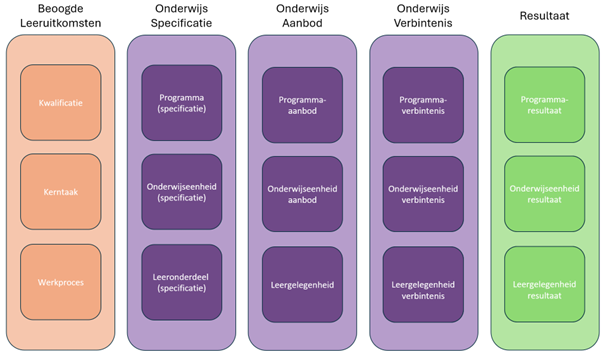

De tabel is daarmee niet bedoeld als extra abstractielaag naast de scenario's, maar juist als hun vaste referentiepunt. Wanneer in dit document gesproken wordt over kwalificatiedossier, kerntaak, werkproces, `leergelegenheid`, `toetsgelegenheid`, `onderwijsspecificatie`, `onderwijsaanbod`, `verbintenis` of `onderwijsresultaat`, dan verwijzen die termen steeds naar deze informatie-objecten en hun positie in het geheel.

**Voetnoot.** OKx richt zich in dit profiel primair tot de diepte van het beschrijven van de **werkproceslaag**. De entiteit *leergelegenheid* (groep van lessen) leidt uiteindelijk tot individueel geroosterde lessen. Binnen geroosterde lessen kunnen op hun beurt geneste lessen voorkomen; in toekomstige iteraties moeten ook deze recursief volgens dit datamodel gemodelleerd kunnen worden. Dit geldt eveneens voor diepere sublagen zoals een *lessenreeks* of specifieke leeractiviteiten binnen een les. Dit erkent expliciet dat onder een *leergelegenheid* of *lessenreeks* nog een hiërarchie van leeronderdelen kan bestaan, met directe impact op bottom-up en top-down aggregatie van onderwijsspecificaties, aanbod en verbintenissen.

##### Het plan en rooster proces

`TO-DO`

**Plannen** en **roosteren** brengen het **onderwijsontwerp** en de **werkelijkheid van de instelling** samen. De leesregel is eenvoudig: **goed beschrijven → goed plannen → goed instelling-breed plannen → goed roosteren**. Een **goed beschreven** `onderwijsspecificatie` levert helderheid in studielast, expertise, volgorde en faciliteiten voor individuele opleidingen. Maar een instelling biedt meerdere opleidingen aan. Om te zorgen dat **al** het door de instelling gewenste aan te bieden onderwijs (zoals beschreven in de `onderwijsspecificatie`), ook echt realiseerbaar is; werkt een planner een jaarplanning uit. Voortbordurend op de strategische meerjarenplanning, bevat deze tactische planning **Alle opleidingsprogramma's van het komend jaar, voor de gehele instelling**. Is ieder aan te bieden opleidingsprogramma planbaar een goed beschreven — dan kan een planner **zo eenvoudig mogelijk** deze grove jaarplanning maken, waarin ook de werkverdeling en lokaalbelasting worden afgestemd. Een **goed instelling-breed plan** (over alle opleidingen, niet alleen één programma) maakt **roosteren** een check-en-finetune-stap in plaats van een puzzel die elke periode opnieuw vanaf nul begint. **Naarmate keuze-complexiteit toeneemt** (keuzedelen, overstap, modulair, hybride tempo) is de kwaliteit van dat plan dé randvoorwaarde voor uitvoerbaarheid.

In de instellingsjourney wordt `onderwijsspecificatie` eerst **planbaar** gemaakt en daarna als `onderwijsaanbod` aanmeldbaar en inschrijfbaar. Tegelijk rijpt fijnmazige onderwijsontwikkeling door. Jochems traject vraagt om medicatiebewaking, bevoegde docent, simulatieruimte én een BPV-cluster — **samenhangende beslissingen** op instellingsbreed jaarplanniveau, niet losse velden per opleiding.

##### Plannen is cyclisch

**Voor de student er is** (instellingsjourney-fasen 1–2): de planner start op een **grofmazige** planbare `onderwijsspecificatie` en maakt een grove **tactisch jaarplanning** met perioden, capaciteit en instroom. Parallel rijpt de `onderwijsspecificatie` vaak in de vorm van een onderwijsprogramma (nominaal programma over de opleidingsduur) mee als template. Beide **rijpen mee** terwijl onderwijsontwikkeling de specificatie detailleert; aanmelding kan al op het grove jaarplan.

**Bij start onderwijsuitvoering** (fasen 4–5): planbaar aanbod wordt geroosterd aanbod; de student ontvangt het eerste rooster op basis van het curriculum-template. Zodra de student **aan boord** is en gaat leren, wijkt het **persoonlijke plan** af van die template (keuzes, tempo, uitval). Die afwijking raakt groepen, roosters en capaciteit op **instellingsniveau** — en vereist dat het **tactisch jaarplan** wordt bijgestuurd, niet alleen een plan in isolatie van één opleiding.

**Tijdens het jaar** (fasen 6–7): keuzemomenten, incidenteel versnellen of temporiseren, hybride trajecten, overstap naar een set certificaten en **720 SBU keuzedeelruimte** (niveau 4) vullen de planner met afwijkingen. **Periodeplanningen wijken cumulatief af** van het initiële jaarplan; **trendlijnen** zijn voorspelbaar. De planner anticipeert en geeft wijzigingen door aan de roosteraar.

> **Jochem.** Hij versnelt op theorie en temporiseert op BPV. Zijn keuzedeel vult de helft van zijn **720 SBU** keuzedeelruimte en moet alsnog passen in een lopend rooster van ruim **2.000** studenten — typisch voor de complexiteit van fase 6 en 7.

Voordat de planner begint, moet de keten **planbaarheidsgegevens** leveren (zie paragraaf *Planbare onderwijsspecificaties* en §3.3.1.2.5). Ontbreken expertise of BPV-vensters in de specificatie, dan vult het planningssysteem **aannames** in — en schuurt de uitvoering alsnog.


##### Voor wie dieper wil: CSP, NP-Hard en controle

**Onderwijsplannen** is in essentie *een invulling van alle open vragen waarbij alle regels tegelijk kloppen*. In de literatuur heet dat een **Constraint Satisfaction Problem (CSP)**: open vragen (*variabelen*), mogelijke antwoorden (*domeinen*) en regels (*constraints* — harde grenzen en zachte voorkeuren). Voor Jochem: in welke periode medicatiebewaking, welke docent, welk lokaal, welk BPV-venster — allemaal tegelijk geldig.

Voordat de planner begint, leveren specificatie, inschrijvingen, groepen, capaciteit en beleid die regels (zie ook de informatietabel *Persoon, groep en constraint*). Een rooster dat voor **alle** studenten, docenten en ruimten tegelijk werkt, is **rekenkundig zwaar** om te *vinden* (NP-moeilijk; o.a. Cooper en Kingston, [DOI 10.1007/3-540-61794-9_66](https://doi.org/10.1007/3-540-61794-9_66)). Tools doen **conceptvoorstellen**; planners en roosteraars **bijsturen**. **Controleren** gaat daarentegen sneller: past Jochems rooster, overlappen lessen en BPV niet, is de docent bevoegd? Zie ook [Constraint satisfaction problems](https://en.wikipedia.org/wiki/Constraint_satisfaction_problem) voor de formele termen.

##### Voorbeeld van groeperingen en plannen en roosteren

> **Jochem.** Zijn **persoonlijke programma** = het nominale apothekersassistent-programma plus het gekozen keuzedeel *Ondernemerschap in de zorg*. Studenten met hetzelfde keuzedeel worden in **groep A** geclusterd; de planner maakt dat planbaar (periode en capaciteit) voordat de roosteraar tijdsloten toewijst.

Verschil tussen nominaal en persoonlijk programma in deze leerroute.

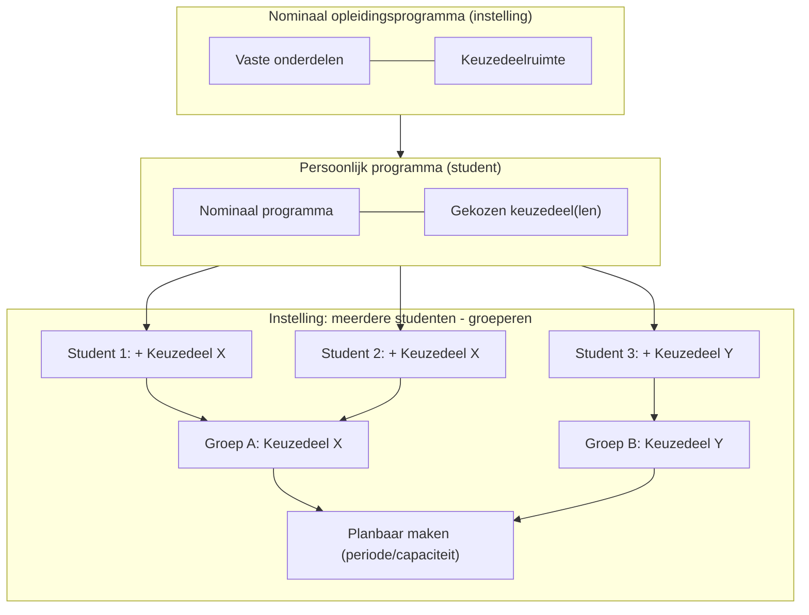
```mermaid
flowchart TB
  subgraph N["Nominaal opleidingsprogramma (instelling)"]
    N1["Vaste onderdelen"] --- N2["Keuzedeelruimte"]
  end

  subgraph P["Persoonlijk programma (student)"]
    P1["Nominaal programma"] --- P2["Gekozen keuzedeel(len)"]
  end

  subgraph M["Instelling: meerdere studenten - groeperen"]
    S1["Student 1: + Keuzedeel X"]
    S2["Student 2: + Keuzedeel X"]
    S3["Student 3: + Keuzedeel Y"]
    G1["Groep A: Keuzedeel X"]
    G2["Groep B: Keuzedeel Y"]
    Plan["Planbaar maken (periode/capaciteit)"]
  end

  N --> P
  P --> S1
  P --> S2
  P --> S3
  S1 --> G1 --> Plan
  S2 --> G1
  S3 --> G2 --> Plan
```

#### Planbare onderwijsspecificaties

**Wanneer wordt een `onderwijsspecificatie` planbaar?** Een `onderwijsspecificatie` begint **grofmazig**: kerntaken en werkprocessen uit het kwalificatiekader zijn vertaald naar opleidings-, opleidingsprogramma- en onderwijseenheid-specificaties, met samenhang en toetsvorm op hoofdlijnen. Op de werkvloer heet die stap vaak **grofmazig onderwijsontwerp**. De specificatie is **planbaar** zodra de planner er zonder giswerk **onderwijsaanbod** van kan maken: perioden, capaciteit, groepen en randvoorwaarden in mensen en middelen. *Planbaar* is daarmee een **rijpheidskenmerk** van de specificatie — geen apart informatie-object naast de specificatie zelf.

**Minimaal benodigde gegevens (conceptueel).** Onderstaande velden maken de overgang van grofmazig naar planbaar expliciet. Ze voeden de constraint-set waarover *Het plan en rooster proces* spreekt.

| Gegevensdimensie | Wat de planner nodig heeft | Voorbeeld (generiek) |
| --- | --- | --- |
| **Studiebelasting** | `SBU` totaal, uitgesplitst in `BOT` (begeleid), `OOT` (onbegeleid) en `BPV`; aparte docentbelasting (contact, voorbereiding, beoordeling) | 40 SBU waarvan 24 BOT, 8 OOT, 8 BPV |
| **Docent-expertise** | Vakinhoud, didactiek, register- of examenbevoegdheden waar van toepassing | Alleen docent met farmaceutische bevoegdheid |
| **Volgorde en ingang** | Relaties tussen onderwijseenheden; vrijstellings- en voorwaardelijke paden (zie §3.3.1.2.5) | *Medicatiebewaking* pas na *Basisfarmacologie* |
| **Toetsvorm** | Op onderwijseenheid-niveau; concrete toetsspecificatie rijpt later | Casuïstiek + praktijkbeoordeling |
| **Capaciteit en faciliteit** | Groepsgrootte, ruimte-/labtype, benodigd materiaal | Simulatieruimte apotheek, max. 24 studenten |
| **Tijdvensters** | Start- en einddatum, uiterste inschrijfdatum, BPV-vensters | Start september; uiterste inschrijving 1 augustus; BPV Q2–Q3 |

**Grofmazig vs gedetailleerd planbaar** is een **rijpheidscontinuüm**, geen twee strakke stadia. *Grofmazig planbaar* = perioden, capaciteit en instroomcijfer volstaan voor een grof jaarplan. *Gedetailleerd planbaar* = leergelegenheden, lessen en toetsmomenten met expertise- en faciliteitkoppelingen — nodig voor finetune en roostering, maar het grof plan kan al eerder bestaan en meegroeien (§ *Het plan en rooster proces*).

**Voorbeeld — Jochem, leeronderdeel *Medicatiebewaking* (`B1-K1-W2`).**

| Gegevensdimensie | Invulling voor Jochems cohort |
| --- | --- |
| Studiebelasting | 40 SBU: 20 BOT (werkplaats/simulatie), 12 OOT (voorbereiding casuïstiek), 8 BPV (koppeling werkproces in apotheek) |
| Docent-expertise | Docent farmacotherapie met medicatiebewakingsbekwaamheid; BPV-begeleider met apotheekpraktijk |
| Volgorde | Na onderwijseenheid *Basisfarmacologie*; parallel met *Verstrekking medicijnen* niet toegestaan in dezelfde week |
| Toetsvorm | Formatieve casuïstiek (BOT); summatieve praktijkbeoordeling in BPV-periode |
| Capaciteit/faciliteit | Simulatieruimte type apotheekbalie; BPV-cluster max. 6 studenten per apotheek |

**Van planbare specificatie naar `onderwijsaanbod`.** Zodra de specificatie planbaar is, **instantieert** de planner `onderwijsaanbod`. Dat aanbod kent in de praktijk **meerdere stadia** (minimaal gepland, geroosterd, uitgevoerd; ook geannuleerd en andere operationele toestanden). Momenteel zijn de precieze stadia nog onbekend. Onder meer de vraag wanneer aanbod **geroosterd** heet (met of zonder inschrijvingen van personen) volgt in een vervolgiteratie. Onderwijsaanbod is in elk geval **minimaal gepland** zodra perioden en capaciteit vastliggen.

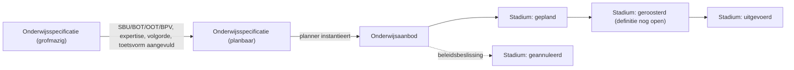
```mermaid
flowchart LR
  grofmazig["Onderwijsspecificatie (grofmazig)"]
  planbaar["Onderwijsspecificatie (planbaar)"]
  aanbod["Onderwijsaanbod"]
  gepland["Stadium: gepland"]
  geroosterd["Stadium: geroosterd (definitie nog open)"]
  uitgevoerd["Stadium: uitgevoerd"]
  geannuleerd["Stadium: geannuleerd"]
  grofmazig -->|"SBU/BOT/OOT/BPV, expertise, volgorde, toetsvorm aangevuld"| planbaar
  planbaar -->|"planner instantieert"| aanbod
  aanbod --> gepland --> geroosterd --> uitgevoerd
  aanbod -.beleidsbeslissing.-> geannuleerd
```


##### Persoon, groep en constraint — informatie-overzicht

Het cyclische plandiagram en de instellingsjourney groeperen keteninvoer in vier bronnen. Onderstaande **informatietabel** zegt per bron **welk inzicht** nodig is in **personen** (`Persoon`: student of medewerker), **groepen** (clusters, cohorten, kandidatenlijsten, pools) en **constraints** (harde en zachte grenzen) voordat planning en roostering betrouwbaar zijn.

| **Bron (keten)** | **Primair inzicht** | **`Persoon` (student / medewerker)** | **Groep / cluster / populatie** | **Constraintdimensie (voorbeelden)** |
| --- | --- | --- | --- | --- |
| **OCspec** (onderwijs- en toetsspecificatie) | welke leer- en toetsmomenten bestaan en in welke volgorde of samenhang ze georganiseerd worden | welke uitvoerende rollen (docent, afnemer, …) inhoudelijk nodig zijn; welke voorzieningen per moment | welke cohorten dezelfde route of parallel delen | harde: examen- en opleidingsregels, verplichte contacttijd, volgorde-eisen; zacht: didactische spreiding |
| **groep** (inschrijvingen, verbintenissen) | *wie* aanbod volgt en met welke omvang en samenstelling | student-`Persoon` met status, begeleidings- of examenflags | klas / cohort, werkgroep, kandidatenlijst; geaggregeerde **skill-vraag** van de populatie | harde: max. groepsgrootte, lock op cohort, minimale bezetting; zacht: homogene werkgroep |
| **cap** (mensen, middelen, ruimtes) | *waarmee* en *waar* uitvoering mogelijk is binnen fysieke en contractuele grenzen | medewerker-`Persoon` met contract, bevoegdheid, roosterbare uren, reistijd | team-, docenten- of surveillant-pool; piek rond examens | harde: dubbele docent/lokaal verboden, capaciteit zaal/middel; zacht: voorkeurslokaal, workload-spreiding |
| **beleid** (examenregels, didactiek, voorkeuren) | *welke randvoorwaarden* buiten het “puur inhoudelijke” model vallen of als kosten/weging in het CSP gaan | individuele ontheffingen, voorkeuren begeleider; beleidsrollen | instroom- en kwaliteitsdoelen, inclusie-afspraken, werkveldafspraken | harde: wettelijke en examencommissie-kaders; zacht: strategische spreiding, voorkeurteams |

**Denkraam: persoon, rollen en skills.** Naast de onderwijsdata die elders in dit document wordt gemodelleerd, is voor **planning en roostering** een **complementair denkpatroon** nodig dat direct met **mensen** en **wat zij kunnen en willen** werkt. In dat denkpatroon is elke **`Persoon`** — **student** of **medewerker** — iemand met **skills**: een samenstel van **vaardigheden**, **kennis** en **inzichten** (inclusief formele bevoegdheden waar dat speelt). Bij **instroom** heeft een student typisch al een skill-profiel en een **leerwens**: welke skills hij of zij verder wil **ontwikkelen** binnen de gekozen **leerroute** en de scenario's die daarbij horen. Een **medewerker** heeft evenzo een skill-profiel, uitgedrukt via **functie en titel** (docent, SLB'er, praktijkbegeleider, examinator, …): die titels zijn **koppelvlakken** naar HR en contract, maar **inhoudelijk** gaat het om **welk skill-pakket** iemand kan **aanbieden** in onderwijs, begeleiding, praktijk of examen.

**Skill-vraag en skill-aanbod.** Groepen zijn in dit denkpatroon **clusters van personen** die qua skill-vector op elkaar lijken of dezelfde **aan te bieden** onderwijs- of begeleidingsbehoefte delen. Tegelijk zoekt de instelling naar het **snijpunt** van (a) **skill-vraag** — wat moet deze populatie **kunnen** na het traject — en (b) **skill-aanbod** — welke medewerkers en welke leer- en praktijkomgeving kunnen dat **leveren**. Dat snijpunt is direct te vertalen naar **harde en zachte constraints** in een CSP: harde grenzen (bevoegdheid ontbreekt, geen docent beschikbaar, zaal te klein) en zachte voorkeuren (vaste teamdag, voorkeurdocent, spreiding SLB).

**Reële wereld en strategie.** Daarbovenop liggen constraints die niet “in het hoofd” van één persoon zitten maar de **realiteit van de instelling** vormen: **beperkte tijd** (roosteruren, openingstijden, BPV-vensters), **beperkt geld en capaciteit** (FTE, vervanging, materiaal, collegegeld- of bekostigingskaders), **facilitaire grenzen** (aantal werkplaatsen, labtypes, reisafstand), en **strategische doelen** (doorstroom, inclusie, werkveldafspraken). Die vlakken bepalen **wat er überhaupt in het model mag** voordat een planner of roosteraar een CSP draait.

**Planning en roostering.** Binnen die totale constraintset voeren **planning** en **roostering** het zoeken naar haalbare toewijzingen uit (zie *Voor wie dieper wil: CSP, NP-Hard en controle* en het cyclische plandiagram): variabelen en domeinen komen uit **tijd en ruimte**, **skill-match**, en **populatie-clusters**; planners en roosteraars wegen zachte constraints en beleidsafwegingen. *Groep* leest hier vooral als **skill-groepering en inschrijf-/cohortrealiteit**, *cap* als **tijd/middelen/facilitair**, *beleid* als **strategie en regels**.

| **Hoofdtype `Persoon`** | **Rol of functietitel (voorbeelden; koppelbaar aan HR)** | **Skills-profiel** (vaardigheden, kennis, inzichten; bevoegdheden waar van toepassing) | **Als constraint geformuleerd** (skill-vraag / skill-aanbod; typisch plan vs rooster) |
| --- | --- | --- | --- |
| **Student** | student / deelnemer aan programma | **Startsituatie** bij instroom; **leerdoelen** als gewenste skill-ontwikkeling binnen leerroute en scenario | **Skill-vraag:** welke skills moeten in het traject **worden opgebouwd**; groeperen in cohort of werkgroep met vergelijkbare vraagvector; harde grenzen uit examen- en opleidingsregels (**Plan**); max. belasting per dag/week (**Rooster**) |
| **Medewerker** | docent (theorie/praktijk), teamcoördinator | vakinhoud, didactiek, toets- en beoordelingsbekwaamheid | **Skill-aanbod:** welke onderwijs- en toetsmomenten kunnen worden bemand; matching met gevraagde leeruitkomst-skills; **beschikbaarheid** en max. uren (**Rooster**); teamspreiding (**Plan**, zacht) |
| **Medewerker** | SLB'er, studiecoach | coachende vaardigheden, route-inzicht, signalering, verwijzen | **Skill-aanbod:** begeleidingscapaciteit (caseload); **zacht:** voorkeurskoppeling met studentgroep; tijdvensters naast lesrooster (**Rooster**) |
| **Medewerker** | praktijkbegeleider, BPV-begeleider | werkveldkennis, praktijkassessment, veiligheid, werkpleknorm | **Skill-aanbod:** uren en trips naar werkveld; **reële wereld:** reis- en clusterafspraken met bedrijven; beperkte parallelle BPV-plaatsen (**Plan** + **Rooster**) |
| **Medewerker** | examinator, surveillant, afnemer, tweede corrector | examenbekwaamheid, integriteit, correctie-inzicht | **Skill-aanbod:** piek rond examenperiodes; verhouding surveillanten/kandidaten; geen belangenverstrengeling (**Rooster**, deels harde regel) |
| **Medewerker** | onderwijsondersteuning, facilitair, ICT-ondersteuning | operationele skills (materiaal, digitaal, logistiek) | **Skill-aanbod:** beschikbaarheid voor opbouw en ondersteuning; koppeling aan zaal- en middelen-constraints (**Plan** / **Rooster**) |
| **Cluster (aggregaat)** | cohort, werkgroep, team, “pool” | **geaggregeerde** skill-vraag of -aanbod over meerdere personen | **Constraint:** doorsnede van populatie-vraag en beschikbaar aanbod; klassen- of werkgroepsgrootte; minimale teamdekking (**Plan**); conflictvrije slottoewijzing (**Rooster**) |

| **Reële-wereldvlak** | **Voorbeelden van constraints** | **Meest zichtbaar in** |
| --- | --- | --- |
| **Tijd en beschikbaarheid** | lesdagen, vakanties, examenweken, cao-uren, nacht- of weekendbeperkingen, reistijd | **Rooster** (slots); kaders en blokken in **Plan** |
| **Middelen, geld en capaciteit** | FTE-plafonds, vervangingsbudget, materiaal- en licentiebudget, onderhoudsvensters werkplaats | vooral **Plan**; harde grenzen in **Rooster** zodra concreet |
| **Facilitair en materieel** | zaaltypes, werkplaats-capaciteit, veiligheid, AV, inventaris per vak | **Plan** (wat is organiseerbaar) en **Rooster** (concrete toewijzing) |
| **Strategie en beleid** | instroomdoelen, inclusie, werkveldafspraken, kwaliteitsagenda, examenregeling | **beleid**-input in het diagram; vertaalt naar zachte en harde constraints in beide fasen |

**Leeswijzer.** De eerste tabel koppelt **diagramblokken** aan **informatie-inzicht** over personen, groepen en constraints. De verdiepingstabel met rollen en skills beschrijft **hoe planners en roosteraars redeneren**; zij **vervangt geen** gegevensmodel uit §3.3.1.2.5. Technische koppeling naar registers: **student-`Persoon`** en inschrijfcontext typisch in **KRS**; **medewerker-`Persoon`**, contract en basisrol in **HR / identiteit**; skills als **uitbreiding op het profiel** in die bronnen of in een **competentie- / skillservice** — zolang er **één waarheid per feit** blijft.

##### Conceptueel gegevensoverzicht

Onderstaande tabel vult het vlakkenmodel hierboven aan met **doel**, **conceptuele inhoud** en **voorbeeldattributen** per gegevensgroep. De kolom *Conceptdefinitie* geeft de normatieve kern waar die in dit profiel is vastgelegd; overige objecten volgen dezelfde logica als in de definities-tabel bij §3.3.1.2.5.

| **Gegevensgroep / informatie-object** | **Vlak** | **Doel en conceptuele inhoud** | **Voorbeeld attributen** (niet exhaustief) | **Conceptdefinitie** |
| --- | --- | --- | --- | --- |
| `Kwalificatiedossier` | Kwalificatiekader | Legt het sectorale referentiekader vast waartegen instellingen opleiden en examineren. | CREBO-dossiernummer, titel, geldigheid, beheerder | [mora.mbodigitaal.nl - Kwalificatiedossier](https://mora.mbodigitaal.nl/index.php/Id-3389d485-20a7-6e53-21df-d09eb49d4762) |
| `Kwalificatie` | Kwalificatiekader | Beschrijft een kwalificatie als afgerond geheel binnen één kwalificatiedossier. | CREBO, niveau, titel, kerntaak, uitstroomrichting | [mora.mbodigitaal.nl - Kwalificatie](https://mora.mbodigitaal.nl/index.php/Id-f54b73a9-9562-2b28-deca-724e992bbcdb) |
| `Kerntaak` | Kwalificatiekader | Een samenhangend geheel van werkprocessen waarmee een beroep wordt uitgeoefend en waarvan de beheersing het functioneren in een beroep mede bepaalt. | code (bijv. B1-K1), titel, complexiteit | [mora.mbodigitaal.nl - Kerntaak](https://mora.mbodigitaal.nl/index.php/Id-99ef9489-49b3-4a3b-7a89-08ae36a3255e) |
| `Werkproces` | Kwalificatiekader | Een samenhangend geheel van taken die uitgevoerd worden binnen een beroep en die leiden tot een herkenbaar resultaat, waarmee de beginnend beroepsbeoefenaar aantoont het beroep te beheersen. | code (bijv. B1-K1-W2), titel, beschrijving, rollen (CanMEDS) | [mora.mbodigitaal.nl - Werkproces](https://mora.mbodigitaal.nl/index.php/Id-9cf4d404-b06c-473f-57d9-3945af33cfa8) |
| `Leeruitkomst` | Kwalificatiekader / specificatie | Formuleert het beoogde leerresultaat (summatief) dat onderwijs en toetsing richting geven; leertaken worden door onderwijskundigen tot leeruitkomsten uitgewerkt. | beschrijving, type (summatief), dekking werkproces, referentie skillstaxonomie (bijv. CompetentNL) | Een concreet en observeerbaar resultaat van leren, dat beschrijft wat een student na het doorlopen van één of meer leertaken weet, begrijpt of kan toepassen, en dat als voorwaarde geldt om een `onderwijsspecificatie` succesvol af te ronden — de vertaling van leertaken in een breakdown door onderwijskundigen. Bij voorkeur wordt een leeruitkomst uitgedrukt in termen van een **sectoroverstijgende, gestandaardiseerde skillstaxonomie** (zoals CompetentNL of een andere door de sector gekozen standaard), in dimensies **kennis, inzicht en vaardigheden**; zie hoofdstuk 4 voor voorbeelden van competentieprofielen. |
| `Opleidingsspecificatie` | Onderwijsspecificatie | Vertaalt een kwalificatiekader naar een collectie van `opleidingsprogramma specificatie`. Alle programma's kwalificeren een deelnemer aan onderliggende programma's op het niveau van het bovenliggende kwalificatiekader zoals beschreven in de `Opleidingspecificatie`. | opleidingsnaam, niveau, ondergrens nominale studieduur, bovengrens nominale studieduur, grove instroomseisen, uiterste inschrijfdatum, uiterste afstudeerdatum, eerste ingebruikname datum | — |
| `Opleidingsprogramma-specificatie` | Onderwijsspecificatie | Structureert het traject dat naar de kwalificatie leidt. | programma-indeling, keuzedeelruimte, SBU-totaal | Een samenhangende verzameling van één of meer (deel)programma's, onderwijseenheden, of leeruitkomsten die kunnen leiden tot een kwalificatie. |
| `Onderwijseenheid-specificatie` | Onderwijsspecificatie | Ontwerpt de eenheid waarin leer- en toetsontwerp samenkomen. | koppeling kerntaak/werkproces, BOT/OOT/BPV, volgorde-eisen | De specificatie van de fundamentele eenheid waarin onderwijs wordt ontworpen en aangeboden, in de vorm van een samenhangend stelsel van één of meer (beoogde) leeruitkomsten, leeronderdelen en/of toetsonderdelen. (NB: Leeruitkomsten omvat o.a. kennis, inzicht en vaardigheden.) |
| `Leeronderdeel-specificatie` | Onderwijsspecificatie | De specificatie van het deel van de onderwijseenheid (onder meer bestaande uit lesstof en opdrachten) waarin de student competenties kan verwerven. | collectie van leervormen, studiebelasting over de gehele lessenreeks, docent-expertise voor de gehele lessenreeks, Benodigde leermiddelen over de gehele lessenreeks, collectie van didactische leervormen, lessenreeks inhoudelijke volgordelijkheid van onderliggende lessen | De specificatie van het deel van de onderwijseenheid (onder meer bestaande uit lesstof en opdrachten) waarin de student competenties kan verwerven. |
| `Lesspecificatie` | Onderwijsspecificatie | Detaillert het afzonderlijke lesmoment binnen een leeronderdeel. | lesdoel, duur leervorm, didactische leervorm, lesplan, werkinstructies, lesdoelen, lesopdrachten, lesleerdoel, relatie tot lesuitkomst | De specificatie van het kleinste geplande leermoment binnen een leeronderdeel: welke lesinhoud, werkinstructies, lesplan of toetsonderdeel in dat moment wordt aangeboden. |
| `Toetsonderdeel-specificatie` | Onderwijsspecificatie | Beschrijft hoe en waartegen wordt getoetst binnen de onderwijseenheid. | toetsvorm, weging, beoordelingscriteria, formatief/summatief, toetsmatrijs, toegstane toetsinstrumenten | De specificatie van het deel van de onderwijseenheid (bestaand uit een onderzoek naar kennis, inzicht, houding en vaardigheden van de student), waarmee wordt vastgesteld over welke competenties de student beschikt, leidend tot een formatieve of summatieve beoordeling. |
| `Examenspecificatie` | Onderwijsspecificatie | Legt summatief examenbeleid en instrumenten vast (examencommissie). | examenplan-referentie, instrumenten, vaststellingsregels | De specificatie van een summatief examen (opstelling, instrumenten, beoordelingskader) zoals vastgesteld door de examencommissie, gekoppeld aan te behalen leeruitkomsten of werkprocessen. |
| `Opleidingsaanbod` | Onderwijsaanbod | Maakt een opleiding concreet aanbiedbaar en instroombaar. | startmoment, locatie, capaciteit instroom, uiterste inschrijfdatum, uiterste afstudeerdatum | — |
| `Opleidingsprogramma-aanbod` | Onderwijsaanbod | Biedt een concreet programma-instantie aan (cohort, variant). | onderwijsjaar, periode-indeling, groepsgrootte, onderwijsregio/locaties | — |
| `Onderwijseenheid-aanbod` | Onderwijsaanbod | Plant en capaciteert een onderwijseenheid in de tijd. | periode, min/max deelnemers, benodigde middelen, onderwijsregio/locaties | — |
| `Leergelegenheid` | Onderwijsaanbod | Groepeert lessen tot een planbaar/geroosterd leermoment. | periode, docent-pool, zaaltype, onderwijsregio/locaties | — |
| `Lesgelegenheid` | Onderwijsaanbod | Concretiseert één les in tijd, ruimte en bemanning. | datum, starttijd, lokaal, docent, locaties | — |
| `Toetsgelegenheid` | Onderwijsaanbod | Organiseert afname van een toetsonderdeel. | toetsmoment, locatie, surveillant-ratio, onderwijsregio/locaties | Het georganiseerde aanbod van een toetsmoment: wanneer, waar en onder welke condities een toetsonderdeel wordt afgenomen, gekoppeld aan precies één `Toetsonderdeel-specificatie`. |
| `Examengelegenheid` | Onderwijsaanbod | Organiseert summatieve examenafname. | examenweek, kandidatenlijst, instrument-set | Het georganiseerde aanbod van een examenmoment: planning, locatie, surveillant-capaciteit en kandidaten, gekoppeld aan precies één `Examenspecificatie`. |
| `Opleidingsverbintenis` | Onderwijsverbintenis | Legt formele deelname van een persoon aan een opleiding vast. | inschrijfdatum, status, rechtmatigheid | — |
| `Opleidingsprogramma-verbintenis` | Onderwijsverbintenis | Plaatst de persoon op een concreet programma-instantie. | cohort, studiepad-variant | — |
| `Onderwijseenheid-verbintenis` | Onderwijsverbintenis | Registreert deelname aan een geplande onderwijseenheid. | groep, voortgangsstatus | — |
| `Leergelegenheid-verbintenis` | Onderwijsverbintenis | Koppelt persoon aan leergelegenheid (incl. docent). | rol (student/docent), inschrijfstatus | — |
| `Lesgelegenheid-verbintenis` | Onderwijsverbintenis | Koppelt persoon aan concrete lesuitvoering. | aanwezigheid, rol | — |
| `Toetsgelegenheid-verbintenis` | Onderwijsverbintenis | Registreert kandidaat-deelname aan toetsafname. | kandidaatstatus, voorwaarden | De relatie tussen een persoon en een `Toetsgelegenheid`: de feitelijke (voorbereide of lopende) deelname aan dat toetsmoment. |
| `Examengelegenheid-verbintenis` | Onderwijsverbintenis | Registreert kandidaat op examenmoment. | kandidaatnummer, toegestane middelen | De relatie tussen kandidaat en `Examengelegenheid`: inschrijving op en deelname aan de examenafname. |
| `Opleidingsverbintenis resultaat` | Onderwijsresultaat | Vat voortgang/uitkomst op opleidingsniveau samen. | diploma-status, behaalde kwalificatie | — |
| `Opleidingsprogramma-verbintenis resultaat` | Onderwijsresultaat | Bevat programma-aggregaat van behaalde onderdelen. | voortgangspercentage, vrijstellingen | — |
| `Onderwijseenheid-verbintenis resultaat` | Onderwijsresultaat | Legt behalen van een onderwijseenheid vast. | eindcijfer, voldoende/onvoldoende | — |
| `Leergelegenheid-verbintenis resultaat` | Onderwijsresultaat | Legt uitkomst op leergelegenheidsniveau vast. | deelname, formatieve score | — |
| `Lesgelegenheid-verbintenis resultaat` | Onderwijsresultaat | Legt les- of aanwezigheidsuitkomst vast. | aanwezig, formatief resultaat | — |
| `Toetsgelegenheid-verbintenis resultaat` | Onderwijsresultaat | Legt toetsuitkomst vast (voor vaststelling). | score, attempt, beoordelingsstatus | Het vastgelegde uitkomstbeeld van die deelname: beoordeling, status en eventueel bewijs, formatief of summatief naar instellingsbeleid. |
| `Examengelegenheid-verbintenis resultaat` | Onderwijsresultaat | Legt examenuitkomst en vaststelling vast. | cijfer, vaststellingsdatum examencommissie | Het examenuitkomstbeeld na afname en beoordeling, voorlopig of vastgesteld door de examencommissie. |

*Disclaimer.* In deze fase blijven we bewust op **conceptueel** niveau. Tijdens het verdere specificatieproces (OEAPI-objecten, berichten en attributen in AMIGO) worden exacte attributen, cardinaliteiten en koppelvlakken verder uitgewerkt. De voorbeeldattributen in de tabel zijn illustratief — geen normatieve lijst.

##### Betrokken systemen bij gegevensuitwisseling

**Jochem op de plaat (leeswijzer).** De onderstaande informatiestromenplaat is geen Jochem-specifiek diagram: hij staat **exemplarisch** voor elke reguliere student. Loop de plaat zo door: (1) **Curriculum-ontwerptool** — Jochems opleidings- en onderwijsspecificaties op basis van het kwalificatiedossier; (2) **OC** — gepubliceerde specificaties en planbaar/gepland aanbod voor de hele keten; (3) **Planning** — Jochems cohort, perioden en capaciteit; (4) **Rooster** — zijn concrete lestijden en locaties; (5) **Intake → KRS** — aanmelding en formele **inschrijving** op opleiding/programma; (6) **SKS** (keuzedeel-variant) — zijn keuzedeel-**aanmeldingen** (voorkeurslijst, *wanneer en waar*); **inschrijving** op het keuzedeel volgt uit **Planning → KRS** zodra het aanbod passend is; (7) **LMS** en **aanwezigheid** — deelname en formatieve voortgang; (8) **SVS** — zijn onderwijsresultaten richting kwalificering. Waarom zoveel systemen? Omdat ontwerp, logistiek, registratie en uitvoering **verschillende bronnen van waarheid** hebben — en de plaat laat zien wie wat leest, schrijft en niet mag dupliceren.


##### Applicatiecomponenten op de plaat — doelen, gegevens en interacties

**Doel.** Dit blok start de **gegevensanalyse** en de **interactieanalyse** voor *Leerroute 1 — regulier, geen inhoudelijke keuze* op kaderniveau. We benoemen welke **applicatiecomponenten** op de informatiestromenplaat hierboven voorkomen, **wat zij doen** in deze keten, welke **anti-patronen / tegengestelde doelen** vermeden moeten worden, en welke **informatie** rond hen leeft. De taal is bewust **conceptueel** (geen API- of berichtdetail): we gebruiken het [begrippenkader](begrippenkader.md): *kwalificatiekader*, *onderwijsspecificatie*, *onderwijsaanbod* (planbaar en geroosterd), *onderwijsverbintenis*, *onderwijsresultaat*. De koppeling naar OEAPI-objecten op de uitwisselrelaties wordt **niet** hier gelegd; daarvoor zijn de koppelingspecificaties in Public en de berichtspecificatie-stap van AMIGO (§2.4) bedoeld.

**Leeswijzer op de plaat.** De plaat (`OKx_LR1_informatiestromen_v20260526.jpg`) kent **twee delen**: *Onderwijsontwikkeling* (inrichting van nominaal- en keuze-aanbod) en *Onderwijsuitvoering* (student studeert en maakt keuzes). De **OKE**-positionering (oranje stippellijn) markeert waar resultaten vanuit uitvoeringssystemen richting het volgsysteem **bemiddeld** kunnen worden; de plaat schrijft dat niet hard voor — instellingen kunnen die positionering anders kiezen.

**Labels op de pijlen** volgen het vlakkenmodel (zie anker-tabel *Betrokken informatie bij proces*): bijvoorbeeld `opleidingsspecificatie` / `opleidingsprogramma-specificatie`, `opleidingsprogramma-aanbod`, `opleidingsprogramma-verbintenis`, `leergelegenheid`, `toetsgelegenheid-verbintenis resultaat`. Lees elke pijl als beweging van **specificatie → aanbod → verbintenis → resultaat** op het passende niveau.

**Student Keuze Systeem (SKS)** staat op deze plaat als duidelijk gescopeerde **applicatiecomponent**: het faciliteert het **keuzedeel-selectieproces** — kiezen op *wanneer en waar* binnen **reeds gepland** `opleidingsprogramma-aanbod` (type keuzedeel), in samenhang met de achterliggende `opleidingsprogramma-specificatie`. Het SKS is **bron voor `aanmelding keuzedeel`** (geprioriteerde voorkeurslijst). **Oriëntatie en aanmelding op de opleiding** blijven via **Intake → KRS**; het SKS vervangt dat niet. Stromen op de plaat: **OC → SKS** levert gepubliceerd `opleidingsprogramma-aanbod` (keuzedeel) en referentie naar `opleidingsprogramma-specificatie`; **SKS → Planning** geeft de keuzestelling door als `opleidingsprogramma-verbintenis` op het gekozen `opleidingsprogramma-aanbod`; bij passend aanbod levert **Planning → KRS** (en vervolgens de keten: **SVS**, **LMS**, rooster) de formele **inschrijving** op het keuzedeel. Een volledig SKS (modulair kiezen, cross-instelling) valt buiten deze plaat — zie flexibelere leerroutes later in dit document.

##### Componenten en hun doel — wat hoort hier wel en niet thuis

| Component (zoals op plaat) | Hoofddoel in dit scenario | Wat dit systeem **niet** doet (rolafbakening) | Welke informatie hier ontstaat of leeft (conceptueel) |
| --- | --- | --- | --- |
| **Curriculum-ontwerptool** | Grofmazig onderwijsontwerp realiseren door middel van onderwijsspecificaties. De inrichting van de onderwijskundige hoofdlijnen voor een opleiding. Doormiddel van het specificeren van samenhangende onderwijsprogramma's onder een de vlag van een opleiding. | Geen kalender; geen rooster; geen registratie van personen of resultaten. Geen bron systeem van `onderwijsaanbod` | `Onderwijsspecificaties` **maken en muteren** op `opleiding` `opleidingsprogramma`, `onderwijseenheid` niveaus. Publiceert naar de **Onderwijscatalogus**. |
| **Onderwijscatalogus (OC)** | **Eén plek** waar de instelling alle (actieve en inactieve) `onderwijsspecificaties`  **publiceert en consistent houdt** voor andere systemen. Daarnaast heeft het overzicht op gepland `onderwijsaanbod` vanuit het `planningsysteem`. | Geen ontwerptool, geen rooster, geen leeromgeving, geen studentregister — de OC **deelt en verwijst**, ze **bezit** de inhoud niet, behalve `leeronderdeel specificaties`. | Maakt `Leeronderdeel specificaties`. Beheerd gerarchiveerde en gepubliceerde `onderwijsspecificaties`; volgt gepubliceerd gepland `onderwijsaanbod` van het planninsgsysteem. |
| **Planningssysteem** | Vertaalt **planbare** `onderwijsspecificaties` naar `onderwijsaanbod`: perioden, capaciteit, groepen, randvoorwaarden in mensen en middelen. Voedt de OC met dit planbare aanbod. | Geen `onderwijsspecificatie`; geen beheerder van persoonsgegevens. | Planbaar `onderwijsaanbod`; groepen; capaciteitsbeeld; verzoek tot detaillering of correctie van specificatie. |
| **Roostersysteem** | Maakt **geroosterd `onderwijsaanbod`**: concrete tijdsloten, lokalen, docenten op les- en `leergelegenheden` (en `examengelegenheden`). | Geen ontwerper; geen capaciteitsbeleid (dat is planning); kopieert geen volledige specificatie (leest uit OC). | Geroosterd `aanbod`; `lesgelegenheden`, `leergelegenheden`, `examengelegenheden`. |
| **Intakesysteem** | **Aanmelding en intake** verwerken: oriëntatie-uitkomst, geschiktheidsgesprek, voorlopige plaatsing; bij positieve uitkomst overdracht aan KRS. | Geen kwalificatie-/examenadministratie; geen rooster; geen `onderwijsaanbod`-publicatie; geen keuzedeel-selectie (dat is SKS). | Aanmeldgegevens; intake-uitkomst; voorlopig plaatsingsbesluit; `opleidingsverbintenis` op opleiding/programma. |
| **Studiekeuzesysteem (SKS)** — *keuzedeel-variant* | Faciliteert **keuzedeel-selectie** op basis van **gepland** `opleidingsprogramma-aanbod` (keuzedeel) uit **OC**, in samenhang met `opleidingsprogramma-specificatie` (*wanneer en waar gaan we hoe leren*). **Bron voor `aanmelding keuzedeel`**. | Geen volledig route- of modulesysteem; geen vervanging van **Intake**; geen bron voor `onderwijsspecificatie`, persoon, formele **inschrijving** of examenresultaat; geen tweede KRS; geen aanbodpublicatie of plaatsing. | `Aanmelding keuzedeel`; `opleidingsprogramma-verbintenis` (keuzestelling) richting **Planning**; formele inschrijving volgt uit **Planning → KRS** (en keten) wanneer passend. |
| **Kernregistratie studenten (KRS)** | **Bron van waarheid** voor persoon en formele `onderwijsverbintenis` (plaatsing op opleiding/programma en groep). Levert wat andere systemen nodig hebben voor deelname, bekostiging en rechtmatigheid. | Geen ontwerptool; geen leeromgeving; geen vaststelling examencommissie; geen aanbodpublicatie. | Persoon; programmaplaatsing; groepslidmaatschap; onderwijsverbintenis met aanbod. |
| **Studentbegeleidingssysteem** | **SLB-/coachdata** en afspraken bij dezelfde persoon en plaatsing; ondersteunt de student in de leerroute. | Geen tweede persoonsregister; geen examenregistratie; geen rooster. | Begeleidingsdossier, afspraken en signalen — gekoppeld aan persoon uit KRS. |
| **Leermanagementsysteem (LMS)** | **Uitvoering van het onderwijs**: `leer- en lesgelegenheden` verzorgen op basis van `onderwijsspecificatie` + rooster + ingeschreven studenten; vastleggen van **deelname** en **formatieve voortgang**. | Geen beheer of wijziging van `opleidings`-, `opleidingsprogramma`-, `onderwijseenheid`-`specificaties`; geen vaststelling examencommissie; geen capaciteitsplanning van de instelling. | Lesuitvoering en content-referenties; deelname en formatieve voortgang; doorgifte van feiten richting volgsysteem. |
| **Aanwezigheidsregistratie** | **Aanwezigheid** op geroosterde `gelegenheden` vastleggen en doorgeven naar uitvoering en voortgangsbeeld. | Geen beoordelaar; geen inschrijver; geen planner. | Aanwezigheidsfeiten per geroosterd `aanbodverbintenis` of `gelegenheidsverbintenis` en persoon. |
| **Toets- en examenplanning** | **Toets-/examenaanbod** klaarzetten op basis van `toetsspecificatie` en `geroosterd aanbod` (incl. kandidaten). | Geen LMS-content; geen vaststelling examencommissie; geen onderwijsontwerp. | Geplande toets-/examengelegenheden en kandidaatlijsten. |
| **Toets- en examenafname** | **Afname** van toetsen/examens; afnameresultaten en kandidaat-koppeling doorgeven aan het volgsysteem. | Geen `toetsspecificatie` ontwerper; geen beheer van persoon; geen formele vaststelling (ondersteunt alleen). | Afnameresultaten en attempts; kandidaatuitkomsten richting volgsysteem. |
| **Studentvolgsysteem (SVS)** | **Voortgang en resultaat** vastleggen tegen de `onderwijsspecificatie`; **studiepadadministratie** tot kwalificering. Gebruikt de OC als referentiekader voor de specificatie. | Geen ontwerper; geen LMS-content; geen rooster; geen examenplanner. | `Onderwijsresultaten` per `onderwijsverbintenis`; voortgangsbeeld over de leerroute. |

> **Jochem — één feit, één bron.** Zijn **opleidingsspecificatie** ontstaat in de curriculumtool en wordt via **OC** gelezen door planning, LMS en SVS — niet opnieuw vastgelegd in het LMS. Zijn **inschrijving** leeft in **KRS**; het LMS leest deelnemerscontext. Zijn **behaalde resultaten** op werkprocesniveau worden in **SVS** bijgehouden tegen de specificatie uit OC; het LMS levert daarvoor uitvoeringsfeiten door. Zo voorkom je dat dezelfde gegevens op meerdere plekken verschillend staan.

##### Bron-, lees- en bewerkrollen t.o.v. informatie-objecten

De vorige tabel beschrijft **doelen** en **rolafbakening**. Hieronder staat dezelfde set systemen in termen van het **vlakkenmodel** uit §3.2: welk systeem **bron van waarheid** is voor welke objecten (ketenbreed), wat het **alleen consumeert**, en wat het **muteert of aanmaakt** (inclusief doorlevering naar een andere bron). *Bron* betekent hier: het systeem waar de keten voor dat object op vertrouwt zodra het in productie staat (na publicatie waar dat van toepassing is). *Bewerkt* omvat ook **publiceren naar OC** of **doorgeven aan SVS/KRS** — dat zijn schrijfacties op de keten, ook als het doelsysteem daarna bron wordt.

| Systeem | Bron van waarheid voor (informatie-objecten) | Leest (consumeert) | Bewerkt / schrijft |
| --- | --- | --- | --- |
| **Curriculum-ontwerptool** | Bron van `opleidingsspecificatie`, `onderwijseenheidspecificatie`. | Kwalificatiekader en referenties (extern/beleid); desgevraagd de actuele gepubliceerde `onderwijsspecificaties`  uit **OC** bij herziening. | Mutaties op `onderwijsspecificaties` (`opleiding` t/m `onderwijseenheid`, `toetsonderdeel`/toetsvorm); publicatie naar **OC**. |
| **Onderwijscatalogus (OC)** | **Ketenbreed gepubliceerde** gedetaileerde (fijnmazige) `onderwijsspecificaties`, specifiek de `leeronderdeel specificatie`; **ketenbreed gepubliceerd** planbaar `onderwijsaanbod` voor consumptie door de keten. | Publicatie- en mutatie-events van geautoriseerde bronnen (curriculumtool, planning). | Catalogusbeheer: versies, consistentie, beschikbaar maken voor afnemers (geen onderwijskundige ontwerprol). |
| **Planningssysteem** | **Planbaar onderwijsaanbod** in de zin van *planningsconstructie* totdat dit in **OC** is gepubliceerd; daarna is **OC** de bron voor wat de keten leest. | `Onderwijsspecificatie` en reeds gepubliceerd aanbod uit **OC**; persoons-, rol-, skill- en reële-wereldconstraintdata (zie *Het plan en rooster proces* en *Planbare onderwijsspecificaties*). | `Planbaar onderwijsaanbod`; groepen en capaciteitsbeeld; verzoeken tot specificatie-aanpassing; **publicatie/mutatie van planbaar aanbod naar OC**. |
| **Roostersysteem** | **Geroosterd onderwijsaanbod** als *roosterconstructie*. | `Onderwijsspecificatie` en gepland `onderwijsaanbod` uit **OC**; deelnemers-, skill- en reële-wereldconstraintdata (zie *Het plan en rooster proces* en *Planbare onderwijsspecificaties*, facilitaire systemen). | `Lesgelegenheid`, `Leergelegenheid`, `Toetsgelegenheid` `Examengelegenheid` (concrete slots, locaties, docenten); **publicatie/mutatie van geroosterd aanbod naar OC**. |
| **Intakesysteem** | **Intake- en aanmeldprocesdossier** (buiten de vijf vlakkenkolommen van §3.2; geen tweede persoonsregister). | Opleidings- en aanbodinformatie (publiek of uit **OC**); geen bron voor `onderwijsspecificatie` of `onderwijsresultaat`. | Aanmelding, intake-uitkomst, voorlopige plaatsing; **overdracht naar KRS** (formele `opleidingsverbintenis`). |
| **Studiekeuzesysteem (SKS)** — *keuzedeel-variant* | **`Aanmelding keuzedeel`** en keuzedeel-keuzeprocesdossier (voorkeurslijst, status; geen master voor persoon of formele inschrijving). | Gepubliceerd `opleidingsprogramma-aanbod` (type keuzedeel) en `opleidingsprogramma-specificatie` (referentie) uit **OC**; `persoon` en bestaande `opleidingsprogramma-verbintenis` (nominaal programma) uit **KRS** (read). | `Aanmelding keuzedeel`; `opleidingsprogramma-verbintenis` op gekozen `opleidingsprogramma-aanbod` naar **Planning**; **inschrijving** op keuzedeel volgt uit **Planning → KRS** (en vervolgens **SVS**, **LMS**, rooster) wanneer het aanbod passend is. |
| **Kernregistratie Systeem studenten (KRS)** | `Persoon`; `onderwijsverbintenis` op opleiding/programma/ (inschrijving, rechtmatigheid). | Gepubliceerde planbare `onderwijsaonderwijsspecificaties` en groepsinformatie als constraint voor planning uit **OC** / planning (voor plaatsing); **geen** bron voor `onderwijsspecificatie`. | Inschrijving middels `onderwijsaanbod verbintenis`; les/stam-groepslidmaatschap (gebaseerd op sociale groeperingsconstraints); mutaties op verbintenis en **rechtmatigheid** (is deze persoon daadwerkelijk gerechtigd om deel te nemen aan dit `onderwijsaanbod`?) in het kader van deelnemerscontext richting **LMS**, en **SVS** (i.h.k.v. toetsing en examenering) |
| **Studentbegeleidingssysteem** | **Begeleidingsdossier** (afspraken, signalen, SLB-/coachnotities — buiten het kern-vlakkenmodel). | `Persoon` en plaatsing uit **KRS**; desgevraagd voortgangs- of risico-inzichten uit **SVS** (read-only). | Begeleidingsdata gekoppeld aan KRS-identiteit (geen tweede master voor kernpersoonsgegevens). |
| **Leermanagementsysteem (LMS)** | Het LMS detailleert de `leeronderdeel specificatie` en eventueel de `lesspecificaties`, op basis van de grofmazige bovenliggende `onderwijseenheid`- en `onderwijsprogramma specificaties`. Daarnaast legt het LMS de formatieve uitvoerings- en deelnamefeiten vast in de leeromgeving tot aan doorlevering (officiële **resultaat-** en studiepadaggregatie: **SVS**). Formatieve `toetsspecificaties` en `toetsgelegenheden` kunnen in onbegeleidde vorm ook (digitaal) afgenomen worden binnen het LMS. | `Onderwijsspecificaties` uit **OC**; deelnemers/`onderwijsverbintenis` via **KRS**. | Detailleert `leeronderdeel specificaties`, `lesspecificaties` waar nodig; lesuitvoering, content-referenties, deelname, formatieve voortgang; **doorlevering van feiten naar SVS**. |
| **Aanwezigheidsregistratie** | **Aanwezigheidsfeiten** op `leergelegenheid verbintenis` niveau (operationeel; aggregatie naar voortgangsbeeld via **SVS** / keten). | Geroosterd `onderwijsaanbod` per Persoon. | Registratie aan/afwezig per gelegenheid en persoon. |
| **Toets- en examenplanning** | Begeleidde `Toets-/examengelegenheden` (Examenplanning) gekoppeld aan **toetsspecificaties** en toetsinstrumenten gekoppeld deze toets- examen gelegenheid (bron: **SVS** na `toetsgelegenheid verbintenis` van persoon). | `Toetsspecificatie` uit **OC**; kandidaten op basis van SVS voortgang. | Geplande `Toetsgelegenheid` / `Examengelegenheid`; `toetsgelegenheid verbintenis`. |
| **Toets- en examenafname** | **Afname- en sensordata** van de zitting (attempts, tijdstempels) tot doorlevering; **definitief onderwijsresultaat** is bron in **SVS** na verwerking (en eventuele examencommissie-stap buiten deze plaat). | Opdracht, kandidaten, locatie/tijd uit planning/rooster; identiteit via **KRS**-context. | Afnameresultaten, attempts; **doorlevering naar SVS** als kandidaat-/sensorgegevens. |
| **Studentvolgsysteem (SVS)** | `Onderwijsverbintenisresultaat`(formatief en summatief), op basis van behaalde `examengelegenheid verbintenis resultaten` en **onderwijsprogramma voortgangsoverzicht** (ketenbreed referentie voor voortgang tot kwalificering). | `Onderwijsspecificatie` uit **OC** als referentiekader; feiten uit **LMS**, **aanwezigheid** en **afname**; `opleidingsaanbod verbintenis`, `opleidingsprogramma verbintenis`, `onderwijsonderdeel verbintenis` typisch uit **KRS** (read). | Mutaties op  `onderwijsverbintenis` en `onderwijsverbintenis resultaten`; geen mutatie op `onderwijsspecificatie`-inhoud. |

*Implementatienuance.* De exacte splitsing tussen **KRS** en **SVS** voor grensgevallen (bijv. bepaalde statusvelden op `onderwijsverbintenis` versus leervolgstatus) kan per instelling verschillen; het principe blijft: **één bron per gegeven** en geen tegenstrijdige parallelle masters.

##### Anti-patronen tussen systemen — tegengestelde doelen om te voorkomen

Doel hier is dat de **semantische consistentie** uit §3.2 ook bij implementatie behouden blijft: één eigenaar per object, één plek voor één feit, één bron van waarheid per kolom van het vlakkenmodel.

- **OC vs LMS** — OC is de **enige** bron van de onderwijsspecificatie; het LMS **vult uitvoering**. *Anti-patroon:* het LMS wordt een tweede specificatiebron en raakt onsynchroon. *Mitigatie:* LMS **leest** specificatie uit OC; eigen LMS-structuren verwijzen, vervangen niet.
- **Planning vs Rooster** — planning bewaakt **organiseerbaarheid** (planbaar aanbod), rooster bewaakt **concrete realisatie** (geroosterd aanbod). *Anti-patroon:* rooster maakt capaciteitskeuzes of planning roostert. *Mitigatie:* planbaar → geroosterd is een **ketenovergang**, geen overlap.
- **KRS vs Studentbegeleiding** — KRS is **persoons- en plaatsingmaster**; begeleiding **leeft mee**. *Anti-patroon:* begeleiding houdt een eigen tweede persoonsregister. *Mitigatie:* begeleiding **refereert** aan KRS-identiteit, voegt context toe.
- **LMS vs SVS** — LMS doet **uitvoering en formatief**, SVS doet **studiepad, voortgang en resultaat**. *Anti-patroon:* SVS wordt een tweede LMS, of LMS wordt het studiepadsysteem. *Mitigatie:* LMS levert feiten door; SVS aggregeert tot voortgang en resultaat.
- **Toets-/examenafname vs SVS en examencommissie** — afname levert **feiten**; formele vaststelling ligt bij de **examencommissie** (instellingsjourney fase 8, niet als systeem op deze plaat). *Anti-patroon:* afname publiceert direct als definitief resultaat. *Mitigatie:* afname → SVS als **kandidaatresultaat**; formele vaststelling buiten dit plaatstuk.
- **Curriculum-ontwerptool vs OC** — ontwerptool is **werkomgeving**, OC is **publicatiekanaal**. *Anti-patroon:* afnemers lezen direct uit de ontwerptool. *Mitigatie:* alle afnemers consumeren via OC; ontwerptool publiceert.
- **Intake vs KRS** — intake **verzamelt en beslist**, KRS **registreert** formeel. *Anti-patroon:* intake gaat zelf inschrijvingen bewaken. *Mitigatie:* positieve intake → overdracht aan KRS.
- **SKS vs Intake** — **Intake** doet opleidingsaanmelding en plaatsing; **SKS** (keuzedeel-variant) doet alleen keuzedeel-selectie na inschrijving op het nominale programma. *Anti-patroon:* SKS wordt gebruikt voor eerste opleidingsinschrijving of SKS houdt een tweede persoonsregister. *Mitigatie:* SKS leest persoon en programmaplaatsing uit **KRS**; legt alleen **`aanmelding keuzedeel`** vast.
- **SKS vs Planning** — SKS is **bron voor aanmelding/keuzestelling**; **Planning** verwerkt die keuze, bepaalt passend aanbod en levert **inschrijving** wanneer haalbaar. *Anti-patroon:* SKS schrijft direct formele inschrijving in **KRS** of muteert planbaar aanbod. *Mitigatie:* **SKS → Planning** met `opleidingsprogramma-verbintenis` op het gekozen aanbod; **Planning → KRS** (en keten) bij passend resultaat.
- **SKS vs OC** — OC is **publicatiekanaal** voor aanbod en specificatie; SKS **consumeert** en kiest. *Anti-patroon:* SKS publiceert of muteert `onderwijsaanbod`. *Mitigatie:* SKS leest uit **OC**; mutaties op aanbod blijven bij **Planning** / **Rooster** via **OC**.

##### Procesfasen ↔ interacties op de plaat ↔ informatie

**Hier komt alles samen.** Per fase van de **instellingsjourney** (zie *De procesbeleving achter 'regulier' onderwijs van een Instelling*, fasen 1–8) lopen we de [informatiestromenplaat voor leerroute 1](../img/OKx_LR1_informatiestromen_v20260526.jpg) verhalend door. Elke fase heeft een eigen **highlight-uitsnede** van die plaat, en wordt belicht vanuit **drie hoeken**:

- **Jochem (student) — happy flow.** Hoe ervaart hij deze fase als reguliere mbo-student?
- **De instelling — journey fase N.** Welke actoren, beslissingen en informatie-objecten bewegen er in de keten?
- **Wat licht op in de plaat.** Welke pijlen en componenten op de informatiestromenplaat horen bij deze fase, in begrippen uit het vlakkenmodel (`specificatie → aanbod → verbintenis → resultaat`).

Bij **fase 5, 6 en 7** is dit verhaal niet af zonder de **variaties** *incidenteel temporiseren*, *incidenteel versnellen* en *hybride*: dezelfde reguliere leerroute, andere voortgang. Die zetten we daar expliciet bij Jochem.

> **Leesregel op de plaat.** De **linkerhelft** is *Onderwijsontwikkeling* (fasen 1–2: het nominale aanbod ontstaat). De **rechterhelft** is *Onderwijsuitvoering* (fasen 3–8: de student studeert, leert en maakt keuzes). De **OKE**-stippellijn (oranje) markeert waar uitvoeringsfeiten richting het volgsysteem worden bemiddeld. Fasen 1–5 lopen lineair; **fase 6** (keuzemomenten) en **fase 7** (bijsturen) zijn cyclische lussen die het strategische jaarplan en het rooster opnieuw raken. Dit hoofdstuk vormt de **leg-up** voor de berichtspecificatie- en interfacespecificatie-stappen van AMIGO (§2.4); koppelvlakdetails (trigger, idempotentie, formaat) staan hier bewust nog niet in.

###### Fase 1 — Kwalificatiekader analyseren en grofmazig ontwerpen


**De instelling — journey fase 1.** Een **onderwijsontwerper** vertaalt het **`kwalificatiedossier`** (CREBO, kerntaken, werkprocessen, keuzedeelruimte) naar een **`opleidingsspecificatie`** met onderliggende **`opleidingsprogramma-`** en **`onderwijseenheid-specificaties`**, eerste **toetsvormen** en een initieel **examenplan**. Het curriculum ontstaat hier als **template** over de looptijd van de opleiding. De **Curriculum-ontwerptool** publiceert dit grofmazige resultaat naar de **Onderwijscatalogus (OC)**.

**Jochem — happy flow.** Voor Jochem nog onzichtbaar; deze fase voltooit zich vóórdat hij zich oriënteert. Wat hij later in fase 3 op de website ziet — *Apothekersassistent — regulier*, met kerntaken patiëntenzorg en medicatiebewaking en gepubliceerde keuzedeelruimte — is het zichtbare resultaat van dit ontwerp.

**Wat licht op in de plaat.** **Curriculum-ontwerptool → OC** met `opleidingsspecificatie`, `opleidingsprogramma-specificatie`, `onderwijseenheid-specificatie`, `toetsonderdeel-specificatie` en initieel `examenonderdeel-specificatie` — alles op grofmazig niveau.

###### Fase 2 — Publiceren en planbaar maken

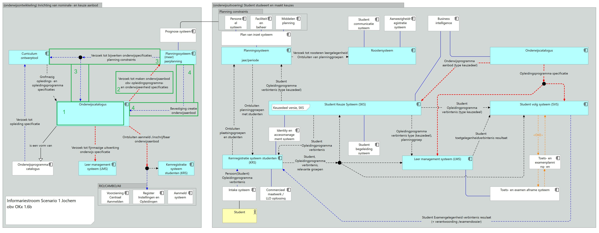

**De instelling — journey fase 2.** De grofmazige specificaties zijn aangevuld tot **planbare specificatie** (tijdvensters, capaciteit, expertise, faciliteit). **OC** verzoekt het **Planningssysteem** om die specificaties te transformeren tot **`onderwijsaanbod`**. De **planner** bepaalt haalbaarheid binnen het **strategische jaarplanning** (mensen, middelen, alle opleidingen) en levert **gepland `opleidings-` en `opleidingsprogramma-aanbod`** terug aan **OC**. Niet haalbaar? Dan verzoekt planning om aanpassingen op de specificatie (vooral planning-constraints) — zie [*Het plan en rooster proces*](#het-plan-en-rooster-proces).

**Jochem — happy flow.** Nog steeds onzichtbaar, maar deze fase bepaalt of zijn opleiding in september start en met welke capaciteit. Onhaalbaar plan = geen aanbod om zich op te oriënteren.

**Wat licht op in de plaat.** **OC → Planningssysteem** (`opleidingsspecificatie` als planopgave); **Curriculum-ontwerptool → OC** (specificatie-update en plan-assets); **Planning → OC** (`opleidingsaanbod`, `opleidingsprogramma-aanbod` als planbaar resultaat). Het strategische jaarplan loopt op de achtergrond.

###### Fase 3 — Instroom, intake en plaatsing


**Jochem — happy flow.** Jochem ziet het gepubliceerde aanbod (vanuit **OC**) en herkent *Apothekersassistent — regulier* met start in september. Hij **oriënteert**, **meldt zich aan** via het **Intakesysteem** en doorloopt de intake met zijn **SLB'er** (student-journey-stappen 1–4, zie *De student beleving — De Student Journey*). Match? Het Intakesysteem draagt de positieve uitkomst over aan **KRS**; daar wordt zijn `Persoon` vastgelegd plus een **`opleidingsverbintenis`** en **`opleidingsprogramma-verbintenis`**.

**De instelling — journey fase 3.** Vanaf nu bestaat Jochem als formele student in de keten met een inschrijving op opleiding, programma en (waar van toepassing) initiële `plaatsingsgroep`.

**Wat licht op in de plaat.**: **OC → Intakesysteem** (aanbod om op te oriënteren); **Intakesysteem → KRS** (`opleidingsverbintenis`, `opleidingsprogramma-verbintenis` + `Persoon`). KRS wordt master voor persoon en plaatsing.

###### Fase 4 — Detailleren, roosteren en inschrijven

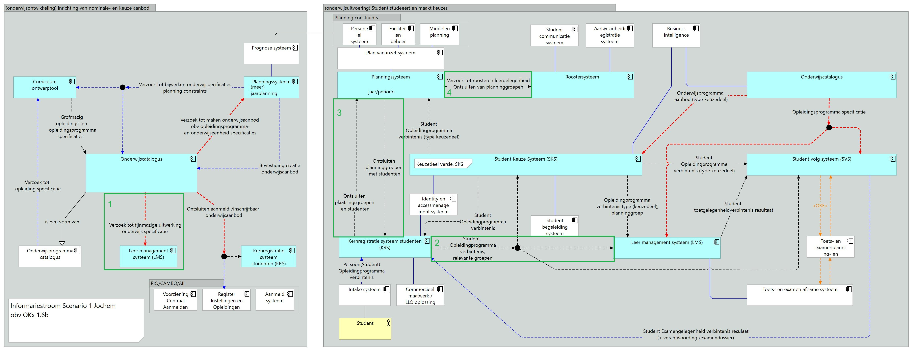

**De instelling — journey fase 4.** Onderwijsontwikkelaars werken **`leeronderdeel-`** en **`toetsonderdeel-specificaties`** (en waar nodig `lesspecificatie`) fijnmazig uit; **OC → LMS** levert die detailspecificaties ter inrichting. Het **Planningssysteem** definieert **plaatsings-** en **planninggroepen** per `opleidingsprogramma`, koppelt deze in **KRS** aan `Persoon`, en geeft te roosteren `leeronderdeel-specificaties` aan het **Roostersysteem**. Het roostersysteem maakt concrete **`leergelegenheden`**, **`lesgelegenheden`** en (waar van toepassing ) ook **`toetsgelegenheden`** (slots, lokalen, docenten) en deelt verwachte deelnemers als **`leergelegenheid-verbintenis`** met de **Aanwezigheidsregistratie**.

**Jochem — happy flow.** Jochem ontvangt zijn **eerste rooster** en krijgt toegang tot het **LMS** voor periode 1. Latere perioden blijven planbaar tot ze geroosterd worden.

**Wat licht op in de plaat.** **OC → LMS** (`leeronderdeel-specificaties` ter detaillering); **Planning ↔ KRS** (groepen ↔ persoon i.r.t. personen en groepen i.r.t `onderwijsspeicficatie`); **Planning → Rooster** (te roosteren `leeronderdeel-` en `toetsonderdeel-specificaties`); **Rooster → Aanwezigheidsregistratie** (`leergelegenheid-verbintenis` "presentielijst"); **KRS → LMS** (`opleidingsprogramma-verbintenis` + `Persoon` voor rechtmatige toegang).

###### Fase 5 — Onderwijs uitvoeren en voortgang begeleiden

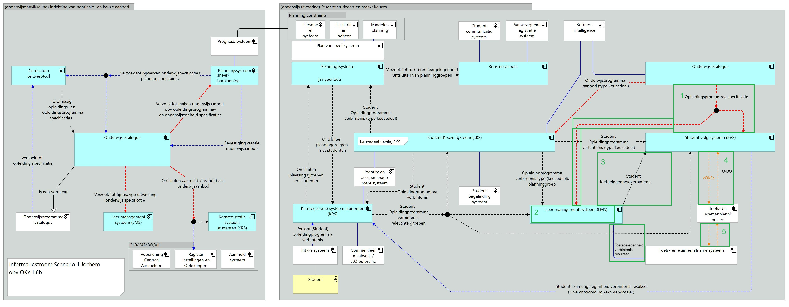

**Jochem — happy flow.** Jochem volgt zijn lessen, **BPV** in de apotheek en formatieve toetsen (student-journey-stappen 5–7). Aanwezigheid wordt geregistreerd; formatieve voortgang loopt door naar het **SVS**.

**De instelling — journey fase 5.** Docenten verzorgen onderwijs, plannen toetsmomenten tijdens lessen en houden formatieve voortgang bij. **SLB'ers** volgen Jochems studiebeeld in **SVS**.

**Jochem — variaties.**

- *Incidenteel temporiseren:* Jochem mist BPV-weken door ziekte; SLB ziet via **SVS** dat hij achterloopt op `onderwijseenheid-verbintenis resultaten`.
- *Incidenteel versnellen:* hij pakt theorie sneller op en vraagt eerder toegang tot het volgende blok.
- *Hybride:* theorie versnelt, BPV temporiseert.

In alle drie blijft de **leerroute regulier**; deze signalen uit fase 5 voeden direct **fase 7** (bijsturen).

**Wat licht op in de plaat.** **OC → LMS** en **OC → SVS** (specificatie als referentiekader); **Roostersysteem ↔ Aanwezigheidsregistratie** (geroosterd aanbod ↔ aanwezigheidsfeiten); **LMS → SVS** (`leergelegenheid-verbintenis resultaten` en `toetsgelegenheid-verbintenis resultaten`, formatief).

###### Fase 6 — Organiseren van keuzemomenten

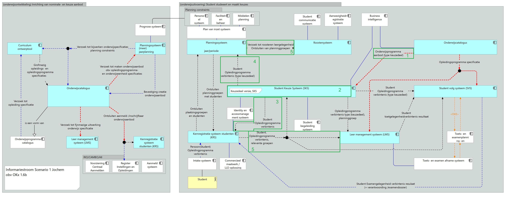

**Jochem — happy flow.** De **keuzedeelruimte** nadert; Jochem stelt zijn **geprioriteerde voorkeurslijst** samen in het **SKS** (zie *Wanneer kiest een student keuzedelen?*). Zijn `aanmelding keuzedeel` voor *Ondernemerschap in de zorg* (periode 7, locatie A) past — gate 10 ja. **SKS → Planning** geeft zijn keuzestelling door als `opleidingsprogramma-verbintenis` op het gekozen `opleidingsprogramma-aanbod`. De planner verwerkt die keuze; bij passend aanbod levert **Planning → KRS** de formele **inschrijving** op het keuzedeel; **KRS/SVS/LMS** en rooster volgen.

**De instelling — journey fase 6.** De planner verwerkt definitieve keuzes **periodiek** naar groepen en capaciteit, actualiseert het planbare aanbod in **OC** en het rooster volgt. Bij **niet-passend aanbod** of **oningevulde keuzedeelruimte** signaleert het systeem actief richting SLB.

**Jochem — variaties.** Past zijn eerste voorkeur niet, dan oriënteert hij op een andere locatie (gate 9a) of een ander keuzedeel; blijft passend aanbod uit, dan blijft zijn keuzedeelruimte (tijdelijk) **leeg** met studievertraging als gevolg — én een signaal naar SLB.

**Wat licht op in de plaat.** **OC → SKS** (`opleidingsprogramma-aanbod` type keuzedeel + `opleidingsprogramma-specificatie`); **SKS → Planning** (`opleidingsprogramma-verbintenis` op gekozen aanbod); **Planning → KRS** (formele inschrijving keuzedeel bij passend aanbod); **Planning → OC** en **Planning → Rooster** (geactualiseerd planbaar/geroosterd aanbod); **KRS → LMS** en **SVS** (deelnemerscontext en studiepad).

###### Fase 7 — Bijsturen planning en aanbod

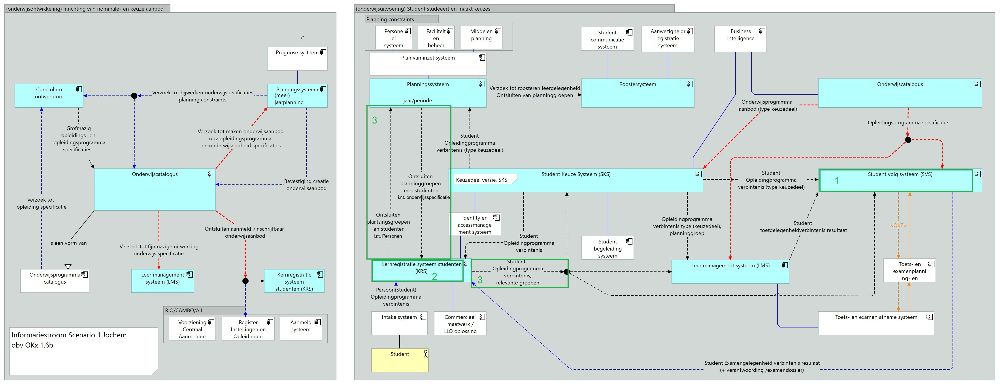

**De instelling — journey fase 7 (IST situatie is grotendeels handmatig).** Tijdens het jaar **cumuleren afwijkingen** (uitval, temporiseren, versnellen, hybride) tegen de initiële `opleidingsprogramma-specificatie` van studenten. **SVS** is bron van die individuele voortgang. De planner verzamelt **vergelijkbare afwijkingen** in een **planninggroep**: bestaande `onderwijseenheid-verbintenissen` worden via **KRS** geannuleerd, voor de nieuwe plangroepen wordt **nieuw `onderwijsaanbod`** gemaakt op basis van dezelfde `opleidingsprogramma-specificatie`. **Planning → OC** publiceert het bijgestuurde planbaar aanbod; **Planning → Rooster** levert het nieuwe rooster. 

**Jochem — variaties.**

- *Temporiseren:* zijn gemiste praktijkles-weken voor medicatieherkenning worden door de planner samengevoegd met andere achterlopers tot een nieuwe `planningsgroeping` i.r.t. `onderwijsspecificatie` in periode 5; zijn bestaande `onderwijseenheid-verbintenis` voor periode 3 wordt geannuleerd, een nieuwe verbintenis volgt op het bijgestuurde aanbod.
- *Versnellen:* hij komt in een versnel-pool (`planningsgroeping` i.r.t. `onderwijsspecificatie`) met andere studenten die op theorie sneller gaan; nieuw `onderwijseenheid-aanbod` met afwijkende periode.
- *Hybride:* hij zit in beide `planningsgroeperingen` — theorie sneller, BPV later — wat het strategische jaarplan opnieuw moet absorberen. Bestaande `onderwijseenheid-verbintenissen` zijn geannuleerd.

**Wat licht op in de plaat.** **SVS** als bron van individuele voortgang (`onderwijsverbintenis resultaten`); **KRS** (verbreken bestaande `onderwijseenheid-verbintenis`); **KRS → Planning** (gewijzigde populatie en plangroepen); **Planning → OC** (mutaties planbaar aanbod); **Planning → Rooster** (nieuw rooster).

###### Fase 8 — Examineren, vaststellen en diplomeren


**De instelling — journey fase 8.** Op basis van het **examenplan** uit fase 1 worden **`examenspecificaties`** getransformeerd tot **`examengelegenheden`**. **Toets-/examenplanning** stelt kandidatenlijsten samen; **Toets-/examenafname** voert de zitting uit en levert resultaten als **`examengelegenheid-verbintenis resultaten`** door aan **SVS**. De **examencommissie** stelt summatief vast (binnen SVS); op basis daarvan registreert **KRS** kwalificering en diplomering.

**Jochem — happy flow.** Jochem legt examens af, ontvangt zijn formele beoordeling en uiteindelijk zijn diploma — het eindpunt van dezelfde keten die hij als reguliere route ervoer.

**Wat licht op in de plaat.** **Toets-/examenplanning ↔ Toets-/examenafname**; **Toets-/examenafname → SVS** (`examengelegenheid-verbintenis resultaten`); **SVS ↔ KRS** (kwalificering en diplomering).

**Aansluiting op de informatiestromenplaat.** De [Informatiestromenplaat](../img/OKx_LR1_informatiestromen_v20260526.jpg) hierboven toont **dezelfde stromen** in begrippen uit het begrippenkader en informatiemodel; in latere AMIGO-stappen worden die vertaald naar **OEAPI-termen** op de flow-relaties (zoals `Programme specification`, `ProgrammeOffering`, `Association`). Hier blijft het bij wat er **conceptueel** beweegt; in de berichtspecificatie-stap van AMIGO (§2.4) en de koppelingspecificaties in Public staat hoe dat in uitwisseling wordt gevangen.

##### Concept informatiemodel — geneste onderwijsspecificatie (Jochem, Apothekersassistent)

Om de begrippen uit het [begrippenkader](begrippenkader.md) en de **ankertabel** tastbaar te maken, werken we hieronder de **onderwijsspecificatie** voor Jochems opleiding *Apothekersassistent* (Crebo-dossier 23450, kwalificatie 27141) volledig genest uit — als ASCII-boom. De uitwerking is **gefaseerd** volgens de instellingsjourney: eerst het **grofmazige ontwerp** (fase 1) dat **publiceerbaar en planbaar** wordt gemaakt (fase 2), daarna de **detaillering** tot lessenreeks- en lesniveau (fase 4). Attribuutnamen zijn **Nederlandse concept-labels** (bv. `kwalificatieverwijzing`, `tijdsverdeling`, `spreidingspatroon`), afgeleid van de specificatie-catalogus ([archief](archief-conceptmodellen.md), §12.5) die de Engelse, OEAPI-nabije namen geeft; leeruitkomsten, studielast en overige waarden zijn **indicatief** en **concept** (nog geen OEAPI-payload).

**Fase 1–2 — grofmazig onderwijsontwerp: publiceerbaar en planbaar.** De **onderwijsontwerper** vertaalt het kwalificatiedossier naar één **opleidingsspecificatie** met daaronder meerdere **opleidingsprogramma-specificaties** (leerwegen), per programma geneste **onderwijseenheden** (blokken die corresponderen met kerntaken) en daaronder **leeronderdelen** (die corresponderen met werkprocessen). Op leeronderdeel-niveau staan de organiseerbaarheids-waarden (BOT/OOT, BPV, ruimtetype, expertiseprofiel). Aan het einde van fase 2 zijn deze specificaties **gepubliceerd** in de OC en door planning voorzien van periode + capaciteit (**planbaar aanbod**, stadium 2a, zie het [begrippenkader](begrippenkader.md)) — nog zónder concrete lokalen/docenten.

```text
OPLEIDINGSSPECIFICATIE                         (rij: Kwalificatiedossier | OEAPI: Programme[root])
= Apothekersassistent  -  Crebo-dossier 23450
  kwalificatieverwijzing: {schema: SBB, dossier: 23450, kwalificatie: 27141}
  curriculumtype: nominaal | status: definitief | versie: 2026.1
  waardedocument: {type: diploma, register: DUO}
  studielast: ~4800 SBU (indicatief; mbo-4, 3 jaar)
|
+-- OPLEIDINGSPROGRAMMA-SPECIFICATIE           (rij: Kwalificatie | OEAPI: Programme[track])
|   = BOL - voltijd  (diplomaprogramma)
|     leerroutetype: regulier | curriculumtype: nominaal
|     dektLeeruitkomsten: LO-sets van B1-K1..B1-K3
|     studielast: 4800 SBU | tijdmodel: 4 perioden/jaar
|   |
|   +-- ONDERWIJSEENHEID-SPECIFICATIE          (rij: Kerntaak | OEAPI: Course)
|   |   = Blok B1-K1  "Biedt farmaceutische patientenzorg"
|   |     dektLeeruitkomsten: LO-sets van W1..W4
|   |     leervorm: mix | tijdsverdeling: BOT 320 / OOT 300 SBU (indicatief)
|   |     ruimtetype: skillslab + balie-simulatie
|   |     expertiseprofielen: [docent farmacie, apothekersassistent-BPV]
|   |   |
|   |   +-- LEERONDERDEEL-SPECIFICATIE         (rij: Werkproces | OEAPI: LearningComponent[learning_activity])
|   |   |   = B1-K1-W1  "Neemt de zorg-/adviesvraag in behandeling"
|   |   |     leervorm: simulatie + werkplekleren (BPV)
|   |   |     tijdsverdeling: BOT 60 / OOT 40 SBU  |  BPV: 80 SBU
|   |   |     ruimtetype: balie-simulatie | expertiseprofielen: [apothekersassistent-docent]
|   |   |     leermiddelengroepen: [EPD-simulator, rollenspelcasus, triageprotocol]
|   |   |
|   |   +-- LEERONDERDEEL-SPECIFICATIE = B1-K1-W2 "Voert medicatiebewaking uit"
|   |   |     leervorm: theorie + simulatie | tijdsverdeling: BOT 50 / OOT 50 SBU
|   |   +-- LEERONDERDEEL-SPECIFICATIE = B1-K1-W3 "Verstrekt (zelfzorg)medicijnen/hulpmiddelen"
|   |   +-- LEERONDERDEEL-SPECIFICATIE = B1-K1-W4 "Geeft informatie en advies (leefstijl)"
|   |
|   +-- ONDERWIJSEENHEID-SPECIFICATIE = Blok B1-K2 "Voert logistieke taken uit"           (W1..W2)
|   +-- ONDERWIJSEENHEID-SPECIFICATIE = Blok B1-K3 "Werkt mee aan kwaliteit/deskundigheid" (W1..W3)
|   +-- ONDERWIJSEENHEID-SPECIFICATIE = Generieke onderdelen (NL, rekenen, Engels(niv.4), LB&B)
|   `-- keuzeruimte: 720 SBU (mbo-4) -> ingevuld vanuit het programma "Keuzedelen" (zie onder)
|
+-- OPLEIDINGSPROGRAMMA-SPECIFICATIE = BBL - werkend leren  (diplomaprogramma)
|     leerroutetype: regulier | zelfde kerntaak-structuur
|     accent: meer werkplekleren (BPV), minder BOT
|
+-- OPLEIDINGSPROGRAMMA-SPECIFICATIE = Havisten-route (verkort)  (diplomaprogramma)
|     leerroutetype: regulier | zelfde kerntaak-structuur
|     accent: ingekorte doorlooptijd / vrijstellingen generiek deel
|
+-- OPLEIDINGSPROGRAMMA-SPECIFICATIE = Keuzedelen   (zelfstandig programma | OEAPI: Programme)
      programmatype: keuzedeel-verzameling
      koppeling: N:M-gekoppeld aan de diplomaprogramma's (BOL/BBL/Havisten), zie het archief (§17.3)
      keuzeruimte: 720 SBU (mbo-4) | keuzeBeschikbaar: ja
      |
      +-- ONDERWIJSEENHEID-SPECIFICATIE = Keuzedeel "Voorbereiding hbo"           (indicatief)
      |     dektLeeruitkomsten: keuzedeel-LO-set | studielast: 240 SBU
      +-- ONDERWIJSEENHEID-SPECIFICATIE = Keuzedeel "Ondernemerschap in de zorg"  (indicatief)
      +-- ONDERWIJSEENHEID-SPECIFICATIE = Keuzedeel "Verdieping medicatiebewaking" (indicatief)
```

> **Keuzedelen als zelfstandig programma.** Keuzedelen worden hier **niet** als onderwijseenheid binnen een diplomaprogramma gemodelleerd, maar als een **eigen `opleidingsprogramma-specificatie`** met daaronder de losse keuzedelen als `onderwijseenheid-specificaties`. Dat programma is **N:M-gekoppeld** aan de diplomaprogramma's: één keuzedeel is herbruikbaar over BOL/BBL/Havisten (en potentieel over opleidingen/instellingen heen). Dit is dezelfde lijn als §17.3 in het [archief](archief-conceptmodellen.md) (*keuzedeel als zelfstandig Programme*); wil je nóg fijnmaziger, dan kan elk keuzedeel een eigen programma zijn.

> **Aggregatie-invariant.** De studielast telt **bottom-up** op: `SOM(leeronderdelen) = onderwijseenheid` en `SOM(onderwijseenheden) = programma` ([archief](archief-conceptmodellen.md), §5.3). De diplomaprogramma's (BOL/BBL/Havisten) delen dezelfde kerntaak-/werkprocesstructuur; alleen leerweg-afhankelijke waarden (BOT vs BPV, doorlooptijd) verschillen. In **fase 2** krijgt elke onderwijseenheid bovendien `spreidingspatroon` + capaciteit voor planbaar aanbod — de resources blijven **profielen** (`ruimtetype`, `expertiseprofielen`), nog geen instanties.

**Fase 4 — detaillering: lessenreeksen en lessen.** De **onderwijsontwikkelaar** werkt de grofmazige leeronderdelen fijnmazig uit tot **lessenreeksen** en **lessen**, met **lesplannen**, **werkinstructies** (leertaken), **leermaterialen** en **lesdoelen** (lesuitkomsten). Hieronder ingezoomd op één werkproces (`B1-K1-W1`); de overige werkprocessen volgen hetzelfde patroon (indicatief ingekort).

```text
LEERONDERDEEL-SPECIFICATIE = B1-K1-W1 "Neemt de zorg-/adviesvraag in behandeling"
  (OEAPI: LearningComponent[learning_activity])
|
+-- LESSENREEKS = "Baliegesprek & triage"      (geneste LearningComponent[learning_activity])
|   dektLeeruitkomsten: "Voert professioneel baliegesprek en triage"
|   spreidingspatroon: 6 weken x 1 dagdeel (indicatief)
|   |
|   +-- LESSPECIFICATIE = Les 1 "Introductie WHAM-vragen & triage"
|   |     (rij: Lesdoel/Lesuitkomst | OEAPI: LearningComponent[lesson_assignment])
|   |     dektLesuitkomsten: "Past WHAM-vragen correct toe in intakegesprek"
|   |     leervorm: werkcollege | tijdsverdeling: BOT 2u / OOT 2u
|   |     |
|   |     +-- lesplanverwijzing -> LESPLAN (hulpspecificatie, §12.5.7)
|   |     |                         fasen: intro / instructie / oefening / reflectie
|   |     |                         formatieveControles: quiz WHAM-vragen
|   |     +-- leertaken ---------> LEERTAAK-SPECIFICATIE (werkinstructie, §12.5.8)
|   |     |                         taakomschrijving: rollenspel baliegesprek (in tweetal)
|   |     |                         opleverproducten: ingevuld triageformulier
|   |     |                         acceptatiecriteria: alle WHAM-velden + gekozen vervolgstap
|   |     +-- leermaterialen ----> LESMATERIAALSPECIFICATIES (§12.5.9)
|   |                               [rollenspelcasus-kaarten, EPD-simulator, triageprotocol]
|   |
|   +-- LESSPECIFICATIE = Les 2 "Vervolgstap kiezen & controlevragen"      (idem opbouw)
|   +-- LESSPECIFICATIE = Les 3 "Discreet omgaan met vertrouwelijke info"  (idem opbouw)
|
+-- LESSENREEKS = "Medicatieverificatie bij overdracht"   (indicatief, verkort)
|
+-- TOETSONDERDEEL-SPECIFICATIE = "Praktijktoets baliegesprek (OSCE)"
      (toetsrij | OEAPI: TestComponent)
      toetsniveau: summatief | toetsbereik: {werkprocescodes: [B1-K1-W1]}
      toetsvorm: OSCE/praktijksimulatie | resultaatmodel: {schaal: onvold/vold/goed}
```

> **Van detail naar uitvoering.** Deze detailspecificaties voeden **OC → LMS** ter inrichting (fase 4; zie de koppelingspecificatie OC-LMS in Public). Op dezelfde specificaties ontstaat het **geroosterde aanbod** — `leergelegenheid` en `lesgelegenheid` (stadium 2b) — en vervolgens de **verbintenis** en het **resultaat** (kolommen 5 en 6 van de [ankertabel](begrippenkader.md)), minimaal gedragen door de status van de verbintenis. De boom blijft hier bewust **conceptueel**: geen concrete lokalen, personen of payloads.


<!-- **Probleemstelling van IST situatie:**
In de IST-situatie werkt een instelling weliswaar onder een gezamenlijk bestuurlijk en organisatorisch dak, maar beschrijven domeinen en onderliggende onderwijsteams hun onderwijsspecificaties nog ieder op hun eigen manier. Ieder team vertaalt het kwalificatiekader zelfstandig naar lokale begrippen, eigen datastructuren, eigen granulariteit en eigen benamingen. Daardoor ontstaat binnen een instelling geen gedeelde taal voor onderwijsbeschrijving.

Het gevolg is dat onderwijsspecificaties van team A niet vanzelf begrijpelijk of herbruikbaar zijn voor team B, ook al werken beide teams binnen dezelfde instelling. Uitwisseling binnen de instelling loopt dan vast op semantiek en datastructuur: dezelfde werkelijkheid wordt anders gemodelleerd, andere velden worden gebruikt, en betekenis kan niet betrouwbaar worden overgenomen. Dit is de directe aanleiding voor de SOLL-situatie hieronder: eerst binnen de instelling standaardiseren, zodat in **scenario 4 - Binnen de instelling** onderwijsspecificaties wel uitwisselbaar, vergelijkbaar en herbruikbaar worden.

Onderstaand organogram maakt zichtbaar dat dit probleem niet alleen tussen domeinen speelt, maar ook raakt aan de afstemming tussen onderwijsteams en de ondersteunende teams voor logistiek en begeleiding.
-->


<!-- **Actor(en) — wie maakt regulier studeren mogelijk?**
- **Student**: schrijft in, kiest (bij intake) keuzedelen binnen de ruimte/regels, tekent in en volgt onderwijs.
- **Intakebegeleider / SLB’er**: begeleidt keuze en legt afspraken/keuzes vast in het persoonlijke programma.
- **Onderwijsontwerper**: ontwerpt het nominale programma (incl. keuzedeelruimte) en samenhang.
- **Onderwijsontwikkelaar**: werkt leeronderdeelspecificaties/lesspecificaties/toetsspecificaties uit tot uitvoerbaar aanbod.
- **Planner**: maakt het aanbod planbaar (periodes/capaciteit binnen mensen en middelen), incl. groepen op basis van vergelijkbare keuzes.
- **Roosteraar**: maakt het planbare aanbod geroosterd (tijdsloten en toewijzingen).
- **Docent / begeleider**: voert onderwijs uit en begeleidt studenten in de leerroute.
- **Toets-/examenfunctionarissen**: organiseren toetsing/afname en zorgen voor geldige afronding.

**Wat moet er minimaal beschreven en uitwisselbaar zijn om dit mogelijk te maken?**
- **Onderwijskundige beschrijving**: leeruitkomsten en samenhang (programma → **leeronderdeelspecificaties** → lesspecificaties).
- **Organiseerbaarheid**: leervorm, studielast (BOT/OOT), ruimtebehoefte, expertiseprofielen, leermiddelen; plus volgordelijkheid.
- **Toetsing**: welke toets-/examenvormen gelden, en welke leeruitkomsten daarmee worden beoordeeld.
- **Onderwijslogistiek**: planning (planbaar aanbod: periodes/capaciteit) en roostering (geroosterd aanbod: tijdsloten en toewijzingen).

**Scenario-set (aanbod-gestuurd, primair)**
1. Onderwijsontwerp en publicatie (onderwijsspecificaties beschikbaar maken).
2. Planning: planbaar aanbod maken (periode/capaciteit binnen mensen en middelen).
3. Roostering: geroosterd aanbod maken (tijdsloten + toewijzingen).
4. Student wordt aangemeld en ingeschreven (verbintenis/inschrijving) op en volgt onderwijs volgens rooster.
5. Toetsing en resultaat (summatief/formatief; voortgang/resultaten vastleggen). -->

#### 3.3.2 Leerroute 2 — Temporiseren (en personaliseren) by design

**Anker-persona:** [Larissa](persona_larissa.md) — topsporter (kans op Olympische Spelen 2028) die de mbo-4-opleiding *Software Developer* (BOL) wil halen, maar met **structureel beperkte en deels onvoorspelbare beschikbaarheid**: dagelijks training tot 10:00, blessuregevoeligheid (acute, hele-dag-uitval), vier toernooien en twee trainingskampen per jaar (seizoensgebonden, vooraf bekend) en mogelijk een **volledige periode** afwezig rond de Spelen. Waar [Jochem](persona_jochem.md) in leerroute 1 de **nominale** route als norm volgt, spreidt en personaliseert Larissa diezelfde opleiding **bewust en vanaf dag één** — niet als incident, maar *by design*.

**Kern.** De student volgt **dezelfde kwalificatie en in essentie dezelfde `onderwijsspecificatie`** als in leerroute 1, maar het **persoonlijke programma** wijkt **structureel** af van het nominale programma: lagere intensiteit, andere volgorde, andere perioden, en deelname die per `lesgelegenheid` wordt gekozen. De examenketen, het begrippenkader (`specificatie → aanbod → verbintenis → resultaat`) en de aanbodstadia blijven gelijk; wat verschuift zijn **sturing**, **rollen**, **informatiestromen** en **randvoorwaarden**.

**Leeswijzer.** Deze paragraaf is opgebouwd zoals leerroute 1: eerst de **delta** t.o.v. de reguliere baseline (§3.3.2.1), dan de **studentbeleving** (§3.3.2.2) en de **instellingsbeleving** (§3.3.2.3). Daarna gebruiken we Larissa om twee dingen uit te diepen die in leerroute 1 nog impliciet bleven: de **organisatorische en geografische complexiteit** van instellingen (§3.3.2.4) en het **plan- en rooster proces** onder die complexiteit (§3.3.2.5). Ten slotte concretiseren we **per processtap de data-objecten en attributen** richting een koppelvlakstandaard (§3.3.2.6), met de **negen concern-dimensies** (§3.3.2.7) en de **informatiestromen/AMIGO-voorloper** (§3.3.2.8). Het procesbeeld als geheel staat in de ArchiMate-view [*Onderwijsvisie vertalen naar onderwijsaanbod*](img/archimate-view-onderwijsvisie-vertalen-naar-onderwijsaanbod-basis-model-v20260626.jpg).

##### 3.3.2.1 Delta t.o.v. leerroute 1 (regulier)

De winst van leerroute 1 als baseline is dat we alleen het **verschil** hoeven te beschrijven. Onderstaande tabel zet de verschuiving op een rij; alles wat niet in de kolom *Leerroute 2* staat, blijft **gelijk aan de reguliere keten**.

| Dimensie | Leerroute 1 — regulier (Jochem) | Leerroute 2 — temporiseren/personaliseren by design (Larissa) |
| --- | --- | --- |
| **Sturingsmodel** | Sterk aanbod-gestuurd; student kiest uit wat er is | **Hybride, neigend naar vraag-gestuurd**: het nominale aanbod blijft de ruggengraat, maar het persoonlijke pad stuurt deelname, alternatieven en aanvullend aanbod |
| **`curriculumType`** | `nominaal` | `flexibel` / `hybride` (vaste kern + per periode samengestelde invulling) |
| **Persoonlijk programma** | ≈ nominaal programma + keuzedeel | Nominaal programma als **template**, maar met structurele afwijking in tempo, volgorde en periode |
| **Keuze-eenheid** | Opleiding + keuzedeel (§*Wanneer kiest een student keuzedelen?*) | Ook **deelname per `lesgelegenheid`** (in-/uitschrijven), **alternatieve tijdsloten**, en **cross-opleiding** modules (Engels bij *Technicus Engineering*) |
| **Planning/roostering** | Check-en-finetune op een stabiel jaarplan | **Continue herplanning**; vraag wordt **gepoold** over perioden, opleidingen en **locaties** tot een drempel |
| **BPV** | Standaard BPV-venster, regulier leerbedrijf | **Verschoven en verlengde BPV** rond de Spelen; leerbedrijf levert extra leeruitkomsten |
| **Examinering** | Grotendeels cohort-gepland | **Individueel gepland** (kennisexamens on-demand; praktijk/PvB op individuele basis) |
| **Begeleiding (SLB)** | Licht, signalerend | **Zware regie- en afstemlast**; `begeleidingsdossier` is spil voor afspraken en goedkeuringen |
| **Geografie/organisatie** | Impliciet één locatie | **Expliciet**: locatie- en (soms) instelling-overstijgende deelname (zie §3.3.2.4) |

> **Voor wie dieper wil — sturingsmodel.** Leerroute 2 verlaat het aanbod-gestuurde model niet volledig. Het overgrote deel van het curriculum blijft **aanbod-gestuurd** (cohorten, vaste perioden); de **vraag-gestuurde** aanvulling ontstaat waar Larissa's beschikbaarheid de nominale route doorkruist. Dit is exact de **hybride structuur** uit de baseline: individuele verzoeken worden **gepoold/gebatcht** tot een levensvatbare drempel, waarna — mits haalbaar binnen mensen en middelen — **hernieuwd of aanvullend aanbod** ontstaat. Larissa maakt zichtbaar dat dit bij *by design*-temporiseren geen uitzondering meer is, maar een **terugkerend planpatroon**.

##### 3.3.2.2 De studentbeleving — Larissa (student journey)

> Voor de volledige verhaallijn: zie [persona Larissa](persona_larissa.md). Hieronder de stappen die de **leerroute-2-delta** dragen; de overige stappen verlopen als in leerroute 1.

- **Oriënteren & aanmelden.** Larissa kiest bewust **niet** het op topsport afgestemde Sport & Bewegen, maar ICT/Software Developer. Bij aanmelding geeft ze expliciet een **ondersteunings-/maatwerkvraag** op: ze wil de niveau-4-opleiding halen ondanks beperkte beschikbaarheid.
- **Intake & inschrijven.** In de intake worden haar drie structurele beperkingen vastgelegd (ochtendtraining, blessure-uitval, toernooien/kampen + mogelijke Spelen). Er worden **nog geen concrete beloften** gedaan over invulling: per periode wordt bekeken welke onderdelen wegvallen en hoe/wanneer ze worden ingehaald. De **SLB'er** wordt haar vaste regisseur.
- **Informeren.** Zodra het **rooster voor periode 1** beschikbaar is, ziet ze meteen welke lessen botsen met haar training. Vanuit haar **student keuze systeem (SKS)** schrijft ze zich **uit** voor de eerste-uurslessen. Voor twee lessen biedt het systeem een **alternatief tijdslot**; één daarvan botst met niets — die kiest ze. Voor twee andere lessen is **geen alternatief**: direct een afspraak met de SLB'er.
- **Studeren & persoonlijk leertraject.** Elke periode herhaalt zich dit patroon. Naarmate de opleiding vordert **cumuleert achterstand**: sommige modules vervallen omdat ze voortbouwen op gemiste onderdelen, en er ontstaan **gaten** in haar beschikbaarheid die niet altijd met benodigde modules te vullen zijn (niet elke module wordt elke periode aangeboden — alleen bij voldoende vraag). Samen met de SLB'er kiest ze tussen **vooruit werken** (portfolio-opdracht eerder oppakken, ook al voldoet ze nog niet aan alle startcondities) en **cross-opleiding** volgen: ze schrijft zich — met goedkeuring van de SLB'er — in op **Engels bij de opleiding *Technicus Engineering***, waar nog plek is. Afspraken landen in het **begeleidingsdossier**.
- **BPV.** De standaard BPV botst met haar Spelen-voorbereiding. De BPV-begeleider vindt een leerbedrijf dat juist **in de zomer** extra capaciteit wil en **complexere opdrachten** biedt — geschikt om óók de twee nog niet volledig aangetoonde leeruitkomsten af te ronden. De **POK** wordt geregeld voor een **verschoven, langere** BPV.
- **Examineren.** Generieke kennisexamens neemt ze **wanneer het uitkomt** (vrijwel elke periode beschikbaar); praktijk/PvB wordt **individueel** ingepland.
- **Diploma.** Ze haalt het diploma met **beperkte vertraging**; door een examen op een ongebruikelijk moment wacht ze op één van de **vier diploma-uitreikmomenten** per jaar (vooraf bekend uit de OER).

##### 3.3.2.3 De instellingsbeleving — wat de instelling extra moet organiseren

Voor de instelling is leerroute 2 dezelfde [instellingsjourney](#de-procesbeleving-achter-regulier-onderwijs-van-een-instelling) (fasen 1–8) als bij leerroute 1, maar met **zwaartepunt in fase 5–7** (uitvoeren, keuzemomenten, bijsturen). Het ontwerp (fase 1–2) en de examenketen (fase 8) blijven inhoudelijk gelijk; de **organiseerbaarheid** verandert. Concreet vraagt Larissa van de instelling:

- **Deelname-flexibiliteit per `lesgelegenheid`** (in-/uitschrijven, alternatieve slots) in plaats van alleen een vaste groepsplaatsing.
- **Aanbod-rijping op vraag**: modules die alleen draaien bij voldoende animo, met **animo-/vraagdetectie** ruim vóór de periode.
- **Cross-opleiding plaatsing** binnen de instelling (Engels bij een andere opleiding) met **goedkeuring** en resultaat-terugkoppeling.
- **Individuele examenplanning** naast cohort-examinering.
- **Regie via SLB en `begeleidingsdossier`** als bron voor afspraken, goedkeuringen en signalen.

Dat dit organisatorisch kan, hangt sterk af van **hoe de instelling geografisch en organisatorisch is ingericht**. Daarvoor verbreden we eerst het beeld van *de* onderwijsinstelling. De baseline daarbij blijft het aanbod-gestuurde model met hybride kenmerken:

- **Sterk aanbod-gestuurd onderwijsaanbodmodel met hybride kenmerken**: In de praktijk is het onderwijsmodel primair aanbod-gestuurd. De instelling ontwikkelt en publiceert het overgrote deel van het onderwijsaanbod vooraf, zodat studenten zich inschrijven op geplande programma’s in vaste perioden en groepen. Alleen in uitzonderlijke situaties (unhappy flow, zoals incidenteel moeten temporiseren of versnellen) wordt van deze hoofdroute afgeweken. In dat geval kunnen studenten onderwijs- of onderdeelspecificaties ‘on request’ aanvragen om het volgen of herhalen ervan mogelijk te maken. Individuele verzoeken van studenten om onderdelen opnieuw te mogen volgen worden door de instelling gepoold (‘batched’) tot er een kritieke drempel is bereikt. Pas als er voldoende vraag is, en mits binnen de beschikbare mensen en middelen, kan het onderwijsaanbod opnieuw gepland en aangeboden worden. Zo behoudt het model haar aanbod-gestuurde karakter, maar ontstaat er een hybride structuur: incidentele vraag-gebaseerde verzoeken leiden – mits levensvatbaar – tot hernieuwd of aanvullend aanbod.

##### 3.3.2.4 Organisatorische en geografische complexiteit van instellingen

In leerroute 1 spraken we impliciet over *de* onderwijsinstelling als één organisatie op één locatie (zie het [organogram](#de-onderwijsinstelling)). Larissa's traject — met cross-opleiding deelname en verschoven BPV — maakt zichtbaar dat "de instelling" in de praktijk **vele vormen** heeft. Die vormen bepalen **waar grenzen lopen** voor publicatie, planning, plaatsing en erkenning, en dus **welke koppelvlakken** nodig zijn.

**Het reductie-principe.** De complexiteit blijft beheersbaar door alle varianten terug te brengen tot **twee scoping-vragen** op elk informatie-object:

1. **Wie is eigenaar/aanbieder?** — de **organisatie** (rechtspersoon/BRIN) die het object bezit, publiceert of erkent.
2. **Waar wordt het uitgevoerd?** — de **locatie** (fysiek, online of hybride) waar het aanbod landt.

Zolang elk object deze twee dimensies **expliciet** draagt (zie de attributen in §3.3.2.6), kan dezelfde keten — met de **Onderwijscatalogus (OC)** als distributiepunt — alle organisatievormen bedienen. Dat is de kern van *"hoe houden we het werkend over alle dimensies"*: **niet** meer koppelvlakken per vorm, maar **consistente scoping** op één koppelvlak.

**Vier organisatievormen.** Onderstaande tabel beschrijft per vorm wat er verandert; de **delta** zit telkens in *grensoverschrijding*, niet in nieuwe objecttypen.

| Organisatievorm | Kenmerk | Grens van OC / publicatie | Grens van planning & rooster | Grens van verbintenis & erkenning | Koppelvlak-implicatie |
| --- | --- | --- | --- | --- | --- |
| **A. Kleine instelling, één locatie** | Eén rechtspersoon, één campus | Eén OC-scope | Eén planning, één rooster-master | Verbintenis binnen één organisatie/locatie | **Intern**; scoping-attributen constant. Larissa's cross-opleiding blijft binnenshuis |
| **B. Grote fusie-instelling, meerdere locaties** | Eén rechtspersoon (één BRIN), meerdere campussen/domeinen | Eén OC, maar aanbod **per locatie** gescoped | Instellingsbrede planning; **rooster per locatie**; gedeelde docenten/ruimten over locaties | Verbintenis binnen één organisatie, maar met **`locationRef`** | **Intern, locatie-bewust**: pooling van vraag over locaties; locatie als harde/zachte constraint |
| **C. Samenwerkende instellingen** | Meerdere **aparte rechtspersonen** met samenwerkingsafspraak | **Meerdere OC's**; aanbod wordt **cross-gepubliceerd/geconsumeerd** | Twee planningssystemen; **géén gedeelde rooster-master** — afstemming via aanbod + verbintenis | **`homeOrganisation`** (inschrijvend) vs **`hostOrganisation`** (uitvoerend); erkenning via `learningOutcomes`/`credentialDocument` (§7) | **Cross-instelling** (OEAPI/Edubroker, §7); identiteit, erkenning en bekostiging worden expliciet |
| **D. Landelijk gespreid / sectorbreed** | Veel locaties en/of veel instellingen, geografisch verspreid | Federatie van OC's; **vindbaarheid** op `geographicScope`/regio | Planning blijft lokaal; landelijke laag = **matching en doorverwijzing**, geen centrale roosteraar | Verbintenis blijft bij `homeOrganisation`; mobiliteit via host-afspraken | **Federatief**: standaard-semantiek (§7) is randvoorwaarde; geen centraal planmonopolie |

> **Larissa op de organisatiekaart.** Haar Engels-bij-*Technicus Engineering* is in vorm **A/B** een **interne cross-opleiding** plaatsing (zelfde rechtspersoon, mogelijk andere locatie → `locationRef`). Zou dat Engels bij een **andere instelling** worden gevolgd (vorm **C**), dan wordt haar mbo de **`homeOrganisation`** (inschrijving, diploma, bekostiging) en de andere instelling de **`hostOrganisation`** (uitvoering, aanwezigheid, resultaat-teruglevering) — exact het cross-instelling-patroon uit [§7](#7-cross-instelling-interoperabiliteit). De **informatie-objecten blijven identiek**; alleen de scoping-attributen `homeOrganisation`/`hostOrganisation`/`locationRef` verschillen.

**Hoe blijft de koppeling werken over alle dimensies?** Vier ontwerpregels, alle terug te voeren op bestaande secties:

1. **Eén distributiepunt per scope.** De OC blijft de plek waar specificatie en (planbaar/geroosterd) aanbod worden gepubliceerd en consistent gehouden ([archief](archief-conceptmodellen.md), §4.1). Bij meerdere organisaties: **meerdere OC's die federatief uitwisselen**, geen gedeelde database.
2. **Stabiele identiteit.** `organisation`, `location` en `offering` krijgen **stabiele, herkenbare identifiers**; cross-organisatie verwijzingen zijn **referenties** (URI/ID), geen kopieën (consistent met de notatie in de specificatie-catalogus, [archief](archief-conceptmodellen.md) §12.5).
3. **Erkenning via betekenis, niet via systeem.** Wat elders is gehaald, telt mee via `learningOutcomes` + `qualificationReference` + `credentialDocument` (§7), niet via het delen van roosters of persoonsregisters.
4. **Lokale autonomie waar het mag.** Fysiek lokaal, concrete docent, tijdslot, prijs/bekostiging blijven **instelling-specifiek** (§7); alleen de **semantiek** die de keten nodig heeft, is gestandaardiseerd.

##### 3.3.2.5 Het plan- en rooster proces onder locatie- en organisatiecomplexiteit

Dit is de aangekondigde **uitbreiding** van [*Het plan en rooster proces*](#het-plan-en-rooster-proces). De leesregel blijft *goed beschrijven → goed plannen → goed instelling-breed plannen → goed roosteren*, maar krijgt er een schakel bij: **goed instelling-breed plannen wordt goed locatie- en organisatie-breed plannen**.

**Wat verandert er in de constraint-set?** In leerroute 1 leverde de keten al `Persoon`, `groep` en `constraint` aan de planner (zie de informatietabel *Persoon, groep en constraint* en §3.3.1.2.5). Leerroute 2 voegt daar **locatie- en organisatie-constraints** aan toe:

| Constraint-categorie | In leerroute 1 (impliciet) | In leerroute 2 (expliciet) |
| --- | --- | --- |
| **Persoonsbeschikbaarheid** | Voltijd, standaardrooster | Larissa: niet vóór 10:00; geblokkeerde toernooi-/kampdagen; mogelijke hele-periode-blokkade (Spelen) |
| **Locatie** | Eén locatie, impliciet | `offeringLocation` per aanbod; reistijd tussen locaties; locatie-gebonden faciliteiten |
| **Organisatie** | Eén organisatie | `offeringOrganisation`; bij host-deelname afstemming over twee agenda's/kalenders |
| **Aanbod-drempel** | Aanbod staat al | Module draait alleen bij **voldoende animo**; vraag wordt **gepoold over perioden én locaties** |
| **Deelname-eenheid** | Groepsplaatsing | Deelname per `lesgelegenheid` (alternatieve slots) |

**Twee planlagen, expliciet gescheiden.** Onder organisatiecomplexiteit valt het plan uiteen in:

- **Instellingsbreed (tactisch) jaarplan** — over alle opleidingen *en locaties* van één organisatie. Hier landt pooling van Larissa-achtige vraag: meerdere studenten met vergelijkbare gaten vormen samen de **drempel** voor een (her)geplande module of een alternatief slot.
- **Lokaal rooster (operationeel)** — per locatie. Het rooster blijft een **check-en-finetune** op het jaarplan, maar moet nu **locatie-overstijgende inzet** (docent/ruimte gedeeld tussen campussen) en **reistijd** respecteren.

Bij **samenwerkende instellingen (vorm C/D)** is er **geen gedeelde rooster-master**. De koppeling loopt dan via twee bewegingen: de `hostOrganisation` publiceert **geroosterd aanbod** (met tijdslot en locatie) naar haar OC; de `homeOrganisation` legt een **verbintenis** op dat aanbod vast en ontvangt later het **resultaat** terug. Plannen blijft lokaal; de keten koppelt op **aanbod** en **verbintenis**, niet op elkaars interne roosters.

> **Voor wie dieper wil — CSP met locatie/organisatie.** In de CSP-termen uit [*Voor wie dieper wil: CSP, NP-Hard en controle*](#voor-wie-dieper-wil-csp-np-hard-en-controle) komen er **variabelen** bij (welke locatie, welke organisatie levert) en **constraints** (reistijd, locatie-capaciteit, host-kalender, persoonsblokkades). Het probleem wordt daarmee zwaarder te *vinden*, maar **controleren** blijft goedkoop: past Larissa's deelname binnen haar beschikbaarheid, op de juiste locatie, met een bevoegde docent, zonder dubbelboeking over locaties heen? Daarom blijven tools **conceptvoorstellen** doen en planners/roosteraars **bijsturen** — nu ook over locatie- en organisatiegrenzen.

##### 3.3.2.6 Per processtap: data-objecten en attributen richting koppelvlak

Doel van deze sectie is de aankondiging uit de inleiding waarmaken: **per processtap** concretiseren welke **data-objecten** en **attributen** bewegen, zodat hierop een **koppelvlakstandaard** te bouwen is. We bouwen voort op de specificatie-catalogus ([archief](archief-conceptmodellen.md), §12.5; stopt op specificatie-niveau) en vullen de **latere fases** aan — de plekken waar de ArchiMate-plaat nog data-objecten mist: het **aanbod-**, **verbintenis-** en **resultaat**-stadium, plus de **organisatie/locatie-scoping** die leerroute 2 nodig heeft.

> **Notatie en grenzen.** We hanteren de notatie van §12.5 (gegevensgroep → attributen → verwijzing) en blijven **conceptueel**: dit is de **leg-up** naar AMIGO (bericht-/interfacespecificatie), nog geen OEAPI-payload. Mapping naar OEAPI (o.a. `Association`/`state`) en koppelvlakdetails volgen later; **gaten worden gesignaleerd** (§9), de OEAPI-kern lossen we hier niet op.

**Stap 0 — Organisatie- en locatiecontext (geldt op álle objecten).** Dit is de gegevensgroep die leerroute 2 expliciet maakt en die in elk object hieronder terugkomt.

| Gegevensgroep | Attributen (minimaal) | Toelichting |
| --- | --- | --- |
| Organisatiecontext | `ownerOrganisation`, `offeringOrganisation`, `homeOrganisation`, `hostOrganisation` | Eigenaar/aanbieder en (bij grensoverschrijding) inschrijvende vs uitvoerende organisatie (§3.3.2.4, §7). |
| Locatiecontext | `locationRef`, `deliveryMode` (`onSite`/`online`/`hybride`), `geographicScope` | Waar het aanbod landt; mode bepaalt reistijd-/faciliteit-constraints. |
| Verwijzing | `…Ref` als ID/URI | Cross-organisatie altijd **referentie**, nooit kopie (§12.5-notatie). |

**Stap 1 — Specificatie (fase 1): standaardiseren op leeruitkomsten.** In leerroute 1 kon de specificatie nog **intern** blijven: één team, één manier van uitwerken, nauwelijks uitwisseling. Larissa's leerroute 2 — en zeker de organisatievormen **B, C en D** uit §3.3.2.4 (grote/fusie-instellingen, samenwerkende instellingen, landelijk gespreid) — maakt dat onhoudbaar. Zodra meerdere onderwijsteams (laat staan meerdere instellingen) **ieder hun eigen** onderwijskundige uitwerking van dezelfde `onderwijsspecificatie` hanteren, ontstaan twee problemen:

1. **Uitwisselingsprobleem** — structuur en betekenis sluiten niet op elkaar aan; specificaties zijn niet betrouwbaar te begrijpen of te hergebruiken (zie diagram *Probleem 1* hieronder).
2. **Zoekprobleem** — zonder gedeelde betekenis is aanbod niet op **inhoud** te vinden; een student of plannend systeem kan niet matchen op "wat leer ik hier eigenlijk" (zie diagram *Probleem 2* hieronder).

De oplossing voor **beide** is dezelfde **lingua franca**: **gestandaardiseerde leeruitkomsten** (bij voorkeur in een sectoroverstijgende skillstaxonomie als CompetentNL, zie hoofdstuk 4 en §5.4). Leeruitkomsten zijn daarmee geen bijkomstig attribuut van de specificatie, maar het **scharnier** dat (a) betekenis **vergelijkbaar** maakt tussen teams en instellingen en (b) de **zoeksleutel** vormt waarop aanbod inhoudelijk vindbaar wordt — inclusief **overlapdetectie** tussen opleidingen en instellingen. Stap 1 is dus **niet ongewijzigd**: we maken leeruitkomsten expliciet in het begrippenkader.

Onderstaand het begrippenkader uit [*Betrokken informatie bij proces*](#betrokken-informatie-bij-proces), hier **uitgebreid met een expliciete kolom 2. Leeruitkomsten** tussen kwalificatiekader en onderwijsspecificatie (overige kolommen hernummerd):

| **1. Kwalificatiekader** | **2. Leeruitkomsten** | **3. Onderwijsspecificatie** | **4. Onderwijsaanbod** | **5. Onderwijsverbintenis** | **6. Onderwijsresultaat** |
| --- | --- | --- | --- | --- | --- |
| `Kwalificatiedossier` | Aggregatie van alle `Leeruitkomsten` (diploma-dekking) | `Opleidingsspecificatie` | `Opleidingsaanbod` | `Opleidingsverbintenis` | `Opleidingsverbintenis resultaat` |
| `Kwalificatie` | Set `Leeruitkomsten` die de kwalificatie dekt | `Opleidingsprogramma-specificatie` | `Opleidingsprogramma-aanbod` | `Opleidingsprogramma-verbintenis` | `Opleidingsprogramma-verbintenis resultaat` |
| `Kerntaak` | Cluster `Leeruitkomsten` per kerntaak | `Onderwijseenheid-specificatie` | `Onderwijseenheid-aanbod` | `Onderwijseenheid-verbintenis` | `Onderwijseenheid-verbintenis resultaat` |
| `Werkproces` | `Leeruitkomst` (summatief) — **canoniek niveau** | `Leeronderdeel-specificatie` | `Leergelegenheid` | `Leergelegenheid-verbintenis` | `Leergelegenheid-verbintenis resultaat` |
| *n.v.t. binnen kwalificatiekader — eigen beleid instelling* | `Lesuitkomst` (formatief) | `Lesspecificatie` | `Lesgelegenheid` | `Lesgelegenheid-verbintenis` | `Lesgelegenheid-verbintenis resultaat` |
| *n.v.t. binnen kwalificatiekader — toetsing* | Getoetste `Leeruitkomst`/`Lesuitkomst` (assesses) | `Toetsonderdeel-specificatie` | `Toetsgelegenheid` | `Toetsgelegenheid-verbintenis` | `Toetsgelegenheid-verbintenis resultaat` |
| Doorgaands `Werkproces` | Summatieve `Leeruitkomst` (examineert werkproces) | `Examenonderdeel-specificatie` | `Examengelegenheid` | `Examengelegenheid-verbintenis` | `Examengelegenheid-verbintenis resultaat` |

De `Leeruitkomst` (summatief, op **werkproces**-niveau) en `Lesuitkomst` (formatief, op **les**-niveau) zijn het canonieke vertrekpunt; de hogere rijen (dossier, kwalificatie, kerntaak) zijn **aggregaties** daarvan, de toets-/examenrijen **toetsen** ze (`assesses`). Voor leerroute 2 blijft de specificatie verder aangevuld met `curriculumType` (`flexibel`/`hybride`) op programma-niveau en de organisatiecontext uit stap 0; er ontstaan **geen nieuwe objecttypen**, maar leeruitkomsten worden de **verplichte, gestandaardiseerde drager van betekenis**.

**Probleem 1 — uitwisseling.** Wanneer elk team zijn eigen uitwerking hanteert, loopt zelfs de **interne** uitwisseling al vast:

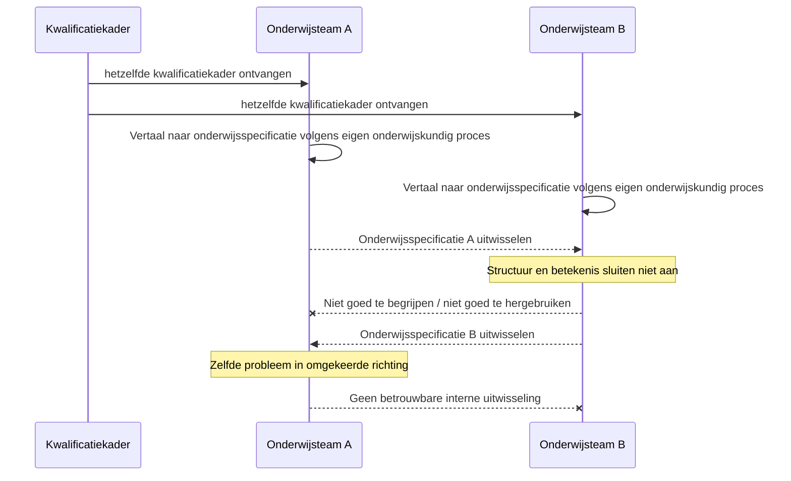
```mermaid
sequenceDiagram
  participant kwalificatiekader as Kwalificatiekader
  participant teamA as Onderwijsteam A
  participant teamB as Onderwijsteam B

  kwalificatiekader->>teamA: hetzelfde kwalificatiekader ontvangen
  kwalificatiekader->>teamB: hetzelfde kwalificatiekader ontvangen

  teamA->>teamA: Vertaal naar onderwijsspecificatie volgens eigen onderwijskundig proces
  teamB->>teamB: Vertaal naar onderwijsspecificatie volgens eigen onderwijskundig proces

  teamA-->>teamB: Onderwijsspecificatie A uitwisselen
  Note over teamB: Structuur en betekenis sluiten niet aan
  teamB--xteamA: Niet goed te begrijpen / niet goed te hergebruiken

  teamB-->>teamA: Onderwijsspecificatie B uitwisselen
  Note over teamA: Zelfde probleem in omgekeerde richting
  teamA--xteamB: Geen betrouwbare interne uitwisseling
```


**Probleem 2 — vindbaarheid.** Hetzelfde gebrek aan gedeelde betekenis maakt aanbod ook **onvindbaar op inhoud**. Een student als Larissa zoekt niet op de naam van een module bij een specifiek team, maar op **wat ze wil leren** — uitgedrukt in leeruitkomsten. Alleen als instellingen hun specificaties op **gestandaardiseerde leeruitkomsten** ontsluiten, wordt de leeruitkomst de **query** waarop passend aanbod gevonden én vergeleken kan worden (overlap zichtbaar tussen opleidingen en instellingen). Zonder die gedeelde taxonomie levert dezelfde zoekvraag geen betrouwbare match op.

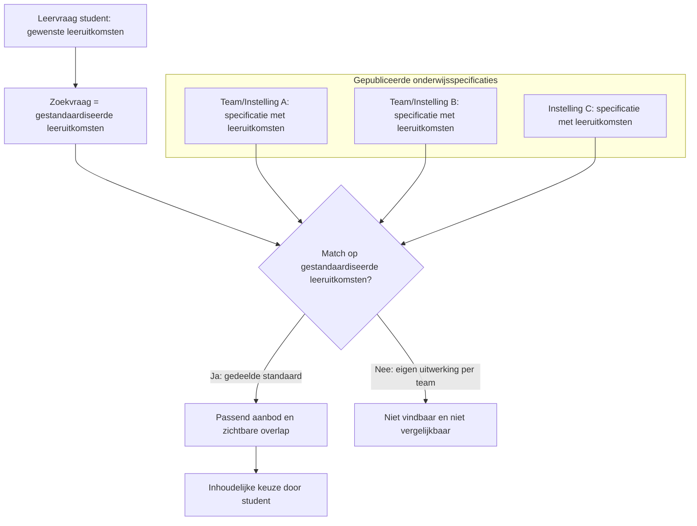
```mermaid
flowchart TB
  leervraag["Leervraag student: gewenste leeruitkomsten"]
  query["Zoekvraag = gestandaardiseerde leeruitkomsten"]
  leervraag --> query

  subgraph aanbieders["Gepubliceerde onderwijsspecificaties"]
    teamA["Team/Instelling A: specificatie met leeruitkomsten"]
    teamB["Team/Instelling B: specificatie met leeruitkomsten"]
    teamC["Instelling C: specificatie met leeruitkomsten"]
  end

  query --> match{"Match op gestandaardiseerde leeruitkomsten?"}
  teamA --> match
  teamB --> match
  teamC --> match

  match -->|"Ja: gedeelde standaard"| passend["Passend aanbod en zichtbare overlap"]
  passend --> keuze["Inhoudelijke keuze door student"]
  match -->|"Nee: eigen uitwerking per team"| geenMatch["Niet vindbaar en niet vergelijkbaar"]
```

**De vereiste standaard schaalt mee met het scenario.** Hoe groter de organisatorische en geografische reikwijdte (§3.3.2.4), hoe hoger het noodzakelijke standaardisatieniveau van leeruitkomsten. De instelling kiest dat niveau **bewust**, op basis van het scenario waarin ze wil opereren:

| Scenario (§3.3.2.4) | Benodigd standaardisatieniveau leeruitkomsten | Zonder die standaard |
| --- | --- | --- |
| **A. Kleine instelling, één locatie** | Lokaal/instellingsbreed | Intern niet herbruikbaar of vindbaar |
| **B. Fusie-instelling, meerdere locaties** | Instellingsbreed, over locaties heen | Locaties leveren onvergelijkbaar aanbod |
| **C. Samenwerkende instellingen** | Gedeeld/regionaal afgesproken | Geen cross-instelling matching of erkenning |
| **D. Landelijk gespreid / sectorbreed** | Landelijk (bv. CompetentNL, hoofdstuk 4) | Geen landelijke vindbaarheid of erkenning |

Kortom: leeruitkomsten zijn zowel de **uitwisselsleutel** (probleem 1) als de **zoeksleutel** (probleem 2) van de keten. *Landelijk* opereren vergt een **landelijke** standaard, *regionaal samenwerken* een **regionale**, en puur *lokaal* aanbod een **lokale** — maar in alle gevallen geldt: zonder gestandaardiseerde leeruitkomsten geen betrouwbare uitwisseling én geen inhoudelijke vindbaarheid. Dit is de directe motivatie voor de gestandaardiseerde `educationSpecification` en `learningOutcomes` uit [§7 (cross-instelling interoperabiliteit)](#7-cross-instelling-interoperabiliteit).

**Stap 2 — Planbaar aanbod (fase 2).** Hier ontstaat het eerste object dat §12.5 nog niet op attribuutniveau gaf.

| Gegevensgroep | Attributen (minimaal) | Toelichting |
| --- | --- | --- |
| Identificatie & herkomst | `id`, `basedOnSpecification` (ref), `version`, `status` | Aanbod is **afgeleide** van een specificatie, geen kopie. |
| Tijd & capaciteit | `academicSession`/`period`, `capacity`, `minParticipants`, `enrolmentWindow` | `minParticipants` is de **animodrempel** uit §3.3.2.5. |
| Planbaarheid | `plannableConstraints` (expertise, ruimtetype, faciliteit, volgorde) | Aggregaat uit de specificatie; voedt de CSP. |
| Organisatie/locatie (stap 0) | `offeringOrganisation`, `offeringLocation`, `deliveryMode` | Maakt locatie-/organisatie-pooling mogelijk. |
| Signalering | gaten → §9 | bv. ontbrekende `minParticipants` → onbepaalbare drempel. |

**Stap 3 — Geroosterd aanbod: `leergelegenheid` / `lesgelegenheid` (fase 4).** Dit is een **ontbrekend later-fase-object** dat leerroute 2 expliciet nodig heeft (deelname per gelegenheid, alternatieve slots).

| Gegevensgroep | Attributen (minimaal) | Toelichting |
| --- | --- | --- |
| Identificatie & herkomst | `id`, `basedOnOffering` (ref), `status` | Gelegenheid = concretisering van planbaar aanbod. |
| Tijd & plaats | `timeSlot` (start/eind), `room` (instelling-eigen), `locationRef` | Concreet slot; `room` blijft instelling-specifiek (§7). |
| Inzet | `teacherAssignment` (ref Persoon, intern), `expectedParticipants` | Concrete docent is instelling-eigen. |
| Alternatieven | `alternativeOccasionRefs` | Maakt Larissa's *alternatief tijdslot* expliciet. |
| Aanwezigheid | `attendanceListRef` | Koppeling naar aanwezigheidsregistratie. |

**Stap 4 — Verbintenis: aanmelding → inschrijving (fasen 3, 6).** Het object dat de student aan aanbod/gelegenheid bindt; mapt later op OEAPI `Association`.

| Gegevensgroep | Attributen (minimaal) | Toelichting |
| --- | --- | --- |
| Identificatie | `id`, `personRef`, `offeringRef`/`occasionRef` | Wie, op welk aanbod of welke gelegenheid. |
| Niveau (scope) | `scope` (`opleiding`/`programma`/`onderwijseenheid`/`lesgelegenheid`) | Leerroute 2 voegt deelname op **`lesgelegenheid`** toe. |
| Status | `state` (`aangemeld`/`ingeschreven`/`bezig`/`afgerond`/`geannuleerd`) | Conform §3.2.4; aanmelding (SKS) → inschrijving (planning) zodra passend. |
| Governance | `approvedBy` (SLB, ref), `validFrom`/`validUntil` | Larissa's cross-opleiding vereist **SLB-goedkeuring**. |
| Organisatie/locatie (stap 0) | `homeOrganisation`, `hostOrganisation`, `locationRef`, `recognitionBasis` | Bij grensoverschrijding: erkenningsgrond (§7). |

**Stap 5 — Resultaat: `onderwijsverbintenis-resultaat` (fasen 5, 8).** Sluit de keten en levert terug aan `homeOrganisation`.

| Gegevensgroep | Attributen (minimaal) | Toelichting |
| --- | --- | --- |
| Identificatie & herkomst | `id`, `associationRef` | Resultaat hangt aan een verbintenis. |
| Inhoud | `outcomeRefs` (`Leeruitkomst`/`Lesuitkomst`), `value`/`assessmentStatus` | Formatief en/of summatief (§3.2). |
| Vaststelling | `assessedBy`, `state` (`voorlopig`/`vastgesteld`), `credentialDocumentRef` | Summatieve vaststelling bij examencommissie (host levert feit, home erkent). |
| Organisatie/locatie (stap 0) | `producedByOrganisation`, `recognizedByOrganisation` | Wie produceerde, wie erkent (cross-instelling). |

> **Traceerbaarheid.** Deze vijf stappen vormen samen de attribuutketen `specificatie → planbaar aanbod → geroosterd aanbod → verbintenis → resultaat`, telkens met de **organisatie/locatie-scoping** uit stap 0. Daarmee is dit de directe **leg-up** naar §12.2 (wat wordt waar uitgewisseld) en de berichtspecificatie-stap van AMIGO (§2.4). Ontbrekende of dubbelzinnige attributen worden als **signalering** (§9) geregistreerd, niet hier opgelost.

##### 3.3.2.7 Randvoorwaarden — negen concern-dimensies

Per dimensie kort wat besloten, geregeld of beschikbaar moet zijn voordat leerroute 2 (met locatie-/organisatiecomplexiteit) uitvoerbaar is.

| Dimensie | Randvoorwaarde voor leerroute 2 |
| --- | --- |
| **Business** | Maatwerk-uitval mag de kwalificatie niet in gevaar brengen; waarde = diploma halen ondanks beperkte beschikbaarheid. |
| **Strategy** | Bestuurlijke keuze om temporiseren/personaliseren *by design* te faciliteren (niet alleen incidenteel). |
| **Motivation** | Toegankelijkheid en studeerbaarheid voor (top)sporters/maatwerkstudenten als expliciete driver. |
| **Beleid** | OER met variabele examenmomenten en diploma-uitreikmomenten; beleid voor cross-opleiding/host-deelname en SLB-goedkeuring. |
| **Organisatie** | SLB met regie-mandaat; afstemming tussen opleidingsteams en (centrale) onderwijslogistiek; bij vorm C/D samenwerkingsovereenkomst. |
| **Proces** | Animo-/vraagdetectie vóór de periode; pooling-proces; individuele examenplanning; herplanlus (fase 6–7). |
| **Informatie** | Organisatie/locatie-scoping op alle objecten; `curriculumType`; deelname op `lesgelegenheid`-niveau. |
| **Data** | Stabiele identifiers voor organisatie/locatie/aanbod; referenties i.p.v. kopieën; erkenningsgrond vastgelegd. |
| **Systeem** | OC als (federatief) distributiepunt; SKS dat deelname/alternatieven faciliteert; planning/rooster dat locatie- en host-constraints aankan; §7-koppelvlak bij grensoverschrijding. |

##### 3.3.2.8 Informatiestromen en AMIGO-voorloper

**Beeld/verwijzing.** Het procesbeeld staat in de ArchiMate-view [*Onderwijsvisie vertalen naar onderwijsaanbod*](img/archimate-view-onderwijsvisie-vertalen-naar-onderwijsaanbod-basis-model-v20260626.jpg); een leerroute-2-specifieke informatiestromenplaat (analoog aan die van leerroute 1) volgt als afgeleide. De latere fases op die plaat worden aangevuld met de objecten uit §3.3.2.6 (geroosterd aanbod, verbintenis, resultaat) inclusief organisatie/locatie-scoping.

**Gegevensanalyse (kader).** Producerend → consumerend, met de minimale referenties uit §3.3.2.6: specificatie (CO → OC) → planbaar aanbod (Planning → OC) → geroosterd aanbod (Rooster → OC) → verbintenis (SKS → Planning → KRS) → resultaat (uitvoering/examen → SVS, terug naar `homeOrganisation`). Semantiek die **niet** mag vervagen: het verschil tussen `homeOrganisation` en `hostOrganisation`, en tussen `scope`-niveaus van de verbintenis.

**Interactieanalyse (kader).** Nieuw t.o.v. de route-1-baseline zijn: (1) **deelname-mutaties per `lesgelegenheid`** (student via SKS, met SLB-goedkeuring); (2) **cross-opleiding/host-plaatsing** (home ↔ host via OC + verbintenis); (3) **pooling-signalen** (animo/vraag) richting planning. Publish/event/pull worden pas in de AMIGO-vervolgstap (§2.4) hard gemaakt.

**Doorverwijzing AMIGO.** Deze gegevens- en interactieanalyse voedt in een volgende iteratie **technologiekeuze → berichtspecificatie → interfacespecificatie → afsprakenset**. Dit hoofdstuk blijft bewust op analyse-niveau (skill-leesregel), met §12.2 en §12.5 als brug naar attribuut- en uitwisseldetails.

##### 3.3.2.9 Concept informatiemodel — geneste onderwijsspecificatie (delta t.o.v. LR1)

Larissa volgt *Software Developer* (BOL, mbo-4, **indicatief**) en temporiseert *by design*. Het waardevolle inzicht van leerroute 2 is dat de **boomstructuur identiek** is aan die van leerroute 1 (Jochem, zie het [concept informatiemodel bij §3.2.1.1](#concept-informatiemodel--geneste-onderwijsspecificatie-jochem-apothekersassistent)): dezelfde niveaus (opleiding → programma → onderwijseenheid → leeronderdeel → lessenreeks → les) en dezelfde ankertabel-families. **Alleen een beperkte set attributen verandert.** Die markeren we hieronder met `Δ`; alles zónder `Δ` blijft gelijk aan de reguliere baseline.

**Fase 1–2 — delta in het grofmazige ontwerp.** De temporiseer-variant komt als **track** naast het reguliere programma; de structuur eronder is ongewijzigd.

```text
OPLEIDINGSSPECIFICATIE = Software Developer (BOL, mbo-4, indicatief)
  Δ curriculumtype: hybride                    (LR1: nominaal)
|
+-- OPLEIDINGSPROGRAMMA-SPECIFICATIE = BOL - regulier          (diplomaprogramma, = LR1)
|
+-- OPLEIDINGSPROGRAMMA-SPECIFICATIE = BOL - track "Temporiseren"  (diplomaprogramma)
|   Δ programmastructuur: track van hetzelfde programma
|   Δ leerroutetype: getemporiseerd            (LR1: regulier)
|   Δ curriculumtype: hybride
|   |
|   +-- ONDERWIJSEENHEID-SPECIFICATIE = Blok B1-K1 "Realiseert software" (indicatief)
|   |     dektLeeruitkomsten / leervorm / expertiseprofielen: = LR1 (ongewijzigd)
|   |   |
|   |   +-- LEERONDERDEEL-SPECIFICATIE = B1-K1-W1 "Ontwerpt software" (indicatief)
|   |         tijdsverdeling: BOT 60 / OOT 40 SBU   (zelfde BOT/OOT-totaal als LR1)
|   |         Δ spreidingspatroon: OOT gespreid over meer weken (topsport-agenda)
|   |         Δ (triggert planning-constraints in fase 2/4: niet voor 10:00;
|   |            geblokkeerde toernooi-/kampdagen; mogelijke hele-periode-blokkade Spelen)
|   |
|   +-- ONDERWIJSEENHEID-SPECIFICATIE = Generieke onderdelen (o.a. Engels niv.4)
|         Δ bij cross-opleiding: thuisorganisatie / gastorganisatie + locatieverwijzing
|            wanneer Engels bij een ander team/instelling loopt (zie §3.3.2.4 en §7)
|
+-- OPLEIDINGSPROGRAMMA-SPECIFICATIE = Keuzedelen   (zelfstandig programma | OEAPI: Programme)
      koppeling: N:M-gekoppeld aan de diplomaprogramma's (§17.3)
      keuzeruimte: 720 SBU (mbo-4) | keuzeBeschikbaar: ja
      +-- ONDERWIJSEENHEID-SPECIFICATIE = Keuzedeel "Voorbereiding hbo-ict"  (indicatief)
      +-- ONDERWIJSEENHEID-SPECIFICATIE = Keuzedeel "Cybersecurity basis"    (indicatief)
```

**Fase 4 — delta in de detaillering.** De **specificatie** van lessenreeks en les verandert niet; het verschil zit in **aanbod** en **verbintenis**: deelname op gelegenheidsniveau en alternatieve slots.

```text
LEERONDERDEEL-SPECIFICATIE = B1-K1-W1 (track "Temporiseren")
|
+-- LESSENREEKS = "..."   Δ spreidingspatroon: langer venster, herhaalde/alternatieve gelegenheden
|   |
|   +-- LESSPECIFICATIE = Les n   (specificatie-inhoud = LR1; delta zit in aanbod/verbintenis:)
|         Δ bereik: lesgelegenheid   (deelname per lesgelegenheid, i.p.v. alleen per eenheid)
|         Δ alternatieveGelegenheden: student bindt zich aan een alternatief tijdslot
```

> **Kernpunt (skill-conform).** De **structuur en semantiek** van de onderwijsspecificatie veranderen niet t.o.v. leerroute 1 — dezelfde objecten, dezelfde ankertabel-families (§3.2.6). Wat verschuift zit in **sturing** en een handvol **attributen** op leeronderdeel-/gelegenheidsniveau: `spreidingspatroon`, planning-constraints (beschikbaarheid), `bereik` en `alternatieveGelegenheden`, en bij grensoverschrijding `thuisorganisatie`/`gastorganisatie` + `locatieverwijzing`. Attribuutdetails staan in §3.3.2.6, de organisatievormen in §3.3.2.4, en het cross-instelling-patroon in §7.

#### 3.3.3 Leerroute 3 — Versnellen (standaard route) (TO-DO)

**Kern**: de student rondt sneller af door vrijstellingen/EVC, hogere intensiteit of het overslaan van onderdelen.  
**Implicatie**: toetsing kan onafhankelijk(er) van deelname nodig zijn; planning moet kleine groepen en afwijkende paden kunnen dragen.

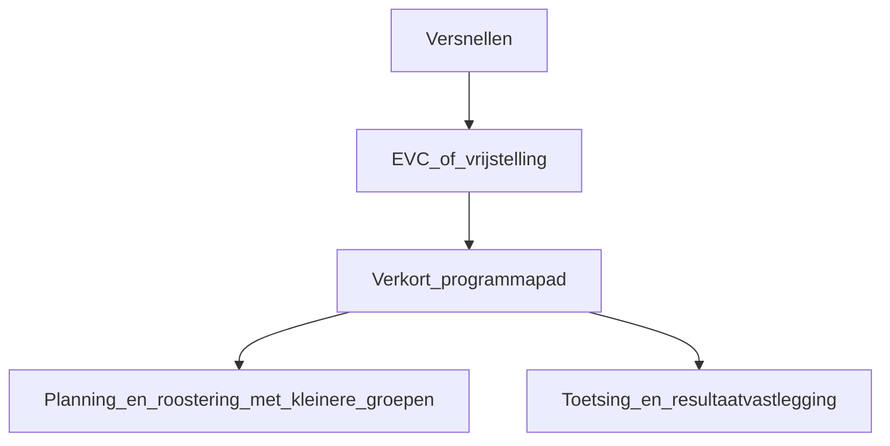
```mermaid
flowchart TD
  route3[Versnellen] --> vrijstelling[EVC_of_vrijstelling]
  vrijstelling --> verkortPad[Verkort_programmapad]
  verkortPad --> planning3[Planning_en_roostering_met_kleinere_groepen]
  verkortPad --> toets3[Toetsing_en_resultaatvastlegging]
```

#### 3.3.4 Leerroute 4 — Binnen de instelling (personaliseren diplomaroute) (TO-DO)

**Kern**: de student personaliseert binnen één instelling (combineren/overlap tussen opleidingen of trajecten).  
**Implicatie**: hergebruik van onderdelen en het voorkomen van dubbel volgen; planning/roostering op overlap en conflicten.

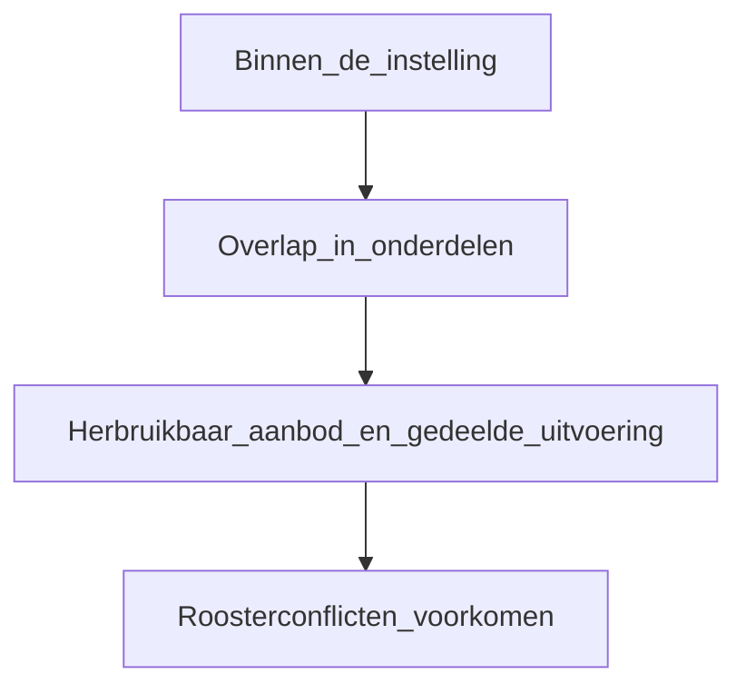
```mermaid
flowchart TD
  route4[Binnen_de_instelling] --> overlap[Overlap_in_onderdelen]
  overlap --> aanbod4[Herbruikbaar_aanbod_en_gedeelde_uitvoering]
  aanbod4 --> rooster4[Roosterconflicten_voorkomen]
```


```mermaid
sequenceDiagram
  participant kwalificatiekader as Kwalificatiekader
  participant teamA as Onderwijsteam A
  participant teamB as Onderwijsteam B

  kwalificatiekader->>teamA: hetzelfde kwalificatiekader ontvangen
  kwalificatiekader->>teamB: hetzelfde kwalificatiekader ontvangen

  teamA->>teamA: Vertaal naar onderwijsspecificatie volgens eigen onderwijskundig proces
  teamB->>teamB: Vertaal naar onderwijsspecificatie volgens eigen onderwijskundig proces

  teamA-->>teamB: Onderwijsspecificatie A uitwisselen
  Note over teamB: Structuur en betekenis sluiten niet aan
  teamB--xteamA: Niet goed te begrijpen / niet goed te hergebruiken

  teamB-->>teamA: Onderwijsspecificatie B uitwisselen
  Note over teamA: Zelfde probleem in omgekeerde richting
  teamA--xteamB: Geen betrouwbare interne uitwisseling
```

SOLL situatie:
Delta: leeruitkomsten sectoroversteigend gestandaardiseerd. Basis voor alle onderwijsspecificaties.

`TO-DO: Rapport van Hans Kok op ontsluiten onderwijs aanbod rapportage benoemen en meenemen en principes mappen op ons document en voorgestelde aanpak`. 


```mermaid
flowchart TB
  subgraph onderwijsontwerperVooraf["Onderwijsontwerper (vooraf)"]
    analyseerKwalificatiekader["Analyseren Kwalificatie kader (Kwalificatiedossier/CROHO/CREBO/Keuzedelen)"]
    kwalificatieKader(("Kwalificatie, Kerntaken, Werkprocessen"))
    onderwijskundigeTaxonomieToepassen["Binnen INSTELLING gestandaardiseerde Onderwijskundig taxonomisch proces toepassen op kwalificatie, kerntaken en werkprocessen"]
    leeruitkomsten(("Sector oversteigende gestandaardiseerde Leeruitkomsten"))
    beschrijfOpleidingsspecificatie["Opleidingsspecificatie beschrijven (Grofmazig ontwerp) op basis van LEERUITKOMSTEN (nominaal programma + keuzedeelruimte)"]
    instantieerOnderwijsspecificaties["Onderwijsspecificaties instantiëren op basis van LEERUITKOMSTEN en koppelen aan opleidingspecificatie"]
    publiceerOpleidingsspecificatie["Opleidingsspecificatie met onderliggende onderwijsspecificaties publiceren"]
    beschrijfToetsvormen["Toetsvorm(en) beschrijven"]
  end

  subgraph onderwijsontwikkelaar["Onderwijsontwikkelaar"]
    detailleerOnderwijsspecificaties["Onderwijsspecificaties beschrijven en detailleren (fijnmazige onderwijsontwikkeling)"]
    detailleerLeergelegenheid["Leergelegenheid instantiëren,  beschrijven en detailleren"]
    beschrijfToetsspecificatie["Toetsspecificatie op basis van toetsvorm beschrijven"]
  end

  subgraph plannerInstelling["Planner (instelling)"]
    bepaalHaalbaarheid["Haalbaarheid bepalen (mensen en middelen, alle opleidingen)"]
    maakPlanbaarAanbod["Planbaar aanbod maken (periodes, capaciteit, groepen) (incl. examengelegenheid)"]
  end

  subgraph studentOrientatie["Student"]
    orienteerOpGeplandAanbod["Orienteren (op opleidingsspecificatie + gepland aanbod + keuzedeelaanbod)"]
    meldAanOpGeplandAanbod["Aanmelden op gepland aanbod"]
  end

  subgraph slbEnStudent["StudieLoopbaanBegeleider + Student"]
    voerIntakeUit["Intake"]
    kiesOpleidingEnProgramma["Opleiding en opleidingsprogramma kiezen"]
    momentKeuzedeelBeleid{"Instellingsbeleid: moment keuzedeel-aanmelding?"}
    legKeuzedeelVoorkeurslijst["Geprioriteerde keuzedeel-voorkeurslijst samenstellen"]
    meldAanKeuzedeel["Aanmelden keuzedeel (periode en onderwijslocatie per prioriteit)"]
    legKeuzedeelAanmeldingIntake["Keuzedeel-aanmelding bij intake vastleggen (definitief)"]
    legKeuzedeelAanmeldingVoorlopig["Keuzedeel-aanmelding bij intake vastleggen (voorlopig)"]
    aanmeldingKeuzedeel(("Aanmelding keuzedeel"))
    passendKeuzedeelAanbod{"Passende combinatie keuzedeel, periode en locatie?"}
    inschrijvingKeuzedeel(("Inschrijving keuzedeel"))
  end

  subgraph roosteraar["Roosteraar"]
    roosterAanbod["Roosteren"]
    geroosterdAanbod(("Geroosterd Aanbod - Leergelegenheid (reeks aan lessen)"))
    schrijfInOpGeroosterdAanbod["Inschrijven student en docent op geroosterd aanbod"]
    inschrijvingGeroosterdAanbod(("Inschrijving student en docent op geroosterd onderwijsaanbod (waaronder examengelegenheid)"))
  end

  subgraph docent["Docent"]
    voerOnderwijsUit["Onderwijs Uitvoeren"]
    planToetsgelegenheidTijdensLes["Toetsgelegenheid plannen tijdens geroosterde lessen"]
    toetsStudent["Toetsen"]
    houdFormatieveVoortgangBij["Formatieve voortgang student bijhouden"]
  end

  subgraph studentUitvoering["Student"]
    volgOnderwijs["Onderwijs volgen"]
    volgToetsgelegenheid["Toetsgelegenheid volgen"]
    volgExamengelegenheid["Examengelegenheid volgen"]
  end

  subgraph examinator["Examinator"]
    bereidExamengelegenheidVoor["Geplande examengelegenheid voorbereiden"]
    voerExamengelegenheidUit["Examengelegenheid uitvoeren/begeleiden"]
  end

  subgraph examenbeoordelaar["Examenbeoordelaar"]
    beoordeelGemaaktExamen["Door student gemaakt examen beoordelen"]
  end

  subgraph examencommissieVaststelling["Examencomissie"]
    stelExamenbeoordelingVast["Examen beoordeling vaststellen"]
    kwalificeerEnDiplomeer["Kwalificeren en Diplomeren op basis van LEERUITKOMSTEN"]
    kwalificeringEnDiplomering(("Kwalificering, certificering en diplomering op basis van LEERUITKOMSTEN"))
  end

  subgraph examencommissieOntwerp["Examencommissie"]
    examenplan(("Examenplan"))
    examenspecificaties(("Examenspecificatie(s)"))
    examenInstrumenten(("Examen Instrument(en)"))
    stelExamenplanEnSpecificatiesOp["Opstellen Examenplan en examen specificaties op basis van LEERUITKOMSTEN"]
    bepaalBenodigdeExamenInstrumenten["Bepalen benodigde examen instrumenten"]
    bepaalBenodigdExamenMateriaal["Bepalen Benodigd Examen materiaal"]
    besluitInkopenOfConstrueren["Besluiten inkopen of construeren"]
    koopExamenInstrumentenIn["Inkopen Examen instrumenten"]
    construeerExamenInstrumenten["Construeren Examen instrumenten"]
    stelExamenspecificatieEnInstrumentenVast["Vaststellen examen specificatie, examenmateriaal en examen instrumenten"]
  end

  grofmazigeSpecificaties(("Grofmazige Opleidings- / onderwijs- en examenspecificaties"))
  planbaarOnderwijsaanbod(("Planbaar Onderwijsaanbod (incl. examengelegenheid)"))
  aanmeldingGeplandAanbod(("Aanmelding voor Opleiding en gepland aanbod"))
  inschrijvingGeplandAanbod(("Inschrijving op geplande opleidings- en opleidingsprogramma aanbod"))
  onderwijsresultaat(("Onderwijsresultaat op basis van LEERUITKOMSTEN"))

  leeruitkomsten --> stelExamenplanEnSpecificatiesOp
  stelExamenplanEnSpecificatiesOp --> examenplan
  stelExamenplanEnSpecificatiesOp --> examenspecificaties
  examenspecificaties --> bepaalBenodigdeExamenInstrumenten
  bepaalBenodigdeExamenInstrumenten --> bepaalBenodigdExamenMateriaal --> besluitInkopenOfConstrueren
  besluitInkopenOfConstrueren --> koopExamenInstrumentenIn
  besluitInkopenOfConstrueren --> construeerExamenInstrumenten
  koopExamenInstrumentenIn --> examenInstrumenten
  construeerExamenInstrumenten --> examenInstrumenten
  examenInstrumenten --> stelExamenspecificatieEnInstrumentenVast
  stelExamenspecificatieEnInstrumentenVast --> grofmazigeSpecificaties

  examenplan --> bepaalHaalbaarheid
  analyseerKwalificatiekader --> kwalificatieKader --> onderwijskundigeTaxonomieToepassen --> leeruitkomsten --> beschrijfOpleidingsspecificatie --> instantieerOnderwijsspecificaties --> beschrijfToetsvormen --> publiceerOpleidingsspecificatie --> grofmazigeSpecificaties
  grofmazigeSpecificaties --> bepaalHaalbaarheid --> maakPlanbaarAanbod --> planbaarOnderwijsaanbod
  planbaarOnderwijsaanbod --> detailleerOnderwijsspecificaties --> detailleerLeergelegenheid --> beschrijfToetsspecificatie --> inschrijvingGeplandAanbod
  planbaarOnderwijsaanbod --> orienteerOpGeplandAanbod --> meldAanOpGeplandAanbod --> aanmeldingGeplandAanbod
  aanmeldingGeplandAanbod --> voerIntakeUit --> kiesOpleidingEnProgramma --> momentKeuzedeelBeleid
  momentKeuzedeelBeleid -->|Keuzedeelruimte nadert| legKeuzedeelVoorkeurslijst --> meldAanKeuzedeel --> aanmeldingKeuzedeel
  momentKeuzedeelBeleid -->|Bij intake, definitief| legKeuzedeelAanmeldingIntake --> aanmeldingKeuzedeel
  momentKeuzedeelBeleid -->|Bij intake, voorlopig| legKeuzedeelAanmeldingVoorlopig --> aanmeldingKeuzedeel
  aanmeldingKeuzedeel --> passendKeuzedeelAanbod
  passendKeuzedeelAanbod -->|Ja| inschrijvingKeuzedeel --> inschrijvingGeplandAanbod
  passendKeuzedeelAanbod -->|Nee: keuzedeelruimte oningevuld| inschrijvingGeplandAanbod
  kiesOpleidingEnProgramma --> inschrijvingGeplandAanbod
  inschrijvingGeplandAanbod --> roosterAanbod --> geroosterdAanbod --> schrijfInOpGeroosterdAanbod --> inschrijvingGeroosterdAanbod
  inschrijvingGeroosterdAanbod --> voerOnderwijsUit
  voerOnderwijsUit --> planToetsgelegenheidTijdensLes --> toetsStudent --> houdFormatieveVoortgangBij --> voerOnderwijsUit
  inschrijvingGeroosterdAanbod --> volgOnderwijs --> volgToetsgelegenheid --> volgExamengelegenheid --> volgOnderwijs
  volgToetsgelegenheid --> onderwijsresultaat
  toetsStudent --> onderwijsresultaat
  maakPlanbaarAanbod --> volgExamengelegenheid --> voerExamengelegenheidUit
  maakPlanbaarAanbod --> bereidExamengelegenheidVoor --> voerExamengelegenheidUit
  voerExamengelegenheidUit --> beoordeelGemaaktExamen --> stelExamenbeoordelingVast --> onderwijsresultaat --> kwalificeerEnDiplomeer --> kwalificeringEnDiplomering

  class kwalificatieKader,geroosterdAanbod,inschrijvingGeroosterdAanbod,grofmazigeSpecificaties,planbaarOnderwijsaanbod,aanmeldingGeplandAanbod,inschrijvingGeplandAanbod,aanmeldingKeuzedeel,inschrijvingKeuzedeel,onderwijsresultaat,examenplan,examenspecificaties,examenInstrumenten,kwalificeringEnDiplomering yellowNode

  classDef freeze fill:#fff3cd,stroke:#b38f00,stroke-width:2px,color:#111
  class kiesOpleidingEnProgramma freeze

```


##### Persoon, rollen en skills als denkraam voor constraints

Naast de onderwijsdata die elders in dit document wordt gemodelleerd, is voor **planning en roostering** (§ *Het plan en rooster proces*) een **complementair denkpatroon** nodig dat direct met **mensen** en **wat zij kunnen en willen** werkt. In dat denkpatroon is elke **`Persoon`** — **student** of **medewerker** — iemand met **skills**: een samenstel van **vaardigheden**, **kennis** en **inzichten** (inclusief formele bevoegdheden waar dat speelt). Bij **instroom** heeft een student typisch al een skill-profiel en een **leerwens**: welke skills hij of zij verder wil **ontwikkelen** binnen de gekozen **leerroute** en de scenario's die daarbij horen. Een **medewerker** heeft evenzo een skill-profiel, uitgedruikt via **functie en titel** (docent, SLB'er, praktijkbegeleider, examinator, …): die titels zijn **koppelvlakken** naar HR en contract, maar **inhoudelijk** gaat het om **welk skill-pakket** iemand kan **aanbieden** in onderwijs, begeleiding, praktijk of examen.

**Skill-vraag en skill-aanbod.** Groepen zijn in dit denkpatroon **clusters van personen** die qua skill-vector op elkaar lijken of dezelfde **aan te bieden** onderwijs- of begeleidingsbehoefte delen. Tegelijk zoekt de instelling naar het **snijpunt** van (a) **skill-vraag** — wat moet deze populatie **kunnen** na het traject — en (b) **skill-aanbod** — welke medewerkers en welke leer- en praktijkomgeving kunnen dat **leveren**. Dat snijpunt is direct te vertalen naar **harde en zachte constraints** in een CSP: harde grenzen (bevoegdheid ontbreekt, geen docent beschikbaar, zaal te klein) en zachte voorkeuren (vaste teamdag, voorkeurdocent, spreiding SLB).

**Reële wereld en strategie.** Daarbovenop liggen constraints die niet “in het hoofd” van één persoon zitten maar de **realiteit van de instelling** vormen: **beperkte tijd** (roosteruren, openingstijden, BPV-vensters), **beperkt geld en capaciteit** (FTE, vervanging, materiaal, collegegeld- of bekostigingskaders), **facilitaire grenzen** (aantal werkplaatsen, labtypes, reisafstand), en **strategische doelen** (doorstroom, inclusie, werkveldafspraken). Die vlakken bepalen **wat er überhaupt in het model mag** voordat een planner of roosteraar een CSP draait.

**Planning en roostering.** Binnen die totale constraintset voeren **planning** en **roostering** het zoeken naar haalbare toewijzingen uit (zie *Voor wie dieper wil: CSP, NP-Hard en controle* en het cyclische plandiagram): variabelen en domeinen komen uit **tijd en ruimte**, **skill-match**, en **populatie-clusters**; planners en roosteraars wegen zachte constraints en beleidsafwegingen. *Groep* leest hier vooral als **skill-groepering en inschrijf-/cohortrealiteit**, *cap* als **tijd/middelen/facilitair**, *beleid* als **strategie en regels**.

| **Hoofdtype `Persoon`** | **Rol of functietitel (voorbeelden; koppelbaar aan HR)** | **Skills-profiel** (vaardigheden, kennis, inzichten; bevoegdheden waar van toepassing) | **Als constraint geformuleerd** (skill-vraag / skill-aanbod; typisch plan vs rooster) |
| --- | --- | --- | --- |
| **Student** | student / deelnemer aan programma | **Startsituatie** bij instroom; **leerdoelen** als gewenste skill-ontwikkeling binnen leerroute en scenario | **Skill-vraag:** welke skills moeten in het traject **worden opgebouwd**; groeperen in cohort of werkgroep met vergelijkbare vraagvector; harde grenzen uit examen- en opleidingsregels (**Plan**); max. belasting per dag/week (**Rooster**) |
| **Medewerker** | docent (theorie/praktijk), teamcoördinator | vakinhoud, didactiek, toets- en beoordelingsbekwaamheid | **Skill-aanbod:** welke onderwijs- en toetsmomenten kunnen worden bemand; matching met gevraagde leeruitkomst-skills; **beschikbaarheid** en max. uren (**Rooster**); teamspreiding (**Plan**, zacht) |
| **Medewerker** | SLB'er, studiecoach | coachende vaardigheden, route-inzicht, signalering, verwijzen | **Skill-aanbod:** begeleidingscapaciteit (caseload); **zacht:** voorkeurskoppeling met studentgroep; tijdvensters naast lesrooster (**Rooster**) |
| **Medewerker** | praktijkbegeleider, BPV-begeleider | werkveldkennis, praktijkassessment, veiligheid, werkpleknorm | **Skill-aanbod:** uren en trips naar werkveld; **reële wereld:** reis- en clusterafspraken met bedrijven; beperkte parallelle BPV-plaatsen (**Plan** + **Rooster**) |
| **Medewerker** | examinator, surveillant, afnemer, tweede corrector | examenbekwaamheid, integriteit, correctie-inzicht | **Skill-aanbod:** piek rond examenperiodes; verhouding surveillanten/kandidaten; geen belangenverstrengeling (**Rooster**, deels harde regel) |
| **Medewerker** | onderwijsondersteuning, facilitair, ICT-ondersteuning | operationele skills (materiaal, digitaal, logistiek) | **Skill-aanbod:** beschikbaarheid voor opbouw en ondersteuning; koppeling aan zaal- en middelen-constraints (**Plan** / **Rooster**) |
| **Cluster (aggregaat)** | cohort, werkgroep, team, “pool” | **geaggregeerde** skill-vraag of -aanbod over meerdere personen | **Constraint:** doorsnede van populatie-vraag en beschikbaar aanbod; klassen- of werkgroepsgrootte; minimale teamdekking (**Plan**); conflictvrije slottoewijzing (**Rooster**) |

| **Reële-wereldvlak** | **Voorbeelden van constraints** | **Meest zichtbaar in** |
| --- | --- | --- |
| **Tijd en beschikbaarheid** | lesdagen, vakanties, examenweken, cao-uren, nacht- of weekendbeperkingen, reistijd | **Rooster** (slots); kaders en blokken in **Plan** |
| **Middelen, geld en capaciteit** | FTE-plafonds, vervangingsbudget, materiaal- en licentiebudget, onderhoudsvensters werkplaats | vooral **Plan**; harde grenzen in **Rooster** zodra concreet |
| **Facilitair en materieel** | zaaltypes, werkplaats-capaciteit, veiligheid, AV, inventaris per vak | **Plan** (wat is organiseerbaar) en **Rooster** (concrete toewijzing) |
| **Strategie en beleid** | instroomdoelen, inclusie, werkveldafspraken, kwaliteitsagenda, examenregeling | **beleid**-input in het diagram; vertaalt naar zachte en harde constraints in beide fasen |

**Leeswijzer.** Dit blok **vervangt geen** gegevensmodel uit §3.3.1.2.5: het beschrijft **hoe planners en roosteraars redeneren** over mensen en middelen. Technische koppeling naar registers blijft: **student-`Persoon`** en inschrijfcontext leven typisch in **KRS**; **medewerker-`Persoon`**, contract en basisrol in **HR / identiteit**; skills kunnen als **uitbreiding op het profiel** in die bronnen of in een **aparte competentie- of skillservice** worden bijgehouden — zolang er **één waarheid per feit** blijft. De bronnen *groep*, *cap* en *beleid* in de informatietabel *Persoon, groep en constraint* vangen deze informatie conceptueel.

#### 3.3.5 Leerroute 5 — Buiten de instelling, binnen de sector (personaliseren diplomaroute) (TO-DO)

**Kern**: de student volgt onderdelen bij een andere instelling binnen dezelfde sector.  
**Implicatie**: interoperabiliteit (begrijpen, matchen, erkennen) en zichtbaarheid van capaciteit/aanbod over instellingen heen.

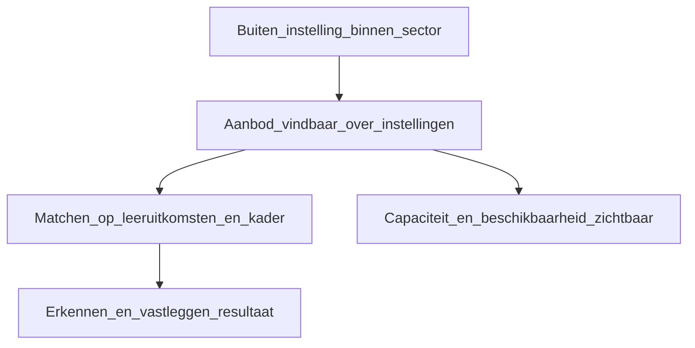
```mermaid
flowchart TD
  route5[Buiten_instelling_binnen_sector] --> vindbaar[Aanbod_vindbaar_over_instellingen]
  vindbaar --> match[Matchen_op_leeruitkomsten_en_kader]
  match --> erkenning[Erkennen_en_vastleggen_resultaat]
  vindbaar --> capaciteit5[Capaciteit_en_beschikbaarheid_zichtbaar]
```

#### 3.3.6 Leerroute 6 — Buiten de instelling, over sectoren heen (personaliseren diplomaroute) (TO-DO)

**Kern**: de student volgt onderdelen over sectoren heen (mbo/hbo/wo).  
**Implicatie**: extra harmonisatie in begrippen, studielast (SBU/ECTS), en erkenning/waardering.

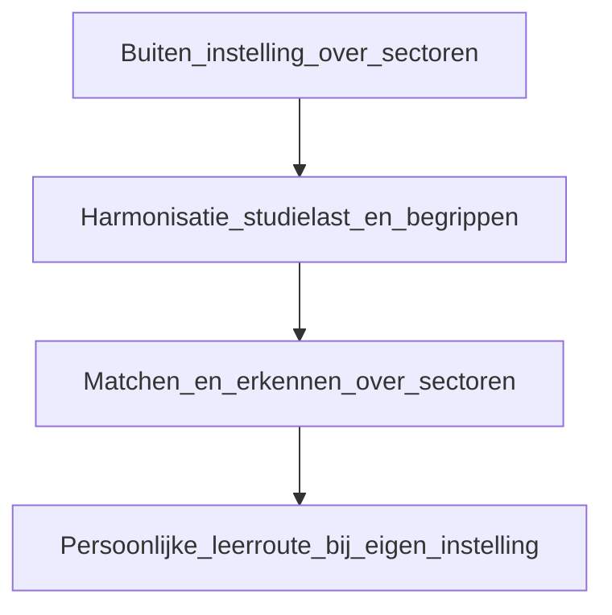
```mermaid
flowchart TD
  route6[Buiten_instelling_over_sectoren] --> harmonisatie[Harmonisatie_studielast_en_begrippen]
  harmonisatie --> match6[Matchen_en_erkennen_over_sectoren]
  match6 --> leerroute6[Persoonlijke_leerroute_bij_eigen_instelling]
```

#### 3.3.7 Leerroute 7 — Vrije keuze (modulair studeren) (TO-DO)

**Kern**: de student kiest losse onderdelen voor ontwikkeling/bijscholing; geen vaste diplomaroute nodig.  
**Implicatie**: aanbod moet fijnmazig en vindbaar zijn; planning/roostering moet omgaan met wisselende vraag.

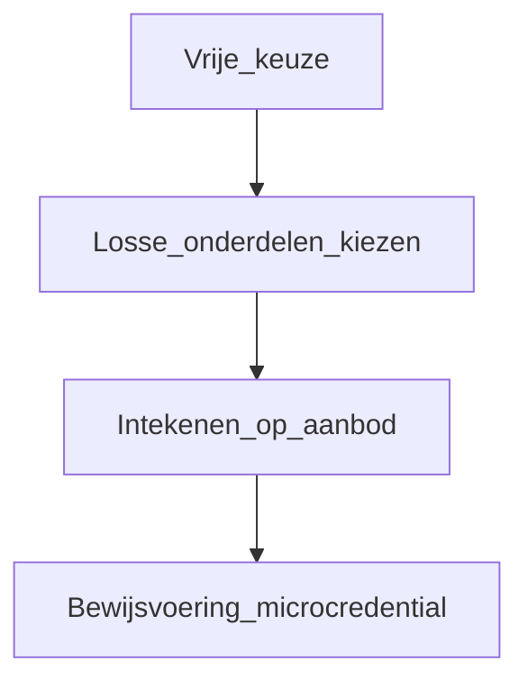
```mermaid
flowchart TD
  route7[Vrije_keuze] --> losseOnderdelen[Losse_onderdelen_kiezen]
  losseOnderdelen --> intekenen7[Intekenen_op_aanbod]
  intekenen7 --> bewijs7[Bewijsvoering_microcredential]
```

#### 3.3.8 Leerroute 8 — Bundelen (modulair studeren) (TO-DO)

**Kern**: de student bundelt losse onderdelen tot een samenhangend pakket rond een thema/rol.  
**Implicatie**: bundelregels en samenhang moeten expliciet gemaakt worden; vraag kan cohort-achtig worden.

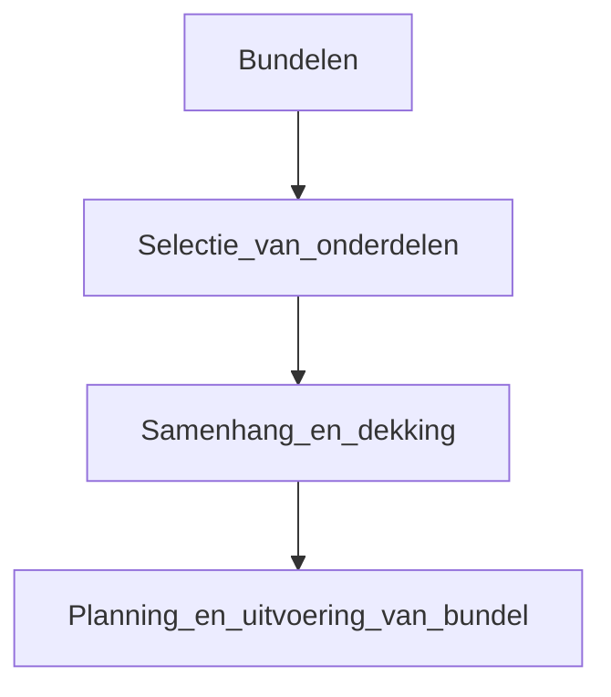
```mermaid
flowchart TD
  route8[Bundelen] --> set8[Selectie_van_onderdelen]
  set8 --> coherentie8[Samenhang_en_dekking]
  coherentie8 --> planning8[Planning_en_uitvoering_van_bundel]
```

#### 3.3.9 Leerroute 9 — Stapelen (modulair studeren) (TO-DO)

**Kern**: de student stapelt onderdelen richting een formeel eindresultaat (bijv. diploma) — eventueel retroactief.  
**Implicatie**: dekking t.o.v. kwalificatiekader en regels voor “wanneer is het diplomawaardig?”.

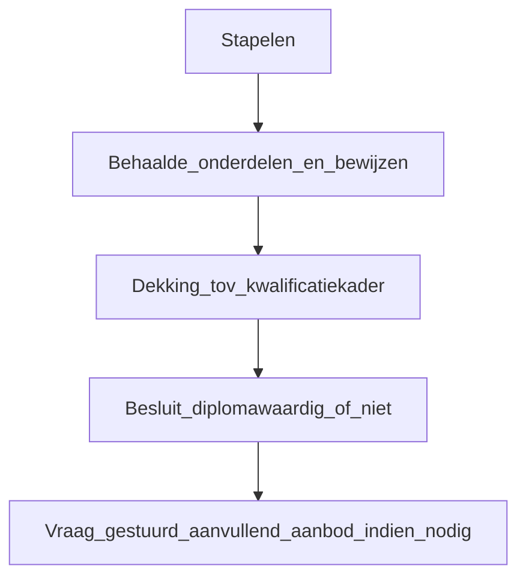
```mermaid
flowchart TD
  route9[Stapelen] --> behaalde[Behaalde_onderdelen_en_bewijzen]
  behaalde --> dekking9[Dekking_tov_kwalificatiekader]
  dekking9 --> besluit9[Besluit_diplomawaardig_of_niet]
  besluit9 --> aanbod9[Vraag_gestuurd_aanvullend_aanbod_indien_nodig]
```


### 3.4 Scenario-uitwerkingen

De concrete gebruikersscenario's per leerroute staan in [scenario-uitwerkingen.md](scenario-uitwerkingen.md).

## Begrippenkader en archief

Het begrippenkader met de zes niveaus, de stadia en de ankertabel staat in [begrippenkader.md](begrippenkader.md). De oudere top-down conceptmodellen en de OEAPI-vertaling staan als bronmateriaal in het [archief](archief-conceptmodellen.md).
