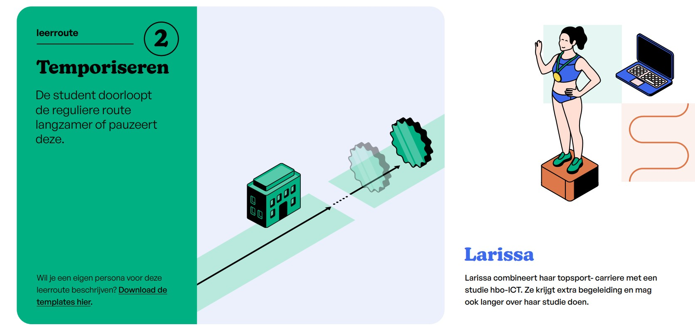

# Persona Larissa

## Student journey

### Oriënteren

Larissa oriënteert zich op een opleiding via de website van de mbo-instelling en socialmediakanalen. Zij bezoekt daarnaast een open dag om een beter beeld te krijgen van de opleiding en de school. Sport & bewegen is populair bij haar teamgenoten, daar wordt de opleiding standaard afgestemd op jonge topsporters. Haar ambitie ligt elders, ze wil niet op een paard wedden en haar affiniteit ligt naast topsport bij ICT. Tijdens de open dag had ze een fijn gesprek met de opleidingscoordinator, die haar vertelde dat het niet vaak voor komt dat een topsporter een ICT opleiding wil volgen. Maar dat het wel mogelijk is om de opleiding, met name rondom haar beperkte beschikbaarheid af te stemmen. Dit overtuigd Larissa.     

### Aanmelden

Larissa meldt zich aan bij mbo-instelling met de juiste vooropleiding. Zij geeft daarbij aan dat haar persoonlijke omstandigheden het lastig maken om een standaard leertraject te volgen, maar dat ze wel absoluut de niveau 4 opleiding software developer BOL wil behalen. 

### Inschrijven

Larissa voert een intakegesprek waarin zij haar situatie toelicht. Ze heeft 3 concrete uitdagingen: 
1. Ze heeft elke ochtend training, waardoor ze niet voor 10u aanwezig kan zijn.
2. Haar sport is blessuregevoelig, wanneer ze tijdens een training geblesseerd raakt wordt ze direct onderzocht en behandeld. Wanneer dit het geval is, kan ze waarschijnlijk de hele dag niet aansluiten. 
3. Deelname aan trainingskampen en toernooien. Larissa heeft jaarlijks 4 grote toernooien en 2 trainingskampen, deze zijn seizoensgebonden (tussen april en oktober) De data zijn vooraf bekend en betekenen concreet dat ze minimaal 4x een donderdag, vrijdag en maandag zal missen. Daarnaast maakt Larissa grote kans op deelname aan de olympische zomerspelen van 2028. Wanneer ze zich daarvoor kwalificeert, krijgt dit alle prioriteit en zal ze in de zomer waarschijnlijk een volledige periode missen.     

Tijdens dit gesprek bespreekt zij met de opleiding hoe haar traject eruit kan zien en in welke mate men een passende oplossing kan bieden. Er worden nog geen concrete beloftes gedaan over de concrete invulling. Door haar roosterbeperkingen wordt het lastig om met een reguliere groep mee te gaan en er per periode bekeken moet worden welke vakken er buiten de boot vallen en hoe/wanneer deze ingehaald kunnen worden. De SLB-er zal hier samen met haar op toezien.  

### Informeren

Larissa bekijkt voor de start van de opleiding de geplande standaard leerroute, inclusief modules, BPV-uren en examenplanning. Zij verdiept zich in de leeruitkomsten en onderwijsproducten. Nu dat er een concreet rooster beschikbaar is voor de eerste periode, wordt het al snel duidelijk welke lessen ze wel of niet kan volgen. Vanuit haar student keuze systeem kan ze zichzelf uitschrijven voor de lessen die op het eerste uur van de dag gepland staan. Voor 2 lessen geeft het systeem een alternatieve mogelijkheid, waarvan 1 ook op een tijdstip waar geen andere les staat geroosterd. Die kiest ze. Van de ander kan ze zelf niet oordelen welke van de 2 het belangrijkste is. En dan zijn er nog die 2 andere lessen waar geen alternatief voor beschikbaar was. Om geen tijd te verliezen plant ze direct op dag 1 een afspraak met haar SLB-er om haar planningsuitdagingen te bespreken. 

### Studeren

Larissa volgt onderwijs op verschillende manieren: klassikaal, individueel, online of op locatie.
Zij werkt doelgericht aan leeruitkomsten en plant haar leeractiviteiten op basis van de vereisten.
Larissa neemt regie over haar leerproces, bijvoorbeeld door zelfstandig te oefenen of gebruik te maken van aanvullende begeleiding of differentiatie. Ze mist 2x een halve dag door blessures, die impact blijft beperkt. Echter de afwezigheid door trainingskampen en toernooien hebben aanzienlijke impact op haar aanwezigheid. In 2 periodes mist ze bij meerdere leergelegenheden enkele lesgelegenheden. Larissa anticipeert hier zelf op door afspraken te maken met de betrokken docenten hoe ze door middel van zelf studie achterstand kan voorkomen. De SLB'er verteld haar dat ze hiermee wel begeleide onderwijstijd misloopt die ze voor haar diploma nodig heeft. Naarmate deze zich opstapeld, moet er iets mee gedaan worden om dit te compenseren.   

### Persoonlijk leertraject

Larissa bekijkt voorafgaand aan een nieuwe lesperiode haar rooster en ziet welke modules worden aangeboden. Net als bij de initiele informeren fase, schrijft ze zich uit voor de leergelegenheden waarbij ze niet aanwezig kan zijn, beschouwd ze alternatieve tijdstippen en bespreekt ze met de SLB-er de mogelijkheden om op koers te blijven. Echter naarmate de opleiding vordert raakt ze steeds verder achter op het standaard traject. Elke periode zijn er een aantal modules geweest waar ze niet of slechts deels bij kon aansluiten. Nu vervallen er ook enkele modules omdat deze voortbouwen op eerdere die ze niet heeft kunnen volgen. Hierdoor onstaan nu ook gaten in haar agenda binnen haar beschikbaarheid. Het is niet zo dat ze deze allemaal kan opvullen met modules die ze nodig heeft voor haar kwalificatie. Niet elke module wordt elke periode aangeboden, enkel als daar voldoende vraag naar is.

Met de SLB-er onderzoekt ze wat ze het beste kan doen om deze gaten op te vullen. Kan ze best zelfstandig aan leeruitkomsten werken door bijvoorbeeld de portfolio opdracht die eigenlijk volgende periode op het (standaard) programma staat al op te pakken, of kan ze misschien bij een andere opleiding de generieke vakken Engels en/of rekenen versneld volgen? Ze hoopt op dat laatste, maar zelf kan ze het niet direct in het student keuze systeem vinden. De SLB-er helpt haar met zoeken en samen vinden ze de optie om Engels te volgen bij de opleiding technicus Engineering. Daar is nog plek en kan ze met goedkeuring van de SLB-er op inschrijven voor de komende periode. De overige tijd zal ze spenderen aan de portfolio opdracht. Hiervoor voldoet ze eigenlijk nog niet aan alle start condities, maar kan ze wel al een start maken. De afronding kan ze over 2 periodes doen, wanneer ze 2 toernooien heeft en gegarandeerd minder tijd zal hebben om dan de portfolio opdracht af te ronden. De gemaakte afspraken worden vastgelegd in haar begeleidingsdossier.

### BPV

Larissa oriënteert zich op een BPV-plek en maar vindt niet direct een passend leerbedrijf. Eigenlijk valt de standaard BPV periode ook wat lastig. Ze heeft zich gekwalificeerd voor de olympische zomerspelen en haar voorbereidingen starten al halverwege de beoogde BPV periode. Voor haar zou het fijner zijn wanneer ze pas na de spelen op stage gaat, dan is ook haar trainingsprogramma tijdelijk wat minder strict. Echter is dat dan weer midden in de zomervakantie en ze wil liefst ook niet een volledige periode missen. 
De BPV-begeleider kent echter een mogelijk ideaal leerbedrijf. Die hebben het altijd extra druk in de zomervakantie en hebben eigenlijk de wens om studenten wat langer op stage te hebben. Ook zijn hun opdrachten zijn doorgaans wat complexer, wat maakt dat Larissa buiten de standaard leeruitkomsten ook kan werken aan die 2 die ze nog niet volledig heeft kunnen aantonen. Larissa gaat op gesprek bij het leerbedrijf en zij stellen zich zeer flexibel op. Ze zijn onder de indruk van Larissa arbeidsethos, ook ICT benaderd ze als een topsporter. 
De praktijkovereenkomst (POK) wordt geregeld en ze zal 4 augustus starten met haar BPV. Ook de BPV-begeleider maakt voor haar een uitzondering om ondanks zijn/haar vakantie een stagebezoek te plannen. Zo'n complexere opdracht heeft immers ook goede begeleiding nodig. Deze extra uren BPV zijn mogelijk voldoende om haar gemiste BOT uren te compenseren.

### Kiezen keuzedelen

Larissa oriënteert zich op het aanbod van keuzedelen en bekijkt inhoud, leerdoelen en studielast.
Zij kiest op advies van de SLB-er voor verdiepende keuzedelen die passen bij haar leerdoelen en haar beperkte beschikbaarheid. Deze worden vanuit haar eigen opleiding aangeboden waardoor er geen sprake is van overlappende tijdsloten of aanvullende reistijden. Het is al complex genoeg om haar reguliere programma samen te stellen, laat staan om daar nog extra planning complexiteit vanuit opleidingsoverstijgende keuzedelen aan te te voegen. Larissa is het daar mee eens en was toch al van plan om voor de verdiepend keuzes te gaan.    

### Studievoortgang

Larissa ontvangt regelmatig feedback, feed-up en feedforward over haar voortgang. Voortgangsgesprekken duren over het algemeen wat langer vanuit haar bijzondere omstandigheden. Ondanks haar beperkingen in beschikbaarheid en algehele prioriteit naar sport is Larissa arbeidsethos zodanig dat ze vol zelfdicipline te werk gaat. Haar voortgangstempo ligt beduidend lager dan dat van een regulier traject, maar wat ze oppakt doet ze goed en loopt ze verder geen vertragingen door op. Zij reflecteert op behaalde leeruitkomsten en bepaalt welke stappen nog nodig zijn. Ook dat pakt ze aan als een topsporter. Het is echt aan de SLB-er om haar wat te temperen. Samen maken zij afspraken over het behalen van leeruitkomsten, vooral wanneer zij hier zelfstandig aan werkt.
Deze afspraken worden vastgelegd in haar begeleidingsdossier.

### Examineren

Larissa legt examens af volgens het examenplan, passend bij het tempo van haar persoonlijk traject. De generieke kennisexamens worden vrijwel elke periode afgenomen en kon ze maken wanneer het haar uitkwam. Het plannen van de proeven van bekwaamheid en andere praktijkexamens was wat lastiger, maar omdat deze op individuele basis worden afgenomen kon de examenorganisatie haar ook daarin goed faciliteren. 

### Uitstroom

Larissa bespreekt samen met haar SLB’er haar volgende stap. Natuurlijk is en blijft dit haar topsportcarriere. Maar ze wil ook voorkomen dat het diploma en opgedane kennis verjaard. Idealiter zou ze elke 2-3 jaar een opfriscursus willen volgen. De onderwijsinstelling heeft dat nu niet in haar aanbod zitten, maar Larissa is niet de eerste die daar om vraagt. De SLB'er zal het doorgeven aan de opleidingsmanager en hem/haar aansporen om het ontwikkelen daarvan serieus nemen.   

### Diploma

Larissa ontvangt haar diploma en voltooit daarmee met 3 periodes vertraging haar opleiding. Omdat ze haar laatste examen op een wat minder gebruikelijk moment heeft gehaald moest ze wel 2 maanden wachten totdat ze haar diploma ontving. Larissa was vooraf al op de hoogte dat er maar 4 diploma uitreikmomenten per jaar plaatsvinden, dit stond vanaf dag 1 in haar OER.   

## Instellingsjourney

### Oriënteren

De onderwijsinstelling heeft een duidelijk beeld welke opleidingen (en keuzedelen) er worden aangeboden in het eerst volgende instroommoment/schooljaar.
Dit aanbod staat gepubliceerd op de website en is voorzien van voldoende informatie om studenten te informeren en te verleiden tot inschrijven. Via socialmedia kanalen worden bijzonderheden over het opleidingsaanbod extra onder de aandacht gebracht. De onderwijsinstelling organiseert open dagen om de aspirant studenten een goed beeld en gevoel te geven bij de faciliteiten, docenten en inspirerende inhoud. Ten aanzien van Larissa is er geen vooraf aangepast aanbod ontwikkeld. Uitgangspunt is dat Larissa zo veel mogelijk in het reguliere aanbod wordt meegenomen en in feite enkel een inspanningsbelofte kan worden gegeven tot persoonlijk maatwerk met een wederzijds acceptable doorlooptijd als variabele.    

### Aanmelden

Om mogelijk te maken dat Larissa zich kan aanmelden voor de opleiding Software developer BOL heeft de onderwijsinstelling het aanmeld systeem (CAMBO/AII) ingericht en de aanmeld functie op de eigen website daaraan gekoppeld. Daar kan Larissa het gewenste startmoment kiezen en de aanmelding voltooien met de kanttekening dat er sprake is van ondersteuningsbehoefte met persoonlijk maatwerk als gevolg. Zodra de de onderwijsinstelling de aanmelding van Larissa heeft ontvangen, start de vervolg communicatie die door de instelling of opleidingsteam wordt opgepakt. Dit gebeurd volgens een gestandariseerd proces waarbij toelatingseisen worden gecontroleerd en er een plaatsinggesprek met Larissa wordt gepland ter concretisering van de ondersteuningsbehoefte. Deze wordt, inclusief de besproken aanpak, vastgelegd. 

### Inschrijven

Larissa wordt op basis van de uitkomst van het plaatsingsgerpek in de opleiding geplaatst en ingeschreven. De student dient daarvoor een bewijs van inschrijving te ontvangen. 
Om een student te kunnen inschrijven en plaatsen heeft de onderwijsinstelling het kern registratie systeem(KRS) ingericht. De student wordt als entiteit aangemaakt en verbonden aan o.s. een opleidingsteam, locatie, stam/plaatsinggroep, (start) cohort/periode, OER, leerroute- en resultaat structuur. Er wordt een studentaccount aangemaakt en de accountprovisioning stromen richting alle systemen waar Jochem gebruik van kan maken worden geinitieerd. 
Nadat het bewijs van inschrijving is uitgegeven, wordt Larissa's registratie uitgewisseld met ROD.
Larissa's inschrijving kent een oormerk met impact op de planning: 
-  Er dient extra capaciteit voor begeleiding gereserveerd te worden voor de te te wijzen SLB-er
-  De planbare onbeschikbaarheid van Larissa en dat van andere studenten in dezelfde opleiding/plaatsingsgroep, dient te worden geinventariseerd. Dit kan leiden tot aanvullende roosteropdrachten (als in bepaalde modules niet op bepaalde tijdstippen roosteren). Larissa's individuele beschikbaarheid kan niet leidend zijn voor de gehele plaatsingsgroep, maar wanneer er een kritische massa aan Larissa's aanwezig is en dit tot een te lage bezetting gaat leiden. De definitief maken van de plaatsingsgroepen, kan pas wanneer het gros van de studenten is ingeschreven.
* Ook wanneer plaatsingsgroepen worden losgelaten en er volledig op lesgroepen wordt ingeschreven blijft dit relevant.  

### Informeren

De onderwijsinstelling verstuurd meerdere berichten naar Larissa. Allereest de inloggegevens en instructie hoe Larissa bij de studentenportaal kan komen. Om niet volledig afhankelijk te zijn van de digitale vaardigheden van Larissa, worden de basisgegevens zoals een leermiddelenlijst ook direct aangeboden.
In het studentenportaal worden alle relevante gegevens uit meerdere systemen ontsloten of allerminst links aangeboden. Larissa's leertraject vormt daarin de basis, van daaruit dient zij inzicht te verkrijgen in de verschillende modules; welke leeruitkomsten daarin kunnen worden bereikt en welke leermiddelen erbij nodig zijn. De docenten hebben ook al een voorbereiding neergezet voor de eerste les. 
Ondertussen wordt er hard gewerkt om de roosters beschikbaar te stellen. De eerste periode start op een maandag met een introductiedag, maar daarna moet het duidelijk zijn hoe laat en waar Larissa wordt verwacht en wat zij zelf moet meenemen. Tevens wordt er een SLB-er aan Larissa toegewezen die haar zal begeleiden in haar leertraject en daar extra tijd voor krijgt gezien de gevraagde ondersteuningsbehoefte. Larissa heeft meteen een gesprek aangevraagd om het rooster en de daarin te maken keuzes te bespreken. Hierbij worden de 3 openstaande uitdagingen besproken. SLB-er helpt Larissa in het maken van de keuze tussen de twee gelijktijdige leergelegengeden. Het resultaat is dat Larissa de eerste periode al 3 van de regulier geplande leergelegenheden niet zal volgen.   

### Studeren

De studeren fase van Larissa is ook voor de onderwijsinstelling de belangrijkste fase, er wordt onderwezen. Docenten hebben hun lessen voorbereid en zijn conform het rooster op de juiste tijd op de juiste plek, om Larissa stappen te laten maken richting zijn felbegeerde leeruitkomsten. Voor elk onderwijsproduct is er in het LMS een omgeving ingericht waarmee de docent, Larissa en zijn medestudenten, samen (of individueel) de beoogde leertaken kunnen oppaken en de voortgang kunnen toetsen.
Voor de start van de les, neemt de docent de aanwezigheid op. De docent kan immers in het systeem zien wie er, naast Larissa, nog meer in de les wordt verwacht. Om Larissa later haar diploma te kunnen uitreiken, dient de instelling aan te kunnen tonen dat Larissa voldoende onderwijstijd heeft mogen genieten. Hier komen dan ook Larissa's uitdagingen 2 en 3 naar boven:
2. Bij een blessure meldt Larissa zich afwezig via een korte ziekte meldingen. Het is ongepland afwezigheid die door de SLB'er, bekend met haar omstandigheden wordt goedgekeurd. De docent ziet Larissa wel op de lijst met verwachte aanwezigen, maar ook het oormerk dat dat haar afwezigheid geoorloofd is. 
3. Bij toernooien en trainingkampen mist ze enkele lesgelegenheden uit de reeks (leergelegenheden) van die periode. Dit betreft geplande afwezigheid en kan ze zich vooraf uitschrijven voor de specifieke lesgelegenheden (mits de instelling dit faciliteert). Larissa had zelf al contact gezocht met de docenten hoe ze achterstand kan voorkomen, waardoor deze al op de hoogte waren van haar afgewezigheid. Omdat ze zich heeft uitgeschreven voor de specifieke lesgelegenheden staat ze niet op de lijst met te verwachte docenten. 
De SLB-er houdt goed in de gaten hoeveel begeleide onderwijstijd Larissa mist. Voor de reguliere student is dit niet zo'n noodzaak, maar voor Larissa wel. De gemiste uren dienen ergens gecompenseerd te worden.  

### Persoonlijk leertraject

De SLB-er heeft de extra toebedeelde tijd om Larissa te ondersteunen hard nodig. Het invullen van haar persoonlijk leertraject en vooral er zorg voor dragen dat ze bovenop haar beschikbaarheid beperking geen extra vertraging oploopt, vraagt om het nodige uitzoekwerk. Gelukkig wordt de administratieve last beperkt doordat de student kiest applicatie goed inzicht biedt in alle opties van het onderwijsaanbod en de onderwijscatalogus inzichtelijk maakt welke volgeordelijkheid en afhankelijkheid de onderwijsspecificatie kent. Naast digitale vaardigheden vergt het begeleiden ook creatieviteit om de gaten in te vullen waar geen passend onderwijsaanbod te vinden is. Waar het volgen van Engels bij een ander team nog vrij simpel te registreren is middels een aantal muisklikken, vergt het eerder starten met haar portfolio opdracht meer inspanning. Het vrijgeven van de portfolio omgeving en de specifieke opdrachten lijkt ook een druk op de knop, maar omdat Larissa formeel nog niet aan de startcondities voldoet dienen deze handmatig verworpen te worden. De verantwoording van deze stap en de concrete afspraken die hieromtrent worden gemaakt, worden in het begeleidingsdossier vastgelegd.      

### BPV

Voor Larissa is er geen passende optie in de standaard stage periode. Dit vraagt om maatwerk, want ook de geaccrediteerde leerbedrijven zijn specifiek ingericht op die periode. Naast dat Larissa zelf zoekt naar mogelijke leerbedrijven, neemt de BPV begeleider ook initiatief en contacteert meerdere contacten uit zijn/haar netwerk. De SLB-er heeft hem/haar ook geinformeerd over de te compenseren onderwijstijd en de suggestie gedaan om een langere BPV periode te overwegen. Dat deed hem/haar denken aan een potentieel leerbedrijf waar eerder geen overeenstemming mee is bereikt. Na het gesprek met Larissa is het bedrijf razend enthusiast en lijkt het tot standkoming van de praktijkovereenkomst geen uitdaging. Behalve dat de beoogde stagebegeleider nog niet is geaccrediteerd. Gelukkig ligt de BPV periode nog wat verder in de tijd dan normaal en is er voldoende tijd om dat proces te voltooien voordat Larissa start.    

Tijdens de BPV volgt Larissa geen lessen op school. Maar kan ze wel inloggen op zijn BPV-omgeving waar ze verslagen kan maken en kan aangeven welke leeruitkomsten ze verder heeft kunnen ontwikkelen. Ook de BPV begeleider houdt een oog in het zeil en komt 2x op bezoek bij het leerbedrijf. Bij uitzondering zelf tijdens zijn/haar eigen vakantie. Naast dat Larissa een langere complexe opdracht krijgt, is het ook voor de instelling een nieuw leerbedrijf en heeft zodoende extra aandacht nodig. Hiervoor is vooraf geen extra tijd gealloceerd aan de BPV begeleider, maar heeft hij/zij nog wat marge. In overleg met de opleidingsmanager zal vanaf de volgende inzetplanning cyclus 50% meer BPV begeleidingstijd worden gealloceerd voor studenten met een profiel zoals Larissa.  

### Kiezen keuzedelen

Bij het regulier traject is de keuzedeelruimte voorgeprogrammeerd zodat elke 3e periode van het schooljaar een keuzedeel kan worden volgen. 
De SLB-er adviseert Larissa om wel een verdiepend keuzedeel te volgen. Binnen het onderwijsteam is hiervoor de woensdag namiddag gereserveerd. Een vooraf vastgesteld tijdstip om opleidingsoverstijgend aanbod te kunnen garanderen. Ondanks dat Larissa lichtjes achterloopt op het reguliere traject kan ze wanneer de eerste keuzedeel ruimte nadert gewoon mee met het reguliere traject. Haar beschikbaarheidsbeperkingen conflicteren niet met het standaard keuzedeel tijdslot en dat neemt een hoop complexiteit weg.

De onderwijsinstelling heeft ter voorbereiding van de definitieve keuzedeel-keuze de systemen zo ingericht dat:
De keuze wordt vastgelegd in het KRS ter verantwoording en eventuele uitgave van een certificaat, in het SVS formatieve en summatieve structuren gekoppeld worden, Larissa's keuze in de planning verwerkt wordt (plaatsen van juiste lesgroep), in het LMS aan de juiste leeromgeving gekoppeld wordt, de leermiddelenlijst wordt gedeeld en de examenplanning wordt geïnitieerd.      

### Studievoortgang

Larissa blijkt een voorbeeldig student en ondanks haar achterstand op het regulier schema, heeft ze hetgeen wat ze heeft opgepakt met ruime voldoendes behaald. Alleen 'programmeren 3' bleek een uitdaging, deze opleidingseenheid loopt over meerdere periodes en heeft ze te veel lesgelegenheden van moeten missen. Dit is ook terug te zien in haar resultaten. De basiskennis lijkt op orde maar in de complexere opdrachten heeft ze dit onvoldoende in de praktijk kunnen toepassen. De SLB-er acht het dan ook noodzakelijk dat ze het 2de periode deel opnieuw volgt en hopelijk dit keer geen lesgelegenheden mist. De leergelegenheid staat echter nog niet op het programma voor de volgende periode. Larissa kan er nu enkel op intekenen en afwachten totdat het weer wordt aangeboden.     

De SLB'er heeft goed inzichtelijk hoe Larissa's voortgang verloopt, welke leeruitkomsten zij bereikt heeft en in welke context. De SLB'er attendeert Larissa op de aanstaande examens en adviseert haar wat hij nog extra kan doen ter voorbereiding.   

### Examineren

Larissa ligt niet helemaal op koers met het reguliere schema en maar heeft wel al enkele examens voltooid. De kennisexamens voor Nederlands en engels stonden al vroeg op haar programma en zijn ook behaald.  
De resultaten zijn verwerkt in het SVS en de details van de examens opgenomen in het examendossier. Rekenen heeft ze moeten overslaan omdat ze daar de leergelegenheden nog niet van heeft kunnen volgen. De generieke examens worden 3x per jaar aangeboden, dus zodra ze de leergelegenheden heeft kunnen volgen kan ze ook vrijwel direct het examen afnemen. De meeste praktijkexamens zijn individueel en is Larissa niet afhankelijk van een  instellingsbrede planning. Deze worden gepland en afgenomen wanneer ze daar klaar voor is.

### Uitstroom
Bij Larissa staat haar topsport op 1. Ze heeft geen intentie om door te stromen, maar wel de behoefte om met passende regelmaat een opfriscursus te volgen. Ze zal immers niet haar nieuw aangeleerde kennis en bekwaamheid fulltime in de praktijk nemen. Larissa is ook niet de eerste met de wens voor een allumni opfriscursus. De SLB-er registreert deze wens.

Samen met de opleidingmanager wordt het idee van een opfriscursus vormgegeven. Dit kan helaas niet als een standaard bekostigde opleiding, enkel als LLO-aanbod.

### Diploma
Larissa heeft haar opleiding voltooid en alle examens behaald. Voordat haar diploma wordt gedrukt en uitgereikt wordt wel nog even gecontroleerd of Larissa aan alle eisen heeft voldaan, waaronder de 3075u aan BOT en BPV over alle leerjaren heen. Hierin wijkt Larissa af. Ze heeft beduidend minder BOT uren gemaakt, maar wel extra BPV uren. Al met al is het net voldoende en kan de instelling aantonen d.m.v. Larissa's dossier dat er voldoende inspanning en alternatieven zijn geboden om haar een kwalitatieve opleiding te bieden. Larissa krijgt haar diploma.
