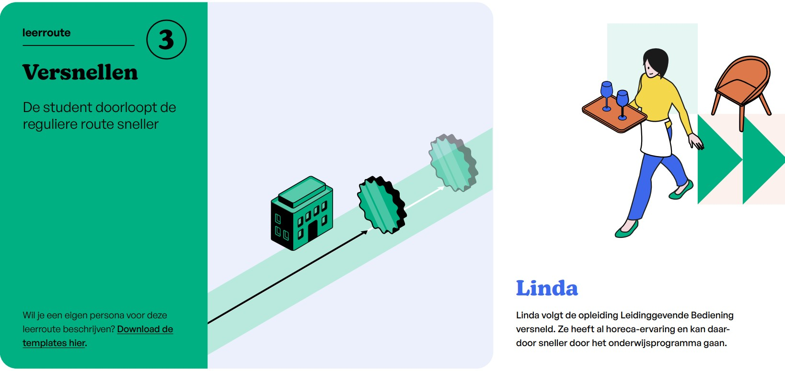

<!-- markdownlint-disable MD024 -->
# Persona Linda

## Student journey

### Oriënteren

Linda oriënteert zich op een opleiding via de website van mbo-instellingen en sociale mediakanalen. Zij bezoekt een open dag om haar keuze te bevestigen.

### Aanmelden

Linda meldt zich aan bij mbo-instelling met de juiste vooropleiding. Zij weet dat zij al relevante kennis en ervaring heeft die aansluiten bij de kwalificatie en verwacht daardoor sneller door het traject te kunnen.

### Inschrijven

Linda voert een intakegesprek waarin zij haar voorkennis en ervaring bespreekt. Zij geeft aan dat zij de opleiding mogelijk versneld wil doorlopen en wil weten hoe haar traject eruit kan zien.

### Informeren

Linda bekijkt bij de start van de opleiding de standaard leerroute, inclusief modules, BPV en examenplanning.
Zij identificeert direct welke leeruitkomsten zij mogelijk al beheerst op basis van eerdere kennis en ervaring.
In gesprek met haar SLB’er bespreekt Linda welke bewijzen zij kan aanleveren en voor welke onderdelen zij mogelijk vrijstelling of versnelling kan krijgen.
Op basis hiervan wordt haar persoonlijke leerroute aangepast.

### Studeren

Linda volgt onderwijs op maat, waarbij zij zich richt op leeruitkomsten die zij nog moet behalen.
Voor leeruitkomsten die zij al beheerst, volgt zij aangepaste activiteiten of slaat zij onderdelen over.
Linda werkt zelfstandig en doelgericht en formuleert haar leerdoelen op basis van resterende leeruitkomsten.

### Kiezen in leertraject

Linda bekijkt voorafgaand aan een nieuwe lesperiode het aanbod van modules.
Zij kiest bewust voor modules met een hogere complexiteit of modules die aansluiten op wat zij nog moet behalen.
Linda kan zich versneld inschrijven op meerdere modules tegelijk.
Zij past haar rooster aan, bijvoorbeeld door eerder te starten met modules of aan te sluiten bij andere groepen.
Afspraken hierover stemt zij af met haar slb’er en docenten.

### BPV

Linda oriënteert zich op een BPV-plek die past bij haar niveau en ontwikkelbehoefte.
Zij regelt haar BPV-overeenkomst en start met de praktijk.
Indien mogelijk start Linda eerder met haar BPV dan standaard is gepland, zodat zij versnelling in haar traject realiseert.

### Kiezen keuzedelen

Linda verkent het aanbod van keuzedelen en beoordeelt inhoud, leerdoelen en studielast.
Zij kiest keuzedelen die passen bij haar versnellingsroute en ontwikkelbehoefte.
Linda houdt rekening met minimale vereisten, maar optimaliseert haar keuzes voor efficiëntie en voortgang.

### Studievoortgang

Linda ontvangt regelmatig feedback, feed-up en feedforward op haar ontwikkeling.
Zij monitort actief haar voortgang en weet welke leeruitkomsten zij nog moet aantonen.
In gesprek met haar SLB’er bespreekt zij hoe zij versnelling kan blijven benutten.
Zij stuurt actief op afronding van haar traject.

### Examineren

Linda legt examens af op basis van haar versnelde planning.
Zij kan waar mogelijk vrijstellingen aanvragen op basis van eerder behaalde resultaten of aangetoonde competenties.
Linda rondt haar opleiding af via passende examenvormen zoals proeven van bekwaamheid, praktijkexamens of portfolio-beoordeling.

### Uitstroom

Linda bespreekt met haar SLB’er haar vervolgstap, zoals werk of een vervolgopleiding, afgestemd op haar versnelde afronding.

### Diploma

Linda ontvangt haar diploma eerder dan studenten die het standaard traject volgen.

## Persona Linda | Werkervaring, geen formele bewijzen

### Informeren

Linda brengt haar werkervaring, cursussen en trainingen in kaart en vergelijkt deze met de leeruitkomsten van de opleiding.
Zij bespreekt met haar SLB’er welke leeruitkomsten zij waarschijnlijk al beheerst en hoe zij dit kan aantonen.

### Studeren

Linda richt zich vooral op het aantonen van bestaande kennis.
Zij verzamelt bewijsmateriaal (werkervaring, portfolio, referenties) en bereidt zich voor op assessments.

### Kiezen in leertraject

Linda kiest ervoor om modules niet standaard te volgen, maar (deels) te bewijzen via alternatieve vormen zoals assessments of portfolio-beoordeling.
Zij versnelt waar mogelijk door modules over te slaan.

### Studievoortgang

Linda monitort actief welke leeruitkomsten zij al heeft aangetoond en welke nog bewijs vereisen.
Zij stuurt op snelle afronding van onderdelen via valideren.

### Examineren / afsluiten

Linda toont leeruitkomsten aan via examens of validerende beoordelingsvormen, zonder alle onderwijsmodules te doorlopen.
Het gaat hier om valideren van informele leerervaring

## Persona Linda | Andere school, geen diploma

### Informeren

Linda deelt haar formatieve resultaten uit haar vorige opleiding.
De opleiding onderzoekt in hoeverre deze vergelijkbaar zijn met de huidige leeruitkomsten.

### Studeren

Linda herhaalt mogelijk onderdelen, omdat formele erkenning ontbreekt.
Zij gebruikt haar voorkennis om sneller door de leerstof te gaan.

### Kiezen in leertraject

Linda kan in overleg onderdelen versneld volgen of overslaan, maar vaak pas na aanvullende toetsing.
Contact met de vorige SLB’er kan worden gebruikt ter onderbouwing.

### Studievoortgang

Linda moet regelmatig aantonen dat zij leeruitkomsten daadwerkelijk beheerst, omdat bewijs beperkt formeel is.

### Examineren / afsluiten

Linda rondt onderdelen af via reguliere examinering, eventueel versneld.
Hergebruik van beperkte externe onderwijsinformatie

## Persona Linda | mbo-instelling, geen diploma

### Informeren

Linda’s eerdere resultaten zijn beschikbaar binnen mboinstelling-systemen.
Zij en haar slb’er hebben direct inzicht in behaalde onderdelen.

### Studeren

Linda hoeft onderdelen die zij eerder aantoonbaar heeft gevolgd mogelijk niet opnieuw te doorlopen.

### Kiezen in leertraject

Linda kan sneller keuzes maken op basis van bestaande data.
Vrijstellingen of versnelling zijn eenvoudiger te onderbouwen.

### Studievoortgang

Linda heeft duidelijk inzicht in wat al is gedaan en wat nog nodig is.

### Examineren / afsluiten

Linda kan sneller afronden doordat eerdere prestaties eenvoudiger erkend worden.
Hergebruik van interne leerdata

## Persona Linda | mbo-verklaring en certificaat andere mbo-instelling

### Informeren

Linda brengt haar mbo-verklaring en certificaten in en laat beoordelen welke onderdelen erkend kunnen worden.

### Studeren

Linda volgt alleen onderwijs voor leeruitkomsten die nog niet zijn afgedekt.

### Kiezen in leertraject

Linda slaat generieke onderdelen of specifieke beroepsonderdelen over waar al bewijs voor is.
Keuzedeelcertificaten zonder overlap tellen niet mee voor vrijstelling.

### Studievoortgang

Linda heeft een verkort traject doordat erkende onderdelen buiten beschouwing blijven.

### Examineren / afsluiten

Linda doet alleen examens voor ontbrekende leeruitkomsten.
Formele deelresultaten - gerichte vrijstellingen

## Persona Linda | mbo-verklaring en mbo-instelling

### Informeren

Linda’s resultaten zijn direct beschikbaar en formeel erkend.

### Studeren

Linda volgt een sterk verkort programma gebaseerd op resterende leeruitkomsten.

### Kiezen in leertraject

Linda kan snel doorstromen naar complexere of ontbrekende modules.

### Studievoortgang

Linda heeft een duidelijk en betrouwbaar overzicht van haar voortgang.

### Examineren / afsluiten

Linda rondt alleen resterende onderdelen af en kan versneld diplomeren.
Optimale benutting van formele + interne resultaten

## Persona Linda | diploma zelfde niveau

### Informeren

Linda bespreekt hoe haar eerdere diploma zich verhoudt tot de nieuwe opleiding.

### Studeren

Linda volgt alleen aanvullende onderdelen die verschillen tussen de opleidingen.
Kiezen in leertraject
Linda kan vrijstellingen krijgen voor overlappende leeruitkomsten.

### Studievoortgang

Linda doorloopt een verkort traject gericht op verschillen.

### Examineren / afsluiten

Linda hoeft alleen examens te doen voor nieuwe of afwijkende onderdelen.
Diploma/ brede vrijstellingen

## Persona Linda | diploma lager niveau en overlap

### Informeren

Linda brengt haar eerdere diploma en resultaten op hoger niveau (generiek) in.

### Studeren

Linda volgt een traject waarin zij deels vrijstellingen krijgt en deels doorstroomt naar hoger niveau.

### Kiezen in leertraject

Linda kiest modules die aansluiten op het hogere niveau en haar ontwikkelbehoefte.

### Studievoortgang

Linda combineert versnelling (overlap) met verdieping (nieuw niveau).

### Examineren / afsluiten

Linda legt examens af op het nieuwe niveau, met behoud van eerder behaalde voordelen.
Doorstroom met overlap en niveauverschil

## Persona Linda | diploma zelfde niveau + veel overlap

### Informeren

Linda en de opleiding bepalen welke onderdelen nog aanvullend nodig zijn.

### Studeren

Linda doorloopt alleen een beperkt aantal modules die afwijken van haar eerdere opleiding.

### Kiezen in leertraject

Linda volgt vooral maatwerkonderwijs op specifieke verschillen.

### Studievoortgang

Linda heeft een zeer korte doorlooptijd.

### Examineren / afsluiten

Linda rondt alleen de ontbrekende onderdelen af.
Bijna volledig vrijgesteld traject.

TODO: Instellingsjourney van Jochem vertalen naar Linda

## Instellingsjourney

### Oriënteren
De onderwijsinstelling heeft een duidelijk beeld welke opleidingen (en keuzedelen) er worden aangeboden in het eerst volgende instroommoment/schooljaar.
Dit aanbod staat gepubliceerd op de website en is voorzien van voldoende informatie om studenten te informeren en te verleiden tot inschrijven. Via socialmedia kanalen worden bijzonderheden over het opleidingsaanbod extra onder de aandacht gebracht. De onderwijsinstelling organiseert open dagen om de aspirant studenten een goed beeld en gevoel te geven bij de faciliteiten, docenten en inspirerende inhoud. 

### Aanmelden
Om mogelijk te maken dat Jochem zich kan aanmelden voor de opleiding apothekersassistent heeft de onderwijsinstelling het aanmeld systeem (CAMBO/AII) ingericht en de aanmeld functie op de eigen website daaraan gekoppeld. Daar kan Jochem het gewenste startmoment kiezen en de aanmelding voltooien. Zodra de de onderwijsinstelling de aanmelding van Jochem heeft ontvangen, start de vervolg communicatie die door de instelling of opleidingsteam wordt opgepakt. Dit gebeurd volgens een gestandariseerd proces waarbij toelatingseisen worden gecontroleerd en er wordt nagevraagd of er sprake is van een ondersteuningsbehoefte. Als dat het geval is, dan zal er later bij de instelling een uitgebreide intake plaatsvinden waarin die ondersteuningsbehoefte wordt bepaald en vastgelegd.  

### Inschrijven
Jochem wordt op basis van de uitkomst van de intake in de opleiding geplaatst en ingeschreven. De student dient daarvoor een bewijs van inschrijving te ontvangen. 
Om een student te kunnen inschrijven en plaatsen heeft de onderwijsinstelling het kern registratie systeem(KRS) ingericht. De student wordt als entiteit aangemaakt en verbonden aan o.s. een opleidingsteam, locatie, stam/plaatsinggroep, (start) cohort/periode, OER, leerroute- en resultaat structuur. Er wordt een studentaccount aangemaakt en de accountprovisioning stromen richting alle systemen waar Jochem gebruik van kan maken worden geinitieerd. 
Nadat het bewijs van inschrijving is uitgegeven, wordt Jochem's registratie uitgewisseld met ROD.

### Informeren
De onderwijsinstelling verstuurd meerdere berichten naar Jochem. Allereest de inloggegevens en instructie hoe Jochem bij de studentenportaal kan komen. Om niet volledig afhankelijk te zijn van de digitale vaardigheden van Jochem, worden de basisgegevens zoals een leermiddelenlijst ook direct aangeboden.
In het studentenportaal worden alle relevante gegevens uit meerdere systemen ontsloten of allerminst links aangeboden. Jochem's leertraject vormt daarin de basis, van daaruit dient hij inzicht te verkrijgen in de verschillende modules; welke leeruitkomsten daarin kunnen worden bereikt en welke leermiddelen erbij nodig zijn. De docenten hebben ook al een voorbereiding neergezet voor de eerste les. 
Ondertussen wordt er hard gewerkt om de roosters beschikbaar te stellen. De eerste periode start op een maandag met een introductiedag, maar daarna moet het duidelijk zijn hoe laat en waar Jochem wordt verwacht en wat hij zelf moet meenemen. Tevens wordt er een SLB-er aan Jochem toegewezen die hem zal begeleiden in zijn leertraject. Wie exact Jochem zal begeiden in zijn BPV hoeft nog niet bepaald te zijn, de BPV periode vindt pas in de 4e periode. Hiervoor wordt wel tijd gealloceerd voor de BPV begeleiders. 

### Studeren
In de studeren fase van Jochem is ook voor de onderwijsinstelling de belangrijkste fase, er wordt onderwezen. Docenten hebben hun lessen voorbereid en zijn conform het rooster op de juiste tijd op de juiste plek, om Jochem stappen te laten maken richting zijn felbegeerde leeruitkomsten. Voor de start van de les, neemt de docent de aanwezigheid op. De docent kan immers in het systeem zien wie er, naast Jochem nog meer in de les wordt verwacht. Om Jochem later zijn diploma te kunnen uitrijken, dient de instelling aan te kunnen tonen dat Jochem voldoende onderwijstijd heeft mogen genieten. Ook wanneer bijvoorbeeld de docent ziek zou zijn, dient de onderwijsinstelling een vervanger te plannen of het op een later moment in te halen. Mocht de les uitvallen, stelt Jochem het zeer op prijs dat hij hier vooraf over geinformeerd wordt. 
Voor elk onderwijsproduct is er in het LMS een omgeving ingericht waarmee de docent, Jochem en zijn medestudenten, samen (of individueel) de beoogde leertaken kunnen oppaken en de voortgang kunnen toetsen.

### BPV
Jochem blijkt een voorbeeldig student en volgt exact het beoogde schema van het leertraject. Dit betekent dat de BPV periode in het zicht komt en er door de onderwijsinstelling een BPV begeleider aangesteld wordt. Hij/zij helpt vroegtijdig Jochem met het vinden van die ideale BPV-plek, bespreekt wat er van Jochem wordt verwacht om zijn BPV-stage goed af te ronden. Jochem sluit perfect aan bij het aanbod van erkende leerbedrijven en heeft na een kort intakegesprek een ondertekende POK in handen. Deze wordt in het KRS opgeslagen.
Tijdens de BPV volgt Jochem geen lessen op school. Maar kan hij wel inloggen op zijn BPV-omgeving waar hij verslagen kan maken en kan aangeven welke leeruitkomsten hij verder heeft kunnen ontwikkelen. Ook de stagebegeleider houdt een oog in het zeil en komt minimaal een keer op bezoek bij het leerbedrijf. 

### Kiezen keuzedelen
Jochem blijkt een voorbeeldig student en volgt exact het beoogde schema van het leertraject. Bij een regulier traject als Jochem zijn is de keuzedeelruimte voorgeprogrammeerd en kan hij elke 3e periode van het schooljaar een keuzedeel volgen.
Dit betekent dat zijn eerste keuzedeel ruimte nadert en hij een keuze moet gaan maken voor die periode. De onderwijsinstelling heeft het aanbod aan keuzedelen ontsloten in de onderwijscatalogus. Het is niet haalbaar Jochem zomaar uit alle mogelijk keuzedelen te laten kiezen. De onderwijscatalogus(of keuzesysteem) toont in eerste instantie alleen de keuzedelen, die vanuit de instelling voorgesorteerd zijn. De logische keuzes binnen het aanbod van de onderwijsinstellen waar zijn leerroute (en keuzedeelruimte), type keuzedeel (gekoppeld/generiek), domein en locatie op afgestemd zijn. Door deze voorsortering kan de onderwijsinstelling het haalbaar en betaalbaar organiseren. Echter, mocht Jochem op basis van een goede onderbouwing toch een ander keuzedeel willen kiezen dat beter past bij zijn ambitie, interesse en talent, moet hier ook maatwerk mogelijk zijn.

Als onderwijsstelling is het niet alleen van groot belang dat Jochem een keuze maakt, maar ook dat hij deze tijdig maakt. De opties dienen door de SLB-er al ruimschoots voor het keuzemoment onder de aandacht gebracht te worden. Los van het informeren en inspireren, is het van belang om ook een animo check te doen voor planning. Hoe eerder er een beeld is van wat populaire keuzes zijn, des te beter kan het organisatorische impact worden bepaald.

De onderwijsinstelling heeft ter voorbereiding van de definitieve keuzedeel-keuze de systemen zo ingericht dat:
De keuze wordt vastgelegd in het KRS ter verantwoordeing en eventuele uitgave van een certificaat, in het SVS formatieve en summatieve structuren gekoppeld worden, Jochem's keuze in de planning verwerkt wordt (plaatsen van juiste lesgroep), in het LMS aan de juiste leeromgeving gekoppeld wordt, de leermiddelenlijst wordt gedeeld en de examenplanning wordt geïnitieerd.      

### Studievoortgang
Jochem blijkt een voorbeeldig student en volgt exact het beoogde schema van het leertraject. Ondanks dat Jochem's resultaten goed zijn en er weinig reden is tot ingrijpen, houdt de SLB'er goed contact met Jochem en legt gespreksverslagen vast in het SIS. Mocht er toch iets aan de hand zijn, blijft de drempel laag om contact te hebben.

De SLB'er heeft goed inzichtelijk hoe Jochem's leertraject verloopt, welke leeruitkomsten hij bereikt heeft en in welke context. De SLB'er attendeert Jochem op de aanstaande examens en adviseert hem wat hij nog extra kan doen ter voorbereiding.   

### Examineren
Jochem ligt nog steeds op schema en heeft al enkele examens voltooid. De kennisexamens voor Nederlands, rekenen en engels stonden al vroeg op zijn programma en zijn reeds behaald. De resultaten zijn verwerkt in het SVS en de details van de examens opgenomen in het examendossier. De onderwijsinstelling heeft de OER goed nageleefd en het is duidelijk hoe de nog af te nemen examens in relatie staan tot het kwalificatie dossier. Het laatste examen, de proeve van bekwaamheid, heeft echter nog een planningsuitdaging. Jochem is er klaar voor en heeft zich voorbereid, nu is het afwachten tot de casus zich voor doet. Jochem dient bij zijn BPV tandarts te assisteren bij een echte wortelkanaal behandeling. Hij en de examinator zijn er klaar voor en staan stand-by totdat een patient zich meldt.   

### Uitstroom
Jochem weet glashelder wat hij wil en dat is zo snel mogelijk aan het werk. Samen met de SLB'er bespreekt hij toch nog de mogelijkheid tot een vervolg, maar daar ziet hij van af. Wel toont hij nog interesse om in het kader van leven lang leren in de toekomst eventueel nog een keuzedeel of interessante module te volgen. 
De SLB'er legt de interesse goed vast en registreert Jochem voor de LLO/alumni nieuwsbrief 

### Diploma
Jochem heeft zijn opleiding voltooid en alle examens behaald. Voordat zijn diploma wordt gedrukt en uitgereikt wordt wel nog even gecontroleerd of Jochem aan alle eisen heeft voldaan, waaronder de 3075u aan BOT en BPV over alle leerjaren heen. Dit is het geval. Jochem krijgt zijn diploma.

