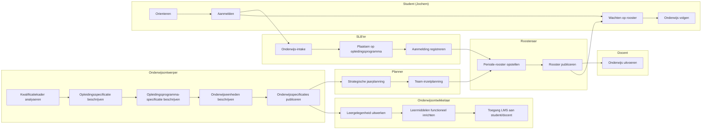

# Scenario-uitwerkingen: leerroute 1, 2 en 3

De concrete gebruikersscenario's per Npuls-leerroute: leerroute 1 (regulier), leerroute 2 (temporiseren by design) en leerroute 3 (versnellen by design), met sjabloon en leeswijzer. In de [leerroute-uitwerking](leerroute-uitwerking-lr1.md) (§3.2.1 en verder) zijn de negen leerroutes aangevuld met onderwijslogistiek en onderwijskundig perspectief; dit bestand vertaalt die aangevulde leerroutes naar concrete gebruikersscenario's. De begrippen staan in het [begrippenkader](begrippenkader.md). Relateert aan: #137.

**Doel.** Externen (leveranciers, instellingen, ketenpartners) moeten in begrijpelijke taal kunnen volgen *wat er allemaal gebeurt* om elke vorm van leerroute mogelijk te maken. Daarbij staan we ook stil bij veel voorkomende wijzigingen op geplande leerroutes. Denk hierbij  *hoe een incidentele wijziging (vertraging/versnelling by incident)* of een *bewuste tempo-keuze (by design)* hierop ingrijpt. De begrippen die we daarvoor gebruiken zijn die van §3.2.

#### 3.4.0 Sjabloon en leeswijzer

We gebruiken voor elk scenario hetzelfde sjabloon. Lees het als een verhaal in zeven blokken (A–G), met steeds één persona (**Jochem**) en één doorlopende casus (**Apothekersassistent**, Crebo dossier 23450, kwalificatie 27141). De BPMN-uitwerking in `bpmn/leerroute-1-scenario-1-regulier-geenkeuze-happyflow.bpmn2` (zie [SVG](../img/leerroute-1-scenario-1-regulier-geenkeuze-happyflow.svg)) is de **basis-procesplaat** voor scenario 1.1; voor de andere scenario's beschrijven we waar het proces afwijkt.

| Blok | Naam                              | Wat staat erin                                                                                                                                  |
| ---- | --------------------------------- | ----------------------------------------------------------------------------------------------------------------------------------------------- |
| **A** | Persona en voorvraag              | Eén levendige zin over Jochem + dé vraag die het scenario beantwoordt.                                                                          |
| **B** | Given — beginstaat                 | Mini-tabel in §3.2-taal: per relevante rij (kwalificatiedossier → toetsrij) welke kolommen al gevuld zijn en welke leeg.                        |
| **C** | When — trigger                     | Wie zet wat in beweging? Korte verhalende zin met BPMN-aanknopingspunt.                                                                         |
| **D** | Het verhaal per swimlane           | Per actor (onderwijsontwerper, onderwijsontwikkelaar, planner, roosteraar, SLB'er, student, docent) 2–4 zinnen *wat ontvang ik, wat lever ik op*. |
| **E** | Then — eindstaat **bij start van onderwijsuitvoering** | De staat van de 6 informatie-objectfamilies op de eerste schooldag — niet over 3 jaar. Aanbod kan in verschillende stadia zijn (sommige eenheden geroosterd, andere alleen planbaar, andere nog specificatie). Verbintenis kan in verschillende stadia zijn (programma ingeschreven, eenheden van P1 deelnemend, eenheden van P2/P3/P4 nog niet aangemaakt). |
| **F** | Voorwaarden — 9 architectuurlagen | Wat moet per laag (Business/Strategy/Motivation/Beleid/Organisatie/Proces/Informatie/Data/Systeem) geregeld zijn voordat dit scenario kán?     |
| **G** | Informatiestromen-figuur          | Placeholder/verwijzing naar de architectuurplaat (afgeleid van *Hoofdplaat OKx informatiestromen v20260317*) die expliciet maakt welke OEAPI-stromen bewegen. |

**Werkproces-paneel als concrete inkijk.** We gebruiken doorlopend drie werkprocessen uit het Apothekersassistent-dossier — telkens op de werkproces-rij (kolom 3 = `Leeronderdeel-specificatie`, kolom 4 = `Leergelegenheid`):

| Werkproces                                  | Karakter            | Typische `deliveryForm` |
| ------------------------------------------- | ------------------- | ----------------------- |
| **B1-K1-W1** — Neemt de zorg-/adviesvraag in behandeling     | mens-mens-contact   | `simulation`            |
| **B1-K2-W2** — Houdt de voorraad bij                          | proces + systeem    | `workshop` / practicum  |
| **B1-K3-W2** — Evalueert werkzaamheden, ontwikkelt zich als professional | reflectie           | `guided_self_study` + portfolio |

Deze drie werkprocessen samen tonen verschillende eisen aan ruimte, expertise en leermiddelen — en daarmee aan planning en roostering.

**Persona.** *Jochem (15). Heeft VMBO-tl afgerond. Heeft via een open dag interesse in farmacie ontwikkeld. Meld zich aan voor de voltijd mbo-4-opleiding Apothekersassistent (3 jaar) bij ROC Het Voorbeeld. Geen relevante voorkennis, geen vrijstellingen, geen verwachte verstoring.* In §3.4.5 t/m §3.4.12 verschijnt dezelfde Jochem op een andere levensloop — om de scenario's herkenbaar te houden voor lezers, en om expliciet te maken dat **dezelfde persoon** in verschillende cohorten of jaren een ander tempo of een andere route nodig kan hebben.

#### 3.4.1 Scenario 1.1 — Regulier, happyflow

**Status.** *Happyflow.* Geen vertraagd of versneld ontwerp, geen keuzes, geen incidenten tijdens het volgen van de studie. Alles loopt volgens plan.

##### A. Persona en voorvraag

> *Jochem schrijft zich in juni 2026 in voor de voltijd mbo-4-opleiding Apothekersassistent. Op 1 september 2026 begint zijn eerste lesweek. Hij volgt drie jaar lang het nominale opleidingsprogramma, behaalt op tijd alle leeruitkomsten, en ontvangt zijn diploma in juli 2029.*

**De voorvraag**: *wat moet er allemaal — bij ontwerp, ontwikkeling, planning, roostering, intake en LMS-inrichting — geregeld zijn voordat Jochem op 1 september 2026 om 09:00 uur zijn eerste les "Balie: zorg-/adviesvraag (simulatie)" kan binnenlopen?* Dit scenario laat zien hoeveel werk er **vóór** de student plaatsvindt.

##### B. Given — beginstaat (in §3.2-taal)

| Niveau (rij) ↓ \ Familie (kolom) → | 1. Kader | 2. Beoogde LO | 3. Specificatie | 4. Aanbod | 5. Verbintenis | 6. Resultaat |
| --- | --- | --- | --- | --- | --- | --- |
| Kwalificatiedossier (23450) | aanwezig (SBB) | n.v.t. | leeg | leeg | leeg | leeg |
| Kwalificatie (27141) | aanwezig (SBB) | n.v.t. | leeg | leeg | leeg | leeg |
| Kerntaak (B1-K1, B1-K2, B1-K3) | aanwezig | LO-collecties leeg | leeg | leeg | leeg | leeg |
| Werkproces (B1-K1-W1, B1-K2-W2, B1-K3-W2) | aanwezig | LO-set leeg | leeg | leeg | leeg | leeg |
| Lesuitkomst-laag | n.v.t. | leeg | leeg | leeg | leeg | leeg |
| Toetsing en examinering | examencommissie-vasstelling | scope leeg | leeg | leeg | leeg | leeg |

> **Leeswijzer.** Het kader staat klaar bij SBB. De rest is leeg — **alle kolommen 2 t/m 6 worden in dit scenario stap voor stap gevuld**.

##### C. When — trigger

In maart 2026 vraagt het college van bestuur van ROC Het Voorbeeld om de Apothekersassistent-opleiding klaar te zetten voor cohort 2026. De **onderwijsontwerper** start (BPMN-startevent in de swimlane "Onderwijsontwerper") met de taak `Kwalificatiekader analyseren` — de aftrap van het sub-process *Grofmazig onderwijsontwerp / Onderwijsplan / Onderwijsspecificatie opstellen*.

##### D. Het verhaal per swimlane

**Onderwijsontwerper.** Zij analyseert eerst het Crebo-dossier 23450 ("Apothekersassistent") en mapt de drie kerntaken (B1-K1, B1-K2, B1-K3) en hun werkprocessen op een set **summatieve leeruitkomsten** per werkproces. Vervolgens beschrijft zij de `Opleidingsspecificatie` (rij Kwalificatiedossier, kolom 3), de `Opleidingsprogramma-specificatie` (rij Kwalificatie — nominaal, voltijd, 3 jaar, 4800 SBU), en de `Onderwijseenheid-specificaties` per kerntaak. Daarna publiceert zij — via de Curriculum-ontwerptool → OC (stadium 1) — het hele pakket. **Levert op:** kolom 2 én kolom 3 op rij Kwalificatiedossier t/m Kerntaak.

**Onderwijsontwikkelaar.** Hij ontvangt het verzoek tot detaillering van de onderwijsspecificatie en werkt voor elk werkproces de `Leeronderdeel-specificatie` uit (rij Werkproces, kolom 3) — inclusief `educationSpecification` met `deliveryForm: simulation` voor B1-K1-W1, `workshop` voor B1-K2-W2, en `guided_self_study` voor B1-K3-W2. Hij richt het LMS in (lesplanning, leermiddelen, toegangsrechten) en werkt waar nodig de lesspecificaties uit. **Levert op:** kolom 3 op rij Werkproces en Lesuitkomst.

**Planner.** Zij ontvangt de gepubliceerde specificaties uit OC en stelt de **strategische jaarplanning** vast: cohortgrootte 120 studenten, 4 perioden van 10 weken, en een team-inzetplanning waarin 8 docenten (`expertiseProfiles: ["pharmaceutical_assistant_coach", "roleplay_training", "pharmacy_logistics", "coach_reflective_practice"]`) en 5 ruimtetypes (`simulation_practice_room`, `workshop`, `lecture_hall`, `online`, `general_classroom`) gematcht zijn op de specificaties. Zij publiceert per `Onderwijseenheid` en per `Leeronderdeel` een **planbaar aanbod** (stadium 2a) — perioden + capaciteit, **zonder** concrete lokaal- of personeelsnummers. **Levert op:** kolom 4 (planbaar) op rij Kerntaak en Werkproces.

**Roosteraar.** Hij neemt het planbare aanbod over en roostert eerst alleen periode 1: concrete tijdsloten ("ma 09:00–11:00, simulatieruimte 2.14, docent personeelsnr 4711"), concrete groepen, concrete lokaal-instanties. Voor periode 2, 3, 4 blijft het **planbaar** (capaciteit gereserveerd, geen concrete tijdsloten). Hij publiceert geroosterd aanbod (stadium 2b) en stelt het ter beschikking aan de student (via SVS/SKS) en de docent (via LMS/rooster). **Levert op:** kolom 4 (geroosterd) op rij Werkproces en Lesuitkomst — *alleen voor periode 1*.

**SLB'er.** Zij ontvangt Jochems aanmelding (april 2026), voert de intake uit (kennismakings- en geschiktheidsgesprek; bevestigt dat er geen vrijstellingen, EVC of zorgafspraken zijn), plaatst hem op het nominale opleidingsprogramma en registreert de aanmelding (`Association.state = enrolled` op `Opleidingsverbintenis` en `Opleidingsprogramma-verbintenis`). Bij start van de uitvoering activeert zij de verbintenissen op de geroosterde leergelegenheden van periode 1. **Levert op:** kolom 5 op rij Kwalificatiedossier en Kwalificatie; kolom 5 op de geroosterde Werkproces-leergelegenheden.

**Student (Jochem).** Jochem oriënteert zich in maart 2026 via de website van het ROC en SBB-info op de opleiding. In april meldt hij zich aan, doet hij intake, en ontvangt hij na enkele weken zijn inschrijvingsbevestiging. Eind augustus krijgt hij toegang tot het LMS en zijn periode-1-rooster. Op 1 september begint hij. **Levert op:** zijn leervraag (impliciet: de hele LO-set van de Apothekersassistent), zijn aanmelding, en straks zijn deelname.

**Docent.** Een rollenspeltrainer met farmaceutische coachingbevoegdheid krijgt op 28 augustus zijn periode-1-rooster en LMS-toegang. Op 1 september voert hij in lokaal 2.14 het eerste simulatie-onderdeel uit. Tijdens de uitvoering zal hij `Association.state` per les muteren (`participating` → `completed`) en eventuele resultaten vastleggen. **Levert op:** kolom 6 op rij Lesuitkomst en — via de toetsrij — straks ook op rij Werkproces.

##### E. Then — eindstaat **bij start van onderwijsuitvoering** (1 september 2026, 08:55)

Dit is het moment waarop Jochem in zijn jas voor lokaal 2.14 staat. De stand van zaken in §3.2-taal:

| Niveau (rij) ↓ \ Familie (kolom) → | 1. Kader | 2. Beoogde LO | 3. Specificatie | 4. Aanbod | 5. Verbintenis | 6. Resultaat |
| --- | --- | --- | --- | --- | --- | --- |
| Kwalificatiedossier | ongewijzigd | n.v.t. | **gepubliceerd** | **opleidingsaanbod uitgerold** | **Jochem `enrolled`** | leeg |
| Kwalificatie | ongewijzigd | n.v.t. | **programma-specificatie gepubliceerd** | **programma-aanbod uitgerold** | **Jochem `enrolled` op nominaal traject** | leeg |
| Kerntaak | ongewijzigd | LO-collecties gevuld | **eenheid-specificaties gepubliceerd** | **planbaar** voor alle perioden, **geroosterd** alleen voor P1 | **enrolled op P1-eenheden**; P2–P4 nog niet aangemaakt | leeg |
| Werkproces (W1, W2, W3) | ongewijzigd | LO-set per WP | **leeronderdeel-specificaties gepubliceerd** | **leergelegenheid van P1 geroosterd** (lokaal + docent toegewezen); P2–P4 alleen planbaar | **`Association.state = enrolled`** op P1-leergelegenheden; over enkele uren → `participating` | leeg |
| Lesuitkomst-laag | n.v.t. | DAG met lesuitkomsten beschreven | **lesspecificaties gepubliceerd** | **lesgelegenheden van eerste week geroosterd**; rest van P1 nog te roosteren binnen periode | **`Association` op eerste les** | leeg |
| Toetsrij | examencie-besluit voor scope P1 | scope = WP-LO-set P1 | **toetsonderdeel-specificaties gepubliceerd** | **toetsgelegenheid einde P1 planbaar** | nog geen verbintenis | leeg |

**Belangrijk om te zien.** Aanbod en verbintenis zitten op verschillende rijen in **verschillende stadia** tegelijk. Dat is geen fout maar het normale beeld bij start van uitvoering: je roostert niet 3 jaar vooruit. Bij elke periode-overgang muteert de tabel: meer leergelegenheden van planbaar → geroosterd, meer associations van *nog niet aangemaakt* → `enrolled` → `participating` → `completed`.

##### F. Voorwaarden — wat moet vooraf geregeld zijn (9 architectuurlagen)

Dit blok maakt expliciet dat één scenario "regulier-happyflow" mogelijk maken **negen architectuurlagen** raakt. Elke laag draagt eigen verantwoordelijkheid die buiten het OEAPI-koppelvlak ligt maar wel een randvoorwaarde is.

- **Business.** Klant = student + ouders/werkveld. Waarde-propositie = diplomeerbare Apothekersassistent in 3 jaar. Dienst = voltijds opleidingsprogramma. **Implicatie scenario:** de instelling moet deze dienst commercieel + maatschappelijk willen aanbieden in cohort 2026.
- **Strategy.** Richting van de instelling: bredere flexibilisering volgens Npuls + toegankelijke standaard mbo-route. **Implicatie scenario:** de "regulier"-baseline moet expliciet als eerste lijn op de strategische roadmap staan, anders wordt het overstemd door flex-experimenten.
- **Motivation (drivers, doelen, principes).** Drivers: maatschappelijke vraag naar apothekersassistenten, OCW-bekostigingseisen, tevredenheidsdoelen. Principes: doceerbaar onderwijs, traceerbare leerresultaten. **Implicatie scenario:** keuzes in ontwerp/planning moeten op deze principes te toetsen zijn.
- **Beleid.** Examenreglement (scope summatief), instellingsbeleid t.a.v. studielast (BOT/OOT), inschrijvingsvoorwaarden, beleid t.a.v. resource-schaarste. **Implicatie scenario:** examencommissie heeft de toetsrij-scope formeel vastgesteld (kolom 1 op de toetsrij).
- **Organisatie-inrichting.** Rollen onderwijsontwerper, onderwijsontwikkelaar, planner, roosteraar, SLB'er, docent zijn benoemd, bezet, met mandaat. Onderwijsteam Apothekersassistent is samengesteld; vlekkenplan voor docenten en lokalen is vastgelegd. **Implicatie scenario:** zonder deze rollen kan de BPMN-flow niet starten.
- **Proces.** De BPMN-flow van scenario 1.1 (zie [SVG](../img/leerroute-1-scenario-1-regulier-geenkeuze-happyflow.svg) en `bpmn/leerroute-1-scenario-1-regulier-geenkeuze-happyflow.bpmn2`) is vastgesteld als referentieproces. Hand-offs tussen actoren zijn ondubbelzinnig.
- **Informatie.** Begrippenkader §3.2 wordt door alle ketenpartijen gehanteerd. Specifiek: de zes informatie-objectfamilies, de zes niveaus, en de stadia van aanbod (§3.2.3) en verbintenis (§3.2.4). MORA-aliasen (§3.2.5) zijn bekend bij architecten van leveranciers.
- **Data.** Identifiers/sleutels: Crebo dossier+kwalificatie, OKx `qualificationReference`, `learningOutcomeIds`, OEAPI ID's voor `Programme`/`Course`/`LearningComponent`/`TestComponent`/`*Offering`/`Association`. Bottom-up aggregatie-invariant (SOM van studielast klopt per niveau).
- **Systeem.** Curriculum-ontwerptool, Onderwijscatalogus (OC), Planningssysteem, Roostersysteem, SVS, SKS/Aanmeldsysteem, LMS — allen aangesloten op OEAPI-koppelvlak met OKx-profiel; OC is centraal distributiepunt (zie §4.1). LMS is gevuld met content vóór 28 augustus.

##### G. Informatiestromen — placeholder voor architectuurplaat

> *Te maken: figuur "Informatiestromen scenario 1.1 — regulier happyflow", afgeleid van `img/Hoofdplaat OKx informatiestromen v20260317.png`.* De plaat moet expliciet maken: (1) Curriculum-ontwerptool → OC publiceert specificaties (stadium 1); (2) Planning → OC publiceert planbaar aanbod (stadium 2a); (3) Roostering → OC publiceert geroosterd aanbod (stadium 2b); (4) SVS/SKS → OC publiceert `Association` (stadium 3); (5) OC → LMS levert onderwijsspecificatie + leermiddelen-referenties; (6) OC → SVS levert resultaatstructuren; (7) OC → SKS levert "passend aanbod op leervraag". De stromen voor scenario 1.1 zijn **alle stromen** die de hoofdplaat kent — er is hier nog geen "vraag-gestuurd" of "cross-instelling"-aanvulling nodig.

#### 3.4.2 Scenario 1.2 — Regulier, vertraging by accident

> **Status.** *By accident, alleen vertraging.* **Pitch.** *Halverwege periode 2 wordt Jochem ziek (lange griep, daarna concentratieproblemen). Hij mist drie weken onderwijs, haalt twee leergelegenheden niet op tijd, en moet in periode 3 of 4 inhalen — waardoor hij voor één werkproces uit ritme raakt en uiteindelijk twee maanden uitloopt op zijn diploma.*
>
> **Verschil met 1.1 in §3.2-taal.** Aanbod en specificatie blijven gelijk. De **verbintenis-state** muteert anders: `participating → onderbroken → participating`. Voor minstens één werkproces wordt een **extra** `Association` aangemaakt op een latere `Leergelegenheid`-periode (planbaar werd opnieuw geroosterd voor Jochem). De toetsrij krijgt een tweede `Toetsgelegenheid-verbintenis`.
>
> **Wat dit raakt in §3.4.0-sjabloon.** D (verhaal): SLB'er en Planner krijgen een rol als bemiddelaar; Onderwijsontwerper níet. E (Then op startmoment van periode 3): één rij toont `participating` waar de baseline `completed` zou tonen. F (architectuurlagen): Beleid t.a.v. langdurige uitval, Organisatie t.a.v. inhaaltrajecten, Data t.a.v. resultaat-overdracht tussen perioden.
>
> *— Volledige uitwerking in een vervolgsessie.*

#### 3.4.3 Scenario 1.3 — Regulier, versnelling by accident

> **Status.** *By accident, alleen versnelling.* **Pitch.** *Jochem blijkt tijdens periode 1 sneller te leren dan verwacht. Hij rondt twee leergelegenheden vroeg af, kan in periode 2 alvast werkprocessen uit periode 3 oppakken en is — zonder dat dit ooit als route ontworpen is — drie maanden vóór op het cohort.*
>
> **Verschil met 1.1.** De specificatie verandert niet. **Aanbod-stadium**: Planner moet eerder dan ontworpen leergelegenheden uit P3 ophogen voor P2 (capaciteit + roostering). **Verbintenis**: extra `Association` op niet-cohortgebonden offerings; toetsgelegenheden eerder geactiveerd. **Resultaat**: dezelfde LO-dekking, eerder behaald.
>
> **Architectuurlagen-impact.** Beleid t.a.v. afwijken van cohortritme (mag dit zonder formele "versnel-track"?), Proces t.a.v. tussentijds bijplannen, Systeem t.a.v. of OC en planningssysteem mid-period mutaties op `*Offering` toestaan.
>
> *— Volledige uitwerking in een vervolgsessie.*

#### 3.4.4 Scenario 1.4 — Regulier, versnellen én vertragen by accident (hybride)

> **Status.** *By accident, hybride.* **Pitch.** *Jochem versnelt op B1-K2-W2 (voorraadbeheer — hij heeft een vakantiebaan in een drogist), maar blijft achter op B1-K3-W2 (reflectie/portfolio — hij vindt het taalkundig ingewikkeld). Voor één werkproces loopt hij voor; voor een ander loopt hij achter. Het netto-effect kan diploma-neutraal zijn, maar de planning is complexer.*
>
> **Verschil met 1.1.** Verbintenis- en aanbod-stadia zijn **per werkproces verschillend**. Eén rij toont `completed` waar de baseline `participating` heeft, een andere rij toont `onderbroken` waar de baseline `participating` heeft. Dit is het scenario waarin de **rij-discipline** uit §3.2.2 het meest betaalt: zonder die rij-discipline kun je niet zien dat de student "totaal nog steeds op tempo" is, maar "per werkproces uit ritme".
>
> *— Volledige uitwerking in een vervolgsessie.*

#### 3.4.5 Scenario 2.1 — Temporiseren by design (anker LR2)

> **Status.** *By design, baseline voor leerroute 2.* **Pitch.** *Jochem is dit jaar 24, werkt 24 uur per week in een drogisterij en heeft een gezin. Hij wil dezelfde Apothekersassistent-opleiding doen, maar op **lager tempo by design**: 4 jaar in plaats van 3, met 60% van de nominale studiebelasting per periode. Geen vrijstellingen — alleen meer tijd.*
>
> **Verschil met 1.1 in §3.2-taal.** Specificatie van de opleiding (kolom 3 op rij Kwalificatiedossier/Kwalificatie) krijgt een **track "Temporiseren"** — `programmeType: "track"`, `consumer.okx.leerrouteType: "getemporiseerd"`. Onderwijseenheid- en leeronderdeel-specificaties blijven dezelfde objecten, maar de **planbaarheid** (stadium 2a) wijzigt: andere `spreadPattern`, andere `timeAllocation` (zelfde BOT, OOT verspreid), andere periodelengte.
>
> **Wat dit raakt.** Onderwijsontwerper voegt track toe (kolom 3, rij Kwalificatie). Planner maakt **alternatief planbaar aanbod** parallel aan het reguliere (stadium 2a, andere perioden). SLB'er plaatst Jochem op de track "Temporiseren" (kolom 5, rij Kwalificatie — andere verbintenis-attributen). Roostering en docentinzet kunnen — als de instelling slim ontwerpt — gedeeld worden met regulier (zelfde leergelegenheden, andere route door de leergelegenheden).
>
> **9-architectuurlagen-aanvulling t.o.v. 1.1.** Beleid: instelling moet leerroute "Temporiseren" als formele variant erkennen (bekostiging, examenmoment-vrijheid, studieduur-toezicht). Organisatie: SLB'er-capaciteit voor maatwerk-trajecten. Data: `learningRouteType`-attribuut op programma; ABC-relatie tussen track en leergelegenheden expliciet.
>
> *— Volledige uitwerking met §B Given, §D verhaal, §E Then op startmoment, §G placeholder in een vervolgsessie.*

#### 3.4.6 Scenario 2.2 — Temporiseren by design + vertraging by accident

> **Pitch.** *Jochem volgt de getemporiseerde route, maar zijn werkgever vraagt halverwege jaar 2 om méér uren. Hij vertraagt verder: van 4 jaar naar 5 jaar uitgesmeerd. De vraag is hoe je twee tempo-afwijkingen (één design, één accident) gecombineerd zichtbaar maakt zonder dubbele track-administratie.*
>
> **Verschil met 2.1.** Verbintenis-stadia muteren extra; planbaar aanbod wordt opnieuw uitgesmeerd; één onderwijseenheid komt in conflict met de nominale toetsperiode → toetsgelegenheid moet in een latere periode opnieuw gepland worden.
>
> *— Volledige uitwerking in een vervolgsessie.*

#### 3.4.7 Scenario 2.3 — Temporiseren by design + versnelling by accident

> **Pitch.** *Jochem heeft de getemporiseerde route gekozen, maar het lukt hem op één werkproces beter dan verwacht. Voor B1-K1-W1 zit hij ineens op het tempo van het reguliere cohort. Hoe modelleer je dit? Zelfde track, andere leergelegenheid-Association? Of overplaatsing per werkproces?*
>
> *— Volledige uitwerking in een vervolgsessie.*

#### 3.4.8 Scenario 2.4 — Temporiseren by design + hybride by accident

> **Pitch.** *Jochem volgt de getemporiseerde route, versnelt op één werkproces (zoals 2.3) en vertraagt op een ander (zoals 2.2). Drie tempo-staten in één studietraject. Vraagt om strikte rij-discipline én een fijnmazige verbintenis-stadia-administratie.*
>
> *— Volledige uitwerking in een vervolgsessie.*

#### 3.4.9 Scenario 3.1 — Versnellen by design (anker LR3)

> **Status.** *By design, baseline voor leerroute 3.* **Pitch.** *Jochem (28) heeft 6 jaar als drogist gewerkt en wil als zij-instromer in 2 jaar in plaats van 3 zijn diploma Apothekersassistent halen. Geen formele vrijstellingen (die laten we nadrukkelijk in een latere fase voor LR4-9), wel een hogere intensiteit per periode (130% nominale studielast) en een aangepast spreidingspatroon.*
>
> **Verschil met 1.1.** Een tweede track op de programma-specificatie (`leerrouteType: "versneld"`). Planbaar aanbod krijgt een eigen periodisering met hogere wekelijkse belasting; capaciteit kan kleiner zijn (zij-instroom-cohort). Roostering: deelt waar mogelijk leergelegenheden met regulier; aparte tijdsloten voor versneld-specifieke onderdelen (bijv. inhaal-blokken).
>
> **Architectuurlagen-aanvulling.** Beleid: examencommissie moet onafhankelijk-toetsmoment toestaan zodra LO's gedekt zijn — zelfs als de versnelde student niet alle leergelegenheden heeft bijgewoond. Organisatie: docenten moeten 130%-intensieve groepen aankunnen. Data: `targetCompletionDate` per track.
>
> *— Volledige uitwerking in een vervolgsessie.*

#### 3.4.10 Scenario 3.2 — Versnellen by design + vertraging by accident

> **Pitch.** *Jochem volgt de versnelde 2-jarige route, maar onderschat de combinatie met zijn werk. Hij verliest tempo. Hij vertraagt naar regulier-tempo (3 jaar) of zelfs daarbuiten. Vraagt om route-overgang **zonder dubbele inschrijving**.*
>
> *— Volledige uitwerking in een vervolgsessie.*

#### 3.4.11 Scenario 3.3 — Versnellen by design + versnelling by accident

> **Pitch.** *Jochem op de versnelde route blijkt nóg sneller te kunnen — bijvoorbeeld op B1-K2-W2 (voorraadbeheer) waar zijn drogisterij-ervaring volledig aansluit. De vraag is wanneer dit nog binnen "versnellen by design" past en wanneer er een ad-hoc, niet ontworpen, individueel pad ontstaat (raakt LR4-9 territorium).*
>
> *— Volledige uitwerking in een vervolgsessie.*

#### 3.4.12 Scenario 3.4 — Versnellen by design + hybride by accident

> **Pitch.** *Jochem op de versnelde route, versnelt op één werkproces én vertraagt op een ander. Toetst de absolute grenzen van de rij-discipline en de stadia-administratie van §3.2 binnen één geheel scenario. Idealiter eindcasus van §3.4.*
>
> *— Volledige uitwerking in een vervolgsessie.*

#### 3.4.13 Niet in scope voor §3.4 — flex-flow met meegenomen LO's

> **Buiten scope.** Een student wil op een afwijkend instroommoment instappen óf overstappen vanuit een andere opleiding, en wil **al behaalde leeruitkomsten meenemen** (basisdelen, algemene delen, individuele LO's). Dit raakt LO-erkenning, EVC, bottom-up aggregatie en cross-instelling-interoperabiliteit — die werken we uit als onderdeel van de scenario-uitwerkingen voor leerroutes 4–9 (in een toekomstige paragraaf §3.x).
