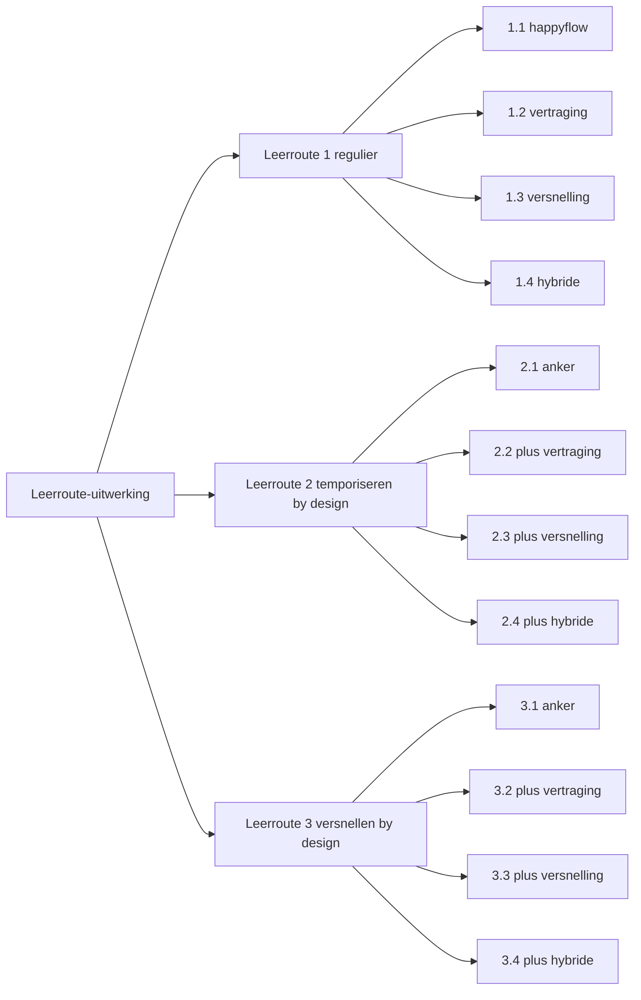

# Scenario-uitwerkingen

**Doel.** Elk scenario beschrijft in begrijpelijke taal wat er in de keten gebeurt om één concrete studentroute mogelijk te maken: één persona, één casus, van kwalificatiekader tot eerste lesdag en verder. De scenario's dienen als opstapje naar testgedreven ontwikkeling (test driven development): de vaste Given/When/Then-opbouw van het sjabloon is direct vertaalbaar naar acceptatietests op de koppelingen.

**Scope.** De scenario's voor leerroute 1 (regulier), 2 (temporiseren by design) en 3 (versnellen by design), elk met de incidentele varianten vertraging, versnelling en hybride. Eén scenario per document; scenario 1.1 is de uitgewerkte basislijn, de overige beschrijven hun delta en zijn nog uit te werken. De kaderstelling per leerroute staat in de [leerroute-uitwerking](../leerroute-uitwerking-lr1.md), de begrippen in het [begrippenkader](../begrippenkader.md).

## Hoe de scenario's aan de leerroute-uitwerking hangen

| Scenario | Document | Status |
|---|---|---|
| 1.1 | [Scenario 1.1: regulier, happyflow](scenario-1.1-regulier-happyflow.md) | uitgewerkt |
| 1.2 | [Scenario 1.2: regulier, vertraging by accident](scenario-1.2-regulier-vertraging-by-accident.md) | pitch, nog uit te werken |
| 1.3 | [Scenario 1.3: regulier, versnelling by accident](scenario-1.3-regulier-versnelling-by-accident.md) | pitch, nog uit te werken |
| 1.4 | [Scenario 1.4: regulier, hybride by accident](scenario-1.4-regulier-hybride-by-accident.md) | pitch, nog uit te werken |
| 2.1 | [Scenario 2.1: temporiseren by design (anker leerroute 2)](scenario-2.1-temporiseren-by-design.md) | pitch, nog uit te werken |
| 2.2 | [Scenario 2.2: temporiseren by design plus vertraging by accident](scenario-2.2-temporiseren-plus-vertraging.md) | pitch, nog uit te werken |
| 2.3 | [Scenario 2.3: temporiseren by design plus versnelling by accident](scenario-2.3-temporiseren-plus-versnelling.md) | pitch, nog uit te werken |
| 2.4 | [Scenario 2.4: temporiseren by design plus hybride by accident](scenario-2.4-temporiseren-plus-hybride.md) | pitch, nog uit te werken |
| 3.1 | [Scenario 3.1: versnellen by design (anker leerroute 3)](scenario-3.1-versnellen-by-design.md) | pitch, nog uit te werken |
| 3.2 | [Scenario 3.2: versnellen by design plus vertraging by accident](scenario-3.2-versnellen-plus-vertraging.md) | pitch, nog uit te werken |
| 3.3 | [Scenario 3.3: versnellen by design plus versnelling by accident](scenario-3.3-versnellen-plus-versnelling.md) | pitch, nog uit te werken |
| 3.4 | [Scenario 3.4: versnellen by design plus hybride by accident](scenario-3.4-versnellen-plus-hybride.md) | pitch, nog uit te werken |

## Sjabloon en leeswijzer

Elk scenariodocument opent met vier vaste velden: **Doel**, **Scope**, **Persona** (link naar het persona-bestand; in deze reeks steeds Jochem, per scenario op een andere levensloop) en **Verantwoordt** (de story-id's uit de requirementsboom die uit het scenario volgen, als ankerlinks op het story-id; zo is de relatie in beide richtingen naloopbaar: het scenario wijst de stories aan, de bronkolom van de story wijst terug).

We gebruiken voor elk scenario hetzelfde sjabloon. Lees het als een verhaal in zeven blokken (A–G), met steeds één persona (**Jochem**) en één doorlopende casus (**Apothekersassistent**, Crebo dossier 23450, kwalificatie 27141). De BPMN-uitwerking in `../bpmn/leerroute-1-scenario-1-regulier-geenkeuze-happyflow.bpmn2` (zie [SVG](../img/leerroute-1-scenario-1-regulier-geenkeuze-happyflow.svg)) is de **basis-procesplaat** voor scenario 1.1; voor de andere scenario's beschrijven we waar het proces afwijkt.

| Blok | Naam                              | Wat staat erin                                                                                                                                  |
| ---- | --------------------------------- | ----------------------------------------------------------------------------------------------------------------------------------------------- |
| **A** | Persona en voorvraag              | Eén levendige zin over Jochem + dé vraag die het scenario beantwoordt.                                                                          |
| **B** | Given — beginstaat                 | Mini-tabel in begrippenkader-taal: per relevante rij (kwalificatiedossier → toetsrij) welke kolommen al gevuld zijn en welke leeg.                        |
| **C** | When — trigger                     | Wie zet wat in beweging? Korte verhalende zin met BPMN-aanknopingspunt.                                                                         |
| **D** | Het verhaal per swimlane           | Per actor (onderwijsontwerper, onderwijsontwikkelaar, planner, roosteraar, SLB'er, student, docent) 2–4 zinnen *wat ontvang ik, wat lever ik op*. |
| **E** | Then — eindstaat **bij start van onderwijsuitvoering** | De staat van de 6 informatie-objectfamilies op de eerste schooldag — niet over 3 jaar. Aanbod kan in verschillende stadia zijn (sommige eenheden geroosterd, andere alleen planbaar, andere nog specificatie). Verbintenis kan in verschillende stadia zijn (programma ingeschreven, eenheden van P1 deelnemend, eenheden van P2/P3/P4 nog niet aangemaakt). |
| **F** | Voorwaarden — 9 architectuurlagen | Wat moet per laag (Business/Strategy/Motivation/Beleid/Organisatie/Proces/Informatie/Data/Systeem) geregeld zijn voordat dit scenario kán?     |
| **G** | Informatiestromen-figuur          | Placeholder/verwijzing naar de architectuurplaat (afgeleid van *Hoofdplaat OKx informatiestromen v20260317*) die expliciet maakt welke OEAPI-stromen bewegen. |

**Werkproces-paneel als concrete inkijk.** We gebruiken doorlopend drie werkprocessen uit het Apothekersassistent-dossier — telkens op de werkproces-rij (kolom 3 = `Leeronderdeel-specificatie`, kolom 4 = `Leergelegenheid`):

| Werkproces                                  | Karakter            | Typische `deliveryForm` |
| ------------------------------------------- | ------------------- | ----------------------- |
| **B1-K1-W1** — Neemt de zorg-/adviesvraag in behandeling     | mens-mens-contact   | `simulation`            |
| **B1-K2-W2** — Houdt de voorraad bij                          | proces + systeem    | `workshop` / practicum  |
| **B1-K3-W2** — Evalueert werkzaamheden, ontwikkelt zich als professional | reflectie           | `guided_self_study` + portfolio |

Deze drie werkprocessen samen tonen verschillende eisen aan ruimte, expertise en leermiddelen — en daarmee aan planning en roostering.

**Persona.** *Jochem (15). Heeft VMBO-tl afgerond. Heeft via een open dag interesse in farmacie ontwikkeld. Meld zich aan voor de voltijd mbo-4-opleiding Apothekersassistent (3 jaar) bij ROC Het Voorbeeld. Geen relevante voorkennis, geen vrijstellingen, geen verwachte verstoring.* In scenario 2.1 tot en met 3.4 verschijnt dezelfde Jochem op een andere levensloop — om de scenario's herkenbaar te houden voor lezers, en om expliciet te maken dat **dezelfde persoon** in verschillende cohorten of jaren een ander tempo of een andere route nodig kan hebben.

## Buiten scope

> **Buiten scope.** Een student wil op een afwijkend instroommoment instappen óf overstappen vanuit een andere opleiding, en wil **al behaalde leeruitkomsten meenemen** (basisdelen, algemene delen, individuele LO's). Dit raakt LO-erkenning, EVC, bottom-up aggregatie en cross-instelling-interoperabiliteit — die werken we uit als onderdeel van de scenario-uitwerkingen voor leerroutes 4–9 (in een toekomstige paragraaf §3.x).
