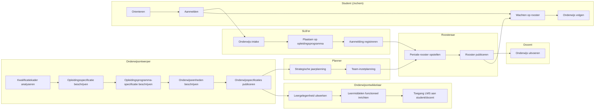

# Scenario 1.1: regulier, happyflow

**Doel.** De happyflow-basislijn vastleggen: wat moet er bij ontwerp, ontwikkeling, planning, roostering, intake en leeromgeving geregeld zijn voordat de student zijn eerste les binnenloopt. Alle andere scenario's beschrijven hun verschil ten opzichte van deze basislijn; de Given/When/Then-opbouw is de opstap naar acceptatietests.

**Scope.** Leerroute 1 (regulier), zonder keuze en zonder incidenten. Status: uitgewerkt (blokken A tot en met G). Het sjabloon, de casus en de samenhang staan in de [README](README.md).

**Persona.** [Jochem](../persona_jochem.md), in de levensloopvariant van dit scenario (zie het sjabloon in de [README](README.md)).

**Verantwoordt.** De bijbehorende story-id's volgen bij de scenario-story-verantwoording, na de hernummering van de requirementsboom.

**Status.** *Happyflow.* Geen vertraagd of versneld ontwerp, geen keuzes, geen incidenten tijdens het volgen van de studie. Alles loopt volgens plan.

##### A. Persona en voorvraag

> *Jochem schrijft zich in juni 2026 in voor de voltijd mbo-4-opleiding Apothekersassistent. Op 1 september 2026 begint zijn eerste lesweek. Hij volgt drie jaar lang het nominale opleidingsprogramma, behaalt op tijd alle leeruitkomsten, en ontvangt zijn diploma in juli 2029.*

**De voorvraag**: *wat moet er allemaal — bij ontwerp, ontwikkeling, planning, roostering, intake en LMS-inrichting — geregeld zijn voordat Jochem op 1 september 2026 om 09:00 uur zijn eerste les "Balie: zorg-/adviesvraag (simulatie)" kan binnenlopen?* Dit scenario laat zien hoeveel werk er **vóór** de student plaatsvindt.

##### B. Given — beginstaat (in begrippenkader-taal)

| Niveau (rij) ↓ \ Familie (kolom) → | 1. Kwalificatiekader | 2. Beoogde LO | 3. Specificatie | 4. Aanbod | 5. Verbintenis | 6. Resultaat |
| --- | --- | --- | --- | --- | --- | --- |
| Kwalificatiedossier (23450) | aanwezig (SBB) | n.v.t. | leeg | leeg | leeg | leeg |
| Kwalificatie (27141) | aanwezig (SBB) | n.v.t. | leeg | leeg | leeg | leeg |
| Kerntaak (B1-K1, B1-K2, B1-K3) | aanwezig | LO-collecties leeg | leeg | leeg | leeg | leeg |
| Werkproces (B1-K1-W1, B1-K2-W2, B1-K3-W2) | aanwezig | LO-set leeg | leeg | leeg | leeg | leeg |
| Lesuitkomst-laag | n.v.t. | leeg | leeg | leeg | leeg | leeg |
| Toetsing en examinering | examencommissie-vasstelling | scope leeg | leeg | leeg | leeg | leeg |

> **Leeswijzer.** Het kader staat klaar bij SBB. De rest is leeg — **alle kolommen 2 t/m 6 worden in dit scenario stap voor stap gevuld**.

##### C. When — trigger

In maart 2026 vraagt het college van bestuur van ROC Het Voorbeeld om de Apothekersassistent-opleiding klaar te zetten voor cohort 2026. De **onderwijsontwerper** start (BPMN-startevent in de swimlane "Onderwijsontwerper") met de taak `Kwalificatiekader analyseren` — de aftrap van het sub-process *Grofmazig onderwijsontwerp / Onderwijsplan / Onderwijsspecificatie opstellen*.

##### D. Het verhaal per swimlane

**Onderwijsontwerper.** Zij analyseert eerst het Crebo-dossier 23450 ("Apothekersassistent") en mapt de drie kerntaken (B1-K1, B1-K2, B1-K3) en hun werkprocessen op een set **summatieve leeruitkomsten** per werkproces. Vervolgens beschrijft zij de `Opleidingsspecificatie` (rij Kwalificatiedossier, kolom 3), de `Opleidingsprogramma-specificatie` (rij Kwalificatie — nominaal, voltijd, 3 jaar, 4800 SBU), en de `Onderwijseenheid-specificaties` per kerntaak. Daarna publiceert zij — via de Curriculum-ontwerptool → OC (stadium 1) — het hele pakket. **Levert op:** kolom 2 én kolom 3 op rij Kwalificatiedossier t/m Kerntaak.

**Onderwijsontwikkelaar.** Hij ontvangt het verzoek tot detaillering van de onderwijsspecificatie en werkt voor elk werkproces de `Leeronderdeel-specificatie` uit (rij Werkproces, kolom 3) — inclusief `educationSpecification` met `deliveryForm: simulation` voor B1-K1-W1, `workshop` voor B1-K2-W2, en `guided_self_study` voor B1-K3-W2. Hij richt het LMS in (lesplanning, leermiddelen, toegangsrechten) en werkt waar nodig de lesspecificaties uit. **Levert op:** kolom 3 op rij Werkproces en Lesuitkomst.

**Planner.** Zij ontvangt de gepubliceerde specificaties uit OC en stelt de **strategische jaarplanning** vast: cohortgrootte 120 studenten, 4 perioden van 10 weken, en een team-inzetplanning waarin 8 docenten (`expertiseProfiles: ["pharmaceutical_assistant_coach", "roleplay_training", "pharmacy_logistics", "coach_reflective_practice"]`) en 5 ruimtetypes (`simulation_practice_room`, `workshop`, `lecture_hall`, `online`, `general_classroom`) gematcht zijn op de specificaties. Zij publiceert per `Onderwijseenheid` en per `Leeronderdeel` een **planbaar aanbod** (stadium 2a) — perioden + capaciteit, **zonder** concrete lokaal- of personeelsnummers. **Levert op:** kolom 4 (planbaar) op rij Kerntaak en Werkproces.

**Roosteraar.** Hij neemt het planbare aanbod over en roostert eerst alleen periode 1: concrete tijdsloten ("ma 09:00–11:00, simulatieruimte 2.14, docent personeelsnr 4711"), concrete groepen, concrete lokaal-instanties. Voor periode 2, 3, 4 blijft het **planbaar** (capaciteit gereserveerd, geen concrete tijdsloten). Hij publiceert geroosterd aanbod (stadium 2b) en stelt het ter beschikking aan de student (via SVS/SKS) en de docent (via LMS/rooster). **Levert op:** kolom 4 (geroosterd) op rij Werkproces en Lesuitkomst — *alleen voor periode 1*.

**SLB'er.** Zij ontvangt Jochems aanmelding (april 2026), voert de intake uit (kennismakings- en geschiktheidsgesprek; bevestigt dat er geen vrijstellingen, EVC of zorgafspraken zijn), plaatst hem op het nominale opleidingsprogramma en registreert de aanmelding (`Association.state = enrolled` op `Opleidingsverbintenis` en `Opleidingsprogramma-verbintenis`). Bij start van de uitvoering activeert zij de verbintenissen op de geroosterde leergelegenheden van periode 1. **Levert op:** kolom 5 op rij Kwalificatiedossier en Kwalificatie; kolom 5 op de geroosterde Werkproces-leergelegenheden.

**Student (Jochem).** Jochem oriënteert zich in maart 2026 via de website van het ROC en SBB-info op de opleiding. In april meldt hij zich aan, doet hij intake, en ontvangt hij na enkele weken zijn inschrijvingsbevestiging. Eind augustus krijgt hij toegang tot het LMS en zijn periode-1-rooster. Op 1 september begint hij. **Levert op:** zijn leervraag (impliciet: de hele LO-set van de Apothekersassistent), zijn aanmelding, en straks zijn deelname.

**Docent.** Een rollenspeltrainer met farmaceutische coachingbevoegdheid krijgt op 28 augustus zijn periode-1-rooster en LMS-toegang. Op 1 september voert hij in lokaal 2.14 het eerste simulatie-onderdeel uit. Tijdens de uitvoering zal hij `Association.state` per les muteren (`participating` → `completed`) en eventuele resultaten vastleggen. **Levert op:** kolom 6 op rij Lesuitkomst en — via de toetsrij — straks ook op rij Werkproces.

##### E. Then — eindstaat **bij start van onderwijsuitvoering** (1 september 2026, 08:55)

Dit is het moment waarop Jochem in zijn jas voor lokaal 2.14 staat. De stand van zaken in begrippenkader-taal:

| Niveau (rij) ↓ \ Familie (kolom) → | 1. Kwalificatiekader | 2. Beoogde LO | 3. Specificatie | 4. Aanbod | 5. Verbintenis | 6. Resultaat |
| --- | --- | --- | --- | --- | --- | --- |
| Kwalificatiedossier | ongewijzigd | n.v.t. | **gepubliceerd** | **opleidingsaanbod uitgerold** | **Jochem `enrolled`** | leeg |
| Kwalificatie | ongewijzigd | n.v.t. | **programma-specificatie gepubliceerd** | **programma-aanbod uitgerold** | **Jochem `enrolled` op nominaal traject** | leeg |
| Kerntaak | ongewijzigd | LO-collecties gevuld | **eenheid-specificaties gepubliceerd** | **planbaar** voor alle perioden, **geroosterd** alleen voor P1 | **enrolled op P1-eenheden**; P2–P4 nog niet aangemaakt | leeg |
| Werkproces (W1, W2, W3) | ongewijzigd | LO-set per WP | **leeronderdeel-specificaties gepubliceerd** | **leergelegenheid van P1 geroosterd** (lokaal + docent toegewezen); P2–P4 alleen planbaar | **`Association.state = enrolled`** op P1-leergelegenheden; over enkele uren → `participating` | leeg |
| Lesuitkomst-laag | n.v.t. | DAG met lesuitkomsten beschreven | **lesspecificaties gepubliceerd** | **lesgelegenheden van eerste week geroosterd**; rest van P1 nog te roosteren binnen periode | **`Association` op eerste les** | leeg |
| Toetsrij | examencie-besluit voor scope P1 | scope = WP-LO-set P1 | **toetsonderdeel-specificaties gepubliceerd** | **toetsgelegenheid einde P1 planbaar** | nog geen verbintenis | leeg |

**Belangrijk om te zien.** Aanbod en verbintenis zitten op verschillende rijen in **verschillende stadia** tegelijk. Dat is geen fout maar het normale beeld bij start van uitvoering: je roostert niet 3 jaar vooruit. Bij elke periode-overgang muteert de tabel: meer leergelegenheden van planbaar → geroosterd, meer associations van *nog niet aangemaakt* → `enrolled` → `participating` → `completed`.

##### F. Voorwaarden — wat moet vooraf geregeld zijn (9 architectuurlagen)

Dit blok maakt expliciet dat één scenario "regulier-happyflow" mogelijk maken **negen architectuurlagen** raakt. Elke laag draagt eigen verantwoordelijkheid die buiten het OEAPI-koppelvlak ligt maar wel een randvoorwaarde is.

- **Business.** Klant = student + ouders/werkveld. Waarde-propositie = diplomeerbare Apothekersassistent in 3 jaar. Dienst = voltijds opleidingsprogramma. **Implicatie scenario:** de instelling moet deze dienst commercieel + maatschappelijk willen aanbieden in cohort 2026.
- **Strategy.** Richting van de instelling: bredere flexibilisering volgens Npuls + toegankelijke standaard mbo-route. **Implicatie scenario:** de "regulier"-baseline moet expliciet als eerste lijn op de strategische roadmap staan, anders wordt het overstemd door flex-experimenten.
- **Motivation (drivers, doelen, principes).** Drivers: maatschappelijke vraag naar apothekersassistenten, OCW-bekostigingseisen, tevredenheidsdoelen. Principes: doceerbaar onderwijs, traceerbare leerresultaten. **Implicatie scenario:** keuzes in ontwerp/planning moeten op deze principes te toetsen zijn.
- **Beleid.** Examenreglement (scope summatief), instellingsbeleid t.a.v. studielast (BOT/OOT), inschrijvingsvoorwaarden, beleid t.a.v. resource-schaarste. **Implicatie scenario:** examencommissie heeft de toetsrij-scope formeel vastgesteld (kolom 1 op de toetsrij).
- **Organisatie-inrichting.** Rollen onderwijsontwerper, onderwijsontwikkelaar, planner, roosteraar, SLB'er, docent zijn benoemd, bezet, met mandaat. Onderwijsteam Apothekersassistent is samengesteld; vlekkenplan voor docenten en lokalen is vastgelegd. **Implicatie scenario:** zonder deze rollen kan de BPMN-flow niet starten.
- **Proces.** De BPMN-flow van scenario 1.1 (zie [SVG](../img/leerroute-1-scenario-1-regulier-geenkeuze-happyflow.svg) en `../bpmn/leerroute-1-scenario-1-regulier-geenkeuze-happyflow.bpmn2`) is vastgesteld als referentieproces. Hand-offs tussen actoren zijn ondubbelzinnig.
- **Informatie.** Het [begrippenkader](../begrippenkader.md) wordt door alle ketenpartijen gehanteerd: de zes informatie-objectfamilies, de zes niveaus en de stadia van aanbod en verbintenis. De MORA-aliasen ([archief](../archief-conceptmodellen.md), §3.2.5) zijn bekend bij architecten van leveranciers.
- **Data.** Identifiers/sleutels: Crebo dossier+kwalificatie, OKx `qualificationReference`, `learningOutcomeIds`, OEAPI ID's voor `Programme`/`Course`/`LearningComponent`/`TestComponent`/`*Offering`/`Association`. Bottom-up aggregatie-invariant (SOM van studielast klopt per niveau).
- **Systeem.** Curriculum-ontwerptool, Onderwijscatalogus (OC), Planningssysteem, Roostersysteem, SVS, SKS/Aanmeldsysteem, LMS — allen aangesloten op OEAPI-koppelvlak met OKx-profiel; OC is centraal distributiepunt (zie het [archief](../archief-conceptmodellen.md), §4.1). LMS is gevuld met content vóór 28 augustus.

##### G. Informatiestromen — placeholder voor architectuurplaat

> *Te maken: figuur "Informatiestromen scenario 1.1 — regulier happyflow", afgeleid van `img/Hoofdplaat OKx informatiestromen v20260317.png`.* De plaat moet expliciet maken: (1) Curriculum-ontwerptool → OC publiceert specificaties (stadium 1); (2) Planning → OC publiceert planbaar aanbod (stadium 2a); (3) Roostering → OC publiceert geroosterd aanbod (stadium 2b); (4) SVS/SKS → OC publiceert `Association` (stadium 3); (5) OC → LMS levert onderwijsspecificatie + leermiddelen-referenties; (6) OC → SVS levert resultaatstructuren; (7) OC → SKS levert "passend aanbod op leervraag". De stromen voor scenario 1.1 zijn **alle stromen** die de hoofdplaat kent — er is hier nog geen "vraag-gestuurd" of "cross-instelling"-aanvulling nodig.
