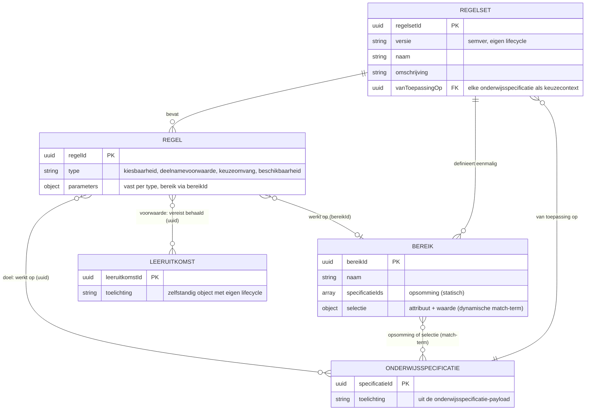

# Regelset als JSON-payload (keuzes rond onderwijsspecificaties)

Context: eerste concretisering van het [requirements-voorstel keuzes rond onderwijsspecificaties](keuze-requirements.md) (R1-R16). Scenario: [LR1](../leerroute-uitwerking/doc/persona_jochem.md "persona Jochem, leerroute 1") (Apothekersassistent). Niveau: concept-payload, waarden indicatief. Status: concept. Relateert aan: #84, #120.

## Inhoudsopgave

1. [Inleiding](#1-inleiding)
2. [Doel](#2-doel)
3. [Scope](#3-scope)
4. [Ontwerpkeuzes](#4-ontwerpkeuzes)
5. [Regeltypen en requirements-dekking](#5-regeltypen-en-requirements-dekking)
6. [Enumeraties (concept)](#6-enumeraties-concept)
7. [Structuur met attributen (ERD)](#7-structuur-met-attributen-erd)
8. [Uitwerking van de payload](#8-uitwerking-van-de-payload)
9. [Open vragen en signaleringen](#9-open-vragen-en-signaleringen)
10. [Gerelateerde uitwerkingen](#10-gerelateerde-uitwerkingen)

## 1. Inleiding

Het requirements-voorstel legt vast wat de standaard moet kunnen rond keuzes: kiesbaarheid bepalen, voorwaarden in behaalde leeruitkomsten, regels los van items, evalueerbaar met alleen sleutels. Dit document geeft die eisen een eerste JSON-vorm: de **regelset**.

De vorm volgt de payload-serie van de koppelingen-lijn (#119/#98): volledig Nederlands, plat met verwijzingen (uuid's), semver per object, geen geneste subbomen.

## 2. Doel

- Een eerste, toetsbare JSON-vorm van regelsets en regels, herleidbaar naar R1-R16.
- Een gesloten maar uitbreidbare set regeltypen, in plaats van een open expressietaal.
- Invoer voor de gegevensanalyse, de conformance-lijn (R6) en het OEAPI-profiel.

## 3. Scope

- [LR1](../leerroute-uitwerking/doc/persona_jochem.md "persona Jochem, leerroute 1"): de keuzedeelruimte van Apothekersassistent als voorbeeld. De vorm is generiek voor alle keuzes rond onderwijsspecificaties, op elk niveau (R16).
- Buiten scope: de evaluatie-implementatie (wie rekent wanneer), de studentgegevens die daarvoor nodig zijn (raakt ADR 0009), Vrijere keuzevormen zijn uitdrukbaar (§5.1) en deels al in het voorbeeld gebruikt (maximaal 2, precies 1); wat [LR1-3](../leerroute-uitwerking/doc/leerroute-uitwerking-lr1.md "leerroutes en persona's in het OEAPI-profiel") werkelijk vraagt bepaalt de vaststelling.

## 4. Ontwerpkeuzes

- **Generiek over alle onderwijsspecificaties (R16).** Een regelset kadert af wat een student kan kiezen en is toepasbaar op **elke** onderwijsspecificatie als keuzecontext. "Keuzedeel" is de mbo-specifieke invulling binnen [LR1-3](../leerroute-uitwerking/doc/leerroute-uitwerking-lr1.md "leerroutes en persona's in het OEAPI-profiel"); de regelvorm kent dat onderscheid niet.
- **Regels los van items (R2).** Regelsets staan in een eigen platte lijst. Een specificatie verwijst via `regelsetVerwijzingen` naar regelsets; de regelset verwijst via id's naar de items waarop hij werkt. Beide kanten kunnen wijzigen zonder de ander te raken.
- **Benoemde bereiken, eenmaal gedefinieerd.** Een regelset definieert zijn keuzegroepen één keer in `bereiken[]` (met eigen `bereikId` en naam); regels verwijzen met `bereikId`. Geen duplicatie van sets over regels, geen regel-naar-regel-verwijzing.
- **Bereik is opsomming of selectie.** Een bereik is óf een **opsomming** (`specificatieIds`, statisch: de set ligt vast) óf een **selectie** (`{attribuut, waarde}`, een match-term op attributen van onderwijsspecificaties, zoals `keuzedeelKlasse`). Een selectie is dynamisch: OC evalueert haar op het moment van gebruik, en een nieuwe specificatie met dat attribuut valt er direct onder. Het attribuut is een eigenschap van de specificatie; de regel spreekt er alleen een verwachting over uit.
- **Doel versus voorwaarde.** Een regel kent twee soorten verwijzingen die niet verward mogen worden: het **doel** (de onderwijsspecificatie waarop de regel werkt, bv. wat kiesbaar of beschikbaar wordt) en de **voorwaarde** (wat daarvoor vereist is). 
- **Voorwaarden altijd in behaalde leeruitkomsten (R7, R14).** Een deelnamevoorwaarde verwijst naar `vereisteLeeruitkomsten` met status `behaald`, nooit naar doorlopen specificaties. "Je moet dit vak hebben afgemaakt" en "je moet deze leeruitkomsten behaald hebben" kunnen op hetzelfde neerkomen, maar niet altijd; de standaardvorm is de leeruitkomst. Wie een vak-eis bedoelt, drukt die uit als de leeruitkomst(en) van dat vak.
- **Evalueerbaar met alleen sleutels (R15).** Geen regel heeft leeruitkomst- of specificatie-inhoud nodig: alle verwijzingen zijn uuid's plus een status. Dit maakt gebruiksprofielen mogelijk waarin een consument (zoals planning) alleen opaque sleutels ziet.
- **Gesloten, uitbreidbare typenset (R5, R6).** Regels hebben een `type` uit een geënumereerde set. Elk type heeft vaste parameters en een eenduidige evaluatie-semantiek; dat is toetsbaar (conformance). Nieuwe typen kunnen erbij zonder bestaande te breken; een open expressietaal is bewust vermeden.
- **Eigen identiteit en lifecycle.** `regelsetId` en `regelId` zijn uuid's; `versie` is semver. Identiteit los van versie, zoals in de payload-serie.
- **Requirements-traceerbaarheid in het document, niet in de payload.** De koppeling tussen regeltypen en R1-R16 staat in de tabel in §5; de payload draagt alleen de regels zelf.

## 5. Regeltypen en requirements-dekking

| Regeltype | Semantiek | Parameters | Dekt |
|---|---|---|---|
| `kiesbaarheid` | Welke onderwijsspecificaties kiesbaar zijn binnen een keuzecontext | `bereikId` | R1, R10 |
| `deelnamevoorwaarde` | Deelname vereist behaalde leeruitkomsten | `doelSpecificatieId`, `vereisteLeeruitkomsten[]` | R7, R8, R9, R14, R15 |
| `keuzeomvang` | Hoeveel er gekozen moet worden, binnen de hele keuzecontext of binnen een bereik | `omvang` (min en/of max, elk waarde + eenheid) of `aantal` (min en/of max), optioneel `bereikId` (zonder `bereikId` geldt de regel voor de hele context) | R5, R12, R16 |
| `beschikbaarheid` | Beperking tot locatie en/of periode | `doelSpecificatieId`, `locatieId`, `periode` | R3 |

De scenario's achter deze typen staan schematisch in het [requirements-voorstel §7.4](keuze-requirements.md) (dekkingstabel requirement naar figuur in §7.5); het voorbeeld in §8 is er de één-op-één vertaling van. Met `aantal` en `bereikId` op `keuzeomvang` zijn de vrijere vormen al uitdrukbaar: "kies 1 van 3", "1 tot 2 uit de plusgroep", "minimaal 20 EC uit specialisatie C1" (R5). Zie §5.1; het voorbeeld in §8 gebruikt ze (maximaal 2 uit de algemene set, precies 1 specialisatie, omvang-plafond).

### 5.1 Verenigbaarheid met de HO-scenario's

Het HO-initiatief (OEAPI technical working group, minor-modellering met knopen, bladeren en een regelset) hanteert een andere ontwerpfilosofie: daar wordt óók het verplichte deel in regels uitgedrukt. Bij ons drukt de **structuur** het vaste deel uit (onderdeel-van in de onderwijsspecificatiestructuur) en gelden regels **alleen voor keuzes**. De scenario's zijn daarmee verenigbaar zonder het model over te nemen:

| HO-scenario (TWG use cases) | Bij ons |
|---|---|
| 1: minor als geheel kiezen | Keuze van een keuzedeelprogramma (`kiesbaarheid`); inschrijfgranulariteit (op minor, op vak) is verbintenis- en aanbod-domein, geen regel |
| 2: minor met verplichte vakken | Structuur: onderdelen van het gekozen programma zijn via onderdeel-van verplicht; geen regel nodig |
| 3: verplichte vakken bij meerdere instellingen | Idem; cross-instelling volgt later (ADR 0008), de regelvorm is instelling-agnostisch (uuid's) |
| 4A: kies uit keuzevakken | `kiesbaarheid` (expliciete set) plus `keuzeomvang` met `aantal` |
| 4B en 4C: mix van verplicht en keuze | Structuur voor het verplichte deel, regels voor het keuzedeel |
| "kies 1 van 3", "1 tot 2 uit de plusgroep" | `keuzeomvang` met `aantal` {min, max} en `bereik` |
| "minimaal 20 EC uit specialisatie C1" | `keuzeomvang` met `omvang` {waarde, eenheid: EC} en `bereik` |

## 6. Enumeraties (concept)

| Veld | Toegestane waarden |
|---|---|
| `regels[].type` | `kiesbaarheid`, `deelnamevoorwaarde`, `keuzeomvang`, `beschikbaarheid` (open, uitbreidbaar) |
| `vereisteLeeruitkomsten[].status` | `behaald` (onderwijsresultaat op de leeruitkomst vastgesteld) |
| `bereiken[]` | per bereik: `bereikId` (uuid), `naam`, en óf `specificatieIds` (opsomming) óf `selectie` {attribuut, waarde} (match-term op specificatie-attributen) |
| `omvang` | object met optioneel `min` en `max`, elk {waarde, eenheid}; eenheid `SBU` of `EC` |
| `aantal` | object met `min` en `max` (gehele getallen; `min` = `max` voor "kies er precies N") |
| `versie` | semver `MAJOR.MINOR.PATCH` |

## 7. Structuur met attributen (ERD)



## 8. Uitwerking van de payload

[LR1](../leerroute-uitwerking/doc/persona_jochem.md "persona Jochem, leerroute 1"), indicatief. De specificatie- en leeruitkomst-id's zijn illustratief; na samenvoeging met de koppelingen-lijn (#119) verwijzen ze naar de id's uit de centrale onderwijsspecificatie-payload.

```json
{
  "regelsets": [
    {
      "regelsetId": "bd7902da-1a14-4ddb-ba36-308d9af27f74",
      "versie": "0.2.0",
      "naam": "Keuzeregels keuzedeelruimte Apothekersassistent (LR1)",
      "omschrijving": "Kadert af wat de student kan kiezen in de keuzedeelruimte (begroot 720 SBU): maximaal 2 uit de algemene groep, samen binnen de begrote omvang, plus precies 1 specialisatie uit 5. Voorwaarden zijn uitgedrukt in behaalde leeruitkomsten.",
      "vanToepassingOp": "c1664aa8-af81-4ac1-ad37-4f3e2184fe38",
      "bereiken": [
        {
          "bereikId": "7ebd6409-6d9b-43a8-a7da-bf8b0344d542",
          "naam": "Algemene groep",
          "selectie": {
            "attribuut": "keuzedeelKlasse",
            "waarde": "algemeen-verbredend"
          }
        },
        {
          "bereikId": "9aef757f-a035-45cc-a05f-fcce6f944919",
          "naam": "Specialisatiegroep",
          "specificatieIds": [
            "7dfef831-5552-459b-b00e-a59541d0eb03",
            "9a3146ab-62ab-4bf3-a7cf-43cd02c5380c",
            "a12ebd3f-4ac7-4a5b-a3d9-dcfd3bd4a55b",
            "68710b6f-be6c-4344-8da3-e7e2a01a613b",
            "5cba3907-9b5b-48a2-af2b-ea0ad9b3c1f7"
          ]
        }
      ],
      "regels": [
        {
          "regelId": "7f972c76-b001-41d8-a7b8-938564aaaf7f",
          "type": "kiesbaarheid",
          "parameters": {
            "bereikId": "7ebd6409-6d9b-43a8-a7da-bf8b0344d542"
          }
        },
        {
          "regelId": "4e09f11f-cf7c-4843-9d18-41defa0c5b44",
          "type": "keuzeomvang",
          "parameters": {
            "bereikId": "7ebd6409-6d9b-43a8-a7da-bf8b0344d542",
            "aantal": {
              "max": 2
            }
          }
        },
        {
          "regelId": "af41e88a-2dc6-4122-81d7-cce89c330732",
          "type": "keuzeomvang",
          "parameters": {
            "omvang": {
              "max": {
                "waarde": 720,
                "eenheid": "SBU"
              }
            }
          }
        },
        {
          "regelId": "839e49c8-b49d-4fa5-b8c8-44b6cb57043e",
          "type": "kiesbaarheid",
          "parameters": {
            "bereikId": "9aef757f-a035-45cc-a05f-fcce6f944919"
          }
        },
        {
          "regelId": "2fdd9b2e-a6af-40f1-8bfc-a6b51aa74e83",
          "type": "keuzeomvang",
          "parameters": {
            "bereikId": "9aef757f-a035-45cc-a05f-fcce6f944919",
            "aantal": {
              "min": 1,
              "max": 1
            }
          }
        },
        {
          "regelId": "2839cce6-8c64-4ee6-9dc2-30300c9e11f5",
          "type": "deelnamevoorwaarde",
          "parameters": {
            "doelSpecificatieId": "7dfef831-5552-459b-b00e-a59541d0eb03",
            "vereisteLeeruitkomsten": [
              {
                "leeruitkomstId": "f46bc824-8ff5-4a3d-bb21-47ebbba0942b",
                "status": "behaald"
              }
            ]
          }
        },
        {
          "regelId": "43764a77-8148-4173-832a-6ccf6c8bcb8f",
          "type": "beschikbaarheid",
          "parameters": {
            "doelSpecificatieId": "7dfef831-5552-459b-b00e-a59541d0eb03",
            "locatieId": "59807057-a6f1-473b-9084-114644557a68",
            "periode": {
              "start": "2027-02-01",
              "eind": "2027-04-16"
            }
          }
        }
      ]
    }
  ]
}
```

Dit voorbeeld is de vertaling van de schema's in [requirements §7.4](keuze-requirements.md) (7.4.1 keuzegroepen, 7.4.2 voorwaarde, 7.4.3 beschikbaarheid). Leeswijzer, in gewone taal: met deze specificatie en deze keuzedeelruimte (begroot 720 SBU) mag de student uit de **algemene set** (klasse algemeen-verbredend, momenteel zo'n 20 keuzedelen) er **maximaal 2** kiezen, waarbij de **totale omvang van de keuze** niet boven de begrote 720 SBU uitkomt. **Daarnaast specialiseert de student**: uit de 5 beschikbare specialisatie-keuzedelen kiest hij er **precies 1**. Voor de specialisatie Ruimtelijk inzicht geldt bovendien een deelnamevoorwaarde (leeruitkomst Wiskunde 1 behaald) en een beschikbaarheid (Utrecht, periode 3). Alle regels gelden samen (EN-semantiek); samen kaderen ze af wat deze student kan kiezen (R1, R8, R9). De twee keuzegroepen zijn éénmaal gedefinieerd als benoemd bereik: de algemene groep als **selectie** (match-term op `keuzedeelKlasse`, dynamisch), de specialisatiegroep als **opsomming** (statisch, 5 id's); de regels verwijzen met `bereikId`, zonder duplicatie.

## 8.1 Lifecycle en koppeling aan specificaties

- **De regelset is de eenheid van versionering.** `versie` (semver) leeft op de regelset; losse regels en bereiken versioneren niet zelfstandig. Elke wijziging aan een regel of bereik is een nieuwe regelset-versie. Identiteit (`regelsetId`) los van versie, zoals in de payload-serie.
- **Gepind in het manifest van de specificatie (R17).** Een specificatie verwijst via `regelsetVerwijzingen`; de **versie** wordt vastgelegd in het manifest van die specificatie, net als andere gepinde verwijzingen. Zo is per specificatieversie en per cohort herleidbaar welke keuzeregels golden: welke regels en programma's je volgde is, samen met het cohort van de instelling, mede bepalend voor het diploma.
- **Dynamische selectie versus versionering.** Een selectie-bereik legt het **criterium** vast, niet de uitkomst: een nieuwe specificatie met het attribuut valt eronder zonder regelset-wijziging. Wie de uitkomst wil verantwoorden (wat kon deze student op het keuzemoment kiezen) legt die bij de keuze vast. Signalering voor de gegevensanalyse en de SKS-koppeling.
- **Afstemming koppelingen-lijn (#119):** manifest-relatietype voor regelsets en de vastlegging in de individuele structuur volgen na samenvoeging.

## 9. Open vragen en signaleringen

- Evaluatie-input: welke studentgegevens (behaalde leeruitkomsten) heeft de evaluerende partij nodig, en van welk systeem (raakt ADR 0009)? De regel zelf is met sleutels evalueerbaar (R15); de behaald-status komt van buiten.
- Verplicht binnen een keuzecontext: nu drukt de structuur het verplichte deel uit. Mocht er een geval komen dat de structuur niet kan uitdrukken (verplichting die pas ná een keuze ontstaat buiten het gekozen programma), dan komt er een regeltype bij.
- Inschrijfgranulariteit uit de HO-scenario's (op minor, op vak, op alle vakken): verbintenis- en aanbod-domein, geen regel; afstemming volgt bij de SKS-koppeling.
- Combinatie-semantiek: hoe combineren meerdere regels in één regelset (nu: alle regels gelden, EN-semantiek). Vastleggen zodra er een geval is dat OF-semantiek vraagt.
- Versionering van regelsets versus de specificaties waarop ze werken: een regelset wijzigt onafhankelijk; wanneer een wijziging brekend is voor lopende keuzes volgt de lifecycle-lijn van de koppelingen-serie.
- Na samenvoeging met #119: id's laten verwijzen naar de centrale onderwijsspecificatie-payload en dit document opnemen in de koppelingspecificaties-structuur (`gedeeld/`).

## 10. Gerelateerde uitwerkingen

- [Requirements-voorstel keuzes rond onderwijsspecificaties](keuze-requirements.md) (R1-R16, de bron van dit document).
- Koppelingen-lijn (#119/#98, aparte branch): centrale onderwijsspecificatie-payload, ADR 0022 (resultaatbegrippen conform ROSA KOI), ADR 0023 (leeruitkomst-ids als opaque sleutels binnen OC-P&R).
- ADR 0009 (rolverdeling keuze versus resultaat en voortgang).
