# De opleiding van Jochem in het informatiemodel

Relateert aan: het [kaderscenario leerroute 1](https://github.com/Npuls-OKx/Public/blob/dev/Referentiemateriaal/kaderscenario's/leerroute-1-regulier.md) (persona Jochem, Apothekersassistent, cohort 2026), het architectuurkader van OKx, en het [informatiemodel OKx](informatiemodel.md). Gegenereerd uit `voorbeeld-lr1-regels.json`; gecontroleerd tegen `informatiemodel.json` op commit 0cf6e29 en `begrippen.json` op commit 8ebfaca.

## Leeswijzer

Dit document loopt stap voor stap door de instellingsreis van het kaderscenario en toont per stap wat er in het informatiemodel ontstaat en wat er tussen systemen beweegt, met de waarde voor Jochem erin. Het is een leeshulp op conceptueel niveau (MIM 1 en 2): geen payloads, geen endpoints, geen diensten. Eén instantie per objecttype toont het type, niet het aantal.

Elk beeld heeft een titel die zegt wat het toont; die staat in het beeld, als kop erboven (met een eigen anker in dit document) en in het regelregister achterin. Verwijs naar een beeld met zijn titel, en naar een regel met beeld en objecttype.

Vier termen, overal gelijk:

| Term | Betekenis |
|---|---|
| Objecttype | Element van de informatiemodelplaat (ArchiMate business object), met de plaatnaam letterlijk |
| Instantie | De waarde voor Jochem: een leesbare naam |
| Applicatiedienst | De ArchiMate-applicatiedienst op de hoofdplaat en in MORA; alleen context |
| Koppeling | Een pijl op hoofdplaat v1.7 tussen twee componenten; met de koppeling-ID uit Public waar die er is |

Twee soorten regels, in de vormtaal van de plaat:

- **Ontstaat**: een rol (geel, rolicoon) voert een processtap uit (geel, procesicoon) en daaruit ontstaan objecttypen (geel, objecticoon) met Jochems waarde. "Bestaat uit" is nesting; een relatielabel van de plaat staat tussen twee objecten of als verwijzing op een object dat aan een eerdere stap hangt. Een gestippelde rand is een aanname; grijs is een objecttype dat de plaat buiten de uitwisseling zet en dit voorbeeld toch meeneemt.
- **Stroomt** (blauwe rand): van welk systeem naar welk systeem gaat welk object, met de koppeling-ID of "zonder koppelingspecificatie", en de processtap waarna het gebeurt.

Een **verdieping** (zelfde rol en stap, met "verdieping" op de processtap) zoomt in op een regel erboven. Een paars objecttype komt van de conceptplaat "Informatiemodel Onderwijsontwerp" in het ArchiMate-model (een verdieping daaruit heeft ook een gestippelde rand en een chip): het laat zien waar de informatiemodelplaat kan groeien en telt niet mee in de bijlage en het invulblad.

Koppeling-ID's op hoofdplaat v1.7: OC-P&R is Onderwijscatalogus naar Planningssysteem; OC-P&R is Planningssysteem naar Onderwijscatalogus; OC-SIS is Onderwijscatalogus naar Kernregistratie systeem studenten (KRS); OC-SIS is Onderwijscatalogus naar Student volg systeem (SVS); OC-LMS is Onderwijscatalogus naar Leer management systeem (LMS). Een pijl die op de hoofdplaat staat maar geen koppelingspecificatie heeft, staat als "zonder koppelingspecificatie"; een stroom uit het kaderscenario zonder pijl op de hoofdplaat staat als "geen pijl op de hoofdplaat".

De fasenamen zijn de sectiekoppen "Fase 1" tot "Fase 8" van het kaderscenario. Het kaderscenario noemt fase 3 in de fasenlijst "Instroom, afstemming en plaatsing" en in de sectiekop "Instroom, intake en plaatsing"; hier geldt de sectiekop.

Wat hier staat is feedback, geen commitment: het voorbeeld beslist niets over het model. Per objecttype staan in de bijlage twee lege kolommen, "heet bij u" en "hangt bij u onder", voor wie het naast het eigen model legt.
## Fase 1: Kwalificatiekader analyseren en grofmazig ontwerpen

De fase in detail: [kaderscenario leerroute 1, fase 1](https://github.com/Npuls-OKx/Public/blob/dev/Referentiemateriaal/kaderscenario's/leerroute-1-regulier.md#fase-1--kwalificatiekader-analyseren-en-grofmazig-ontwerpen).

**Ontstaat:** `Kwalificatie dossier`, `Kwalificatie`, `Kerntaak`, `Werkproces`, `Examenplan`, `Summatieve resultaat structuur`, `Cohort / periode`, `Leeruitkomst`, `Competenties / Skills`, `Vaardigheid`, `Kennis`, `Inzicht`, `Opleiding specificatie`, `Opleidingsprogramma specificatie`, `Onderwijseenheid specificatie`, `Leeronderdeel specificatie`, `Keuzedeelruimte`, `Student keuze regelset`, `Keuzedeel`, `Toetsonderdeel specificatie`, `Examenonderdeelspecificatie`, `Examenonderdeel weging`, `Summatief Afrondingscriterium`. **Stroomt:** Curriculum ontwerptool naar Onderwijscatalogus. **MORA-hoofdproces:** Ontwikkelen.

### Het kwalificatiedossier ontleed

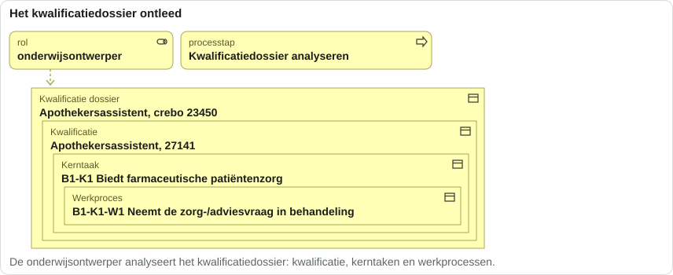

### Examenplan, eerste resultaatstructuur en cohort

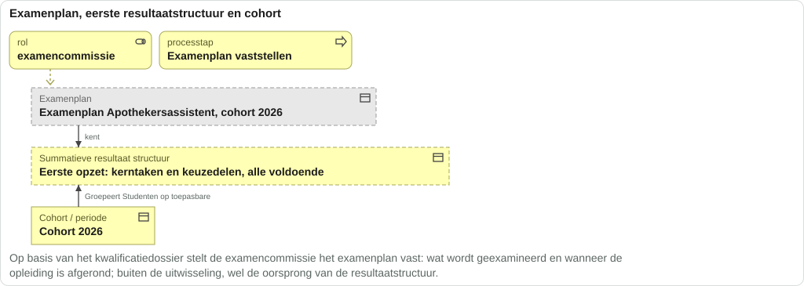

### Leeruitkomsten uit het dossier, in de stem van de instelling

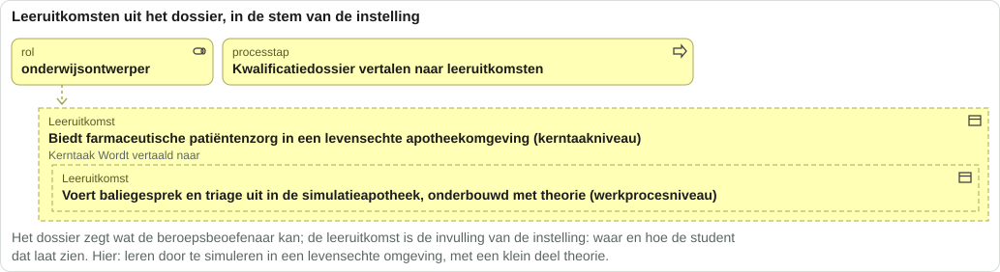

### Het onderwijsontwerp van de eenheid (conceptplaat)

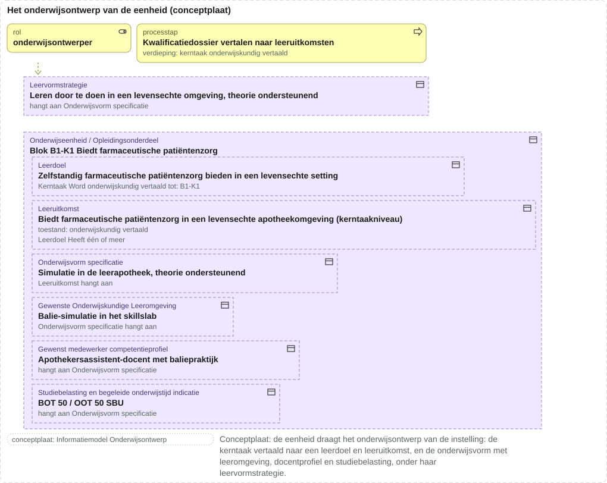

### De leeruitkomst in CompetentNL-skills

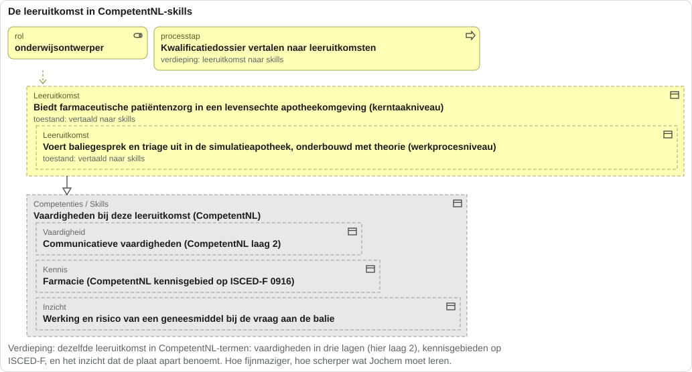

### De opleidingsspecificatie met programma, eenheden en keuzedeelruimte

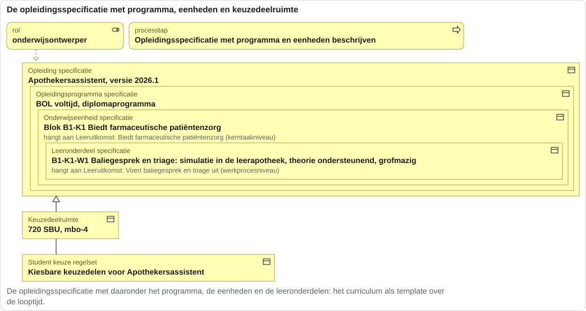

### Het keuzedeel als eigen programmaspecificatie

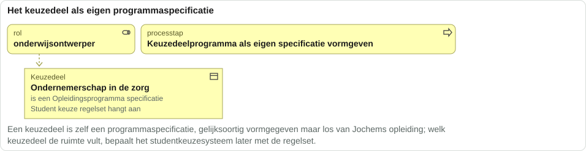

### Toetsonderdelen, wegingen en afrondingscriterium

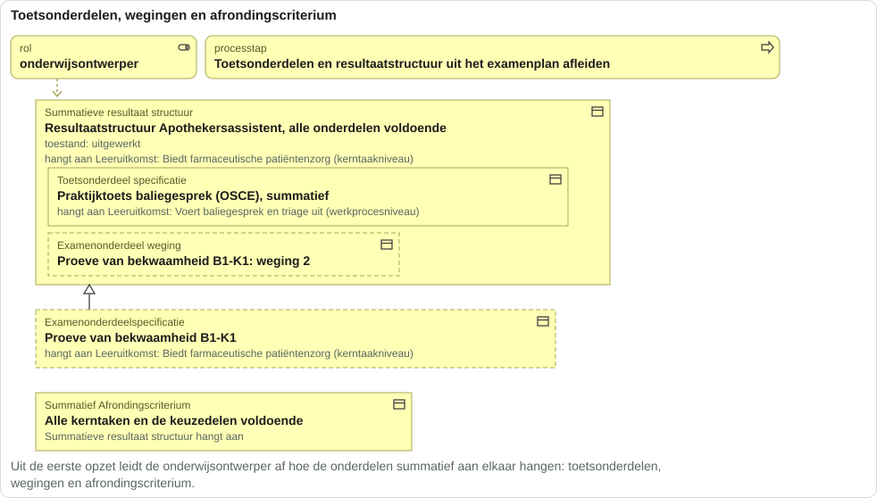

### De opleiding zoals ontworpen naar de catalogus

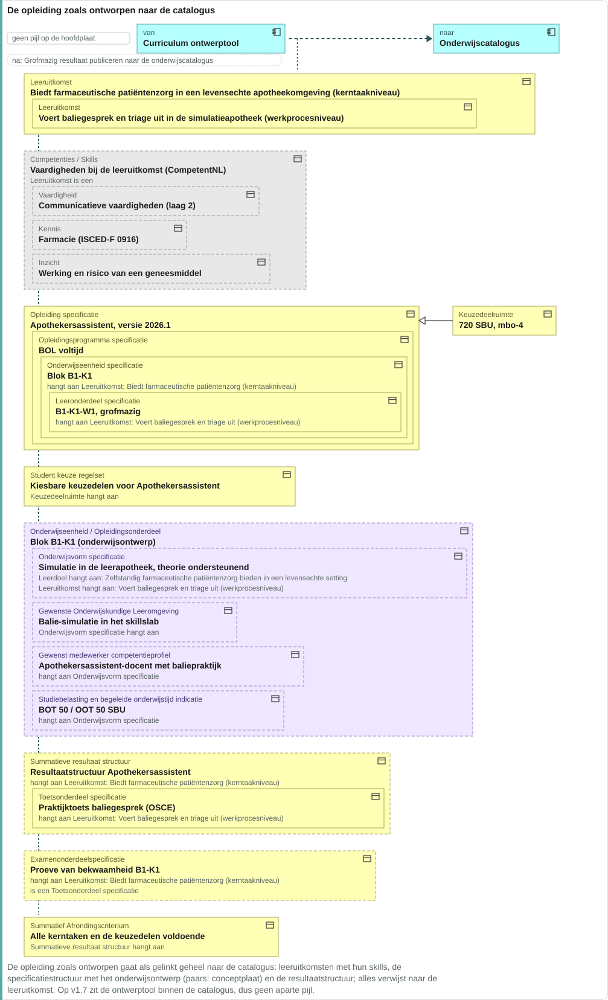

## Fase 2: Publiceren en planbaar maken

De fase in detail: [kaderscenario leerroute 1, fase 2](https://github.com/Npuls-OKx/Public/blob/dev/Referentiemateriaal/kaderscenario's/leerroute-1-regulier.md#fase-2--publiceren-en-planbaar-maken).

**Ontstaat:** `Opleidingsprogramma specificatie`, `Verzoek tot Aanbod / Intekening op specificatie`, `Opleidingsaanbod van Instelling`, `Opleidingaanbod`, `Opleidingsprogramma aanbod`, `Onderwijseenheid aanbod`, `Leergelegenheid`, `Toetsgelegenheid`. **Stroomt:** Onderwijscatalogus naar Planningssysteem; Planningssysteem naar Onderwijscatalogus. **MORA-hoofdproces:** Plannen en roosteren.

### De specificatie planbaar gemaakt

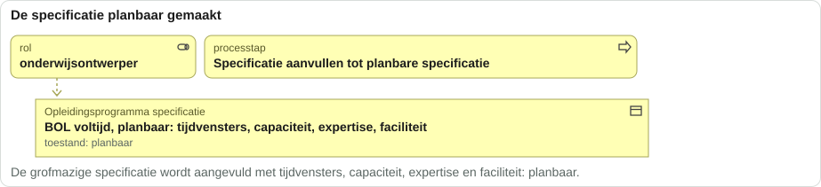

### Het verzoek om onderwijsaanbod

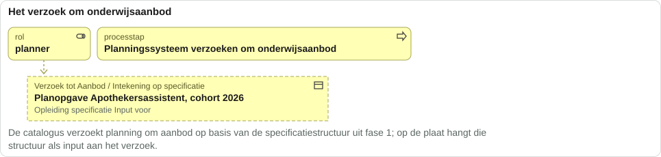

### Verzoek met specificatiestructuur en planbare waarden naar planning

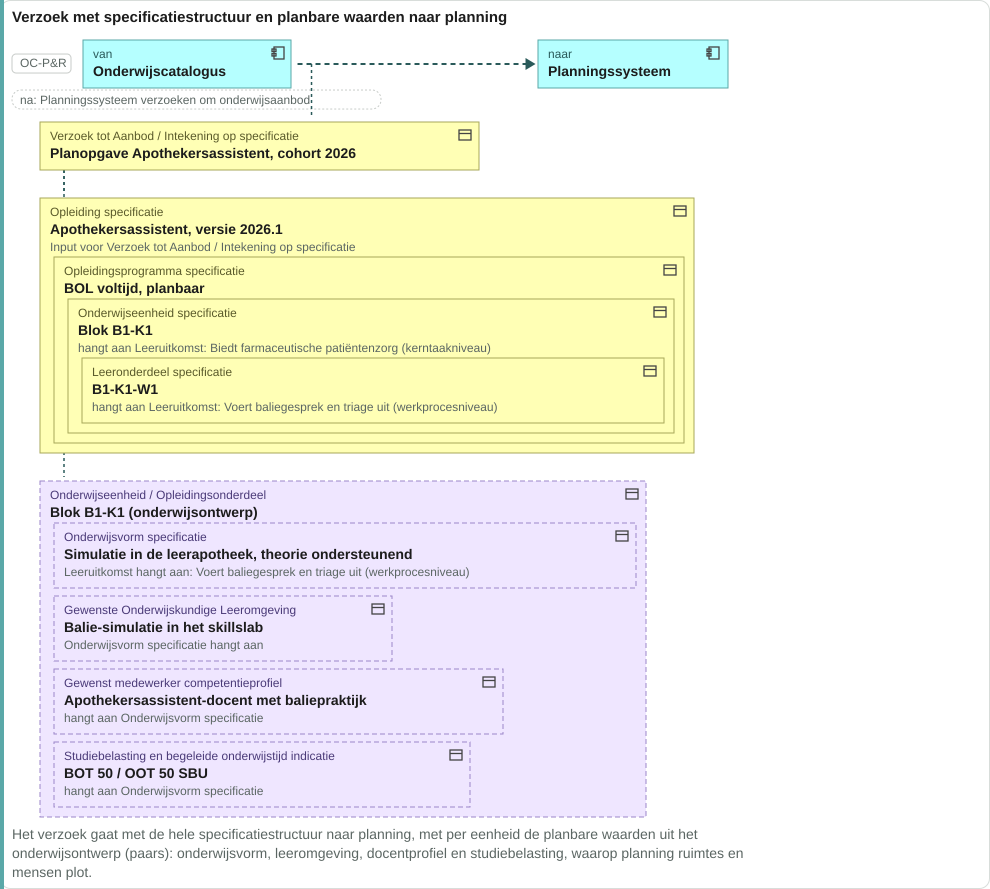

### Het aanbod gepland: opleiding, programma, eenheid, gelegenheid

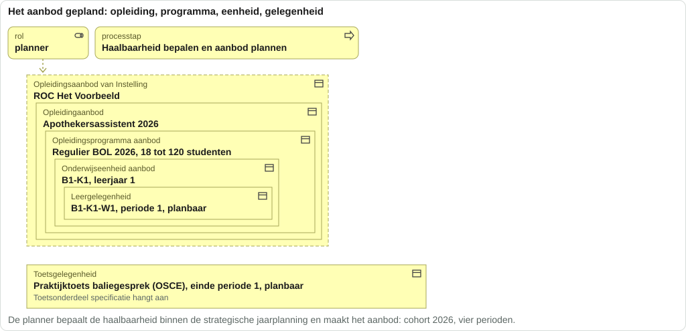

### Ruimtes en mensen op de specificatie (conceptplaat)

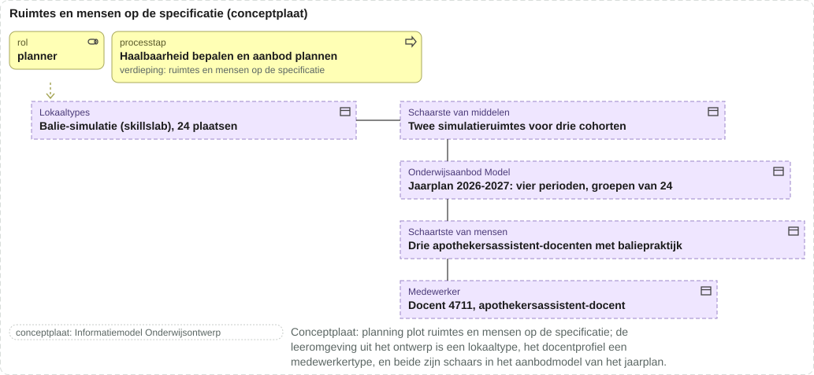

### Examenplanning uit de resultaatstructuur (conceptplaat)

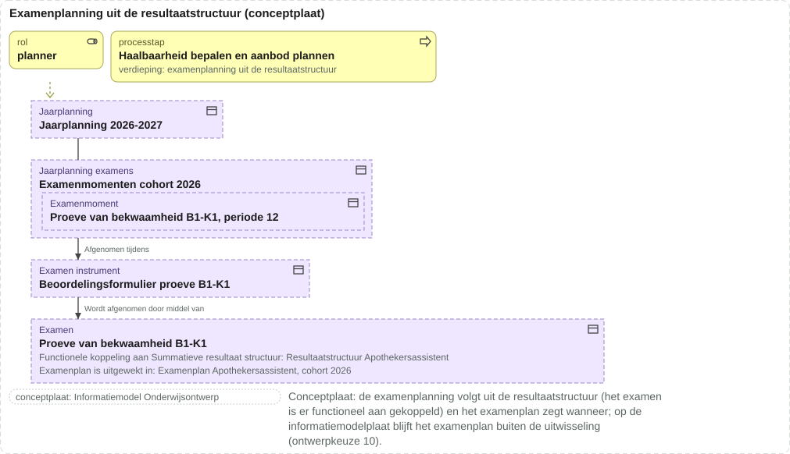

### Het geplande aanbod terug naar de catalogus

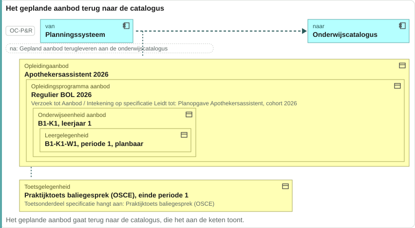

## Fase 3: Instroom, intake en plaatsing

De fase in detail: [kaderscenario leerroute 1, fase 3](https://github.com/Npuls-OKx/Public/blob/dev/Referentiemateriaal/kaderscenario's/leerroute-1-regulier.md#fase-3--instroom-intake-en-plaatsing).

**Ontstaat:** `Persoon`, `Aanmelding`, `Opleiding aanbod verbintenis`, `Opleidingsprogramma aanbod verbintenis`, `Student`, `Plaatsingsgroep`, `Verzoek tot Aanbod / Intekening op specificatie`, `Inschrijving`. **Stroomt:** Onderwijscatalogus naar Kernregistratie systeem studenten (KRS); Kernregistratie systeem studenten (KRS) naar AII (centraal aanmelden); AII (centraal aanmelden) naar Kernregistratie systeem studenten (KRS). **MORA-hoofdproces:** Informeren, aanmelden, intake en plaatsen.

### Aanmeldbaar aanbod naar de kernregistratie

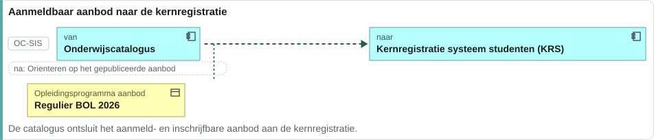

### Aanmeldbaar aanbod van de kernregistratie naar AII

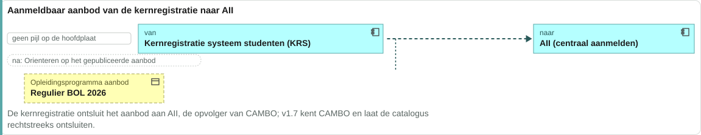

### Jochem meldt zich aan: aanmelding en verbintenissen

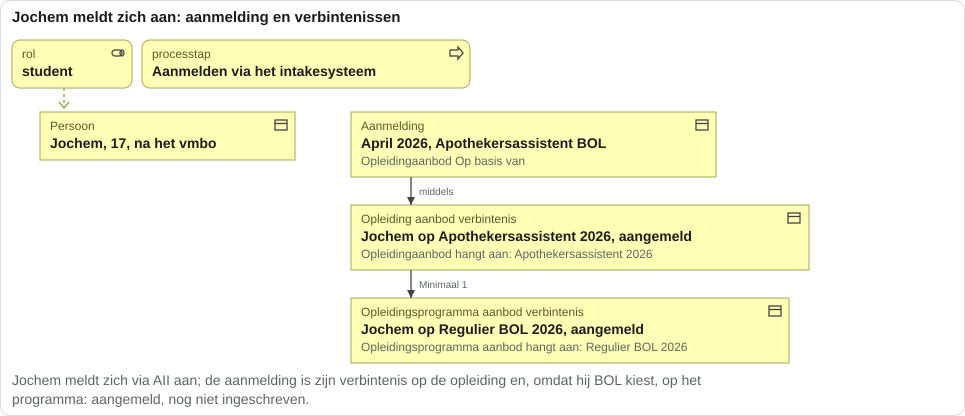

### Aanmelding met persoon en verbintenissen naar de kernregistratie

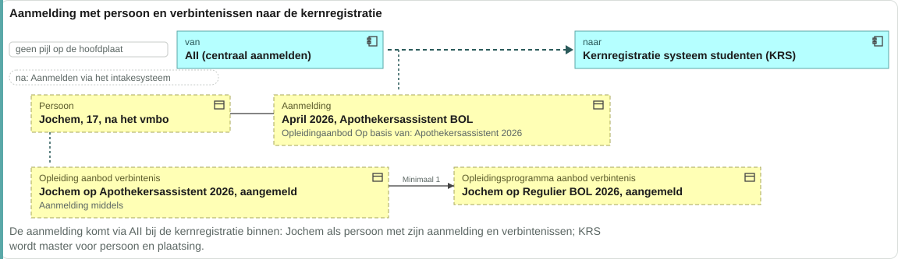

### Intake: student, plaatsingsgroep en eerste keuzedeelvoorkeur

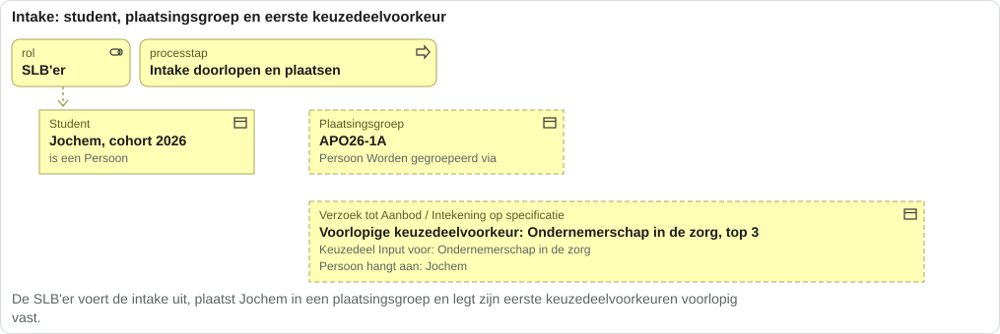

### Inschrijving: van aangemeld naar ingeschreven

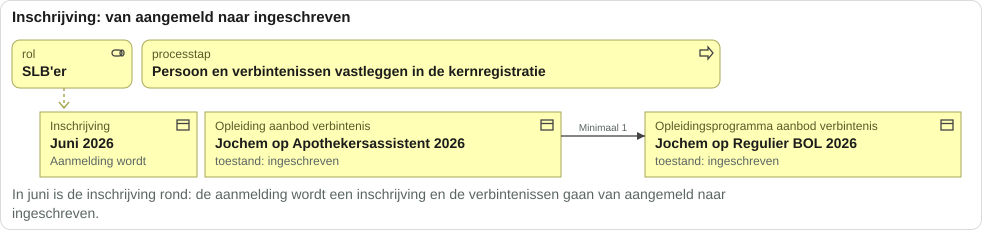

## Fase 4: Detailleren, roosteren en inschrijven

De fase in detail: [kaderscenario leerroute 1, fase 4](https://github.com/Npuls-OKx/Public/blob/dev/Referentiemateriaal/kaderscenario's/leerroute-1-regulier.md#fase-4--detailleren-roosteren-en-inschrijven).

**Ontstaat:** `Leeronderdeel specificatie`, `Les specificatie`, `Leergelegenheid`, `Lesgelegenheid`, `Medewerker`, `Onderwijseenheid aanbod verbintenis`, `Leergelegenheid verbintenis`, `Lesgelegenheid verbintenis`, `Opleidingsprogramma aanbod verbintenis`. **Stroomt:** Onderwijscatalogus naar Leer management systeem (LMS); Onderwijscatalogus naar Student volg systeem (SVS); Onderwijscatalogus naar Kernregistratie systeem studenten (KRS); Kernregistratie systeem studenten (KRS) naar Planningssysteem; Planningssysteem naar Roostersysteem; Roostersysteem naar Kernregistratie systeem studenten (KRS); Kernregistratie systeem studenten (KRS) naar Leer management systeem (LMS). **MORA-hoofdproces:** Plannen en roosteren.

### Het leeronderdeel fijnmazig: lessenreeks en les

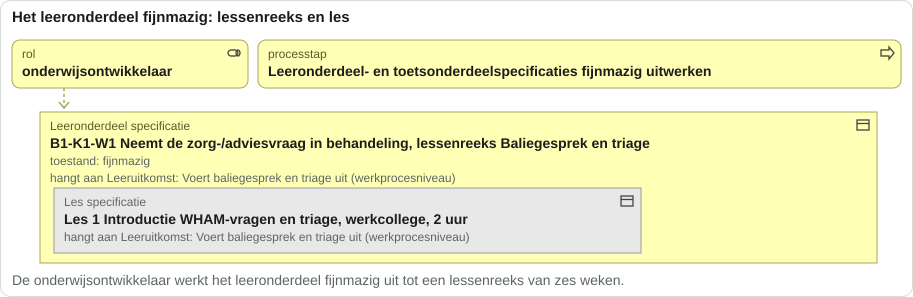

### Detailspecificaties naar het LMS

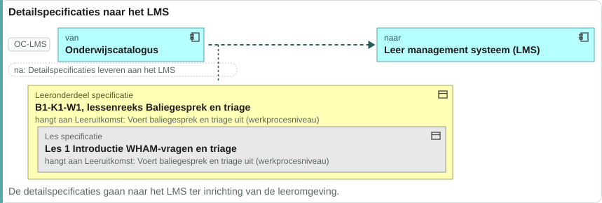

### Resultaatstructuur naar het studentvolgsysteem

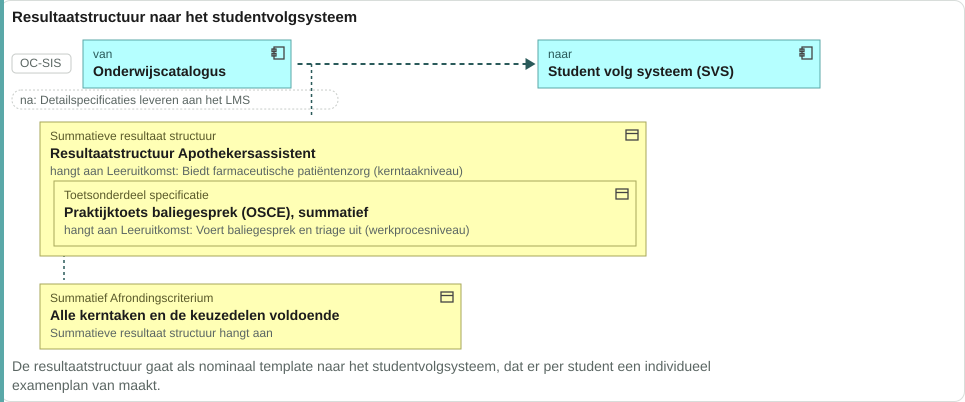

### Resultaatstructuur naar de kernregistratie

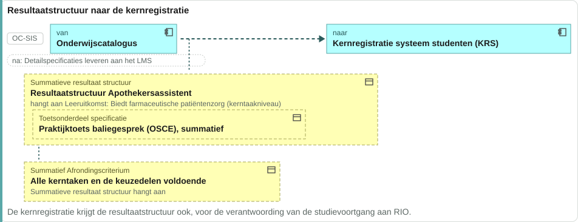

### Plaatsingsgroepen naar planning

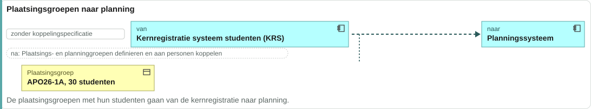

### Te roosteren leergelegenheden naar het roostersysteem

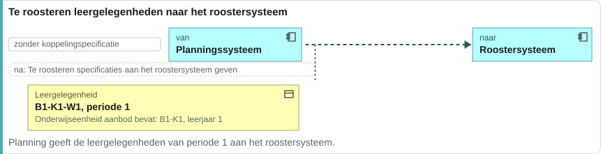

### Roosteren: lesgelegenheid, lokaal en docent

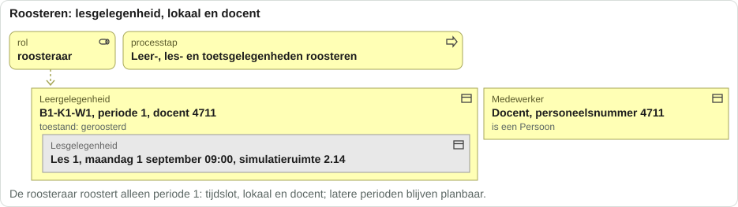

### Het rooster naar de kernregistratie

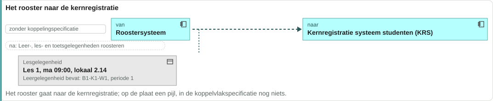

### Jochems verbintenissen op de geroosterde gelegenheden

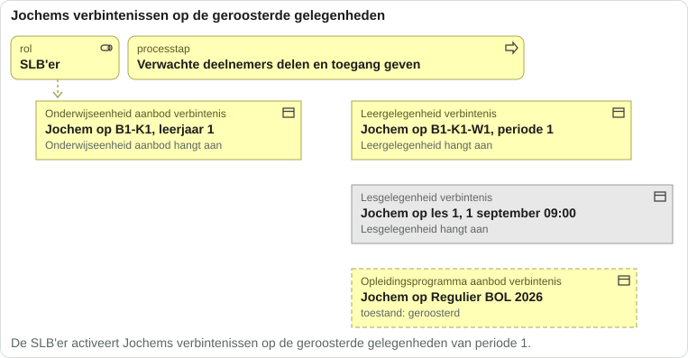

### Student, verbintenissen en groep naar het LMS

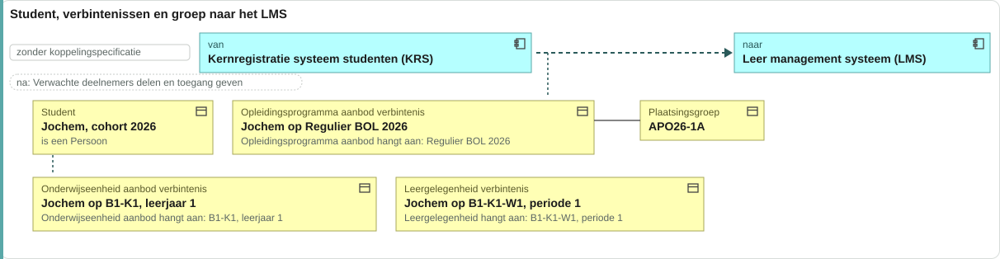

## Fase 5: Onderwijs uitvoeren en voortgang begeleiden

De fase in detail: [kaderscenario leerroute 1, fase 5](https://github.com/Npuls-OKx/Public/blob/dev/Referentiemateriaal/kaderscenario's/leerroute-1-regulier.md#fase-5--onderwijs-uitvoeren-en-voortgang-begeleiden).

**Ontstaat:** `Lesgelegenheid verbintenis`, `Aanwezigheid`, `Lesgelegenheid resultaat`, `Toetsgelegenheid verbintenis`, `Formatieve resultaat structuur`, `Toetsonderdeel weging`, `Toetsgelegenheid resultaat`, `Formatief resultaat`, `Formatieve beoordeling`, `Persoonlijke ontwikkeling`, `Leergelegenheid resultaat`, `Onderwijseenheid resultaat`. **Stroomt:** Leer management systeem (LMS) naar Student volg systeem (SVS). **MORA-hoofdproces:** Verzorgen en begeleiden.

### Les gevolgd: aanwezigheid en lesresultaat

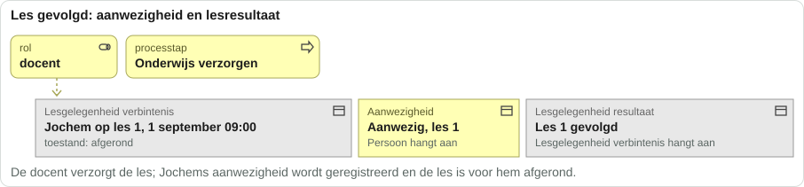

### Toetsmoment gepland: verbintenis op de toetsgelegenheid

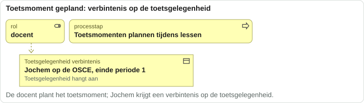

### Formatieve voortgang: structuur, resultaten en beoordeling

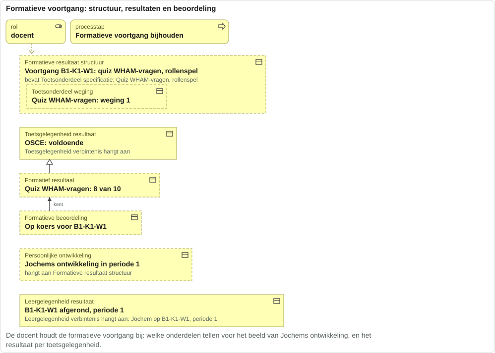

### Formatieve resultaten van het LMS naar het studentvolgsysteem

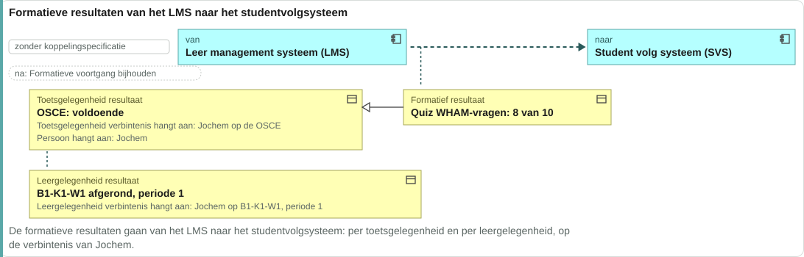

### Studiebeeld: het resultaat per eenheid

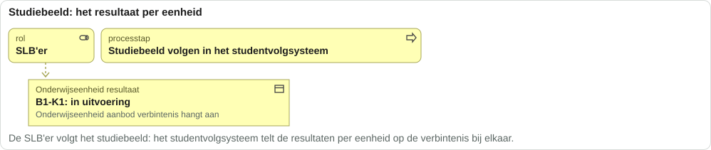

## Fase 6: Organiseren van keuzemomenten

De fase in detail: [kaderscenario leerroute 1, fase 6](https://github.com/Npuls-OKx/Public/blob/dev/Referentiemateriaal/kaderscenario's/leerroute-1-regulier.md#fase-6--organiseren-van-keuzemomenten).

**Ontstaat:** `Keuzedeelaanbod`, `Keuzedeel aanbod verbintenis`. **Stroomt:** Onderwijscatalogus naar Student Keuze Systeem (SKS); Student Keuze Systeem (SKS) naar Planningssysteem; Planningssysteem naar Onderwijscatalogus; Student Keuze Systeem (SKS) naar Kernregistratie systeem studenten (KRS). **MORA-hoofdproces:** Plannen en roosteren.

### Keuzedeelaanbod ontsloten

### Keuzedeelaanbod, specificatie en regels naar het studentkeuzesysteem

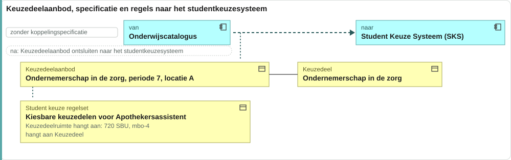

### Jochems voorkeur: verbintenis op het keuzedeelaanbod

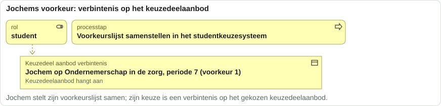

### Keuzestelling naar planning

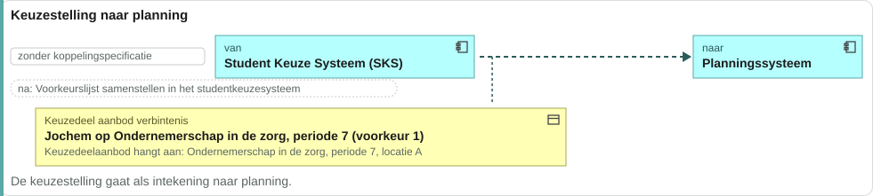

### Definitieve keuzes verwerkt naar groepen en capaciteit

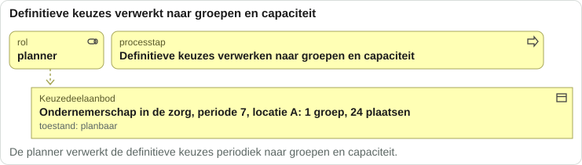

### Geactualiseerd keuzedeelaanbod terug naar de catalogus

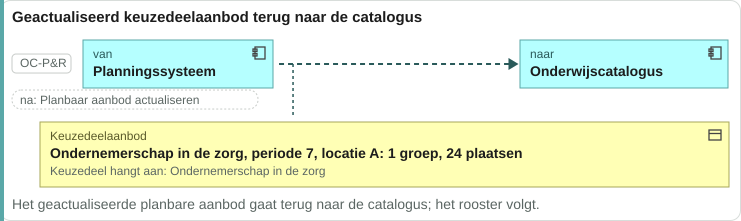

### Formele inschrijving op het keuzedeel

### Keuzedeelverbintenis naar de kernregistratie

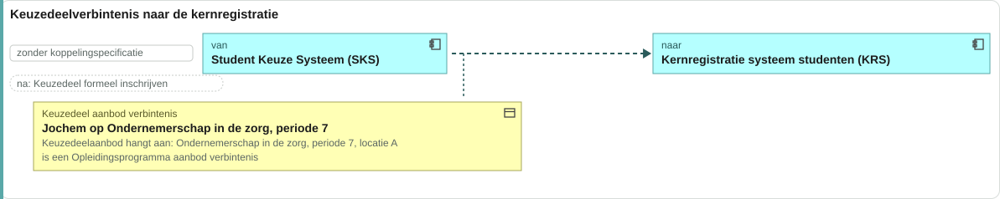

## Fase 7: Bijsturen planning en aanbod

De fase in detail: [kaderscenario leerroute 1, fase 7](https://github.com/Npuls-OKx/Public/blob/dev/Referentiemateriaal/kaderscenario's/leerroute-1-regulier.md#fase-7--bijsturen-planning-en-aanbod).

**Ontstaat:** `Plaatsingsgroep`, `Onderwijseenheid aanbod verbintenis`, `Onderwijseenheid aanbod`. **Stroomt:** Kernregistratie systeem studenten (KRS) naar Planningssysteem; Planningssysteem naar Onderwijscatalogus; Planningssysteem naar Roostersysteem. **MORA-hoofdproces:** Plannen en roosteren.

### Afwijkingen verzameld in een planninggroep

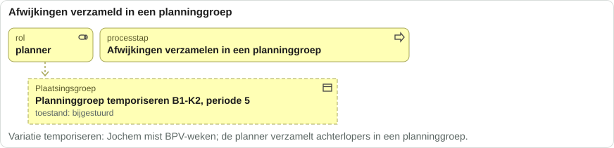

### Bestaande verbintenis geannuleerd

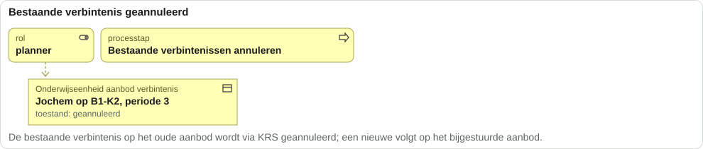

### Planninggroep van de kernregistratie naar planning

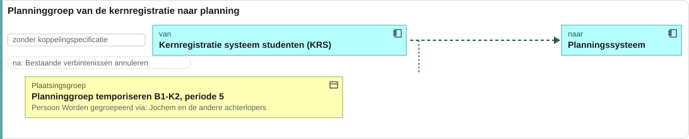

### Nieuw aanbod voor de planninggroep

### Bijgestuurd aanbod naar de catalogus

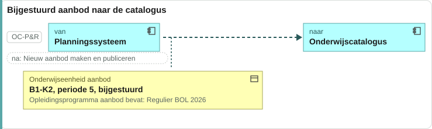

### Nieuwe leergelegenheden naar het roostersysteem

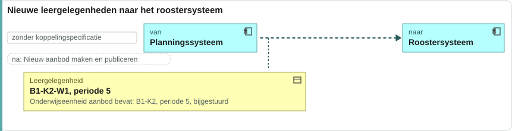

## Fase 8: Examineren, vaststellen en diplomeren

De fase in detail: [kaderscenario leerroute 1, fase 8](https://github.com/Npuls-OKx/Public/blob/dev/Referentiemateriaal/kaderscenario's/leerroute-1-regulier.md#fase-8--examineren-vaststellen-en-diplomeren).

**Ontstaat:** `Examengelegenheid`, `Examengelegenheid verbintenis`, `Examengelegenheid resultaat`, `Summatief resultaat`, `Summatieve beoordeling`, `Opleidingsprogramma resultaat`, `Keuzedeel resultaat`, `Opleiding aanbod resultaat`, `Waarde document (diploma / certificaat)`. **Stroomt:** Toets- en examen afname systeem naar Student volg systeem (SVS); Student volg systeem (SVS) naar Kernregistratie systeem studenten (KRS). **MORA-hoofdproces:** Examens uitvoeren en vaststellen; diplomeren.

### Examengelegenheid uit de examenspecificatie

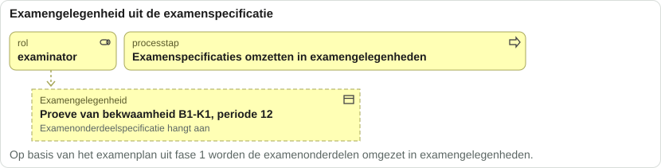

### Kandidatenlijst: verbintenis op de examengelegenheid

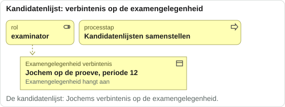

### Zitting: het examenresultaat

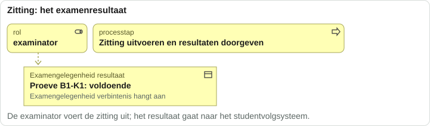

### Examenresultaat naar het studentvolgsysteem

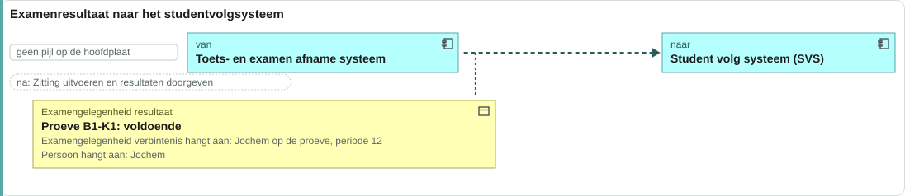

### Summatief vastgesteld: resultaten en beoordeling

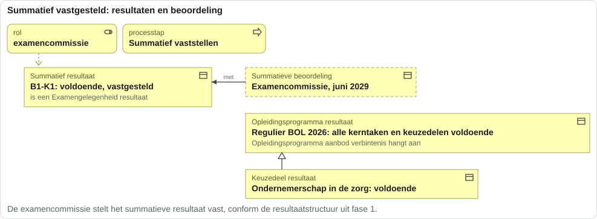

### Vaststelling naar de kernregistratie

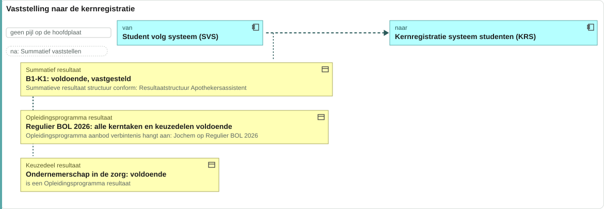

### Gediplomeerd: opleidingsresultaat en diploma

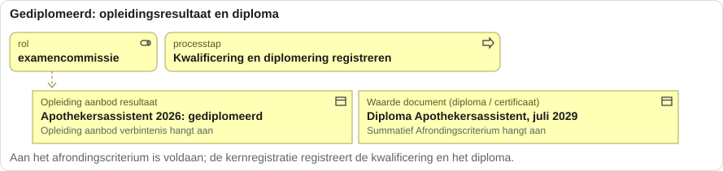

## Bijlage: alle objecttypen per begrippenfamilie

Per objecttype de instantie voor Jochem, de fase waarin hij verschijnt, de status van de definitie in de begrippenlijst en het OEAPI-object uit de mapping. De laatste twee kolommen zijn voor de lezer.

### Kwalificatiekader mbo

| Objecttype | Beeld | Jochem | Fase | Aanname | Definitie | OEAPI | Heet bij u | Hangt bij u onder |
|---|---|---|---|---|---|---|---|---|
| Kerntaak | Het kwalificatiedossier ontleed | B1-K1 Biedt farmaceutische patiëntenzorg | 1 |  | ja | geen equivalent | | |
| Kwalificatie | Het kwalificatiedossier ontleed | Apothekersassistent, 27141 | 1 |  | ja | geen equivalent | | |
| Kwalificatie dossier | Het kwalificatiedossier ontleed | Apothekersassistent, crebo 23450 | 1 |  | ja | geen equivalent | | |
| Werkproces | Het kwalificatiedossier ontleed | B1-K1-W1 Neemt de zorg-/adviesvraag in behandeling | 1 |  | ja | geen equivalent | | |

### Onderwijskundig kader instelling

| Objecttype | Beeld | Jochem | Fase | Aanname | Definitie | OEAPI | Heet bij u | Hangt bij u onder |
|---|---|---|---|---|---|---|---|---|
| Competenties / Skills | De leeruitkomst in CompetentNL-skills | Vaardigheden bij deze leeruitkomst (CompetentNL) | 1 | ja | nog te definieren | geen equivalent | | |
| Inzicht | De leeruitkomst in CompetentNL-skills | Werking en risico van een geneesmiddel bij de vraag aan de balie | 1 | ja | nog te definieren | geen equivalent | | |
| Kennis | De leeruitkomst in CompetentNL-skills | Farmacie (CompetentNL kennisgebied op ISCED-F 0916) | 1 | ja | nog te definieren | geen equivalent | | |
| Leeruitkomst | Leeruitkomsten uit het dossier, in de stem van de instelling | Biedt farmaceutische patiëntenzorg in een levensechte apotheekomgeving (kerntaakniveau) | 1 | ja | ja | LearningOutcome | | |
| Vaardigheid | De leeruitkomst in CompetentNL-skills | Communicatieve vaardigheden (CompetentNL laag 2) | 1 | ja | nog te definieren | geen equivalent | | |

### Onderwijsspecificatie

| Objecttype | Beeld | Jochem | Fase | Aanname | Definitie | OEAPI | Heet bij u | Hangt bij u onder |
|---|---|---|---|---|---|---|---|---|
| Examenonderdeelspecificatie | Toetsonderdelen, wegingen en afrondingscriterium | Proeve van bekwaamheid B1-K1 | 1 | ja | ja | TestComponent | | |
| Keuzedeel | Het keuzedeel als eigen programmaspecificatie | Ondernemerschap in de zorg | 1 |  | nog te definieren | Programme | | |
| Keuzedeelruimte | De opleidingsspecificatie met programma, eenheden en keuzedeelruimte | 720 SBU, mbo-4 | 1 |  | ja | Programme | | |
| Leeronderdeel specificatie | De opleidingsspecificatie met programma, eenheden en keuzedeelruimte | B1-K1-W1 Baliegesprek en triage: simulatie in de leerapotheek, theorie ondersteunend, grofmazig | 1 |  | ja | LearningComponent | | |
| Les specificatie | Het leeronderdeel fijnmazig: lessenreeks en les | Les 1 Introductie WHAM-vragen en triage, werkcollege, 2 uur | 4 |  | ja | LearningComponent | | |
| Onderwijseenheid specificatie | De opleidingsspecificatie met programma, eenheden en keuzedeelruimte | Blok B1-K1 Biedt farmaceutische patiëntenzorg | 1 |  | ja | Course | | |
| Opleiding specificatie | De opleidingsspecificatie met programma, eenheden en keuzedeelruimte | Apothekersassistent, versie 2026.1 | 1 |  | nog te definieren | Programme | | |
| Opleidingsprogramma specificatie | De opleidingsspecificatie met programma, eenheden en keuzedeelruimte | BOL voltijd, diplomaprogramma | 1 |  | ja | Programme | | |
| Student keuze regelset | De opleidingsspecificatie met programma, eenheden en keuzedeelruimte | Kiesbare keuzedelen voor Apothekersassistent | 1 |  | nog te definieren | geen equivalent | | |
| Toetsonderdeel specificatie | Toetsonderdelen, wegingen en afrondingscriterium | Praktijktoets baliegesprek (OSCE), summatief | 1 |  | ja | TestComponent | | |

### Onderwijsaanbod

| Objecttype | Beeld | Jochem | Fase | Aanname | Definitie | OEAPI | Heet bij u | Hangt bij u onder |
|---|---|---|---|---|---|---|---|---|
| Examengelegenheid | Examengelegenheid uit de examenspecificatie | Proeve van bekwaamheid B1-K1, periode 12 | 8 | ja | ja | TestComponentOffering | | |
| Keuzedeelaanbod | Keuzedeelaanbod ontsloten | Ondernemerschap in de zorg, periode 7, locatie A | 6 | ja | nog te definieren | ProgrammeOffering | | |
| Leergelegenheid | Het aanbod gepland: opleiding, programma, eenheid, gelegenheid | B1-K1-W1, periode 1, planbaar | 2 |  | nog te definieren | LearningComponentOffering | | |
| Lesgelegenheid | Roosteren: lesgelegenheid, lokaal en docent | Les 1, maandag 1 september 09:00, simulatieruimte 2.14 | 4 |  | nog te definieren | LearningComponentOffering | | |
| Onderwijseenheid aanbod | Het aanbod gepland: opleiding, programma, eenheid, gelegenheid | B1-K1, leerjaar 1 | 2 |  | nog te definieren | CourseOffering | | |
| Opleidingaanbod | Het aanbod gepland: opleiding, programma, eenheid, gelegenheid | Apothekersassistent 2026 | 2 |  | ja | ProgrammeOffering | | |
| Opleidingsaanbod van Instelling | Het aanbod gepland: opleiding, programma, eenheid, gelegenheid | ROC Het Voorbeeld | 2 | ja | ja | geen equivalent | | |
| Opleidingsprogramma aanbod | Het aanbod gepland: opleiding, programma, eenheid, gelegenheid | Regulier BOL 2026, 18 tot 120 studenten | 2 |  | nog te definieren | ProgrammeOffering | | |
| Toetsgelegenheid | Het aanbod gepland: opleiding, programma, eenheid, gelegenheid | Praktijktoets baliegesprek (OSCE), einde periode 1, planbaar | 2 |  | ja | TestComponentOffering | | |

### Onderwijsverbintenis

| Objecttype | Beeld | Jochem | Fase | Aanname | Definitie | OEAPI | Heet bij u | Hangt bij u onder |
|---|---|---|---|---|---|---|---|---|
| Examengelegenheid verbintenis | Kandidatenlijst: verbintenis op de examengelegenheid | Jochem op de proeve, periode 12 | 8 |  | ja | TestComponentOfferingAssociation | | |
| Inschrijving | Inschrijving: van aangemeld naar ingeschreven | Juni 2026 | 3 |  | ja | geen equivalent | | |
| Keuzedeel aanbod verbintenis | Jochems voorkeur: verbintenis op het keuzedeelaanbod | Jochem op Ondernemerschap in de zorg, periode 7 (voorkeur 1) | 6 |  | nog te definieren | ProgrammeOfferingAssociation | | |
| Leergelegenheid verbintenis | Jochems verbintenissen op de geroosterde gelegenheden | Jochem op B1-K1-W1, periode 1 | 4 |  | nog te definieren | LearningComponentOfferingAssociation | | |
| Lesgelegenheid verbintenis | Jochems verbintenissen op de geroosterde gelegenheden | Jochem op les 1, 1 september 09:00 | 4 |  | nog te definieren | LearningComponentOfferingAssociation | | |
| Onderwijseenheid aanbod verbintenis | Jochems verbintenissen op de geroosterde gelegenheden | Jochem op B1-K1, leerjaar 1 | 4 |  | nog te definieren | CourseOfferingAssociation | | |
| Opleiding aanbod verbintenis | Jochem meldt zich aan: aanmelding en verbintenissen | Jochem op Apothekersassistent 2026, aangemeld | 3 |  | nog te definieren | ProgrammeOfferingAssociation | | |
| Opleidingsprogramma aanbod verbintenis | Jochem meldt zich aan: aanmelding en verbintenissen | Jochem op Regulier BOL 2026, aangemeld | 3 |  | nog te definieren | ProgrammeOfferingAssociation | | |
| Toetsgelegenheid verbintenis | Toetsmoment gepland: verbintenis op de toetsgelegenheid | Jochem op de OSCE, einde periode 1 | 5 |  | ja | TestComponentOfferingAssociation | | |

### Onderwijsresultaat

| Objecttype | Beeld | Jochem | Fase | Aanname | Definitie | OEAPI | Heet bij u | Hangt bij u onder |
|---|---|---|---|---|---|---|---|---|
| Aanwezigheid | Les gevolgd: aanwezigheid en lesresultaat | Aanwezig, les 1 | 5 |  | nog te definieren | geen equivalent | | |
| Examengelegenheid resultaat | Zitting: het examenresultaat | Proeve B1-K1: voldoende | 8 |  | nog te definieren | Result | | |
| Formatief resultaat | Formatieve voortgang: structuur, resultaten en beoordeling | Quiz WHAM-vragen: 8 van 10 | 5 | ja | ja | geen equivalent | | |
| Formatieve beoordeling | Formatieve voortgang: structuur, resultaten en beoordeling | Op koers voor B1-K1-W1 | 5 | ja | ja | geen equivalent | | |
| Keuzedeel resultaat | Summatief vastgesteld: resultaten en beoordeling | Ondernemerschap in de zorg: voldoende | 8 |  | nog te definieren | Result | | |
| Leergelegenheid resultaat | Formatieve voortgang: structuur, resultaten en beoordeling | B1-K1-W1 afgerond, periode 1 | 5 |  | nog te definieren | Result | | |
| Lesgelegenheid resultaat | Les gevolgd: aanwezigheid en lesresultaat | Les 1 gevolgd | 5 |  | nog te definieren | Result | | |
| Onderwijseenheid resultaat | Studiebeeld: het resultaat per eenheid | B1-K1: in uitvoering | 5 |  | nog te definieren | Result | | |
| Opleiding aanbod resultaat | Gediplomeerd: opleidingsresultaat en diploma | Apothekersassistent 2026: gediplomeerd | 8 |  | nog te definieren | Result | | |
| Opleidingsprogramma resultaat | Summatief vastgesteld: resultaten en beoordeling | Regulier BOL 2026: alle kerntaken en keuzedelen voldoende | 8 |  | nog te definieren | Result | | |
| Summatief resultaat | Summatief vastgesteld: resultaten en beoordeling | B1-K1: voldoende, vastgesteld | 8 |  | ja | geen equivalent | | |
| Summatieve beoordeling | Summatief vastgesteld: resultaten en beoordeling | Examencommissie, juni 2029 | 8 | ja | ja | geen equivalent | | |
| Toetsgelegenheid resultaat | Formatieve voortgang: structuur, resultaten en beoordeling | OSCE: voldoende | 5 |  | nog te definieren | Result | | |

### Resultaatstructuur

| Objecttype | Beeld | Jochem | Fase | Aanname | Definitie | OEAPI | Heet bij u | Hangt bij u onder |
|---|---|---|---|---|---|---|---|---|
| Examenonderdeel weging | Toetsonderdelen, wegingen en afrondingscriterium | Proeve van bekwaamheid B1-K1: weging 2 | 1 | ja | nog te definieren | geen equivalent | | |
| Formatieve resultaat structuur | Formatieve voortgang: structuur, resultaten en beoordeling | Voortgang B1-K1-W1: quiz WHAM-vragen, rollenspel | 5 | ja | ja | geen equivalent | | |
| Persoonlijke ontwikkeling | Formatieve voortgang: structuur, resultaten en beoordeling | Jochems ontwikkeling in periode 1 | 5 | ja | nog te definieren | geen equivalent | | |
| Summatief Afrondingscriterium | Toetsonderdelen, wegingen en afrondingscriterium | Alle kerntaken en de keuzedelen voldoende | 1 |  | nog te definieren | geen equivalent | | |
| Summatieve resultaat structuur | Examenplan, eerste resultaatstructuur en cohort | Eerste opzet: kerntaken en keuzedelen, alle voldoende | 1 | ja | ja | geen equivalent | | |
| Toetsonderdeel weging | Formatieve voortgang: structuur, resultaten en beoordeling | Quiz WHAM-vragen: weging 1 | 5 | ja | nog te definieren | geen equivalent | | |

### Buiten de kolommen (persoon, groep, cohort, verzoek)

| Objecttype | Beeld | Jochem | Fase | Aanname | Definitie | OEAPI | Heet bij u | Hangt bij u onder |
|---|---|---|---|---|---|---|---|---|
| Aanmelding | Jochem meldt zich aan: aanmelding en verbintenissen | April 2026, Apothekersassistent BOL | 3 |  | ja | geen equivalent | | |
| Cohort / periode | Examenplan, eerste resultaatstructuur en cohort | Cohort 2026 | 1 |  | ja | geen equivalent | | |
| Examenplan | Examenplan, eerste resultaatstructuur en cohort | Examenplan Apothekersassistent, cohort 2026 | 1 | ja | ja | geen equivalent | | |
| Medewerker | Roosteren: lesgelegenheid, lokaal en docent | Docent, personeelsnummer 4711 | 4 |  | ja | geen equivalent | | |
| Persoon | Jochem meldt zich aan: aanmelding en verbintenissen | Jochem, 17, na het vmbo | 3 |  | nog te definieren | Person | | |
| Plaatsingsgroep | Intake: student, plaatsingsgroep en eerste keuzedeelvoorkeur | APO26-1A | 3 | ja | nog te definieren | Group | | |
| Student | Intake: student, plaatsingsgroep en eerste keuzedeelvoorkeur | Jochem, cohort 2026 | 3 |  | ja | geen equivalent | | |
| Verzoek tot Aanbod / Intekening op specificatie | Het verzoek om onderwijsaanbod | Planopgave Apothekersassistent, cohort 2026 | 2 | ja | ja | geen equivalent | | |
| Waarde document (diploma / certificaat) | Gediplomeerd: opleidingsresultaat en diploma | Diploma Apothekersassistent, juli 2029 | 8 |  | ja | geen equivalent | | |

## Vragen aan de kerngroep

De vragen die de regels zelf oproepen, met de regel waar de vraag zichtbaar wordt. Feedback, geen commitment.

1. Het kaderscenario zet het examenplan in fase 1 en de resultaatstructuur pas in fase 4 bij OC-SIS. Ontstaat de summatieve resultaatstructuur in de curriculum-ontwerptool uit het examenplan, en gaat zij met de specificatie mee naar de catalogus? (Examenplan, eerste resultaatstructuur en cohort, `Examenplan`)
2. Is het cohort een sleutel op aanbod en verbintenis, of een eigen object dat de toepasselijke resultaatstructuur draagt (ontwerpkeuze 17)? (Examenplan, eerste resultaatstructuur en cohort, `Cohort / periode`)
3. Het kader waarmee de instelling de kerntaak vormgeeft staat op de conceptplaat (leervormstrategie, leerdoel, onderwijsvorm specificatie, leeromgeving, docentprofiel, studiebelasting), niet op de informatiemodelplaat. Welke daarvan horen in de uitwisseling, bijvoorbeeld op het leeronderdeel, en welke blijven binnen de instelling? (Het onderwijsontwerp van de eenheid (conceptplaat), `Onderwijsvorm specificatie`)
4. CompetentNL legt vaardigheden gelaagd vast (skos:broader, drie lagen) en de leeruitkomst is op de plaat gelaagd; Vaardigheid is dat niet. Krijgt Vaardigheid een eigen aggregatie, zodat laag 2 onder laag 1 hangt zoals de leeruitkomst onder de leeruitkomst? (De leeruitkomst in CompetentNL-skills, `Vaardigheid`)
5. Welke weging moet een studentvolgsysteem aggregeren: op het toetsonderdeel (schema) of op de resultaateenheid (regels)? Meta #234 punt 5. (Toetsonderdelen, wegingen en afrondingscriterium, `Examenonderdeel weging`)
6. Is het verzoek tot aanbod een object met sleutel en toestand, of het startevent van aanbod maken? (Het verzoek om onderwijsaanbod, `Verzoek tot Aanbod / Intekening op specificatie`)
7. Voor de examenplanning is naast de resultaatstructuur (wat en hoe zwaar) ook het moment nodig. Komt dat uit het examenplan, dat buiten de uitwisseling blijft, of uit de plek van het examenonderdeel in de specificatie? (Examenplanning uit de resultaatstructuur (conceptplaat), `Examen`)

Vragen over patronen, schema's, de toetslijst en endpoints horen bij de koppelvlakspecificatie en staan hier niet.

### Invulblad

Per regel één van vier antwoorden: herken ik dit; heet bij ons anders (welke term); hangt bij ons anders (waaronder); ontbreekt.

| Fase | Beeld | Objecttype | Herken | Heet anders | Hangt anders | Ontbreekt |
|---|---|---|---|---|---|---|
| 1 | Het kwalificatiedossier ontleed | Kwalificatie dossier | | | | |
| 1 | Het kwalificatiedossier ontleed | Kwalificatie | | | | |
| 1 | Het kwalificatiedossier ontleed | Kerntaak | | | | |
| 1 | Het kwalificatiedossier ontleed | Werkproces | | | | |
| 1 | Examenplan, eerste resultaatstructuur en cohort | Examenplan | | | | |
| 1 | Examenplan, eerste resultaatstructuur en cohort | Summatieve resultaat structuur | | | | |
| 1 | Examenplan, eerste resultaatstructuur en cohort | Cohort / periode | | | | |
| 1 | Leeruitkomsten uit het dossier, in de stem van de instelling | Leeruitkomst | | | | |
| 1 | Leeruitkomsten uit het dossier, in de stem van de instelling | Leeruitkomst | | | | |
| 1 | De leeruitkomst in CompetentNL-skills | Leeruitkomst | | | | |
| 1 | De leeruitkomst in CompetentNL-skills | Leeruitkomst | | | | |
| 1 | De leeruitkomst in CompetentNL-skills | Competenties / Skills | | | | |
| 1 | De leeruitkomst in CompetentNL-skills | Vaardigheid | | | | |
| 1 | De leeruitkomst in CompetentNL-skills | Kennis | | | | |
| 1 | De leeruitkomst in CompetentNL-skills | Inzicht | | | | |
| 1 | De opleidingsspecificatie met programma, eenheden en keuzedeelruimte | Opleiding specificatie | | | | |
| 1 | De opleidingsspecificatie met programma, eenheden en keuzedeelruimte | Opleidingsprogramma specificatie | | | | |
| 1 | De opleidingsspecificatie met programma, eenheden en keuzedeelruimte | Onderwijseenheid specificatie | | | | |
| 1 | De opleidingsspecificatie met programma, eenheden en keuzedeelruimte | Leeronderdeel specificatie | | | | |
| 1 | De opleidingsspecificatie met programma, eenheden en keuzedeelruimte | Keuzedeelruimte | | | | |
| 1 | De opleidingsspecificatie met programma, eenheden en keuzedeelruimte | Student keuze regelset | | | | |
| 1 | Het keuzedeel als eigen programmaspecificatie | Keuzedeel | | | | |
| 1 | Toetsonderdelen, wegingen en afrondingscriterium | Summatieve resultaat structuur | | | | |
| 1 | Toetsonderdelen, wegingen en afrondingscriterium | Toetsonderdeel specificatie | | | | |
| 1 | Toetsonderdelen, wegingen en afrondingscriterium | Examenonderdeelspecificatie | | | | |
| 1 | Toetsonderdelen, wegingen en afrondingscriterium | Examenonderdeel weging | | | | |
| 1 | Toetsonderdelen, wegingen en afrondingscriterium | Summatief Afrondingscriterium | | | | |
| 2 | De specificatie planbaar gemaakt | Opleidingsprogramma specificatie | | | | |
| 2 | Het verzoek om onderwijsaanbod | Verzoek tot Aanbod / Intekening op specificatie | | | | |
| 2 | Het aanbod gepland: opleiding, programma, eenheid, gelegenheid | Opleidingsaanbod van Instelling | | | | |
| 2 | Het aanbod gepland: opleiding, programma, eenheid, gelegenheid | Opleidingaanbod | | | | |
| 2 | Het aanbod gepland: opleiding, programma, eenheid, gelegenheid | Opleidingsprogramma aanbod | | | | |
| 2 | Het aanbod gepland: opleiding, programma, eenheid, gelegenheid | Onderwijseenheid aanbod | | | | |
| 2 | Het aanbod gepland: opleiding, programma, eenheid, gelegenheid | Leergelegenheid | | | | |
| 2 | Het aanbod gepland: opleiding, programma, eenheid, gelegenheid | Toetsgelegenheid | | | | |
| 3 | Jochem meldt zich aan: aanmelding en verbintenissen | Persoon | | | | |
| 3 | Jochem meldt zich aan: aanmelding en verbintenissen | Aanmelding | | | | |
| 3 | Jochem meldt zich aan: aanmelding en verbintenissen | Opleiding aanbod verbintenis | | | | |
| 3 | Jochem meldt zich aan: aanmelding en verbintenissen | Opleidingsprogramma aanbod verbintenis | | | | |
| 3 | Intake: student, plaatsingsgroep en eerste keuzedeelvoorkeur | Student | | | | |
| 3 | Intake: student, plaatsingsgroep en eerste keuzedeelvoorkeur | Plaatsingsgroep | | | | |
| 3 | Intake: student, plaatsingsgroep en eerste keuzedeelvoorkeur | Verzoek tot Aanbod / Intekening op specificatie | | | | |
| 3 | Inschrijving: van aangemeld naar ingeschreven | Inschrijving | | | | |
| 3 | Inschrijving: van aangemeld naar ingeschreven | Opleiding aanbod verbintenis | | | | |
| 3 | Inschrijving: van aangemeld naar ingeschreven | Opleidingsprogramma aanbod verbintenis | | | | |
| 4 | Het leeronderdeel fijnmazig: lessenreeks en les | Leeronderdeel specificatie | | | | |
| 4 | Het leeronderdeel fijnmazig: lessenreeks en les | Les specificatie | | | | |
| 4 | Roosteren: lesgelegenheid, lokaal en docent | Leergelegenheid | | | | |
| 4 | Roosteren: lesgelegenheid, lokaal en docent | Lesgelegenheid | | | | |
| 4 | Roosteren: lesgelegenheid, lokaal en docent | Medewerker | | | | |
| 4 | Jochems verbintenissen op de geroosterde gelegenheden | Onderwijseenheid aanbod verbintenis | | | | |
| 4 | Jochems verbintenissen op de geroosterde gelegenheden | Leergelegenheid verbintenis | | | | |
| 4 | Jochems verbintenissen op de geroosterde gelegenheden | Lesgelegenheid verbintenis | | | | |
| 4 | Jochems verbintenissen op de geroosterde gelegenheden | Opleidingsprogramma aanbod verbintenis | | | | |
| 5 | Les gevolgd: aanwezigheid en lesresultaat | Lesgelegenheid verbintenis | | | | |
| 5 | Les gevolgd: aanwezigheid en lesresultaat | Aanwezigheid | | | | |
| 5 | Les gevolgd: aanwezigheid en lesresultaat | Lesgelegenheid resultaat | | | | |
| 5 | Toetsmoment gepland: verbintenis op de toetsgelegenheid | Toetsgelegenheid verbintenis | | | | |
| 5 | Formatieve voortgang: structuur, resultaten en beoordeling | Formatieve resultaat structuur | | | | |
| 5 | Formatieve voortgang: structuur, resultaten en beoordeling | Toetsonderdeel weging | | | | |
| 5 | Formatieve voortgang: structuur, resultaten en beoordeling | Toetsgelegenheid resultaat | | | | |
| 5 | Formatieve voortgang: structuur, resultaten en beoordeling | Formatief resultaat | | | | |
| 5 | Formatieve voortgang: structuur, resultaten en beoordeling | Formatieve beoordeling | | | | |
| 5 | Formatieve voortgang: structuur, resultaten en beoordeling | Persoonlijke ontwikkeling | | | | |
| 5 | Formatieve voortgang: structuur, resultaten en beoordeling | Leergelegenheid resultaat | | | | |
| 5 | Studiebeeld: het resultaat per eenheid | Onderwijseenheid resultaat | | | | |
| 6 | Keuzedeelaanbod ontsloten | Keuzedeelaanbod | | | | |
| 6 | Jochems voorkeur: verbintenis op het keuzedeelaanbod | Keuzedeel aanbod verbintenis | | | | |
| 6 | Definitieve keuzes verwerkt naar groepen en capaciteit | Keuzedeelaanbod | | | | |
| 6 | Formele inschrijving op het keuzedeel | Keuzedeel aanbod verbintenis | | | | |
| 7 | Afwijkingen verzameld in een planninggroep | Plaatsingsgroep | | | | |
| 7 | Bestaande verbintenis geannuleerd | Onderwijseenheid aanbod verbintenis | | | | |
| 7 | Nieuw aanbod voor de planninggroep | Onderwijseenheid aanbod | | | | |
| 8 | Examengelegenheid uit de examenspecificatie | Examengelegenheid | | | | |
| 8 | Kandidatenlijst: verbintenis op de examengelegenheid | Examengelegenheid verbintenis | | | | |
| 8 | Zitting: het examenresultaat | Examengelegenheid resultaat | | | | |
| 8 | Summatief vastgesteld: resultaten en beoordeling | Summatief resultaat | | | | |
| 8 | Summatief vastgesteld: resultaten en beoordeling | Summatieve beoordeling | | | | |
| 8 | Summatief vastgesteld: resultaten en beoordeling | Opleidingsprogramma resultaat | | | | |
| 8 | Summatief vastgesteld: resultaten en beoordeling | Keuzedeel resultaat | | | | |
| 8 | Gediplomeerd: opleidingsresultaat en diploma | Opleiding aanbod resultaat | | | | |
| 8 | Gediplomeerd: opleidingsresultaat en diploma | Waarde document (diploma / certificaat) | | | | |

## Regelregister

Elke regel onder de titel van haar beeld (fase, stap, bestand) met de bron. Verwijs naar een beeld met zijn titel en naar een regel met beeld en objecttype.

**Het kwalificatiedossier ontleed** (fase 1, Kwalificatiedossier analyseren; [f1-het-kwalificatiedossier-ontleed.svg](img/regels/f1-het-kwalificatiedossier-ontleed.svg))

| Soort | Objecttype | Instantie | Bron |
|---|---|---|---|
| ontstaat | Kwalificatie dossier | Apothekersassistent, crebo 23450 | [leerroute-1-regulier.md](https://github.com/Npuls-OKx/Public/blob/dev/Referentiemateriaal/kaderscenario's/leerroute-1-regulier.md), [r52](https://github.com/Npuls-OKx/Public/blob/dev/Referentiemateriaal/kaderscenario's/leerroute-1-regulier.md?plain=1#L52) en [r1026](https://github.com/Npuls-OKx/Public/blob/dev/Referentiemateriaal/kaderscenario's/leerroute-1-regulier.md?plain=1#L1026) |
| ontstaat | Kwalificatie | Apothekersassistent, 27141 | [leerroute-1-regulier.md](https://github.com/Npuls-OKx/Public/blob/dev/Referentiemateriaal/kaderscenario's/leerroute-1-regulier.md), [r52](https://github.com/Npuls-OKx/Public/blob/dev/Referentiemateriaal/kaderscenario's/leerroute-1-regulier.md?plain=1#L52) en [r1027](https://github.com/Npuls-OKx/Public/blob/dev/Referentiemateriaal/kaderscenario's/leerroute-1-regulier.md?plain=1#L1027) |
| ontstaat | Kerntaak | B1-K1 Biedt farmaceutische patiëntenzorg | [leerroute-1-regulier.md](https://github.com/Npuls-OKx/Public/blob/dev/Referentiemateriaal/kaderscenario's/leerroute-1-regulier.md), [r1038](https://github.com/Npuls-OKx/Public/blob/dev/Referentiemateriaal/kaderscenario's/leerroute-1-regulier.md?plain=1#L1038) |
| ontstaat | Werkproces | B1-K1-W1 Neemt de zorg-/adviesvraag in behandeling | [leerroute-1-regulier.md](https://github.com/Npuls-OKx/Public/blob/dev/Referentiemateriaal/kaderscenario's/leerroute-1-regulier.md), [r1045](https://github.com/Npuls-OKx/Public/blob/dev/Referentiemateriaal/kaderscenario's/leerroute-1-regulier.md?plain=1#L1045) |

**Examenplan, eerste resultaatstructuur en cohort** (fase 1, Examenplan vaststellen; [f1-examenplan-eerste-resultaatstructuur-en-cohort.svg](img/regels/f1-examenplan-eerste-resultaatstructuur-en-cohort.svg))

| Soort | Objecttype | Instantie | Bron |
|---|---|---|---|
| ontstaat | Examenplan | Examenplan Apothekersassistent, cohort 2026 | [leerroute-1-regulier.md](https://github.com/Npuls-OKx/Public/blob/dev/Referentiemateriaal/kaderscenario's/leerroute-1-regulier.md), [Fase 1](https://github.com/Npuls-OKx/Public/blob/dev/Referentiemateriaal/kaderscenario's/leerroute-1-regulier.md#fase-1--kwalificatiekader-analyseren-en-grofmazig-ontwerpen): een initieel examenplan; [Fase 8](https://github.com/Npuls-OKx/Public/blob/dev/Referentiemateriaal/kaderscenario's/leerroute-1-regulier.md#fase-8--examineren-vaststellen-en-diplomeren): op basis van het examenplan uit fase 1 |
| ontstaat | Summatieve resultaat structuur | Eerste opzet: kerntaken en keuzedelen, alle voldoende | [voorbeeldpayloads.md](https://github.com/Npuls-OKx/Public/blob/dev/Koppelvlakspecificaties/Datamodelschema's/voorbeeldpayloads.md), resultaatstructuur (08b4656d): aggregatie allenVoldoende |
| ontstaat | Cohort / periode | Cohort 2026 | [leerroute-1-regulier.md](https://github.com/Npuls-OKx/Public/blob/dev/Referentiemateriaal/kaderscenario's/leerroute-1-regulier.md), [Fase 2](https://github.com/Npuls-OKx/Public/blob/dev/Referentiemateriaal/kaderscenario's/leerroute-1-regulier.md#fase-2--publiceren-en-planbaar-maken) en scenario: cohort 2026; ontwerpkeuze 17 |

**Leeruitkomsten uit het dossier, in de stem van de instelling** (fase 1, Kwalificatiedossier vertalen naar leeruitkomsten; [f1-leeruitkomsten-uit-het-dossier-in-de-stem-van-de-instelling.svg](img/regels/f1-leeruitkomsten-uit-het-dossier-in-de-stem-van-de-instelling.svg))

| Soort | Objecttype | Instantie | Bron |
|---|---|---|---|
| ontstaat | Leeruitkomst | Biedt farmaceutische patiëntenzorg in een levensechte apotheekomgeving (kerntaakniveau) | [informatiemodel.md](informatiemodel.md), familie Onderwijskundig kader instelling: de invulling door de instelling van de beoogde leeruitkomsten; leerroute-1-regulier.md, [r1046](informatiemodel.md?plain=1#L1046) en [r1052](informatiemodel.md?plain=1#L1052) (leervorm simulatie, theorie) en [r1092](informatiemodel.md?plain=1#L1092) |
| ontstaat | Leeruitkomst | Voert baliegesprek en triage uit in de simulatieapotheek, onderbouwd met theorie (werkprocesniveau) | [leerroute-1-regulier.md](https://github.com/Npuls-OKx/Public/blob/dev/Referentiemateriaal/kaderscenario's/leerroute-1-regulier.md), [r1092](https://github.com/Npuls-OKx/Public/blob/dev/Referentiemateriaal/kaderscenario's/leerroute-1-regulier.md?plain=1#L1092) |

**Het onderwijsontwerp van de eenheid (conceptplaat)** (fase 1, Kwalificatiedossier vertalen naar leeruitkomsten; [f1-het-onderwijsontwerp-van-de-eenheid-conceptplaat.svg](img/regels/f1-het-onderwijsontwerp-van-de-eenheid-conceptplaat.svg))

| Soort | Objecttype | Instantie | Bron |
|---|---|---|---|
| ontstaat (conceptplaat) | Leervormstrategie | Leren door te doen in een levensechte omgeving, theorie ondersteunend | model.archimate, view Informatiemodel Onderwijsontwerp (conceptplaat): Strategisch kader instelling, Leervormstrategie naar Onderwijsvorm specificatie |
| ontstaat (conceptplaat) | Onderwijseenheid / Opleidingsonderdeel | Blok B1-K1 Biedt farmaceutische patiëntenzorg | model.archimate, view Informatiemodel Onderwijsontwerp (conceptplaat): Onderwijsplan bevat Onderwijseenheid / Opleidingsonderdeel |
| ontstaat (conceptplaat) | Leerdoel | Zelfstandig farmaceutische patiëntenzorg bieden in een levensechte setting | model.archimate, view Informatiemodel Onderwijsontwerp (conceptplaat): Kerntaak 'Word onderwijskundig vertaald tot' Leerdoel; leerroute-1-regulier.md, r1046 en r1052 |
| verandert (conceptplaat) | Leeruitkomst | Biedt farmaceutische patiëntenzorg in een levensechte apotheekomgeving (kerntaakniveau) | model.archimate, view Informatiemodel Onderwijsontwerp (conceptplaat): Leerdoel 'Heeft één of meer' Leeruitkomst |
| ontstaat (conceptplaat) | Onderwijsvorm specificatie | Simulatie in de leerapotheek, theorie ondersteunend | model.archimate, view Informatiemodel Onderwijsontwerp (conceptplaat): Leeruitkomst naar Onderwijsvorm specificatie; leerroute-1-regulier.md, r1046 en r1052 |
| ontstaat (conceptplaat) | Gewenste Onderwijskundige Leeromgeving | Balie-simulatie in het skillslab | model.archimate, view Informatiemodel Onderwijsontwerp (conceptplaat): Onderwijsvorm specificatie naar Gewenste Onderwijskundige Leeromgeving; leerroute-1-regulier.md, r1048 |
| ontstaat (conceptplaat) | Gewenst medewerker competentieprofiel | Apothekersassistent-docent met baliepraktijk | model.archimate, view Informatiemodel Onderwijsontwerp (conceptplaat): Gewenst medewerker competentieprofiel naar Onderwijsvorm specificatie; leerroute-1-regulier.md, r1048 |
| ontstaat (conceptplaat) | Studiebelasting en begeleide onderwijstijd indicatie | BOT 50 / OOT 50 SBU | model.archimate, view Informatiemodel Onderwijsontwerp (conceptplaat): Studiebelasting en begeleide onderwijstijd indicatie naar Onderwijsvorm specificatie; leerroute-1-regulier.md, r1052 |

**De leeruitkomst in CompetentNL-skills** (fase 1, Kwalificatiedossier vertalen naar leeruitkomsten; [f1-de-leeruitkomst-in-competentnl-skills.svg](img/regels/f1-de-leeruitkomst-in-competentnl-skills.svg))

| Soort | Objecttype | Instantie | Bron |
|---|---|---|---|
| verandert | Leeruitkomst | Biedt farmaceutische patiëntenzorg in een levensechte apotheekomgeving (kerntaakniveau) | CompetentNL ontologie 2.1.0 (competentnl.nl, TTL, gewijzigd 14 juli 2026): cnlo:HumanCapability (Vaardigheid) gelaagd via skos:broader, drie lagen (6 verzamelconcepten, 24 generieke, 128 specifieke vaardigheden); cnlo:EducationalNorm (Opleidingsnorm) schrijft vaardigheden voor (cnlo:prescribes); leerroute-1-regulier.md, r1092 |
| verandert | Leeruitkomst | Voert baliegesprek en triage uit in de simulatieapotheek, onderbouwd met theorie (werkprocesniveau) | CompetentNL ontologie 2.1.0 (competentnl.nl, TTL, gewijzigd 14 juli 2026): cnlo:HumanCapability (Vaardigheid) gelaagd via skos:broader, drie lagen (6 verzamelconcepten, 24 generieke, 128 specifieke vaardigheden); cnlo:EducationalNorm (Opleidingsnorm) schrijft vaardigheden voor (cnlo:prescribes); leerroute-1-regulier.md, r1092 |
| ontstaat | Competenties / Skills | Vaardigheden bij deze leeruitkomst (CompetentNL) | CompetentNL ontologie 2.1.0 (competentnl.nl, TTL, gewijzigd 14 juli 2026): cnlo:HumanCapability (Vaardigheid) gelaagd via skos:broader, drie lagen (6 verzamelconcepten, 24 generieke, 128 specifieke vaardigheden); cnlo:KnowledgeArea (Kennisgebied) met een ISCED-F detailed field als ouder; cnlo:EducationalNorm (Opleidingsnorm) schrijft vaardigheden en kennisgebieden voor (cnlo:prescribes) |
| ontstaat | Vaardigheid | Communicatieve vaardigheden (CompetentNL laag 2) | CompetentNL ontologie 2.1.0 (competentnl.nl, TTL, gewijzigd 14 juli 2026): cnlo:HumanCapability (Vaardigheid) gelaagd via skos:broader, drie lagen (6 verzamelconcepten, 24 generieke, 128 specifieke vaardigheden); cnlo:KnowledgeArea (Kennisgebied) met een ISCED-F detailed field als ouder; cnlo:EducationalNorm (Opleidingsnorm) schrijft vaardigheden en kennisgebieden voor (cnlo:prescribes) |
| ontstaat | Kennis | Farmacie (CompetentNL kennisgebied op ISCED-F 0916) | CompetentNL ontologie 2.1.0 (competentnl.nl, TTL, gewijzigd 14 juli 2026): cnlo:HumanCapability (Vaardigheid) gelaagd via skos:broader, drie lagen (6 verzamelconcepten, 24 generieke, 128 specifieke vaardigheden); cnlo:KnowledgeArea (Kennisgebied) met een ISCED-F detailed field als ouder; cnlo:EducationalNorm (Opleidingsnorm) schrijft vaardigheden en kennisgebieden voor (cnlo:prescribes); ISCED-F 2013, detailed field 0916 Pharmacy |
| ontstaat | Inzicht | Werking en risico van een geneesmiddel bij de vraag aan de balie | geen bron, keuze van het voorbeeld: de plaat kent inzicht als apart deel van competenties en skills, CompetentNL niet |

**De opleidingsspecificatie met programma, eenheden en keuzedeelruimte** (fase 1, Opleidingsspecificatie met programma en eenheden beschrijven; [f1-de-opleidingsspecificatie-met-programma-eenheden-en-keuzedeelruimte.svg](img/regels/f1-de-opleidingsspecificatie-met-programma-eenheden-en-keuzedeelruimte.svg))

| Soort | Objecttype | Instantie | Bron |
|---|---|---|---|
| ontstaat | Opleiding specificatie | Apothekersassistent, versie 2026.1 | [leerroute-1-regulier.md](https://github.com/Npuls-OKx/Public/blob/dev/Referentiemateriaal/kaderscenario's/leerroute-1-regulier.md), [r1024](https://github.com/Npuls-OKx/Public/blob/dev/Referentiemateriaal/kaderscenario's/leerroute-1-regulier.md?plain=1#L1024) tot [1030](https://github.com/Npuls-OKx/Public/blob/dev/Referentiemateriaal/kaderscenario's/leerroute-1-regulier.md?plain=1#L1030) |
| ontstaat | Opleidingsprogramma specificatie | BOL voltijd, diplomaprogramma | [leerroute-1-regulier.md](https://github.com/Npuls-OKx/Public/blob/dev/Referentiemateriaal/kaderscenario's/leerroute-1-regulier.md), [r1032](https://github.com/Npuls-OKx/Public/blob/dev/Referentiemateriaal/kaderscenario's/leerroute-1-regulier.md?plain=1#L1032) tot [1036](https://github.com/Npuls-OKx/Public/blob/dev/Referentiemateriaal/kaderscenario's/leerroute-1-regulier.md?plain=1#L1036) |
| ontstaat | Onderwijseenheid specificatie | Blok B1-K1 Biedt farmaceutische patiëntenzorg | [leerroute-1-regulier.md](https://github.com/Npuls-OKx/Public/blob/dev/Referentiemateriaal/kaderscenario's/leerroute-1-regulier.md), [r1038](https://github.com/Npuls-OKx/Public/blob/dev/Referentiemateriaal/kaderscenario's/leerroute-1-regulier.md?plain=1#L1038) tot [1043](https://github.com/Npuls-OKx/Public/blob/dev/Referentiemateriaal/kaderscenario's/leerroute-1-regulier.md?plain=1#L1043) |
| ontstaat | Leeronderdeel specificatie | B1-K1-W1 Baliegesprek en triage: simulatie in de leerapotheek, theorie ondersteunend, grofmazig | [leerroute-1-regulier.md](https://github.com/Npuls-OKx/Public/blob/dev/Referentiemateriaal/kaderscenario's/leerroute-1-regulier.md), [r1021](https://github.com/Npuls-OKx/Public/blob/dev/Referentiemateriaal/kaderscenario's/leerroute-1-regulier.md?plain=1#L1021) (organiseerbaarheidswaarden op leeronderdeelniveau), [r1045](https://github.com/Npuls-OKx/Public/blob/dev/Referentiemateriaal/kaderscenario's/leerroute-1-regulier.md?plain=1#L1045) tot [1052](https://github.com/Npuls-OKx/Public/blob/dev/Referentiemateriaal/kaderscenario's/leerroute-1-regulier.md?plain=1#L1052) (leervorm simulatie, ruimtetype balie-simulatie) |
| ontstaat | Keuzedeelruimte | 720 SBU, mbo-4 | [leerroute-1-regulier.md](https://github.com/Npuls-OKx/Public/blob/dev/Referentiemateriaal/kaderscenario's/leerroute-1-regulier.md), [r1059](https://github.com/Npuls-OKx/Public/blob/dev/Referentiemateriaal/kaderscenario's/leerroute-1-regulier.md?plain=1#L1059) en [r1072](https://github.com/Npuls-OKx/Public/blob/dev/Referentiemateriaal/kaderscenario's/leerroute-1-regulier.md?plain=1#L1072) |
| ontstaat | Student keuze regelset | Kiesbare keuzedelen voor Apothekersassistent | [voorbeeldpayloads.md](https://github.com/Npuls-OKx/Public/blob/dev/Koppelvlakspecificaties/Datamodelschema's/voorbeeldpayloads.md), regelsets[0] (e4037953) |

**Het keuzedeel als eigen programmaspecificatie** (fase 1, Keuzedeelprogramma als eigen specificatie vormgeven; [f1-het-keuzedeel-als-eigen-programmaspecificatie.svg](img/regels/f1-het-keuzedeel-als-eigen-programmaspecificatie.svg))

| Soort | Objecttype | Instantie | Bron |
|---|---|---|---|
| ontstaat | Keuzedeel | Ondernemerschap in de zorg | [leerroute-1-regulier.md](https://github.com/Npuls-OKx/Public/blob/dev/Referentiemateriaal/kaderscenario's/leerroute-1-regulier.md), [r1072](https://github.com/Npuls-OKx/Public/blob/dev/Referentiemateriaal/kaderscenario's/leerroute-1-regulier.md?plain=1#L1072) tot [1080](https://github.com/Npuls-OKx/Public/blob/dev/Referentiemateriaal/kaderscenario's/leerroute-1-regulier.md?plain=1#L1080): keuzedelen als zelfstandig programma, een eigen opleidingsprogramma-specificatie, N:M gekoppeld aan de diplomaprogramma's |

**Toetsonderdelen, wegingen en afrondingscriterium** (fase 1, Toetsonderdelen en resultaatstructuur uit het examenplan afleiden; [f1-toetsonderdelen-wegingen-en-afrondingscriterium.svg](img/regels/f1-toetsonderdelen-wegingen-en-afrondingscriterium.svg))

| Soort | Objecttype | Instantie | Bron |
|---|---|---|---|
| verandert | Summatieve resultaat structuur | Resultaatstructuur Apothekersassistent, alle onderdelen voldoende | [voorbeeldpayloads.md](https://github.com/Npuls-OKx/Public/blob/dev/Koppelvlakspecificaties/Datamodelschema's/voorbeeldpayloads.md), resultaatstructuur (08b4656d): aggregatie allenVoldoende |
| ontstaat | Toetsonderdeel specificatie | Praktijktoets baliegesprek (OSCE), summatief | [leerroute-1-regulier.md](https://github.com/Npuls-OKx/Public/blob/dev/Referentiemateriaal/kaderscenario's/leerroute-1-regulier.md), [r1114](https://github.com/Npuls-OKx/Public/blob/dev/Referentiemateriaal/kaderscenario's/leerroute-1-regulier.md?plain=1#L1114) tot [1117](https://github.com/Npuls-OKx/Public/blob/dev/Referentiemateriaal/kaderscenario's/leerroute-1-regulier.md?plain=1#L1117) |
| ontstaat | Examenonderdeelspecificatie | Proeve van bekwaamheid B1-K1 | geen bron, keuze van het voorbeeld: het kaderscenario noemt een examenplan zonder onderdelen |
| ontstaat | Examenonderdeel weging | Proeve van bekwaamheid B1-K1: weging 2 | [voorbeeldpayloads.md](https://github.com/Npuls-OKx/Public/blob/dev/Koppelvlakspecificaties/Datamodelschema's/voorbeeldpayloads.md), toetsonderdelen (941f180d): weging 2 |
| ontstaat | Summatief Afrondingscriterium | Alle kerntaken en de keuzedelen voldoende | [voorbeeldpayloads.md](https://github.com/Npuls-OKx/Public/blob/dev/Koppelvlakspecificaties/Datamodelschema's/voorbeeldpayloads.md), resultaatstructuur: aggregatie allenVoldoende |

**De opleiding zoals ontworpen naar de catalogus** (fase 1, Grofmazig resultaat publiceren naar de onderwijscatalogus; [f1-de-opleiding-zoals-ontworpen-naar-de-catalogus.svg](img/regels/f1-de-opleiding-zoals-ontworpen-naar-de-catalogus.svg))

| Soort | Objecttype | Instantie | Bron |
|---|---|---|---|
| stroomt | Leeruitkomst | Biedt farmaceutische patiëntenzorg in een levensechte apotheekomgeving (kerntaakniveau) | [leerroute-1-regulier.md](https://github.com/Npuls-OKx/Public/blob/dev/Referentiemateriaal/kaderscenario's/leerroute-1-regulier.md), [Fase 1](https://github.com/Npuls-OKx/Public/blob/dev/Referentiemateriaal/kaderscenario's/leerroute-1-regulier.md#fase-1--kwalificatiekader-analyseren-en-grofmazig-ontwerpen): Curriculum-ontwerptool naar OC, alles op grofmazig niveau; AGENTS.md: de leeruitkomst is de sleutel, specificaties en de resultaatstructuur verwijzen ernaar |
| stroomt | Leeruitkomst | Voert baliegesprek en triage uit in de simulatieapotheek (werkprocesniveau) | [leerroute-1-regulier.md](https://github.com/Npuls-OKx/Public/blob/dev/Referentiemateriaal/kaderscenario's/leerroute-1-regulier.md), [Fase 1](https://github.com/Npuls-OKx/Public/blob/dev/Referentiemateriaal/kaderscenario's/leerroute-1-regulier.md#fase-1--kwalificatiekader-analyseren-en-grofmazig-ontwerpen): Curriculum-ontwerptool naar OC, alles op grofmazig niveau |
| stroomt | Competenties / Skills | Vaardigheden bij de leeruitkomst (CompetentNL) | CompetentNL ontologie 2.1.0: cnlo:HumanCapability, cnlo:KnowledgeArea; informatiemodel.md: Leeruitkomst is een specialisatie van Competenties / Skills |
| stroomt | Vaardigheid | Communicatieve vaardigheden (laag 2) | CompetentNL ontologie 2.1.0: cnlo:HumanCapability, cnlo:KnowledgeArea; informatiemodel.md: Leeruitkomst is een specialisatie van Competenties / Skills |
| stroomt | Kennis | Farmacie (ISCED-F 0916) | CompetentNL ontologie 2.1.0: cnlo:HumanCapability, cnlo:KnowledgeArea; informatiemodel.md: Leeruitkomst is een specialisatie van Competenties / Skills |
| stroomt | Inzicht | Werking en risico van een geneesmiddel | geen bron, keuze van het voorbeeld |
| stroomt | Opleiding specificatie | Apothekersassistent, versie 2026.1 | [leerroute-1-regulier.md](https://github.com/Npuls-OKx/Public/blob/dev/Referentiemateriaal/kaderscenario's/leerroute-1-regulier.md), [Fase 1](https://github.com/Npuls-OKx/Public/blob/dev/Referentiemateriaal/kaderscenario's/leerroute-1-regulier.md#fase-1--kwalificatiekader-analyseren-en-grofmazig-ontwerpen): Curriculum-ontwerptool naar OC, alles op grofmazig niveau |
| stroomt | Opleidingsprogramma specificatie | BOL voltijd | [leerroute-1-regulier.md](https://github.com/Npuls-OKx/Public/blob/dev/Referentiemateriaal/kaderscenario's/leerroute-1-regulier.md), [Fase 1](https://github.com/Npuls-OKx/Public/blob/dev/Referentiemateriaal/kaderscenario's/leerroute-1-regulier.md#fase-1--kwalificatiekader-analyseren-en-grofmazig-ontwerpen): Curriculum-ontwerptool naar OC, alles op grofmazig niveau |
| stroomt | Onderwijseenheid specificatie | Blok B1-K1 | [leerroute-1-regulier.md](https://github.com/Npuls-OKx/Public/blob/dev/Referentiemateriaal/kaderscenario's/leerroute-1-regulier.md), [Fase 1](https://github.com/Npuls-OKx/Public/blob/dev/Referentiemateriaal/kaderscenario's/leerroute-1-regulier.md#fase-1--kwalificatiekader-analyseren-en-grofmazig-ontwerpen): Curriculum-ontwerptool naar OC, alles op grofmazig niveau |
| stroomt | Leeronderdeel specificatie | B1-K1-W1, grofmazig | [leerroute-1-regulier.md](https://github.com/Npuls-OKx/Public/blob/dev/Referentiemateriaal/kaderscenario's/leerroute-1-regulier.md), [Fase 1](https://github.com/Npuls-OKx/Public/blob/dev/Referentiemateriaal/kaderscenario's/leerroute-1-regulier.md#fase-1--kwalificatiekader-analyseren-en-grofmazig-ontwerpen): Curriculum-ontwerptool naar OC, alles op grofmazig niveau |
| stroomt | Keuzedeelruimte | 720 SBU, mbo-4 | [leerroute-1-regulier.md](https://github.com/Npuls-OKx/Public/blob/dev/Referentiemateriaal/kaderscenario's/leerroute-1-regulier.md), [r1059](https://github.com/Npuls-OKx/Public/blob/dev/Referentiemateriaal/kaderscenario's/leerroute-1-regulier.md?plain=1#L1059) en [r1072](https://github.com/Npuls-OKx/Public/blob/dev/Referentiemateriaal/kaderscenario's/leerroute-1-regulier.md?plain=1#L1072) |
| stroomt | Student keuze regelset | Kiesbare keuzedelen voor Apothekersassistent | [voorbeeldpayloads.md](https://github.com/Npuls-OKx/Public/blob/dev/Koppelvlakspecificaties/Datamodelschema's/voorbeeldpayloads.md), regelsets[0] (e4037953) |
| stroomt (conceptplaat) | Onderwijseenheid / Opleidingsonderdeel | Blok B1-K1 (onderwijsontwerp) | model.archimate, view Informatiemodel Onderwijsontwerp (conceptplaat): Onderwijsplan bevat Onderwijseenheid / Opleidingsonderdeel |
| stroomt (conceptplaat) | Onderwijsvorm specificatie | Simulatie in de leerapotheek, theorie ondersteunend | model.archimate, view Informatiemodel Onderwijsontwerp (conceptplaat) |
| stroomt (conceptplaat) | Gewenste Onderwijskundige Leeromgeving | Balie-simulatie in het skillslab | model.archimate, view Informatiemodel Onderwijsontwerp (conceptplaat) |
| stroomt (conceptplaat) | Gewenst medewerker competentieprofiel | Apothekersassistent-docent met baliepraktijk | model.archimate, view Informatiemodel Onderwijsontwerp (conceptplaat) |
| stroomt (conceptplaat) | Studiebelasting en begeleide onderwijstijd indicatie | BOT 50 / OOT 50 SBU | model.archimate, view Informatiemodel Onderwijsontwerp (conceptplaat) |
| stroomt | Summatieve resultaat structuur | Resultaatstructuur Apothekersassistent | keuze van het voorbeeld: de resultaatstructuur ontstaat in de ontwerptool en gaat met de specificatie mee |
| stroomt | Toetsonderdeel specificatie | Praktijktoets baliegesprek (OSCE) | [leerroute-1-regulier.md](https://github.com/Npuls-OKx/Public/blob/dev/Referentiemateriaal/kaderscenario's/leerroute-1-regulier.md), [Fase 1](https://github.com/Npuls-OKx/Public/blob/dev/Referentiemateriaal/kaderscenario's/leerroute-1-regulier.md#fase-1--kwalificatiekader-analyseren-en-grofmazig-ontwerpen): toetsonderdeel-specificatie |
| stroomt | Examenonderdeelspecificatie | Proeve van bekwaamheid B1-K1 | geen bron, keuze van het voorbeeld |
| stroomt | Summatief Afrondingscriterium | Alle kerntaken en de keuzedelen voldoende | [voorbeeldpayloads.md](https://github.com/Npuls-OKx/Public/blob/dev/Koppelvlakspecificaties/Datamodelschema's/voorbeeldpayloads.md), resultaatstructuur: aggregatie allenVoldoende |

**De specificatie planbaar gemaakt** (fase 2, Specificatie aanvullen tot planbare specificatie; [f2-de-specificatie-planbaar-gemaakt.svg](img/regels/f2-de-specificatie-planbaar-gemaakt.svg))

| Soort | Objecttype | Instantie | Bron |
|---|---|---|---|
| verandert | Opleidingsprogramma specificatie | BOL voltijd, planbaar: tijdvensters, capaciteit, expertise, faciliteit | [leerroute-1-regulier.md](https://github.com/Npuls-OKx/Public/blob/dev/Referentiemateriaal/kaderscenario's/leerroute-1-regulier.md), [Fase 2](https://github.com/Npuls-OKx/Public/blob/dev/Referentiemateriaal/kaderscenario's/leerroute-1-regulier.md#fase-2--publiceren-en-planbaar-maken): aangevuld tot planbare specificatie |

**Het verzoek om onderwijsaanbod** (fase 2, Planningssysteem verzoeken om onderwijsaanbod; [f2-het-verzoek-om-onderwijsaanbod.svg](img/regels/f2-het-verzoek-om-onderwijsaanbod.svg))

| Soort | Objecttype | Instantie | Bron |
|---|---|---|---|
| ontstaat | Verzoek tot Aanbod / Intekening op specificatie | Planopgave Apothekersassistent, cohort 2026 | geen bron, keuze van het voorbeeld: op de plaat een objecttype, in het kaderscenario een handeling van OC |

**Verzoek met specificatiestructuur en planbare waarden naar planning** (fase 2, Planningssysteem verzoeken om onderwijsaanbod; [f2-verzoek-met-specificatiestructuur-en-planbare-waarden-naar-planning.svg](img/regels/f2-verzoek-met-specificatiestructuur-en-planbare-waarden-naar-planning.svg))

| Soort | Objecttype | Instantie | Bron |
|---|---|---|---|
| stroomt | Verzoek tot Aanbod / Intekening op specificatie | Planopgave Apothekersassistent, cohort 2026 | [leerroute-1-regulier.md](https://github.com/Npuls-OKx/Public/blob/dev/Referentiemateriaal/kaderscenario's/leerroute-1-regulier.md), [Fase 2](https://github.com/Npuls-OKx/Public/blob/dev/Referentiemateriaal/kaderscenario's/leerroute-1-regulier.md#fase-2--publiceren-en-planbaar-maken): OC verzoekt het Planningssysteem |
| stroomt | Opleiding specificatie | Apothekersassistent, versie 2026.1 | [leerroute-1-regulier.md](https://github.com/Npuls-OKx/Public/blob/dev/Referentiemateriaal/kaderscenario's/leerroute-1-regulier.md), [Fase 2](https://github.com/Npuls-OKx/Public/blob/dev/Referentiemateriaal/kaderscenario's/leerroute-1-regulier.md#fase-2--publiceren-en-planbaar-maken) |
| stroomt | Opleidingsprogramma specificatie | BOL voltijd, planbaar | [leerroute-1-regulier.md](https://github.com/Npuls-OKx/Public/blob/dev/Referentiemateriaal/kaderscenario's/leerroute-1-regulier.md), [Fase 2](https://github.com/Npuls-OKx/Public/blob/dev/Referentiemateriaal/kaderscenario's/leerroute-1-regulier.md#fase-2--publiceren-en-planbaar-maken) |
| stroomt | Onderwijseenheid specificatie | Blok B1-K1 | [leerroute-1-regulier.md](https://github.com/Npuls-OKx/Public/blob/dev/Referentiemateriaal/kaderscenario's/leerroute-1-regulier.md), [Fase 2](https://github.com/Npuls-OKx/Public/blob/dev/Referentiemateriaal/kaderscenario's/leerroute-1-regulier.md#fase-2--publiceren-en-planbaar-maken) |
| stroomt | Leeronderdeel specificatie | B1-K1-W1 | [leerroute-1-regulier.md](https://github.com/Npuls-OKx/Public/blob/dev/Referentiemateriaal/kaderscenario's/leerroute-1-regulier.md), [Fase 2](https://github.com/Npuls-OKx/Public/blob/dev/Referentiemateriaal/kaderscenario's/leerroute-1-regulier.md#fase-2--publiceren-en-planbaar-maken) |
| stroomt (conceptplaat) | Onderwijseenheid / Opleidingsonderdeel | Blok B1-K1 (onderwijsontwerp) | model.archimate, view Informatiemodel Onderwijsontwerp (conceptplaat): Onderwijsplan bevat Onderwijseenheid / Opleidingsonderdeel; leerroute-1-regulier.md, r749 (SBU/BOT/OOT, expertise, toetsvorm aangevuld: planbaar) |
| stroomt (conceptplaat) | Onderwijsvorm specificatie | Simulatie in de leerapotheek, theorie ondersteunend | model.archimate, view Informatiemodel Onderwijsontwerp (conceptplaat) |
| stroomt (conceptplaat) | Gewenste Onderwijskundige Leeromgeving | Balie-simulatie in het skillslab | model.archimate, view Informatiemodel Onderwijsontwerp (conceptplaat) |
| stroomt (conceptplaat) | Gewenst medewerker competentieprofiel | Apothekersassistent-docent met baliepraktijk | model.archimate, view Informatiemodel Onderwijsontwerp (conceptplaat) |
| stroomt (conceptplaat) | Studiebelasting en begeleide onderwijstijd indicatie | BOT 50 / OOT 50 SBU | model.archimate, view Informatiemodel Onderwijsontwerp (conceptplaat) |

**Het aanbod gepland: opleiding, programma, eenheid, gelegenheid** (fase 2, Haalbaarheid bepalen en aanbod plannen; [f2-het-aanbod-gepland-opleiding-programma-eenheid-gelegenheid.svg](img/regels/f2-het-aanbod-gepland-opleiding-programma-eenheid-gelegenheid.svg))

| Soort | Objecttype | Instantie | Bron |
|---|---|---|---|
| ontstaat | Opleidingsaanbod van Instelling | ROC Het Voorbeeld | geen bron, keuze van het voorbeeld: het objecttype heeft geen instantie in het kaderscenario |
| ontstaat | Opleidingaanbod | Apothekersassistent 2026 | [voorbeeldpayloads.md](https://github.com/Npuls-OKx/Public/blob/dev/Koppelvlakspecificaties/Datamodelschema's/voorbeeldpayloads.md), aanbodInstanties[0] (7aa6609f) |
| ontstaat | Opleidingsprogramma aanbod | Regulier BOL 2026, 18 tot 120 studenten | [voorbeeldpayloads.md](https://github.com/Npuls-OKx/Public/blob/dev/Koppelvlakspecificaties/Datamodelschema's/voorbeeldpayloads.md), aanbodInstanties[1] (8c494250) |
| ontstaat | Onderwijseenheid aanbod | B1-K1, leerjaar 1 | [voorbeeldpayloads.md](https://github.com/Npuls-OKx/Public/blob/dev/Koppelvlakspecificaties/Datamodelschema's/voorbeeldpayloads.md), aanbodInstanties[2] (04af26e6) |
| ontstaat | Leergelegenheid | B1-K1-W1, periode 1, planbaar | [voorbeeldpayloads.md](https://github.com/Npuls-OKx/Public/blob/dev/Koppelvlakspecificaties/Datamodelschema's/voorbeeldpayloads.md), aanbodInstanties[3] (04070a96) |
| ontstaat | Toetsgelegenheid | Praktijktoets baliegesprek (OSCE), einde periode 1, planbaar | [leerroute-1-regulier.md](https://github.com/Npuls-OKx/Public/blob/dev/Referentiemateriaal/kaderscenario's/leerroute-1-regulier.md), [r1114](https://github.com/Npuls-OKx/Public/blob/dev/Referentiemateriaal/kaderscenario's/leerroute-1-regulier.md?plain=1#L1114) tot [1117](https://github.com/Npuls-OKx/Public/blob/dev/Referentiemateriaal/kaderscenario's/leerroute-1-regulier.md?plain=1#L1117) |

**Ruimtes en mensen op de specificatie (conceptplaat)** (fase 2, Haalbaarheid bepalen en aanbod plannen; [f2-ruimtes-en-mensen-op-de-specificatie-conceptplaat.svg](img/regels/f2-ruimtes-en-mensen-op-de-specificatie-conceptplaat.svg))

| Soort | Objecttype | Instantie | Bron |
|---|---|---|---|
| ontstaat (conceptplaat) | Lokaaltypes | Balie-simulatie (skillslab), 24 plaatsen | model.archimate, view Informatiemodel Onderwijsontwerp (conceptplaat): Lokaaltypes naar Schaarste van middelen; leerroute-1-regulier.md, r723 en r736 (simulatieruimte apotheekbalie, max. 24 studenten) |
| ontstaat (conceptplaat) | Schaarste van middelen | Twee simulatieruimtes voor drie cohorten | model.archimate, view Informatiemodel Onderwijsontwerp (conceptplaat): Schaarste van middelen naar Onderwijsaanbod Model |
| ontstaat (conceptplaat) | Onderwijsaanbod Model | Jaarplan 2026-2027: vier perioden, groepen van 24 | model.archimate, view Informatiemodel Onderwijsontwerp (conceptplaat): Planning bevat Onderwijsaanbod Model; leerroute-1-regulier.md, Fase 2: strategische jaarplanning |
| ontstaat (conceptplaat) | Schaartste van mensen | Drie apothekersassistent-docenten met baliepraktijk | model.archimate, view Informatiemodel Onderwijsontwerp (conceptplaat): Schaartste van mensen naar Onderwijsaanbod Model (naam letterlijk van de conceptplaat) |
| ontstaat (conceptplaat) | Medewerker | Docent 4711, apothekersassistent-docent | model.archimate, view Informatiemodel Onderwijsontwerp (conceptplaat): Medewerker naar Schaartste van mensen |

**Examenplanning uit de resultaatstructuur (conceptplaat)** (fase 2, Haalbaarheid bepalen en aanbod plannen; [f2-examenplanning-uit-de-resultaatstructuur-conceptplaat.svg](img/regels/f2-examenplanning-uit-de-resultaatstructuur-conceptplaat.svg))

| Soort | Objecttype | Instantie | Bron |
|---|---|---|---|
| ontstaat (conceptplaat) | Jaarplanning | Jaarplanning 2026-2027 | model.archimate, view Informatiemodel Onderwijsontwerp (conceptplaat): Planning bevat Jaarplanning; Jaarplanning naar Jaarplanning examens |
| ontstaat (conceptplaat) | Jaarplanning examens | Examenmomenten cohort 2026 | model.archimate, view Informatiemodel Onderwijsontwerp (conceptplaat): Jaarplanning naar Jaarplanning examens |
| ontstaat (conceptplaat) | Examenmoment | Proeve van bekwaamheid B1-K1, periode 12 | model.archimate, view Informatiemodel Onderwijsontwerp (conceptplaat): Jaarplanning examens 'bestaat uit' Examenmoment |
| ontstaat (conceptplaat) | Examen instrument | Beoordelingsformulier proeve B1-K1 | model.archimate, view Informatiemodel Onderwijsontwerp (conceptplaat): Examenmoment 'Afgenomen tijdens' Examen instrument |
| ontstaat (conceptplaat) | Examen | Proeve van bekwaamheid B1-K1 | model.archimate, view Informatiemodel Onderwijsontwerp (conceptplaat): Examen instrument 'Wordt afgenomen door middel van' Examen; Examen 'Functionele koppeling aan' Summatieve resultaat structuur; Examenplan 'is uitgewekt in' Examen (labels letterlijk van de conceptplaat) |

**Het geplande aanbod terug naar de catalogus** (fase 2, Gepland aanbod terugleveren aan de onderwijscatalogus; [f2-het-geplande-aanbod-terug-naar-de-catalogus.svg](img/regels/f2-het-geplande-aanbod-terug-naar-de-catalogus.svg))

| Soort | Objecttype | Instantie | Bron |
|---|---|---|---|
| stroomt | Opleidingaanbod | Apothekersassistent 2026 | [leerroute-1-regulier.md](https://github.com/Npuls-OKx/Public/blob/dev/Referentiemateriaal/kaderscenario's/leerroute-1-regulier.md), [Fase 2](https://github.com/Npuls-OKx/Public/blob/dev/Referentiemateriaal/kaderscenario's/leerroute-1-regulier.md#fase-2--publiceren-en-planbaar-maken): Planning naar OC (opleidingsaanbod als planbaar resultaat) |
| stroomt | Opleidingsprogramma aanbod | Regulier BOL 2026 | [leerroute-1-regulier.md](https://github.com/Npuls-OKx/Public/blob/dev/Referentiemateriaal/kaderscenario's/leerroute-1-regulier.md), [Fase 2](https://github.com/Npuls-OKx/Public/blob/dev/Referentiemateriaal/kaderscenario's/leerroute-1-regulier.md#fase-2--publiceren-en-planbaar-maken) |
| stroomt | Onderwijseenheid aanbod | B1-K1, leerjaar 1 | [leerroute-1-regulier.md](https://github.com/Npuls-OKx/Public/blob/dev/Referentiemateriaal/kaderscenario's/leerroute-1-regulier.md), [Fase 2](https://github.com/Npuls-OKx/Public/blob/dev/Referentiemateriaal/kaderscenario's/leerroute-1-regulier.md#fase-2--publiceren-en-planbaar-maken): planbaar aanbod, periode en capaciteit |
| stroomt | Leergelegenheid | B1-K1-W1, periode 1, planbaar | [leerroute-1-regulier.md](https://github.com/Npuls-OKx/Public/blob/dev/Referentiemateriaal/kaderscenario's/leerroute-1-regulier.md), [Fase 2](https://github.com/Npuls-OKx/Public/blob/dev/Referentiemateriaal/kaderscenario's/leerroute-1-regulier.md#fase-2--publiceren-en-planbaar-maken): planbaar aanbod |
| stroomt | Toetsgelegenheid | Praktijktoets baliegesprek (OSCE), einde periode 1 | [leerroute-1-regulier.md](https://github.com/Npuls-OKx/Public/blob/dev/Referentiemateriaal/kaderscenario's/leerroute-1-regulier.md), [Fase 2](https://github.com/Npuls-OKx/Public/blob/dev/Referentiemateriaal/kaderscenario's/leerroute-1-regulier.md#fase-2--publiceren-en-planbaar-maken): planbaar aanbod |

**Aanmeldbaar aanbod naar de kernregistratie** (fase 3, Orienteren op het gepubliceerde aanbod; [f3-aanmeldbaar-aanbod-naar-de-kernregistratie.svg](img/regels/f3-aanmeldbaar-aanbod-naar-de-kernregistratie.svg))

| Soort | Objecttype | Instantie | Bron |
|---|---|---|---|
| stroomt | Opleidingsprogramma aanbod | Regulier BOL 2026 | [leerroute-1-regulier.md](https://github.com/Npuls-OKx/Public/blob/dev/Referentiemateriaal/kaderscenario's/leerroute-1-regulier.md), [Fase 3](https://github.com/Npuls-OKx/Public/blob/dev/Referentiemateriaal/kaderscenario's/leerroute-1-regulier.md#fase-3--instroom-intake-en-plaatsing): OC naar Intakesysteem (aanbod om op te orienteren) |

**Aanmeldbaar aanbod van de kernregistratie naar AII** (fase 3, Orienteren op het gepubliceerde aanbod; [f3-aanmeldbaar-aanbod-van-de-kernregistratie-naar-aii.svg](img/regels/f3-aanmeldbaar-aanbod-van-de-kernregistratie-naar-aii.svg))

| Soort | Objecttype | Instantie | Bron |
|---|---|---|---|
| stroomt | Opleidingsprogramma aanbod | Regulier BOL 2026 | [leerroute-1-regulier.md](https://github.com/Npuls-OKx/Public/blob/dev/Referentiemateriaal/kaderscenario's/leerroute-1-regulier.md), [Fase 3](https://github.com/Npuls-OKx/Public/blob/dev/Referentiemateriaal/kaderscenario's/leerroute-1-regulier.md#fase-3--instroom-intake-en-plaatsing): OC naar Intakesysteem (aanbod om op te orienteren); persona_jochem.md, [r74](https://github.com/Npuls-OKx/Public/blob/dev/Referentiemateriaal/kaderscenario's/leerroute-1-regulier.md?plain=1#L74) (aanmeldsysteem CAMBO/AII); keuze van de sectorarchitect: via de kernregistratie |

**Jochem meldt zich aan: aanmelding en verbintenissen** (fase 3, Aanmelden via het intakesysteem; [f3-jochem-meldt-zich-aan-aanmelding-en-verbintenissen.svg](img/regels/f3-jochem-meldt-zich-aan-aanmelding-en-verbintenissen.svg))

| Soort | Objecttype | Instantie | Bron |
|---|---|---|---|
| ontstaat | Persoon | Jochem, 17, na het vmbo | [leerroute-1-regulier.md](https://github.com/Npuls-OKx/Public/blob/dev/Referentiemateriaal/kaderscenario's/leerroute-1-regulier.md), [r52](https://github.com/Npuls-OKx/Public/blob/dev/Referentiemateriaal/kaderscenario's/leerroute-1-regulier.md?plain=1#L52): Jochem, 17, na het vmbo |
| ontstaat | Aanmelding | April 2026, Apothekersassistent BOL | [leerroute-1-regulier.md](https://github.com/Npuls-OKx/Public/blob/dev/Referentiemateriaal/kaderscenario's/leerroute-1-regulier.md), [Fase 3](https://github.com/Npuls-OKx/Public/blob/dev/Referentiemateriaal/kaderscenario's/leerroute-1-regulier.md#fase-3--instroom-intake-en-plaatsing); persona_jochem.md, [r74](https://github.com/Npuls-OKx/Public/blob/dev/Referentiemateriaal/kaderscenario's/leerroute-1-regulier.md?plain=1#L74) (aanmeldsysteem CAMBO/AII) |
| ontstaat | Opleiding aanbod verbintenis | Jochem op Apothekersassistent 2026, aangemeld | [leerroute-1-regulier.md](https://github.com/Npuls-OKx/Public/blob/dev/Referentiemateriaal/kaderscenario's/leerroute-1-regulier.md), [Fase 3](https://github.com/Npuls-OKx/Public/blob/dev/Referentiemateriaal/kaderscenario's/leerroute-1-regulier.md#fase-3--instroom-intake-en-plaatsing): opleidingsverbintenis in KRS |
| ontstaat | Opleidingsprogramma aanbod verbintenis | Jochem op Regulier BOL 2026, aangemeld | [leerroute-1-regulier.md](https://github.com/Npuls-OKx/Public/blob/dev/Referentiemateriaal/kaderscenario's/leerroute-1-regulier.md), [Fase 3](https://github.com/Npuls-OKx/Public/blob/dev/Referentiemateriaal/kaderscenario's/leerroute-1-regulier.md#fase-3--instroom-intake-en-plaatsing): opleidingsprogramma-verbintenis in KRS |

**Aanmelding met persoon en verbintenissen naar de kernregistratie** (fase 3, Aanmelden via het intakesysteem; [f3-aanmelding-met-persoon-en-verbintenissen-naar-de-kernregistratie.svg](img/regels/f3-aanmelding-met-persoon-en-verbintenissen-naar-de-kernregistratie.svg))

| Soort | Objecttype | Instantie | Bron |
|---|---|---|---|
| stroomt | Persoon | Jochem, 17, na het vmbo | [leerroute-1-regulier.md](https://github.com/Npuls-OKx/Public/blob/dev/Referentiemateriaal/kaderscenario's/leerroute-1-regulier.md), [Fase 3](https://github.com/Npuls-OKx/Public/blob/dev/Referentiemateriaal/kaderscenario's/leerroute-1-regulier.md#fase-3--instroom-intake-en-plaatsing): naar KRS (opleidingsverbintenis, opleidingsprogramma-verbintenis en Persoon); v1.7 tekent deze pijl voor CAMBO |
| stroomt | Aanmelding | April 2026, Apothekersassistent BOL | [leerroute-1-regulier.md](https://github.com/Npuls-OKx/Public/blob/dev/Referentiemateriaal/kaderscenario's/leerroute-1-regulier.md), [Fase 3](https://github.com/Npuls-OKx/Public/blob/dev/Referentiemateriaal/kaderscenario's/leerroute-1-regulier.md#fase-3--instroom-intake-en-plaatsing) |
| stroomt | Opleiding aanbod verbintenis | Jochem op Apothekersassistent 2026, aangemeld | [leerroute-1-regulier.md](https://github.com/Npuls-OKx/Public/blob/dev/Referentiemateriaal/kaderscenario's/leerroute-1-regulier.md), [Fase 3](https://github.com/Npuls-OKx/Public/blob/dev/Referentiemateriaal/kaderscenario's/leerroute-1-regulier.md#fase-3--instroom-intake-en-plaatsing) |
| stroomt | Opleidingsprogramma aanbod verbintenis | Jochem op Regulier BOL 2026, aangemeld | [leerroute-1-regulier.md](https://github.com/Npuls-OKx/Public/blob/dev/Referentiemateriaal/kaderscenario's/leerroute-1-regulier.md), [Fase 3](https://github.com/Npuls-OKx/Public/blob/dev/Referentiemateriaal/kaderscenario's/leerroute-1-regulier.md#fase-3--instroom-intake-en-plaatsing) |

**Intake: student, plaatsingsgroep en eerste keuzedeelvoorkeur** (fase 3, Intake doorlopen en plaatsen; [f3-intake-student-plaatsingsgroep-en-eerste-keuzedeelvoorkeur.svg](img/regels/f3-intake-student-plaatsingsgroep-en-eerste-keuzedeelvoorkeur.svg))

| Soort | Objecttype | Instantie | Bron |
|---|---|---|---|
| ontstaat | Student | Jochem, cohort 2026 | [scenario-1.1-regulier-happyflow.md](../../docs/specificatie/leerroute-uitwerking/doc/scenario-uitwerkingen/scenario-1.1-regulier-happyflow.md), [r82](../../docs/specificatie/leerroute-uitwerking/doc/scenario-uitwerkingen/scenario-1.1-regulier-happyflow.md?plain=1#L82): intake, plaatsing op het nominale programma |
| ontstaat | Plaatsingsgroep | APO26-1A | [voorbeeldpayloads.md](https://github.com/Npuls-OKx/Public/blob/dev/Koppelvlakspecificaties/Datamodelschema's/voorbeeldpayloads.md), groepen (13cc9125); leerroute-1-regulier.md, Fase 3: initiele plaatsingsgroep |
| ontstaat | Verzoek tot Aanbod / Intekening op specificatie | Voorlopige keuzedeelvoorkeur: Ondernemerschap in de zorg, top 3 | [leerroute-1-regulier.md](https://github.com/Npuls-OKx/Public/blob/dev/Referentiemateriaal/kaderscenario's/leerroute-1-regulier.md), [r128](https://github.com/Npuls-OKx/Public/blob/dev/Referentiemateriaal/kaderscenario's/leerroute-1-regulier.md?plain=1#L128) (8e: aanmelding keuzedeel ver vooraf vastleggen, voorlopig); keuze van de sectorarchitect: bij de intake |

**Inschrijving: van aangemeld naar ingeschreven** (fase 3, Persoon en verbintenissen vastleggen in de kernregistratie; [f3-inschrijving-van-aangemeld-naar-ingeschreven.svg](img/regels/f3-inschrijving-van-aangemeld-naar-ingeschreven.svg))

| Soort | Objecttype | Instantie | Bron |
|---|---|---|---|
| ontstaat | Inschrijving | Juni 2026 | [scenario-1.1-regulier-happyflow.md](../../docs/specificatie/leerroute-uitwerking/doc/scenario-uitwerkingen/scenario-1.1-regulier-happyflow.md), [r15](../../docs/specificatie/leerroute-uitwerking/doc/scenario-uitwerkingen/scenario-1.1-regulier-happyflow.md?plain=1#L15): inschrijving in juni 2026 |
| verandert | Opleiding aanbod verbintenis | Jochem op Apothekersassistent 2026 | [leerroute-1-regulier.md](https://github.com/Npuls-OKx/Public/blob/dev/Referentiemateriaal/kaderscenario's/leerroute-1-regulier.md), [Fase 3](https://github.com/Npuls-OKx/Public/blob/dev/Referentiemateriaal/kaderscenario's/leerroute-1-regulier.md#fase-3--instroom-intake-en-plaatsing): inschrijving op opleiding en programma |
| verandert | Opleidingsprogramma aanbod verbintenis | Jochem op Regulier BOL 2026 | [leerroute-1-regulier.md](https://github.com/Npuls-OKx/Public/blob/dev/Referentiemateriaal/kaderscenario's/leerroute-1-regulier.md), [Fase 3](https://github.com/Npuls-OKx/Public/blob/dev/Referentiemateriaal/kaderscenario's/leerroute-1-regulier.md#fase-3--instroom-intake-en-plaatsing) |

**Het leeronderdeel fijnmazig: lessenreeks en les** (fase 4, Leeronderdeel- en toetsonderdeelspecificaties fijnmazig uitwerken; [f4-het-leeronderdeel-fijnmazig-lessenreeks-en-les.svg](img/regels/f4-het-leeronderdeel-fijnmazig-lessenreeks-en-les.svg))

| Soort | Objecttype | Instantie | Bron |
|---|---|---|---|
| verandert | Leeronderdeel specificatie | B1-K1-W1 Neemt de zorg-/adviesvraag in behandeling, lessenreeks Baliegesprek en triage | [leerroute-1-regulier.md](https://github.com/Npuls-OKx/Public/blob/dev/Referentiemateriaal/kaderscenario's/leerroute-1-regulier.md), [r1086](https://github.com/Npuls-OKx/Public/blob/dev/Referentiemateriaal/kaderscenario's/leerroute-1-regulier.md?plain=1#L1086) tot [1110](https://github.com/Npuls-OKx/Public/blob/dev/Referentiemateriaal/kaderscenario's/leerroute-1-regulier.md?plain=1#L1110): lessenreeks 6 weken x 1 dagdeel |
| ontstaat | Les specificatie | Les 1 Introductie WHAM-vragen en triage, werkcollege, 2 uur | [leerroute-1-regulier.md](https://github.com/Npuls-OKx/Public/blob/dev/Referentiemateriaal/kaderscenario's/leerroute-1-regulier.md), [r1094](https://github.com/Npuls-OKx/Public/blob/dev/Referentiemateriaal/kaderscenario's/leerroute-1-regulier.md?plain=1#L1094) tot [1100](https://github.com/Npuls-OKx/Public/blob/dev/Referentiemateriaal/kaderscenario's/leerroute-1-regulier.md?plain=1#L1100): lesspecificatie les 1 |

**Detailspecificaties naar het LMS** (fase 4, Detailspecificaties leveren aan het LMS; [f4-detailspecificaties-naar-het-lms.svg](img/regels/f4-detailspecificaties-naar-het-lms.svg))

| Soort | Objecttype | Instantie | Bron |
|---|---|---|---|
| stroomt | Leeronderdeel specificatie | B1-K1-W1, lessenreeks Baliegesprek en triage | [leerroute-1-regulier.md](https://github.com/Npuls-OKx/Public/blob/dev/Referentiemateriaal/kaderscenario's/leerroute-1-regulier.md), [Fase 4](https://github.com/Npuls-OKx/Public/blob/dev/Referentiemateriaal/kaderscenario's/leerroute-1-regulier.md#fase-4--detailleren-roosteren-en-inschrijven): OC naar LMS (leeronderdeel-specificaties ter detaillering) |
| stroomt | Les specificatie | Les 1 Introductie WHAM-vragen en triage | [leerroute-1-regulier.md](https://github.com/Npuls-OKx/Public/blob/dev/Referentiemateriaal/kaderscenario's/leerroute-1-regulier.md), [Fase 4](https://github.com/Npuls-OKx/Public/blob/dev/Referentiemateriaal/kaderscenario's/leerroute-1-regulier.md#fase-4--detailleren-roosteren-en-inschrijven): detailspecificaties naar het LMS |

**Resultaatstructuur naar het studentvolgsysteem** (fase 4, Detailspecificaties leveren aan het LMS; [f4-resultaatstructuur-naar-het-studentvolgsysteem.svg](img/regels/f4-resultaatstructuur-naar-het-studentvolgsysteem.svg))

| Soort | Objecttype | Instantie | Bron |
|---|---|---|---|
| stroomt | Summatieve resultaat structuur | Resultaatstructuur Apothekersassistent | [leerroute-1-regulier.md](https://github.com/Npuls-OKx/Public/blob/dev/Referentiemateriaal/kaderscenario's/leerroute-1-regulier.md), [Fase 5](https://github.com/Npuls-OKx/Public/blob/dev/Referentiemateriaal/kaderscenario's/leerroute-1-regulier.md#fase-5--onderwijs-uitvoeren-en-voortgang-begeleiden): OC naar SVS (specificatie als referentiekader); koppelingspecificatie OC-SIS: resultaatstructuur |
| stroomt | Toetsonderdeel specificatie | Praktijktoets baliegesprek (OSCE), summatief | [leerroute-1-regulier.md](https://github.com/Npuls-OKx/Public/blob/dev/Referentiemateriaal/kaderscenario's/leerroute-1-regulier.md), [Fase 4](https://github.com/Npuls-OKx/Public/blob/dev/Referentiemateriaal/kaderscenario's/leerroute-1-regulier.md#fase-4--detailleren-roosteren-en-inschrijven): OC naar SVS, de structuur waarmee het SVS aggregeert |
| stroomt | Summatief Afrondingscriterium | Alle kerntaken en de keuzedelen voldoende | [leerroute-1-regulier.md](https://github.com/Npuls-OKx/Public/blob/dev/Referentiemateriaal/kaderscenario's/leerroute-1-regulier.md), [Fase 4](https://github.com/Npuls-OKx/Public/blob/dev/Referentiemateriaal/kaderscenario's/leerroute-1-regulier.md#fase-4--detailleren-roosteren-en-inschrijven): OC naar SVS |

**Resultaatstructuur naar de kernregistratie** (fase 4, Detailspecificaties leveren aan het LMS; [f4-resultaatstructuur-naar-de-kernregistratie.svg](img/regels/f4-resultaatstructuur-naar-de-kernregistratie.svg))

| Soort | Objecttype | Instantie | Bron |
|---|---|---|---|
| stroomt | Summatieve resultaat structuur | Resultaatstructuur Apothekersassistent | keuze van de sectorarchitect: de kernregistratie verantwoordt de studievoortgang aan RIO en heeft daarvoor de resultaatstructuur nodig |
| stroomt | Toetsonderdeel specificatie | Praktijktoets baliegesprek (OSCE), summatief | keuze van de sectorarchitect |
| stroomt | Summatief Afrondingscriterium | Alle kerntaken en de keuzedelen voldoende | keuze van de sectorarchitect |

**Plaatsingsgroepen naar planning** (fase 4, Plaatsings- en planninggroepen definieren en aan personen koppelen; [f4-plaatsingsgroepen-naar-planning.svg](img/regels/f4-plaatsingsgroepen-naar-planning.svg))

| Soort | Objecttype | Instantie | Bron |
|---|---|---|---|
| stroomt | Plaatsingsgroep | APO26-1A, 30 studenten | [leerroute-1-regulier.md](https://github.com/Npuls-OKx/Public/blob/dev/Referentiemateriaal/kaderscenario's/leerroute-1-regulier.md), [Fase 4](https://github.com/Npuls-OKx/Public/blob/dev/Referentiemateriaal/kaderscenario's/leerroute-1-regulier.md#fase-4--detailleren-roosteren-en-inschrijven): Planning en KRS (groepen en persoon) |

**Te roosteren leergelegenheden naar het roostersysteem** (fase 4, Te roosteren specificaties aan het roostersysteem geven; [f4-te-roosteren-leergelegenheden-naar-het-roostersysteem.svg](img/regels/f4-te-roosteren-leergelegenheden-naar-het-roostersysteem.svg))

| Soort | Objecttype | Instantie | Bron |
|---|---|---|---|
| stroomt | Leergelegenheid | B1-K1-W1, periode 1 | [leerroute-1-regulier.md](https://github.com/Npuls-OKx/Public/blob/dev/Referentiemateriaal/kaderscenario's/leerroute-1-regulier.md), [Fase 4](https://github.com/Npuls-OKx/Public/blob/dev/Referentiemateriaal/kaderscenario's/leerroute-1-regulier.md#fase-4--detailleren-roosteren-en-inschrijven): Planning naar Rooster (te roosteren specificaties) |

**Roosteren: lesgelegenheid, lokaal en docent** (fase 4, Leer-, les- en toetsgelegenheden roosteren; [f4-roosteren-lesgelegenheid-lokaal-en-docent.svg](img/regels/f4-roosteren-lesgelegenheid-lokaal-en-docent.svg))

| Soort | Objecttype | Instantie | Bron |
|---|---|---|---|
| verandert | Leergelegenheid | B1-K1-W1, periode 1, docent 4711 | [scenario-1.1-regulier-happyflow.md](../../docs/specificatie/leerroute-uitwerking/doc/scenario-uitwerkingen/scenario-1.1-regulier-happyflow.md), [r80](../../docs/specificatie/leerroute-uitwerking/doc/scenario-uitwerkingen/scenario-1.1-regulier-happyflow.md?plain=1#L80): roosteraar roostert alleen periode 1 |
| ontstaat | Lesgelegenheid | Les 1, maandag 1 september 09:00, simulatieruimte 2.14 | [scenario-1.1-regulier-happyflow.md](../../docs/specificatie/leerroute-uitwerking/doc/scenario-uitwerkingen/scenario-1.1-regulier-happyflow.md), [r80](../../docs/specificatie/leerroute-uitwerking/doc/scenario-uitwerkingen/scenario-1.1-regulier-happyflow.md?plain=1#L80) en [r86](../../docs/specificatie/leerroute-uitwerking/doc/scenario-uitwerkingen/scenario-1.1-regulier-happyflow.md?plain=1#L86): ma 09:00 tot [11](../../docs/specificatie/leerroute-uitwerking/doc/scenario-uitwerkingen/scenario-1.1-regulier-happyflow.md?plain=1#L11):00, lokaal 2.14 |
| ontstaat | Medewerker | Docent, personeelsnummer 4711 | [scenario-1.1-regulier-happyflow.md](../../docs/specificatie/leerroute-uitwerking/doc/scenario-uitwerkingen/scenario-1.1-regulier-happyflow.md), [r80](../../docs/specificatie/leerroute-uitwerking/doc/scenario-uitwerkingen/scenario-1.1-regulier-happyflow.md?plain=1#L80): docent personeelsnr 4711 |

**Het rooster naar de kernregistratie** (fase 4, Leer-, les- en toetsgelegenheden roosteren; [f4-het-rooster-naar-de-kernregistratie.svg](img/regels/f4-het-rooster-naar-de-kernregistratie.svg))

| Soort | Objecttype | Instantie | Bron |
|---|---|---|---|
| stroomt | Lesgelegenheid | Les 1, ma 09:00, lokaal 2.14 | hoofdplaat v1.7: Roostersysteem naar KRS |

**Jochems verbintenissen op de geroosterde gelegenheden** (fase 4, Verwachte deelnemers delen en toegang geven; [f4-jochems-verbintenissen-op-de-geroosterde-gelegenheden.svg](img/regels/f4-jochems-verbintenissen-op-de-geroosterde-gelegenheden.svg))

| Soort | Objecttype | Instantie | Bron |
|---|---|---|---|
| ontstaat | Onderwijseenheid aanbod verbintenis | Jochem op B1-K1, leerjaar 1 | [scenario-1.1-regulier-happyflow.md](../../docs/specificatie/leerroute-uitwerking/doc/scenario-uitwerkingen/scenario-1.1-regulier-happyflow.md), [r96](../../docs/specificatie/leerroute-uitwerking/doc/scenario-uitwerkingen/scenario-1.1-regulier-happyflow.md?plain=1#L96): enrolled op P1-eenheden |
| ontstaat | Leergelegenheid verbintenis | Jochem op B1-K1-W1, periode 1 | [scenario-1.1-regulier-happyflow.md](../../docs/specificatie/leerroute-uitwerking/doc/scenario-uitwerkingen/scenario-1.1-regulier-happyflow.md), [r97](../../docs/specificatie/leerroute-uitwerking/doc/scenario-uitwerkingen/scenario-1.1-regulier-happyflow.md?plain=1#L97): Association.state enrolled op P1-leergelegenheden |
| ontstaat | Lesgelegenheid verbintenis | Jochem op les 1, 1 september 09:00 | [scenario-1.1-regulier-happyflow.md](../../docs/specificatie/leerroute-uitwerking/doc/scenario-uitwerkingen/scenario-1.1-regulier-happyflow.md), [r98](../../docs/specificatie/leerroute-uitwerking/doc/scenario-uitwerkingen/scenario-1.1-regulier-happyflow.md?plain=1#L98): lesgelegenheden eerste week geroosterd |
| verandert | Opleidingsprogramma aanbod verbintenis | Jochem op Regulier BOL 2026 | [scenario-1.1-regulier-happyflow.md](../../docs/specificatie/leerroute-uitwerking/doc/scenario-uitwerkingen/scenario-1.1-regulier-happyflow.md), [r95](../../docs/specificatie/leerroute-uitwerking/doc/scenario-uitwerkingen/scenario-1.1-regulier-happyflow.md?plain=1#L95): enrolled op nominaal traject |

**Student, verbintenissen en groep naar het LMS** (fase 4, Verwachte deelnemers delen en toegang geven; [f4-student-verbintenissen-en-groep-naar-het-lms.svg](img/regels/f4-student-verbintenissen-en-groep-naar-het-lms.svg))

| Soort | Objecttype | Instantie | Bron |
|---|---|---|---|
| stroomt | Student | Jochem, cohort 2026 | [leerroute-1-regulier.md](https://github.com/Npuls-OKx/Public/blob/dev/Referentiemateriaal/kaderscenario's/leerroute-1-regulier.md), [Fase 4](https://github.com/Npuls-OKx/Public/blob/dev/Referentiemateriaal/kaderscenario's/leerroute-1-regulier.md#fase-4--detailleren-roosteren-en-inschrijven): KRS naar LMS, student, verbintenis en relevante groepen |
| stroomt | Opleidingsprogramma aanbod verbintenis | Jochem op Regulier BOL 2026 | [leerroute-1-regulier.md](https://github.com/Npuls-OKx/Public/blob/dev/Referentiemateriaal/kaderscenario's/leerroute-1-regulier.md), [Fase 4](https://github.com/Npuls-OKx/Public/blob/dev/Referentiemateriaal/kaderscenario's/leerroute-1-regulier.md#fase-4--detailleren-roosteren-en-inschrijven): KRS naar LMS (verbintenis en persoon voor rechtmatige toegang) |
| stroomt | Plaatsingsgroep | APO26-1A | [leerroute-1-regulier.md](https://github.com/Npuls-OKx/Public/blob/dev/Referentiemateriaal/kaderscenario's/leerroute-1-regulier.md), [Fase 4](https://github.com/Npuls-OKx/Public/blob/dev/Referentiemateriaal/kaderscenario's/leerroute-1-regulier.md#fase-4--detailleren-roosteren-en-inschrijven): relevante groepen |
| stroomt | Onderwijseenheid aanbod verbintenis | Jochem op B1-K1, leerjaar 1 | [leerroute-1-regulier.md](https://github.com/Npuls-OKx/Public/blob/dev/Referentiemateriaal/kaderscenario's/leerroute-1-regulier.md), [Fase 4](https://github.com/Npuls-OKx/Public/blob/dev/Referentiemateriaal/kaderscenario's/leerroute-1-regulier.md#fase-4--detailleren-roosteren-en-inschrijven): verwachte deelnemers |
| stroomt | Leergelegenheid verbintenis | Jochem op B1-K1-W1, periode 1 | [leerroute-1-regulier.md](https://github.com/Npuls-OKx/Public/blob/dev/Referentiemateriaal/kaderscenario's/leerroute-1-regulier.md), [Fase 4](https://github.com/Npuls-OKx/Public/blob/dev/Referentiemateriaal/kaderscenario's/leerroute-1-regulier.md#fase-4--detailleren-roosteren-en-inschrijven): verwachte deelnemers |

**Les gevolgd: aanwezigheid en lesresultaat** (fase 5, Onderwijs verzorgen; [f5-les-gevolgd-aanwezigheid-en-lesresultaat.svg](img/regels/f5-les-gevolgd-aanwezigheid-en-lesresultaat.svg))

| Soort | Objecttype | Instantie | Bron |
|---|---|---|---|
| verandert | Lesgelegenheid verbintenis | Jochem op les 1, 1 september 09:00 | [leerroute-1-regulier.md](https://github.com/Npuls-OKx/Public/blob/dev/Referentiemateriaal/kaderscenario's/leerroute-1-regulier.md), [Fase 5](https://github.com/Npuls-OKx/Public/blob/dev/Referentiemateriaal/kaderscenario's/leerroute-1-regulier.md#fase-5--onderwijs-uitvoeren-en-voortgang-begeleiden): docenten verzorgen onderwijs |
| ontstaat | Aanwezigheid | Aanwezig, les 1 | [leerroute-1-regulier.md](https://github.com/Npuls-OKx/Public/blob/dev/Referentiemateriaal/kaderscenario's/leerroute-1-regulier.md), [Fase 5](https://github.com/Npuls-OKx/Public/blob/dev/Referentiemateriaal/kaderscenario's/leerroute-1-regulier.md#fase-5--onderwijs-uitvoeren-en-voortgang-begeleiden): aanwezigheid wordt geregistreerd |
| ontstaat | Lesgelegenheid resultaat | Les 1 gevolgd | [leerroute-1-regulier.md](https://github.com/Npuls-OKx/Public/blob/dev/Referentiemateriaal/kaderscenario's/leerroute-1-regulier.md), [Fase 5](https://github.com/Npuls-OKx/Public/blob/dev/Referentiemateriaal/kaderscenario's/leerroute-1-regulier.md#fase-5--onderwijs-uitvoeren-en-voortgang-begeleiden) |

**Toetsmoment gepland: verbintenis op de toetsgelegenheid** (fase 5, Toetsmomenten plannen tijdens lessen; [f5-toetsmoment-gepland-verbintenis-op-de-toetsgelegenheid.svg](img/regels/f5-toetsmoment-gepland-verbintenis-op-de-toetsgelegenheid.svg))

| Soort | Objecttype | Instantie | Bron |
|---|---|---|---|
| ontstaat | Toetsgelegenheid verbintenis | Jochem op de OSCE, einde periode 1 | [leerroute-1-regulier.md](https://github.com/Npuls-OKx/Public/blob/dev/Referentiemateriaal/kaderscenario's/leerroute-1-regulier.md), [Fase 5](https://github.com/Npuls-OKx/Public/blob/dev/Referentiemateriaal/kaderscenario's/leerroute-1-regulier.md#fase-5--onderwijs-uitvoeren-en-voortgang-begeleiden): docenten plannen toetsmomenten tijdens lessen |

**Formatieve voortgang: structuur, resultaten en beoordeling** (fase 5, Formatieve voortgang bijhouden; [f5-formatieve-voortgang-structuur-resultaten-en-beoordeling.svg](img/regels/f5-formatieve-voortgang-structuur-resultaten-en-beoordeling.svg))

| Soort | Objecttype | Instantie | Bron |
|---|---|---|---|
| ontstaat | Formatieve resultaat structuur | Voortgang B1-K1-W1: quiz WHAM-vragen, rollenspel | [leerroute-1-regulier.md](https://github.com/Npuls-OKx/Public/blob/dev/Referentiemateriaal/kaderscenario's/leerroute-1-regulier.md), [r1096](https://github.com/Npuls-OKx/Public/blob/dev/Referentiemateriaal/kaderscenario's/leerroute-1-regulier.md?plain=1#L1096) tot [1099](https://github.com/Npuls-OKx/Public/blob/dev/Referentiemateriaal/kaderscenario's/leerroute-1-regulier.md?plain=1#L1099): formatieve controles per les |
| ontstaat | Toetsonderdeel weging | Quiz WHAM-vragen: weging 1 | geen bron, keuze van het voorbeeld |
| ontstaat | Toetsgelegenheid resultaat | OSCE: voldoende | [leerroute-1-regulier.md](https://github.com/Npuls-OKx/Public/blob/dev/Referentiemateriaal/kaderscenario's/leerroute-1-regulier.md), [r1117](https://github.com/Npuls-OKx/Public/blob/dev/Referentiemateriaal/kaderscenario's/leerroute-1-regulier.md?plain=1#L1117): schaal onvoldoende, voldoende, goed |
| ontstaat | Formatief resultaat | Quiz WHAM-vragen: 8 van 10 | geen bron, keuze van het voorbeeld |
| ontstaat | Formatieve beoordeling | Op koers voor B1-K1-W1 | geen bron, keuze van het voorbeeld |
| ontstaat | Persoonlijke ontwikkeling | Jochems ontwikkeling in periode 1 | geen bron, keuze van het voorbeeld |
| ontstaat | Leergelegenheid resultaat | B1-K1-W1 afgerond, periode 1 | [leerroute-1-regulier.md](https://github.com/Npuls-OKx/Public/blob/dev/Referentiemateriaal/kaderscenario's/leerroute-1-regulier.md), [Fase 5](https://github.com/Npuls-OKx/Public/blob/dev/Referentiemateriaal/kaderscenario's/leerroute-1-regulier.md#fase-5--onderwijs-uitvoeren-en-voortgang-begeleiden): SLB'ers volgen Jochems studiebeeld in SVS |

**Formatieve resultaten van het LMS naar het studentvolgsysteem** (fase 5, Formatieve voortgang bijhouden; [f5-formatieve-resultaten-van-het-lms-naar-het-studentvolgsysteem.svg](img/regels/f5-formatieve-resultaten-van-het-lms-naar-het-studentvolgsysteem.svg))

| Soort | Objecttype | Instantie | Bron |
|---|---|---|---|
| stroomt | Toetsgelegenheid resultaat | OSCE: voldoende | [leerroute-1-regulier.md](https://github.com/Npuls-OKx/Public/blob/dev/Referentiemateriaal/kaderscenario's/leerroute-1-regulier.md), [Fase 5](https://github.com/Npuls-OKx/Public/blob/dev/Referentiemateriaal/kaderscenario's/leerroute-1-regulier.md#fase-5--onderwijs-uitvoeren-en-voortgang-begeleiden): LMS naar SVS (toetsgelegenheid-verbintenis resultaten, formatief) |
| stroomt | Formatief resultaat | Quiz WHAM-vragen: 8 van 10 | [leerroute-1-regulier.md](https://github.com/Npuls-OKx/Public/blob/dev/Referentiemateriaal/kaderscenario's/leerroute-1-regulier.md), [Fase 5](https://github.com/Npuls-OKx/Public/blob/dev/Referentiemateriaal/kaderscenario's/leerroute-1-regulier.md#fase-5--onderwijs-uitvoeren-en-voortgang-begeleiden): LMS naar SVS, formatief |
| stroomt | Leergelegenheid resultaat | B1-K1-W1 afgerond, periode 1 | [leerroute-1-regulier.md](https://github.com/Npuls-OKx/Public/blob/dev/Referentiemateriaal/kaderscenario's/leerroute-1-regulier.md), [Fase 5](https://github.com/Npuls-OKx/Public/blob/dev/Referentiemateriaal/kaderscenario's/leerroute-1-regulier.md#fase-5--onderwijs-uitvoeren-en-voortgang-begeleiden): LMS naar SVS, leergelegenheid-verbintenis resultaten |

**Studiebeeld: het resultaat per eenheid** (fase 5, Studiebeeld volgen in het studentvolgsysteem; [f5-studiebeeld-het-resultaat-per-eenheid.svg](img/regels/f5-studiebeeld-het-resultaat-per-eenheid.svg))

| Soort | Objecttype | Instantie | Bron |
|---|---|---|---|
| ontstaat | Onderwijseenheid resultaat | B1-K1: in uitvoering | [leerroute-1-regulier.md](https://github.com/Npuls-OKx/Public/blob/dev/Referentiemateriaal/kaderscenario's/leerroute-1-regulier.md), [Fase 5](https://github.com/Npuls-OKx/Public/blob/dev/Referentiemateriaal/kaderscenario's/leerroute-1-regulier.md#fase-5--onderwijs-uitvoeren-en-voortgang-begeleiden) en 7: onderwijseenheid-verbintenis resultaten |

**Keuzedeelaanbod ontsloten** (fase 6, Keuzedeelaanbod ontsluiten naar het studentkeuzesysteem; [f6-keuzedeelaanbod-ontsloten.svg](img/regels/f6-keuzedeelaanbod-ontsloten.svg))

| Soort | Objecttype | Instantie | Bron |
|---|---|---|---|
| ontstaat | Keuzedeelaanbod | Ondernemerschap in de zorg, periode 7, locatie A | [leerroute-1-regulier.md](https://github.com/Npuls-OKx/Public/blob/dev/Referentiemateriaal/kaderscenario's/leerroute-1-regulier.md), [Fase 6](https://github.com/Npuls-OKx/Public/blob/dev/Referentiemateriaal/kaderscenario's/leerroute-1-regulier.md#fase-6--organiseren-van-keuzemomenten): OC naar SKS (opleidingsprogramma-aanbod type keuzedeel + opleidingsprogramma-specificatie); wanneer het keuzedeelaanbod planbaar wordt, zegt het kaderscenario niet |

**Keuzedeelaanbod, specificatie en regels naar het studentkeuzesysteem** (fase 6, Keuzedeelaanbod ontsluiten naar het studentkeuzesysteem; [f6-keuzedeelaanbod-specificatie-en-regels-naar-het-studentkeuzesysteem.svg](img/regels/f6-keuzedeelaanbod-specificatie-en-regels-naar-het-studentkeuzesysteem.svg))

| Soort | Objecttype | Instantie | Bron |
|---|---|---|---|
| stroomt | Keuzedeelaanbod | Ondernemerschap in de zorg, periode 7, locatie A | [leerroute-1-regulier.md](https://github.com/Npuls-OKx/Public/blob/dev/Referentiemateriaal/kaderscenario's/leerroute-1-regulier.md), [Fase 6](https://github.com/Npuls-OKx/Public/blob/dev/Referentiemateriaal/kaderscenario's/leerroute-1-regulier.md#fase-6--organiseren-van-keuzemomenten): OC naar SKS |
| stroomt | Keuzedeel | Ondernemerschap in de zorg | [leerroute-1-regulier.md](https://github.com/Npuls-OKx/Public/blob/dev/Referentiemateriaal/kaderscenario's/leerroute-1-regulier.md), [Fase 6](https://github.com/Npuls-OKx/Public/blob/dev/Referentiemateriaal/kaderscenario's/leerroute-1-regulier.md#fase-6--organiseren-van-keuzemomenten): OC naar SKS, opleidingsprogramma-specificatie |
| stroomt | Student keuze regelset | Kiesbare keuzedelen voor Apothekersassistent | [voorbeeldpayloads.md](https://github.com/Npuls-OKx/Public/blob/dev/Koppelvlakspecificaties/Datamodelschema's/voorbeeldpayloads.md), regelsets[0] (e4037953); keuze-requirements.md |

**Jochems voorkeur: verbintenis op het keuzedeelaanbod** (fase 6, Voorkeurslijst samenstellen in het studentkeuzesysteem; [f6-jochems-voorkeur-verbintenis-op-het-keuzedeelaanbod.svg](img/regels/f6-jochems-voorkeur-verbintenis-op-het-keuzedeelaanbod.svg))

| Soort | Objecttype | Instantie | Bron |
|---|---|---|---|
| ontstaat | Keuzedeel aanbod verbintenis | Jochem op Ondernemerschap in de zorg, periode 7 (voorkeur 1) | [leerroute-1-regulier.md](https://github.com/Npuls-OKx/Public/blob/dev/Referentiemateriaal/kaderscenario's/leerroute-1-regulier.md), [Fase 6](https://github.com/Npuls-OKx/Public/blob/dev/Referentiemateriaal/kaderscenario's/leerroute-1-regulier.md#fase-6--organiseren-van-keuzemomenten): Jochem stelt zijn geprioriteerde voorkeurslijst samen in het SKS; SKS naar Planning geeft zijn keuzestelling door als opleidingsprogramma-verbintenis op het gekozen opleidingsprogramma-aanbod |

**Keuzestelling naar planning** (fase 6, Voorkeurslijst samenstellen in het studentkeuzesysteem; [f6-keuzestelling-naar-planning.svg](img/regels/f6-keuzestelling-naar-planning.svg))

| Soort | Objecttype | Instantie | Bron |
|---|---|---|---|
| stroomt | Keuzedeel aanbod verbintenis | Jochem op Ondernemerschap in de zorg, periode 7 (voorkeur 1) | [leerroute-1-regulier.md](https://github.com/Npuls-OKx/Public/blob/dev/Referentiemateriaal/kaderscenario's/leerroute-1-regulier.md), [Fase 6](https://github.com/Npuls-OKx/Public/blob/dev/Referentiemateriaal/kaderscenario's/leerroute-1-regulier.md#fase-6--organiseren-van-keuzemomenten): SKS naar Planning (opleidingsprogramma-verbintenis op gekozen aanbod) |

**Definitieve keuzes verwerkt naar groepen en capaciteit** (fase 6, Definitieve keuzes verwerken naar groepen en capaciteit; [f6-definitieve-keuzes-verwerkt-naar-groepen-en-capaciteit.svg](img/regels/f6-definitieve-keuzes-verwerkt-naar-groepen-en-capaciteit.svg))

| Soort | Objecttype | Instantie | Bron |
|---|---|---|---|
| verandert | Keuzedeelaanbod | Ondernemerschap in de zorg, periode 7, locatie A: 1 groep, 24 plaatsen | [leerroute-1-regulier.md](https://github.com/Npuls-OKx/Public/blob/dev/Referentiemateriaal/kaderscenario's/leerroute-1-regulier.md), [Fase 6](https://github.com/Npuls-OKx/Public/blob/dev/Referentiemateriaal/kaderscenario's/leerroute-1-regulier.md#fase-6--organiseren-van-keuzemomenten): de planner verwerkt definitieve keuzes periodiek naar groepen en capaciteit |

**Geactualiseerd keuzedeelaanbod terug naar de catalogus** (fase 6, Planbaar aanbod actualiseren; [f6-geactualiseerd-keuzedeelaanbod-terug-naar-de-catalogus.svg](img/regels/f6-geactualiseerd-keuzedeelaanbod-terug-naar-de-catalogus.svg))

| Soort | Objecttype | Instantie | Bron |
|---|---|---|---|
| stroomt | Keuzedeelaanbod | Ondernemerschap in de zorg, periode 7, locatie A: 1 groep, 24 plaatsen | [leerroute-1-regulier.md](https://github.com/Npuls-OKx/Public/blob/dev/Referentiemateriaal/kaderscenario's/leerroute-1-regulier.md), [Fase 6](https://github.com/Npuls-OKx/Public/blob/dev/Referentiemateriaal/kaderscenario's/leerroute-1-regulier.md#fase-6--organiseren-van-keuzemomenten): actualiseert het planbare aanbod in OC en het rooster volgt; Planning naar OC (geactualiseerd planbaar aanbod) |

**Formele inschrijving op het keuzedeel** (fase 6, Keuzedeel formeel inschrijven; [f6-formele-inschrijving-op-het-keuzedeel.svg](img/regels/f6-formele-inschrijving-op-het-keuzedeel.svg))

| Soort | Objecttype | Instantie | Bron |
|---|---|---|---|
| verandert | Keuzedeel aanbod verbintenis | Jochem op Ondernemerschap in de zorg, periode 7 | [leerroute-1-regulier.md](https://github.com/Npuls-OKx/Public/blob/dev/Referentiemateriaal/kaderscenario's/leerroute-1-regulier.md), [Fase 6](https://github.com/Npuls-OKx/Public/blob/dev/Referentiemateriaal/kaderscenario's/leerroute-1-regulier.md#fase-6--organiseren-van-keuzemomenten): bij passend aanbod levert Planning naar KRS de formele inschrijving op het keuzedeel |

**Keuzedeelverbintenis naar de kernregistratie** (fase 6, Keuzedeel formeel inschrijven; [f6-keuzedeelverbintenis-naar-de-kernregistratie.svg](img/regels/f6-keuzedeelverbintenis-naar-de-kernregistratie.svg))

| Soort | Objecttype | Instantie | Bron |
|---|---|---|---|
| stroomt | Keuzedeel aanbod verbintenis | Jochem op Ondernemerschap in de zorg, periode 7 | [leerroute-1-regulier.md](https://github.com/Npuls-OKx/Public/blob/dev/Referentiemateriaal/kaderscenario's/leerroute-1-regulier.md), [Fase 6](https://github.com/Npuls-OKx/Public/blob/dev/Referentiemateriaal/kaderscenario's/leerroute-1-regulier.md#fase-6--organiseren-van-keuzemomenten): Planning naar KRS (formele inschrijving keuzedeel); hoofdplaat v1.7 kent alleen SKS naar KRS |

**Afwijkingen verzameld in een planninggroep** (fase 7, Afwijkingen verzamelen in een planninggroep; [f7-afwijkingen-verzameld-in-een-planninggroep.svg](img/regels/f7-afwijkingen-verzameld-in-een-planninggroep.svg))

| Soort | Objecttype | Instantie | Bron |
|---|---|---|---|
| verandert | Plaatsingsgroep | Planninggroep temporiseren B1-K2, periode 5 | [leerroute-1-regulier.md](https://github.com/Npuls-OKx/Public/blob/dev/Referentiemateriaal/kaderscenario's/leerroute-1-regulier.md), [Fase 7](https://github.com/Npuls-OKx/Public/blob/dev/Referentiemateriaal/kaderscenario's/leerroute-1-regulier.md#fase-7--bijsturen-planning-en-aanbod): de planner verzamelt vergelijkbare afwijkingen in een planninggroep |

**Bestaande verbintenis geannuleerd** (fase 7, Bestaande verbintenissen annuleren; [f7-bestaande-verbintenis-geannuleerd.svg](img/regels/f7-bestaande-verbintenis-geannuleerd.svg))

| Soort | Objecttype | Instantie | Bron |
|---|---|---|---|
| verandert | Onderwijseenheid aanbod verbintenis | Jochem op B1-K2, periode 3 | [leerroute-1-regulier.md](https://github.com/Npuls-OKx/Public/blob/dev/Referentiemateriaal/kaderscenario's/leerroute-1-regulier.md), [Fase 7](https://github.com/Npuls-OKx/Public/blob/dev/Referentiemateriaal/kaderscenario's/leerroute-1-regulier.md#fase-7--bijsturen-planning-en-aanbod): bestaande onderwijseenheid-verbintenissen worden via KRS geannuleerd |

**Planninggroep van de kernregistratie naar planning** (fase 7, Bestaande verbintenissen annuleren; [f7-planninggroep-van-de-kernregistratie-naar-planning.svg](img/regels/f7-planninggroep-van-de-kernregistratie-naar-planning.svg))

| Soort | Objecttype | Instantie | Bron |
|---|---|---|---|
| stroomt | Plaatsingsgroep | Planninggroep temporiseren B1-K2, periode 5 | [leerroute-1-regulier.md](https://github.com/Npuls-OKx/Public/blob/dev/Referentiemateriaal/kaderscenario's/leerroute-1-regulier.md), [Fase 7](https://github.com/Npuls-OKx/Public/blob/dev/Referentiemateriaal/kaderscenario's/leerroute-1-regulier.md#fase-7--bijsturen-planning-en-aanbod): KRS naar Planning (gewijzigde populatie en plangroepen) |

**Nieuw aanbod voor de planninggroep** (fase 7, Nieuw aanbod maken en publiceren; [f7-nieuw-aanbod-voor-de-planninggroep.svg](img/regels/f7-nieuw-aanbod-voor-de-planninggroep.svg))

| Soort | Objecttype | Instantie | Bron |
|---|---|---|---|
| verandert | Onderwijseenheid aanbod | B1-K2, periode 5, planninggroep temporiseren | [leerroute-1-regulier.md](https://github.com/Npuls-OKx/Public/blob/dev/Referentiemateriaal/kaderscenario's/leerroute-1-regulier.md), [Fase 7](https://github.com/Npuls-OKx/Public/blob/dev/Referentiemateriaal/kaderscenario's/leerroute-1-regulier.md#fase-7--bijsturen-planning-en-aanbod): nieuw onderwijsaanbod op basis van dezelfde opleidingsprogramma-specificatie |

**Bijgestuurd aanbod naar de catalogus** (fase 7, Nieuw aanbod maken en publiceren; [f7-bijgestuurd-aanbod-naar-de-catalogus.svg](img/regels/f7-bijgestuurd-aanbod-naar-de-catalogus.svg))

| Soort | Objecttype | Instantie | Bron |
|---|---|---|---|
| stroomt | Onderwijseenheid aanbod | B1-K2, periode 5, bijgestuurd | [leerroute-1-regulier.md](https://github.com/Npuls-OKx/Public/blob/dev/Referentiemateriaal/kaderscenario's/leerroute-1-regulier.md), [Fase 7](https://github.com/Npuls-OKx/Public/blob/dev/Referentiemateriaal/kaderscenario's/leerroute-1-regulier.md#fase-7--bijsturen-planning-en-aanbod): Planning naar OC (mutaties planbaar aanbod) |

**Nieuwe leergelegenheden naar het roostersysteem** (fase 7, Nieuw aanbod maken en publiceren; [f7-nieuwe-leergelegenheden-naar-het-roostersysteem.svg](img/regels/f7-nieuwe-leergelegenheden-naar-het-roostersysteem.svg))

| Soort | Objecttype | Instantie | Bron |
|---|---|---|---|
| stroomt | Leergelegenheid | B1-K2-W1, periode 5 | [leerroute-1-regulier.md](https://github.com/Npuls-OKx/Public/blob/dev/Referentiemateriaal/kaderscenario's/leerroute-1-regulier.md), [Fase 7](https://github.com/Npuls-OKx/Public/blob/dev/Referentiemateriaal/kaderscenario's/leerroute-1-regulier.md#fase-7--bijsturen-planning-en-aanbod): Planning naar Rooster (nieuw rooster) |

**Examengelegenheid uit de examenspecificatie** (fase 8, Examenspecificaties omzetten in examengelegenheden; [f8-examengelegenheid-uit-de-examenspecificatie.svg](img/regels/f8-examengelegenheid-uit-de-examenspecificatie.svg))

| Soort | Objecttype | Instantie | Bron |
|---|---|---|---|
| ontstaat | Examengelegenheid | Proeve van bekwaamheid B1-K1, periode 12 | [leerroute-1-regulier.md](https://github.com/Npuls-OKx/Public/blob/dev/Referentiemateriaal/kaderscenario's/leerroute-1-regulier.md), [Fase 8](https://github.com/Npuls-OKx/Public/blob/dev/Referentiemateriaal/kaderscenario's/leerroute-1-regulier.md#fase-8--examineren-vaststellen-en-diplomeren): examenspecificaties getransformeerd tot examengelegenheden |

**Kandidatenlijst: verbintenis op de examengelegenheid** (fase 8, Kandidatenlijsten samenstellen; [f8-kandidatenlijst-verbintenis-op-de-examengelegenheid.svg](img/regels/f8-kandidatenlijst-verbintenis-op-de-examengelegenheid.svg))

| Soort | Objecttype | Instantie | Bron |
|---|---|---|---|
| ontstaat | Examengelegenheid verbintenis | Jochem op de proeve, periode 12 | [leerroute-1-regulier.md](https://github.com/Npuls-OKx/Public/blob/dev/Referentiemateriaal/kaderscenario's/leerroute-1-regulier.md), [Fase 8](https://github.com/Npuls-OKx/Public/blob/dev/Referentiemateriaal/kaderscenario's/leerroute-1-regulier.md#fase-8--examineren-vaststellen-en-diplomeren): toets- en examenplanning stelt kandidatenlijsten samen |

**Zitting: het examenresultaat** (fase 8, Zitting uitvoeren en resultaten doorgeven; [f8-zitting-het-examenresultaat.svg](img/regels/f8-zitting-het-examenresultaat.svg))

| Soort | Objecttype | Instantie | Bron |
|---|---|---|---|
| ontstaat | Examengelegenheid resultaat | Proeve B1-K1: voldoende | [leerroute-1-regulier.md](https://github.com/Npuls-OKx/Public/blob/dev/Referentiemateriaal/kaderscenario's/leerroute-1-regulier.md), [Fase 8](https://github.com/Npuls-OKx/Public/blob/dev/Referentiemateriaal/kaderscenario's/leerroute-1-regulier.md#fase-8--examineren-vaststellen-en-diplomeren): afname levert examengelegenheid-verbintenis resultaten aan SVS |

**Examenresultaat naar het studentvolgsysteem** (fase 8, Zitting uitvoeren en resultaten doorgeven; [f8-examenresultaat-naar-het-studentvolgsysteem.svg](img/regels/f8-examenresultaat-naar-het-studentvolgsysteem.svg))

| Soort | Objecttype | Instantie | Bron |
|---|---|---|---|
| stroomt | Examengelegenheid resultaat | Proeve B1-K1: voldoende | [leerroute-1-regulier.md](https://github.com/Npuls-OKx/Public/blob/dev/Referentiemateriaal/kaderscenario's/leerroute-1-regulier.md), [Fase 8](https://github.com/Npuls-OKx/Public/blob/dev/Referentiemateriaal/kaderscenario's/leerroute-1-regulier.md#fase-8--examineren-vaststellen-en-diplomeren): Toets-/examenafname naar SVS; niet op de view zonder context van hoofdplaat v1.7 |

**Summatief vastgesteld: resultaten en beoordeling** (fase 8, Summatief vaststellen; [f8-summatief-vastgesteld-resultaten-en-beoordeling.svg](img/regels/f8-summatief-vastgesteld-resultaten-en-beoordeling.svg))

| Soort | Objecttype | Instantie | Bron |
|---|---|---|---|
| ontstaat | Summatief resultaat | B1-K1: voldoende, vastgesteld | [leerroute-1-regulier.md](https://github.com/Npuls-OKx/Public/blob/dev/Referentiemateriaal/kaderscenario's/leerroute-1-regulier.md), [Fase 8](https://github.com/Npuls-OKx/Public/blob/dev/Referentiemateriaal/kaderscenario's/leerroute-1-regulier.md#fase-8--examineren-vaststellen-en-diplomeren): de examencommissie stelt summatief vast |
| ontstaat | Summatieve beoordeling | Examencommissie, juni 2029 | [leerroute-1-regulier.md](https://github.com/Npuls-OKx/Public/blob/dev/Referentiemateriaal/kaderscenario's/leerroute-1-regulier.md), [Fase 8](https://github.com/Npuls-OKx/Public/blob/dev/Referentiemateriaal/kaderscenario's/leerroute-1-regulier.md#fase-8--examineren-vaststellen-en-diplomeren): binnen SVS |
| ontstaat | Opleidingsprogramma resultaat | Regulier BOL 2026: alle kerntaken en keuzedelen voldoende | [leerroute-1-regulier.md](https://github.com/Npuls-OKx/Public/blob/dev/Referentiemateriaal/kaderscenario's/leerroute-1-regulier.md), [Fase 8](https://github.com/Npuls-OKx/Public/blob/dev/Referentiemateriaal/kaderscenario's/leerroute-1-regulier.md#fase-8--examineren-vaststellen-en-diplomeren): kwalificering |
| ontstaat | Keuzedeel resultaat | Ondernemerschap in de zorg: voldoende | [voorbeeldpayloads.md](https://github.com/Npuls-OKx/Public/blob/dev/Koppelvlakspecificaties/Datamodelschema's/voorbeeldpayloads.md), resultaatstructuur: aggregatie allenVoldoende over kerntaken en keuzedelen; leerroute-1-regulier.md, Fase 8 |

**Vaststelling naar de kernregistratie** (fase 8, Summatief vaststellen; [f8-vaststelling-naar-de-kernregistratie.svg](img/regels/f8-vaststelling-naar-de-kernregistratie.svg))

| Soort | Objecttype | Instantie | Bron |
|---|---|---|---|
| stroomt | Summatief resultaat | B1-K1: voldoende, vastgesteld | [leerroute-1-regulier.md](https://github.com/Npuls-OKx/Public/blob/dev/Referentiemateriaal/kaderscenario's/leerroute-1-regulier.md), [Fase 8](https://github.com/Npuls-OKx/Public/blob/dev/Referentiemateriaal/kaderscenario's/leerroute-1-regulier.md#fase-8--examineren-vaststellen-en-diplomeren): de examencommissie stelt summatief vast; SVS en KRS |
| stroomt | Opleidingsprogramma resultaat | Regulier BOL 2026: alle kerntaken en keuzedelen voldoende | [leerroute-1-regulier.md](https://github.com/Npuls-OKx/Public/blob/dev/Referentiemateriaal/kaderscenario's/leerroute-1-regulier.md), [Fase 8](https://github.com/Npuls-OKx/Public/blob/dev/Referentiemateriaal/kaderscenario's/leerroute-1-regulier.md#fase-8--examineren-vaststellen-en-diplomeren): SVS en KRS (kwalificering en diplomering) |
| stroomt | Keuzedeel resultaat | Ondernemerschap in de zorg: voldoende | [leerroute-1-regulier.md](https://github.com/Npuls-OKx/Public/blob/dev/Referentiemateriaal/kaderscenario's/leerroute-1-regulier.md), [Fase 8](https://github.com/Npuls-OKx/Public/blob/dev/Referentiemateriaal/kaderscenario's/leerroute-1-regulier.md#fase-8--examineren-vaststellen-en-diplomeren): SVS en KRS (kwalificering en diplomering) |

**Gediplomeerd: opleidingsresultaat en diploma** (fase 8, Kwalificering en diplomering registreren; [f8-gediplomeerd-opleidingsresultaat-en-diploma.svg](img/regels/f8-gediplomeerd-opleidingsresultaat-en-diploma.svg))

| Soort | Objecttype | Instantie | Bron |
|---|---|---|---|
| ontstaat | Opleiding aanbod resultaat | Apothekersassistent 2026: gediplomeerd | [leerroute-1-regulier.md](https://github.com/Npuls-OKx/Public/blob/dev/Referentiemateriaal/kaderscenario's/leerroute-1-regulier.md), [Fase 8](https://github.com/Npuls-OKx/Public/blob/dev/Referentiemateriaal/kaderscenario's/leerroute-1-regulier.md#fase-8--examineren-vaststellen-en-diplomeren): KRS registreert kwalificering en diplomering |
| ontstaat | Waarde document (diploma / certificaat) | Diploma Apothekersassistent, juli 2029 | [leerroute-1-regulier.md](https://github.com/Npuls-OKx/Public/blob/dev/Referentiemateriaal/kaderscenario's/leerroute-1-regulier.md), [r58](https://github.com/Npuls-OKx/Public/blob/dev/Referentiemateriaal/kaderscenario's/leerroute-1-regulier.md?plain=1#L58) en [Fase 8](https://github.com/Npuls-OKx/Public/blob/dev/Referentiemateriaal/kaderscenario's/leerroute-1-regulier.md#fase-8--examineren-vaststellen-en-diplomeren): diplomering |

