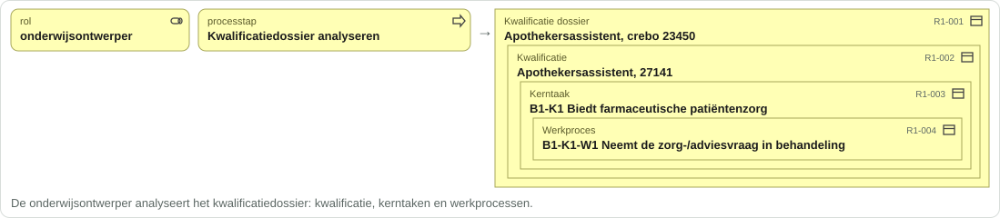
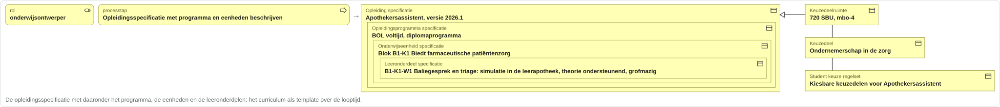
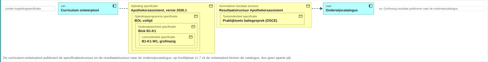
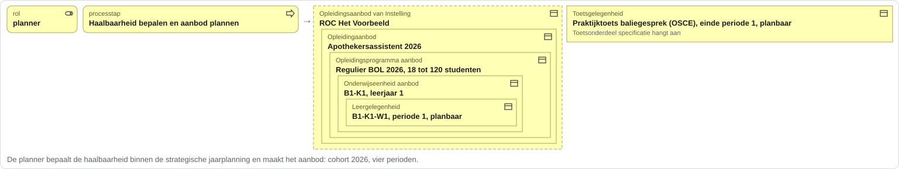
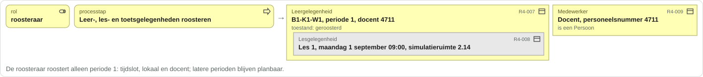

# De opleiding van Jochem in het informatiemodel

Relateert aan: het [kaderscenario leerroute 1](https://github.com/Npuls-OKx/Public/blob/dev/Referentiemateriaal/kaderscenario's/leerroute-1-regulier.md) (persona Jochem, Apothekersassistent, cohort 2026), het architectuurkader van OKx, en het [informatiemodel OKx](informatiemodel.md). Gegenereerd uit `voorbeeld-lr1-regels.json`; gecontroleerd tegen `informatiemodel.json` op commit 0cf6e29 en `begrippen.json` op commit 8ebfaca.

## Leeswijzer

Dit document loopt stap voor stap door de instellingsreis van het kaderscenario en toont per stap wat er in het informatiemodel ontstaat en wat er tussen systemen beweegt, met de waarde voor Jochem erin. Het is een leeshulp op conceptueel niveau (MIM 1 en 2): geen payloads, geen endpoints, geen diensten. Eén instantie per objecttype toont het type, niet het aantal.

Vier termen, overal gelijk:

| Term | Betekenis |
|---|---|
| Objecttype | Element van de informatiemodelplaat (ArchiMate business object), met de plaatnaam letterlijk |
| Instantie | De waarde voor Jochem: een leesbare naam |
| Applicatiedienst | De ArchiMate-applicatiedienst op de hoofdplaat en in MORA; alleen context |
| Koppeling | Een pijl op hoofdplaat v1.7 tussen twee componenten; met de koppeling-ID uit Public waar die er is |

Twee soorten regels, in de vormtaal van de plaat:

- **Ontstaat**: een rol (geel, rolicoon) voert een processtap uit (geel, procesicoon) en daaruit ontstaan objecttypen (geel, objecticoon) met Jochems waarde. "Bestaat uit" is nesting; een relatielabel van de plaat staat tussen twee objecten of als verwijzing op een object dat aan een eerdere stap hangt. Een gestippelde rand is een aanname; grijs is een objecttype dat de plaat buiten de uitwisseling zet en dit voorbeeld toch meeneemt.
- **Stroomt** (blauwe rand): van welk systeem naar welk systeem gaat welk object, met de koppeling-ID of "zonder koppelingspecificatie", en de processtap waarna het gebeurt.

Koppeling-ID's op hoofdplaat v1.7: OC-P&R is Onderwijscatalogus naar Planningssysteem; OC-P&R is Planningssysteem naar Onderwijscatalogus; OC-SIS is Onderwijscatalogus naar Kernregistratie systeem studenten (KRS); OC-SIS is Onderwijscatalogus naar Student volg systeem (SVS); OC-LMS is Onderwijscatalogus naar Leer management systeem (LMS). Een pijl die op de hoofdplaat staat maar geen koppelingspecificatie heeft, staat als "zonder koppelingspecificatie"; een stroom uit het kaderscenario zonder pijl op de hoofdplaat staat als "geen pijl op de hoofdplaat".

De fasenamen zijn de sectiekoppen "Fase 1" tot "Fase 8" van het kaderscenario. Het kaderscenario noemt fase 3 in de fasenlijst "Instroom, afstemming en plaatsing" en in de sectiekop "Instroom, intake en plaatsing"; hier geldt de sectiekop.

Wat hier staat is feedback, geen commitment: het voorbeeld beslist niets over het model. Per objecttype staan in de bijlage twee lege kolommen, "heet bij u" en "hangt bij u onder", voor wie het naast het eigen model legt.
## Fase 1: Kwalificatiekader analyseren en grofmazig ontwerpen

De fase in detail: [kaderscenario leerroute 1, fase 1](https://github.com/Npuls-OKx/Public/blob/dev/Referentiemateriaal/kaderscenario's/leerroute-1-regulier.md#fase-1-kwalificatiekader-analyseren-en-grofmazig-ontwerpen).

**Ontstaat:** `Kwalificatie dossier`, `Kwalificatie`, `Kerntaak`, `Werkproces`, `Examenplan`, `Leeruitkomst`, `Competenties / Skills`, `Vaardigheid`, `Opleiding specificatie`, `Opleidingsprogramma specificatie`, `Onderwijseenheid specificatie`, `Leeronderdeel specificatie`, `Keuzedeelruimte`, `Keuzedeel`, `Student keuze regelset`, `Summatieve resultaat structuur`, `Toetsonderdeel specificatie`, `Examenonderdeelspecificatie`, `Examenonderdeel weging`, `Summatief Afrondingscriterium`. **Stroomt:** Curriculum ontwerptool naar Onderwijscatalogus. **MORA-hoofdproces:** Ontwikkelen.

## Fase 2: Publiceren en planbaar maken

De fase in detail: [kaderscenario leerroute 1, fase 2](https://github.com/Npuls-OKx/Public/blob/dev/Referentiemateriaal/kaderscenario's/leerroute-1-regulier.md#fase-2-publiceren-en-planbaar-maken).

**Ontstaat:** `Opleidingsprogramma specificatie`, `Verzoek tot Aanbod / Intekening op specificatie`, `Opleidingsaanbod van Instelling`, `Opleidingaanbod`, `Opleidingsprogramma aanbod`, `Onderwijseenheid aanbod`, `Leergelegenheid`, `Cohort / periode`, `Toetsgelegenheid`. **Stroomt:** Onderwijscatalogus naar Planningssysteem; Planningssysteem naar Onderwijscatalogus. **MORA-hoofdproces:** Plannen en roosteren.

## Fase 3: Instroom, intake en plaatsing

De fase in detail: [kaderscenario leerroute 1, fase 3](https://github.com/Npuls-OKx/Public/blob/dev/Referentiemateriaal/kaderscenario's/leerroute-1-regulier.md#fase-3-instroom-intake-en-plaatsing).

**Ontstaat:** `Persoon`, `Aanmelding`, `Student`, `Opleiding aanbod verbintenis`, `Opleidingsprogramma aanbod verbintenis`, `Plaatsingsgroep`, `Inschrijving`. **Stroomt:** Onderwijscatalogus naar Voorziening Centraal Aanmelden (CAMBO); Voorziening Centraal Aanmelden (CAMBO) naar Kernregistratie systeem studenten (KRS). **MORA-hoofdproces:** Informeren, aanmelden, intake en plaatsen.

## Fase 4: Detailleren, roosteren en inschrijven

De fase in detail: [kaderscenario leerroute 1, fase 4](https://github.com/Npuls-OKx/Public/blob/dev/Referentiemateriaal/kaderscenario's/leerroute-1-regulier.md#fase-4-detailleren-roosteren-en-inschrijven).

**Ontstaat:** `Leeronderdeel specificatie`, `Les specificatie`, `Leergelegenheid`, `Lesgelegenheid`, `Medewerker`, `Onderwijseenheid aanbod verbintenis`, `Leergelegenheid verbintenis`, `Lesgelegenheid verbintenis`, `Opleidingsprogramma aanbod verbintenis`. **Stroomt:** Onderwijscatalogus naar Leer management systeem (LMS); Onderwijscatalogus naar Student volg systeem (SVS); Kernregistratie systeem studenten (KRS) naar Planningssysteem; Planningssysteem naar Roostersysteem; Roostersysteem naar Kernregistratie systeem studenten (KRS); Kernregistratie systeem studenten (KRS) naar Leer management systeem (LMS). **MORA-hoofdproces:** Plannen en roosteren.

## Fase 5: Onderwijs uitvoeren en voortgang begeleiden

De fase in detail: [kaderscenario leerroute 1, fase 5](https://github.com/Npuls-OKx/Public/blob/dev/Referentiemateriaal/kaderscenario's/leerroute-1-regulier.md#fase-5-onderwijs-uitvoeren-en-voortgang-begeleiden).

**Ontstaat:** `Aanwezigheid`, `Lesgelegenheid resultaat`, `Leergelegenheid resultaat`, `Toetsgelegenheid verbintenis`, `Toetsgelegenheid resultaat`, `Formatief resultaat`, `Formatieve beoordeling`, `Formatieve resultaat structuur`, `Toetsonderdeel weging`, `Persoonlijke ontwikkeling`, `Onderwijseenheid resultaat`. **MORA-hoofdproces:** Verzorgen en begeleiden.

Regels volgen na 30 september.

## Fase 6: Organiseren van keuzemomenten

De fase in detail: [kaderscenario leerroute 1, fase 6](https://github.com/Npuls-OKx/Public/blob/dev/Referentiemateriaal/kaderscenario's/leerroute-1-regulier.md#fase-6-organiseren-van-keuzemomenten).

**Ontstaat:** `Keuzedeelaanbod`, `Keuzedeel aanbod verbintenis`, `Keuzedeel resultaat`. **MORA-hoofdproces:** Plannen en roosteren.

Regels volgen na 30 september.

## Fase 7: Bijsturen planning en aanbod

De fase in detail: [kaderscenario leerroute 1, fase 7](https://github.com/Npuls-OKx/Public/blob/dev/Referentiemateriaal/kaderscenario's/leerroute-1-regulier.md#fase-7-bijsturen-planning-en-aanbod).

**Ontstaat:** geen nieuwe objecttypen; deze fase raakt bestaande objecttypen. **MORA-hoofdproces:** Plannen en roosteren.

Regels volgen na 30 september.

## Fase 8: Examineren, vaststellen en diplomeren

De fase in detail: [kaderscenario leerroute 1, fase 8](https://github.com/Npuls-OKx/Public/blob/dev/Referentiemateriaal/kaderscenario's/leerroute-1-regulier.md#fase-8-examineren-vaststellen-en-diplomeren).

**Ontstaat:** `Examengelegenheid`, `Examengelegenheid verbintenis`, `Examengelegenheid resultaat`, `Summatief resultaat`, `Summatieve beoordeling`, `Opleidingsprogramma resultaat`, `Opleiding aanbod resultaat`, `Waarde document (diploma / certificaat)`. **MORA-hoofdproces:** Examens uitvoeren en vaststellen; diplomeren.

Regels volgen na 30 september.

## Bijlage: alle objecttypen per begrippenfamilie

Per objecttype de instantie voor Jochem, de fase waarin hij verschijnt, de status van de definitie in de begrippenlijst en het OEAPI-object uit de mapping. De laatste twee kolommen zijn voor de lezer.

### Kwalificatiekader mbo

| Objecttype | Jochem | Fase | Aanname | Definitie | OEAPI | Heet bij u | Hangt bij u onder |
|---|---|---|---|---|---|---|---|
| Kerntaak | B1-K1 Biedt farmaceutische patiëntenzorg | 1 |  | ja | geen equivalent | | |
| Kwalificatie | Apothekersassistent, 27141 | 1 |  | ja | geen equivalent | | |
| Kwalificatie dossier | Apothekersassistent, crebo 23450 | 1 |  | ja | geen equivalent | | |
| Werkproces | B1-K1-W1 Neemt de zorg-/adviesvraag in behandeling | 1 |  | ja | geen equivalent | | |

### Onderwijskundig kader instelling

| Objecttype | Jochem | Fase | Aanname | Definitie | OEAPI | Heet bij u | Hangt bij u onder |
|---|---|---|---|---|---|---|---|
| Competenties / Skills | Sociale en communicatieve vaardigheden (CompetentNL laag 1) | 1 | ja | nog te definieren | geen equivalent | | |
| Leeruitkomst | Biedt farmaceutische patiëntenzorg (kerntaakniveau) | 1 | ja | ja | LearningOutcome | | |
| Vaardigheid | Communicatieve vaardigheden (CompetentNL laag 2) | 1 | ja | nog te definieren | geen equivalent | | |

### Onderwijsspecificatie

| Objecttype | Jochem | Fase | Aanname | Definitie | OEAPI | Heet bij u | Hangt bij u onder |
|---|---|---|---|---|---|---|---|
| Examenonderdeelspecificatie | Proeve van bekwaamheid B1-K1 | 1 | ja | ja | TestComponent | | |
| Keuzedeel | Ondernemerschap in de zorg | 1 |  | nog te definieren | Programme | | |
| Keuzedeelruimte | 720 SBU, mbo-4 | 1 |  | ja | Programme | | |
| Leeronderdeel specificatie | B1-K1-W1 Neemt de zorg-/adviesvraag in behandeling, grofmazig | 1 |  | ja | LearningComponent | | |
| Les specificatie | Les 1 Introductie WHAM-vragen en triage, werkcollege, 2 uur | 4 |  | ja | LearningComponent | | |
| Onderwijseenheid specificatie | Blok B1-K1 Biedt farmaceutische patiëntenzorg | 1 |  | ja | Course | | |
| Opleiding specificatie | Apothekersassistent, versie 2026.1 | 1 |  | nog te definieren | Programme | | |
| Opleidingsprogramma specificatie | BOL voltijd, diplomaprogramma | 1 |  | ja | Programme | | |
| Student keuze regelset | Kiesbare keuzedelen voor Apothekersassistent | 1 |  | nog te definieren | geen equivalent | | |
| Toetsonderdeel specificatie | Praktijktoets baliegesprek (OSCE), summatief | 1 |  | ja | TestComponent | | |

### Onderwijsaanbod

| Objecttype | Jochem | Fase | Aanname | Definitie | OEAPI | Heet bij u | Hangt bij u onder |
|---|---|---|---|---|---|---|---|
| Examengelegenheid | regels volgen na 30 september | 8 |  | ja | TestComponentOffering | | |
| Keuzedeelaanbod | regels volgen na 30 september | 6 |  | nog te definieren | ProgrammeOffering | | |
| Leergelegenheid | B1-K1-W1, periode 1, planbaar | 2 |  | nog te definieren | LearningComponentOffering | | |
| Lesgelegenheid | Les 1, maandag 1 september 09:00, simulatieruimte 2.14 | 4 |  | nog te definieren | LearningComponentOffering | | |
| Onderwijseenheid aanbod | B1-K1, leerjaar 1 | 2 |  | nog te definieren | CourseOffering | | |
| Opleidingaanbod | Apothekersassistent 2026 | 2 |  | ja | ProgrammeOffering | | |
| Opleidingsaanbod van Instelling | ROC Het Voorbeeld | 2 | ja | ja | geen equivalent | | |
| Opleidingsprogramma aanbod | Regulier BOL 2026, 18 tot 120 studenten | 2 |  | nog te definieren | ProgrammeOffering | | |
| Toetsgelegenheid | Praktijktoets baliegesprek (OSCE), einde periode 1, planbaar | 2 |  | ja | TestComponentOffering | | |

### Onderwijsverbintenis

| Objecttype | Jochem | Fase | Aanname | Definitie | OEAPI | Heet bij u | Hangt bij u onder |
|---|---|---|---|---|---|---|---|
| Examengelegenheid verbintenis | regels volgen na 30 september | 8 |  | ja | TestComponentOfferingAssociation | | |
| Inschrijving | Juni 2026 | 3 |  | ja | geen equivalent | | |
| Keuzedeel aanbod verbintenis | regels volgen na 30 september | 6 |  | nog te definieren | ProgrammeOfferingAssociation | | |
| Leergelegenheid verbintenis | Jochem op B1-K1-W1, periode 1 | 4 |  | nog te definieren | LearningComponentOfferingAssociation | | |
| Lesgelegenheid verbintenis | Jochem op les 1, 1 september 09:00 | 4 |  | nog te definieren | LearningComponentOfferingAssociation | | |
| Onderwijseenheid aanbod verbintenis | Jochem op B1-K1, leerjaar 1 | 4 |  | nog te definieren | CourseOfferingAssociation | | |
| Opleiding aanbod verbintenis | Jochem op Apothekersassistent 2026, aangemeld | 3 |  | nog te definieren | ProgrammeOfferingAssociation | | |
| Opleidingsprogramma aanbod verbintenis | Jochem op Regulier BOL 2026, aangemeld | 3 |  | nog te definieren | ProgrammeOfferingAssociation | | |
| Toetsgelegenheid verbintenis | regels volgen na 30 september | 5 |  | ja | TestComponentOfferingAssociation | | |

### Onderwijsresultaat

| Objecttype | Jochem | Fase | Aanname | Definitie | OEAPI | Heet bij u | Hangt bij u onder |
|---|---|---|---|---|---|---|---|
| Aanwezigheid | regels volgen na 30 september | 5 |  | nog te definieren | geen equivalent | | |
| Examengelegenheid resultaat | regels volgen na 30 september | 8 |  | nog te definieren | Result | | |
| Formatief resultaat | regels volgen na 30 september | 5 |  | ja | geen equivalent | | |
| Formatieve beoordeling | regels volgen na 30 september | 5 |  | ja | geen equivalent | | |
| Keuzedeel resultaat | regels volgen na 30 september | 6 |  | nog te definieren | Result | | |
| Leergelegenheid resultaat | regels volgen na 30 september | 5 |  | nog te definieren | Result | | |
| Lesgelegenheid resultaat | regels volgen na 30 september | 5 |  | nog te definieren | Result | | |
| Onderwijseenheid resultaat | regels volgen na 30 september | 5 |  | nog te definieren | Result | | |
| Opleiding aanbod resultaat | regels volgen na 30 september | 8 |  | nog te definieren | Result | | |
| Opleidingsprogramma resultaat | regels volgen na 30 september | 8 |  | nog te definieren | Result | | |
| Summatief resultaat | regels volgen na 30 september | 8 |  | ja | geen equivalent | | |
| Summatieve beoordeling | regels volgen na 30 september | 8 |  | ja | geen equivalent | | |
| Toetsgelegenheid resultaat | regels volgen na 30 september | 5 |  | nog te definieren | Result | | |

### Resultaatstructuur

| Objecttype | Jochem | Fase | Aanname | Definitie | OEAPI | Heet bij u | Hangt bij u onder |
|---|---|---|---|---|---|---|---|
| Examenonderdeel weging | Proeve van bekwaamheid B1-K1: weging 2 | 1 | ja | nog te definieren | geen equivalent | | |
| Formatieve resultaat structuur | regels volgen na 30 september | 5 |  | ja | geen equivalent | | |
| Persoonlijke ontwikkeling | regels volgen na 30 september | 5 |  | nog te definieren | geen equivalent | | |
| Summatief Afrondingscriterium | Alle kerntaken en de keuzedelen voldoende | 1 |  | nog te definieren | geen equivalent | | |
| Summatieve resultaat structuur | Resultaatstructuur Apothekersassistent, alle onderdelen voldoende | 1 |  | ja | geen equivalent | | |
| Toetsonderdeel weging | regels volgen na 30 september | 5 |  | nog te definieren | geen equivalent | | |

### Buiten de kolommen (persoon, groep, cohort, verzoek)

| Objecttype | Jochem | Fase | Aanname | Definitie | OEAPI | Heet bij u | Hangt bij u onder |
|---|---|---|---|---|---|---|---|
| Aanmelding | April 2026, Apothekersassistent BOL | 3 |  | ja | geen equivalent | | |
| Cohort / periode | Cohort 2026 | 2 |  | ja | geen equivalent | | |
| Examenplan | Examenplan Apothekersassistent, cohort 2026 | 1 | ja | ja | geen equivalent | | |
| Medewerker | Docent, personeelsnummer 4711 | 4 |  | ja | geen equivalent | | |
| Persoon | Jochem, 17, na het vmbo | 3 |  | nog te definieren | Person | | |
| Plaatsingsgroep | APO26-1A | 3 | ja | nog te definieren | Group | | |
| Student | Jochem, cohort 2026 | 3 |  | ja | geen equivalent | | |
| Verzoek tot Aanbod / Intekening op specificatie | Planopgave Apothekersassistent, cohort 2026 | 2 | ja | ja | geen equivalent | | |
| Waarde document (diploma / certificaat) | regels volgen na 30 september | 8 |  | ja | geen equivalent | | |

## Vragen aan de kerngroep

De vragen die de regels zelf oproepen, met de regel waar de vraag zichtbaar wordt. Feedback, geen commitment.

1. Het kaderscenario zet het examenplan in fase 1 en de resultaatstructuur pas in fase 4 bij OC-SIS. Ontstaat de summatieve resultaatstructuur in de curriculum-ontwerptool uit het examenplan, en gaat zij met de specificatie mee naar de catalogus? (fase 1, Examenplan vaststellen, `Examenplan`)
2. Leeruitkomsten zijn in de bronnen niet geformuleerd; het voorbeeld toont twee varianten (dossierstructuur en skills-kader). Hoe formuleert de instelling ze? (fase 1, Kwalificatiedossier vertalen naar leeruitkomsten, `Leeruitkomst`)
3. Welke weging moet een studentvolgsysteem aggregeren: op het toetsonderdeel (schema) of op de resultaateenheid (regels)? Meta #234 punt 5. (fase 1, Toetsonderdelen en resultaatstructuur uit het examenplan afleiden, `Examenonderdeel weging`)
4. Is het verzoek tot aanbod een object met sleutel en toestand, of het startevent van aanbod maken? (fase 2, Planningssysteem verzoeken om onderwijsaanbod, `Verzoek tot Aanbod / Intekening op specificatie`)
5. Is het cohort een sleutel op aanbod en verbintenis, of een eigen object (ontwerpkeuze 17)? (fase 2, Haalbaarheid bepalen en aanbod plannen, `Cohort / periode`)
6. Welke groep bij de instelling is de bron van de plaatsingsgroep: stamgroep (KRS), planninggroep of lesgroep (meta #235)? (fase 3, Intake doorlopen en plaatsen, `Plaatsingsgroep`)
7. Is de inschrijving een eigen object naast de verbintenis, of een toestand van de aanmelding (ontwerpkeuze 13)? (fase 3, Persoon en verbintenissen vastleggen in de kernregistratie, `Inschrijving`)

Vragen over patronen, schema's, de toetslijst en endpoints horen bij de koppelvlakspecificatie en staan hier niet.

### Invulblad

Per regel één van vier antwoorden: herken ik dit; heet bij ons anders (welke term); hangt bij ons anders (waaronder); ontbreekt.

| Fase | Stap | Objecttype | Herken | Heet anders | Hangt anders | Ontbreekt |
|---|---|---|---|---|---|---|
| 1 | Kwalificatiedossier analyseren | Kwalificatie dossier | | | | |
| 1 | Kwalificatiedossier analyseren | Kwalificatie | | | | |
| 1 | Kwalificatiedossier analyseren | Kerntaak | | | | |
| 1 | Kwalificatiedossier analyseren | Werkproces | | | | |
| 1 | Examenplan vaststellen | Examenplan | | | | |
| 1 | Kwalificatiedossier vertalen naar leeruitkomsten | Leeruitkomst | | | | |
| 1 | Kwalificatiedossier vertalen naar leeruitkomsten | Leeruitkomst | | | | |
| 1 | Skills-kader vertalen naar leeruitkomsten | Competenties / Skills | | | | |
| 1 | Skills-kader vertalen naar leeruitkomsten | Vaardigheid | | | | |
| 1 | Skills-kader vertalen naar leeruitkomsten | Leeruitkomst | | | | |
| 1 | Opleidingsspecificatie met programma en eenheden beschrijven | Opleiding specificatie | | | | |
| 1 | Opleidingsspecificatie met programma en eenheden beschrijven | Opleidingsprogramma specificatie | | | | |
| 1 | Opleidingsspecificatie met programma en eenheden beschrijven | Onderwijseenheid specificatie | | | | |
| 1 | Opleidingsspecificatie met programma en eenheden beschrijven | Leeronderdeel specificatie | | | | |
| 1 | Opleidingsspecificatie met programma en eenheden beschrijven | Keuzedeelruimte | | | | |
| 1 | Opleidingsspecificatie met programma en eenheden beschrijven | Keuzedeel | | | | |
| 1 | Opleidingsspecificatie met programma en eenheden beschrijven | Student keuze regelset | | | | |
| 1 | Toetsonderdelen en resultaatstructuur uit het examenplan afleiden | Summatieve resultaat structuur | | | | |
| 1 | Toetsonderdelen en resultaatstructuur uit het examenplan afleiden | Toetsonderdeel specificatie | | | | |
| 1 | Toetsonderdelen en resultaatstructuur uit het examenplan afleiden | Examenonderdeelspecificatie | | | | |
| 1 | Toetsonderdelen en resultaatstructuur uit het examenplan afleiden | Examenonderdeel weging | | | | |
| 1 | Toetsonderdelen en resultaatstructuur uit het examenplan afleiden | Summatief Afrondingscriterium | | | | |
| 2 | Specificatie aanvullen tot planbare specificatie | Opleidingsprogramma specificatie | | | | |
| 2 | Planningssysteem verzoeken om onderwijsaanbod | Verzoek tot Aanbod / Intekening op specificatie | | | | |
| 2 | Haalbaarheid bepalen en aanbod plannen | Opleidingsaanbod van Instelling | | | | |
| 2 | Haalbaarheid bepalen en aanbod plannen | Opleidingaanbod | | | | |
| 2 | Haalbaarheid bepalen en aanbod plannen | Opleidingsprogramma aanbod | | | | |
| 2 | Haalbaarheid bepalen en aanbod plannen | Onderwijseenheid aanbod | | | | |
| 2 | Haalbaarheid bepalen en aanbod plannen | Leergelegenheid | | | | |
| 2 | Haalbaarheid bepalen en aanbod plannen | Cohort / periode | | | | |
| 2 | Haalbaarheid bepalen en aanbod plannen | Toetsgelegenheid | | | | |
| 3 | Aanmelden via het intakesysteem | Persoon | | | | |
| 3 | Aanmelden via het intakesysteem | Aanmelding | | | | |
| 3 | Intake doorlopen en plaatsen | Student | | | | |
| 3 | Intake doorlopen en plaatsen | Opleiding aanbod verbintenis | | | | |
| 3 | Intake doorlopen en plaatsen | Opleidingsprogramma aanbod verbintenis | | | | |
| 3 | Intake doorlopen en plaatsen | Plaatsingsgroep | | | | |
| 3 | Persoon en verbintenissen vastleggen in de kernregistratie | Inschrijving | | | | |
| 4 | Leeronderdeel- en toetsonderdeelspecificaties fijnmazig uitwerken | Leeronderdeel specificatie | | | | |
| 4 | Leeronderdeel- en toetsonderdeelspecificaties fijnmazig uitwerken | Les specificatie | | | | |
| 4 | Leer-, les- en toetsgelegenheden roosteren | Leergelegenheid | | | | |
| 4 | Leer-, les- en toetsgelegenheden roosteren | Lesgelegenheid | | | | |
| 4 | Leer-, les- en toetsgelegenheden roosteren | Medewerker | | | | |
| 4 | Verwachte deelnemers delen en toegang geven | Onderwijseenheid aanbod verbintenis | | | | |
| 4 | Verwachte deelnemers delen en toegang geven | Leergelegenheid verbintenis | | | | |
| 4 | Verwachte deelnemers delen en toegang geven | Lesgelegenheid verbintenis | | | | |
| 4 | Verwachte deelnemers delen en toegang geven | Opleidingsprogramma aanbod verbintenis | | | | |

