# De opleiding van Jochem in het informatiemodel

Relateert aan: het [kaderscenario leerroute 1](https://github.com/Npuls-OKx/Public/blob/dev/Referentiemateriaal/kaderscenario's/leerroute-1-regulier.md) (persona Jochem, Apothekersassistent, cohort 2026), het architectuurkader van OKx, en het [informatiemodel OKx](informatiemodel.md). Gegenereerd uit `voorbeeld-lr1-regels.json`; gecontroleerd tegen `informatiemodel.json` op commit 0cf6e29 en `begrippen.json` op commit 8ebfaca.

## Leeswijzer

Dit document loopt stap voor stap door de instellingsreis van het kaderscenario en toont per stap wat er in het informatiemodel ontstaat en wat er tussen systemen beweegt, met de waarde voor Jochem erin. Het is een leeshulp op conceptueel niveau (MIM 1 en 2): geen payloads, geen endpoints, geen diensten. Eén instantie per objecttype toont het type, niet het aantal.

Elke regel heeft een stabiel ID (R, fasenummer, volgnummer: R1-012) dat in het beeld rechtsboven in het object staat en in het regelregister achterin; verwijs daarmee.

Vier termen, overal gelijk:

| Term | Betekenis |
|---|---|
| Objecttype | Element van de informatiemodelplaat (ArchiMate business object), met de plaatnaam letterlijk |
| Instantie | De waarde voor Jochem: een leesbare naam |
| Applicatiedienst | De ArchiMate-applicatiedienst op de hoofdplaat en in MORA; alleen context |
| Koppeling | Een pijl op hoofdplaat v1.7 tussen twee componenten; met de koppeling-ID uit Public waar die er is |

Twee soorten regels, in de vormtaal van de plaat:

- **Ontstaat**: een rol (geel, rolicoon) voert een processtap uit (geel, procesicoon) en daaruit ontstaan objecttypen (geel, objecticoon) met Jochems waarde. "Bestaat uit" is nesting; een relatielabel van de plaat staat tussen twee objecten of als verwijzing op een object dat aan een eerdere stap hangt. Een gestippelde rand is een aanname; grijs is een objecttype dat de plaat buiten de uitwisseling zet en dit voorbeeld toch meeneemt.
- **Stroomt** (blauwe rand): van welk systeem naar welk systeem gaat welk object, met de koppeling-ID of "zonder koppelingspecificatie", en de processtap waarna het gebeurt.

Een **verdieping** (zelfde rol en stap, met "verdieping" op de processtap) zoomt in op een regel erboven. Een verdieping met een gestippelde rand en de chip "conceptplaat: Informatiemodel Onderwijsontwerp" put uit de conceptplaat in het ArchiMate-model: zij laat zien waar de informatiemodelplaat kan groeien en telt niet mee in de bijlage en het invulblad.

Koppeling-ID's op hoofdplaat v1.7: OC-P&R is Onderwijscatalogus naar Planningssysteem; OC-P&R is Planningssysteem naar Onderwijscatalogus; OC-SIS is Onderwijscatalogus naar Kernregistratie systeem studenten (KRS); OC-SIS is Onderwijscatalogus naar Student volg systeem (SVS); OC-LMS is Onderwijscatalogus naar Leer management systeem (LMS). Een pijl die op de hoofdplaat staat maar geen koppelingspecificatie heeft, staat als "zonder koppelingspecificatie"; een stroom uit het kaderscenario zonder pijl op de hoofdplaat staat als "geen pijl op de hoofdplaat".

De fasenamen zijn de sectiekoppen "Fase 1" tot "Fase 8" van het kaderscenario. Het kaderscenario noemt fase 3 in de fasenlijst "Instroom, afstemming en plaatsing" en in de sectiekop "Instroom, intake en plaatsing"; hier geldt de sectiekop.

Wat hier staat is feedback, geen commitment: het voorbeeld beslist niets over het model. Per objecttype staan in de bijlage twee lege kolommen, "heet bij u" en "hangt bij u onder", voor wie het naast het eigen model legt.
## Fase 1: Kwalificatiekader analyseren en grofmazig ontwerpen

De fase in detail: [kaderscenario leerroute 1, fase 1](https://github.com/Npuls-OKx/Public/blob/dev/Referentiemateriaal/kaderscenario's/leerroute-1-regulier.md#fase-1--kwalificatiekader-analyseren-en-grofmazig-ontwerpen).

**Ontstaat:** `Kwalificatie dossier`, `Kwalificatie`, `Kerntaak`, `Werkproces`, `Examenplan`, `Summatieve resultaat structuur`, `Cohort / periode`, `Leeruitkomst`, `Competenties / Skills`, `Vaardigheid`, `Kennis`, `Inzicht`, `Opleiding specificatie`, `Opleidingsprogramma specificatie`, `Onderwijseenheid specificatie`, `Leeronderdeel specificatie`, `Keuzedeelruimte`, `Keuzedeel`, `Student keuze regelset`, `Toetsonderdeel specificatie`, `Examenonderdeelspecificatie`, `Examenonderdeel weging`, `Summatief Afrondingscriterium`. **Stroomt:** Curriculum ontwerptool naar Onderwijscatalogus. **MORA-hoofdproces:** Ontwikkelen.

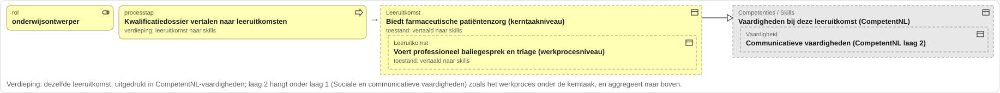

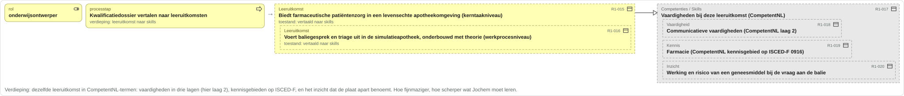

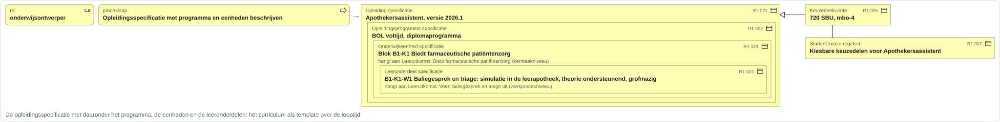

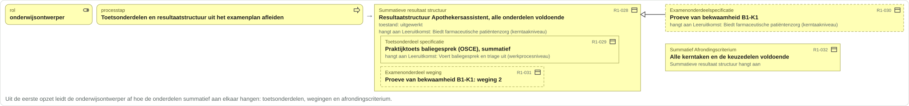

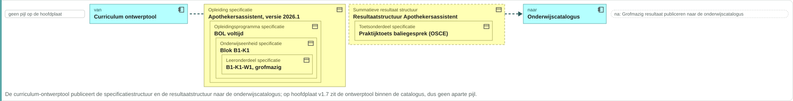

## Fase 2: Publiceren en planbaar maken

De fase in detail: [kaderscenario leerroute 1, fase 2](https://github.com/Npuls-OKx/Public/blob/dev/Referentiemateriaal/kaderscenario's/leerroute-1-regulier.md#fase-2--publiceren-en-planbaar-maken).

**Ontstaat:** `Opleidingsprogramma specificatie`, `Verzoek tot Aanbod / Intekening op specificatie`, `Opleidingsaanbod van Instelling`, `Opleidingaanbod`, `Opleidingsprogramma aanbod`, `Onderwijseenheid aanbod`, `Leergelegenheid`, `Toetsgelegenheid`. **Stroomt:** Onderwijscatalogus naar Planningssysteem; Planningssysteem naar Onderwijscatalogus. **MORA-hoofdproces:** Plannen en roosteren.

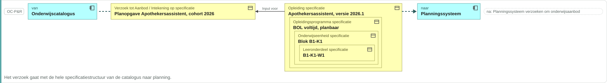

## Fase 3: Instroom, intake en plaatsing

De fase in detail: [kaderscenario leerroute 1, fase 3](https://github.com/Npuls-OKx/Public/blob/dev/Referentiemateriaal/kaderscenario's/leerroute-1-regulier.md#fase-3--instroom-intake-en-plaatsing).

**Ontstaat:** `Persoon`, `Aanmelding`, `Student`, `Opleiding aanbod verbintenis`, `Opleidingsprogramma aanbod verbintenis`, `Plaatsingsgroep`, `Inschrijving`. **Stroomt:** Onderwijscatalogus naar Voorziening Centraal Aanmelden (CAMBO); Voorziening Centraal Aanmelden (CAMBO) naar Kernregistratie systeem studenten (KRS). **MORA-hoofdproces:** Informeren, aanmelden, intake en plaatsen.

## Fase 4: Detailleren, roosteren en inschrijven

De fase in detail: [kaderscenario leerroute 1, fase 4](https://github.com/Npuls-OKx/Public/blob/dev/Referentiemateriaal/kaderscenario's/leerroute-1-regulier.md#fase-4--detailleren-roosteren-en-inschrijven).

**Ontstaat:** `Leeronderdeel specificatie`, `Les specificatie`, `Leergelegenheid`, `Lesgelegenheid`, `Medewerker`, `Onderwijseenheid aanbod verbintenis`, `Leergelegenheid verbintenis`, `Lesgelegenheid verbintenis`, `Opleidingsprogramma aanbod verbintenis`. **Stroomt:** Onderwijscatalogus naar Leer management systeem (LMS); Onderwijscatalogus naar Student volg systeem (SVS); Kernregistratie systeem studenten (KRS) naar Planningssysteem; Planningssysteem naar Roostersysteem; Roostersysteem naar Kernregistratie systeem studenten (KRS); Kernregistratie systeem studenten (KRS) naar Leer management systeem (LMS). **MORA-hoofdproces:** Plannen en roosteren.

## Fase 5: Onderwijs uitvoeren en voortgang begeleiden

De fase in detail: [kaderscenario leerroute 1, fase 5](https://github.com/Npuls-OKx/Public/blob/dev/Referentiemateriaal/kaderscenario's/leerroute-1-regulier.md#fase-5--onderwijs-uitvoeren-en-voortgang-begeleiden).

**Ontstaat:** `Lesgelegenheid verbintenis`, `Aanwezigheid`, `Lesgelegenheid resultaat`, `Toetsgelegenheid verbintenis`, `Formatieve resultaat structuur`, `Toetsonderdeel weging`, `Toetsgelegenheid resultaat`, `Formatief resultaat`, `Formatieve beoordeling`, `Persoonlijke ontwikkeling`, `Leergelegenheid resultaat`, `Onderwijseenheid resultaat`. **Stroomt:** Leer management systeem (LMS) naar Student volg systeem (SVS). **MORA-hoofdproces:** Verzorgen en begeleiden.

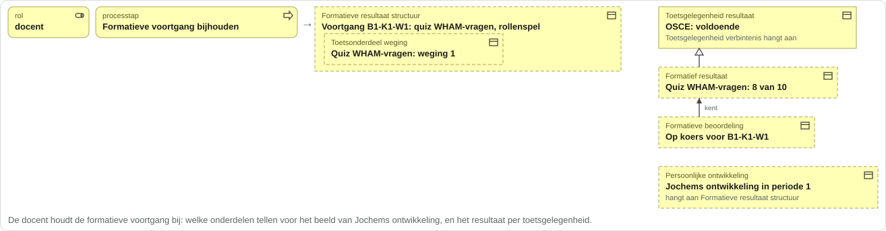

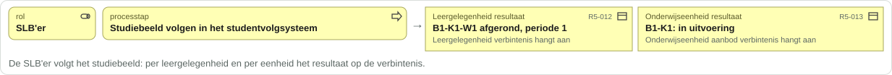

## Fase 6: Organiseren van keuzemomenten

De fase in detail: [kaderscenario leerroute 1, fase 6](https://github.com/Npuls-OKx/Public/blob/dev/Referentiemateriaal/kaderscenario's/leerroute-1-regulier.md#fase-6--organiseren-van-keuzemomenten).

**Ontstaat:** `Keuzedeelaanbod`, `Keuzedeel aanbod verbintenis`. **Stroomt:** Onderwijscatalogus naar Student Keuze Systeem (SKS); Student Keuze Systeem (SKS) naar Planningssysteem; Planningssysteem naar Onderwijscatalogus; Student Keuze Systeem (SKS) naar Kernregistratie systeem studenten (KRS). **MORA-hoofdproces:** Plannen en roosteren.

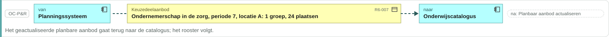

## Fase 7: Bijsturen planning en aanbod

De fase in detail: [kaderscenario leerroute 1, fase 7](https://github.com/Npuls-OKx/Public/blob/dev/Referentiemateriaal/kaderscenario's/leerroute-1-regulier.md#fase-7--bijsturen-planning-en-aanbod).

**Ontstaat:** `Plaatsingsgroep`, `Onderwijseenheid aanbod verbintenis`, `Onderwijseenheid aanbod`. **Stroomt:** Kernregistratie systeem studenten (KRS) naar Planningssysteem; Planningssysteem naar Onderwijscatalogus; Planningssysteem naar Roostersysteem. **MORA-hoofdproces:** Plannen en roosteren.

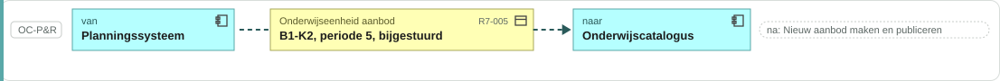

## Fase 8: Examineren, vaststellen en diplomeren

De fase in detail: [kaderscenario leerroute 1, fase 8](https://github.com/Npuls-OKx/Public/blob/dev/Referentiemateriaal/kaderscenario's/leerroute-1-regulier.md#fase-8--examineren-vaststellen-en-diplomeren).

**Ontstaat:** `Examengelegenheid`, `Examengelegenheid verbintenis`, `Examengelegenheid resultaat`, `Summatief resultaat`, `Summatieve beoordeling`, `Opleidingsprogramma resultaat`, `Keuzedeel resultaat`, `Opleiding aanbod resultaat`, `Waarde document (diploma / certificaat)`. **Stroomt:** Toets- en examen afname systeem naar Student volg systeem (SVS); Student volg systeem (SVS) naar Kernregistratie systeem studenten (KRS). **MORA-hoofdproces:** Examens uitvoeren en vaststellen; diplomeren.

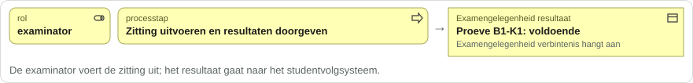

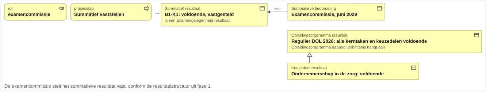

## Bijlage: alle objecttypen per begrippenfamilie

Per objecttype de instantie voor Jochem, de fase waarin hij verschijnt, de status van de definitie in de begrippenlijst en het OEAPI-object uit de mapping. De laatste twee kolommen zijn voor de lezer.

### Kwalificatiekader mbo

| Objecttype | Regel | Jochem | Fase | Aanname | Definitie | OEAPI | Heet bij u | Hangt bij u onder |
|---|---|---|---|---|---|---|---|---|
| Kerntaak | R1-003 | B1-K1 Biedt farmaceutische patiëntenzorg | 1 |  | ja | geen equivalent | | |
| Kwalificatie | R1-002 | Apothekersassistent, 27141 | 1 |  | ja | geen equivalent | | |
| Kwalificatie dossier | R1-001 | Apothekersassistent, crebo 23450 | 1 |  | ja | geen equivalent | | |
| Werkproces | R1-004 | B1-K1-W1 Neemt de zorg-/adviesvraag in behandeling | 1 |  | ja | geen equivalent | | |

### Onderwijskundig kader instelling

| Objecttype | Regel | Jochem | Fase | Aanname | Definitie | OEAPI | Heet bij u | Hangt bij u onder |
|---|---|---|---|---|---|---|---|---|
| Competenties / Skills | R1-017 | Vaardigheden bij deze leeruitkomst (CompetentNL) | 1 | ja | nog te definieren | geen equivalent | | |
| Inzicht | R1-020 | Werking en risico van een geneesmiddel bij de vraag aan de balie | 1 | ja | nog te definieren | geen equivalent | | |
| Kennis | R1-019 | Farmacie (CompetentNL kennisgebied op ISCED-F 0916) | 1 | ja | nog te definieren | geen equivalent | | |
| Leeruitkomst | R1-008 | Biedt farmaceutische patiëntenzorg in een levensechte apotheekomgeving (kerntaakniveau) | 1 | ja | ja | LearningOutcome | | |
| Vaardigheid | R1-018 | Communicatieve vaardigheden (CompetentNL laag 2) | 1 | ja | nog te definieren | geen equivalent | | |

### Onderwijsspecificatie

| Objecttype | Regel | Jochem | Fase | Aanname | Definitie | OEAPI | Heet bij u | Hangt bij u onder |
|---|---|---|---|---|---|---|---|---|
| Examenonderdeelspecificatie | R1-030 | Proeve van bekwaamheid B1-K1 | 1 | ja | ja | TestComponent | | |
| Keuzedeel | R1-026 | Ondernemerschap in de zorg | 1 |  | nog te definieren | Programme | | |
| Keuzedeelruimte | R1-025 | 720 SBU, mbo-4 | 1 |  | ja | Programme | | |
| Leeronderdeel specificatie | R1-024 | B1-K1-W1 Baliegesprek en triage: simulatie in de leerapotheek, theorie ondersteunend, grofmazig | 1 |  | ja | LearningComponent | | |
| Les specificatie | R4-002 | Les 1 Introductie WHAM-vragen en triage, werkcollege, 2 uur | 4 |  | ja | LearningComponent | | |
| Onderwijseenheid specificatie | R1-023 | Blok B1-K1 Biedt farmaceutische patiëntenzorg | 1 |  | ja | Course | | |
| Opleiding specificatie | R1-021 | Apothekersassistent, versie 2026.1 | 1 |  | nog te definieren | Programme | | |
| Opleidingsprogramma specificatie | R1-022 | BOL voltijd, diplomaprogramma | 1 |  | ja | Programme | | |
| Student keuze regelset | R1-027 | Kiesbare keuzedelen voor Apothekersassistent | 1 |  | nog te definieren | geen equivalent | | |
| Toetsonderdeel specificatie | R1-029 | Praktijktoets baliegesprek (OSCE), summatief | 1 |  | ja | TestComponent | | |

### Onderwijsaanbod

| Objecttype | Regel | Jochem | Fase | Aanname | Definitie | OEAPI | Heet bij u | Hangt bij u onder |
|---|---|---|---|---|---|---|---|---|
| Examengelegenheid | R8-001 | Proeve van bekwaamheid B1-K1, periode 12 | 8 | ja | ja | TestComponentOffering | | |
| Keuzedeelaanbod | R6-001 | Ondernemerschap in de zorg, periode 7, locatie A | 6 | ja | nog te definieren | ProgrammeOffering | | |
| Leergelegenheid | R2-012 | B1-K1-W1, periode 1, planbaar | 2 |  | nog te definieren | LearningComponentOffering | | |
| Lesgelegenheid | R4-008 | Les 1, maandag 1 september 09:00, simulatieruimte 2.14 | 4 |  | nog te definieren | LearningComponentOffering | | |
| Onderwijseenheid aanbod | R2-011 | B1-K1, leerjaar 1 | 2 |  | nog te definieren | CourseOffering | | |
| Opleidingaanbod | R2-009 | Apothekersassistent 2026 | 2 |  | ja | ProgrammeOffering | | |
| Opleidingsaanbod van Instelling | R2-008 | ROC Het Voorbeeld | 2 | ja | ja | geen equivalent | | |
| Opleidingsprogramma aanbod | R2-010 | Regulier BOL 2026, 18 tot 120 studenten | 2 |  | nog te definieren | ProgrammeOffering | | |
| Toetsgelegenheid | R2-013 | Praktijktoets baliegesprek (OSCE), einde periode 1, planbaar | 2 |  | ja | TestComponentOffering | | |

### Onderwijsverbintenis

| Objecttype | Regel | Jochem | Fase | Aanname | Definitie | OEAPI | Heet bij u | Hangt bij u onder |
|---|---|---|---|---|---|---|---|---|
| Examengelegenheid verbintenis | R8-002 | Jochem op de proeve, periode 12 | 8 |  | ja | TestComponentOfferingAssociation | | |
| Inschrijving | R3-009 | Juni 2026 | 3 |  | ja | geen equivalent | | |
| Keuzedeel aanbod verbintenis | R6-004 | Jochem op Ondernemerschap in de zorg, periode 7 (voorkeur 1) | 6 |  | nog te definieren | ProgrammeOfferingAssociation | | |
| Leergelegenheid verbintenis | R4-012 | Jochem op B1-K1-W1, periode 1 | 4 |  | nog te definieren | LearningComponentOfferingAssociation | | |
| Lesgelegenheid verbintenis | R4-013 | Jochem op les 1, 1 september 09:00 | 4 |  | nog te definieren | LearningComponentOfferingAssociation | | |
| Onderwijseenheid aanbod verbintenis | R4-011 | Jochem op B1-K1, leerjaar 1 | 4 |  | nog te definieren | CourseOfferingAssociation | | |
| Opleiding aanbod verbintenis | R3-006 | Jochem op Apothekersassistent 2026, aangemeld | 3 |  | nog te definieren | ProgrammeOfferingAssociation | | |
| Opleidingsprogramma aanbod verbintenis | R3-007 | Jochem op Regulier BOL 2026, aangemeld | 3 |  | nog te definieren | ProgrammeOfferingAssociation | | |
| Toetsgelegenheid verbintenis | R5-004 | Jochem op de OSCE, einde periode 1 | 5 |  | ja | TestComponentOfferingAssociation | | |

### Onderwijsresultaat

| Objecttype | Regel | Jochem | Fase | Aanname | Definitie | OEAPI | Heet bij u | Hangt bij u onder |
|---|---|---|---|---|---|---|---|---|
| Aanwezigheid | R5-002 | Aanwezig, les 1 | 5 |  | nog te definieren | geen equivalent | | |
| Examengelegenheid resultaat | R8-003 | Proeve B1-K1: voldoende | 8 |  | nog te definieren | Result | | |
| Formatief resultaat | R5-008 | Quiz WHAM-vragen: 8 van 10 | 5 | ja | ja | geen equivalent | | |
| Formatieve beoordeling | R5-009 | Op koers voor B1-K1-W1 | 5 | ja | ja | geen equivalent | | |
| Keuzedeel resultaat | R8-008 | Ondernemerschap in de zorg: voldoende | 8 |  | nog te definieren | Result | | |
| Leergelegenheid resultaat | R5-012 | B1-K1-W1 afgerond, periode 1 | 5 |  | nog te definieren | Result | | |
| Lesgelegenheid resultaat | R5-003 | Les 1 gevolgd | 5 |  | nog te definieren | Result | | |
| Onderwijseenheid resultaat | R5-013 | B1-K1: in uitvoering | 5 |  | nog te definieren | Result | | |
| Opleiding aanbod resultaat | R8-010 | Apothekersassistent 2026: gediplomeerd | 8 |  | nog te definieren | Result | | |
| Opleidingsprogramma resultaat | R8-007 | Regulier BOL 2026: alle kerntaken en keuzedelen voldoende | 8 |  | nog te definieren | Result | | |
| Summatief resultaat | R8-005 | B1-K1: voldoende, vastgesteld | 8 |  | ja | geen equivalent | | |
| Summatieve beoordeling | R8-006 | Examencommissie, juni 2029 | 8 | ja | ja | geen equivalent | | |
| Toetsgelegenheid resultaat | R5-007 | OSCE: voldoende | 5 |  | nog te definieren | Result | | |

### Resultaatstructuur

| Objecttype | Regel | Jochem | Fase | Aanname | Definitie | OEAPI | Heet bij u | Hangt bij u onder |
|---|---|---|---|---|---|---|---|---|
| Examenonderdeel weging | R1-031 | Proeve van bekwaamheid B1-K1: weging 2 | 1 | ja | nog te definieren | geen equivalent | | |
| Formatieve resultaat structuur | R5-005 | Voortgang B1-K1-W1: quiz WHAM-vragen, rollenspel | 5 | ja | ja | geen equivalent | | |
| Persoonlijke ontwikkeling | R5-010 | Jochems ontwikkeling in periode 1 | 5 | ja | nog te definieren | geen equivalent | | |
| Summatief Afrondingscriterium | R1-032 | Alle kerntaken en de keuzedelen voldoende | 1 |  | nog te definieren | geen equivalent | | |
| Summatieve resultaat structuur | R1-006 | Eerste opzet: kerntaken en keuzedelen, alle voldoende | 1 | ja | ja | geen equivalent | | |
| Toetsonderdeel weging | R5-006 | Quiz WHAM-vragen: weging 1 | 5 | ja | nog te definieren | geen equivalent | | |

### Buiten de kolommen (persoon, groep, cohort, verzoek)

| Objecttype | Regel | Jochem | Fase | Aanname | Definitie | OEAPI | Heet bij u | Hangt bij u onder |
|---|---|---|---|---|---|---|---|---|
| Aanmelding | R3-003 | April 2026, Apothekersassistent BOL | 3 |  | ja | geen equivalent | | |
| Cohort / periode | R1-007 | Cohort 2026 | 1 |  | ja | geen equivalent | | |
| Examenplan | R1-005 | Examenplan Apothekersassistent, cohort 2026 | 1 | ja | ja | geen equivalent | | |
| Medewerker | R4-009 | Docent, personeelsnummer 4711 | 4 |  | ja | geen equivalent | | |
| Persoon | R3-002 | Jochem, 17, na het vmbo | 3 |  | nog te definieren | Person | | |
| Plaatsingsgroep | R3-008 | APO26-1A | 3 | ja | nog te definieren | Group | | |
| Student | R3-005 | Jochem, cohort 2026 | 3 |  | ja | geen equivalent | | |
| Verzoek tot Aanbod / Intekening op specificatie | R2-002 | Planopgave Apothekersassistent, cohort 2026 | 2 | ja | ja | geen equivalent | | |
| Waarde document (diploma / certificaat) | R8-011 | Diploma Apothekersassistent, juli 2029 | 8 |  | ja | geen equivalent | | |

## Vragen aan de kerngroep

De vragen die de regels zelf oproepen, met de regel waar de vraag zichtbaar wordt. Feedback, geen commitment.

1. Het kaderscenario zet het examenplan in fase 1 en de resultaatstructuur pas in fase 4 bij OC-SIS. Ontstaat de summatieve resultaatstructuur in de curriculum-ontwerptool uit het examenplan, en gaat zij met de specificatie mee naar de catalogus? (R1-005: fase 1, Examenplan vaststellen, `Examenplan`)
2. Is het cohort een sleutel op aanbod en verbintenis, of een eigen object dat de toepasselijke resultaatstructuur draagt (ontwerpkeuze 17)? (R1-007: fase 1, Examenplan vaststellen, `Cohort / periode`)
3. Het kader waarmee de instelling de kerntaak vormgeeft staat op de conceptplaat (leervormstrategie, leerdoel, onderwijsvorm specificatie, leeromgeving), niet op de informatiemodelplaat. Welke daarvan horen in de uitwisseling, bijvoorbeeld leervorm en leeromgeving op het leeronderdeel, en welke blijven binnen de instelling? (R1-013: fase 1, Kwalificatiedossier vertalen naar leeruitkomsten, `Onderwijsvorm specificatie`)
4. CompetentNL legt vaardigheden gelaagd vast (skos:broader, drie lagen) en de leeruitkomst is op de plaat gelaagd; Vaardigheid is dat niet. Krijgt Vaardigheid een eigen aggregatie, zodat laag 2 onder laag 1 hangt zoals de leeruitkomst onder de leeruitkomst? (R1-018: fase 1, Kwalificatiedossier vertalen naar leeruitkomsten, `Vaardigheid`)
5. Welke weging moet een studentvolgsysteem aggregeren: op het toetsonderdeel (schema) of op de resultaateenheid (regels)? Meta #234 punt 5. (R1-031: fase 1, Toetsonderdelen en resultaatstructuur uit het examenplan afleiden, `Examenonderdeel weging`)
6. Is het verzoek tot aanbod een object met sleutel en toestand, of het startevent van aanbod maken? (R2-002: fase 2, Planningssysteem verzoeken om onderwijsaanbod, `Verzoek tot Aanbod / Intekening op specificatie`)
7. Welke groep bij de instelling is de bron van de plaatsingsgroep: stamgroep (KRS), planninggroep of lesgroep (meta #235)? (R3-008: fase 3, Intake doorlopen en plaatsen, `Plaatsingsgroep`)

Vragen over patronen, schema's, de toetslijst en endpoints horen bij de koppelvlakspecificatie en staan hier niet.

### Invulblad

Per regel één van vier antwoorden: herken ik dit; heet bij ons anders (welke term); hangt bij ons anders (waaronder); ontbreekt.

| Regel | Stap | Objecttype | Herken | Heet anders | Hangt anders | Ontbreekt |
|---|---|---|---|---|---|---|
| R1-001 | Kwalificatiedossier analyseren | Kwalificatie dossier | | | | |
| R1-002 | Kwalificatiedossier analyseren | Kwalificatie | | | | |
| R1-003 | Kwalificatiedossier analyseren | Kerntaak | | | | |
| R1-004 | Kwalificatiedossier analyseren | Werkproces | | | | |
| R1-005 | Examenplan vaststellen | Examenplan | | | | |
| R1-006 | Examenplan vaststellen | Summatieve resultaat structuur | | | | |
| R1-007 | Examenplan vaststellen | Cohort / periode | | | | |
| R1-008 | Kwalificatiedossier vertalen naar leeruitkomsten | Leeruitkomst | | | | |
| R1-009 | Kwalificatiedossier vertalen naar leeruitkomsten | Leeruitkomst | | | | |
| R1-015 | Kwalificatiedossier vertalen naar leeruitkomsten | Leeruitkomst | | | | |
| R1-016 | Kwalificatiedossier vertalen naar leeruitkomsten | Leeruitkomst | | | | |
| R1-017 | Kwalificatiedossier vertalen naar leeruitkomsten | Competenties / Skills | | | | |
| R1-018 | Kwalificatiedossier vertalen naar leeruitkomsten | Vaardigheid | | | | |
| R1-019 | Kwalificatiedossier vertalen naar leeruitkomsten | Kennis | | | | |
| R1-020 | Kwalificatiedossier vertalen naar leeruitkomsten | Inzicht | | | | |
| R1-021 | Opleidingsspecificatie met programma en eenheden beschrijven | Opleiding specificatie | | | | |
| R1-022 | Opleidingsspecificatie met programma en eenheden beschrijven | Opleidingsprogramma specificatie | | | | |
| R1-023 | Opleidingsspecificatie met programma en eenheden beschrijven | Onderwijseenheid specificatie | | | | |
| R1-024 | Opleidingsspecificatie met programma en eenheden beschrijven | Leeronderdeel specificatie | | | | |
| R1-025 | Opleidingsspecificatie met programma en eenheden beschrijven | Keuzedeelruimte | | | | |
| R1-026 | Opleidingsspecificatie met programma en eenheden beschrijven | Keuzedeel | | | | |
| R1-027 | Opleidingsspecificatie met programma en eenheden beschrijven | Student keuze regelset | | | | |
| R1-028 | Toetsonderdelen en resultaatstructuur uit het examenplan afleiden | Summatieve resultaat structuur | | | | |
| R1-029 | Toetsonderdelen en resultaatstructuur uit het examenplan afleiden | Toetsonderdeel specificatie | | | | |
| R1-030 | Toetsonderdelen en resultaatstructuur uit het examenplan afleiden | Examenonderdeelspecificatie | | | | |
| R1-031 | Toetsonderdelen en resultaatstructuur uit het examenplan afleiden | Examenonderdeel weging | | | | |
| R1-032 | Toetsonderdelen en resultaatstructuur uit het examenplan afleiden | Summatief Afrondingscriterium | | | | |
| R2-001 | Specificatie aanvullen tot planbare specificatie | Opleidingsprogramma specificatie | | | | |
| R2-002 | Planningssysteem verzoeken om onderwijsaanbod | Verzoek tot Aanbod / Intekening op specificatie | | | | |
| R2-008 | Haalbaarheid bepalen en aanbod plannen | Opleidingsaanbod van Instelling | | | | |
| R2-009 | Haalbaarheid bepalen en aanbod plannen | Opleidingaanbod | | | | |
| R2-010 | Haalbaarheid bepalen en aanbod plannen | Opleidingsprogramma aanbod | | | | |
| R2-011 | Haalbaarheid bepalen en aanbod plannen | Onderwijseenheid aanbod | | | | |
| R2-012 | Haalbaarheid bepalen en aanbod plannen | Leergelegenheid | | | | |
| R2-013 | Haalbaarheid bepalen en aanbod plannen | Toetsgelegenheid | | | | |
| R3-002 | Aanmelden via het intakesysteem | Persoon | | | | |
| R3-003 | Aanmelden via het intakesysteem | Aanmelding | | | | |
| R3-005 | Intake doorlopen en plaatsen | Student | | | | |
| R3-006 | Intake doorlopen en plaatsen | Opleiding aanbod verbintenis | | | | |
| R3-007 | Intake doorlopen en plaatsen | Opleidingsprogramma aanbod verbintenis | | | | |
| R3-008 | Intake doorlopen en plaatsen | Plaatsingsgroep | | | | |
| R3-009 | Persoon en verbintenissen vastleggen in de kernregistratie | Inschrijving | | | | |
| R4-001 | Leeronderdeel- en toetsonderdeelspecificaties fijnmazig uitwerken | Leeronderdeel specificatie | | | | |
| R4-002 | Leeronderdeel- en toetsonderdeelspecificaties fijnmazig uitwerken | Les specificatie | | | | |
| R4-007 | Leer-, les- en toetsgelegenheden roosteren | Leergelegenheid | | | | |
| R4-008 | Leer-, les- en toetsgelegenheden roosteren | Lesgelegenheid | | | | |
| R4-009 | Leer-, les- en toetsgelegenheden roosteren | Medewerker | | | | |
| R4-011 | Verwachte deelnemers delen en toegang geven | Onderwijseenheid aanbod verbintenis | | | | |
| R4-012 | Verwachte deelnemers delen en toegang geven | Leergelegenheid verbintenis | | | | |
| R4-013 | Verwachte deelnemers delen en toegang geven | Lesgelegenheid verbintenis | | | | |
| R4-014 | Verwachte deelnemers delen en toegang geven | Opleidingsprogramma aanbod verbintenis | | | | |
| R5-001 | Onderwijs verzorgen | Lesgelegenheid verbintenis | | | | |
| R5-002 | Onderwijs verzorgen | Aanwezigheid | | | | |
| R5-003 | Onderwijs verzorgen | Lesgelegenheid resultaat | | | | |
| R5-004 | Toetsmomenten plannen tijdens lessen | Toetsgelegenheid verbintenis | | | | |
| R5-005 | Formatieve voortgang bijhouden | Formatieve resultaat structuur | | | | |
| R5-006 | Formatieve voortgang bijhouden | Toetsonderdeel weging | | | | |
| R5-007 | Formatieve voortgang bijhouden | Toetsgelegenheid resultaat | | | | |
| R5-008 | Formatieve voortgang bijhouden | Formatief resultaat | | | | |
| R5-009 | Formatieve voortgang bijhouden | Formatieve beoordeling | | | | |
| R5-010 | Formatieve voortgang bijhouden | Persoonlijke ontwikkeling | | | | |
| R5-012 | Studiebeeld volgen in het studentvolgsysteem | Leergelegenheid resultaat | | | | |
| R5-013 | Studiebeeld volgen in het studentvolgsysteem | Onderwijseenheid resultaat | | | | |
| R6-001 | Keuzedeelaanbod ontsluiten naar het studentkeuzesysteem | Keuzedeelaanbod | | | | |
| R6-004 | Voorkeurslijst samenstellen in het studentkeuzesysteem | Keuzedeel aanbod verbintenis | | | | |
| R6-006 | Definitieve keuzes verwerken naar groepen en capaciteit | Keuzedeelaanbod | | | | |
| R6-008 | Keuzedeel formeel inschrijven | Keuzedeel aanbod verbintenis | | | | |
| R7-001 | Afwijkingen verzamelen in een planninggroep | Plaatsingsgroep | | | | |
| R7-002 | Bestaande verbintenissen annuleren | Onderwijseenheid aanbod verbintenis | | | | |
| R7-004 | Nieuw aanbod maken en publiceren | Onderwijseenheid aanbod | | | | |
| R8-001 | Examenspecificaties omzetten in examengelegenheden | Examengelegenheid | | | | |
| R8-002 | Kandidatenlijsten samenstellen | Examengelegenheid verbintenis | | | | |
| R8-003 | Zitting uitvoeren en resultaten doorgeven | Examengelegenheid resultaat | | | | |
| R8-005 | Summatief vaststellen | Summatief resultaat | | | | |
| R8-006 | Summatief vaststellen | Summatieve beoordeling | | | | |
| R8-007 | Summatief vaststellen | Opleidingsprogramma resultaat | | | | |
| R8-008 | Summatief vaststellen | Keuzedeel resultaat | | | | |
| R8-010 | Kwalificering en diplomering registreren | Opleiding aanbod resultaat | | | | |
| R8-011 | Kwalificering en diplomering registreren | Waarde document (diploma / certificaat) | | | | |

## Regelregister

Elke regel met haar stabiele ID (R, fase, volgnummer), het beeld waarin zij staat en de bron. Verwijs naar een regel met het ID.

| Regel | Stap | Soort | Objecttype | Instantie | Beeld | Bron |
|---|---|---|---|---|---|---|
| R1-001 | Kwalificatiedossier analyseren | ontstaat | Kwalificatie dossier | Apothekersassistent, crebo 23450 | [f1-01-kwalificatiedossier-analyseren.svg](img/regels/f1-01-kwalificatiedossier-analyseren.svg) | [leerroute-1-regulier.md](https://github.com/Npuls-OKx/Public/blob/dev/Referentiemateriaal/kaderscenario's/leerroute-1-regulier.md), [r52](https://github.com/Npuls-OKx/Public/blob/dev/Referentiemateriaal/kaderscenario's/leerroute-1-regulier.md?plain=1#L52) en [r1026](https://github.com/Npuls-OKx/Public/blob/dev/Referentiemateriaal/kaderscenario's/leerroute-1-regulier.md?plain=1#L1026) |
| R1-002 | Kwalificatiedossier analyseren | ontstaat | Kwalificatie | Apothekersassistent, 27141 | [f1-01-kwalificatiedossier-analyseren.svg](img/regels/f1-01-kwalificatiedossier-analyseren.svg) | [leerroute-1-regulier.md](https://github.com/Npuls-OKx/Public/blob/dev/Referentiemateriaal/kaderscenario's/leerroute-1-regulier.md), [r52](https://github.com/Npuls-OKx/Public/blob/dev/Referentiemateriaal/kaderscenario's/leerroute-1-regulier.md?plain=1#L52) en [r1027](https://github.com/Npuls-OKx/Public/blob/dev/Referentiemateriaal/kaderscenario's/leerroute-1-regulier.md?plain=1#L1027) |
| R1-003 | Kwalificatiedossier analyseren | ontstaat | Kerntaak | B1-K1 Biedt farmaceutische patiëntenzorg | [f1-01-kwalificatiedossier-analyseren.svg](img/regels/f1-01-kwalificatiedossier-analyseren.svg) | [leerroute-1-regulier.md](https://github.com/Npuls-OKx/Public/blob/dev/Referentiemateriaal/kaderscenario's/leerroute-1-regulier.md), [r1038](https://github.com/Npuls-OKx/Public/blob/dev/Referentiemateriaal/kaderscenario's/leerroute-1-regulier.md?plain=1#L1038) |
| R1-004 | Kwalificatiedossier analyseren | ontstaat | Werkproces | B1-K1-W1 Neemt de zorg-/adviesvraag in behandeling | [f1-01-kwalificatiedossier-analyseren.svg](img/regels/f1-01-kwalificatiedossier-analyseren.svg) | [leerroute-1-regulier.md](https://github.com/Npuls-OKx/Public/blob/dev/Referentiemateriaal/kaderscenario's/leerroute-1-regulier.md), [r1045](https://github.com/Npuls-OKx/Public/blob/dev/Referentiemateriaal/kaderscenario's/leerroute-1-regulier.md?plain=1#L1045) |
| R1-005 | Examenplan vaststellen | ontstaat | Examenplan | Examenplan Apothekersassistent, cohort 2026 | [f1-02-examenplan-vaststellen.svg](img/regels/f1-02-examenplan-vaststellen.svg) | [leerroute-1-regulier.md](https://github.com/Npuls-OKx/Public/blob/dev/Referentiemateriaal/kaderscenario's/leerroute-1-regulier.md), [Fase 1](https://github.com/Npuls-OKx/Public/blob/dev/Referentiemateriaal/kaderscenario's/leerroute-1-regulier.md#fase-1--kwalificatiekader-analyseren-en-grofmazig-ontwerpen): een initieel examenplan; [Fase 8](https://github.com/Npuls-OKx/Public/blob/dev/Referentiemateriaal/kaderscenario's/leerroute-1-regulier.md#fase-8--examineren-vaststellen-en-diplomeren): op basis van het examenplan uit fase 1 |
| R1-006 | Examenplan vaststellen | ontstaat | Summatieve resultaat structuur | Eerste opzet: kerntaken en keuzedelen, alle voldoende | [f1-02-examenplan-vaststellen.svg](img/regels/f1-02-examenplan-vaststellen.svg) | [voorbeeldpayloads.md](https://github.com/Npuls-OKx/Public/blob/dev/Koppelvlakspecificaties/Datamodelschema's/voorbeeldpayloads.md), resultaatstructuur (08b4656d): aggregatie allenVoldoende |
| R1-007 | Examenplan vaststellen | ontstaat | Cohort / periode | Cohort 2026 | [f1-02-examenplan-vaststellen.svg](img/regels/f1-02-examenplan-vaststellen.svg) | [leerroute-1-regulier.md](https://github.com/Npuls-OKx/Public/blob/dev/Referentiemateriaal/kaderscenario's/leerroute-1-regulier.md), [Fase 2](https://github.com/Npuls-OKx/Public/blob/dev/Referentiemateriaal/kaderscenario's/leerroute-1-regulier.md#fase-2--publiceren-en-planbaar-maken) en scenario: cohort 2026; ontwerpkeuze 17 |
| R1-008 | Kwalificatiedossier vertalen naar leeruitkomsten | ontstaat | Leeruitkomst | Biedt farmaceutische patiëntenzorg in een levensechte apotheekomgeving (kerntaakniveau) | [f1-03-kwalificatiedossier-vertalen-naar-leeruitkomsten.svg](img/regels/f1-03-kwalificatiedossier-vertalen-naar-leeruitkomsten.svg) | [informatiemodel.md](informatiemodel.md), familie Onderwijskundig kader instelling: de invulling door de instelling van de beoogde leeruitkomsten; leerroute-1-regulier.md, [r1046](informatiemodel.md?plain=1#L1046) en [r1052](informatiemodel.md?plain=1#L1052) (leervorm simulatie, theorie) en [r1092](informatiemodel.md?plain=1#L1092) |
| R1-009 | Kwalificatiedossier vertalen naar leeruitkomsten | ontstaat | Leeruitkomst | Voert baliegesprek en triage uit in de simulatieapotheek, onderbouwd met theorie (werkprocesniveau) | [f1-03-kwalificatiedossier-vertalen-naar-leeruitkomsten.svg](img/regels/f1-03-kwalificatiedossier-vertalen-naar-leeruitkomsten.svg) | [leerroute-1-regulier.md](https://github.com/Npuls-OKx/Public/blob/dev/Referentiemateriaal/kaderscenario's/leerroute-1-regulier.md), [r1092](https://github.com/Npuls-OKx/Public/blob/dev/Referentiemateriaal/kaderscenario's/leerroute-1-regulier.md?plain=1#L1092) |
| R1-010 | Kwalificatiedossier vertalen naar leeruitkomsten | ontstaat (conceptplaat) | Leervormstrategie | Leren door te doen in een levensechte omgeving, theorie ondersteunend | [f1-04-kwalificatiedossier-vertalen-naar-leeruitkomsten-verdieping.svg](img/regels/f1-04-kwalificatiedossier-vertalen-naar-leeruitkomsten-verdieping.svg) | model.archimate, view Informatiemodel Onderwijsontwerp (conceptplaat): Strategisch kader instelling, Leervormstrategie naar Onderwijsvorm specificatie |
| R1-011 | Kwalificatiedossier vertalen naar leeruitkomsten | ontstaat (conceptplaat) | Leerdoel | Zelfstandig farmaceutische patiëntenzorg bieden in een levensechte setting | [f1-04-kwalificatiedossier-vertalen-naar-leeruitkomsten-verdieping.svg](img/regels/f1-04-kwalificatiedossier-vertalen-naar-leeruitkomsten-verdieping.svg) | model.archimate, view Informatiemodel Onderwijsontwerp (conceptplaat): Kerntaak 'Word onderwijskundig vertaald tot' Leerdoel; leerroute-1-regulier.md, r1046 en r1052 (leervorm simulatie, theorie; ruimtetype balie-simulatie) |
| R1-012 | Kwalificatiedossier vertalen naar leeruitkomsten | verandert (conceptplaat) | Leeruitkomst | Biedt farmaceutische patiëntenzorg in een levensechte apotheekomgeving (kerntaakniveau) | [f1-04-kwalificatiedossier-vertalen-naar-leeruitkomsten-verdieping.svg](img/regels/f1-04-kwalificatiedossier-vertalen-naar-leeruitkomsten-verdieping.svg) | model.archimate, view Informatiemodel Onderwijsontwerp (conceptplaat): Leerdoel 'Heeft één of meer' Leeruitkomst |
| R1-013 | Kwalificatiedossier vertalen naar leeruitkomsten | ontstaat (conceptplaat) | Onderwijsvorm specificatie | Simulatie in de leerapotheek, theorie ondersteunend | [f1-04-kwalificatiedossier-vertalen-naar-leeruitkomsten-verdieping.svg](img/regels/f1-04-kwalificatiedossier-vertalen-naar-leeruitkomsten-verdieping.svg) | model.archimate, view Informatiemodel Onderwijsontwerp (conceptplaat): Leeruitkomst naar Onderwijsvorm specificatie; leerroute-1-regulier.md, r1046 en r1052 (leervorm simulatie, theorie; ruimtetype balie-simulatie) |
| R1-014 | Kwalificatiedossier vertalen naar leeruitkomsten | ontstaat (conceptplaat) | Gewenste Onderwijskundige Leeromgeving | Balie-simulatie in het skillslab | [f1-04-kwalificatiedossier-vertalen-naar-leeruitkomsten-verdieping.svg](img/regels/f1-04-kwalificatiedossier-vertalen-naar-leeruitkomsten-verdieping.svg) | model.archimate, view Informatiemodel Onderwijsontwerp (conceptplaat): Onderwijsvorm specificatie naar Gewenste Onderwijskundige Leeromgeving; leerroute-1-regulier.md, r1046 en r1052 (leervorm simulatie, theorie; ruimtetype balie-simulatie) |
| R1-015 | Kwalificatiedossier vertalen naar leeruitkomsten | verandert | Leeruitkomst | Biedt farmaceutische patiëntenzorg in een levensechte apotheekomgeving (kerntaakniveau) | [f1-05-kwalificatiedossier-vertalen-naar-leeruitkomsten-verdieping.svg](img/regels/f1-05-kwalificatiedossier-vertalen-naar-leeruitkomsten-verdieping.svg) | CompetentNL ontologie 2.1.0 (competentnl.nl, TTL, gewijzigd 14 juli 2026): cnlo:HumanCapability (Vaardigheid) gelaagd via skos:broader, drie lagen (6 verzamelconcepten, 24 generieke, 128 specifieke vaardigheden); cnlo:EducationalNorm (Opleidingsnorm) schrijft vaardigheden voor (cnlo:prescribes); leerroute-1-regulier.md, r1092 |
| R1-016 | Kwalificatiedossier vertalen naar leeruitkomsten | verandert | Leeruitkomst | Voert baliegesprek en triage uit in de simulatieapotheek, onderbouwd met theorie (werkprocesniveau) | [f1-05-kwalificatiedossier-vertalen-naar-leeruitkomsten-verdieping.svg](img/regels/f1-05-kwalificatiedossier-vertalen-naar-leeruitkomsten-verdieping.svg) | CompetentNL ontologie 2.1.0 (competentnl.nl, TTL, gewijzigd 14 juli 2026): cnlo:HumanCapability (Vaardigheid) gelaagd via skos:broader, drie lagen (6 verzamelconcepten, 24 generieke, 128 specifieke vaardigheden); cnlo:EducationalNorm (Opleidingsnorm) schrijft vaardigheden voor (cnlo:prescribes); leerroute-1-regulier.md, r1092 |
| R1-017 | Kwalificatiedossier vertalen naar leeruitkomsten | ontstaat | Competenties / Skills | Vaardigheden bij deze leeruitkomst (CompetentNL) | [f1-05-kwalificatiedossier-vertalen-naar-leeruitkomsten-verdieping.svg](img/regels/f1-05-kwalificatiedossier-vertalen-naar-leeruitkomsten-verdieping.svg) | CompetentNL ontologie 2.1.0 (competentnl.nl, TTL, gewijzigd 14 juli 2026): cnlo:HumanCapability (Vaardigheid) gelaagd via skos:broader, drie lagen (6 verzamelconcepten, 24 generieke, 128 specifieke vaardigheden); cnlo:KnowledgeArea (Kennisgebied) met een ISCED-F detailed field als ouder; cnlo:EducationalNorm (Opleidingsnorm) schrijft vaardigheden en kennisgebieden voor (cnlo:prescribes) |
| R1-018 | Kwalificatiedossier vertalen naar leeruitkomsten | ontstaat | Vaardigheid | Communicatieve vaardigheden (CompetentNL laag 2) | [f1-05-kwalificatiedossier-vertalen-naar-leeruitkomsten-verdieping.svg](img/regels/f1-05-kwalificatiedossier-vertalen-naar-leeruitkomsten-verdieping.svg) | CompetentNL ontologie 2.1.0 (competentnl.nl, TTL, gewijzigd 14 juli 2026): cnlo:HumanCapability (Vaardigheid) gelaagd via skos:broader, drie lagen (6 verzamelconcepten, 24 generieke, 128 specifieke vaardigheden); cnlo:KnowledgeArea (Kennisgebied) met een ISCED-F detailed field als ouder; cnlo:EducationalNorm (Opleidingsnorm) schrijft vaardigheden en kennisgebieden voor (cnlo:prescribes) |
| R1-019 | Kwalificatiedossier vertalen naar leeruitkomsten | ontstaat | Kennis | Farmacie (CompetentNL kennisgebied op ISCED-F 0916) | [f1-05-kwalificatiedossier-vertalen-naar-leeruitkomsten-verdieping.svg](img/regels/f1-05-kwalificatiedossier-vertalen-naar-leeruitkomsten-verdieping.svg) | CompetentNL ontologie 2.1.0 (competentnl.nl, TTL, gewijzigd 14 juli 2026): cnlo:HumanCapability (Vaardigheid) gelaagd via skos:broader, drie lagen (6 verzamelconcepten, 24 generieke, 128 specifieke vaardigheden); cnlo:KnowledgeArea (Kennisgebied) met een ISCED-F detailed field als ouder; cnlo:EducationalNorm (Opleidingsnorm) schrijft vaardigheden en kennisgebieden voor (cnlo:prescribes); ISCED-F 2013, detailed field 0916 Pharmacy |
| R1-020 | Kwalificatiedossier vertalen naar leeruitkomsten | ontstaat | Inzicht | Werking en risico van een geneesmiddel bij de vraag aan de balie | [f1-05-kwalificatiedossier-vertalen-naar-leeruitkomsten-verdieping.svg](img/regels/f1-05-kwalificatiedossier-vertalen-naar-leeruitkomsten-verdieping.svg) | geen bron, keuze van het voorbeeld: de plaat kent inzicht als apart deel van competenties en skills, CompetentNL niet |
| R1-021 | Opleidingsspecificatie met programma en eenheden beschrijven | ontstaat | Opleiding specificatie | Apothekersassistent, versie 2026.1 | [f1-06-opleidingsspecificatie-met-programma-en-eenheden-beschrijven.svg](img/regels/f1-06-opleidingsspecificatie-met-programma-en-eenheden-beschrijven.svg) | [leerroute-1-regulier.md](https://github.com/Npuls-OKx/Public/blob/dev/Referentiemateriaal/kaderscenario's/leerroute-1-regulier.md), [r1024](https://github.com/Npuls-OKx/Public/blob/dev/Referentiemateriaal/kaderscenario's/leerroute-1-regulier.md?plain=1#L1024) tot [1030](https://github.com/Npuls-OKx/Public/blob/dev/Referentiemateriaal/kaderscenario's/leerroute-1-regulier.md?plain=1#L1030) |
| R1-022 | Opleidingsspecificatie met programma en eenheden beschrijven | ontstaat | Opleidingsprogramma specificatie | BOL voltijd, diplomaprogramma | [f1-06-opleidingsspecificatie-met-programma-en-eenheden-beschrijven.svg](img/regels/f1-06-opleidingsspecificatie-met-programma-en-eenheden-beschrijven.svg) | [leerroute-1-regulier.md](https://github.com/Npuls-OKx/Public/blob/dev/Referentiemateriaal/kaderscenario's/leerroute-1-regulier.md), [r1032](https://github.com/Npuls-OKx/Public/blob/dev/Referentiemateriaal/kaderscenario's/leerroute-1-regulier.md?plain=1#L1032) tot [1036](https://github.com/Npuls-OKx/Public/blob/dev/Referentiemateriaal/kaderscenario's/leerroute-1-regulier.md?plain=1#L1036) |
| R1-023 | Opleidingsspecificatie met programma en eenheden beschrijven | ontstaat | Onderwijseenheid specificatie | Blok B1-K1 Biedt farmaceutische patiëntenzorg | [f1-06-opleidingsspecificatie-met-programma-en-eenheden-beschrijven.svg](img/regels/f1-06-opleidingsspecificatie-met-programma-en-eenheden-beschrijven.svg) | [leerroute-1-regulier.md](https://github.com/Npuls-OKx/Public/blob/dev/Referentiemateriaal/kaderscenario's/leerroute-1-regulier.md), [r1038](https://github.com/Npuls-OKx/Public/blob/dev/Referentiemateriaal/kaderscenario's/leerroute-1-regulier.md?plain=1#L1038) tot [1043](https://github.com/Npuls-OKx/Public/blob/dev/Referentiemateriaal/kaderscenario's/leerroute-1-regulier.md?plain=1#L1043) |
| R1-024 | Opleidingsspecificatie met programma en eenheden beschrijven | ontstaat | Leeronderdeel specificatie | B1-K1-W1 Baliegesprek en triage: simulatie in de leerapotheek, theorie ondersteunend, grofmazig | [f1-06-opleidingsspecificatie-met-programma-en-eenheden-beschrijven.svg](img/regels/f1-06-opleidingsspecificatie-met-programma-en-eenheden-beschrijven.svg) | [leerroute-1-regulier.md](https://github.com/Npuls-OKx/Public/blob/dev/Referentiemateriaal/kaderscenario's/leerroute-1-regulier.md), [r1021](https://github.com/Npuls-OKx/Public/blob/dev/Referentiemateriaal/kaderscenario's/leerroute-1-regulier.md?plain=1#L1021) (organiseerbaarheidswaarden op leeronderdeelniveau), [r1045](https://github.com/Npuls-OKx/Public/blob/dev/Referentiemateriaal/kaderscenario's/leerroute-1-regulier.md?plain=1#L1045) tot [1052](https://github.com/Npuls-OKx/Public/blob/dev/Referentiemateriaal/kaderscenario's/leerroute-1-regulier.md?plain=1#L1052) (leervorm simulatie, ruimtetype balie-simulatie) |
| R1-025 | Opleidingsspecificatie met programma en eenheden beschrijven | ontstaat | Keuzedeelruimte | 720 SBU, mbo-4 | [f1-06-opleidingsspecificatie-met-programma-en-eenheden-beschrijven.svg](img/regels/f1-06-opleidingsspecificatie-met-programma-en-eenheden-beschrijven.svg) | [leerroute-1-regulier.md](https://github.com/Npuls-OKx/Public/blob/dev/Referentiemateriaal/kaderscenario's/leerroute-1-regulier.md), [r1059](https://github.com/Npuls-OKx/Public/blob/dev/Referentiemateriaal/kaderscenario's/leerroute-1-regulier.md?plain=1#L1059) en [r1072](https://github.com/Npuls-OKx/Public/blob/dev/Referentiemateriaal/kaderscenario's/leerroute-1-regulier.md?plain=1#L1072) |
| R1-026 | Opleidingsspecificatie met programma en eenheden beschrijven | ontstaat | Keuzedeel | Ondernemerschap in de zorg | [f1-06-opleidingsspecificatie-met-programma-en-eenheden-beschrijven.svg](img/regels/f1-06-opleidingsspecificatie-met-programma-en-eenheden-beschrijven.svg) | [leerroute-1-regulier.md](https://github.com/Npuls-OKx/Public/blob/dev/Referentiemateriaal/kaderscenario's/leerroute-1-regulier.md), [r71](https://github.com/Npuls-OKx/Public/blob/dev/Referentiemateriaal/kaderscenario's/leerroute-1-regulier.md?plain=1#L71) en [r1076](https://github.com/Npuls-OKx/Public/blob/dev/Referentiemateriaal/kaderscenario's/leerroute-1-regulier.md?plain=1#L1076) |
| R1-027 | Opleidingsspecificatie met programma en eenheden beschrijven | ontstaat | Student keuze regelset | Kiesbare keuzedelen voor Apothekersassistent | [f1-06-opleidingsspecificatie-met-programma-en-eenheden-beschrijven.svg](img/regels/f1-06-opleidingsspecificatie-met-programma-en-eenheden-beschrijven.svg) | [voorbeeldpayloads.md](https://github.com/Npuls-OKx/Public/blob/dev/Koppelvlakspecificaties/Datamodelschema's/voorbeeldpayloads.md), regelsets[0] (e4037953) |
| R1-028 | Toetsonderdelen en resultaatstructuur uit het examenplan afleiden | verandert | Summatieve resultaat structuur | Resultaatstructuur Apothekersassistent, alle onderdelen voldoende | [f1-07-toetsonderdelen-en-resultaatstructuur-uit-het-examenplan-afleiden.svg](img/regels/f1-07-toetsonderdelen-en-resultaatstructuur-uit-het-examenplan-afleiden.svg) | [voorbeeldpayloads.md](https://github.com/Npuls-OKx/Public/blob/dev/Koppelvlakspecificaties/Datamodelschema's/voorbeeldpayloads.md), resultaatstructuur (08b4656d): aggregatie allenVoldoende |
| R1-029 | Toetsonderdelen en resultaatstructuur uit het examenplan afleiden | ontstaat | Toetsonderdeel specificatie | Praktijktoets baliegesprek (OSCE), summatief | [f1-07-toetsonderdelen-en-resultaatstructuur-uit-het-examenplan-afleiden.svg](img/regels/f1-07-toetsonderdelen-en-resultaatstructuur-uit-het-examenplan-afleiden.svg) | [leerroute-1-regulier.md](https://github.com/Npuls-OKx/Public/blob/dev/Referentiemateriaal/kaderscenario's/leerroute-1-regulier.md), [r1114](https://github.com/Npuls-OKx/Public/blob/dev/Referentiemateriaal/kaderscenario's/leerroute-1-regulier.md?plain=1#L1114) tot [1117](https://github.com/Npuls-OKx/Public/blob/dev/Referentiemateriaal/kaderscenario's/leerroute-1-regulier.md?plain=1#L1117) |
| R1-030 | Toetsonderdelen en resultaatstructuur uit het examenplan afleiden | ontstaat | Examenonderdeelspecificatie | Proeve van bekwaamheid B1-K1 | [f1-07-toetsonderdelen-en-resultaatstructuur-uit-het-examenplan-afleiden.svg](img/regels/f1-07-toetsonderdelen-en-resultaatstructuur-uit-het-examenplan-afleiden.svg) | geen bron, keuze van het voorbeeld: het kaderscenario noemt een examenplan zonder onderdelen |
| R1-031 | Toetsonderdelen en resultaatstructuur uit het examenplan afleiden | ontstaat | Examenonderdeel weging | Proeve van bekwaamheid B1-K1: weging 2 | [f1-07-toetsonderdelen-en-resultaatstructuur-uit-het-examenplan-afleiden.svg](img/regels/f1-07-toetsonderdelen-en-resultaatstructuur-uit-het-examenplan-afleiden.svg) | [voorbeeldpayloads.md](https://github.com/Npuls-OKx/Public/blob/dev/Koppelvlakspecificaties/Datamodelschema's/voorbeeldpayloads.md), toetsonderdelen (941f180d): weging 2 |
| R1-032 | Toetsonderdelen en resultaatstructuur uit het examenplan afleiden | ontstaat | Summatief Afrondingscriterium | Alle kerntaken en de keuzedelen voldoende | [f1-07-toetsonderdelen-en-resultaatstructuur-uit-het-examenplan-afleiden.svg](img/regels/f1-07-toetsonderdelen-en-resultaatstructuur-uit-het-examenplan-afleiden.svg) | [voorbeeldpayloads.md](https://github.com/Npuls-OKx/Public/blob/dev/Koppelvlakspecificaties/Datamodelschema's/voorbeeldpayloads.md), resultaatstructuur: aggregatie allenVoldoende |
| R1-033 | Grofmazig resultaat publiceren naar de onderwijscatalogus | stroomt | Leeruitkomst | Biedt farmaceutische patiëntenzorg in een levensechte apotheekomgeving (kerntaakniveau) | [f1-08-grofmazig-resultaat-publiceren-naar-de-onderwijscatalogus.svg](img/regels/f1-08-grofmazig-resultaat-publiceren-naar-de-onderwijscatalogus.svg) | [leerroute-1-regulier.md](https://github.com/Npuls-OKx/Public/blob/dev/Referentiemateriaal/kaderscenario's/leerroute-1-regulier.md), [Fase 1](https://github.com/Npuls-OKx/Public/blob/dev/Referentiemateriaal/kaderscenario's/leerroute-1-regulier.md#fase-1--kwalificatiekader-analyseren-en-grofmazig-ontwerpen): Curriculum-ontwerptool naar OC, alles op grofmazig niveau; AGENTS.md: de leeruitkomst is de sleutel, specificaties en de resultaatstructuur verwijzen ernaar |
| R1-034 | Grofmazig resultaat publiceren naar de onderwijscatalogus | stroomt | Leeruitkomst | Voert baliegesprek en triage uit in de simulatieapotheek (werkprocesniveau) | [f1-08-grofmazig-resultaat-publiceren-naar-de-onderwijscatalogus.svg](img/regels/f1-08-grofmazig-resultaat-publiceren-naar-de-onderwijscatalogus.svg) | [leerroute-1-regulier.md](https://github.com/Npuls-OKx/Public/blob/dev/Referentiemateriaal/kaderscenario's/leerroute-1-regulier.md), [Fase 1](https://github.com/Npuls-OKx/Public/blob/dev/Referentiemateriaal/kaderscenario's/leerroute-1-regulier.md#fase-1--kwalificatiekader-analyseren-en-grofmazig-ontwerpen): Curriculum-ontwerptool naar OC, alles op grofmazig niveau |
| R1-035 | Grofmazig resultaat publiceren naar de onderwijscatalogus | stroomt | Opleiding specificatie | Apothekersassistent, versie 2026.1 | [f1-08-grofmazig-resultaat-publiceren-naar-de-onderwijscatalogus.svg](img/regels/f1-08-grofmazig-resultaat-publiceren-naar-de-onderwijscatalogus.svg) | [leerroute-1-regulier.md](https://github.com/Npuls-OKx/Public/blob/dev/Referentiemateriaal/kaderscenario's/leerroute-1-regulier.md), [Fase 1](https://github.com/Npuls-OKx/Public/blob/dev/Referentiemateriaal/kaderscenario's/leerroute-1-regulier.md#fase-1--kwalificatiekader-analyseren-en-grofmazig-ontwerpen): Curriculum-ontwerptool naar OC, alles op grofmazig niveau |
| R1-036 | Grofmazig resultaat publiceren naar de onderwijscatalogus | stroomt | Opleidingsprogramma specificatie | BOL voltijd | [f1-08-grofmazig-resultaat-publiceren-naar-de-onderwijscatalogus.svg](img/regels/f1-08-grofmazig-resultaat-publiceren-naar-de-onderwijscatalogus.svg) | [leerroute-1-regulier.md](https://github.com/Npuls-OKx/Public/blob/dev/Referentiemateriaal/kaderscenario's/leerroute-1-regulier.md), [Fase 1](https://github.com/Npuls-OKx/Public/blob/dev/Referentiemateriaal/kaderscenario's/leerroute-1-regulier.md#fase-1--kwalificatiekader-analyseren-en-grofmazig-ontwerpen): Curriculum-ontwerptool naar OC, alles op grofmazig niveau |
| R1-037 | Grofmazig resultaat publiceren naar de onderwijscatalogus | stroomt | Onderwijseenheid specificatie | Blok B1-K1 | [f1-08-grofmazig-resultaat-publiceren-naar-de-onderwijscatalogus.svg](img/regels/f1-08-grofmazig-resultaat-publiceren-naar-de-onderwijscatalogus.svg) | [leerroute-1-regulier.md](https://github.com/Npuls-OKx/Public/blob/dev/Referentiemateriaal/kaderscenario's/leerroute-1-regulier.md), [Fase 1](https://github.com/Npuls-OKx/Public/blob/dev/Referentiemateriaal/kaderscenario's/leerroute-1-regulier.md#fase-1--kwalificatiekader-analyseren-en-grofmazig-ontwerpen): Curriculum-ontwerptool naar OC, alles op grofmazig niveau |
| R1-038 | Grofmazig resultaat publiceren naar de onderwijscatalogus | stroomt | Leeronderdeel specificatie | B1-K1-W1, grofmazig | [f1-08-grofmazig-resultaat-publiceren-naar-de-onderwijscatalogus.svg](img/regels/f1-08-grofmazig-resultaat-publiceren-naar-de-onderwijscatalogus.svg) | [leerroute-1-regulier.md](https://github.com/Npuls-OKx/Public/blob/dev/Referentiemateriaal/kaderscenario's/leerroute-1-regulier.md), [Fase 1](https://github.com/Npuls-OKx/Public/blob/dev/Referentiemateriaal/kaderscenario's/leerroute-1-regulier.md#fase-1--kwalificatiekader-analyseren-en-grofmazig-ontwerpen): Curriculum-ontwerptool naar OC, alles op grofmazig niveau |
| R1-039 | Grofmazig resultaat publiceren naar de onderwijscatalogus | stroomt | Keuzedeelruimte | 720 SBU, mbo-4 | [f1-08-grofmazig-resultaat-publiceren-naar-de-onderwijscatalogus.svg](img/regels/f1-08-grofmazig-resultaat-publiceren-naar-de-onderwijscatalogus.svg) | [leerroute-1-regulier.md](https://github.com/Npuls-OKx/Public/blob/dev/Referentiemateriaal/kaderscenario's/leerroute-1-regulier.md), [r1059](https://github.com/Npuls-OKx/Public/blob/dev/Referentiemateriaal/kaderscenario's/leerroute-1-regulier.md?plain=1#L1059) en [r1072](https://github.com/Npuls-OKx/Public/blob/dev/Referentiemateriaal/kaderscenario's/leerroute-1-regulier.md?plain=1#L1072) |
| R1-040 | Grofmazig resultaat publiceren naar de onderwijscatalogus | stroomt | Keuzedeel | Ondernemerschap in de zorg | [f1-08-grofmazig-resultaat-publiceren-naar-de-onderwijscatalogus.svg](img/regels/f1-08-grofmazig-resultaat-publiceren-naar-de-onderwijscatalogus.svg) | [leerroute-1-regulier.md](https://github.com/Npuls-OKx/Public/blob/dev/Referentiemateriaal/kaderscenario's/leerroute-1-regulier.md), [r71](https://github.com/Npuls-OKx/Public/blob/dev/Referentiemateriaal/kaderscenario's/leerroute-1-regulier.md?plain=1#L71) en [r1076](https://github.com/Npuls-OKx/Public/blob/dev/Referentiemateriaal/kaderscenario's/leerroute-1-regulier.md?plain=1#L1076) |
| R1-041 | Grofmazig resultaat publiceren naar de onderwijscatalogus | stroomt | Student keuze regelset | Kiesbare keuzedelen voor Apothekersassistent | [f1-08-grofmazig-resultaat-publiceren-naar-de-onderwijscatalogus.svg](img/regels/f1-08-grofmazig-resultaat-publiceren-naar-de-onderwijscatalogus.svg) | [voorbeeldpayloads.md](https://github.com/Npuls-OKx/Public/blob/dev/Koppelvlakspecificaties/Datamodelschema's/voorbeeldpayloads.md), regelsets[0] (e4037953) |
| R1-042 | Grofmazig resultaat publiceren naar de onderwijscatalogus | stroomt | Summatieve resultaat structuur | Resultaatstructuur Apothekersassistent | [f1-08-grofmazig-resultaat-publiceren-naar-de-onderwijscatalogus.svg](img/regels/f1-08-grofmazig-resultaat-publiceren-naar-de-onderwijscatalogus.svg) | keuze van het voorbeeld: de resultaatstructuur ontstaat in de ontwerptool en gaat met de specificatie mee |
| R1-043 | Grofmazig resultaat publiceren naar de onderwijscatalogus | stroomt | Toetsonderdeel specificatie | Praktijktoets baliegesprek (OSCE) | [f1-08-grofmazig-resultaat-publiceren-naar-de-onderwijscatalogus.svg](img/regels/f1-08-grofmazig-resultaat-publiceren-naar-de-onderwijscatalogus.svg) | [leerroute-1-regulier.md](https://github.com/Npuls-OKx/Public/blob/dev/Referentiemateriaal/kaderscenario's/leerroute-1-regulier.md), [Fase 1](https://github.com/Npuls-OKx/Public/blob/dev/Referentiemateriaal/kaderscenario's/leerroute-1-regulier.md#fase-1--kwalificatiekader-analyseren-en-grofmazig-ontwerpen): toetsonderdeel-specificatie |
| R1-044 | Grofmazig resultaat publiceren naar de onderwijscatalogus | stroomt | Examenonderdeelspecificatie | Proeve van bekwaamheid B1-K1 | [f1-08-grofmazig-resultaat-publiceren-naar-de-onderwijscatalogus.svg](img/regels/f1-08-grofmazig-resultaat-publiceren-naar-de-onderwijscatalogus.svg) | geen bron, keuze van het voorbeeld |
| R1-045 | Grofmazig resultaat publiceren naar de onderwijscatalogus | stroomt | Summatief Afrondingscriterium | Alle kerntaken en de keuzedelen voldoende | [f1-08-grofmazig-resultaat-publiceren-naar-de-onderwijscatalogus.svg](img/regels/f1-08-grofmazig-resultaat-publiceren-naar-de-onderwijscatalogus.svg) | [voorbeeldpayloads.md](https://github.com/Npuls-OKx/Public/blob/dev/Koppelvlakspecificaties/Datamodelschema's/voorbeeldpayloads.md), resultaatstructuur: aggregatie allenVoldoende |
| R2-001 | Specificatie aanvullen tot planbare specificatie | verandert | Opleidingsprogramma specificatie | BOL voltijd, planbaar: tijdvensters, capaciteit, expertise, faciliteit | [f2-09-specificatie-aanvullen-tot-planbare-specificatie.svg](img/regels/f2-09-specificatie-aanvullen-tot-planbare-specificatie.svg) | [leerroute-1-regulier.md](https://github.com/Npuls-OKx/Public/blob/dev/Referentiemateriaal/kaderscenario's/leerroute-1-regulier.md), [Fase 2](https://github.com/Npuls-OKx/Public/blob/dev/Referentiemateriaal/kaderscenario's/leerroute-1-regulier.md#fase-2--publiceren-en-planbaar-maken): aangevuld tot planbare specificatie |
| R2-002 | Planningssysteem verzoeken om onderwijsaanbod | ontstaat | Verzoek tot Aanbod / Intekening op specificatie | Planopgave Apothekersassistent, cohort 2026 | [f2-10-planningssysteem-verzoeken-om-onderwijsaanbod.svg](img/regels/f2-10-planningssysteem-verzoeken-om-onderwijsaanbod.svg) | geen bron, keuze van het voorbeeld: op de plaat een objecttype, in het kaderscenario een handeling van OC |
| R2-003 | Planningssysteem verzoeken om onderwijsaanbod | stroomt | Verzoek tot Aanbod / Intekening op specificatie | Planopgave Apothekersassistent, cohort 2026 | [f2-11-planningssysteem-verzoeken-om-onderwijsaanbod.svg](img/regels/f2-11-planningssysteem-verzoeken-om-onderwijsaanbod.svg) | [leerroute-1-regulier.md](https://github.com/Npuls-OKx/Public/blob/dev/Referentiemateriaal/kaderscenario's/leerroute-1-regulier.md), [Fase 2](https://github.com/Npuls-OKx/Public/blob/dev/Referentiemateriaal/kaderscenario's/leerroute-1-regulier.md#fase-2--publiceren-en-planbaar-maken): OC verzoekt het Planningssysteem |
| R2-004 | Planningssysteem verzoeken om onderwijsaanbod | stroomt | Opleiding specificatie | Apothekersassistent, versie 2026.1 | [f2-11-planningssysteem-verzoeken-om-onderwijsaanbod.svg](img/regels/f2-11-planningssysteem-verzoeken-om-onderwijsaanbod.svg) | [leerroute-1-regulier.md](https://github.com/Npuls-OKx/Public/blob/dev/Referentiemateriaal/kaderscenario's/leerroute-1-regulier.md), [Fase 2](https://github.com/Npuls-OKx/Public/blob/dev/Referentiemateriaal/kaderscenario's/leerroute-1-regulier.md#fase-2--publiceren-en-planbaar-maken) |
| R2-005 | Planningssysteem verzoeken om onderwijsaanbod | stroomt | Opleidingsprogramma specificatie | BOL voltijd, planbaar | [f2-11-planningssysteem-verzoeken-om-onderwijsaanbod.svg](img/regels/f2-11-planningssysteem-verzoeken-om-onderwijsaanbod.svg) | [leerroute-1-regulier.md](https://github.com/Npuls-OKx/Public/blob/dev/Referentiemateriaal/kaderscenario's/leerroute-1-regulier.md), [Fase 2](https://github.com/Npuls-OKx/Public/blob/dev/Referentiemateriaal/kaderscenario's/leerroute-1-regulier.md#fase-2--publiceren-en-planbaar-maken) |
| R2-006 | Planningssysteem verzoeken om onderwijsaanbod | stroomt | Onderwijseenheid specificatie | Blok B1-K1 | [f2-11-planningssysteem-verzoeken-om-onderwijsaanbod.svg](img/regels/f2-11-planningssysteem-verzoeken-om-onderwijsaanbod.svg) | [leerroute-1-regulier.md](https://github.com/Npuls-OKx/Public/blob/dev/Referentiemateriaal/kaderscenario's/leerroute-1-regulier.md), [Fase 2](https://github.com/Npuls-OKx/Public/blob/dev/Referentiemateriaal/kaderscenario's/leerroute-1-regulier.md#fase-2--publiceren-en-planbaar-maken) |
| R2-007 | Planningssysteem verzoeken om onderwijsaanbod | stroomt | Leeronderdeel specificatie | B1-K1-W1 | [f2-11-planningssysteem-verzoeken-om-onderwijsaanbod.svg](img/regels/f2-11-planningssysteem-verzoeken-om-onderwijsaanbod.svg) | [leerroute-1-regulier.md](https://github.com/Npuls-OKx/Public/blob/dev/Referentiemateriaal/kaderscenario's/leerroute-1-regulier.md), [Fase 2](https://github.com/Npuls-OKx/Public/blob/dev/Referentiemateriaal/kaderscenario's/leerroute-1-regulier.md#fase-2--publiceren-en-planbaar-maken) |
| R2-008 | Haalbaarheid bepalen en aanbod plannen | ontstaat | Opleidingsaanbod van Instelling | ROC Het Voorbeeld | [f2-12-haalbaarheid-bepalen-en-aanbod-plannen.svg](img/regels/f2-12-haalbaarheid-bepalen-en-aanbod-plannen.svg) | geen bron, keuze van het voorbeeld: het objecttype heeft geen instantie in het kaderscenario |
| R2-009 | Haalbaarheid bepalen en aanbod plannen | ontstaat | Opleidingaanbod | Apothekersassistent 2026 | [f2-12-haalbaarheid-bepalen-en-aanbod-plannen.svg](img/regels/f2-12-haalbaarheid-bepalen-en-aanbod-plannen.svg) | [voorbeeldpayloads.md](https://github.com/Npuls-OKx/Public/blob/dev/Koppelvlakspecificaties/Datamodelschema's/voorbeeldpayloads.md), aanbodInstanties[0] (7aa6609f) |
| R2-010 | Haalbaarheid bepalen en aanbod plannen | ontstaat | Opleidingsprogramma aanbod | Regulier BOL 2026, 18 tot 120 studenten | [f2-12-haalbaarheid-bepalen-en-aanbod-plannen.svg](img/regels/f2-12-haalbaarheid-bepalen-en-aanbod-plannen.svg) | [voorbeeldpayloads.md](https://github.com/Npuls-OKx/Public/blob/dev/Koppelvlakspecificaties/Datamodelschema's/voorbeeldpayloads.md), aanbodInstanties[1] (8c494250) |
| R2-011 | Haalbaarheid bepalen en aanbod plannen | ontstaat | Onderwijseenheid aanbod | B1-K1, leerjaar 1 | [f2-12-haalbaarheid-bepalen-en-aanbod-plannen.svg](img/regels/f2-12-haalbaarheid-bepalen-en-aanbod-plannen.svg) | [voorbeeldpayloads.md](https://github.com/Npuls-OKx/Public/blob/dev/Koppelvlakspecificaties/Datamodelschema's/voorbeeldpayloads.md), aanbodInstanties[2] (04af26e6) |
| R2-012 | Haalbaarheid bepalen en aanbod plannen | ontstaat | Leergelegenheid | B1-K1-W1, periode 1, planbaar | [f2-12-haalbaarheid-bepalen-en-aanbod-plannen.svg](img/regels/f2-12-haalbaarheid-bepalen-en-aanbod-plannen.svg) | [voorbeeldpayloads.md](https://github.com/Npuls-OKx/Public/blob/dev/Koppelvlakspecificaties/Datamodelschema's/voorbeeldpayloads.md), aanbodInstanties[3] (04070a96) |
| R2-013 | Haalbaarheid bepalen en aanbod plannen | ontstaat | Toetsgelegenheid | Praktijktoets baliegesprek (OSCE), einde periode 1, planbaar | [f2-12-haalbaarheid-bepalen-en-aanbod-plannen.svg](img/regels/f2-12-haalbaarheid-bepalen-en-aanbod-plannen.svg) | [leerroute-1-regulier.md](https://github.com/Npuls-OKx/Public/blob/dev/Referentiemateriaal/kaderscenario's/leerroute-1-regulier.md), [r1114](https://github.com/Npuls-OKx/Public/blob/dev/Referentiemateriaal/kaderscenario's/leerroute-1-regulier.md?plain=1#L1114) tot [1117](https://github.com/Npuls-OKx/Public/blob/dev/Referentiemateriaal/kaderscenario's/leerroute-1-regulier.md?plain=1#L1117) |
| R2-014 | Gepland aanbod terugleveren aan de onderwijscatalogus | stroomt | Opleidingaanbod | Apothekersassistent 2026 | [f2-13-gepland-aanbod-terugleveren-aan-de-onderwijscatalogus.svg](img/regels/f2-13-gepland-aanbod-terugleveren-aan-de-onderwijscatalogus.svg) | [leerroute-1-regulier.md](https://github.com/Npuls-OKx/Public/blob/dev/Referentiemateriaal/kaderscenario's/leerroute-1-regulier.md), [Fase 2](https://github.com/Npuls-OKx/Public/blob/dev/Referentiemateriaal/kaderscenario's/leerroute-1-regulier.md#fase-2--publiceren-en-planbaar-maken): Planning naar OC (opleidingsaanbod als planbaar resultaat) |
| R2-015 | Gepland aanbod terugleveren aan de onderwijscatalogus | stroomt | Opleidingsprogramma aanbod | Regulier BOL 2026 | [f2-13-gepland-aanbod-terugleveren-aan-de-onderwijscatalogus.svg](img/regels/f2-13-gepland-aanbod-terugleveren-aan-de-onderwijscatalogus.svg) | [leerroute-1-regulier.md](https://github.com/Npuls-OKx/Public/blob/dev/Referentiemateriaal/kaderscenario's/leerroute-1-regulier.md), [Fase 2](https://github.com/Npuls-OKx/Public/blob/dev/Referentiemateriaal/kaderscenario's/leerroute-1-regulier.md#fase-2--publiceren-en-planbaar-maken) |
| R3-001 | Orienteren op het gepubliceerde aanbod | stroomt | Opleidingsprogramma aanbod | Regulier BOL 2026 | [f3-14-orienteren-op-het-gepubliceerde-aanbod.svg](img/regels/f3-14-orienteren-op-het-gepubliceerde-aanbod.svg) | [leerroute-1-regulier.md](https://github.com/Npuls-OKx/Public/blob/dev/Referentiemateriaal/kaderscenario's/leerroute-1-regulier.md), [Fase 3](https://github.com/Npuls-OKx/Public/blob/dev/Referentiemateriaal/kaderscenario's/leerroute-1-regulier.md#fase-3--instroom-intake-en-plaatsing): OC naar Intakesysteem (aanbod om op te orienteren) |
| R3-002 | Aanmelden via het intakesysteem | ontstaat | Persoon | Jochem, 17, na het vmbo | [f3-15-aanmelden-via-het-intakesysteem.svg](img/regels/f3-15-aanmelden-via-het-intakesysteem.svg) | [leerroute-1-regulier.md](https://github.com/Npuls-OKx/Public/blob/dev/Referentiemateriaal/kaderscenario's/leerroute-1-regulier.md), [r52](https://github.com/Npuls-OKx/Public/blob/dev/Referentiemateriaal/kaderscenario's/leerroute-1-regulier.md?plain=1#L52): Jochem, 17, na het vmbo |
| R3-003 | Aanmelden via het intakesysteem | ontstaat | Aanmelding | April 2026, Apothekersassistent BOL | [f3-15-aanmelden-via-het-intakesysteem.svg](img/regels/f3-15-aanmelden-via-het-intakesysteem.svg) | [scenario-1.1-regulier-happyflow.md](../../docs/specificatie/leerroute-uitwerking/doc/scenario-uitwerkingen/scenario-1.1-regulier-happyflow.md), [r82](../../docs/specificatie/leerroute-uitwerking/doc/scenario-uitwerkingen/scenario-1.1-regulier-happyflow.md?plain=1#L82) en [r84](../../docs/specificatie/leerroute-uitwerking/doc/scenario-uitwerkingen/scenario-1.1-regulier-happyflow.md?plain=1#L84): aanmelding april 2026 |
| R3-004 | Aanmelden via het intakesysteem | stroomt | Aanmelding | April 2026, Apothekersassistent BOL | [f3-16-aanmelden-via-het-intakesysteem.svg](img/regels/f3-16-aanmelden-via-het-intakesysteem.svg) | [leerroute-1-regulier.md](https://github.com/Npuls-OKx/Public/blob/dev/Referentiemateriaal/kaderscenario's/leerroute-1-regulier.md), [Fase 3](https://github.com/Npuls-OKx/Public/blob/dev/Referentiemateriaal/kaderscenario's/leerroute-1-regulier.md#fase-3--instroom-intake-en-plaatsing): Intakesysteem naar KRS (persoon en verbintenis) |
| R3-005 | Intake doorlopen en plaatsen | ontstaat | Student | Jochem, cohort 2026 | [f3-17-intake-doorlopen-en-plaatsen.svg](img/regels/f3-17-intake-doorlopen-en-plaatsen.svg) | [scenario-1.1-regulier-happyflow.md](../../docs/specificatie/leerroute-uitwerking/doc/scenario-uitwerkingen/scenario-1.1-regulier-happyflow.md), [r82](../../docs/specificatie/leerroute-uitwerking/doc/scenario-uitwerkingen/scenario-1.1-regulier-happyflow.md?plain=1#L82): intake, plaatsing op het nominale programma |
| R3-006 | Intake doorlopen en plaatsen | ontstaat | Opleiding aanbod verbintenis | Jochem op Apothekersassistent 2026, aangemeld | [f3-17-intake-doorlopen-en-plaatsen.svg](img/regels/f3-17-intake-doorlopen-en-plaatsen.svg) | [leerroute-1-regulier.md](https://github.com/Npuls-OKx/Public/blob/dev/Referentiemateriaal/kaderscenario's/leerroute-1-regulier.md), [Fase 3](https://github.com/Npuls-OKx/Public/blob/dev/Referentiemateriaal/kaderscenario's/leerroute-1-regulier.md#fase-3--instroom-intake-en-plaatsing): opleidingsverbintenis in KRS |
| R3-007 | Intake doorlopen en plaatsen | ontstaat | Opleidingsprogramma aanbod verbintenis | Jochem op Regulier BOL 2026, aangemeld | [f3-17-intake-doorlopen-en-plaatsen.svg](img/regels/f3-17-intake-doorlopen-en-plaatsen.svg) | [leerroute-1-regulier.md](https://github.com/Npuls-OKx/Public/blob/dev/Referentiemateriaal/kaderscenario's/leerroute-1-regulier.md), [Fase 3](https://github.com/Npuls-OKx/Public/blob/dev/Referentiemateriaal/kaderscenario's/leerroute-1-regulier.md#fase-3--instroom-intake-en-plaatsing): opleidingsprogramma-verbintenis in KRS |
| R3-008 | Intake doorlopen en plaatsen | ontstaat | Plaatsingsgroep | APO26-1A | [f3-17-intake-doorlopen-en-plaatsen.svg](img/regels/f3-17-intake-doorlopen-en-plaatsen.svg) | [voorbeeldpayloads.md](https://github.com/Npuls-OKx/Public/blob/dev/Koppelvlakspecificaties/Datamodelschema's/voorbeeldpayloads.md), groepen (13cc9125); leerroute-1-regulier.md, Fase 3: initiele plaatsingsgroep |
| R3-009 | Persoon en verbintenissen vastleggen in de kernregistratie | ontstaat | Inschrijving | Juni 2026 | [f3-18-persoon-en-verbintenissen-vastleggen-in-de-kernregistratie.svg](img/regels/f3-18-persoon-en-verbintenissen-vastleggen-in-de-kernregistratie.svg) | [scenario-1.1-regulier-happyflow.md](../../docs/specificatie/leerroute-uitwerking/doc/scenario-uitwerkingen/scenario-1.1-regulier-happyflow.md), [r15](../../docs/specificatie/leerroute-uitwerking/doc/scenario-uitwerkingen/scenario-1.1-regulier-happyflow.md?plain=1#L15): inschrijving in juni 2026 |
| R4-001 | Leeronderdeel- en toetsonderdeelspecificaties fijnmazig uitwerken | verandert | Leeronderdeel specificatie | B1-K1-W1 Neemt de zorg-/adviesvraag in behandeling, lessenreeks Baliegesprek en triage | [f4-19-leeronderdeel-en-toetsonderdeelspecificaties-fijnmazig-uitwerken.svg](img/regels/f4-19-leeronderdeel-en-toetsonderdeelspecificaties-fijnmazig-uitwerken.svg) | [leerroute-1-regulier.md](https://github.com/Npuls-OKx/Public/blob/dev/Referentiemateriaal/kaderscenario's/leerroute-1-regulier.md), [r1086](https://github.com/Npuls-OKx/Public/blob/dev/Referentiemateriaal/kaderscenario's/leerroute-1-regulier.md?plain=1#L1086) tot [1110](https://github.com/Npuls-OKx/Public/blob/dev/Referentiemateriaal/kaderscenario's/leerroute-1-regulier.md?plain=1#L1110): lessenreeks 6 weken x 1 dagdeel |
| R4-002 | Leeronderdeel- en toetsonderdeelspecificaties fijnmazig uitwerken | ontstaat | Les specificatie | Les 1 Introductie WHAM-vragen en triage, werkcollege, 2 uur | [f4-19-leeronderdeel-en-toetsonderdeelspecificaties-fijnmazig-uitwerken.svg](img/regels/f4-19-leeronderdeel-en-toetsonderdeelspecificaties-fijnmazig-uitwerken.svg) | [leerroute-1-regulier.md](https://github.com/Npuls-OKx/Public/blob/dev/Referentiemateriaal/kaderscenario's/leerroute-1-regulier.md), [r1094](https://github.com/Npuls-OKx/Public/blob/dev/Referentiemateriaal/kaderscenario's/leerroute-1-regulier.md?plain=1#L1094) tot [1100](https://github.com/Npuls-OKx/Public/blob/dev/Referentiemateriaal/kaderscenario's/leerroute-1-regulier.md?plain=1#L1100): lesspecificatie les 1 |
| R4-003 | Detailspecificaties leveren aan het LMS | stroomt | Leeronderdeel specificatie | B1-K1-W1, lessenreeks Baliegesprek en triage | [f4-20-detailspecificaties-leveren-aan-het-lms.svg](img/regels/f4-20-detailspecificaties-leveren-aan-het-lms.svg) | [leerroute-1-regulier.md](https://github.com/Npuls-OKx/Public/blob/dev/Referentiemateriaal/kaderscenario's/leerroute-1-regulier.md), [Fase 4](https://github.com/Npuls-OKx/Public/blob/dev/Referentiemateriaal/kaderscenario's/leerroute-1-regulier.md#fase-4--detailleren-roosteren-en-inschrijven): OC naar LMS (leeronderdeel-specificaties ter detaillering) |
| R4-004 | Detailspecificaties leveren aan het LMS | stroomt | Summatieve resultaat structuur | Examenplan Apothekersassistent | [f4-21-detailspecificaties-leveren-aan-het-lms.svg](img/regels/f4-21-detailspecificaties-leveren-aan-het-lms.svg) | [leerroute-1-regulier.md](https://github.com/Npuls-OKx/Public/blob/dev/Referentiemateriaal/kaderscenario's/leerroute-1-regulier.md), [Fase 5](https://github.com/Npuls-OKx/Public/blob/dev/Referentiemateriaal/kaderscenario's/leerroute-1-regulier.md#fase-5--onderwijs-uitvoeren-en-voortgang-begeleiden): OC naar SVS (specificatie als referentiekader); koppelingspecificatie OC-SIS: resultaatstructuur |
| R4-005 | Plaatsings- en planninggroepen definieren en aan personen koppelen | stroomt | Plaatsingsgroep | APO26-1A, 30 studenten | [f4-22-plaatsings-en-planninggroepen-definieren-en-aan-personen-koppelen.svg](img/regels/f4-22-plaatsings-en-planninggroepen-definieren-en-aan-personen-koppelen.svg) | [leerroute-1-regulier.md](https://github.com/Npuls-OKx/Public/blob/dev/Referentiemateriaal/kaderscenario's/leerroute-1-regulier.md), [Fase 4](https://github.com/Npuls-OKx/Public/blob/dev/Referentiemateriaal/kaderscenario's/leerroute-1-regulier.md#fase-4--detailleren-roosteren-en-inschrijven): Planning en KRS (groepen en persoon) |
| R4-006 | Te roosteren specificaties aan het roostersysteem geven | stroomt | Leergelegenheid | B1-K1-W1, periode 1 | [f4-23-te-roosteren-specificaties-aan-het-roostersysteem-geven.svg](img/regels/f4-23-te-roosteren-specificaties-aan-het-roostersysteem-geven.svg) | [leerroute-1-regulier.md](https://github.com/Npuls-OKx/Public/blob/dev/Referentiemateriaal/kaderscenario's/leerroute-1-regulier.md), [Fase 4](https://github.com/Npuls-OKx/Public/blob/dev/Referentiemateriaal/kaderscenario's/leerroute-1-regulier.md#fase-4--detailleren-roosteren-en-inschrijven): Planning naar Rooster (te roosteren specificaties) |
| R4-007 | Leer-, les- en toetsgelegenheden roosteren | verandert | Leergelegenheid | B1-K1-W1, periode 1, docent 4711 | [f4-24-leer-les-en-toetsgelegenheden-roosteren.svg](img/regels/f4-24-leer-les-en-toetsgelegenheden-roosteren.svg) | [scenario-1.1-regulier-happyflow.md](../../docs/specificatie/leerroute-uitwerking/doc/scenario-uitwerkingen/scenario-1.1-regulier-happyflow.md), [r80](../../docs/specificatie/leerroute-uitwerking/doc/scenario-uitwerkingen/scenario-1.1-regulier-happyflow.md?plain=1#L80): roosteraar roostert alleen periode 1 |
| R4-008 | Leer-, les- en toetsgelegenheden roosteren | ontstaat | Lesgelegenheid | Les 1, maandag 1 september 09:00, simulatieruimte 2.14 | [f4-24-leer-les-en-toetsgelegenheden-roosteren.svg](img/regels/f4-24-leer-les-en-toetsgelegenheden-roosteren.svg) | [scenario-1.1-regulier-happyflow.md](../../docs/specificatie/leerroute-uitwerking/doc/scenario-uitwerkingen/scenario-1.1-regulier-happyflow.md), [r80](../../docs/specificatie/leerroute-uitwerking/doc/scenario-uitwerkingen/scenario-1.1-regulier-happyflow.md?plain=1#L80) en [r86](../../docs/specificatie/leerroute-uitwerking/doc/scenario-uitwerkingen/scenario-1.1-regulier-happyflow.md?plain=1#L86): ma 09:00 tot [11](../../docs/specificatie/leerroute-uitwerking/doc/scenario-uitwerkingen/scenario-1.1-regulier-happyflow.md?plain=1#L11):00, lokaal 2.14 |
| R4-009 | Leer-, les- en toetsgelegenheden roosteren | ontstaat | Medewerker | Docent, personeelsnummer 4711 | [f4-24-leer-les-en-toetsgelegenheden-roosteren.svg](img/regels/f4-24-leer-les-en-toetsgelegenheden-roosteren.svg) | [scenario-1.1-regulier-happyflow.md](../../docs/specificatie/leerroute-uitwerking/doc/scenario-uitwerkingen/scenario-1.1-regulier-happyflow.md), [r80](../../docs/specificatie/leerroute-uitwerking/doc/scenario-uitwerkingen/scenario-1.1-regulier-happyflow.md?plain=1#L80): docent personeelsnr 4711 |
| R4-010 | Leer-, les- en toetsgelegenheden roosteren | stroomt | Lesgelegenheid | Les 1, ma 09:00, lokaal 2.14 | [f4-25-leer-les-en-toetsgelegenheden-roosteren.svg](img/regels/f4-25-leer-les-en-toetsgelegenheden-roosteren.svg) | hoofdplaat v1.7: Roostersysteem naar KRS |
| R4-011 | Verwachte deelnemers delen en toegang geven | ontstaat | Onderwijseenheid aanbod verbintenis | Jochem op B1-K1, leerjaar 1 | [f4-26-verwachte-deelnemers-delen-en-toegang-geven.svg](img/regels/f4-26-verwachte-deelnemers-delen-en-toegang-geven.svg) | [scenario-1.1-regulier-happyflow.md](../../docs/specificatie/leerroute-uitwerking/doc/scenario-uitwerkingen/scenario-1.1-regulier-happyflow.md), [r96](../../docs/specificatie/leerroute-uitwerking/doc/scenario-uitwerkingen/scenario-1.1-regulier-happyflow.md?plain=1#L96): enrolled op P1-eenheden |
| R4-012 | Verwachte deelnemers delen en toegang geven | ontstaat | Leergelegenheid verbintenis | Jochem op B1-K1-W1, periode 1 | [f4-26-verwachte-deelnemers-delen-en-toegang-geven.svg](img/regels/f4-26-verwachte-deelnemers-delen-en-toegang-geven.svg) | [scenario-1.1-regulier-happyflow.md](../../docs/specificatie/leerroute-uitwerking/doc/scenario-uitwerkingen/scenario-1.1-regulier-happyflow.md), [r97](../../docs/specificatie/leerroute-uitwerking/doc/scenario-uitwerkingen/scenario-1.1-regulier-happyflow.md?plain=1#L97): Association.state enrolled op P1-leergelegenheden |
| R4-013 | Verwachte deelnemers delen en toegang geven | ontstaat | Lesgelegenheid verbintenis | Jochem op les 1, 1 september 09:00 | [f4-26-verwachte-deelnemers-delen-en-toegang-geven.svg](img/regels/f4-26-verwachte-deelnemers-delen-en-toegang-geven.svg) | [scenario-1.1-regulier-happyflow.md](../../docs/specificatie/leerroute-uitwerking/doc/scenario-uitwerkingen/scenario-1.1-regulier-happyflow.md), [r98](../../docs/specificatie/leerroute-uitwerking/doc/scenario-uitwerkingen/scenario-1.1-regulier-happyflow.md?plain=1#L98): lesgelegenheden eerste week geroosterd |
| R4-014 | Verwachte deelnemers delen en toegang geven | verandert | Opleidingsprogramma aanbod verbintenis | Jochem op Regulier BOL 2026 | [f4-26-verwachte-deelnemers-delen-en-toegang-geven.svg](img/regels/f4-26-verwachte-deelnemers-delen-en-toegang-geven.svg) | [scenario-1.1-regulier-happyflow.md](../../docs/specificatie/leerroute-uitwerking/doc/scenario-uitwerkingen/scenario-1.1-regulier-happyflow.md), [r95](../../docs/specificatie/leerroute-uitwerking/doc/scenario-uitwerkingen/scenario-1.1-regulier-happyflow.md?plain=1#L95): enrolled op nominaal traject |
| R4-015 | Verwachte deelnemers delen en toegang geven | stroomt | Opleidingsprogramma aanbod verbintenis | Jochem op Regulier BOL 2026 | [f4-27-verwachte-deelnemers-delen-en-toegang-geven.svg](img/regels/f4-27-verwachte-deelnemers-delen-en-toegang-geven.svg) | [leerroute-1-regulier.md](https://github.com/Npuls-OKx/Public/blob/dev/Referentiemateriaal/kaderscenario's/leerroute-1-regulier.md), [Fase 4](https://github.com/Npuls-OKx/Public/blob/dev/Referentiemateriaal/kaderscenario's/leerroute-1-regulier.md#fase-4--detailleren-roosteren-en-inschrijven): KRS naar LMS (verbintenis en persoon voor rechtmatige toegang) |
| R5-001 | Onderwijs verzorgen | verandert | Lesgelegenheid verbintenis | Jochem op les 1, 1 september 09:00 | [f5-28-onderwijs-verzorgen.svg](img/regels/f5-28-onderwijs-verzorgen.svg) | [leerroute-1-regulier.md](https://github.com/Npuls-OKx/Public/blob/dev/Referentiemateriaal/kaderscenario's/leerroute-1-regulier.md), [Fase 5](https://github.com/Npuls-OKx/Public/blob/dev/Referentiemateriaal/kaderscenario's/leerroute-1-regulier.md#fase-5--onderwijs-uitvoeren-en-voortgang-begeleiden): docenten verzorgen onderwijs |
| R5-002 | Onderwijs verzorgen | ontstaat | Aanwezigheid | Aanwezig, les 1 | [f5-28-onderwijs-verzorgen.svg](img/regels/f5-28-onderwijs-verzorgen.svg) | [leerroute-1-regulier.md](https://github.com/Npuls-OKx/Public/blob/dev/Referentiemateriaal/kaderscenario's/leerroute-1-regulier.md), [Fase 5](https://github.com/Npuls-OKx/Public/blob/dev/Referentiemateriaal/kaderscenario's/leerroute-1-regulier.md#fase-5--onderwijs-uitvoeren-en-voortgang-begeleiden): aanwezigheid wordt geregistreerd |
| R5-003 | Onderwijs verzorgen | ontstaat | Lesgelegenheid resultaat | Les 1 gevolgd | [f5-28-onderwijs-verzorgen.svg](img/regels/f5-28-onderwijs-verzorgen.svg) | [leerroute-1-regulier.md](https://github.com/Npuls-OKx/Public/blob/dev/Referentiemateriaal/kaderscenario's/leerroute-1-regulier.md), [Fase 5](https://github.com/Npuls-OKx/Public/blob/dev/Referentiemateriaal/kaderscenario's/leerroute-1-regulier.md#fase-5--onderwijs-uitvoeren-en-voortgang-begeleiden) |
| R5-004 | Toetsmomenten plannen tijdens lessen | ontstaat | Toetsgelegenheid verbintenis | Jochem op de OSCE, einde periode 1 | [f5-29-toetsmomenten-plannen-tijdens-lessen.svg](img/regels/f5-29-toetsmomenten-plannen-tijdens-lessen.svg) | [leerroute-1-regulier.md](https://github.com/Npuls-OKx/Public/blob/dev/Referentiemateriaal/kaderscenario's/leerroute-1-regulier.md), [Fase 5](https://github.com/Npuls-OKx/Public/blob/dev/Referentiemateriaal/kaderscenario's/leerroute-1-regulier.md#fase-5--onderwijs-uitvoeren-en-voortgang-begeleiden): docenten plannen toetsmomenten tijdens lessen |
| R5-005 | Formatieve voortgang bijhouden | ontstaat | Formatieve resultaat structuur | Voortgang B1-K1-W1: quiz WHAM-vragen, rollenspel | [f5-30-formatieve-voortgang-bijhouden.svg](img/regels/f5-30-formatieve-voortgang-bijhouden.svg) | [leerroute-1-regulier.md](https://github.com/Npuls-OKx/Public/blob/dev/Referentiemateriaal/kaderscenario's/leerroute-1-regulier.md), [r1096](https://github.com/Npuls-OKx/Public/blob/dev/Referentiemateriaal/kaderscenario's/leerroute-1-regulier.md?plain=1#L1096) tot [1099](https://github.com/Npuls-OKx/Public/blob/dev/Referentiemateriaal/kaderscenario's/leerroute-1-regulier.md?plain=1#L1099): formatieve controles per les |
| R5-006 | Formatieve voortgang bijhouden | ontstaat | Toetsonderdeel weging | Quiz WHAM-vragen: weging 1 | [f5-30-formatieve-voortgang-bijhouden.svg](img/regels/f5-30-formatieve-voortgang-bijhouden.svg) | geen bron, keuze van het voorbeeld |
| R5-007 | Formatieve voortgang bijhouden | ontstaat | Toetsgelegenheid resultaat | OSCE: voldoende | [f5-30-formatieve-voortgang-bijhouden.svg](img/regels/f5-30-formatieve-voortgang-bijhouden.svg) | [leerroute-1-regulier.md](https://github.com/Npuls-OKx/Public/blob/dev/Referentiemateriaal/kaderscenario's/leerroute-1-regulier.md), [r1117](https://github.com/Npuls-OKx/Public/blob/dev/Referentiemateriaal/kaderscenario's/leerroute-1-regulier.md?plain=1#L1117): schaal onvoldoende, voldoende, goed |
| R5-008 | Formatieve voortgang bijhouden | ontstaat | Formatief resultaat | Quiz WHAM-vragen: 8 van 10 | [f5-30-formatieve-voortgang-bijhouden.svg](img/regels/f5-30-formatieve-voortgang-bijhouden.svg) | geen bron, keuze van het voorbeeld |
| R5-009 | Formatieve voortgang bijhouden | ontstaat | Formatieve beoordeling | Op koers voor B1-K1-W1 | [f5-30-formatieve-voortgang-bijhouden.svg](img/regels/f5-30-formatieve-voortgang-bijhouden.svg) | geen bron, keuze van het voorbeeld |
| R5-010 | Formatieve voortgang bijhouden | ontstaat | Persoonlijke ontwikkeling | Jochems ontwikkeling in periode 1 | [f5-30-formatieve-voortgang-bijhouden.svg](img/regels/f5-30-formatieve-voortgang-bijhouden.svg) | geen bron, keuze van het voorbeeld |
| R5-011 | Formatieve voortgang bijhouden | stroomt | Toetsgelegenheid resultaat | OSCE: voldoende | [f5-31-formatieve-voortgang-bijhouden.svg](img/regels/f5-31-formatieve-voortgang-bijhouden.svg) | [leerroute-1-regulier.md](https://github.com/Npuls-OKx/Public/blob/dev/Referentiemateriaal/kaderscenario's/leerroute-1-regulier.md), [Fase 5](https://github.com/Npuls-OKx/Public/blob/dev/Referentiemateriaal/kaderscenario's/leerroute-1-regulier.md#fase-5--onderwijs-uitvoeren-en-voortgang-begeleiden): LMS naar SVS (toetsgelegenheid-verbintenis resultaten, formatief) |
| R5-012 | Studiebeeld volgen in het studentvolgsysteem | ontstaat | Leergelegenheid resultaat | B1-K1-W1 afgerond, periode 1 | [f5-32-studiebeeld-volgen-in-het-studentvolgsysteem.svg](img/regels/f5-32-studiebeeld-volgen-in-het-studentvolgsysteem.svg) | [leerroute-1-regulier.md](https://github.com/Npuls-OKx/Public/blob/dev/Referentiemateriaal/kaderscenario's/leerroute-1-regulier.md), [Fase 5](https://github.com/Npuls-OKx/Public/blob/dev/Referentiemateriaal/kaderscenario's/leerroute-1-regulier.md#fase-5--onderwijs-uitvoeren-en-voortgang-begeleiden): SLB'ers volgen Jochems studiebeeld in SVS |
| R5-013 | Studiebeeld volgen in het studentvolgsysteem | ontstaat | Onderwijseenheid resultaat | B1-K1: in uitvoering | [f5-32-studiebeeld-volgen-in-het-studentvolgsysteem.svg](img/regels/f5-32-studiebeeld-volgen-in-het-studentvolgsysteem.svg) | [leerroute-1-regulier.md](https://github.com/Npuls-OKx/Public/blob/dev/Referentiemateriaal/kaderscenario's/leerroute-1-regulier.md), [Fase 5](https://github.com/Npuls-OKx/Public/blob/dev/Referentiemateriaal/kaderscenario's/leerroute-1-regulier.md#fase-5--onderwijs-uitvoeren-en-voortgang-begeleiden) en 7: onderwijseenheid-verbintenis resultaten |
| R6-001 | Keuzedeelaanbod ontsluiten naar het studentkeuzesysteem | ontstaat | Keuzedeelaanbod | Ondernemerschap in de zorg, periode 7, locatie A | [f6-33-keuzedeelaanbod-ontsluiten-naar-het-studentkeuzesysteem.svg](img/regels/f6-33-keuzedeelaanbod-ontsluiten-naar-het-studentkeuzesysteem.svg) | [leerroute-1-regulier.md](https://github.com/Npuls-OKx/Public/blob/dev/Referentiemateriaal/kaderscenario's/leerroute-1-regulier.md), [Fase 6](https://github.com/Npuls-OKx/Public/blob/dev/Referentiemateriaal/kaderscenario's/leerroute-1-regulier.md#fase-6--organiseren-van-keuzemomenten): OC naar SKS (opleidingsprogramma-aanbod type keuzedeel + opleidingsprogramma-specificatie); wanneer het keuzedeelaanbod planbaar wordt, zegt het kaderscenario niet |
| R6-002 | Keuzedeelaanbod ontsluiten naar het studentkeuzesysteem | stroomt | Keuzedeelaanbod | Ondernemerschap in de zorg, periode 7, locatie A | [f6-34-keuzedeelaanbod-ontsluiten-naar-het-studentkeuzesysteem.svg](img/regels/f6-34-keuzedeelaanbod-ontsluiten-naar-het-studentkeuzesysteem.svg) | [leerroute-1-regulier.md](https://github.com/Npuls-OKx/Public/blob/dev/Referentiemateriaal/kaderscenario's/leerroute-1-regulier.md), [Fase 6](https://github.com/Npuls-OKx/Public/blob/dev/Referentiemateriaal/kaderscenario's/leerroute-1-regulier.md#fase-6--organiseren-van-keuzemomenten): OC naar SKS |
| R6-003 | Keuzedeelaanbod ontsluiten naar het studentkeuzesysteem | stroomt | Keuzedeel | Ondernemerschap in de zorg | [f6-34-keuzedeelaanbod-ontsluiten-naar-het-studentkeuzesysteem.svg](img/regels/f6-34-keuzedeelaanbod-ontsluiten-naar-het-studentkeuzesysteem.svg) | [leerroute-1-regulier.md](https://github.com/Npuls-OKx/Public/blob/dev/Referentiemateriaal/kaderscenario's/leerroute-1-regulier.md), [Fase 6](https://github.com/Npuls-OKx/Public/blob/dev/Referentiemateriaal/kaderscenario's/leerroute-1-regulier.md#fase-6--organiseren-van-keuzemomenten): OC naar SKS, opleidingsprogramma-specificatie |
| R6-004 | Voorkeurslijst samenstellen in het studentkeuzesysteem | ontstaat | Keuzedeel aanbod verbintenis | Jochem op Ondernemerschap in de zorg, periode 7 (voorkeur 1) | [f6-35-voorkeurslijst-samenstellen-in-het-studentkeuzesysteem.svg](img/regels/f6-35-voorkeurslijst-samenstellen-in-het-studentkeuzesysteem.svg) | [leerroute-1-regulier.md](https://github.com/Npuls-OKx/Public/blob/dev/Referentiemateriaal/kaderscenario's/leerroute-1-regulier.md), [Fase 6](https://github.com/Npuls-OKx/Public/blob/dev/Referentiemateriaal/kaderscenario's/leerroute-1-regulier.md#fase-6--organiseren-van-keuzemomenten): Jochem stelt zijn geprioriteerde voorkeurslijst samen in het SKS; SKS naar Planning geeft zijn keuzestelling door als opleidingsprogramma-verbintenis op het gekozen opleidingsprogramma-aanbod |
| R6-005 | Voorkeurslijst samenstellen in het studentkeuzesysteem | stroomt | Keuzedeel aanbod verbintenis | Jochem op Ondernemerschap in de zorg, periode 7 (voorkeur 1) | [f6-36-voorkeurslijst-samenstellen-in-het-studentkeuzesysteem.svg](img/regels/f6-36-voorkeurslijst-samenstellen-in-het-studentkeuzesysteem.svg) | [leerroute-1-regulier.md](https://github.com/Npuls-OKx/Public/blob/dev/Referentiemateriaal/kaderscenario's/leerroute-1-regulier.md), [Fase 6](https://github.com/Npuls-OKx/Public/blob/dev/Referentiemateriaal/kaderscenario's/leerroute-1-regulier.md#fase-6--organiseren-van-keuzemomenten): SKS naar Planning (opleidingsprogramma-verbintenis op gekozen aanbod) |
| R6-006 | Definitieve keuzes verwerken naar groepen en capaciteit | verandert | Keuzedeelaanbod | Ondernemerschap in de zorg, periode 7, locatie A: 1 groep, 24 plaatsen | [f6-37-definitieve-keuzes-verwerken-naar-groepen-en-capaciteit.svg](img/regels/f6-37-definitieve-keuzes-verwerken-naar-groepen-en-capaciteit.svg) | [leerroute-1-regulier.md](https://github.com/Npuls-OKx/Public/blob/dev/Referentiemateriaal/kaderscenario's/leerroute-1-regulier.md), [Fase 6](https://github.com/Npuls-OKx/Public/blob/dev/Referentiemateriaal/kaderscenario's/leerroute-1-regulier.md#fase-6--organiseren-van-keuzemomenten): de planner verwerkt definitieve keuzes periodiek naar groepen en capaciteit |
| R6-007 | Planbaar aanbod actualiseren | stroomt | Keuzedeelaanbod | Ondernemerschap in de zorg, periode 7, locatie A: 1 groep, 24 plaatsen | [f6-38-planbaar-aanbod-actualiseren.svg](img/regels/f6-38-planbaar-aanbod-actualiseren.svg) | [leerroute-1-regulier.md](https://github.com/Npuls-OKx/Public/blob/dev/Referentiemateriaal/kaderscenario's/leerroute-1-regulier.md), [Fase 6](https://github.com/Npuls-OKx/Public/blob/dev/Referentiemateriaal/kaderscenario's/leerroute-1-regulier.md#fase-6--organiseren-van-keuzemomenten): actualiseert het planbare aanbod in OC en het rooster volgt; Planning naar OC (geactualiseerd planbaar aanbod) |
| R6-008 | Keuzedeel formeel inschrijven | verandert | Keuzedeel aanbod verbintenis | Jochem op Ondernemerschap in de zorg, periode 7 | [f6-39-keuzedeel-formeel-inschrijven.svg](img/regels/f6-39-keuzedeel-formeel-inschrijven.svg) | [leerroute-1-regulier.md](https://github.com/Npuls-OKx/Public/blob/dev/Referentiemateriaal/kaderscenario's/leerroute-1-regulier.md), [Fase 6](https://github.com/Npuls-OKx/Public/blob/dev/Referentiemateriaal/kaderscenario's/leerroute-1-regulier.md#fase-6--organiseren-van-keuzemomenten): bij passend aanbod levert Planning naar KRS de formele inschrijving op het keuzedeel |
| R6-009 | Keuzedeel formeel inschrijven | stroomt | Keuzedeel aanbod verbintenis | Jochem op Ondernemerschap in de zorg, periode 7 | [f6-40-keuzedeel-formeel-inschrijven.svg](img/regels/f6-40-keuzedeel-formeel-inschrijven.svg) | [leerroute-1-regulier.md](https://github.com/Npuls-OKx/Public/blob/dev/Referentiemateriaal/kaderscenario's/leerroute-1-regulier.md), [Fase 6](https://github.com/Npuls-OKx/Public/blob/dev/Referentiemateriaal/kaderscenario's/leerroute-1-regulier.md#fase-6--organiseren-van-keuzemomenten): Planning naar KRS (formele inschrijving keuzedeel); hoofdplaat v1.7 kent alleen SKS naar KRS |
| R7-001 | Afwijkingen verzamelen in een planninggroep | verandert | Plaatsingsgroep | Planninggroep temporiseren B1-K2, periode 5 | [f7-41-afwijkingen-verzamelen-in-een-planninggroep.svg](img/regels/f7-41-afwijkingen-verzamelen-in-een-planninggroep.svg) | [leerroute-1-regulier.md](https://github.com/Npuls-OKx/Public/blob/dev/Referentiemateriaal/kaderscenario's/leerroute-1-regulier.md), [Fase 7](https://github.com/Npuls-OKx/Public/blob/dev/Referentiemateriaal/kaderscenario's/leerroute-1-regulier.md#fase-7--bijsturen-planning-en-aanbod): de planner verzamelt vergelijkbare afwijkingen in een planninggroep |
| R7-002 | Bestaande verbintenissen annuleren | verandert | Onderwijseenheid aanbod verbintenis | Jochem op B1-K2, periode 3 | [f7-42-bestaande-verbintenissen-annuleren.svg](img/regels/f7-42-bestaande-verbintenissen-annuleren.svg) | [leerroute-1-regulier.md](https://github.com/Npuls-OKx/Public/blob/dev/Referentiemateriaal/kaderscenario's/leerroute-1-regulier.md), [Fase 7](https://github.com/Npuls-OKx/Public/blob/dev/Referentiemateriaal/kaderscenario's/leerroute-1-regulier.md#fase-7--bijsturen-planning-en-aanbod): bestaande onderwijseenheid-verbintenissen worden via KRS geannuleerd |
| R7-003 | Bestaande verbintenissen annuleren | stroomt | Plaatsingsgroep | Planninggroep temporiseren B1-K2, periode 5 | [f7-43-bestaande-verbintenissen-annuleren.svg](img/regels/f7-43-bestaande-verbintenissen-annuleren.svg) | [leerroute-1-regulier.md](https://github.com/Npuls-OKx/Public/blob/dev/Referentiemateriaal/kaderscenario's/leerroute-1-regulier.md), [Fase 7](https://github.com/Npuls-OKx/Public/blob/dev/Referentiemateriaal/kaderscenario's/leerroute-1-regulier.md#fase-7--bijsturen-planning-en-aanbod): KRS naar Planning (gewijzigde populatie en plangroepen) |
| R7-004 | Nieuw aanbod maken en publiceren | verandert | Onderwijseenheid aanbod | B1-K2, periode 5, planninggroep temporiseren | [f7-44-nieuw-aanbod-maken-en-publiceren.svg](img/regels/f7-44-nieuw-aanbod-maken-en-publiceren.svg) | [leerroute-1-regulier.md](https://github.com/Npuls-OKx/Public/blob/dev/Referentiemateriaal/kaderscenario's/leerroute-1-regulier.md), [Fase 7](https://github.com/Npuls-OKx/Public/blob/dev/Referentiemateriaal/kaderscenario's/leerroute-1-regulier.md#fase-7--bijsturen-planning-en-aanbod): nieuw onderwijsaanbod op basis van dezelfde opleidingsprogramma-specificatie |
| R7-005 | Nieuw aanbod maken en publiceren | stroomt | Onderwijseenheid aanbod | B1-K2, periode 5, bijgestuurd | [f7-45-nieuw-aanbod-maken-en-publiceren.svg](img/regels/f7-45-nieuw-aanbod-maken-en-publiceren.svg) | [leerroute-1-regulier.md](https://github.com/Npuls-OKx/Public/blob/dev/Referentiemateriaal/kaderscenario's/leerroute-1-regulier.md), [Fase 7](https://github.com/Npuls-OKx/Public/blob/dev/Referentiemateriaal/kaderscenario's/leerroute-1-regulier.md#fase-7--bijsturen-planning-en-aanbod): Planning naar OC (mutaties planbaar aanbod) |
| R7-006 | Nieuw aanbod maken en publiceren | stroomt | Leergelegenheid | B1-K2-W1, periode 5 | [f7-46-nieuw-aanbod-maken-en-publiceren.svg](img/regels/f7-46-nieuw-aanbod-maken-en-publiceren.svg) | [leerroute-1-regulier.md](https://github.com/Npuls-OKx/Public/blob/dev/Referentiemateriaal/kaderscenario's/leerroute-1-regulier.md), [Fase 7](https://github.com/Npuls-OKx/Public/blob/dev/Referentiemateriaal/kaderscenario's/leerroute-1-regulier.md#fase-7--bijsturen-planning-en-aanbod): Planning naar Rooster (nieuw rooster) |
| R8-001 | Examenspecificaties omzetten in examengelegenheden | ontstaat | Examengelegenheid | Proeve van bekwaamheid B1-K1, periode 12 | [f8-47-examenspecificaties-omzetten-in-examengelegenheden.svg](img/regels/f8-47-examenspecificaties-omzetten-in-examengelegenheden.svg) | [leerroute-1-regulier.md](https://github.com/Npuls-OKx/Public/blob/dev/Referentiemateriaal/kaderscenario's/leerroute-1-regulier.md), [Fase 8](https://github.com/Npuls-OKx/Public/blob/dev/Referentiemateriaal/kaderscenario's/leerroute-1-regulier.md#fase-8--examineren-vaststellen-en-diplomeren): examenspecificaties getransformeerd tot examengelegenheden |
| R8-002 | Kandidatenlijsten samenstellen | ontstaat | Examengelegenheid verbintenis | Jochem op de proeve, periode 12 | [f8-48-kandidatenlijsten-samenstellen.svg](img/regels/f8-48-kandidatenlijsten-samenstellen.svg) | [leerroute-1-regulier.md](https://github.com/Npuls-OKx/Public/blob/dev/Referentiemateriaal/kaderscenario's/leerroute-1-regulier.md), [Fase 8](https://github.com/Npuls-OKx/Public/blob/dev/Referentiemateriaal/kaderscenario's/leerroute-1-regulier.md#fase-8--examineren-vaststellen-en-diplomeren): toets- en examenplanning stelt kandidatenlijsten samen |
| R8-003 | Zitting uitvoeren en resultaten doorgeven | ontstaat | Examengelegenheid resultaat | Proeve B1-K1: voldoende | [f8-49-zitting-uitvoeren-en-resultaten-doorgeven.svg](img/regels/f8-49-zitting-uitvoeren-en-resultaten-doorgeven.svg) | [leerroute-1-regulier.md](https://github.com/Npuls-OKx/Public/blob/dev/Referentiemateriaal/kaderscenario's/leerroute-1-regulier.md), [Fase 8](https://github.com/Npuls-OKx/Public/blob/dev/Referentiemateriaal/kaderscenario's/leerroute-1-regulier.md#fase-8--examineren-vaststellen-en-diplomeren): afname levert examengelegenheid-verbintenis resultaten aan SVS |
| R8-004 | Zitting uitvoeren en resultaten doorgeven | stroomt | Examengelegenheid resultaat | Proeve B1-K1: voldoende | [f8-50-zitting-uitvoeren-en-resultaten-doorgeven.svg](img/regels/f8-50-zitting-uitvoeren-en-resultaten-doorgeven.svg) | [leerroute-1-regulier.md](https://github.com/Npuls-OKx/Public/blob/dev/Referentiemateriaal/kaderscenario's/leerroute-1-regulier.md), [Fase 8](https://github.com/Npuls-OKx/Public/blob/dev/Referentiemateriaal/kaderscenario's/leerroute-1-regulier.md#fase-8--examineren-vaststellen-en-diplomeren): Toets-/examenafname naar SVS; niet op de view zonder context van hoofdplaat v1.7 |
| R8-005 | Summatief vaststellen | ontstaat | Summatief resultaat | B1-K1: voldoende, vastgesteld | [f8-51-summatief-vaststellen.svg](img/regels/f8-51-summatief-vaststellen.svg) | [leerroute-1-regulier.md](https://github.com/Npuls-OKx/Public/blob/dev/Referentiemateriaal/kaderscenario's/leerroute-1-regulier.md), [Fase 8](https://github.com/Npuls-OKx/Public/blob/dev/Referentiemateriaal/kaderscenario's/leerroute-1-regulier.md#fase-8--examineren-vaststellen-en-diplomeren): de examencommissie stelt summatief vast |
| R8-006 | Summatief vaststellen | ontstaat | Summatieve beoordeling | Examencommissie, juni 2029 | [f8-51-summatief-vaststellen.svg](img/regels/f8-51-summatief-vaststellen.svg) | [leerroute-1-regulier.md](https://github.com/Npuls-OKx/Public/blob/dev/Referentiemateriaal/kaderscenario's/leerroute-1-regulier.md), [Fase 8](https://github.com/Npuls-OKx/Public/blob/dev/Referentiemateriaal/kaderscenario's/leerroute-1-regulier.md#fase-8--examineren-vaststellen-en-diplomeren): binnen SVS |
| R8-007 | Summatief vaststellen | ontstaat | Opleidingsprogramma resultaat | Regulier BOL 2026: alle kerntaken en keuzedelen voldoende | [f8-51-summatief-vaststellen.svg](img/regels/f8-51-summatief-vaststellen.svg) | [leerroute-1-regulier.md](https://github.com/Npuls-OKx/Public/blob/dev/Referentiemateriaal/kaderscenario's/leerroute-1-regulier.md), [Fase 8](https://github.com/Npuls-OKx/Public/blob/dev/Referentiemateriaal/kaderscenario's/leerroute-1-regulier.md#fase-8--examineren-vaststellen-en-diplomeren): kwalificering |
| R8-008 | Summatief vaststellen | ontstaat | Keuzedeel resultaat | Ondernemerschap in de zorg: voldoende | [f8-51-summatief-vaststellen.svg](img/regels/f8-51-summatief-vaststellen.svg) | [voorbeeldpayloads.md](https://github.com/Npuls-OKx/Public/blob/dev/Koppelvlakspecificaties/Datamodelschema's/voorbeeldpayloads.md), resultaatstructuur: aggregatie allenVoldoende over kerntaken en keuzedelen; leerroute-1-regulier.md, Fase 8 |
| R8-009 | Summatief vaststellen | stroomt | Opleidingsprogramma resultaat | Regulier BOL 2026: alle kerntaken en keuzedelen voldoende | [f8-52-summatief-vaststellen.svg](img/regels/f8-52-summatief-vaststellen.svg) | [leerroute-1-regulier.md](https://github.com/Npuls-OKx/Public/blob/dev/Referentiemateriaal/kaderscenario's/leerroute-1-regulier.md), [Fase 8](https://github.com/Npuls-OKx/Public/blob/dev/Referentiemateriaal/kaderscenario's/leerroute-1-regulier.md#fase-8--examineren-vaststellen-en-diplomeren): SVS en KRS (kwalificering en diplomering) |
| R8-010 | Kwalificering en diplomering registreren | ontstaat | Opleiding aanbod resultaat | Apothekersassistent 2026: gediplomeerd | [f8-53-kwalificering-en-diplomering-registreren.svg](img/regels/f8-53-kwalificering-en-diplomering-registreren.svg) | [leerroute-1-regulier.md](https://github.com/Npuls-OKx/Public/blob/dev/Referentiemateriaal/kaderscenario's/leerroute-1-regulier.md), [Fase 8](https://github.com/Npuls-OKx/Public/blob/dev/Referentiemateriaal/kaderscenario's/leerroute-1-regulier.md#fase-8--examineren-vaststellen-en-diplomeren): KRS registreert kwalificering en diplomering |
| R8-011 | Kwalificering en diplomering registreren | ontstaat | Waarde document (diploma / certificaat) | Diploma Apothekersassistent, juli 2029 | [f8-53-kwalificering-en-diplomering-registreren.svg](img/regels/f8-53-kwalificering-en-diplomering-registreren.svg) | [leerroute-1-regulier.md](https://github.com/Npuls-OKx/Public/blob/dev/Referentiemateriaal/kaderscenario's/leerroute-1-regulier.md), [r58](https://github.com/Npuls-OKx/Public/blob/dev/Referentiemateriaal/kaderscenario's/leerroute-1-regulier.md?plain=1#L58) en [Fase 8](https://github.com/Npuls-OKx/Public/blob/dev/Referentiemateriaal/kaderscenario's/leerroute-1-regulier.md#fase-8--examineren-vaststellen-en-diplomeren): diplomering |

