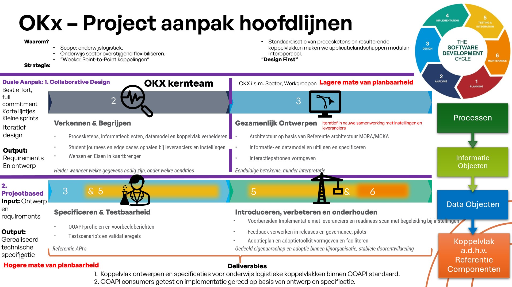
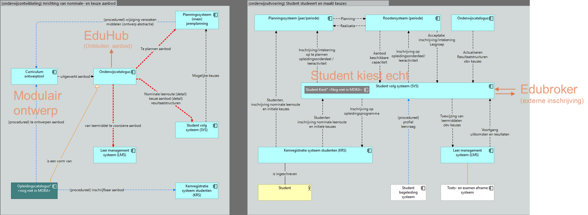

# OKx Projectoverzicht

**Doel.** Dit is het context-artefact van OKx: het leest vóór de [opdracht](../architecture/docs/requirements/opdracht.md) en beschrijft waar het project vandaan komt, hoe het werkt en welke informatiestromen het wil standaardiseren.

**Scope.** Context en aanpak; de doelen zijn in detail uitgewerkt in de opdracht, de afspraken in de artefacten die daaruit voortkomen (zie "Van context naar artefacten" hieronder).

## Doelbinding
Project OKx is een onderdeel van het [groeifondsprogramma Npuls](https://npuls.nl/pijlers/leren-zonder-drempels), zoals bekrachtigd door het Nederlandse ministerie van Onderwijs, Cultuur en Wetenschap. De repository dient als een knowledge base voor het inhoudelijke component van dit project.

OKx heeft als doel **uniforme en gestandaardiseerde koppelvlakken** voor onderwijslogistiek te realiseren, met het BOPSI-implementatiepad als uitgangspunt. De scope start bij **MBO**; **HO** (hoger onderwijs) volgt in een later stadium. Door koppelvlakken eenduidig te specificeren ontstaat interoperabiliteit tussen systemen en partijen in de onderwijsketen. Waar passend sluiten uitwerkingen aan op de [Open Onderwijs API (OEAPI)](https://openonderwijsapi.nl/); eisen komen vóór de techniekkeuze.

OKx maakt **eenduidige afspraken** mogelijk tussen instellingen, leveranciers en andere ketenpartijen, en zorgt dat kennis niet versnippert: besluiten, open vragen en uitwerkingen landen in deze repositories en groeien door via issues en pull requests. Dat is niet vanzelf klaar: onderwijslogistiek raakt processen, beleid en techniek tegelijk, de fasering start in het mbo en bouwt stapsgewijs uit, en delen van het geheel zijn nog onderwerp van verkenning, ontwerp en besluitvorming.

## Van context naar artefacten

Al het werk komt voort uit één lijn, de [requirementsboom](../architecture/docs/requirements/README.md): van de [opdracht](../architecture/docs/requirements/opdracht.md) met drie doelen via epics, features en stories naar de koppelingen, en van daaruit naar de koppelingspecificaties in [Npuls-OKx/Public](https://github.com/Npuls-OKx/Public/tree/dev/Koppelvlakspecificaties). De stories komen uit de [leerroute-uitwerking](../architecture/docs/specificatie/leerroute-uitwerking/README.md) en haar scenario's. Architectuurbesluiten (ADR's) en agent-skills zijn losse artefacten die op de opdracht voortbouwen of ernaar verwijzen; ze leggen de opdracht niet uit.

## Scope: OKx vs OKE

- **OKx** is de overkoepelende projectcontext: visie, besluitvorming, ketenplaten, fasering en informatiestromen. Alles wat de *waarom* en *waarbinnen* van de koppelvlakken beschrijft, hoort bij OKx.
- **OKE** (Onderwijslogistiek Keten Examen) is een **subdomein** binnen OKx. Onder OKE vallen de concrete MOKA-koppelvlakspecificaties voor het domein *Examen Uitvoering en beoordeling* (en eventuele andere OKE-subdomeinen later). OKE is een eerdere uitwerking van een sector initiatief om digitaal examineren te realiseren binnen het mbo. De OKx aanpak is gebaseerd op eerdere ervaring van OKE.
- De deliverables (MOKA koppelvlakspecificaties, informatiemodellen, templates) staan dus onder OKx, met OKE als eerste uitwerking.

## Projectaanpak

De projectaanpak van het OKx-kernteam volgt een vaste lijn van **begrijpen** naar **ontwerpen** naar **realiseren**. Het project bevindt zich **nu** in de fase **begrijpen**, met een lichte start in de **ontwerpfase** (onder meer door de MOKA-koppelvlakspecificatie voor OKE, en de initiatieven om de OKx uitwerking te realiseren).

## Hoofdplaat OKx informatiestromen

Het projectteam OKx wil de vraagstelling van de **sector** (van de instellingen) kanaliseren richting de **leveranciers** van onderwijsondersteunende software. De onderstaande hoofdplaat geeft een indicatie van alle informatiestromen die in samenwerking — en volgens de MOKA-koppelvlakspecificaties — uitgewerkt kunnen worden. Daarmee geeft ze richting en ondersteunt ze goed geïnformeerde architectuur- en technische besluiten.

**Keten en concept (invoer voor technische specs):** wat de stromen in de keten betekenen en hoe dat richting geeft aan berichtspecificaties, klassendiagrammen en API-uitwerking, staat in [OKx Informatiestromen (ketenconcept)](OKx_Informatiesstromen.md).

**Architectuur en model:** hoe besluiten en informatiestromen samenhangen met documentatie en het ArchiMate-model staat in [OKx Architectuurbesluiten en impact](OKx_Architectuurbesluiten-en-impact.md) en [Informatiestromen, ArchiMate en MOKA-view](OKx_Informatiestromen-ArchiMate-en-MOKA-view.md).

**In de plaat: rood = eerste prioriteit.**

### Interpretatie van de informatiestromen (uit de hoofdplaat)

De onderstaande tabel interpreteert de plaat **"hoofdplaat-okx-informatiestromen-v20260317.png"**. Alleen de flowlijnen die **niet blauw** (procedureel) en **niet oranje** (o.a. OKE/Edubroker) zijn, zijn opgenomen — dit zijn de informatiestromen die verder gespecificeerd moeten worden. De semantische beschrijving op of bij elke lijn in de plaat is overgenomen en waar nodig kort uitgebreid. **Context:** linkervlak = onderwijsontwikkeling, inrichting van nominale- en keuze aanbod; rechter (grijs) vlak = student studeert en maakt keuzes / onderwijsuitvoering (flexibel onderwijs).

| Nr | Referentie component (van) | Referentie component (naar) | Semantische beschrijving informatiestroom | Context | Prioriteit |
|----|----------------------------|-----------------------------|------------------------------------------|---------|------------|
| 1 | Curriculum ontwerptool | Onderwijscatalogus | Uitgewerkt aanbod | Onderwijsontwikkeling, inrichting nominale- en keuze aanbod | 0 (Basis, voedt alle andere systemen) |
| 2 | Onderwijscatalogus | Planningssysteem (meer jarenplanning) | Te plannen aanbod | Onderwijsontwikkeling, inrichting nominale- en keuze aanbod |1 |
| 3 | Onderwijscatalogus | Student volg systeem (SVS) | Nominale leerroute (detail), keuze aanbod (detail) en resultaatstructuren | Onderwijsontwikkeling, inrichting nominale- en keuze aanbod | 2 |
| 4 | Leer management systeem (LMS) | Onderwijscatalogus | Van leermiddel te voorziene aanbod | Onderwijsontwikkeling, inrichting nominale- en keuze aanbod | 3  |
| 5 | Planningssysteem (meer jarenplanning) | Student volg systeem (SVS) | Mogelijke keuzes | Onderwijsontwikkeling, inrichting nominale- en keuze aanbod | - |
| 6 | Planningssysteem (jaar/periode) | Student Kiest (nog niet in MORA) | Inschrijving/intekening op te plannen opleidingsonderdeel / leeractiviteit | Student studeert, maakt keuzes / onderwijsuitvoering (flexibel onderwijs) | - |
| 7 | Roostersysteem (periode) | Student Kiest (nog niet in MORA) | Aanbod beschikbare capaciteit | Student studeert, maakt keuzes / onderwijsuitvoering (flexibel onderwijs) | - |
| 8 | Onderwijscatalogus | Roostersysteem (periode) | Acceptatie inschrijving/intekening Lesgroep | Student studeert, maakt keuzes / onderwijsuitvoering (flexibel onderwijs) | - |
| 9 | Onderwijscatalogus | Student volg systeem (SVS) | Actualiseren resultaatstructuren obv keuzes | Student studeert, maakt keuzes / onderwijsuitvoering (flexibel onderwijs) | - |
| 10 | Student Kiest (nog niet in MORA) | Student volg systeem (SVS) | Inschrijving op opleidingsprogramma | Student studeert, maakt keuzes / onderwijsuitvoering (flexibel onderwijs) | - |
| 11 | Student Kiest (nog niet in MORA) | Kernregistratie systeem studenten (KRS) | Studenten, inschrijving nominale leerroute en initiële keuzes | Student studeert, maakt keuzes / onderwijsuitvoering (flexibel onderwijs) | - |
| 12 | Student volg systeem (SVS) | Leer management systeem (LMS) | Toewijzing van leermiddelen obv keuzes | Student studeert, maakt keuzes / onderwijsuitvoering (flexibel onderwijs) | - |
| 13 | Student volg systeem (SVS) | Toets- en examen afname systeem | Voortgang uitkomsten en resultaten | Student studeert, maakt keuzes / onderwijsuitvoering (flexibel onderwijs) | - |
| 14 | Kernregistratie systeem studenten (KRS) | Student | Is ingeschreven | Student studeert, maakt keuzes / onderwijsuitvoering (flexibel onderwijs) | - |
| 15 | Student | Student Kiest (nog niet in MORA) | *In aanbouw* (impliciete keuze-interactie door de student) | Student studeert, maakt keuzes / onderwijsuitvoering (flexibel onderwijs) | - |
| 16 | Planningssysteem (jaar/periode) | Roostersysteem (periode) | Planning | Student studeert, maakt keuzes / onderwijsuitvoering (flexibel onderwijs) | - |
| 17 | Roostersysteem (periode) | Planningssysteem (jaar/periode) | Realisatie | Student studeert, maakt keuzes / onderwijsuitvoering (flexibel onderwijs) | - |

*Waar uit de plaat geen eenduidige tekst of component kon worden afgeleid staat *in aanbouw*; overige rijen kunnen door het kernteam worden aangevuld of verfijnd (circa 20 lijnen in de plaat).*

## Relatie tot ArchiMate-model (in deze repo)

Het functionele en technische ontwerp wordt ondersteund door een **ArchiMate-model** in [`architecture/model/model.archimate`](../architecture/model/model.archimate). Dit model bevat o.a. **MOKA-koppelvlakspecificatie-views**; de view **01. Onderwijsvisie vertalen naar onderwijsaanbod - Basis Model** is een groot diagram om stroom **1** (curriculumontwerp → onderwijscatalogus) t/m 17 en aanverwante processen te verdiepen — zie [Informatiestromen, ArchiMate en MOKA-view](OKx_Informatiestromen-ArchiMate-en-MOKA-view.md).

## Werkwijze: async ontwikkelen

- Ontwikkeling verloopt **asynchroon**: documentatie en specificaties worden iteratief bijgewerkt op basis van input uit de keten en vanuit BOPSI.
- Wijzigingen gaan via **issues** en **pull requests**; geen directe commits op de hoofdbranch zonder review waar dat van toepassing is.
- Versiebeheer en historie blijven zichtbaar in Git.

## Bijdragen: issues en PRs

- Voorstellen, vragen en fouten: graag via **issues** in deze repository.
- Concrete wijzigingen in documenten of specificaties: via **pull requests**, bij voorkeur gekoppeld aan een issue.
- Contact voor toegang en afstemming: **niek.derksen@surf.nl**.

## Repo-inhoud (kort)

| Onderdeel | Locatie | Inhoud |
|-----------|---------|--------|
| OKx context | `doc/`, `img/` | Projectoverzicht, besluitboom/historie, informatiestromen, bijlagen |
| Release en versionering | [`OKx_Release-management-en-versionering.md`](OKx_Release-management-en-versionering.md) | Voorstel voor versienummers en de verhouding tussen meta- en spec-releases |
| Architectuurbesluiten (samenvatting) | [`doc/OKx_Architectuurbesluiten-en-impact.md`](OKx_Architectuurbesluiten-en-impact.md) | ADR’s, impact op keten/model |
| ArchiMate en MOKA-view (gids) | [`doc/OKx_Informatiestromen-ArchiMate-en-MOKA-view.md`](OKx_Informatiestromen-ArchiMate-en-MOKA-view.md) | Hoofdplaat ↔ model ↔ Basis Model-view |
| OKE uitwerking | `OKE/` | Eerste subdomein-uitwerking (o.a. examen: uitvoering en beoordeling) |
| Generiek template | `moka-koppelvlakspecificaties/Template/` | MOKA-template en generieke instructies |

Zie ook de [root README](../README.md) als startpunt van de leeslijn, en [Bijdragen voor beginners](Bijdragen-voor-beginners.md) voor git/GitHub, branches en PR’s.
