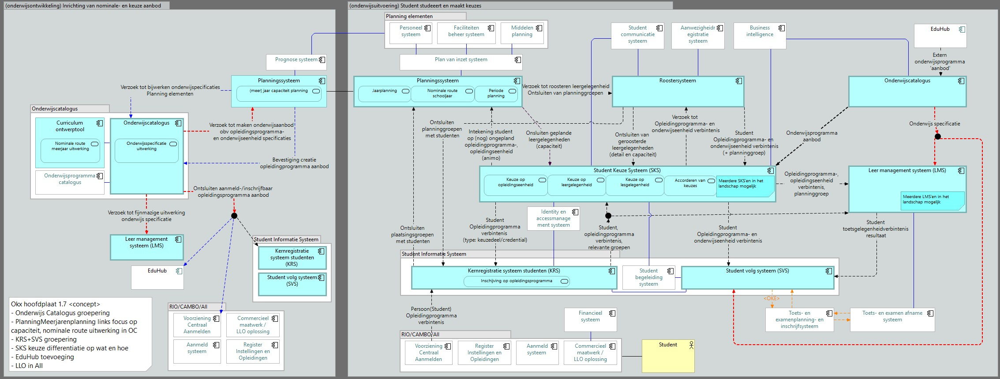

# OKx Projectoverzicht

**Doel.** Dit is het context-artefact van OKx: het leest vóór de [opdracht](../architecture/docs/requirements/opdracht.md) en beschrijft waar het project vandaan komt, hoe het werkt en welke informatiestromen het wil standaardiseren.

**Scope.** Context en aanpak; de doelen zijn in detail uitgewerkt in de opdracht, de afspraken in de artefacten die daaruit voortkomen (zie "Van context naar artefacten" hieronder).

## Doelbinding
Project OKx is een onderdeel van het [groeifondsprogramma Npuls](https://npuls.nl/pijlers/leren-zonder-drempels), zoals bekrachtigd door het Nederlandse ministerie van Onderwijs, Cultuur en Wetenschap. De repository dient als een knowledge base voor het inhoudelijke component van dit project.

OKx heeft als doel **uniforme en gestandaardiseerde koppelvlakken** voor onderwijslogistiek te realiseren, met het BOPSI-implementatiepad als uitgangspunt. De scope start bij **MBO**; **HO** (hoger onderwijs) volgt in een later stadium. Door koppelvlakken eenduidig te specificeren ontstaat interoperabiliteit tussen systemen en partijen in de onderwijsketen. Waar passend sluiten uitwerkingen aan op de [Open Onderwijs API (OEAPI)](https://openonderwijsapi.nl/); eisen komen vóór de techniekkeuze.

OKx maakt **eenduidige afspraken** mogelijk tussen instellingen, leveranciers en andere ketenpartijen, en zorgt dat kennis niet versnippert: besluiten, open vragen en uitwerkingen landen in deze repositories en groeien door via issues en pull requests. Dat is niet vanzelf klaar: onderwijslogistiek raakt processen, beleid en techniek tegelijk, de fasering start in het mbo en bouwt stapsgewijs uit, en delen van het geheel zijn nog onderwerp van verkenning, ontwerp en besluitvorming.

## Van context naar artefacten

Al het werk komt voort uit één lijn, de [requirementsboom](../architecture/docs/requirements/README.md): van de [opdracht](../architecture/docs/requirements/opdracht.md) met drie doelen via epics, features en stories naar de koppelingen, en van daaruit naar de koppelingspecificaties in [Npuls-OKx/Public](https://github.com/Npuls-OKx/Public/tree/dev/Koppelvlakspecificaties). De stories komen uit de [leerroute-uitwerking](../architecture/docs/specificatie/leerroute-uitwerking/README.md) en haar scenario's. Architectuurbesluiten (ADR's) en agent-skills zijn losse artefacten die op de opdracht voortbouwen of ernaar verwijzen; ze leggen de opdracht niet uit.

## Twee repositories: private source en public source

OKx werkt in twee repositories met elk een eigen rol:

| Repository | Rol | Wat er leeft |
|---|---|---|
| [Npuls-OKx/meta](https://github.com/Npuls-OKx/meta) | **Private source**: de werkomgeving | Kaderstelling, werkversies, onderzoeken en de requirementsboom in wording |
| [Npuls-OKx/Public](https://github.com/Npuls-OKx/Public) | **Public source**: de gecontroleerde artefacten | Koppelvlakspecificaties met de koppelingspecificaties en payload-specificaties, uitgangspunten, architectuurprincipes en architectuurbesluiten (ADR's), met releases via semantische versionering |

De uiteindelijke deliverables ontstaan in de public source: de bron (`src`) wordt met een documentgeneratie-pipeline gebouwd tot het koppelvlakspecificatie-document dat stakeholders als DocX of PDF ontvangen. Documenten staan daarom op zichzelf, zonder verwijzingen naar issues of intern werkmateriaal.

## Scope: OKx vs OKE

- **OKx** is de overkoepelende projectcontext: visie, besluitvorming, ketenplaten, fasering en informatiestromen. Alles wat de *waarom* en *waarbinnen* van de koppelvlakken beschrijft, hoort bij OKx.
- **OKE** (Onderwijslogistiek Keten Examen) is een **subdomein** binnen OKx. Onder OKE vallen de concrete MOKA-koppelvlakspecificaties voor het domein *Examen Uitvoering en beoordeling* (en eventuele andere OKE-subdomeinen later). OKE is een eerdere uitwerking van een sector initiatief om digitaal examineren te realiseren binnen het mbo. De OKx aanpak is gebaseerd op eerdere ervaring van OKE.
- De deliverables (MOKA koppelvlakspecificaties, informatiemodellen, templates) staan dus onder OKx, met OKE als eerste uitwerking.

## Projectaanpak

De projectaanpak van het OKx-kernteam volgt een vaste lijn van **begrijpen** naar **ontwerpen** naar **realiseren**. Het project bevindt zich **nu** in de fase **begrijpen**, met een lichte start in de **ontwerpfase** (onder meer door de MOKA-koppelvlakspecificatie voor OKE, en de initiatieven om de OKx uitwerking te realiseren).

## Hoofdplaat OKx informatiestromen

De hoofdplaat toont de informatiestromen tussen de applicatiecomponenten in de keten en geeft richting aan de koppelingspecificaties. Versie 1.7 is leidend; de legenda draagt zelf nog de aanduiding "concept", dus lees de plaat als richtinggevend, niet als vastgesteld.

De duiding van de plaat, met de genummerde informatiestromen en hun interpretatie, staat in het [hoofdplaat-document](OKx_Hoofdplaat-informatiestromen.md).

## Repo-inhoud (kort)

| Onderdeel | Locatie | Inhoud |
|-----------|---------|--------|
| OKx context | `doc/`, `img/` | Projectoverzicht, besluitboom/historie, informatiestromen, bijlagen |
| Release en versionering | [`OKx_Release-management-en-versionering.md`](OKx_Release-management-en-versionering.md) | Voorstel voor versienummers en de verhouding tussen meta- en spec-releases |
| Architectuurbesluiten (samenvatting) | [`doc/OKx_Architectuurbesluiten-en-impact.md`](OKx_Architectuurbesluiten-en-impact.md) | ADR’s, impact op keten/model |
| OKE uitwerking | `OKE/` | Eerste subdomein-uitwerking (o.a. examen: uitvoering en beoordeling) |

Zie ook de [root README](../README.md) als startpunt van de leeslijn, en [Bijdragen voor beginners](Bijdragen-voor-beginners.md) voor git/GitHub, branches en PR’s.
