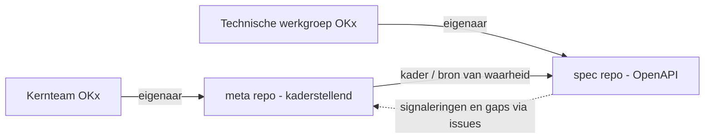
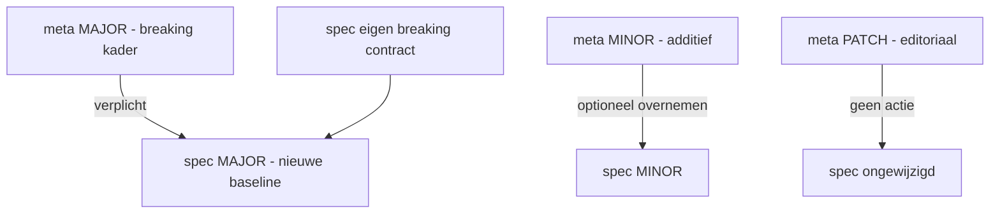

# OKx: release management en versionering (meta en spec)

**Status:** concept / voorstel. Dit document beschrijft hoe OKx omgaat met **releases** en **versienummers** voor twee samenhangende repositories: de kaderstellende **meta**-repository (deze repo, [`Npuls-OKx/meta`](https://github.com/Npuls-OKx/meta)) en de toekomstige **spec**-repository met de OpenAPI-specificatie ([`Npuls-OKx/specification`](https://github.com/Npuls-OKx/specification)). Het bouwt voort op de **branchstrategie** uit de beginnershandleiding, paragraaf 9 ([`doc/Bijdragen-voor-beginners.md` (§9)](Bijdragen-voor-beginners.md#9-branchstrategie-main-dev-feature-branches-tags)).

Dit is een voorstel: het wordt pas afspraak na review en merge door de eigenaren (zie [Eigenaarschap](#2-eigenaarschap-en-governance)). Leg een geaccepteerd besluit hierover vast als ADR in [`architecture/dr/`](../architecture/dr/).

---

## 1. Doel en scope

OKx levert straks **twee** dingen op die elk hun eigen levenscyclus hebben:

- **meta** — het **kaderstellende** gedachtegoed: begrippenkader, ankertabel, scenario's, het OKx OEAPI **consumer-profiel** en de signaleringen (zie [`architecture/docs/specificatie/okx-oeapi-consumer-profiel/`](../architecture/docs/specificatie/okx-oeapi-consumer-profiel/)). Dit zegt *wat* de standaard betekent.
- **spec** — de **technische uitwerking**: een **OpenAPI-specificatie** die het consumer-profiel bouwbaar en testbaar maakt. Dit zegt *hoe* de standaard op het koppelvlak wordt uitgewisseld.

Omdat de **spec wordt gebouwd op basis van de meta-repository**, zijn er **twee versielijnen** die los van elkaar kunnen bewegen maar wel een vaste **verhouding** hebben. Dit document legt vast:

1. welke **uitgangspunten** gelden voor de versienummers (major / minor / patch);
2. hoe de **meta-** en **spec-release-labels zich tot elkaar verhouden** (compatibiliteit);
3. hoe en **wat** we **communiceren** naar belanghebbenden;
4. hoe het **releaseproces** aansluit op de branchstrategie (§9).

---

## 2. Eigenaarschap en governance

| Artefact | Repository | Eigenaar / verantwoordelijk | Rol |
|----------|------------|------------------------------|-----|
| **meta** (kaderstellend) | [`Npuls-OKx/meta`](https://github.com/Npuls-OKx/meta) | **Kernteam OKx** ([GitHub-team `kernteam-okx`](https://github.com/orgs/Npuls-OKx/teams/kernteam-okx)) | Houdt verantwoordelijkheid en eigenaarschap over richting, samenhang en releases van het kader. |
| **spec** (OpenAPI) | [`Npuls-OKx/specification`](https://github.com/Npuls-OKx/specification) | **Technische werkgroep OKx** | Bouwt en beheert de specificatie als **gedragen standaard**; bepaalt spec-releases binnen het kader van meta. |

Uitgangspunt: **iedereen** mag issues en PR's indienen; **alleen het verantwoordelijke team merget** in de betreffende repo (zie [`CONTRIBUTING.md`](../CONTRIBUTING.md) en [`.cursor/rules/okx-governance.mdc`](../.cursor/rules/okx-governance.mdc)). Het kernteam bewaakt het kader; de technische werkgroep bewaakt de bouwbare standaard. Beide werken met dezelfde branchstrategie (§9): feature → `dev` → `main`, met **tags op `main`** als release-labels.



---

## 3. Uitgangspunten voor versienummers

We gebruiken in **beide** repositories **Semantic Versioning** (SemVer, [semver.org](https://semver.org/lang/nl/)): een release-label heeft de vorm `MAJOR.MINOR.PATCH`, bijvoorbeeld `v1.4.2`. De betekenis verschilt per repo, omdat de "consument" verschilt: bij meta is dat de **lezer/implementator van het kader**, bij spec de **client/integratie die het OpenAPI-contract gebruikt**.

De kernuitgangspunten:

- **U1 — SemVer overal.** Beide repo's gebruiken `MAJOR.MINOR.PATCH`. Het label staat als **git tag op `main`** (§9), bijvoorbeeld `v1.4.2`.
- **U2 — MAJOR = breaking.** Een major-verhoging betekent een **niet-backward-compatibele** wijziging: bestaande implementaties of clients moeten worden aangepast.
- **U3 — MINOR = additief, niet-breaking.** Een minor voegt **functionaliteit** toe (nieuw concept, nieuw optioneel veld, nieuwe enum-waarde, nieuw scenario, nieuw optioneel koppelvlak) **zonder** bestaande afnemers te breken.
- **U4 — PATCH = correctie zonder semantische wijziging.** Tekstcorrecties, verduidelijkingen, voorbeeldfixes en bugfixes die **het contract en de betekenis niet veranderen**.
- **U5 — Onafhankelijke lijnen, vaste verhouding.** meta en spec hebben **elk hun eigen** versienummer (ze zijn niet aan elkaar gelijk). Hun samenhang loopt via een expliciete **meta-baseline** in spec (zie [§5](#5-verhouding-tussen-meta-en-spec-compatibiliteit)).
- **U6 — `0.x`-fase (nu).** Zolang een repo nog **in aanbouw** is (`0.y.z`), mag een **minor breaking** zijn; we proberen dat te vermijden en kondigen het expliciet aan. Pas vanaf `1.0.0` gelden de garanties van U2–U4 onverkort. Beide repo's starten in `0.x`.
- **U7 — Deprecaten vóór verwijderen.** Iets dat verdwijnt, wordt eerst **als deprecated** gemarkeerd in een minor (met alternatief en termijn) en pas in een **volgende major** verwijderd.
- **U8 — Eén release = één bumptype.** De zwaarste wijziging in een release bepaalt de bump (één breaking change maakt de hele release major).
- **U9 — Bump wordt voorgesteld in de PR, bevestigd bij release.** De indiener labelt de PR (`semver:major` / `semver:minor` / `semver:patch`); het verantwoordelijke team bevestigt het bij het samenstellen van de release vanuit `dev` → `main`.

### Wanneer is iets "breaking"?

Onderscheid is belangrijk omdat het de major/minor-keuze en de communicatie stuurt.

**meta (kader) — breaking als het bestaande implementaties of interpretaties ongeldig maakt:**

- wijziging of hernoeming van een **begrip** of van een rij/kolom in de **ankertabel** (§3.2.6 van het profiel) waardoor eerdere mapping niet meer klopt;
- wijziging van een **cardinaliteit** of van de grens tussen *specificatie / aanbod / verbintenis / resultaat*;
- een eerder **optioneel** kaderelement **verplicht** maken;
- wijziging van de betekenis van een state in de `Association.state`-machine.

**spec (OpenAPI) — breaking als bestaande clients breken:**

- een veld/endpoint **verwijderen** of **hernoemen**;
- een type **versmallen** of een veld van optioneel naar **`required`** zetten;
- een **enum-waarde verwijderen** of de betekenis ervan wijzigen;
- response-/request-structuur of -semantiek wijzigen waardoor bestaande aanroepen anders uitpakken.

**Niet-breaking (minor):** nieuw **optioneel** veld of endpoint; nieuwe enum-waarde via `x-ooapi-extensible-enum`; nieuw optioneel koppelvlak; toevoegen van een scenario in meta.

**Patch:** typefix, verduidelijkte omschrijving, gecorrigeerd voorbeeld, gerepareerde `$ref` of link **zonder** contractwijziging.

---

## 4. Wat staat op `main`, wat is een release?

Aansluitend op §9 van de beginnershandleiding:

| Branch / ref | Rol |
|--------------|-----|
| `main` | Stabiele **release**-lijn; elke release is hier getagd. |
| `dev` | Integratie van de **volgende release**. |
| `feature/...` | Vanaf `dev`, PR terug naar `dev`. |
| **tag** op `main` | Release-label (`vMAJOR.MINOR.PATCH`). |

Een **release** = `dev` → `main` mergen, taggen, en (voor minor/major) **release notes** publiceren. Optioneel een **release candidate** vanaf `dev`: `v1.5.0-rc.1`. Een **hotfix** takt vanaf `main`, gaat als PR naar `main` (patch-tag) én terug naar `dev`.

---

## 5. Verhouding tussen meta en spec (compatibiliteit)

De spec wordt **op basis van meta** gebouwd. Daarom declareert **elke spec-release expliciet tegen welke meta-versie hij is gebouwd**: de **meta-baseline** (op `MAJOR.MINOR`-niveau; patch is voor de baseline niet relevant). Leg dit vast in het OpenAPI-document, bijvoorbeeld:

```yaml
info:
  version: 1.2.0          # spec-versie (SemVer)
  x-okx-meta-baseline: "1.2"   # gebouwd tegen meta 1.2
```

en herhaal het in de README/`COMPATIBILITY.md` van de spec-repo.

### Compatibiliteitsregels

- **C1 — Spec verwijst altijd naar een meta-baseline.** Een spec-release zonder baseline is incompleet.
- **C2 — meta-minor is voorwaarts compatibel binnen dezelfde meta-major.** Een spec met baseline `1.2` blijft conceptueel geldig tegen meta `1.2`, `1.3`, ... (meta-minors zijn additief, U3). De spec hoeft niet bij elke meta-minor mee te bumpen; hij doet dat alleen als hij de nieuwe mogelijkheid **overneemt**.
- **C3 — meta-major dwingt een spec-major (re-baseline).** Een breaking kaderwijziging (U2) betekent dat de spec niet zomaar geldig blijft. De technische werkgroep plant een **spec-major** met een nieuwe baseline (`2.x`). Tot die er is, blijft de bestaande spec een **onderhoudslijn** tegen de vorige meta-major (alleen patches), met een communicatie over het migratievenster.
- **C4 — spec mag onafhankelijk majoren/minoren.** De spec kan een eigen **breaking** OpenAPI-wijziging doen (bijv. een betere contractstructuur) zonder dat meta wijzigt; dan stijgt alleen de spec-major, met dezelfde baseline.
- **C5 — meta-patch raakt de spec niet.** Editoriale meta-patches vragen geen spec-actie.

Daaruit volgt: het **spec-versienummer is niet gelijk** aan het meta-versienummer. De koppeling is de **baseline**, niet het cijfer.

### Verhoudingsmatrix

| Wijziging in... | Type | meta-bump | spec-bump |
|-----------------|------|-----------|-----------|
| meta — kader breaking (begrip/ankertabel/cardinaliteit/state) | major | `MAJOR` | spec **`MAJOR`** (re-baseline naar nieuwe meta-major) |
| meta — additief concept (scenario/optioneel veld/enum-waarde/koppelvlak) | minor | `MINOR` | spec **`MINOR`** bij overname, anders **geen** |
| meta — editoriaal | patch | `PATCH` | **geen** |
| spec — contract breaking (veld weg/required/enum weg) | major | geen | **`MAJOR`** (baseline kan gelijk blijven) |
| spec — additief contract (optioneel veld/endpoint/enum-waarde) | minor | geen | **`MINOR`** |
| spec — bugfix/editoriaal zonder contractwijziging | patch | geen | **`PATCH`** |



---

## 6. Communicatie naar belanghebbenden

- **Major** → **wel** communiceren. Release notes + migratiehandleiding (wat breekt, wat te doen, deprecatietermijn). Bij meta-major ook: gevolg voor de spec-roadmap.
- **Minor** → **wel** communiceren. Release notes met de nieuwe (optionele) mogelijkheden; expliciet dat er **niets breekt**.
- **Patch** → **niet** actief communiceren naar belanghebbenden. Wel zichtbaar in de git-historie, tags en (optioneel) een changelog-regel, maar geen aankondiging.

Praktisch: gebruik **GitHub Releases** per repo voor minor/major (de tekst van de release notes), en houd desgewenst een `CHANGELOG.md` bij waarin patches als regel meelopen maar niet worden uitgelicht. Bij een **meta-major** stuurt het kernteam de boodschap; bij een **spec-release** de technische werkgroep. Cross-repo gevolgen (meta-major → spec-major in voorbereiding) benoemen we in beide kanalen.

---

## 7. Releaseproces (samengevat)

Per repo, conform §9:

1. Werk in `feature/...` vanaf `dev`; PR met voorgesteld **semver-label** terug naar `dev`.
2. Verzamel wijzigingen op `dev` (integratie volgende release).
3. Bepaal de bump (zwaarste wijziging wint, U8); voor spec: controleer/actualiseer de **meta-baseline** (C1).
4. PR `dev` → `main`; review door het verantwoordelijke team.
5. Merge, **tag** op `main` (`vX.Y.Z`).
6. Voor **minor/major**: publiceer release notes (§6). Voor **patch**: geen aankondiging.

Cross-repo: bij een **meta-major** opent de technische werkgroep een issue/milestone voor de bijbehorende **spec-major** (C3) en plant het migratievenster.

---

## 8. Concreet voorbeeld binnen het OKx OEAPI consumer-profiel

Onderstaande (illustratieve) tijdlijn laat de regels zien aan de hand van echte profielelementen: de **ankertabel**, `curriculumType`, `Association.state`, de signalering `RequestForOffering` en `educationSpecification` (zie het [specificatiedocument](../architecture/docs/specificatie/okx-oeapi-consumer-profiel/doc/20260501_Specificatie_document_OKx_OEAPI_profiel.md)).

| # | Wijziging (concreet) | Type | meta | spec (baseline) | Communiceren? |
|---|----------------------|------|------|------------------|----------------|
| 0 | Eerste stabiele consumer-profiel: ankertabel (6x6), 9 leerroutes, `curriculumType` {`nominaal`,`flexibel`,`hybride`}, `Association.state`-machine. Spec implementeert fase 1 (`Programme`/`Course`/`LearningComponent`/`TestComponent`/`LearningOutcome`) als OpenAPI. | baseline | `v1.0.0` | `v1.0.0` (meta 1.0) | Ja (major) |
| 1 | Profiel verduidelijkt de omschrijving van `learningOutcomeCoverage` in de ankertabel; geen semantische wijziging. | editoriaal | `v1.0.1` | — | Nee (patch) |
| 2 | Profiel werkt het **vraag-gestuurde** scenario uit en signalering 7 `RequestForOffering` als **optioneel** koppelvlak (additief). | additief | `v1.1.0` | `v1.1.0` (meta 1.1): optioneel `RequestForOffering`-pad; bestaande clients ongewijzigd | Ja (minor) |
| 3 | Spec repareert een foute `$ref` in een `educationSpecification`-voorbeeld; contract ongewijzigd. | spec-bugfix | — | `v1.1.1` (meta 1.1) | Nee (patch) |
| 4 | Profiel breidt `curriculumType` uit met `duaal` via `x-ooapi-extensible-enum` (additief). | additief | `v1.2.0` | `v1.2.0` (meta 1.2): enum-waarde overgenomen | Ja (minor) |
| 5 | Profiel **herdefinieert resultaat**: `Onderwijsresultaat` wordt een **verplicht eigen object** i.p.v. alleen `Association.state` (kolom 6 van de ankertabel wijzigt van cardinaliteit). Breaking voor implementaties. | breaking kader | `v2.0.0` | `v2.0.0` (meta 2.0): nieuw verplicht resultaat-koppelvlak; clients migreren | Ja (major) |

Toelichting op de regels:

- **#1 en #3** zijn patches in verschillende repo's: editoriaal in meta resp. bugfix in spec, beide **niet** gecommuniceerd.
- **#2 en #4** zijn minors: nieuwe **optionele** mogelijkheden. De spec **kan** ze overnemen (en doet dat hier) zonder iets te breken; dankzij C2 blijft een client op `v1.1` ook werken tegen meta `1.2`.
- **#5** is de enige major: een kaderwijziging die de spec **dwingt** mee te gaan (C3). De `v1.x`-spec wordt onderhoudslijn tegen meta `1.x` totdat het migratievenster sluit (U7).

---

## 9. Samenvatting van de uitgangspunten

| Aspect | Afspraak |
|--------|----------|
| Schema | SemVer `MAJOR.MINOR.PATCH`, tag op `main` (U1, §9) |
| MAJOR | Breaking; afnemers moeten migreren (U2) |
| MINOR | Additief, niet-breaking; nieuwe optionele mogelijkheden (U3) |
| PATCH | Correctie zonder semantische/contractwijziging (U4) |
| meta vs spec | Onafhankelijke versielijnen, gekoppeld via **meta-baseline** in spec (U5, C1) |
| meta-major | Dwingt spec-major / re-baseline (C3) |
| meta-minor | Spec optioneel mee; voorwaarts compatibel (C2) |
| 0.x-fase | Minor mag (vermijdbaar) breaking zijn tot 1.0.0 (U6) |
| Communicatie | Major + minor: wel; patch: niet (§6) |
| Eigenaar meta | Kernteam OKx (§2) |
| Eigenaar spec | Technische werkgroep OKx (§2) |

---

## 10. Openstaande punten / vervolg

- Vastleggen als **ADR** in [`architecture/dr/`](../architecture/dr/) zodra geaccepteerd (link naar het issue en deze pagina).
- Afspraak over **deprecatietermijn / migratievenster** (hoeveel minors blijft een vorige major onderhouden?).
- Inrichten van **release notes / CHANGELOG**-conventie en eventueel automatisering (PR-labels → changelog) in beide repo's.
- Definitief **veld voor de meta-baseline** in de OpenAPI (`x-okx-meta-baseline`) bevestigen met de technische werkgroep.

Reageren of bijdragen? Open een issue of PR; koppel die aan dit document (`See also #...`). Zie [`doc/Bijdragen-voor-beginners.md`](Bijdragen-voor-beginners.md).
