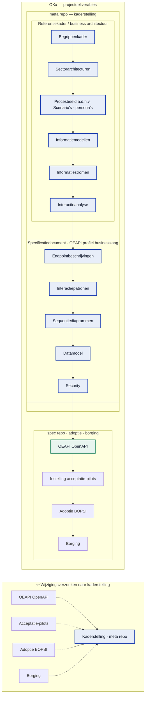
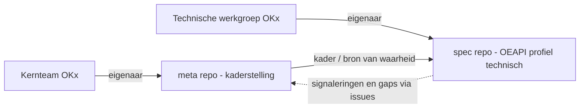
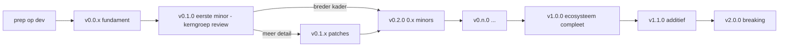
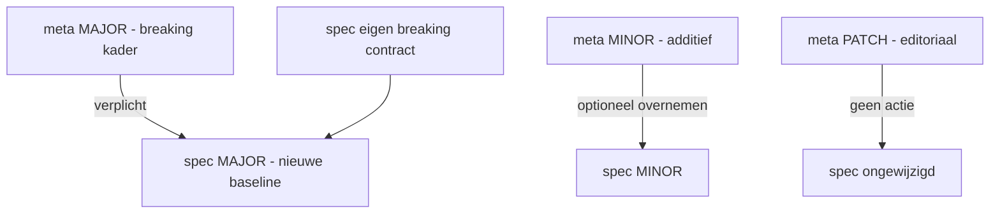
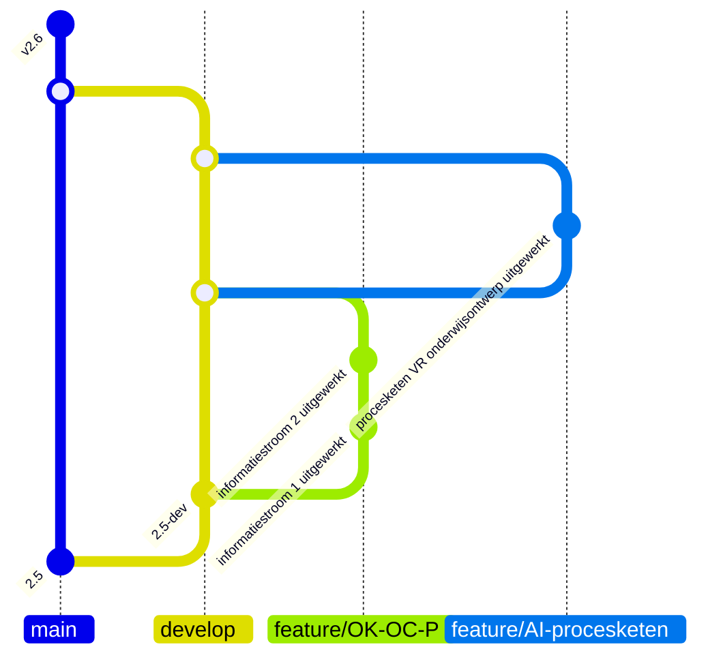
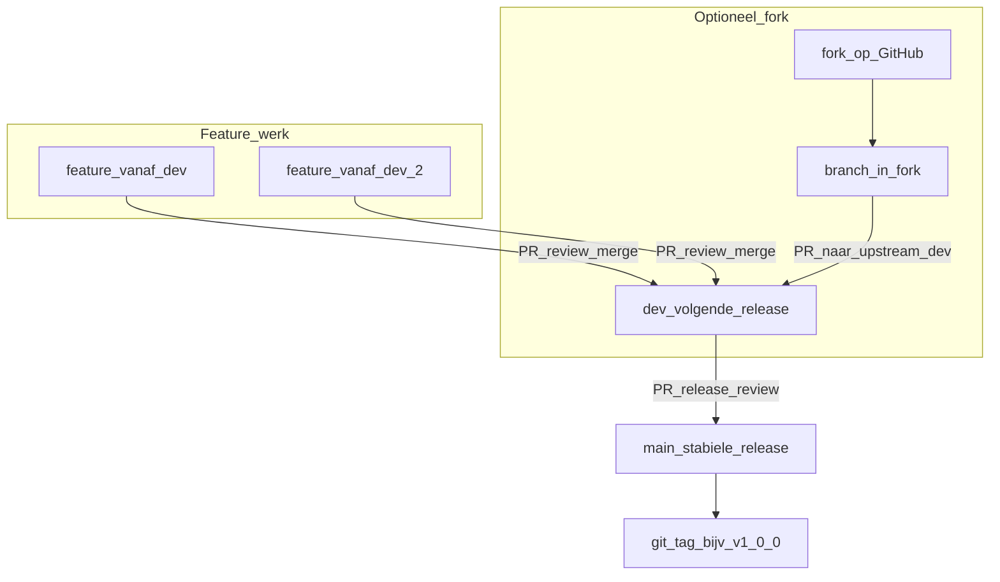
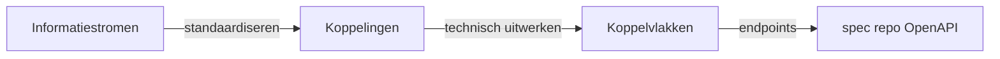

# OKx: product release management en versionering

| Status | Datum | Auteur |
|--------|-------|--------|
| Voorstel | 2026-07-13 | Niek Derksen (Kernteam OKx) |

Dit document wordt pas afspraak na review en merge door de eigenaren (zie [§2 Eigenaarschap](#2-eigenaarschap-en-governance)). Leg een geaccepteerd besluit vast als ADR in [[Referentiemateriaal/adr in Npuls-OKx/Public](https://github.com/Npuls-OKx/Public/tree/dev/Referentiemateriaal/adr)](https://github.com/Npuls-OKx/Public/tree/dev/Referentiemateriaal/adr). Het bouwt voort op de **branchstrategie** uit de beginnershandleiding, paragraaf 9 ([`doc/Bijdragen-voor-beginners.md` (§9)](Bijdragen-voor-beginners.md#9-branchstrategie-main-dev-feature-branches-tags)).

---

## 1. Doel en scope

OKx levert een samenhangende keten van **projectdeliverables** — van kaderstelling tot borging in de sector. Dit document gaat over **release management en versionering** van twee repositories: **meta** (kaderstelling) en **spec** (technische implementatie van het OEAPI-profiel).

Het diagram heeft twee delen: **boven** de deliverable-keten (boven → beneden), **onder** de terugkoppeling van wijzigingsverzoeken (gestippeld, zonder de keten te verstoren — dat voorkomt layoutproblemen in GitHub).



**Waar dit document over gaat** (gemarkeerd in het diagram):

| Repository | Scope in de keten | Rol |
|------------|-------------------|-----|
| [**meta**](https://github.com/Npuls-OKx/meta) (deze repo) | **Kaderstelling** — referentiekader / business architectuur en **specificatiedocument** (OEAPI-profiel op businesslaag) | Zegt *wat* de standaard betekent: begrippenkader, sectorarchitecturen (MOSA, HOSA, ROSA, MORA, HORA), scenario's en persona's, informatiemodellen, informatiestromen, interactieanalyse; plus endpointbeschrijvingen, interactiepatronen, sequentiediagrammen, datamodel en security op kaderniveau (zie [`architecture/docs/specificatie/okx-oeapi-consumer-profiel/`](../architecture/docs/specificatie/okx-oeapi-consumer-profiel/)). **Wijzigingsverzoeken** uit piloten en adoptie komen hier terug. |
| [**spec**](https://github.com/Npuls-OKx/specification) | **Technische implementatie** van het OEAPI-profiel | OpenAPI-specificatie — bouwbaar en testbaar koppelvlak. |

**Verdere projectdeliverables** (niet in deze repo's, wel afhankelijk van hun releases):

- **Instelling acceptatie-pilots** — leveranciers en instellingen toetsen de standaard in de praktijk; koppelvlakken op applicaties op basis van de OEAPI-spec.
- **Adoptie via BOPSI** — scholen helpen de standaard in te bedden: OKx-businessarchitectuur mappen naar de organisatie, het instellingsdatamodel naar het OKx-datamodel, en koppelingen met bestaande systemen activeren.
- **Borging** — overdracht naar lijnorganisaties zodra het Npuls-programma afloopt.

Vanaf **OEAPI OpenAPI**, **instelling acceptatie-pilots**, **BOPSI** en **borging** kunnen **wijzigingsverzoeken** terug naar **kaderstelling** in meta (onderste blok in het diagram).

Omdat de **spec wordt gebouwd op basis van meta**, zijn er **twee versielijnen** die los kunnen bewegen maar een vaste **verhouding** hebben (baseline, §5). Instelling acceptatie-pilots, adoptie en borging volgen eigen planning; zij **consumeren** vastgelegde meta- en spec-releases en kunnen **wijzigingsverzoeken** terugvoeren. Dit document legt vast:

1. welke **uitgangspunten** gelden voor de versienummers (major / minor / patch);
2. hoe de **meta-** en **spec-release-labels zich tot elkaar verhouden** (compatibiliteit);
3. hoe en **wat** we **communiceren** naar belanghebbenden;
4. hoe het **releaseproces** aansluit op de branchstrategie (§9).

---

## 2. Eigenaarschap en governance

| Artefact | Repository | Eigenaar / verantwoordelijk | Rol |
|----------|------------|------------------------------|-----|
| **meta** (kaderstelling) | [`Npuls-OKx/meta`](https://github.com/Npuls-OKx/meta) | **Kernteam OKx** ([GitHub-team `kernteam-okx`](https://github.com/orgs/Npuls-OKx/teams/kernteam-okx)) | Referentiekader, business architectuur en OEAPI-profiel op businesslaag; richting, samenhang en releases. |
| **spec** (OEAPI profiel technisch) | [`Npuls-OKx/specification`](https://github.com/Npuls-OKx/specification) | **Kerngroep Techniek OKx** | Technische implementatie van het OEAPI-profiel (OpenAPI); spec-releases binnen het kader van meta. |

Uitgangspunt: **iedereen** mag issues en PR's indienen; **alleen het verantwoordelijke team merget** in de betreffende repo (zie [`CONTRIBUTING.md`](../CONTRIBUTING.md) en [`.cursor/rules/okx-governance.mdc`](../.cursor/rules/okx-governance.mdc)). Het kernteam bewaakt het kader; de technische werkgroep bewaakt de bouwbare standaard. Beide werken met dezelfde branchstrategie (§9): feature → `dev` → `main`, met **tags op `main`** als release-labels.



---

## 3. Uitgangspunten voor versienummers

We gebruiken in **beide** repositories **Semantic Versioning** (SemVer, [semver.org](https://semver.org/lang/nl/)): een release-label heeft de vorm `MAJOR.MINOR.PATCH`, bijvoorbeeld `v1.4.2`. De betekenis verschilt per repo, omdat de "consument" verschilt: bij meta is dat de **lezer/implementator van het kader**, bij spec de **client/integratie die het OpenAPI-contract gebruikt**.

De kernuitgangspunten:

- **U1 — SemVer overal.** Beide repo's gebruiken `MAJOR.MINOR.PATCH`. Het label staat als **git tag op `main`** (§9), bijvoorbeeld `v1.4.2`.
- **U2 — MAJOR = breaking.** Een major-verhoging betekent een **niet-backward-compatibele** wijziging: bestaande implementaties of clients die functionaliteit missen of negatieve effecten ervaren van de breaking feature wordt geadviseerd om te migreren naar de volgende MAJOR versie.
- **U3 — MINOR = additief, niet-breaking.** Een minor voegt **functionaliteit** toe (nieuw concept, nieuw optioneel veld, nieuwe enum-waarde, nieuw scenario, nieuw optioneel koppelvlak) **zonder** bestaande afnemers te breken.
- **U4 — PATCH = correctie zonder semantische wijziging.** Tekstcorrecties, verduidelijkingen, voorbeeldfixes en bugfixes die **het contract en de betekenis niet veranderen**.
- **U5 — Onafhankelijke lijnen, vaste verhouding.** meta en spec hebben **elk hun eigen** versienummer (ze zijn niet aan elkaar gelijk). Hun samenhang loopt via een expliciete **meta-baseline** in spec (zie [§5](#5-verhouding-tussen-meta-en-spec-compatibiliteit)).
- **U6 — `0.x`-fase (nu).** Zolang een repo nog **in aanbouw** is (`0.y.z`), mag een **minor breaking** zijn; we proberen dat te vermijden en kondigen het expliciet aan. Pas vanaf `1.0.0` gelden de garanties van U2–U4 onverkort. Beide repo's starten in `0.x`.
- **U7 — Deprecaten vóór verwijderen.** Iets dat verdwijnt, wordt eerst **als deprecated** gemarkeerd in een minor (met alternatief en termijn) en pas in een **volgende major** verwijderd.
- **U8 — Eén release = één bumptype.** De zwaarste wijziging in een release bepaalt de bump (één breaking change maakt de hele release major).
- **U9 — Bump wordt voorgesteld in de PR, bevestigd bij release.** De indiener labelt de PR (`semver:major` / `semver:minor` / `semver:patch`); het verantwoordelijke team bevestigt het bij het samenstellen van de release vanuit `dev` → `main`.
- **U10 — Twee major-versies ondersteund (spec).** OKx ondersteunt tegelijk hooguit **twee major-versies** van de **spec** (OpenAPI): de **actuele major** (*latest*) en de **voorafgaande major** (*latest-1*). Oudere majors vallen buiten het ondersteuningsvenster. Instellingen en leveranciers die op *latest-1* draaien en nieuwe functionaliteit willen, worden **actief aangeraden** zo spoedig mogelijk te upgraden naar *latest*.

### Ondersteunde major-versies (spec)

Voor implementaties en integraties geldt:

| Versie | Status | Richtlijn |
|--------|--------|-----------|
| **latest** (actuele major, bijv. `v3.x`) | Ondersteund | Doelversie voor nieuwe implementaties en uitbreidingen. |
| **latest-1** (vorige major, bijv. `v2.x`) | Ondersteund (beperkt) | Alleen voor bestaande implementaties tijdens migratie; geen nieuwe scope buiten patches/onderhoud tenzij het kernteam anders afspreekt. |
| **latest-2 en ouder** | Niet ondersteund | Upgrade naar *latest* of *latest-1* vereist. |

Bij een nieuwe **spec-major** verschuift de ondersteuningslijn mee: wat *latest* was wordt *latest-1*; de oudste ondersteunde major valt weg. Communicatie bij een major-release (§6) benoemt dit venster expliciet en wijst afnemers op *latest-1* → *latest* als zij nieuwe mogelijkheden willen benutten.

### Versielifecycle meta (OKx)

De meta-repo doorloopt een vaste **opbouw- en stabilisatiefase**. Dit is logisch binnen SemVer en sluit aan op milestone 3 en de start van de spec:

| Fase | Versie | Betekenis |
|------|--------|-----------|
| **Opbouw op `dev`** | geen tag | Patches verzamelen via issues/PR's naar `dev`; geen communicatie naar kerngroep techniek. |
| **Vroege `0.0.x`** | `v0.0.1`, `v0.0.2`, … | Eerste tags op `main`: kaderfundament (ankertabel, begrippenkader, AMIGO, branchbeleid). Nog **niet** reviewbaar voor spec-start. |
| **Eerste minor** | **`v0.1.0`** | Eerste **reviewbare** kaderrelease (milestone 3: OC P, LR1–LR3). **Release-PR** `dev` → `main`; **kerngroep techniek** beoordeelt of de kaderstelling voldoende is om de **spec** te starten. |
| **Feedback na `0.1.0`** | `v0.1.1`, `v0.1.2`, … (**patch**) | Kerngroep vraagt **meer detail** of verduidelijking; geen fundamenteel bredere scope. |
| **Breder kader in `0.x`** | `v0.2.0`, `v0.3.0`, … (**minor**) | Kaderstelling wordt **fundamenteel breder** (meer informatiestromen/koppelingen, additief). Spec kan optioneel meebumpen (C2). |
| **Ecosysteem compleet** | **`v1.0.0`** (**major**) | Alle informatiestromen, **gestandaardiseerde koppelingen** en bijbehorende **koppelvlakken** zijn beschreven; kader **stabiel** en klaar voor volledige implementatie. |
| **Uitbreiding na stabiel** | `v1.1.0`, `v1.2.0`, … (**minor**) | Nieuwe stromen/koppelingen **additief** bovenop het volledige `1.0`-kader; niet-breaking. |
| **Breaking na `1.x`** | **`v2.0.0`** (**major**) | Fundamentele kaderwijziging (ankertabel, cardinaliteit, verplichting); spec-major en migratie (C3). Cyclus herhaalt: `2.1`, … → `3.0`. |



### Wanneer is iets "breaking"?

**meta (kader) — breaking als het bestaande implementaties of interpretaties ongeldig maakt:**

- wijziging of hernoeming van een **begrip** of van een rij/kolom in de **ankertabel** (§3.2.6 van het profiel) waardoor eerdere mapping niet meer klopt;
- wijziging van een **cardinaliteit** of van de grens tussen *specificatie / aanbod / verbintenis / resultaat*;
- een eerder **optioneel** kaderelement **verplicht** maken;

**spec (OpenAPI) — breaking als bestaande clients breken:**

We volgen hierin het [beleid van OEAPI op het gebied van versioning en de relatie met consumers](https://oeapi.eu/v6.0/#/governance/version-management?id=start). In relatie tot consumers en  volgen hierbij het [beleid van OEAPI over versieonderhandeling en relatie met consumers zoals vastgelegd in ADR-0005](https://github.com/open-education-api/governance-decisions/blob/main/adr/0005-version-negotiation-via-http-header.md). Het hier te ontwikkelen profiel en de bijbehorende consumers hanteren het beleid en de principes uit deze OEAPI ADR.

Op hoofdlijnen:
- een veld/endpoint **verwijderen** of **hernoemen**;
- een type **versmallen** of een veld van optioneel naar **`required`** zetten;
- een **enum-waarde verwijderen** of de betekenis ervan wijzigen;
- response-/request-structuur of -semantiek wijzigen waardoor bestaande aanroepen anders uitpakken.

**Niet-breaking (minor):** nieuw **optioneel** veld of endpoint; nieuwe enum-waarde via `x-ooapi-extensible-enum`; nieuw optioneel koppelvlak; toevoegen van een scenario in meta.

**Patch:** typefix, verduidelijkte omschrijving, gecorrigeerd voorbeeld, gerepareerde `$ref` of link **zonder** contractwijziging.

---

## 4. Wat staat op `main`, wat is een release?

Aansluitend op §9 van de beginnershandleiding:

| Branch / ref | Rol |
|--------------|-----|
| `main` | Stabiele **release**-lijn; elke release is hier getagd. |
| `dev` | Integratie van de **volgende release**. |
| `feature/...` | Vanaf `dev`, PR terug naar `dev`. |
| **tag** op `main` | Release-label (`vMAJOR.MINOR.PATCH`). |

Een **release** = `dev` → `main` mergen, taggen, en (voor minor/major) **release notes** publiceren. Optioneel een **release candidate** vanaf `dev`: `v1.5.0-rc.1`. Een **hotfix** takt vanaf `main`, gaat als PR naar `main` (patch-tag) én terug naar `dev`.

---

## 5. Verhouding tussen meta en spec (compatibiliteit)

De spec wordt **op basis van meta** gebouwd. Daarom declareert **elke spec-release expliciet tegen welke meta-versie hij is gebouwd**: de **meta-baseline** (op `MAJOR.MINOR`-niveau; patch is voor de baseline niet relevant). Leg dit vast in het OpenAPI-document, bijvoorbeeld:

```yaml
info:
  version: 1.2.0          # spec-versie (SemVer)
  x-okx-meta-baseline: "1.2"   # gebouwd tegen meta 1.2
```

en herhaal het in de README/`COMPATIBILITY.md` van de spec-repo.

### Compatibiliteitsregels

- **C1 — Spec verwijst altijd naar een meta-baseline.** Een spec-release zonder baseline is incompleet.
- **C2 — meta-minor is voorwaarts compatibel binnen dezelfde meta-major.** Een spec met baseline `1.2` blijft conceptueel geldig tegen meta `1.2`, `1.3`, ... (meta-minors zijn additief, U3). De spec hoeft niet bij elke meta-minor mee te bumpen; hij doet dat alleen als hij de nieuwe mogelijkheid **overneemt**.
- **C3 — meta-major dwingt een spec-major (re-baseline).** Een breaking kaderwijziging (U2) betekent dat de spec niet zomaar geldig blijft. De technische werkgroep plant een **spec-major** met een nieuwe baseline (`2.x`). Tot die er is, blijft de bestaande spec een **onderhoudslijn** tegen de vorige meta-major (alleen patches), met een communicatie over het migratievenster. Het **ondersteuningsvenster** voor spec-majors is beperkt tot *latest* en *latest-1* (U10).
- **C4 — spec mag onafhankelijk majoren/minoren.** De spec kan een eigen **breaking** OpenAPI-wijziging doen (bijv. een betere contractstructuur) zonder dat meta wijzigt; dan stijgt alleen de spec-major, met dezelfde baseline.
- **C5 — meta-patch raakt de spec niet.** Editoriale meta-patches vragen geen spec-actie.

Daaruit volgt: het **spec-versienummer is niet gelijk** aan het meta-versienummer. De koppeling is de **baseline**, niet het cijfer.

### Verhoudingsmatrix

| Wijziging in... | Type | meta-bump | spec-bump |
|-----------------|------|-----------|-----------|
| meta — kader breaking (begrip/ankertabel/cardinaliteit/state) | major | `MAJOR` | spec **`MAJOR`** (re-baseline naar nieuwe meta-major) |
| meta — additief concept (scenario/optioneel veld/enum-waarde/koppelvlak) | minor | `MINOR` | spec **`MINOR`** bij overname, anders **geen** |
| meta — editoriaal | patch | `PATCH` | **geen** |
| spec — contract breaking (veld weg/required/enum weg) | major | geen | **`MAJOR`** (baseline kan gelijk blijven) |
| spec — additief contract (optioneel veld/endpoint/enum-waarde) | minor | geen | **`MINOR`** |
| spec — bugfix/editoriaal zonder contractwijziging | patch | geen | **`PATCH`** |



---

## 6. Communicatie naar belanghebbenden

- **Major** → **wel** communiceren. Release notes + migratiehandleiding (wat breekt, wat te doen, deprecatietermijn). Bij meta-major ook: gevolg voor de spec-roadmap. Vermeld het **ondersteuningsvenster** (U10): *latest* en *latest-1*; actief upgrade-advies voor afnemers op *latest-1* die nieuwe functionaliteit willen.
- **Minor** → **wel** communiceren. Release notes met de nieuwe (optionele) mogelijkheden; expliciet dat er **niets breekt**.
- **Patch** → **niet** actief communiceren naar belanghebbenden. Wel zichtbaar in de git-historie, tags en (optioneel) een changelog-regel, maar geen aankondiging.

**Uitzondering meta — kerngroep techniek.** Patches op `dev` en `v0.0.x`-releases worden **niet** actief gecommuniceerd naar de kerngroep techniek. De **eerste minor** (`v0.1.0`) en elke volgende **minor/major** op `main` wel — via **release-PR** `dev` → `main` en release notes. Bij `v0.1.0` beoordeelt de kerngroep techniek expliciet of de kaderstelling voldoende is om de spec te starten; eventuele wijzigingsverzoeken leiden tot `v0.1.x` (patch) of `v0.2.0` (minor).

Praktisch: gebruik **GitHub Releases** per repo voor minor/major (de tekst van de release notes), en houd desgewenst een `CHANGELOG.md` bij waarin patches als regel meelopen maar niet worden uitgelicht. Bij een **meta-major** stuurt het kernteam de boodschap; bij een **spec-release** de technische werkgroep. Cross-repo gevolgen (meta-major → spec-major in voorbereiding) benoemen we in beide kanalen.

---

## 7. Releaseproces (samengevat)

Per repo, conform §9:

1. Werk in `feature/...` vanaf `dev`; PR met voorgesteld **semver-label** terug naar `dev`.
2. Verzamel wijzigingen op `dev` (integratie volgende release).



### Stroom van wijzigingen (via PR’s)




3. Bepaal de bump (zwaarste wijziging wint, U8); voor spec: controleer/actualiseer de **meta-baseline** (C1).
4. PR `dev` → `main`; review door het verantwoordelijke team.
5. Merge, **tag** op `main` (`vX.Y.Z`).
6. Voor **minor/major**: publiceer release notes (§6). Voor **patch**: geen aankondiging.

Cross-repo: bij een **meta-major** opent de technische werkgroep een issue/milestone voor de bijbehorende **spec-major** (C3) en plant het migratievenster.

---

## 8. Concreet voorbeeld: roadmap milestone 3 → `v1.0.0`

Onderstaande tijdlijn koppelt de versieregels aan de actuele roadmap (zie ook [versielifecycle meta](#versielifecycle-meta-okx)). **Milestone 3** — [*Deel OKx specificatie document — OC P afgerond*](https://github.com/Npuls-OKx/meta/milestone/3) — levert de **eerste minor** op meta: **`v0.1.0`**. Daarmee vraagt het kernteam aan de **kerngroep techniek** of de kaderstelling voldoende is om de **spec** te starten. Daarna volgen `0.1.x`-patches (meer detail) of `0.2.0`+-minors (breder kader) tot het volledige ecosysteem beschreven is; pas dan **`v1.0.0`**. Nieuwe scope na `1.0` → `1.1`; breaking na stabiel `1.x` → `2.0`.

### Ladder: informatiestroom → koppeling → koppelvlak

| Laag | Wat het is | Wanneer vastgelegd |
|------|------------|-------------------|
| **Informatiestroom** | Conceptuele gegevensbeweging tussen ketenpartners/systemen (wie levert wat aan wie, en waarom). Zichtbaar op de OKx-informatiestromenplaat en in scenario-uitwerkingen. | Scenario-analyse + gegevens-/interactie-analyse (AMIGO stap 1–3); milestone 3 dekt de OC P-stromen voor LR1–LR3. |
| **Koppeling** | Gestandaardiseerde **realisatie/implementatie** van één of meer informatiestromen: afspraken over berichten, interactiepatronen en semantiek tussen twee (of meer) systemen — nog **zonder** de volledige endpoint-set. | Interactie-analyse + berichtspecificatie (AMIGO stap 3–5); milestone 3 levert de eerste set gestandaardiseerde koppelingen voor OC P. |
| **Koppelvlak** | Technische **uitwerking** van een koppeling: het geheel van **endpoints** (interfacespecificatie) waarmee de koppeling in software wordt gebouwd. Eén koppelvlak kan meerdere endpoints omvatten. | Interfacespecificatie (AMIGO stap 6) in de **spec**-repo; volgt **nadat** de koppelingen gestandaardiseerd zijn. Op basis van alle gestandaardiseerde koppelingen worden uiteindelijk alle koppelvlakken gebouwd. |



**Milestone 3-scope** (augustus 2026): begrippenkader, scenario's en informatiemodellen voor LR1–LR3; informatiestromen en **koppelingen** voor OC P (o.a. CO→OC, OC↔planning, planning↔rooster); vorm en bruikbaarheid vergelijkbaar met de [OKE MBO Toetsafname-specificatie](https://www.edustandaard.nl/app/uploads/2024/09/OKE-MBO-toetsafname-specs-v1.0_20240909conceptversie.pdf). **Nog buiten scope van milestone 3:** volledige koppelvlakken in de spec-repo en informatiestromen buiten OC P (bijv. SKS, examenketen, cross-instelling).

**Werkwijze `dev` → `main` (meta).** Het kaderstellend fundament groeit eerst als **verzameling van patches** op `dev` (losse issues en PR's). Die iteraties worden **niet** gecommuniceerd naar de **kerngroep techniek**. Pas bij **`v0.1.0`** (eerste minor, milestone 3) volgt een **release-PR** `dev` → `main`: de kerngroep techniek beoordeelt of de kaderstelling voldoende is om de spec te starten. Wijzigingsverzoeken daarna: **patch** (`v0.1.1`, …) bij meer detail; **minor** (`v0.2.0`, …) als het kader fundamenteel breder moet.

| # | Wijziging (concreet) | Type | meta | spec (baseline) | Communiceren? |
|---|----------------------|------|------|-----------------|----------------|
| *prep* | **Iteratieve kaderopbouw op `dev`:** kleinere taken en verbeteringen (issues/PR's naar `dev`: ankertabel-toelichting, scenario's, concept-informatiemodellen, informatiestromenplaat, release-documentatie). Elke merge is een **patch** in de verzameling op `dev`; nog **geen** tag op `main`. | patch (verzameling) | — (alleen op `dev`) | — | Nee — niet naar kerngroep techniek |
| 0 | **Kaderstellend fundament** in `0.0.x`: ankertabel (6×6), begrippenkader, AMIGO-aanpak, branch-/releasebeleid (dit document), scenario's LR1–LR3 in uitwerking. Nog geen reviewbare OC P-specificatie. | `0.0.x`-basis | - | — | Nee |
| 1 | **Milestone 3 — eerste minor (`v0.1.0`):** consumer-profieldeel *OC P afgerond* voor LR1–LR3: informatiestromen OC↔planning↔rooster, concept-informatiemodellen (o.a. Apothekersassistent LR1, delta LR2/LR3), interactiepatronen en **gestandaardiseerde koppelingen** CO→OC en OC↔P&R; keuzedelen als zelfstandig programma; sequentiediagrammen en gegevensanalyse op kaderniveau. Voldoende concreet voor validatie (vergelijkbaar met OKE Toetsafname). **Release-PR `dev` → `main`:** kerngroep techniek beoordeelt of spec-implementatie kan starten. | minor (eerste) | `v0.1.0` | `v0.1.0` (meta 0.1): eerste koppelingen als OpenAPI-paden **optioneel** | **Ja** — PR `dev` → `main`, review **kerngroep techniek** |
| 2 | **Wijzigingsverzoek kerngroep:** meer detail of verduidelijking (ankertabel-toelichting, concept-attribuutnamen, voorbeelden); geen bredere scope. | patch | `v0.1.1` | `v0.1.1` (meta 0.1) | Nee (patch) |
| 3 | **Kader breder in `0.x`:** aanvullende informatiestromen/koppelingen binnen OC P of extra LR3-uitwerking; fundamenteel meer scope, additief. | minor | `v0.2.0` | `v0.2.0` (meta 0.2): optionele uitbreiding koppeling OC↔P&R | **Ja (minor)** |
| 4 | Spec repareert voorbeeld-`$ref` of typering in een koppelingsbeschrijving; contract ongewijzigd. | spec-bugfix | — | `v0.2.1` (meta 0.2) | Nee (patch) |
| 5 | **Verdere `0.x`-minors** tot ecosysteem compleet: o.a. OC↔SKS, examenketen, cross-instelling (§7); signalering `RequestForOffering`; `curriculumtype` met `duaal`. | additief | `v0.3.0` … `v0.n.0` | spec-minors bij overname (C2) | **Ja (minor)** |
| 6 | **`v1.0.0` — ecosysteem compleet:** alle informatiestromen, **gestandaardiseerde koppelingen** en bijbehorende **koppelvlakken** beschreven; kader stabiel en klaar voor volledige implementatie. | major (eerste stabiel) | `v1.0.0` | `v1.0.0` (meta 1.0): volledige koppelvlakken | **Ja (major)** |
| 7 | **Na `1.0` — additief:** nieuwe stromen/koppelingen (bijv. extra leerroute, optioneel koppelvlak); niet-breaking. | minor | `v1.1.0` | `v1.1.0` (meta 1.1) | **Ja (minor)** |
| 8 | **Breaking na stabiel `1.x`:** fundamentele kaderwijziging (bijv. verplicht resultaat-object i.p.v. alleen `Association.state`). | major | `v2.0.0` | `v2.0.0` (meta 2.0): re-baseline; migratie | **Ja (major)** |

Toelichting op de regels:

- ***prep*** en **#0** (`v0.0.x`): kaderopbouw zonder review door kerngroep techniek; geen startsein voor spec.
- **#1 (`v0.1.0`)** is het **startsein**: milestone 3, eerste minor, PR `dev` → `main` ter review door **kerngroep techniek**. Bij goedkeuring kan de technische werkgroep de spec starten tegen baseline `0.1`.
- **#2** (`v0.1.x`): typisch antwoord op wijzigingsverzoeken na #1 — **meer detail**, geen bredere scope; patches, niet gecommuniceerd (§6).
- **#3 en #5** (`v0.2.0` … `v0.n.0`): **breder kader** in de `0.x`-fase; minors, wel communiceren.
- **#4** is een spec-patch; meta ongewijzigd.
- **#6 (`v1.0.0`)** is het **eindsein van de eerste kadercyclus**: volledig ecosysteem beschreven — niet te verwarren met #1.
- **#7** (`v1.1.0`): additief bovenop stabiel `1.0`; cyclus kan herhalen (`1.2`, …).
- **#8 (`v2.0.0`)**: breaking na `1.x`; daarna opnieuw `2.1`, … → `3.0` (C3, U7).

---

## 9. Samenvatting van de uitgangspunten

| Aspect | Afspraak |
|--------|----------|
| Schema | SemVer `MAJOR.MINOR.PATCH`, tag op `main` (U1, §9) |
| MAJOR | Breaking; afnemers wordt geadviseerd om te migreren (U2) |
| MINOR | Additief, niet-breaking; nieuwe optionele mogelijkheden (U3) |
| PATCH | Correctie zonder semantische/contractwijziging (U4) |
| meta vs spec | Onafhankelijke versielijnen, gekoppeld via **meta-baseline** in spec (U5, C1) |
| meta-major | Dwingt spec-major / re-baseline (C3) |
| meta-minor | Spec optioneel mee; voorwaarts compatibel (C2) |
| meta-lifecycle | `0.0.x` fundament → **`v0.1.0`** eerste minor (spec-start na kerngroep) → `0.1.x` patches / `0.2+` breder → **`v1.0.0`** ecosysteem compleet → `1.1+` additief → **`v2.0`** breaking |
| 0.x-fase | Minor mag (vermijdbaar) breaking zijn tot `1.0.0` (U6) |
| Communicatie | Major + minor: wel; patch: niet (§6); `v0.1.0` via PR naar **kerngroep techniek** |
| Ondersteuning spec | Hooguit **twee majors**: *latest* + *latest-1*; upgrade-advies *latest-1* → *latest* (U10) |
| Eigenaar meta | Kernteam OKx (§2) |
| Eigenaar spec | Technische werkgroep OKx (§2) |

---

## 10. Openstaande punten / vervolg

- Vastleggen als **ADR** in [[Referentiemateriaal/adr in Npuls-OKx/Public](https://github.com/Npuls-OKx/Public/tree/dev/Referentiemateriaal/adr)](https://github.com/Npuls-OKx/Public/tree/dev/Referentiemateriaal/adr) zodra geaccepteerd (link naar het issue en deze pagina).
- Afspraak over **deprecatietermijn / migratievenster** voor oudere minors binnen een major (U10 regelt het venster voor **majors**: *latest* + *latest-1*).
- Inrichten van **release notes / CHANGELOG**-conventie en eventueel automatisering (PR-labels → changelog) in beide repo's.


Reageren of bijdragen? Open een issue of PR; koppel die aan dit document (`See also #...`). Zie [`doc/Bijdragen-voor-beginners.md`](Bijdragen-voor-beginners.md).
