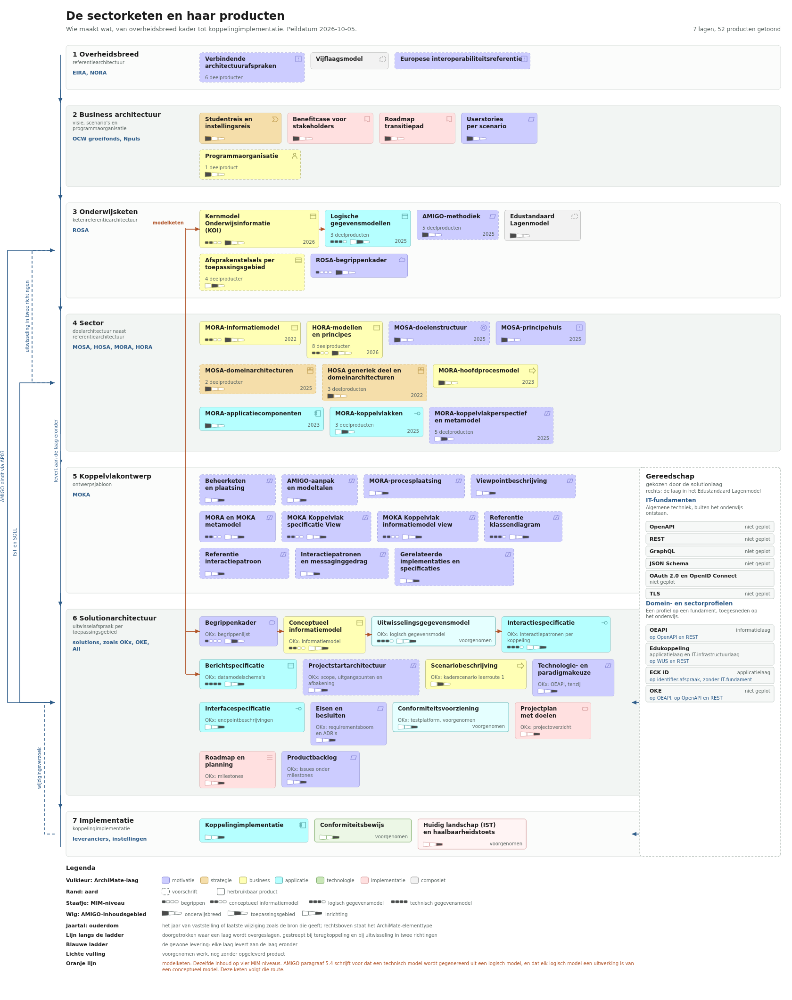

# De sectorketen en haar producten

Deze plaat toont de keten van kaderstelling tot implementatie, met per laag de partijen en de producten die zij maken. Zij beschrijft wat er is. Het oordeel over wat voor een bepaald doel ontbreekt laat zij aan de lezer, zodat dezelfde plaat een gatanalyse, een voortgangsanalyse en een aansluitvraag kan dragen.

Relateert aan: #262, #186.

## De plaat



De plaat in vectorvorm staat in [`img/OKx_sectorketen_v20261005.svg`](../img/OKx_sectorketen_v20261005.svg).

## Viewpointbeschrijving

| Onderdeel | Invulling |
|---|---|
| **Doel** | Zichtbaar maken welke partij welk product maakt in de keten die uitkomt bij een werkende koppeling, zodat een architect kan bepalen welke producten voor zijn eigen vraag bruikbaar zijn en waar zijn eigen werk landt. |
| **Belangen (concerns)** | Welke producten zijn over te nemen en welke een werkwijze voorschrijven. Op welk modelniveau staat een product, en voor hoe brede inhoud geldt het. Welke partij maakt en beheert een product. Waar landt een product van de solutionlaag in de keten. |
| **Scope** | De keten rond onderwijslogistiek in het mbo, van overheidsbreed kader tot koppelingimplementatie, met het hoger onderwijs als nevenspoor via HOSA en HORA. Op de plaat staan de producten die in het afhankelijkheidspad van een solution liggen; de volledige lijst leeft in [`doc/sectorketen-producten.json`](sectorketen-producten.json). |
| **Gebruikte modeltaal** | Een gelaagde productenkaart, getekend als SVG uit een JSON-bron. De vulkleuren volgen het ArchiMate-kleurenschema zoals Archi dat hanteert. De twee aanduidingen in een blok volgen de twee assen van de AMIGO-modellenmatrix. |
| **Relevante objecttypen en relaties** | Laag, partij, product, deelproduct en standaard. De relaties zijn levering van boven naar beneden, keuze vanuit de gereedschapsband, terugkoppeling van beneden naar boven, en de modelketen die dezelfde inhoud op vier modelniveaus verbindt. |
| **Verantwoording** | Zie [De herkomst van de ordening](#de-herkomst-van-de-ordening). |

## Legenda

De legenda staat in de plaat zelf, zodat het beeld ook buiten dit document leesbaar blijft.

| Kenmerk | Hoe het op de plaat staat |
|---|---|
| ArchiMate-elementtype | De vulkleur volgt de ArchiMate-laag; het pictogram rechtsboven geeft het type |
| Aard | De rand: onderbroken voor een voorschrift, doorgetrokken voor een herbruikbaar product |
| MIM-niveau | Een staafje van vier rechthoeken linksonder, gevuld tot het niveau van het product |
| AMIGO-inhoudsgebied | Een wig van drie vakken ernaast, met het eigen vak gevuld |
| Ouderdom | Rechtsonder het jaar van vaststelling of laatste wijziging zoals de bron dat geeft |
| Voorgenomen werk | Een lichtere vulling en het woord voorgenomen op de plek van het jaartal |
| Levering | De blauwe ladder links: elke laag levert aan de laag eronder |
| Modelketen | De oranje kam: dezelfde inhoud op vier modelniveaus |

## De ordening

Elke laag levert aan de laag eronder. Die lijn slaat op twee plaatsen over, en op een plaats loopt zij terug.

| Laag | Partijen | Soort |
|---|---|---|
| 1 Overheidsbreed | EIRA, NORA | referentiearchitectuur |
| 2 Business architectuur | OCW groeifonds, Npuls | visie, scenario's en programmaorganisatie |
| 3 Onderwijsketen | ROSA, met AMIGO daarbinnen | ketenreferentiearchitectuur |
| 4 Sector | MOSA en HOSA naast MORA en HORA | doelarchitectuur naast referentiearchitectuur |
| 5 Koppelvlakontwerp | MOKA | ontwerpsjabloon |
| 6 Solutionarchitectuur | solutions, zoals OKx, OKE en AII | uitwisselafspraak per toepassingsgebied |
| 7 Implementatie | leveranciers, instellingen | koppelingimplementatie |

Drie soorten architectuur staan apart, omdat zij een ander type product opleveren. ROSA is de ketenreferentiearchitectuur voor het hele onderwijs, gericht op uitwisseling tussen organisaties. MORA, HORA en FORA zijn sectorale referentiearchitecturen op het niveau van de bedrijfsvoering binnen een instelling. MOSA, HOSA en FOSA zijn de doelarchitecturen, met een agenda van te realiseren voorzieningen.

De lijnen die van de ladder afwijken:

| Lijn | Betekenis |
|---|---|
| Laag 3 naar laag 6 | AMIGO staat op laag 3 en bindt een solution rechtstreeks, via [OKx-AP03](https://github.com/Npuls-OKx/Public/blob/dev/Referentiemateriaal/principes/principes.md) |
| Laag 4 naar laag 6 | De projectstartarchitectuur haalt de gewenste stand uit de doelarchitectuur en de huidige stand uit de referentiearchitectuur |
| Laag 3 en laag 4 | Uitwisseling in twee richtingen, zoals de stippellijn in `rosa-knooppunt.png` toont |
| Laag 7 naar laag 6 | Een wijzigingsverzoek uit de implementatie komt terug bij de specificatie |

### De herkomst van de ordening

De laagnamen van laag 1, 3 en 4 en hun soort volgen [Relevante architecturen binnen het onderwijs](https://www.edustandaard.nl/rosa/onderwijsarchitecturen/) van Edustandaard en de plaat [`rosa-knooppunt.png`](../architecture/docs/specificatie/leerroute-uitwerking/img/rosa-knooppunt.png) die al in deze repository staat. Laag 2, 5, 6 en 7 komen uit geen van beide bronnen; die ordening is van OKx. De productlijsten komen uit de bronnen die per product in de JSON staan, met de bron-datum en de peildatum erbij.

## Drie kenmerken dragen het beeld

**Aard.** Een `voorschrift` zegt hoe iets gedaan moet worden en draagt geen inhoud die een volgende laag overneemt; de AMIGO-methodiek is daarvan het voorbeeld. Een `herbruikbaar product` draagt inhoud die een volgende laag kan overnemen zonder die opnieuw te maken; het Kernmodel Onderwijsinformatie is daarvan het voorbeeld.

Waar beide waarden passen geldt een beslisregel: wat een volgende laag ervan overneemt is bepalend. De inhoud zelf maakt het een herbruikbaar product; de werkwijze die het voorschrijft maakt het een voorschrift. Het MOSA-principehuis valt daarmee aan de productkant, omdat OKx de principes zelf overneemt in zijn eigen architectuurprincipes.

**MIM-niveau.** De vier modelniveaus van [MIM](https://docs.geostandaarden.nl/mim/mim/), het Metamodel Informatie Modellering, waar AMIGO zich in paragraaf 5.1 aan verbindt: begrippen, conceptueel informatiemodel, logisch gegevensmodel en technisch gegevensmodel. Hoe dieper het niveau, hoe voller het staafje. Een product dat geen informatiemodel is draagt `niet van toepassing` en toont geen staafje.

**AMIGO-inhoudsgebied.** De horizontale as van de [AMIGO-modellenmatrix](../moka-koppelvlakspecificaties/Template/doc/KoppelvlakSpecificatieTemplate.md): onderwijsbreed, toepassingsgebied en inrichting, van breed naar smal. De wig in het blok toont welk vak geldt.

Die twee assen samen zijn de modellenmatrix van AMIGO zelf, en zij laten zien wat de ladder op zichzelf verbergt: naarmate de keten dieper komt, wordt de modellering fijner en de reikwijdte smaller. Het Kernmodel Onderwijsinformatie staat onderwijsbreed en conceptueel; een berichtspecificatie staat op inrichting en technisch.

## De modelketen

De oranje kam verbindt dezelfde inhoud op vier modelniveaus: begrippenkader, conceptueel informatiemodel, logisch gegevensmodel, interactiespecificatie en berichtspecificatie. AMIGO paragraaf 5.4 schrijft die route voor: een technisch model wordt gegenereerd uit een logisch model, en elk logisch model is een uitwerking van een conceptueel model, met traceerbaarheidsrelaties ertussen.

De leden van de keten staan vooraan in hun band, zodat zij over de lagen heen uitlijnen en de kam geen blok doorsnijdt.

## De gereedschapsband

Standaarden staan naast de ladder. Een standaard is een keuze van de solutionlaag, gemaakt op grond van wat de oplossing vraagt. In AMIGO is dat stap 4, technologie- en paradigmakeuze met rationale erbij. De plaatsing van een standaard volgt een eigen as, het [Edustandaard Lagenmodel](https://rosa.wikixl.nl/index.php/Standaarden_geplot_op_het_Edustandaard_Lagenmodel) met vijf interoperabiliteitslagen; dat is hetzelfde vijflaagsmodel dat NORA hanteert, toegepast op het onderwijs.

De band kent twee soorten. **IT-fundamenten** zijn algemene techniek die buiten het onderwijs is ontstaan. **Domein- en sectorprofielen** liggen daarbovenop en zijn toegesneden op het onderwijs; per profiel staat het fundament eronder erbij.

De voorkeursregel: het sectorprofiel gaat voor het fundament. Waar het profiel aantoonbaar tekortschiet volgt de terugval op het fundament, met de onderbouwing erbij. Het uitgangspunt [OEAPI, tenzij](https://github.com/Npuls-OKx/Public/blob/dev/Referentiemateriaal/principes/uitgangspunten.md) is daarvan het voorbeeld.

OEAPI staat in het lagenmodel geplot op de informatielaag, als standaard voor uitwisseling tussen instellingen in het hoger onderwijs. OKx past hem toe in het mbo.

## De solutionlaag is algemeen

Laag 6 beschrijft wat een solutionarchitectuur oplevert, en niet wat OKx oplevert. De producten volgen de zes stappen van AMIGO, aangevuld met de projectkant: een projectstartarchitectuur die de gewenste en de huidige stand uit de lagen erboven haalt, een projectplan met doelen, een roadmap en een productbacklog. Onder elk blok staat de invulling door OKx, zodat de plaat ook voor OKE, AII of een volgende solution bruikbaar blijft.

De OKx-invulling per product:

| Product | Invulling door OKx |
|---|---|
| Begrippenkader | [begrippenlijst](../architecture/docs/specificatie/begrippen/begrippenlijst.md) |
| Conceptueel informatiemodel | [informatiemodel](../architecture/model/informatiemodel/informatiemodel.md), MIM-niveau 2 |
| Uitwisselingsgegevensmodel | logisch gegevensmodel, aangekondigd in het informatiemodel |
| Scenariobeschrijving | [kaderscenario leerroute 1](https://github.com/Npuls-OKx/Public/blob/dev/Referentiemateriaal/kaderscenario's/leerroute-1-regulier.md) |
| Interactiespecificatie, berichtspecificatie, interfacespecificatie | de [koppelvlakspecificaties](https://github.com/Npuls-OKx/Public/tree/dev/Koppelvlakspecificaties) |
| Eisen en besluiten | [requirementsboom](https://github.com/Npuls-OKx/Public/blob/dev/Referentiemateriaal/requirementsboom/README.md) en de [architectuurbesluiten](https://github.com/Npuls-OKx/Public/tree/dev/Referentiemateriaal/adr) |
| Projectplan met doelen | [projectoverzicht](OKx_Projectoverzicht.md) |
| Roadmap, productbacklog | de milestones en de issues in deze repository |
| Conformiteitsvoorziening | testplatform, voorgenomen |

## De plaat opnieuw maken

De bron is [`doc/sectorketen-producten.json`](sectorketen-producten.json). Een actualisatie is een wijziging in dat bestand, waarna de plaat opnieuw wordt getekend en de keuring draait.

```bash
python3 scripts/teken-sectorketen.py --uit img/OKx_sectorketen_v20261005.svg
python3 scripts/keur-plaat.py img/OKx_sectorketen_v20261005.svg --max-kruisingen 0
npx svgexport img/OKx_sectorketen_v20261005.svg img/OKx_sectorketen_v20261005.png 1680:
```

De keuring meldt schuine segmenten, tekst buiten het doek, tekst onder de leesbaarheidsgrens en kruisende lijnen. `--max-kruisingen` legt de drempel vast, zodat een latere wijziging het beeld niet drukker maakt.

Elk product draagt twee datums, omdat zij verschillende dingen zeggen. De `bron_datum` is de vaststelling of de laatste wijziging zoals de bron die geeft. De `peildatum` is wanneer OKx keek. Het jaar op de plaat is de `bron_datum`.

## Besluit

**Besluit nodig op:** de borging van de producten die OKx oplevert, na afloop van OKx.
**Door:** architectuur board, in afstemming met MBO Digitaal en Bureau Edustandaard.
**Voor:** de architectuursync van 2 tot en met 6 november 2026.
**Opties:** het beheer beleggen bij de ketenreferentiearchitectuur ROSA, met de logische gegevensmodellen bij de Architectuurraad; of het beheer beleggen bij de sectorarchitectuur MORA; of per product kiezen, langs de bestemmingen die in de bron staan.
