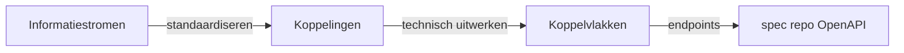

## Inhoudsopgave

1. [Introductie](#1-introductie)
2. [Releasepakket](#2-releasepakket)
3. [Eigenaarschap](#3-eigenaarschap)
4. [Versiebeheer](#4-versiebeheer)
5. [Compatibiliteit met spec](#5-compatibiliteit-met-spec)
6. [Communicatie](#6-communicatie)
7. [Releaseproces](#7-releaseproces)
8. [Concreet voorbeeld: roadmap milestone 3 → `v1.0.0`](#8-concreet-voorbeeld-roadmap-milestone-3--v100)
9. [Openstaande punten](#9-openstaande-punten)

---

## 1. Introductie

Dit document is de toepassing van het [OKx: Release management template](Release-management-template.md) voor het artifact **meta** ([`Npuls-OKx/meta`](https://github.com/Npuls-OKx/meta), dit repository), beheerd door het **Kernteam OKx**. De regels die voor alle OKx-artifacts gelden staan in [OKx: Release management, algemene regels](Release-management-algemeen.md); hier alleen wat specifiek is voor meta. Dit document wordt pas afspraak na review en merge door de eigenaren.

## 2. Releasepakket

**meta** is deze repository **als geheel**: het referentiekader/business-architectuur en specificatiedocument (OEAPI-profiel businesslaag, zie [`architecture/docs/specificatie/okx-oeapi-consumer-profiel/`](../../architecture/docs/specificatie/okx-oeapi-consumer-profiel/)), **plus** de ADR's ([`architecture/dr/`](../../architecture/dr/)), het ArchiMate-model ([`architecture/model/`](../../architecture/model/)), meeting-notulen ([`architecture/meetings/`](../../architecture/meetings/)) en de MOKA/OKE-koppelvlakspecificaties ([`OKE/`](../../OKE/), [`moka-koppelvlakspecificaties/`](../../moka-koppelvlakspecificaties/)). Het releasepakket komt tot stand door deze onderdelen samen als één repo-snapshot te taggen; dit is al de praktijk sinds de eerste getagde release, zie [`CHANGELOG.md`](../../CHANGELOG.md), `v0.0.1`.

De **MAJOR/MINOR/PATCH-classificatie** ([§4](#4-versiebeheer)) wordt inhoudelijk bepaald door wijzigingen aan het referentiekader en specificatiedocument, omdat dat de onderdelen zijn met externe "consumenten" die kunnen breken; ADR's, model, meetings en koppelvlakspecificaties lopen wel gewoon mee in dezelfde repo-tag.

OKx kent daarnaast deliverables in de keten die **geen** versienummerde release zijn: **instelling acceptatie-pilots**, **adoptie via BOPSI**, **borging**. Zij **consumeren** vastgelegde meta- en spec-releases en voeden **wijzigingsverzoeken** terug naar de kaderstelling. Zie [OKx Projectoverzicht](../Projectoverzicht.md) voor die bredere context. Hoe wijzigingsverzoeken, adoptie en kaderstelling zelf tot stand komen, valt **buiten de scope** van dit document. Zie [OKx: Development lifecycle](../Development-lifecycle.md) *(in ontwikkeling)*.

---

## 3. Eigenaarschap

| Repository | Eigenaar / verantwoordelijk team |
|------------|-----------------------------------|
| **meta** | **Kernteam OKx** ([GitHub-team `kernteam-okx`](https://github.com/orgs/Npuls-OKx/teams/kernteam-okx)) |

Uitgangspunt: **iedereen** mag issues en PR's indienen; **alleen Kernteam OKx merget** in deze repo (zie [`CONTRIBUTING.md`](../../CONTRIBUTING.md) en [`.cursor/rules/okx-governance.mdc`](../../.cursor/rules/okx-governance.mdc)).

Ingevulde RACI (template: [Release management template §3](Release-management-template.md#3-eigenaarschap)):

| Activiteit | Kernteam OKx | Technische werkgroep OKx | PM |
|------------|:---:|:---:|:---:|
| Inhoud meta (kaderstelling) | R/A | C | I |
| Release meta (versie bepalen, taggen) | R/A | C, expliciet bij `v0.1.0` ([§8](#8-concreet-voorbeeld-roadmap-milestone-3--v100)) | I |
| Vaststellen major/breaking wijziging in meta | A | R | C, commitment tijdens refinement ([algemene regels §3](Release-management-algemeen.md#3-versienummering-semver-schema)) |
| Communicatie naar belanghebbenden | C | C | R/A |

---

## 4. Versiebeheer

Meta volgt het SemVer-schema en de generieke definities uit [algemene regels §3-4](Release-management-algemeen.md#3-versienummering-semver-schema) zonder afwijkingen. Concreet voor meta:

**Breaking als het bestaande implementaties of interpretaties ongeldig maakt:**

- wijziging of hernoeming van een **begrip** of van een rij/kolom in de **ankertabel** (§3.2.6 van het profiel) waardoor eerdere mapping niet meer klopt;
- wijziging van een **cardinaliteit** of van de grens tussen *specificatie / aanbod / verbintenis / resultaat*;
- een eerder **optioneel** kaderelement **verplicht** maken.

**Niet-breaking (minor):** nieuw **optioneel** veld of endpoint; nieuwe enum-waarde via `x-ooapi-extensible-enum`; nieuw optioneel koppelvlak; toevoegen van een scenario in meta.

**Patch:** typefix, verduidelijkte omschrijving, gecorrigeerd voorbeeld, gerepareerde `$ref` of link **zonder** contractwijziging.

---

## 5. Compatibiliteit met spec

**spec deelt de MAJOR-versie van meta** als compatibiliteitssignaal: bij meta-MAJOR `X` blijft spec ook op MAJOR `X`, ongeacht spec's eigen MINOR/PATCH-stand. Dat betekent:

- **Zelfde MAJOR = compatibel**: spec is gebouwd tegen dat kader.
- **meta-MAJOR-bump → spec-MAJOR-bump** (re-baseline), ook als spec zelf geen breaking wijziging heeft.
- **spec mag zelfstandig MINOR/PATCH bumpen** binnen dezelfde MAJOR, voor eigen additieve features of correcties in de OpenAPI-implementatie.

Leg de gedeelde MAJOR vast in het OpenAPI-document en herhaal dit in de README/`COMPATIBILITY.md` van de spec-repo:

```yaml
info:
  version: 1.2.0   # spec-versie (SemVer); MAJOR gedeeld met meta
```

> **Open punt:** dit is een vereenvoudiging van het eerdere baseline-model. Nadere uitwerking en impact-inschatting (onder meer wat te doen als spec een eigen breaking wijziging nodig heeft zonder dat meta breekt) volgt na de OKx impact- en ontwerplab-sessie, zie [issue #117](https://github.com/Npuls-OKx/meta/issues/117).

---

## 6. Communicatie

Meta volgt de standaardroute uit [algemene regels §6](Release-management-algemeen.md#6-communicatie-naar-belanghebbenden): PM is eigenaar van de communicatie. Geen afwijkingen, met één uitzondering:

**Vroege fase.** Tot en met `v0.0.x` (kaderopbouw op `dev` en vroege tags) is er nog geen externe belanghebbende om te informeren; de eerste communicatie is `v0.1.0` (zie [§8](#8-concreet-voorbeeld-roadmap-milestone-3--v100)).

---

## 7. Releaseproces

Meta volgt het proces uit [algemene regels §7](Release-management-algemeen.md#7-releaseproces-samengevat). Eén aanvulling specifiek voor meta:

Het kaderstellend fundament groeit eerst als **verzameling van patches** op `dev` (losse issues en PR's); die iteraties worden niet gecommuniceerd naar de Technische werkgroep OKx. Pas bij **`v0.1.0`** (eerste minor, milestone 3) volgt een **release-PR** `dev` → `main`: de Technische werkgroep OKx beoordeelt of de kaderstelling voldoende is om de spec te starten. Wijzigingsverzoeken daarna: **patch** (`v0.1.1`, …) bij meer detail; **minor** (`v0.2.0`, …) als het kader fundamenteel breder moet.

---

## 8. Concreet voorbeeld: roadmap milestone 3 → `v1.0.0`

Onderstaande tijdlijn koppelt de versieregels aan de actuele roadmap. **Milestone 3** ([*Deel OKx specificatie document, OC P afgerond*](https://github.com/Npuls-OKx/meta/milestone/3)) levert de **eerste minor** op meta: **`v0.1.0`**. Daarmee vraagt het Kernteam OKx aan de **Technische werkgroep OKx** of de kaderstelling voldoende is om de **spec** te starten. Daarna volgen `0.1.x`-patches (meer detail) of `0.2.0`+-minors (breder kader) tot het volledige ecosysteem beschreven is; pas dan **`v1.0.0`**. Nieuwe scope na `1.0` → `1.1`; breaking na stabiel `1.x` → `2.0`.

### Ladder: informatiestroom → koppeling → koppelvlak

| Laag | Wat het is | Wanneer vastgelegd |
|------|------------|-------------------|
| **Informatiestroom** | Conceptuele gegevensbeweging tussen ketenpartners/systemen (wie levert wat aan wie, en waarom). Zichtbaar op de OKx-informatiestromenplaat en in scenario-uitwerkingen. | Scenario-analyse + gegevens-/interactie-analyse (AMIGO stap 1-3); milestone 3 dekt de OC P-stromen voor LR1-LR3. |
| **Koppeling** | Gestandaardiseerde **realisatie/implementatie** van één of meer informatiestromen: afspraken over berichten, interactiepatronen en semantiek tussen twee (of meer) systemen, nog **zonder** de volledige endpoint-set. | Interactie-analyse + berichtspecificatie (AMIGO stap 3-5); milestone 3 levert de eerste set gestandaardiseerde koppelingen voor OC P. |
| **Koppelvlak** | Technische **uitwerking** van een koppeling: het geheel van **endpoints** (interfacespecificatie) waarmee de koppeling in software wordt gebouwd. Eén koppelvlak kan meerdere endpoints omvatten. | Interfacespecificatie (AMIGO stap 6) in de **spec**-repo; volgt **nadat** de koppelingen gestandaardiseerd zijn. Op basis van alle gestandaardiseerde koppelingen worden uiteindelijk alle koppelvlakken gebouwd. |



**Milestone 3-scope** (augustus 2026): begrippenkader, scenario's en informatiemodellen voor LR1-LR3; informatiestromen en **koppelingen** voor OC P (o.a. CO→OC, OC↔planning, planning↔rooster); vorm en bruikbaarheid vergelijkbaar met de [OKE MBO Toetsafname-specificatie](https://www.edustandaard.nl/app/uploads/2024/09/OKE-MBO-toetsafname-specs-v1.0_20240909conceptversie.pdf). **Nog buiten scope van milestone 3:** volledige koppelvlakken in de spec-repo en informatiestromen buiten OC P (bijv. SKS, examenketen, cross-instelling).

| # | Wijziging (concreet) | Type | meta | spec | Communiceren? |
|---|----------------------|------|------|------|----------------|
| *prep* | **Iteratieve kaderopbouw op `dev`:** kleinere taken en verbeteringen (issues/PR's naar `dev`: ankertabel-toelichting, scenario's, concept-informatiemodellen, informatiestromenplaat, release-documentatie). Elke merge is een **patch** in de verzameling op `dev`; nog **geen** tag op `main`. | patch (verzameling) | n.v.t. (alleen op `dev`) | n.v.t. | Nee, niet naar Technische werkgroep OKx |
| 0 | **Kaderstellend fundament** in `0.0.x`: ankertabel (6×6), begrippenkader, AMIGO-aanpak, branch-/releasebeleid (dit document), scenario's LR1-LR3 in uitwerking. Nog geen reviewbare OC P-specificatie. | `0.0.x`-basis | n.v.t. | n.v.t. | Nee |
| 1 | **Milestone 3: eerste minor (`v0.1.0`):** consumer-profieldeel *OC P afgerond* voor LR1-LR3: informatiestromen OC↔planning↔rooster, concept-informatiemodellen (o.a. Apothekersassistent LR1, delta LR2/LR3), interactiepatronen en **gestandaardiseerde koppelingen** CO→OC en OC↔P&R; keuzedelen als zelfstandig programma; sequentiediagrammen en gegevensanalyse op kaderniveau. Voldoende concreet voor validatie (vergelijkbaar met OKE Toetsafname). **Release-PR `dev` → `main`:** Technische werkgroep OKx beoordeelt of spec-implementatie kan starten. | minor (eerste) | `v0.1.0` | `v0.1.0`: eerste koppelingen als OpenAPI-paden **optioneel** | **Ja**, PR `dev` → `main`, review **Technische werkgroep OKx** |
| 2 | **Wijzigingsverzoek Technische werkgroep OKx:** meer detail of verduidelijking (ankertabel-toelichting, concept-attribuutnamen, voorbeelden); geen bredere scope. | patch | `v0.1.1` | `v0.1.1` | Nee (patch) |
| 3 | **Kader breder in `0.x`:** aanvullende informatiestromen/koppelingen binnen OC P of extra LR3-uitwerking; fundamenteel meer scope, additief. | minor | `v0.2.0` | `v0.2.0`: optionele uitbreiding koppeling OC↔P&R | **Ja (minor)** |
| 4 | Spec repareert voorbeeld-`$ref` of typering in een koppelingsbeschrijving; contract ongewijzigd. | spec-bugfix | n.v.t. | `v0.2.1` | Nee (patch) |
| 5 | **Verdere `0.x`-minors** tot ecosysteem compleet: o.a. OC↔SKS, examenketen, cross-instelling (ladder hierboven); signalering `RequestForOffering`; `curriculumtype` met `duaal`. | additief | `v0.3.0` … `v0.n.0` | spec-minors bij overname | **Ja (minor)** |
| 6 | **`v1.0.0`: ecosysteem compleet.** Alle informatiestromen, **gestandaardiseerde koppelingen** en bijbehorende **koppelvlakken** beschreven; kader stabiel en klaar voor volledige implementatie. | major (eerste stabiel) | `v1.0.0` | `v1.0.0`: volledige koppelvlakken | **Ja (major)** |
| 7 | **Na `1.0`: additief.** Nieuwe stromen/koppelingen (bijv. extra leerroute, optioneel koppelvlak); niet-breaking. | minor | `v1.1.0` | `v1.1.0` | **Ja (minor)** |
| 8 | **Breaking na stabiel `1.x`:** fundamentele kaderwijziging (bijv. verplicht resultaat-object i.p.v. alleen `Association.state`). | major | `v2.0.0` | `v2.0.0`: re-baseline; migratie | **Ja (major)** |

Toelichting op de regels:

- ***prep*** en **#0** (`v0.0.x`): kaderopbouw zonder review door de Technische werkgroep OKx; geen startsein voor spec.
- **#1 (`v0.1.0`)** is het **startsein**: milestone 3, eerste minor, PR `dev` → `main` ter review door de **Technische werkgroep OKx**. Bij goedkeuring kan de spec starten tegen dezelfde MAJOR (0).
- **#2** (`v0.1.x`): typisch antwoord op wijzigingsverzoeken na #1: **meer detail**, geen bredere scope; patches, niet gecommuniceerd.
- **#3 en #5** (`v0.2.0` … `v0.n.0`): **breder kader** in de `0.x`-fase; minors, wel communiceren.
- **#4** is een spec-patch; meta ongewijzigd.
- **#6 (`v1.0.0`)** is het **eindsein van de eerste kadercyclus**: volledig ecosysteem beschreven, niet te verwarren met #1.
- **#7** (`v1.1.0`): additief bovenop stabiel `1.0`; cyclus kan herhalen (`1.2`, …).
- **#8 (`v2.0.0`)**: breaking na `1.x`; daarna opnieuw `2.1`, … → `3.0` ([§5](#5-compatibiliteit-met-spec)).

---

## 9. Openstaande punten

- Vastleggen als **ADR** in [`architecture/dr/`](../../architecture/dr/) zodra geaccepteerd (link naar het issue en deze pagina).
- **[OKx: Support-beleid](../Support-beleid.md)** nog uit te werken: aantal ondersteunde major-versies, deprecatietermijn, migratievenster.
- **[OKx: Development lifecycle](../Development-lifecycle.md)** nog uit te werken: wijzigingsverzoeken, adoptie, het kaderstellingsproces zelf.
- **[§5](#5-compatibiliteit-met-spec)** (gedeelde MAJOR als compatibiliteitssignaal) is een vereenvoudiging van het eerdere baseline-model; impact-inschatting en edge cases volgen na de OKx impact- en ontwerplab-sessie ([issue #117](https://github.com/Npuls-OKx/meta/issues/117)).
- Inrichten van **release notes / CHANGELOG**-conventie en eventueel automatisering (PR-labels → changelog) in beide repo's.

Reageren of bijdragen? Open een issue of PR; koppel die aan dit document (`See also #...`). Zie [`doc/Bijdragen-voor-beginners.md`](../Bijdragen-voor-beginners.md).
