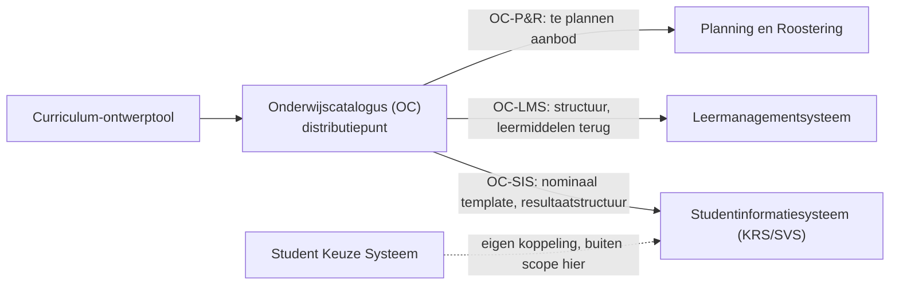

<!-- TITELSLIDE -->

  <h1 style="font-size: 3.2rem; line-height: 1.15; margin-bottom: 0.6rem; color: var(--np-ink);">De koppelingspecificaties</h1>
  

    Wat er ligt voor leerroute 1, en waar een onderwijskundig oordeel over nodig is
  

  

    <strong>OKx</strong> &middot; Adviesgroep &middot; 3 augustus 2026
  

---

<!-- AGENDA -->

  
Onderwerpen

  <h1 style="font-size: 2.2rem !important; margin-bottom: 1.4rem;">Programma</h1>
  

    

      1
      
<strong>De koppelingspecificaties</strong> Het zwaartepunt van het werk sinds mei

    

    

      2
      
<strong>Waar het materiaal staat</strong> Twee repositories en de betekenis van een versienummer

    

    

      3
      
<strong>Het werk van dit moment</strong> Vastleggen wie welk keuzedeel mag kiezen

    

  

---

<!-- DIVIDER -->

  

    
Deel 1

    <h1 style="color: #FFFFFF !important; font-size: 3rem;">De koppelingspecificaties</h1>
    
Wat gaat er tussen de systemen heen en weer?

  

---

<!-- DE PLAAT -->

# Leerroute 1 in één beeld

Links het ontwerp van het onderwijs, rechts de student die studeert en kiest. Persona: Jochem.

Elke pijl is iets dat een systeem aan een ander doorgeeft. Het werk van OKx is die pijlen zo beschrijven dat twee leveranciers er hetzelfde onder verstaan.

<!--
Neem de tijd voor deze plaat. Links: de curriculum-ontwerptool maakt
specificaties, die gaan naar de onderwijscatalogus. Rechts: de student schrijft
zich in (KRS), kiest een keuzedeel (SKS), volgt onderwijs (LMS), en de
resultaten landen in het studentvolgsysteem (SVS).

Deze plaat is getekend op basis van hoofdplaat 1.6b; leidend voor de
architectuur is inmiddels 1.7. De informatiestromen zijn ongewijzigd, de plaat
is nog niet bijgetekend. Alleen benoemen als er naar gevraagd wordt.
-->

---

<!-- DE KETEN -->

# Drie koppelingen, vanuit de catalogus

De onderwijscatalogus is het distributiepunt. Daar staat wat de instelling aanbiedt, en van daaruit gaat het de keten in.

Het planningssysteem maakt van de specificatie <strong>planbaar aanbod</strong>; het roostersysteem hangt daar tijden en lokalen aan. Het leermanagementsysteem richt de online leeromgeving in op de gepubliceerde structuur. Het studentinformatiesysteem — kernregistratie plus studentvolgsysteem — krijgt de resultaatstructuur en het examenplan.

---

<!-- KOPPELING EN KOPPELVLAK -->

# Koppeling of koppelvlak

Een **koppeling** is één informatiestroom tussen twee componenten. Alle koppelingen die op één component samenkomen, vormen samen het **koppelvlak** van dat component.

Dat onderscheid klinkt muggenzifterig. Het loste wel een concreet probleem op: hetzelfde woord stond voor twee verschillende dingen, en daardoor liepen afspraken over scope telkens vast. Sinds het vastligt, is per document duidelijk of het over één stroom gaat of over het geheel.

Hiernaast: alle koppelingen die op de onderwijscatalogus samenkomen. Dat plaatje is dus een koppelvlak; elke pijl erin is een koppeling.

  
  
Koppelvlak onderwijscatalogus, versie 1.7

---

<!-- EEN BRON -->

# Eén beschrijving, drie afnemers

Alle drie hebben ze een ander deel van dezelfde onderwijsspecificatie nodig. Die staat daarom één keer beschreven.

  

    Planning
    <h3 style="margin-top: 0.5rem;">Alleen de sleutels</h3>
    
Leeruitkomsten komen mee als kaal nummer. Dat is genoeg om volgorde en omvang te bepalen; de inhoud is voor planning niet nodig.

  

  

    SIS
    <h3 style="margin-top: 0.5rem;">De hele laag</h3>
    
Leeruitkomsten komen volledig mee, want daarop worden de resultaten behaald. Zonder die inhoud is een diploma niet te onderbouwen.

  

  

    LMS
    <h3 style="margin-top: 0.5rem;">De inhoudsvelden</h3>
    
Mee komt wat nodig is om de leeromgeving in te richten: structuur, lesstof en leermiddelen.

  

  Elk systeem krijgt <strong>precies wat het nodig heeft</strong>, en niet meer dan dat.

---

<!-- ANKERTABEL, DEEL 1 -->

# De ankertabel

De begrippen waarmee alle koppelingen spreken. Van links naar rechts loopt het onderwijs van kader naar resultaat.

| 1. Kwalificatiekader | 2. Beoogde leeruitkomst | 3. Onderwijsspecificatie | 4. Onderwijsaanbod | 5. Onderwijsverbintenis | 6. Onderwijsresultaat |
| --- | --- | --- | --- | --- | --- |
| `Kwalificatiedossier` | *n.v.t. — leeruitkomsten hangen lager in de boom* | `Opleidingsspecificatie` | `Opleidingsaanbod` | `Opleidingsverbintenis` | `Opleidingsverbintenis resultaat` |
| `Kwalificatie` | *n.v.t. — aggregatie van onderliggende leeruitkomsten* | `Opleidingsprogramma-specificatie` | `Opleidingsprogramma-aanbod` | `Opleidingsprogramma-verbintenis` | `Opleidingsprogramma-verbintenis resultaat` |
| `Kerntaak` | Collectie van leeruitkomst-collecties (één per werkproces) | `Onderwijseenheid-specificatie` | `Onderwijseenheid-aanbod` | `Onderwijseenheid-verbintenis` | `Onderwijseenheid-verbintenis resultaat` |
| `Werkproces` | `Leeruitkomst`-collectie (summatief) | `Leeronderdeel-specificatie` | `Leergelegenheid` | `Leergelegenheid-verbintenis` | `Leergelegenheid-verbintenis resultaat` |

Een rij leest zo: op dit niveau van het kwalificatiekader horen deze leeruitkomst, die specificatie, dat aanbod, die verbintenis en dat resultaat. De rijen op de volgende slide vallen buiten het kwalificatiekader.

<!--
Deze tabel staat letterlijk zo in het kaderscenario leerroute 1 in
Npuls-OKx/Public. Alleen de toelichting in kolom 2 is ingekort om te passen.
-->

---

<!-- ANKERTABEL, DEEL 2 -->

# De ankertabel, vervolg

Wat de instelling zelf invult: lessen, toetsen en examens.

| 1. Kwalificatiekader | 2. Beoogde leeruitkomst | 3. Onderwijsspecificatie | 4. Onderwijsaanbod | 5. Onderwijsverbintenis | 6. Onderwijsresultaat |
| --- | --- | --- | --- | --- | --- |
| *n.v.t. — eigen beleid instelling* | `Lesuitkomst` (formatief; onder een `Leeruitkomst`) | `Lesspecificatie` | `Lesgelegenheid` | `Lesgelegenheid-verbintenis` | `Lesgelegenheid-verbintenis resultaat` |
| *n.v.t. — toetsing* | Scope van toetsing: set `Leeruitkomst` en/of `Lesuitkomst` | `Toetsonderdeel-specificatie` | `Toetsgelegenheid` | `Toetsgelegenheid-verbintenis` | `Toetsgelegenheid-verbintenis resultaat` |
| Doorgaands `Werkproces` | Te behalen `Leeruitkomst`-set, vastgesteld door examencommissie | `Examenonderdeel-specificatie` | `Examengelegenheid` | `Examengelegenheid-verbintenis` | `Examengelegenheid-verbintenis resultaat` |

Examinering is bewust een <strong>gescheiden keten</strong>: eigen specificaties, eigen gelegenheden, eigen governance. Toetsen zijn primair formatief, examens summatief. Dat scheidt de verantwoordelijkheid, ook richting DUO.

---

<!-- DE LEERUITKOMSTKOLOM -->

# De kolom die erbij moest

Kolom 2, de beoogde leeruitkomst, ontbrak in de eerdere versie. Dat bleek een gat.

Zonder die kolom lijkt het alsof een onderwijseenheid rechtstreeks uit het kwalificatiedossier rolt. Dat is niet zo. Daartussen zit de onderwijskundige vertaalslag: het kader omzetten naar leeruitkomsten die concreet en observeerbaar zijn.

De leeruitkomst is bovendien het enige begrip dat **alle kolommen doorkruist**. Specificaties verankeren erop, resultaten worden erop behaald. Vandaar de naam *anker*tabel.

  

    <h3>Openstaand punt</h3>
    

      Hangt de summatieve leeruitkomst inderdaad aan het <strong>werkproces</strong>? En klopt het dat er op dossier- en kwalificatieniveau uitsluitend sprake is van aggregatie?
    

  

Complicatie: dezelfde leeruitkomst kan over meerdere onderdelen verdeeld zijn, en één onderdeel kan meerdere leeruitkomsten dekken. Precies daarom past dit niet in de specificatiekolom en moest het een eigen kolom worden.

---

<!-- DIVIDER -->

  

    
Deel 2

    <h1 style="color: #FFFFFF !important; font-size: 2.8rem;">Waar het materiaal staat</h1>
    
Kort, maar nuttig om te weten

  

---

<!-- REPO EN RELEASE -->

# Twee plekken, en de betekenis van een versienummer

  

    Waar het staat
    <h3 style="margin-top: 0.5rem;">Werkplaats en etalage</h3>
    

      Concepten en discussie staan apart van wat gepubliceerd is. Wat doorgestuurd wordt naar een collega of een instelling, komt uit het <strong>publieke</strong> repository. Daar staat geen halffabricaat tussen.
    

  

  

    Versienummers
    <h3 style="margin-top: 0.5rem;">Een belofte, geen datum</h3>
    

      Laatste cijfer omhoog: er is iets verduidelijkt. Middelste: er komt iets bij, bestaand werk blijft geldig. Eerste: er verandert iets fundamenteels, en wie al gebouwd heeft moet aanpassen.
    

  

Waarom dit ertoe doet: zodra dit materiaal naar leveranciers gaat, moet aan het nummer af te lezen zijn of er werk aan de winkel is. Zonder die afspraak is elke wijziging een telefoonrondje.

---

<!-- DIVIDER -->

  

    
Deel 3

    <h1 style="color: #FFFFFF !important; font-size: 2.8rem;">Het werk van dit moment</h1>
    
Wie mag welk keuzedeel kiezen

  

---

<!-- DE VRAAG -->

  

    "Binnen de meeste mbo-instellingen mogen niet alle keuzedelen door alle studenten gekozen worden, omdat dit logistiek niet uitvoerbaar is. Hoe zorgen we er in de keten voor dat duidelijk is welke keuzedelen Jochem mag kiezen?"
  

  
&mdash; Jan Hendrik van Schaik, juni 2026

  
  
Jochem, de persona van leerroute 1

<!--
Kees van Ginkel (Eduarte) herkende dit meteen en noemde verwante gevallen:
"minimaal twee vreemde talen", "deze keuze mag pas na Engels", en
slaag-zakregels per opleiding. Dat is de reden dat het generiek is opgepakt en
niet alleen voor keuzedelen.
-->

---

<!-- DE REGELSET -->

# De regel staat naast het onderwijs, niet erin

Kiesbaarheid is geen eigenschap van een keuzedeel. Het is een regel erover.

  

    <strong style="font-size: 0.95rem;">Onderwijsspecificatie</strong>
    <small>Wat er georganiseerd wordt</small>
  

  
&#43;

  

    <strong style="font-size: 0.95rem;">Regelset</strong>
    <small>Wie dit mag kiezen, en wanneer</small>
  

  
&#8594;

  

    <strong style="font-size: 0.95rem;">Aanbod</strong>
    <small>Wanneer en waar het draait</small>
  

De reden voor die scheiding: een voorwaarde gaat over <strong>wat een student heeft behaald</strong>, niet over welk vak is gevolgd. Bij een herziening van het onderwijs blijft de regel daardoor geldig. Er liggen zestien eisen; de vorm heeft de status <strong>concept</strong>.

  
&#10003;"Kies uit deze lijst"

  

  
&#10003;"Pas na Wiskunde 1"

  

  
&#10003;"Minimaal twee uit deze groep"

---

<!-- WAT ER GEVRAAGD WORDT -->

# Wat er van de adviesgroep gevraagd wordt

<dl class="np-besluit review" style="margin-top: 0.9rem;">
  <dt>Review gevraagd op</dt>
  <dd>De ankertabel, en in het bijzonder de nieuwe kolom <em>beoogde leeruitkomst</em>: hangt de summatieve leeruitkomst aan het werkproces, en klopt de aggregatie daarboven?</dd>
  <dt>Door</dt>
  <dd>Adviesgroep — onderwijskundig oordeel</dd>
  <dt>Voor</dt>
  <dd>19 augustus 2026, het alpha-moment van de koppelvlakspecificatie</dd>
</dl>

<dl class="np-besluit review" style="margin-top: 0.9rem;">
  <dt>Review gevraagd op</dt>
  <dd>De regelset. Gezocht: een keuzeregel uit de eigen instellingspraktijk die de voorgestelde vorm <strong>niet</strong> kan uitdrukken</dd>
  <dt>Door</dt>
  <dd>Adviesgroep — IM'ers en onderwijskundigen vanuit de instellingen</dd>
  <dt>Voor</dt>
  <dd>31 augustus 2026, voordat de vorm vastligt</dd>
</dl>

  Een tegenvoorbeeld is waardevoller dan instemming. Alle onderdelen hebben nog de status <strong>concept</strong>.

---

<!-- AFSLUITSLIDE -->

